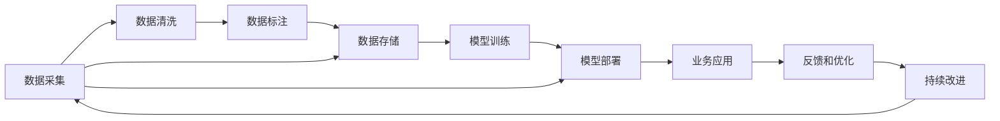

                 

## 1. 背景介绍

### 1.1 问题由来

随着信息技术的迅猛发展，人类社会已步入以数据为核心驱动力的新纪元。这一时期，被喻为“软件2.0”的时代，它标志着软件技术的根本性转变，即从传统以程序员为中心的编程范式，转变为以数据为中心的数据驱动范式。

在过去的几十年中，软件开发主要依赖于程序员的经验和智慧。程序员根据业务需求，通过代码编写、编译和测试，实现软件的功能和性能。然而，随着大数据、云计算、人工智能等技术的崛起，数据成为驱动软件创新的主要动力，软件开发的范式也随之发生深刻变化。

数据驱动的软件开发范式，强调利用海量数据进行模型训练，预测业务趋势，优化产品设计，提升用户体验。在这一范式下，数据的获取、处理、分析和应用成为软件开发的核心环节。软件不再是传统意义上的“功能模块”，而是成为一种数据处理和分析的工具。

### 1.2 问题核心关键点

软件2.0时代的核心关键点包括以下几个方面：

1. **数据的重要性**：数据驱动的软件开发中，数据的质量和数量直接决定了软件的功能和性能。高质量的数据能够提供准确的业务洞察，指导软件设计和优化。

2. **模型的作用**：数据驱动范式下，模型的训练和应用成为软件开发的关键步骤。模型通过数据学习业务规律，预测未来趋势，提供决策支持。

3. **数据管治**：为了保证数据驱动软件的质量，需要建立完善的数据管治体系，包括数据采集、清洗、标注、存储和管理。数据管治贯穿软件的整个生命周期。

4. **人机协同**：软件2.0时代，人机协同成为软件开发的重要特征。算法和模型需要结合人类的知识和经验，才能更好地理解和应用数据。

5. **云计算与大数据**：云计算和大数据技术为数据驱动的软件开发提供了强大的技术支撑，使得海量数据的存储、处理和分析成为可能。

6. **人工智能与机器学习**：人工智能和机器学习技术在软件2.0时代得到了广泛应用，通过深度学习、自然语言处理等技术，软件能够更好地理解和处理自然语言、图像、语音等非结构化数据。

### 1.3 问题研究意义

研究软件2.0时代的核心技术和应用模式，对于推动软件技术的创新和应用具有重要意义：

1. **提高效率**：数据驱动的软件开发能够显著提高软件开发和部署的效率，减少人工干预和调试时间，加快软件迭代速度。

2. **优化决策**：数据驱动的软件能够提供基于数据的决策支持，帮助企业在竞争中做出更明智的决策。

3. **提升用户体验**：通过数据分析和模型预测，软件能够更好地理解用户需求，提供个性化的服务，提升用户体验。

4. **推动产业发展**：数据驱动的软件技术能够推动各行各业的数字化转型，为传统行业带来新的业务模式和增长点。

5. **促进技术创新**：数据驱动的软件开发范式催生了许多新的技术和应用，如深度学习、自然语言处理、计算机视觉等，这些技术正迅速改变软件开发的未来。

## 2. 核心概念与联系

### 2.1 核心概念概述

为了更好地理解软件2.0时代的核心概念，本节将介绍几个关键概念及其联系：

1. **数据驱动(Datadriven)**：一种基于数据进行决策和优化的软件开发范式，强调数据在软件开发和应用中的核心地位。

2. **模型驱动(Model-driven)**：通过构建和训练模型，从数据中提取知识，进行预测和决策的软件开发模式。

3. **云计算(Cloud computing)**：利用互联网资源提供计算、存储、网络等服务的模式，为数据驱动软件开发提供了基础设施支撑。

4. **大数据(Big Data)**：指规模庞大、多样化的数据集，通过分布式计算和存储技术进行处理和分析。

5. **人工智能(Artificial Intelligence)**：通过算法和模型，使计算机系统具备类似于人类的认知和决策能力。

6. **机器学习(Machine Learning)**：一种基于数据和算法，使计算机系统具备自我学习能力的模式。

这些概念之间具有紧密的联系，共同构成了软件2.0时代的技术框架。通过数据的采集和处理，构建和训练模型，云计算和大数据技术提供了算力和存储支持，人工智能和机器学习技术实现了数据的分析和应用，最终驱动软件的功能和性能提升。

### 2.2 核心概念原理和架构的 Mermaid 流程图



此图展示了数据驱动软件开发的整体流程：

1. **数据采集**：从不同来源获取数据。
2. **数据清洗**：处理数据中的噪声和错误，保证数据质量。
3. **数据标注**：为数据添加标签，便于模型训练。
4. **数据存储**：将清洗后的数据存储在云平台。
5. **模型训练**：利用标注数据训练模型。
6. **模型部署**：将训练好的模型部署到生产环境中。
7. **业务应用**：模型在业务场景中应用，提供决策支持。
8. **反馈和优化**：根据业务反馈，优化模型和数据处理流程。
9. **持续改进**：通过不断的反馈和优化，提升软件的功能和性能。

这些步骤相互关联，构成了一个闭环的数据驱动软件开发体系。

## 3. 核心算法原理 & 具体操作步骤

### 3.1 算法原理概述

数据驱动的软件开发基于以下核心算法原理：

1. **数据采集与预处理**：通过API、爬虫、传感器等方式，获取数据并将其转化为模型训练所需的格式。

2. **模型训练与优化**：通过机器学习算法，构建模型并利用标注数据进行训练和优化。常用的算法包括决策树、随机森林、神经网络、支持向量机等。

3. **模型评估与选择**：通过交叉验证等方法，评估模型性能并选择最优模型。常用的指标包括准确率、召回率、F1分数等。

4. **模型部署与应用**：将训练好的模型部署到生产环境中，通过API或SDK提供服务。

5. **持续监控与优化**：对模型在生产环境中的性能进行监控，根据反馈进行持续优化。

### 3.2 算法步骤详解

基于上述算法原理，数据驱动的软件开发可以分为以下具体步骤：

1. **需求分析**：明确业务需求和目标，确定需要处理的数据类型和数量。

2. **数据采集与清洗**：选择合适的数据源，采集数据并进行清洗，去除噪声和错误。

3. **数据标注与存储**：对数据进行标注，存储到云平台或本地数据库中。

4. **模型选择与训练**：根据需求选择适合的模型，利用标注数据进行训练，并优化模型参数。

5. **模型评估与选择**：通过交叉验证等方法，评估模型性能，选择最优模型。

6. **模型部署与应用**：将模型部署到生产环境中，通过API或SDK提供服务。

7. **持续监控与优化**：对模型在生产环境中的性能进行监控，根据反馈进行持续优化。

### 3.3 算法优缺点

数据驱动的软件开发具有以下优点：

1. **提升决策质量**：基于数据的决策能够提供更准确的业务洞察，帮助企业做出更明智的决策。

2. **加速产品迭代**：通过数据驱动的模型，能够快速迭代和优化产品功能，缩短产品上市时间。

3. **降低人工成本**：数据驱动的软件开发能够减少人工干预和调试，提高开发效率。

4. **提升用户体验**：数据驱动的软件能够提供个性化服务，提升用户体验。

5. **推动产业创新**：数据驱动的软件技术能够推动各行各业的数字化转型，带来新的业务模式和增长点。

同时，该方法也存在一些缺点：

1. **数据质量要求高**：数据驱动的软件开发对数据质量有较高要求，需要保证数据的准确性和完整性。

2. **模型依赖性强**：模型的训练和选择对软件开发具有重要影响，需要耗费大量时间和资源。

3. **隐私和伦理问题**：数据驱动的软件开发可能涉及用户隐私和伦理问题，需要制定严格的数据管治政策。

4. **技术门槛高**：数据驱动的软件开发需要具备数据处理和模型训练的技术能力，对开发者要求较高。

5. **持续优化成本高**：模型在生产环境中的性能需要持续监控和优化，成本较高。

### 3.4 算法应用领域

数据驱动的软件开发在以下领域得到了广泛应用：

1. **金融行业**：金融领域的数据驱动软件开发包括风险评估、信用评分、欺诈检测等。

2. **零售行业**：零售行业的数据驱动软件开发包括客户行为分析、商品推荐、库存管理等。

3. **医疗行业**：医疗行业的数据驱动软件开发包括疾病预测、治疗方案推荐、患者管理等。

4. **物流行业**：物流行业的数据驱动软件开发包括路线规划、货物跟踪、需求预测等。

5. **智能制造**：智能制造的数据驱动软件开发包括设备监控、供应链优化、质量控制等。

6. **智慧城市**：智慧城市的数据驱动软件开发包括交通管理、公共安全、环境监测等。

7. **教育行业**：教育行业的数据驱动软件开发包括学习行为分析、个性化推荐、教学质量评估等。

8. **媒体娱乐**：媒体娱乐的数据驱动软件开发包括内容推荐、广告投放、用户行为分析等。

## 4. 数学模型和公式 & 详细讲解

### 4.1 数学模型构建

数据驱动的软件开发需要构建和训练数学模型来处理和分析数据。常见的数学模型包括线性回归、逻辑回归、决策树、随机森林、神经网络等。以下以线性回归模型为例，进行详细介绍。

假设有一个样本数据集 $D=\{(x_i,y_i)\}_{i=1}^N$，其中 $x_i \in \mathbb{R}^d$ 为输入，$y_i \in \mathbb{R}$ 为输出。线性回归模型的目标是找到一个线性函数 $f(x)=\theta_0+\theta_1x_1+\cdots+\theta_dx_d$，使得预测值 $\hat{y}=f(x)$ 尽量接近真实值 $y$。根据最小二乘法，构建损失函数如下：

$$
L(\theta) = \frac{1}{2N}\sum_{i=1}^N (y_i - f(x_i))^2
$$

最小化损失函数 $L(\theta)$，可得到最优参数 $\theta^*$。

### 4.2 公式推导过程

线性回归模型的参数 $\theta$ 包括截距 $\theta_0$ 和自变量系数 $\theta_1,\cdots,\theta_d$。其最优解可以通过求解以下矩阵方程获得：

$$
\theta^* = (X^TX)^{-1}X^Ty
$$

其中 $X$ 为样本特征矩阵，$y$ 为样本输出向量。

推导过程如下：

1. 构建梯度函数：

$$
\frac{\partial L(\theta)}{\partial \theta_k} = \frac{1}{N}\sum_{i=1}^N (y_i - f(x_i))x_{ik}
$$

2. 构建损失函数的Hessian矩阵：

$$
H = \frac{1}{N}\sum_{i=1}^N x_ix_i^T
$$

3. 利用梯度下降法求最小值：

$$
\theta \leftarrow \theta - \eta\nabla_{\theta}L(\theta)
$$

4. 代入梯度和Hessian矩阵，得到最优解：

$$
\theta^* = (X^TX)^{-1}X^Ty
$$

### 4.3 案例分析与讲解

假设有一个电商网站，希望通过用户行为数据预测用户的购买意向。首先，从网站收集用户浏览历史、购买记录等数据，构建特征向量 $x$，将用户购买意向标记为 $y$。然后，利用线性回归模型，训练一个预测函数 $f(x)=\theta_0+\theta_1x_1+\cdots+\theta_dx_d$，最小化损失函数 $L(\theta)$，得到最优参数 $\theta^*$。最后，利用训练好的模型，对新用户行为进行预测，判断其购买意向。

## 5. 项目实践：代码实例和详细解释说明

### 5.1 开发环境搭建

为了进行数据驱动软件开发的项目实践，我们需要搭建一个Python开发环境。以下是具体的步骤：

1. 安装Python：从官网下载并安装Python，推荐使用最新版本的Python 3.x。

2. 安装Pip：使用pip管理Python的第三方库。

3. 安装所需的库：安装NumPy、Pandas、Scikit-learn等常用的数据处理和机器学习库。

4. 安装TensorFlow或PyTorch：选择一种深度学习框架，进行安装和配置。

5. 安装Jupyter Notebook：用于编写和运行代码。

6. 安装Git：用于版本控制和代码协作。

### 5.2 源代码详细实现

以下是一个简单的数据驱动软件开发项目，包括数据采集、清洗、训练、评估和应用。

```python
import pandas as pd
from sklearn.model_selection import train_test_split
from sklearn.linear_model import LinearRegression
from sklearn.metrics import mean_squared_error

# 数据采集
data = pd.read_csv('data.csv')

# 数据清洗
data = data.dropna()

# 特征选择
X = data[['feature1', 'feature2']]
y = data['label']

# 训练集和测试集划分
X_train, X_test, y_train, y_test = train_test_split(X, y, test_size=0.2, random_state=42)

# 模型训练
model = LinearRegression()
model.fit(X_train, y_train)

# 模型评估
y_pred = model.predict(X_test)
mse = mean_squared_error(y_test, y_pred)
print('MSE:', mse)

# 模型应用
new_data = pd.DataFrame({'feature1': [1, 2, 3], 'feature2': [4, 5, 6]})
preds = model.predict(new_data)
print('Predictions:', preds)
```

### 5.3 代码解读与分析

以上代码实现了一个简单的线性回归模型，用于预测用户的购买意向。具体步骤如下：

1. 数据采集：使用Pandas库，从CSV文件中读取数据。

2. 数据清洗：删除缺失值和异常值。

3. 特征选择：选择用于训练模型的特征，构建特征矩阵 $X$ 和输出向量 $y$。

4. 训练集和测试集划分：将数据划分为训练集和测试集。

5. 模型训练：使用Scikit-learn库中的LinearRegression模型进行训练。

6. 模型评估：使用均方误差（MSE）评估模型性能。

7. 模型应用：使用训练好的模型对新数据进行预测。

## 6. 实际应用场景

### 6.1 智能推荐系统

智能推荐系统是数据驱动软件开发的重要应用场景之一。通过分析用户的历史行为数据，构建用户画像，预测用户感兴趣的商品或内容，从而提供个性化的推荐。

推荐系统通常采用协同过滤、内容推荐、基于模型的推荐等方法。协同过滤通过分析用户之间的相似度，推荐相似用户喜欢的商品或内容。内容推荐根据物品的特征，为用户推荐相似的物品。基于模型的推荐则利用机器学习模型，预测用户对物品的评分，从而推荐高评分物品。

### 6.2 风险管理

金融行业中的风险管理是数据驱动软件开发的另一重要应用。通过分析历史交易数据，构建风险预测模型，实时监测交易风险，防止欺诈和损失。

常用的风险管理方法包括信用评分、信用监控、欺诈检测等。信用评分通过分析用户的历史信用记录，预测其未来的信用风险。信用监控通过实时监测用户账户，发现异常行为，及时预警。欺诈检测通过分析交易数据，识别可疑交易，防止欺诈。

### 6.3 医疗诊断

医疗诊断是数据驱动软件开发的重要领域之一。通过分析患者的病历数据，构建疾病预测模型，辅助医生进行诊断和治疗。

常用的医疗诊断方法包括疾病预测、治疗方案推荐、患者管理等。疾病预测通过分析患者的历史病历数据，预测其患病的概率。治疗方案推荐根据患者的情况，推荐最适合的治疗方案。患者管理通过分析患者的健康数据，提供个性化的健康建议。

### 6.4 智能制造

智能制造是数据驱动软件开发在制造业的重要应用。通过分析设备数据，构建设备监控模型，实时监测设备状态，预防故障和维护。

常用的智能制造方法包括设备监控、供应链优化、质量控制等。设备监控通过分析设备的运行数据，预测设备故障，提前进行维护。供应链优化通过分析供应链数据，优化供应链管理，降低成本。质量控制通过分析生产数据，提高产品质量，降低次品率。

### 6.5 智慧城市

智慧城市是数据驱动软件开发在城市管理中的应用。通过分析城市数据，构建城市管理模型，优化城市资源配置，提高城市管理效率。

常用的智慧城市方法包括交通管理、公共安全、环境监测等。交通管理通过分析交通数据，优化交通流量，减少拥堵。公共安全通过分析视频数据，识别安全隐患，预防事故。环境监测通过分析环境数据，实时监测环境变化，保护环境。

## 7. 工具和资源推荐

### 7.1 学习资源推荐

为了帮助开发者系统掌握数据驱动软件开发的技术和应用，这里推荐一些优质的学习资源：

1. 《Python数据分析与科学计算》系列书籍：深入讲解Python在数据分析和科学计算中的应用，适合初学者和进阶开发者。

2. 《机器学习实战》系列书籍：通过实战案例，讲解机器学习算法和模型训练，适合实践开发者。

3. 《深度学习框架实战》系列书籍：详细讲解TensorFlow和PyTorch等深度学习框架的应用，适合深度学习开发者。

4. 《TensorFlow官方文档》：全面介绍TensorFlow的使用方法和最佳实践，适合TensorFlow开发者。

5. 《PyTorch官方文档》：全面介绍PyTorch的使用方法和最佳实践，适合PyTorch开发者。

### 7.2 开发工具推荐

为了提高数据驱动软件开发的项目实践效率，以下是几款推荐的开发工具：

1. Jupyter Notebook：用于编写和运行Python代码，支持代码补全和交互式编程。

2. Git：用于版本控制和代码协作，支持分布式存储和团队开发。

3. Docker：用于构建和管理容器，支持跨平台运行和部署。

4. Kubernetes：用于容器编排和集群管理，支持弹性伸缩和高可用性。

5. TensorBoard：用于可视化深度学习模型的训练过程和结果，支持各种类型的图表展示。

### 7.3 相关论文推荐

数据驱动软件开发技术的发展离不开学界的持续研究。以下是几篇奠基性的相关论文，推荐阅读：

1. 《数据驱动的软件开发：方法、技术和应用》：详细讲解数据驱动软件开发的方法、技术和应用，适合深入理解数据驱动开发。

2. 《机器学习在金融中的应用》：介绍机器学习在金融领域的应用，适合金融行业开发者。

3. 《医疗大数据分析与预测》：介绍医疗大数据分析与预测的方法和技术，适合医疗行业开发者。

4. 《智能制造的数字化转型》：介绍智能制造的数字化转型方法和应用，适合制造业开发者。

5. 《智慧城市的智能基础设施建设》：介绍智慧城市的智能基础设施建设方法和应用，适合城市管理开发者。

## 8. 总结：未来发展趋势与挑战

### 8.1 研究成果总结

数据驱动软件开发技术在过去十年中取得了显著进展，广泛应用于金融、零售、医疗、制造等多个行业。数据驱动的模型和算法，使得软件的功能和性能大幅提升，推动了各行各业的数字化转型。

### 8.2 未来发展趋势

展望未来，数据驱动软件开发技术将呈现以下几个发展趋势：

1. **数据质量和多样性**：数据驱动软件开发对数据质量和多样性要求更高。未来，数据采集和清洗技术将更加自动化和智能化，提高数据的质量和可靠性。

2. **模型集成与融合**：未来的数据驱动软件开发将更加注重模型的集成与融合。通过将多种模型进行组合，构建更加复杂和强大的预测系统。

3. **实时性和高可靠性**：数据驱动软件开发需要具备实时性和高可靠性。未来，大数据和云计算技术将进一步优化，提供更高效的数据处理和计算能力。

4. **人机协同**：数据驱动软件开发需要人机协同，结合人类知识和经验，提升系统的决策能力和用户体验。

5. **多模态数据融合**：未来的数据驱动软件开发将更加注重多模态数据的融合。通过将文本、图像、语音等多种数据进行整合，构建更加全面和准确的知识体系。

### 8.3 面临的挑战

尽管数据驱动软件开发技术已经取得了显著进展，但在迈向更加智能化、普适化应用的过程中，仍面临诸多挑战：

1. **数据隐私与安全**：数据驱动软件开发需要处理大量用户数据，涉及隐私和安全问题。如何保护用户数据隐私，防止数据泄露和滥用，将是重要课题。

2. **模型复杂性**：随着模型的复杂度增加，训练和部署成本也相应增加。如何提高模型的可解释性，减少复杂度，将是重要研究方向。

3. **计算资源**：数据驱动软件开发需要大量的计算资源，尤其是深度学习模型的训练和推理。如何优化计算资源，提高计算效率，将是重要课题。

4. **数据多样性**：不同行业和领域的数据类型和格式各不相同，如何统一数据格式，提高数据融合效率，将是重要研究方向。

5. **模型泛化性**：数据驱动软件开发的模型需要具备良好的泛化能力，能够适应不同领域和场景的应用。如何提高模型的泛化性，将是重要研究方向。

### 8.4 研究展望

面向未来，数据驱动软件开发技术的研究将在以下几个方向取得突破：

1. **自动化数据处理**：自动化数据处理技术将进一步发展，提高数据采集、清洗、标注的效率和质量。

2. **分布式计算**：分布式计算技术将进一步优化，提供更加高效的数据处理和计算能力。

3. **混合模型**：混合模型将结合符号计算和机器学习，构建更加全面和准确的知识体系。

4. **多模态数据融合**：多模态数据融合技术将进一步发展，提高多模态数据的整合和应用能力。

5. **智能决策**：智能决策技术将进一步发展，结合人类知识和经验，提升系统的决策能力和用户体验。

6. **隐私保护**：隐私保护技术将进一步发展，保护用户数据隐私，防止数据泄露和滥用。

这些方向的研究将推动数据驱动软件开发技术的发展，为未来软件技术的创新和应用提供有力支撑。

## 9. 附录：常见问题与解答

**Q1：数据驱动软件开发对数据质量有哪些要求？**

A: 数据驱动软件开发对数据质量有较高要求，需要保证数据的准确性、完整性和一致性。具体要求包括：

1. **准确性**：数据应反映真实业务情况，避免噪声和错误。

2. **完整性**：数据应包含所有必要的信息，避免缺失。

3. **一致性**：数据应保持时间一致性，避免前后不一致。

**Q2：数据驱动软件开发中的模型训练和优化有哪些方法？**

A: 数据驱动软件开发中的模型训练和优化方法包括：

1. **最小二乘法**：通过最小化损失函数，得到最优参数。

2. **梯度下降法**：通过迭代更新参数，最小化损失函数。

3. **随机梯度下降法**：通过随机采样，加速模型训练。

4. **交叉验证**：通过交叉验证，评估模型性能。

5. **正则化**：通过L1、L2正则化，避免过拟合。

**Q3：数据驱动软件开发中的数据隐私和安全问题有哪些？**

A: 数据驱动软件开发中的数据隐私和安全问题包括：

1. **数据泄露**：数据泄露可能导致用户隐私被泄露，危害用户安全。

2. **数据滥用**：数据滥用可能导致用户隐私被滥用，影响用户体验。

3. **数据篡改**：数据篡改可能导致数据分析结果失真，影响决策。

4. **数据伪造**：数据伪造可能导致数据分析结果不准确，影响决策。

**Q4：数据驱动软件开发中的持续学习和模型更新有哪些方法？**

A: 数据驱动软件开发中的持续学习和模型更新方法包括：

1. **在线学习**：通过实时更新模型，提高模型泛化能力。

2. **增量学习**：通过增量更新模型，降低模型训练成本。

3. **迁移学习**：通过迁移学习，提高模型泛化能力。

4. **模型融合**：通过模型融合，提高模型准确性和鲁棒性。

**Q5：数据驱动软件开发中的多模态数据融合有哪些方法？**

A: 数据驱动软件开发中的多模态数据融合方法包括：

1. **特征对齐**：通过特征对齐，将不同模态的数据进行整合。

2. **深度融合**：通过深度学习模型，将不同模态的数据进行融合。

3. **协同训练**：通过协同训练，提高多模态数据的整合能力。

**Q6：数据驱动软件开发中的自动化数据处理有哪些技术？**

A: 数据驱动软件开发中的自动化数据处理技术包括：

1. **自动标注**：通过自动标注工具，自动为数据添加标签。

2. **数据清洗**：通过数据清洗工具，自动处理数据中的噪声和错误。

3. **数据预处理**：通过数据预处理工具，自动进行数据格式转换和归一化。

4. **数据增强**：通过数据增强技术，自动生成更多训练数据。

5. **数据集成**：通过数据集成技术，自动将不同来源的数据进行整合。

这些技术将大大提高数据驱动软件开发的效率和质量，推动数据驱动软件开发技术的广泛应用。

