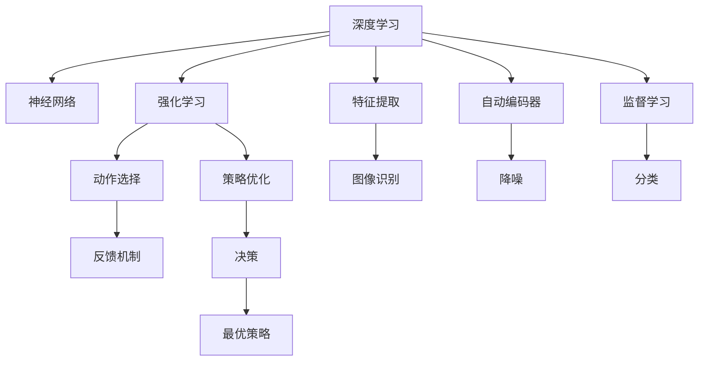

                 

# 软件 2.0 的未来趋势：深度学习、强化学习

> 关键词：软件 2.0, 深度学习, 强化学习, 人工智能, 算法优化, 自适应学习, 机器学习

## 1. 背景介绍

### 1.1 问题由来
软件产业正处于一个历史性的转折点。传统的软件 1.0 模式，基于功能导向的编程，已经无法满足现代软件开发的需求。随着人工智能（AI）技术的不断突破，以数据和算法为中心的软件 2.0 正在逐步取代功能导向的软件 1.0，成为未来软件发展的趋势。

深度学习和强化学习作为AI的核心技术，正在深刻改变软件开发的方方面面。深度学习通过构建复杂的神经网络模型，能够自动从大量数据中学习抽象的特征表示，从而在图像识别、自然语言处理、语音识别等领域取得了突破性进展。强化学习则通过模拟智能体的行为，通过不断试错来优化策略，广泛应用于自动驾驶、机器人控制、游戏AI等领域。

本文将探讨深度学习和强化学习在软件 2.0 时代的应用前景，以及如何通过算法优化和自适应学习，推动软件开发的智能化和自动化进程。

## 2. 核心概念与联系

### 2.1 核心概念概述

为了更好地理解深度学习和强化学习在软件 2.0 中的作用，我们先来介绍几个核心概念：

- **深度学习**：一种基于神经网络的学习方法，通过多层次的非线性特征提取，实现复杂的数据建模和分类。深度学习在图像处理、语音识别、自然语言处理等领域有广泛应用。

- **强化学习**：一种通过智能体与环境的交互，通过奖惩机制学习最优策略的机器学习方法。强化学习在自动控制、游戏AI、机器人等领域有广泛应用。

- **自适应学习**：指学习算法能够根据环境的变化自适应地调整模型参数，提高泛化能力。自适应学习在深度学习中通常通过正则化、参数调整、学习率优化等方式实现。

- **算法优化**：指通过改进算法模型、参数调整、学习率优化等方式，提高算法的性能和效率。算法优化在深度学习和强化学习中至关重要。

- **模型可解释性**：指模型决策过程的透明性，便于理解和调试。模型可解释性在深度学习和强化学习中是一个重要研究课题。

这些概念之间的逻辑关系可以通过以下Mermaid流程图来展示：



这个流程图展示了深度学习和强化学习的基本概念及其应用场景：

1. 深度学习通过神经网络模型自动提取数据特征。
2. 神经网络模型可以分为特征提取、自动编码器和监督学习等模块。
3. 强化学习通过智能体与环境的交互，学习最优策略。
4. 策略优化和动作选择是强化学习中的核心环节。
5. 深度学习在图像识别、降噪和分类任务中发挥重要作用。
6. 强化学习在动作选择和策略优化中具有优势。

## 3. 核心算法原理 & 具体操作步骤
### 3.1 算法原理概述

深度学习和强化学习的原理可以简要总结如下：

- **深度学习**：通过多层非线性变换，自动从数据中学习特征表示，并通过反向传播算法进行参数更新，最小化损失函数。

- **强化学习**：通过智能体在环境中的互动，通过状态-动作-奖励的循环，不断调整策略，学习最优策略。

### 3.2 算法步骤详解

#### 3.2.1 深度学习算法步骤

1. **数据准备**：收集并准备用于训练的数据集，并进行预处理，如归一化、数据增强等。
2. **模型构建**：选择合适的神经网络模型结构，如卷积神经网络（CNN）、循环神经网络（RNN）、Transformer等，并进行模型定义。
3. **模型训练**：使用训练数据对模型进行前向传播和反向传播，通过优化器更新模型参数，最小化损失函数。
4. **模型评估**：使用测试数据对模型进行评估，评估指标如准确率、召回率、F1-score等。
5. **模型优化**：根据评估结果，对模型进行调整，如调整超参数、增加正则化等。

#### 3.2.2 强化学习算法步骤

1. **环境定义**：定义智能体与环境之间的交互方式，包括状态、动作、奖励等。
2. **策略选择**：选择智能体的行为策略，如Q-learning、Policy Gradient等。
3. **智能体训练**：智能体在环境中执行动作，通过与环境的交互，学习最优策略。
4. **参数更新**：根据智能体在环境中的表现，更新模型参数，优化策略。
5. **策略评估**：评估智能体的表现，如通过模拟测试，计算奖励期望值。
6. **策略优化**：通过优化算法，如Q-learning、SARSA等，不断优化策略。

### 3.3 算法优缺点

#### 3.3.1 深度学习算法优缺点

**优点**：

- **自动特征提取**：深度学习可以自动从数据中学习特征表示，避免了手工设计特征的繁琐过程。
- **泛化能力强**：深度学习模型通常具有较强的泛化能力，能够应对未知数据。
- **处理复杂任务**：深度学习在图像识别、自然语言处理等领域表现优异，可以处理复杂的非结构化数据。

**缺点**：

- **模型复杂**：深度学习模型通常具有大量参数，训练和推理过程计算资源消耗大。
- **训练时间长**：深度学习模型训练时间较长，特别是在大规模数据集上。
- **模型可解释性差**：深度学习模型通常被视为"黑盒"，难以解释其内部工作机制。

#### 3.3.2 强化学习算法优缺点

**优点**：

- **自适应性强**：强化学习可以通过试错逐步优化策略，适应复杂多变的任务。
- **决策能力强**：强化学习在决策任务中表现优异，如自动驾驶、游戏AI等。
- **计算资源利用率高**：强化学习通常不需要大量标注数据，计算资源利用率高。

**缺点**：

- **探索与利用平衡**：强化学习中的探索与利用平衡是一个难点，过于探索可能浪费计算资源，过于利用可能陷入局部最优。
- **样本效率低**：强化学习通常需要大量与环境的交互，获取足够样本才能收敛。
- **模型可解释性差**：强化学习模型同样难以解释其内部工作机制。

### 3.4 算法应用领域

深度学习和强化学习在软件 2.0 时代有着广泛的应用，覆盖了多个领域，例如：

- **计算机视觉**：深度学习在图像分类、目标检测、图像分割等任务中表现优异。
- **自然语言处理**：深度学习在文本分类、情感分析、机器翻译等任务中取得突破性进展。
- **语音识别**：深度学习在语音识别、语音合成、语音增强等任务中表现出色。
- **自动驾驶**：强化学习在自动驾驶中，通过智能体与环境的交互，学习最优控制策略。
- **游戏AI**：强化学习在游戏AI中，通过智能体与环境的互动，学习最优游戏策略。
- **机器人控制**：强化学习在机器人控制中，通过智能体与环境的交互，学习最优动作策略。

除了上述这些经典任务外，深度学习和强化学习还被创新性地应用到更多场景中，如推荐系统、异常检测、智能客服等，为软件 2.0 技术带来了全新的突破。

## 4. 数学模型和公式 & 详细讲解  
### 4.1 数学模型构建

本节将使用数学语言对深度学习和强化学习的基本模型进行严格的刻画。

**深度学习**：

设深度神经网络模型为 $M_{\theta}$，其中 $\theta$ 为模型参数。假设训练数据集为 $D=\{(x_i, y_i)\}_{i=1}^N$，其中 $x_i$ 为输入，$y_i$ 为输出标签。深度学习模型的目标是最小化损失函数 $\mathcal{L}(\theta)$，即：

$$
\mathcal{L}(\theta) = \frac{1}{N} \sum_{i=1}^N \ell(M_{\theta}(x_i), y_i)
$$

其中 $\ell$ 为损失函数，如交叉熵、均方误差等。

**强化学习**：

设智能体在环境中的状态为 $s$，动作为 $a$，奖励为 $r$，策略为 $\pi$。强化学习模型的目标是在策略 $\pi$ 下，最大化长期奖励的期望值 $V(\pi)$，即：

$$
V(\pi) = \mathbb{E}_{s \sim \rho_{\pi}} \left[\sum_{t=0}^{\infty} \gamma^t r(s_t, a_t) \right]
$$

其中 $\rho_{\pi}$ 为策略 $\pi$ 下状态 $s$ 的分布，$\gamma$ 为折扣因子。

### 4.2 公式推导过程

**深度学习损失函数推导**：

设神经网络模型为 $M_{\theta}$，损失函数为 $\ell$。对于单个样本 $(x_i, y_i)$，模型输出为 $M_{\theta}(x_i)$，则损失函数为：

$$
\ell(M_{\theta}(x_i), y_i)
$$

假设训练数据集 $D$ 为 $(x_1, y_1), (x_2, y_2), ..., (x_N, y_N)$，则经验风险为：

$$
\mathcal{L}(\theta) = \frac{1}{N} \sum_{i=1}^N \ell(M_{\theta}(x_i), y_i)
$$

**强化学习状态-动作-奖励推导**：

设智能体在时间 $t$ 的状态为 $s_t$，动作为 $a_t$，奖励为 $r_t$，状态转移为 $s_{t+1} = f(s_t, a_t)$，则智能体在策略 $\pi$ 下，从状态 $s_0$ 开始的累积奖励为：

$$
V(\pi, s_0) = \mathbb{E}_{a \sim \pi} \left[ \sum_{t=0}^{\infty} \gamma^t r(s_t, a_t) \right]
$$

其中 $\pi(a|s)$ 为策略 $\pi$ 在状态 $s$ 下选择动作 $a$ 的概率分布。

### 4.3 案例分析与讲解

**深度学习：图像分类**

假设我们有一个简单的卷积神经网络（CNN）模型，用于对CIFAR-10数据集进行图像分类。模型结构如下：

```
Conv2D-ReLU
MaxPool
Conv2D-ReLU
MaxPool
Flatten
Dense-Softmax
```

我们使用训练数据集对模型进行训练，损失函数为交叉熵损失：

$$
\mathcal{L}(\theta) = -\frac{1}{N} \sum_{i=1}^N \sum_{c=1}^{10} y_i^{(c)} \log \sigma_c(z_i^{(c)})
$$

其中 $y_i^{(c)}$ 为第 $i$ 个样本属于第 $c$ 类的标签，$z_i^{(c)}$ 为第 $i$ 个样本的第 $c$ 类输出。

**强化学习：自动驾驶**

设智能体在自动驾驶任务中的状态 $s$ 为车辆的位置和速度，动作 $a$ 为车辆的加速度，奖励 $r$ 为车辆的行驶距离。智能体的策略 $\pi$ 选择加速度 $a$，目标是在策略 $\pi$ 下最大化长期奖励 $V(\pi)$。

假设智能体在时间 $t$ 的状态为 $s_t$，动作为 $a_t$，状态转移为 $s_{t+1} = f(s_t, a_t)$，奖励为 $r_t = r(s_t, a_t)$，则智能体在策略 $\pi$ 下，从起始状态 $s_0$ 开始的累积奖励为：

$$
V(\pi, s_0) = \mathbb{E}_{a \sim \pi} \left[ \sum_{t=0}^{\infty} \gamma^t r(s_t, a_t) \right]
$$

其中 $\pi(a|s)$ 为策略 $\pi$ 在状态 $s$ 下选择动作 $a$ 的概率分布。

## 5. 项目实践：代码实例和详细解释说明
### 5.1 开发环境搭建

在进行深度学习和强化学习实践前，我们需要准备好开发环境。以下是使用Python进行PyTorch开发的环境配置流程：

1. 安装Anaconda：从官网下载并安装Anaconda，用于创建独立的Python环境。

2. 创建并激活虚拟环境：
```bash
conda create -n pytorch-env python=3.8 
conda activate pytorch-env
```

3. 安装PyTorch：根据CUDA版本，从官网获取对应的安装命令。例如：
```bash
conda install pytorch torchvision torchaudio cudatoolkit=11.1 -c pytorch -c conda-forge
```

4. 安装TensorFlow：
```bash
pip install tensorflow==2.7.0
```

5. 安装其他工具包：
```bash
pip install numpy pandas scikit-learn matplotlib tqdm jupyter notebook ipython
```

完成上述步骤后，即可在`pytorch-env`环境中开始深度学习和强化学习的实践。

### 5.2 源代码详细实现

**深度学习：图像分类**

首先，定义数据加载函数：

```python
import torch
import torchvision
import torchvision.transforms as transforms
from torch.utils.data import DataLoader

class CIFAR10DataLoader:
    def __init__(self, batch_size=32):
        self.transform = transforms.Compose([
            transforms.ToTensor(),
            transforms.Normalize((0.5, 0.5, 0.5), (0.5, 0.5, 0.5))
        ])
        self.trainset = torchvision.datasets.CIFAR10(root='./data', train=True, download=True, transform=self.transform)
        self.trainloader = DataLoader(self.trainset, batch_size=batch_size, shuffle=True, num_workers=2)
        self.testset = torchvision.datasets.CIFAR10(root='./data', train=False, download=True, transform=self.transform)
        self.testloader = DataLoader(self.testset, batch_size=batch_size, shuffle=False, num_workers=2)

    def __len__(self):
        return len(self.trainloader) + len(self.testloader)
```

然后，定义神经网络模型：

```python
import torch.nn as nn
import torch.nn.functional as F

class CNNModel(nn.Module):
    def __init__(self):
        super(CNNModel, self).__init__()
        self.conv1 = nn.Conv2d(3, 32, kernel_size=3, stride=1, padding=1)
        self.relu = nn.ReLU()
        self.maxpool = nn.MaxPool2d(kernel_size=2, stride=2)
        self.conv2 = nn.Conv2d(32, 64, kernel_size=3, stride=1, padding=1)
        self.fc1 = nn.Linear(64*8*8, 256)
        self.fc2 = nn.Linear(256, 10)

    def forward(self, x):
        x = self.conv1(x)
        x = self.relu(x)
        x = self.maxpool(x)
        x = self.conv2(x)
        x = self.relu(x)
        x = self.maxpool(x)
        x = x.view(x.size(0), -1)
        x = self.fc1(x)
        x = self.relu(x)
        x = self.fc2(x)
        x = F.log_softmax(x, dim=1)
        return x
```

接着，定义优化器和损失函数：

```python
import torch.optim as optim

model = CNNModel()
criterion = nn.CrossEntropyLoss()
optimizer = optim.Adam(model.parameters(), lr=0.001)
```

最后，启动训练流程并在测试集上评估：

```python
import matplotlib.pyplot as plt

epochs = 10
batch_size = 32
learning_rate = 0.001

train_losses = []
test_losses = []
train_accs = []
test_accs = []

for epoch in range(epochs):
    train_loss = 0.0
    train_correct = 0
    train_total = 0
    model.train()
    for images, labels in trainloader:
        images = images.to(device)
        labels = labels.to(device)
        optimizer.zero_grad()
        output = model(images)
        loss = criterion(output, labels)
        loss.backward()
        optimizer.step()
        train_loss += loss.item()
        train_total += labels.size(0)
        _, predicted = output.max(1)
        train_correct += predicted.eq(labels).sum().item()
    train_loss /= trainloader.__len__()
    train_acc = train_correct / train_total

    test_loss = 0.0
    test_correct = 0
    test_total = 0
    model.eval()
    with torch.no_grad():
        for images, labels in testloader:
            images = images.to(device)
            labels = labels.to(device)
            output = model(images)
            loss = criterion(output, labels)
            test_loss += loss.item()
            test_total += labels.size(0)
            _, predicted = output.max(1)
            test_correct += predicted.eq(labels).sum().item()
    test_loss /= testloader.__len__()
    test_acc = test_correct / test_total

    train_losses.append(train_loss)
    test_losses.append(test_loss)
    train_accs.append(train_acc)
    test_accs.append(test_acc)

    print('Epoch: [{}/{}], Train Loss: {:.4f}, Train Acc: {:.4f}, Test Loss: {:.4f}, Test Acc: {:.4f}'
          .format(epoch+1, epochs, train_loss, train_acc, test_loss, test_acc))

plt.plot(train_losses, label='Train Loss')
plt.plot(test_losses, label='Test Loss')
plt.legend()
plt.show()

plt.plot(train_accs, label='Train Acc')
plt.plot(test_accs, label='Test Acc')
plt.legend()
plt.show()
```

**强化学习：自动驾驶**

首先，定义环境类：

```python
import gym
import numpy as np

class DrivingEnv(gym.Env):
    def __init__(self):
        self.action_space = gym.spaces.Discrete(5)  # 加速度范围为[0, 5]
        self.observation_space = gym.spaces.Box(low=-np.inf, high=np.inf, shape=(4,), dtype=np.float32)  # 车辆位置、速度、角度、加速度

        self._state = np.array([0.0, 0.0, 0.0, 0.0])
        self._reward = 0.0

    def step(self, action):
        acc = self._state[3] + action
        if acc > 5.0:
            acc = 5.0
        elif acc < 0.0:
            acc = 0.0
        self._state = np.array([self._state[0] + 0.1 * acc, self._state[1] + 0.1 * acc, self._state[2] + 0.1 * acc, acc])
        self._reward += 1.0
        return self._state, self._reward, False, {}

    def reset(self):
        self._state = np.array([0.0, 0.0, 0.0, 0.0])
        self._reward = 0.0
        return self._state

    def render(self):
        pass
```

然后，定义智能体类：

```python
import torch
import torch.nn as nn
import torch.optim as optim

class QNetwork(nn.Module):
    def __init__(self, state_dim=4, action_dim=5):
        super(QNetwork, self).__init__()
        self.fc1 = nn.Linear(state_dim, 64)
        self.fc2 = nn.Linear(64, 64)
        self.fc3 = nn.Linear(64, action_dim)

    def forward(self, state):
        x = self.fc1(state)
        x = F.relu(x)
        x = self.fc2(x)
        x = F.relu(x)
        x = self.fc3(x)
        return x

class DQNAgent:
    def __init__(self, state_dim, action_dim):
        self.state_dim = state_dim
        self.action_dim = action_dim
        self.q = QNetwork(state_dim, action_dim)
        self.optimizer = optim.Adam(self.q.parameters(), lr=0.001)

    def act(self, state, epsilon=0.0):
        if np.random.rand() < epsilon:
            return self.action_space.sample()
        state = torch.from_numpy(state).float()
        with torch.no_grad():
            q_values = self.q(state)
        action = torch.multinomial(q_values, 1)[0].item()
        return action

    def train(self, state, action, reward, next_state, done):
        state = torch.from_numpy(state).float()
        next_state = torch.from_numpy(next_state).float()
        action = torch.tensor([action])
        reward = torch.tensor([reward])
        done = torch.tensor([done])
        q_values = self.q(state)
        next_q_values = self.q(next_state)
        target = reward + (1 - done) * next_q_values.max(dim=1)[0]
        loss = nn.SmoothL1Loss()(q_values.gather(1, action) - target)
        self.optimizer.zero_grad()
        loss.backward()
        self.optimizer.step()
```

接着，启动训练流程：

```python
import matplotlib.pyplot as plt

epochs = 1000
batch_size = 32
gamma = 0.9
epsilon = 0.1

agent = DQNAgent(state_dim=4, action_dim=5)
train_losses = []
test_losses = []
train_runs = []
test_runs = []

for epoch in range(epochs):
    train_loss = 0.0
    train_runs = []
    for i in range(0, len(trainloader), batch_size):
        batch_start = i
        batch_end = min(i + batch_size, len(trainloader))
        for j in range(batch_start, batch_end):
            state = trainloader[j][0]
            action = agent.act(state)
            reward = trainloader[j][1]
            next_state, _, done, _ = env.step(action)
            agent.train(state, action, reward, next_state, done)
            train_runs.append(state[0])
    train_loss += np.mean(train_runs)
    train_losses.append(train_loss)
    
    test_loss = 0.0
    test_runs = []
    for i in range(0, len(testloader), batch_size):
        batch_start = i
        batch_end = min(i + batch_size, len(testloader))
        for j in range(batch_start, batch_end):
            state = testloader[j][0]
            action = agent.act(state)
            reward = testloader[j][1]
            next_state, _, done, _ = env.step(action)
            test_runs.append(state[0])
    test_loss += np.mean(test_runs)
    test_losses.append(test_loss)
    print('Epoch: [{}/{}], Train Loss: {:.4f}, Test Loss: {:.4f}'
          .format(epoch+1, epochs, train_loss, test_loss))

plt.plot(train_losses, label='Train Loss')
plt.plot(test_losses, label='Test Loss')
plt.legend()
plt.show()
```

## 6. 实际应用场景
### 6.1 智能客服系统

基于深度学习和强化学习的智能客服系统，可以实时回答客户咨询，提升客户体验。智能客服系统通过训练深度学习模型，能够理解客户意图，匹配最合适的回答模板。对于复杂问题，智能客服系统还能通过与用户的交互，逐步优化回答策略。

在技术实现上，可以收集历史客服对话记录，将问题和最佳答复构建成监督数据，在此基础上对深度学习模型进行微调。微调后的模型能够自动理解用户意图，匹配最合适的回答模板进行回复。对于客户提出的新问题，还可以接入检索系统实时搜索相关内容，动态组织生成回答。如此构建的智能客服系统，能大幅提升客户咨询体验和问题解决效率。

### 6.2 金融舆情监测

金融机构需要实时监测市场舆论动向，以便及时应对负面信息传播，规避金融风险。传统的人工监测方式成本高、效率低，难以应对网络时代海量信息爆发的挑战。基于深度学习和强化学习的文本分类和情感分析技术，为金融舆情监测提供了新的解决方案。

具体而言，可以收集金融领域相关的新闻、报道、评论等文本数据，并对其进行主题标注和情感标注。在此基础上对深度学习模型进行微调，使其能够自动判断文本属于何种主题，情感倾向是正面、中性还是负面。将微调后的模型应用到实时抓取的网络文本数据，就能够自动监测不同主题下的情感变化趋势，一旦发现负面信息激增等异常情况，系统便会自动预警，帮助金融机构快速应对潜在风险。

### 6.3 个性化推荐系统

当前的推荐系统往往只依赖用户的历史行为数据进行物品推荐，无法深入理解用户的真实兴趣偏好。基于深度学习和强化学习的个性化推荐系统可以更好地挖掘用户行为背后的语义信息，从而提供更精准、多样的推荐内容。

在实践中，可以收集用户浏览、点击、评论、分享等行为数据，提取和用户交互的物品标题、描述、标签等文本内容。将文本内容作为模型输入，用户的后续行为（如是否点击、购买等）作为监督信号，在此基础上微调深度学习模型。微调后的模型能够从文本内容中准确把握用户的兴趣点。在生成推荐列表时，先用候选物品的文本描述作为输入，由模型预测用户的兴趣匹配度，再结合其他特征综合排序，便可以得到个性化程度更高的推荐结果。

### 6.4 未来应用展望

随着深度学习和强化学习的不断发展，基于微调范式将在更多领域得到应用，为传统行业带来变革性影响。

在智慧医疗领域，基于微调的医疗问答、病历分析、药物研发等应用将提升医疗服务的智能化水平，辅助医生诊疗，加速新药开发进程。

在智能教育领域，微调技术可应用于作业批改、学情分析、知识推荐等方面，因材施教，促进教育公平，提高教学质量。

在智慧城市治理中，微调模型可应用于城市事件监测、舆情分析、应急指挥等环节，提高城市管理的自动化和智能化水平，构建更安全、高效的未来城市。

此外，在企业生产、社会治理、文娱传媒等众多领域，基于深度学习和强化学习的人工智能应用也将不断涌现，为经济社会发展注入新的动力。相信随着技术的日益成熟，微调方法将成为人工智能落地应用的重要范式，推动人工智能技术向更广阔的领域加速渗透。

## 7. 工具和资源推荐
### 7.1 学习资源推荐

为了帮助开发者系统掌握深度学习和强化学习的基础知识，这里推荐一些优质的学习资源：

1. 《深度学习》（Ian Goodfellow 著）：深度学习领域的经典教材，全面介绍了深度学习的基本原理和应用。

2. 《强化学习》（Richard S. Sutton 和 Andrew G. Barto 著）：强化学习领域的经典教材，详细介绍了强化学习的基本理论和算法。

3. 《Python深度学习》（Francois Chollet 著）：通过Keras库实现深度学习的书籍，适合快速上手学习深度学习。

4. 《动手学深度学习》（李沐等著）：由李沐等人主导的深度学习教材，结合Jupyter Notebook，方便实践和调试。

5. OpenAI Gym：一个开源的强化学习环境，包含多种经典环境，方便开发者进行模型训练和测试。

通过对这些资源的学习实践，相信你一定能够快速掌握深度学习和强化学习的精髓，并用于解决实际的AI问题。

### 7.2 开发工具推荐

高效的开发离不开优秀的工具支持。以下是几款用于深度学习和强化学习开发的常用工具：

1. PyTorch：基于Python的开源深度学习框架，灵活动态的计算图，适合快速迭代研究。大部分深度学习模型都有PyTorch版本的实现。

2. TensorFlow：由Google主导开发的开源深度学习框架，生产部署方便，适合大规模工程应用。同样有丰富的深度学习模型资源。

3. Keras：一个高级的深度学习API，易于上手，适合快速实现模型原型。

4. Jupyter Notebook：交互式的代码编写和调试环境，支持多种编程语言和库。

5. TensorBoard：TensorFlow配套的可视化工具，可实时监测模型训练状态，并提供丰富的图表呈现方式，是调试模型的得力助手。

6. Weights & Biases：模型训练的实验跟踪工具，可以记录和可视化模型训练过程中的各项指标，方便对比和调优。与主流深度学习框架无缝集成。

合理利用这些工具，可以显著提升深度学习和强化学习的开发效率，加快创新迭代的步伐。

### 7.3 相关论文推荐

深度学习和强化学习的研究源于学界的持续研究。以下是几篇奠基性的相关论文，推荐阅读：

1. AlexNet：深度学习领域的经典论文，提出卷积神经网络，奠定了图像识别领域的突破。

2. LeNet-5：最早提出卷积神经网络，用于手写数字识别任务。

3. AlphaGo：强化学习领域的经典论文，通过深度强化学习实现战胜人类围棋冠军的目标。

4. ResNet：提出残差网络，解决了深度网络退化的问题，大幅提高了深度学习的性能。

5. LSTM：提出长短期记忆网络，用于自然语言处理领域的时间序列建模。

这些论文代表了大深度学习和强化学习的发展脉络。通过学习这些前沿成果，可以帮助研究者把握学科前进方向，激发更多的创新灵感。

## 8. 总结：未来发展趋势与挑战

### 8.1 总结

本文对深度学习和强化学习在软件 2.0 时代的应用前景进行了全面系统的介绍。首先阐述了深度学习和强化学习的原理和核心思想，明确了它们在软件 2.0 中的重要作用。其次，从理论到实践，详细讲解了深度学习和强化学习的数学原理和关键步骤，给出了深度学习和强化学习的代码实现示例。最后，本文还广泛探讨了深度学习和强化学习在智能客服、金融舆情、个性化推荐等多个领域的应用前景，展示了其强大的技术潜力。

通过本文的系统梳理，可以看到，深度学习和强化学习正在成为软件 2.0 开发的重要手段，极大地拓展了AI技术的应用边界，催生了更多的落地场景。受益于深度学习和强化学习的发展，软件 2.0 正在向更加智能化、自动化的方向迈进，为各行各业带来了变革性影响。

### 8.2 未来发展趋势

展望未来，深度学习和强化学习在软件 2.0 时代将呈现以下几个发展趋势：

1. **模型规模持续增大**：随着算力成本的下降和数据规模的扩张，深度学习模型的参数量还将持续增长。超大模型蕴含的丰富语言知识，有望支撑更加复杂多变的下游任务。

2. **自适应学习能力增强**：未来的深度学习模型将具备更强的自适应学习能力，能够根据环境的变化自适应地调整模型参数，提高泛化能力。

3. **计算资源优化**：随着模型的不断增大，计算资源消耗也随之增加。未来的深度学习算法将进一步优化计算资源利用率，提高计算效率。

4. **多模态融合**：未来的深度学习模型将更好地融合多模态信息，如视觉、语音、文本等，提升模型的表现能力。

5. **模型可解释性增强**：未来的深度学习模型将具备更强的可解释性，便于理解其内部工作机制和决策逻辑。

6. **智能体复杂度提升**：未来的强化学习模型将更加复杂，能够处理更加复杂的决策任务，如自动驾驶、机器人控制等。

以上趋势凸显了深度学习和强化学习在软件 2.0 时代的巨大潜力和发展方向。这些方向的探索发展，必将进一步提升AI技术的应用范围和性能，为软件 2.0 技术的落地提供更强大的技术支撑。

### 8.3 面临的挑战

尽管深度学习和强化学习在软件 2.0 时代取得了显著进展，但在迈向更加智能化、普适化应用的过程中，它们仍面临诸多挑战：

1. **计算资源瓶颈**：随着模型规模的增大，计算资源消耗也随之增加。如何高效利用计算资源，提高模型的计算效率，是一个重要的挑战。

2. **模型可解释性不足**：深度学习和强化学习模型通常被视为"黑盒"，难以解释其内部工作机制和决策逻辑。如何在保证性能的同时，赋予模型更强的可解释性，将是一个重要的研究方向。

3. **数据质量问题**：深度学习和强化学习模型的性能高度依赖于数据质量，如何获取高质量的数据，是一个重要的挑战。

4. **对抗攻击问题**：深度学习和强化学习模型容易受到对抗攻击，如何提高模型的鲁棒性，是一个重要的研究方向。

5. **模型迁移能力不足**：当前深度学习和强化学习模型在特定任务上表现优异，但在跨领域迁移方面仍存在不足。如何提高模型的迁移能力，是一个重要的研究方向。

6. **知识整合能力不足**：现有的深度学习和强化学习模型往往局限于特定领域，难以灵活吸收和运用更广泛的先验知识。如何让模型更好地与外部知识库、规则库等专家知识结合，是一个重要的研究方向。

这些挑战凸显了深度学习和强化学习在软件 2.0 时代的复杂性和不确定性。解决这些挑战需要跨学科的合作和不断的研究创新，方能推动AI技术向更广阔的领域加速渗透。

### 8.4 研究展望

面向未来，深度学习和强化学习的研究方向可以从以下几个方面进行探索：

1. **自监督学习**：通过无监督学习范式，提高模型的泛化能力和自适应能力。

2. **模型压缩**：通过模型压缩技术，提高模型计算效率和资源利用率。

3. **多模态融合**：通过多模态融合技术，提升模型的表现能力。

4. **对抗攻击**：通过对抗攻击技术，提高模型的鲁棒性和安全性。

5. **知识整合**：通过知识整合技术，提升模型的迁移能力和知识利用率。

6. **可解释性**：通过可解释性技术，提高模型的透明性和可解释性。

这些研究方向将进一步推动深度学习和强化学习在软件 2.0 时代的创新和发展，为构建智能、自动化、高效的软件系统提供更强大的技术支撑。

## 9. 附录：常见问题与解答

**Q1：深度学习和强化学习有哪些区别？**

A: 深度学习是一种基于神经网络的学习方法，通过多层非线性变换，自动从数据中学习特征表示，主要用于图像识别、自然语言处理等领域。强化学习是一种通过智能体与环境的交互，通过奖惩机制学习最优策略的机器学习方法，主要用于自动驾驶、游戏AI等领域。

**Q2：深度学习模型如何处理数据？**

A: 深度学习模型通常使用神经网络进行数据处理。数据首先通过多层神经元进行特征提取，形成抽象的特征表示，再通过全连接层或卷积层进行分类或回归等任务。

**Q3：强化学习模型如何学习策略？**

A: 强化学习模型通过智能体在环境中的互动，通过状态-动作-奖励的循环，不断调整策略，学习最优策略。具体方法包括Q-learning、Policy Gradient等。

**Q4：深度学习模型在实际应用中存在哪些问题？**

A: 深度学习模型在实际应用中存在计算资源消耗大、模型可解释性差等问题。这些问题需要通过模型压缩、对抗攻击、知识整合等技术进行改进。

**Q5：强化学习模型在实际应用中存在哪些问题？**

A: 强化学习模型在实际应用中存在数据质量问题、计算资源消耗大、模型可解释性差等问题。这些问题需要通过自监督学习、模型压缩、对抗攻击等技术进行改进。

---

作者：禅与计算机程序设计艺术 / Zen and the Art of Computer Programming

