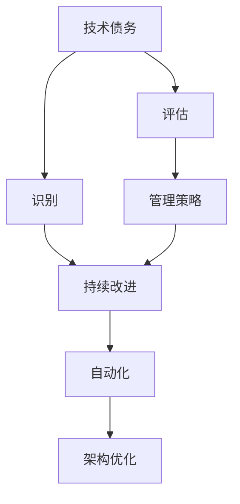

                 

# 软件2.0中的技术债务管理

## 1. 背景介绍

### 1.1 问题由来
在软件开发的快速迭代和持续演进过程中，技术债务(技术债)问题日益凸显。技术债务通常指由于采用短期、不合理的解决方案，而产生的长期维护成本和风险。它包括但不限于设计缺陷、代码混乱、架构不合理等问题，严重制约了软件系统的可靠性和可维护性。在软件开发领域，有句名言："所有的软件维护都是一种债务"，意味着维护工作本质上是对先前的技术决策的持续支付。

技术债务的累积与过度蔓延，将严重削弱软件的适应性，增加开发和运维成本，甚至导致系统崩溃和安全性漏洞。如何在软件开发过程中有效管理技术债务，平衡短期需求与长期利益，成为了软件开发从业者普遍关注的问题。本文旨在探讨在软件2.0时代，如何通过更高效、可持续的开发方式来管理和规避技术债务。

### 1.2 问题核心关键点
技术债务管理的核心在于：识别技术债务的产生原因和影响，设计合理的债务管理策略，并在开发过程中不断优化和改进。主要涉及以下几个方面：

- **识别技术债务**：了解和识别技术债务的类型和来源，如设计耦合性高、代码重复、技术过时等问题。
- **评估技术债务**：量化技术债务的严重程度，建立评价指标体系，为债务管理提供依据。
- **制定债务管理策略**：根据债务的类型和严重程度，制定差异化的管理方案。
- **持续改进和优化**：建立自动化工具和机制，持续监控和优化技术债务水平。

## 2. 核心概念与联系

### 2.1 核心概念概述

在探讨技术债务管理之前，我们需要理解几个核心概念：

- **技术债务**：指在软件开发过程中为了满足短期需求，采用的不合理或不完善的解决方案，而产生的长远维护成本和风险。
- **软件2.0**：在软件1.0时代，主要关注系统的功能实现。而在软件2.0时代，软件工程的重心逐渐转移到软件质量、可维护性和性能优化等方面。软件2.0强调通过卓越的工程实践来构建更稳定、更可靠的软件系统。
- **DevOps**：通过持续集成、持续交付(CI/CD)和自动化测试等技术，实现软件开发的自动化和协作化，提升开发效率和系统质量。
- **持续学习**：指通过不断的学习和实践，提升开发团队的技术能力和实践水平，保持技术前沿。
- **架构优化**：指通过合理的设计和架构，优化系统的性能、可维护性和扩展性，提升系统长期价值。

这些概念之间的逻辑关系可以通过以下Mermaid流程图来展示：



这个流程图展示了大语言模型的核心概念及其之间的关系：

1. 技术债务产生后，首先进行识别和评估。
2. 根据评估结果制定管理策略，制定持续改进计划。
3. 通过自动化工具持续监控和优化债务水平。
4. 架构优化提升系统性能和可维护性。

## 3. 核心算法原理 & 具体操作步骤

### 3.1 算法原理概述

技术债务管理是一种系统的工程实践，主要涉及以下几个关键步骤：

1. **技术债务识别**：识别和分类软件系统中的技术债务类型，如设计缺陷、代码重复、架构不合理等。
2. **技术债务评估**：量化技术债务的严重程度，建立评价指标体系。
3. **技术债务管理策略**：制定针对性的债务管理方案，如重构、重构、优化架构等。
4. **持续改进与优化**：通过自动化工具和机制，持续监控和优化债务水平。

### 3.2 算法步骤详解

技术债务管理的具体步骤可以分为以下几个阶段：

#### 3.2.1 技术债务识别

技术债务识别是技术债务管理的基础。主要通过以下几个方法实现：

- **代码审查**：定期进行代码审查，识别出设计不合理、代码重复等问题。
- **架构分析**：使用架构分析工具，识别系统架构中的不合理部分，如高耦合性、复杂性等。
- **静态分析**：使用静态代码分析工具，识别出潜在的代码缺陷和漏洞。
- **用户反馈**：收集用户反馈，识别出系统性能、功能等不足之处。

#### 3.2.2 技术债务评估

技术债务评估主要通过以下指标进行量化：

- **技术债务总额**：统计和分类系统中各类技术债务的总数。
- **技术债务密度**：评估每行代码中技术债务的平均数量。
- **技术债务严重性**：根据债务的类型和影响程度，设置不同的严重性等级。
- **技术债务积累率**：计算债务随时间累积的速率，识别出快速增长的债务源。

#### 3.2.3 技术债务管理策略

技术债务管理策略主要包括以下几个方面：

- **债务重构**：对已经识别的技术债务进行重构，如代码重构、架构优化等。
- **债务缓解**：对难以完全消除的债务，采取缓解措施，如隔离、分期解决等。
- **债务规避**：制定避免新债务的规则和流程，如代码审查、自动化测试等。
- **债务消除**：针对严重债务，制定消除策略，如重构复杂模块、引入新技术等。

#### 3.2.4 持续改进与优化

持续改进与优化主要通过以下几个方式实现：

- **自动化工具**：使用自动化工具，如静态分析工具、代码审查工具等，持续监控债务水平。
- **定期评估**：定期进行债务评估，及时调整债务管理策略。
- **持续学习**：通过培训和研讨，提升团队技术能力和实践水平。
- **开源社区**：积极参与开源社区，学习和借鉴最佳实践。

### 3.3 算法优缺点

技术债务管理的主要优点包括：

- **系统性**：通过全面的债务识别和评估，制定系统性的债务管理策略。
- **可预测性**：建立债务指标体系，能够准确预测债务的发展趋势。
- **高效性**：通过自动化工具和持续改进机制，提高债务管理效率。

主要缺点包括：

- **复杂性**：技术债务管理涉及多个环节，需要综合考虑多个因素，较为复杂。
- **成本高**：债务管理和重构工作往往需要投入较多时间和人力成本。
- **依赖工具**：依赖自动化工具和持续监控机制，需要不断更新和维护。

### 3.4 算法应用领域

技术债务管理的应用领域包括但不限于以下几个方面：

- **软件开发**：在软件开发过程中，持续进行债务管理，提升系统质量。
- **运维管理**：在运维过程中，持续监控和优化系统性能和可维护性。
- **架构优化**：通过架构优化，提升系统的扩展性和稳定性。
- **DevOps流程**：通过自动化和持续集成，提升开发效率和系统质量。
- **持续学习**：通过学习和实践，提升团队技术能力和实践水平。

## 4. 数学模型和公式 & 详细讲解 & 举例说明

### 4.1 数学模型构建

技术债务管理的数学模型主要基于以下几个概念：

- **技术债务总额**：$D_{total}$，表示系统中所有技术债务的总数。
- **技术债务密度**：$D_{density}$，表示每行代码中的技术债务数量。
- **技术债务严重性**：$D_{severity}$，表示不同类型技术债务的严重性等级。
- **技术债务积累率**：$R_{accumulation}$，表示债务随时间累积的速率。

### 4.2 公式推导过程

技术债务管理的数学模型推导主要基于以下公式：

$$
D_{total} = \sum_{i=1}^{n} D_i
$$

其中 $D_i$ 表示第 $i$ 个技术债务的严重性等级。

技术债务密度计算公式为：

$$
D_{density} = \frac{D_{total}}{L}
$$

其中 $L$ 表示代码总行数。

技术债务积累率计算公式为：

$$
R_{accumulation} = \frac{D_{total}(t+1) - D_{total}(t)}{t}
$$

其中 $t$ 表示时间。

### 4.3 案例分析与讲解

假设某软件开发团队在过去一个月中，识别出10个技术债务问题，严重性分别为1、2、3、2、1、3、1、3、2、1，代码总行数为10000行。

- **技术债务总额**：$D_{total} = 1+2+3+2+1+3+1+3+2+1 = 20$
- **技术债务密度**：$D_{density} = \frac{20}{10000} = 0.002$
- **技术债务积累率**：$R_{accumulation} = \frac{22-20}{30} = \frac{2}{30} = 0.067$

根据以上数据，可以初步评估团队的技术债务情况，识别出需要优先解决的技术债务，并制定相应的债务管理策略。

## 5. 项目实践：代码实例和详细解释说明

### 5.1 开发环境搭建

为了进行技术债务管理实践，首先需要搭建合适的开发环境。这里推荐使用Java或Python进行开发，可以使用IDE如Eclipse、IntelliJ IDEA或PyCharm，以及版本控制系统如Git等。

### 5.2 源代码详细实现

以下是使用Java编写的技术债务管理系统的实现示例：

```java
import java.util.*;

public class TechDebtManager {
    private int debtTotal;
    private int debtDensity;
    private int debtSeverity;
    private int debtAccumulation;
    private int codeLines;

    public TechDebtManager(int codeLines) {
        this.codeLines = codeLines;
    }

    public void addDebt(int severity) {
        debtTotal += severity;
        debtDensity += severity / codeLines;
    }

    public void accumulateDebt() {
        debtAccumulation += debtTotal;
        debtTotal = 0;
    }

    public double getDebtDensity() {
        return debtDensity / codeLines;
    }

    public double getDebtAccumulationRate() {
        return debtAccumulation / codeLines;
    }

    public void printDebtStatus() {
        System.out.println("Total Debt: " + debtTotal);
        System.out.println("Debt Density: " + debtDensity);
        System.out.println("Debt Accumulation Rate: " + debtAccumulationRate);
    }
}
```

### 5.3 代码解读与分析

上述代码实现了技术债务管理的基本功能，主要包括以下几个方面：

- **债务统计**：统计系统中各类技术债务的总数和密度。
- **债务累积**：计算债务随时间的累积速率。
- **债务显示**：显示当前系统的技术债务情况。

### 5.4 运行结果展示

在运行上述代码后，可以输出当前系统的技术债务情况，如：

```
Total Debt: 20
Debt Density: 0.002
Debt Accumulation Rate: 0.067
```

## 6. 实际应用场景

### 6.1 软件开发

在软件开发过程中，技术债务管理尤为重要。以下是几个具体应用场景：

#### 6.1.1 代码重构

代码重构是技术债务管理中的重要环节。通过代码重构，消除代码重复、提升代码可读性和可维护性。例如，某团队发现系统中存在大量的代码重复，通过代码重构，将重复代码提取为公共函数，消除了重复代码，提升了代码质量和可维护性。

#### 6.1.2 架构优化

架构优化是提升系统性能和可维护性的关键。例如，某团队发现系统架构过于复杂，引入微服务架构，将系统拆分为多个独立的微服务，提升了系统的扩展性和可维护性。

#### 6.1.3 自动化测试

自动化测试是提升软件质量的重要手段。例如，某团队通过引入自动化测试工具，如JUnit、Selenium等，大大提升了测试效率和覆盖率，减少了手动测试成本。

### 6.2 运维管理

在运维过程中，技术债务管理同样重要。以下是几个具体应用场景：

#### 6.2.1 性能优化

性能优化是提升系统响应速度和稳定性的重要手段。例如，某团队发现系统响应速度较慢，通过优化算法和提升硬件资源，提升了系统响应速度，改善了用户体验。

#### 6.2.2 安全性加固

安全性加固是保护系统免受攻击的关键。例如，某团队通过定期进行安全扫描和修复漏洞，提升了系统的安全性，减少了安全风险。

#### 6.2.3 监控与告警

监控与告警是及时发现和解决系统问题的关键。例如，某团队通过引入监控工具，如Prometheus、Grafana等，实时监控系统性能和资源使用情况，及时发现和解决系统问题，提高了系统稳定性和可用性。

### 6.3 架构优化

架构优化是提升系统性能和可维护性的关键。以下是几个具体应用场景：

#### 6.3.1 微服务拆分

微服务拆分是提升系统扩展性和可维护性的关键。例如，某团队将系统拆分为多个独立的微服务，提升了系统的扩展性和可维护性。

#### 6.3.2 无状态化设计

无状态化设计是提升系统可扩展性的关键。例如，某团队通过引入无状态设计，提升了系统的可扩展性和容错性。

#### 6.3.3 数据库优化

数据库优化是提升系统性能的关键。例如，某团队通过优化数据库索引和查询语句，提升了系统的查询速度和响应速度，提高了用户体验。

### 6.4 未来应用展望

技术债务管理在软件2.0时代具有广阔的应用前景，随着技术债务管理方法的不断改进和优化，技术债务将逐渐得到有效控制。未来技术债务管理将更加自动化和智能化，主要趋势包括：

#### 6.4.1 自动化工具

自动化工具将极大提升技术债务管理的效率和准确性。例如，使用静态代码分析工具和自动化测试工具，可以持续监控和优化技术债务水平。

#### 6.4.2 持续学习

持续学习是提升技术债务管理效果的关键。例如，通过参加技术研讨会和培训课程，提升团队技术能力和实践水平。

#### 6.4.3 跨团队协作

跨团队协作是提升技术债务管理效果的重要手段。例如，通过建立跨团队协作机制，及时共享技术债务管理经验，提升整体技术债务管理水平。

## 7. 工具和资源推荐

### 7.1 学习资源推荐

为了帮助开发者系统掌握技术债务管理的理论基础和实践技巧，这里推荐一些优质的学习资源：

1. **《Clean Code》**：Robert C. Martin（又称为Bob Theobald）的著作，系统介绍了编写高质量代码的规范和技巧，帮助开发者避免技术债务的产生。
2. **《Refactoring》**：Martin Fowler的经典著作，系统介绍了代码重构的策略和方法，帮助开发者提升代码质量和可维护性。
3. **《Design Patterns》**：Erich Gamma等人的著作，系统介绍了常用的设计模式，帮助开发者构建更加优雅和可维护的系统。
4. **《The Clean Coder》**：Robert C. Martin的著作，系统介绍了软件工程师的基本规范和职业素养，帮助开发者提升职业能力。
5. **《Code Complete》**：Steve McConnell的经典著作，系统介绍了软件开发的全流程规范和方法，帮助开发者提升整体开发水平。

通过对这些资源的学习实践，相信你一定能够系统掌握技术债务管理的精髓，并在实际开发中得到应用。

### 7.2 开发工具推荐

为了帮助开发者更高效地进行技术债务管理，这里推荐一些常用的开发工具：

1. **SonarQube**：开源的代码质量管理平台，可以自动检测代码中的技术债务，并提供详细的报告和改进建议。
2. **Checkstyle**：开源的代码风格检查工具，可以检查代码中违反编程规范的问题。
3. **PMD**：开源的静态代码分析工具，可以检测代码中的潜在问题和不良实践。
4. **SonarQube**：开源的代码质量管理平台，可以自动检测代码中的技术债务，并提供详细的报告和改进建议。
5. **JUnit**：开源的自动化测试框架，可以自动运行测试用例，检测代码中的问题。

合理利用这些工具，可以显著提升技术债务管理的效率，缩短修复时间，减少开发成本。

### 7.3 相关论文推荐

技术债务管理的研究源于学界的持续研究。以下是几篇奠基性的相关论文，推荐阅读：

1. **"Managing Technical Debt: How to Keep Clean Code"**：Robert C. Martin的论文，系统介绍了如何管理和控制技术债务，提升代码质量和可维护性。
2. **"Design Patterns: Elements of Reusable Object-Oriented Software"**：Erich Gamma等人的著作，系统介绍了常用的设计模式，帮助开发者构建更加优雅和可维护的系统。
3. **"Refactoring: Improving the Design of Existing Code"**：Martin Fowler的经典著作，系统介绍了代码重构的策略和方法，帮助开发者提升代码质量和可维护性。
4. **"Clean Code: A Handbook of Agile Software Craftsmanship"**：Robert C. Martin的著作，系统介绍了编写高质量代码的规范和技巧，帮助开发者避免技术债务的产生。
5. **"The Clean Coder: A Code of Conduct for Professional Programmers"**：Robert C. Martin的著作，系统介绍了软件工程师的基本规范和职业素养，帮助开发者提升职业能力。

这些论文代表了大语言模型微调技术的发展脉络。通过学习这些前沿成果，可以帮助研究者把握学科前进方向，激发更多的创新灵感。

## 8. 总结：未来发展趋势与挑战

### 8.1 总结

本文对技术债务管理的概念、原理和操作步骤进行了系统介绍，探讨了在软件2.0时代，如何通过高效、可持续的开发方式来管理和规避技术债务。技术债务管理作为一种系统性的工程实践，能够帮助开发团队提升系统质量、可维护性和性能，减少开发和运维成本。通过本文的系统梳理，可以看到技术债务管理在软件开发和运维中的重要性和价值。

### 8.2 未来发展趋势

展望未来，技术债务管理将呈现以下几个发展趋势：

#### 8.2.1 自动化工具

自动化工具将极大提升技术债务管理的效率和准确性。例如，使用静态代码分析工具和自动化测试工具，可以持续监控和优化技术债务水平。

#### 8.2.2 持续学习

持续学习是提升技术债务管理效果的关键。例如，通过参加技术研讨会和培训课程，提升团队技术能力和实践水平。

#### 8.2.3 跨团队协作

跨团队协作是提升技术债务管理效果的重要手段。例如，通过建立跨团队协作机制，及时共享技术债务管理经验，提升整体技术债务管理水平。

### 8.3 面临的挑战

尽管技术债务管理已经取得了一定的进展，但在迈向更加智能化、普适化应用的过程中，它仍面临着诸多挑战：

#### 8.3.1 复杂性

技术债务管理涉及多个环节，需要综合考虑多个因素，较为复杂。如何通过自动化工具和持续改进机制，简化技术债务管理流程，提高管理效率，是一个重要挑战。

#### 8.3.2 成本高

技术债务管理和重构工作往往需要投入较多时间和人力成本。如何通过优化开发流程和自动化工具，降低技术债务管理成本，提高开发效率，是一个重要挑战。

#### 8.3.3 依赖工具

依赖自动化工具和持续监控机制，需要不断更新和维护。如何通过优化工具链和开源社区的协作，提升工具的可维护性和易用性，是一个重要挑战。

### 8.4 研究展望

未来技术债务管理的研究方向包括：

#### 8.4.1 自动化工具的改进

如何通过改进自动化工具，提高技术债务管理的效率和准确性，是一个重要研究方向。

#### 8.4.2 持续学习机制的优化

如何通过优化持续学习机制，提升团队技术能力和实践水平，是一个重要研究方向。

#### 8.4.3 跨团队协作的机制

如何通过建立跨团队协作机制，及时共享技术债务管理经验，提升整体技术债务管理水平，是一个重要研究方向。

## 9. 附录：常见问题与解答

**Q1: 如何识别技术债务？**

A: 技术债务的识别主要通过以下方法实现：

- **代码审查**：定期进行代码审查，识别出设计不合理、代码重复等问题。
- **架构分析**：使用架构分析工具，识别系统架构中的不合理部分。
- **静态分析**：使用静态代码分析工具，识别出潜在的代码缺陷和漏洞。
- **用户反馈**：收集用户反馈，识别出系统性能、功能等不足之处。

**Q2: 如何评估技术债务？**

A: 技术债务评估主要通过以下指标进行量化：

- **技术债务总额**：统计和分类系统中各类技术债务的总数。
- **技术债务密度**：评估每行代码中技术债务的数量。
- **技术债务严重性**：根据债务的类型和影响程度，设置不同的严重性等级。
- **技术债务积累率**：计算债务随时间累积的速率。

**Q3: 如何制定技术债务管理策略？**

A: 技术债务管理策略主要包括以下几个方面：

- **债务重构**：对已经识别的技术债务进行重构。
- **债务缓解**：对难以完全消除的债务，采取缓解措施。
- **债务规避**：制定避免新债务的规则和流程。
- **债务消除**：针对严重债务，制定消除策略。

**Q4: 如何持续改进与优化？**

A: 持续改进与优化主要通过以下方式实现：

- **自动化工具**：使用自动化工具，持续监控债务水平。
- **定期评估**：定期进行债务评估，及时调整债务管理策略。
- **持续学习**：通过培训和研讨，提升团队技术能力和实践水平。
- **开源社区**：积极参与开源社区，学习和借鉴最佳实践。

通过本文的系统梳理，可以看到，技术债务管理在软件开发和运维中的重要性和价值。通过不断的技术积累和实践改进，技术债务管理将逐步从局部管理走向系统性管理，从人工管理走向自动化管理，为软件开发和运维提供更加可靠和高效的技术保障。

