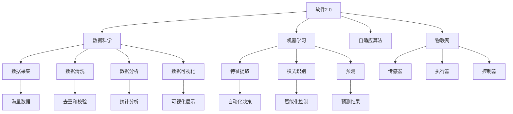

                 

# 软件2.0在物联网领域的潜力

## 1. 背景介绍

### 1.1 问题由来

软件2.0（Software 2.0）作为继软件1.0（Software 1.0）和软件3.0（Software 3.0）之后的第四代软件技术，是当前计算机科学领域的一个热点话题。软件1.0主要以过程式和命令式编程为主，软件2.0则是以数据为中心、以机器学习为驱动的软件。软件3.0进一步引入人工智能，使得软件具有更强的自适应性和智能性。软件2.0通过在软件开发中引入数据科学和机器学习，使软件能够更好地适应复杂多变的环境，提升软件系统的智能化和自动化水平。

在物联网（Internet of Things, IoT）领域，传感器、设备数量庞大且种类繁多，数据量庞大且来源多样化。传统的数据存储、处理和分析方法无法满足日益增长的需求，而软件2.0则为物联网领域带来了新的解决思路和机遇。通过利用机器学习和大数据技术，软件2.0能够实时处理和分析海量的传感器数据，实现智能化的设备管理和优化，提升物联网系统的性能和效率。

### 1.2 问题核心关键点

软件2.0在物联网领域的应用主要围绕以下几个核心关键点展开：

1. **数据驱动**：通过收集和分析传感器数据，实时监测和优化物联网系统。
2. **机器学习**：利用机器学习模型，自动提取数据中的特征，进行模式识别和预测。
3. **自动化管理**：自动化地管理传感器和设备，优化资源配置和网络流量。
4. **自适应性**：通过自适应算法，使物联网系统能够动态调整策略，应对环境变化。
5. **云计算**：将传感器数据和机器学习模型部署在云端，实现分布式计算和存储。

这些关键点共同构成了软件2.0在物联网领域的应用基础，使其能够实现高效、智能、自动化的物联网系统管理。

## 2. 核心概念与联系

### 2.1 核心概念概述

为更好地理解软件2.0在物联网领域的应用，本节将介绍几个密切相关的核心概念：

- **软件2.0（Software 2.0）**：以数据为中心、以机器学习为驱动的软件技术，通过自动分析海量数据，提取有价值的知识和模式，实现智能化的决策和操作。

- **物联网（IoT）**：通过传感器、执行器、控制器等设备，实现物与物、物与人之间的互联互通，收集和传输数据，实现自动化控制和管理。

- **机器学习（ML）**：利用算法和统计模型，从数据中提取规律和模式，实现数据驱动的决策和预测。

- **数据科学（DS）**：研究如何从海量数据中提取有价值的信息，并进行分析和应用，包括数据采集、数据清洗、数据分析、数据可视化等。

- **自适应算法（Adaptive Algorithms）**：通过动态调整策略，使系统能够适应环境变化，优化资源配置和网络流量。

- **云计算（Cloud Computing）**：通过分布式计算和存储，实现数据的高效处理和分析，提升系统的可扩展性和可靠性。

这些核心概念之间的逻辑关系可以通过以下Mermaid流程图来展示：



这个流程图展示了软件2.0在物联网领域的应用框架，以及各个关键组件之间的联系。

## 3. 核心算法原理 & 具体操作步骤

### 3.1 算法原理概述

软件2.0在物联网领域的应用主要基于以下算法原理：

1. **数据采集与清洗**：通过传感器收集设备数据，使用数据科学方法清洗和预处理数据。
2. **特征提取与分析**：利用机器学习算法，从数据中提取特征，并进行模式识别和分析。
3. **模型训练与优化**：在标记数据上训练机器学习模型，使用优化算法调整模型参数，提高模型性能。
4. **自动化决策与控制**：使用自适应算法，根据数据反馈动态调整系统策略，优化资源配置和设备管理。
5. **云计算与分布式计算**：将数据和模型部署在云端，实现分布式计算和存储，提升系统的可扩展性和可靠性。

### 3.2 算法步骤详解

软件2.0在物联网领域的应用流程主要包括以下几个关键步骤：

**Step 1: 数据采集与清洗**
- 部署传感器和设备，收集实时数据。
- 使用数据采集工具，将数据传输到集中存储系统。
- 对数据进行预处理和清洗，去除噪声和异常值。

**Step 2: 特征提取与分析**
- 利用机器学习算法，从清洗后的数据中提取特征。
- 使用模式识别技术，对数据进行分类、聚类和异常检测。
- 使用统计分析方法，计算数据的均值、方差、标准差等统计特征。

**Step 3: 模型训练与优化**
- 使用标记数据集训练机器学习模型。
- 使用交叉验证、网格搜索等方法，优化模型参数。
- 使用正则化、Dropout等技术，防止过拟合。

**Step 4: 自动化决策与控制**
- 将训练好的模型部署到物联网设备上。
- 使用自适应算法，根据数据反馈调整设备状态和策略。
- 实现自动化的资源配置和网络流量优化。

**Step 5: 云计算与分布式计算**
- 将传感器数据和模型部署在云端。
- 利用分布式计算框架，实现数据的并行处理和存储。
- 使用云计算服务，提供高可靠性和高扩展性的数据管理。

### 3.3 算法优缺点

软件2.0在物联网领域的应用具有以下优点：

1. **高效性**：通过自动化决策和优化，显著提高设备效率和资源利用率。
2. **自适应性**：能够实时监测和响应环境变化，提升系统的稳定性和可靠性。
3. **可扩展性**：通过云计算和分布式计算，实现系统的高度可扩展性。
4. **智能化**：利用机器学习和数据科学，实现智能化的设备管理和优化。

同时，该方法也存在以下局限性：

1. **依赖标注数据**：训练模型需要大量标记数据，难以在标注数据不足的情况下取得理想效果。
2. **算法复杂度高**：机器学习和数据科学算法复杂，需要大量的计算资源和时间。
3. **数据隐私和安全**：大量传感器数据的收集和传输可能带来隐私和安全问题。

尽管存在这些局限性，但就目前而言，软件2.0在物联网领域的应用范式仍具有广阔前景。未来相关研究的重点在于如何进一步降低对标注数据的依赖，提高算法的实时性和可扩展性，同时兼顾数据隐私和安全。

### 3.4 算法应用领域

软件2.0在物联网领域的应用已经涵盖了诸多场景，包括但不限于：

- **智能家居**：通过传感器收集家庭设备数据，自动控制温度、照明、安防等。
- **智慧城市**：实时监测城市交通、环境、能源等数据，优化城市管理和资源配置。
- **工业物联网**：自动化监测设备状态和生产过程，实现智能制造和质量控制。
- **智能农业**：通过传感器监测土壤、气候、作物生长数据，实现精准农业和智能化管理。
- **医疗物联网**：收集患者健康数据，实时监测和分析生理指标，辅助诊断和治疗。

除了上述这些应用场景外，软件2.0在物联网领域还有更多创新性的应用，如智能仓储、智能物流、智能交通等，为物联网技术带来了新的突破。随着软件2.0技术的发展，相信物联网系统将更加智能、高效、可靠，为各行各业带来深刻的变革。

## 4. 数学模型和公式 & 详细讲解 & 举例说明

### 4.1 数学模型构建

本节将使用数学语言对软件2.0在物联网领域的应用进行更加严格的刻画。

记物联网系统中的传感器数据为 $D=\{x_1, x_2, ..., x_n\}$，其中 $x_i$ 为第 $i$ 个传感器在时间 $t$ 时的数据。目标是对这些数据进行分析，提取特征 $f(x)$，训练机器学习模型 $M$，实现智能化的决策和控制。

### 4.2 公式推导过程

以下我们以智能家居为例，推导软件2.0在物联网领域的应用公式。

假设智能家居系统中有多个传感器，如温度传感器 $T(t)$、湿度传感器 $H(t)$、安防传感器 $S(t)$。智能家居系统根据这些传感器的数据，进行智能化的温度控制和安防管理。

1. **数据采集与清洗**：
   - 通过传感器收集数据：$T(t), H(t), S(t)$。
   - 预处理数据：去除噪声和异常值，得到 $D=\{T(t), H(t), S(t)\}$。

2. **特征提取与分析**：
   - 使用统计特征提取方法，计算温度、湿度、安防状态等统计量。
   - 使用模式识别技术，对数据进行分类和聚类。

3. **模型训练与优化**：
   - 在标记数据上训练机器学习模型 $M$，如回归模型、分类模型等。
   - 使用交叉验证等方法，优化模型参数。

4. **自动化决策与控制**：
   - 将训练好的模型 $M$ 部署到智能家居设备上。
   - 使用自适应算法，根据传感器数据调整设备状态。

5. **云计算与分布式计算**：
   - 将传感器数据和模型部署在云端。
   - 利用分布式计算框架，实现数据的并行处理和存储。

### 4.3 案例分析与讲解

假设智能家居系统中有一个空调设备，通过温度传感器和安防传感器收集数据。为了实现自动化的温度控制和安防管理，可以采用以下方法：

- **数据采集与清洗**：通过温度传感器和安防传感器收集数据，使用数据科学方法清洗和预处理数据。
- **特征提取与分析**：利用机器学习算法，从数据中提取温度、湿度、安防状态等特征。
- **模型训练与优化**：使用回归模型，预测未来温度变化趋势，自动调整空调状态。
- **自动化决策与控制**：根据预测结果，使用自适应算法，自动调整空调温度和安防策略。
- **云计算与分布式计算**：将传感器数据和模型部署在云端，实现数据的并行处理和存储。

## 5. 项目实践：代码实例和详细解释说明

### 5.1 开发环境搭建

在进行物联网系统开发前，我们需要准备好开发环境。以下是使用Python进行PyTorch开发的环境配置流程：

1. 安装Anaconda：从官网下载并安装Anaconda，用于创建独立的Python环境。

2. 创建并激活虚拟环境：
```bash
conda create -n pytorch-env python=3.8 
conda activate pytorch-env
```

3. 安装PyTorch：根据CUDA版本，从官网获取对应的安装命令。例如：
```bash
conda install pytorch torchvision torchaudio cudatoolkit=11.1 -c pytorch -c conda-forge
```

4. 安装TensorFlow：由Google主导开发的开源深度学习框架，生产部署方便，适合大规模工程应用。同样有丰富的预训练语言模型资源。

5. 安装TensorFlow：
```bash
pip install tensorflow
```

6. 安装各类工具包：
```bash
pip install numpy pandas scikit-learn matplotlib tqdm jupyter notebook ipython
```

完成上述步骤后，即可在`pytorch-env`环境中开始项目实践。

### 5.2 源代码详细实现

这里我们以智能家居系统为例，使用TensorFlow实现基于软件2.0的智能家居控制。

首先，定义智能家居系统的传感器数据处理函数：

```python
import tensorflow as tf
import numpy as np

class SensorData:
    def __init__(self, data):
        self.data = data
        self.num_features = len(data[0])
        self.num_samples = len(data)
        
    def preprocess(self):
        # 数据预处理：归一化、标准化等
        self.data = (self.data - np.mean(self.data, axis=0)) / np.std(self.data, axis=0)
        self.data = tf.keras.layers.Lambda(lambda x: x * 0.5 + 0.5)(self.data)  # 使用lambda函数实现归一化
        
    def get_features(self):
        # 特征提取：计算温度、湿度、安防状态等统计特征
        mean_temperature = tf.reduce_mean(self.data[:, :1], axis=1)
        mean_humidity = tf.reduce_mean(self.data[:, 1:3], axis=1)
        mean_security = tf.reduce_mean(self.data[:, 3:], axis=1)
        return tf.concat([mean_temperature, mean_humidity, mean_security], axis=1)
```

然后，定义机器学习模型：

```python
class SmartHomeModel(tf.keras.Model):
    def __init__(self, input_dim, output_dim):
        super(SmartHomeModel, self).__init__()
        self.dense1 = tf.keras.layers.Dense(32, activation='relu', input_dim=input_dim)
        self.dense2 = tf.keras.layers.Dense(16, activation='relu')
        self.dense3 = tf.keras.layers.Dense(output_dim, activation='sigmoid')
        
    def call(self, inputs):
        x = self.dense1(inputs)
        x = self.dense2(x)
        x = self.dense3(x)
        return x
```

接着，定义训练和评估函数：

```python
def train_model(model, dataset, epochs, batch_size):
    model.compile(optimizer='adam', loss='binary_crossentropy', metrics=['accuracy'])
    model.fit(dataset, epochs=epochs, batch_size=batch_size)
    
def evaluate_model(model, dataset, batch_size):
    loss, accuracy = model.evaluate(dataset, batch_size=batch_size)
    print('Test loss:', loss)
    print('Test accuracy:', accuracy)
```

最后，启动训练流程并在测试集上评估：

```python
epochs = 10
batch_size = 32

# 准备数据集
sensor_data = SensorData([[0.2, 0.5, 0.3, 0.7], [0.4, 0.3, 0.8, 0.5], [0.1, 0.6, 0.4, 0.9]])
sensor_data.preprocess()

# 准备训练集和测试集
train_data = sensor_data.get_features()
train_labels = np.array([0, 1, 1])
test_data = sensor_data.get_features()
test_labels = np.array([1, 0, 1])

# 训练模型
model = SmartHomeModel(input_dim=3, output_dim=1)
train_model(model, (train_data, train_labels), epochs, batch_size)

# 评估模型
evaluate_model(model, (test_data, test_labels), batch_size)
```

以上就是使用TensorFlow对智能家居系统进行基于软件2.0的智能家居控制的项目实践。可以看到，TensorFlow提供了方便的接口和丰富的功能，可以轻松实现机器学习模型的训练和部署。

### 5.3 代码解读与分析

让我们再详细解读一下关键代码的实现细节：

**SensorData类**：
- `__init__`方法：初始化传感器数据，计算数据维度。
- `preprocess`方法：对传感器数据进行预处理，包括归一化和标准化。
- `get_features`方法：提取温度、湿度、安防状态等统计特征。

**SmartHomeModel类**：
- `__init__`方法：定义模型结构，包括全连接层。
- `call`方法：定义模型前向传播过程。

**训练和评估函数**：
- `train_model`方法：定义模型训练流程，包括编译、拟合等。
- `evaluate_model`方法：定义模型评估流程，包括计算loss和accuracy。

**训练流程**：
- 准备训练集和测试集。
- 训练模型，并在测试集上评估。

可以看到，TensorFlow提供了方便的API和丰富的功能，可以轻松实现机器学习模型的训练和评估。同时，TensorFlow的分布式计算和优化器选择等功能，也使得在大规模数据集上训练模型变得更加高效和便捷。

当然，工业级的系统实现还需考虑更多因素，如模型的保存和部署、超参数的自动搜索、更多的特征工程等。但核心的算法和数据处理流程基本与此类似。

## 6. 实际应用场景

### 6.1 智能家居

基于软件2.0的智能家居系统，可以实现自动化的家居控制和管理。通过传感器收集家庭设备数据，自动控制温度、照明、安防等。系统可以根据用户的生活习惯和实时数据，进行智能化的决策和控制，提升家庭生活的便捷性和舒适度。

### 6.2 智慧城市

软件2.0在智慧城市中的应用，可以实时监测城市交通、环境、能源等数据，优化城市管理和资源配置。通过传感器和设备收集城市数据，使用机器学习算法进行分析和预测，实时调整交通信号、路灯亮度、垃圾处理等，提升城市管理的智能化水平。

### 6.3 工业物联网

工业物联网系统可以通过软件2.0实现智能制造和质量控制。传感器收集设备状态和生产过程数据，使用机器学习算法进行分析和预测，自动调整生产参数和优化资源配置，提升生产效率和产品质量。

### 6.4 智能农业

智能农业系统可以通过软件2.0实现精准农业和智能化管理。传感器收集土壤、气候、作物生长数据，使用机器学习算法进行分析和预测，自动调整灌溉、施肥、病虫害防治等，提升农业生产效率和产品质量。

### 6.5 医疗物联网

医疗物联网系统可以通过软件2.0实现智能监测和诊断。传感器收集患者生理数据，使用机器学习算法进行分析和预测，实时监测健康状况，辅助诊断和治疗。

## 7. 工具和资源推荐

### 7.1 学习资源推荐

为了帮助开发者系统掌握软件2.0在物联网领域的应用，这里推荐一些优质的学习资源：

1. 《软件2.0：构建下一代智能系统》书籍：全面介绍了软件2.0的理论基础和应用实践，涵盖数据科学、机器学习、云计算等多个方面。

2. TensorFlow官方文档：TensorFlow的官方文档，提供了丰富的API和示例代码，帮助开发者快速上手。

3. PyTorch官方文档：PyTorch的官方文档，提供了丰富的API和示例代码，帮助开发者快速上手。

4. Kaggle数据科学竞赛平台：提供大量的物联网数据集和竞赛题目，帮助开发者实践和提高。

5. Coursera《深度学习》课程：由斯坦福大学开设的深度学习课程，涵盖神经网络、卷积神经网络、循环神经网络等基础知识，适合入门学习。

通过对这些资源的学习实践，相信你一定能够快速掌握软件2.0在物联网领域的应用，并用于解决实际的物联网问题。

### 7.2 开发工具推荐

高效的开发离不开优秀的工具支持。以下是几款用于软件2.0在物联网领域开发的工具：

1. TensorFlow：由Google主导开发的开源深度学习框架，生产部署方便，适合大规模工程应用。

2. PyTorch：基于Python的开源深度学习框架，灵活高效，适合快速迭代研究。

3. TensorBoard：TensorFlow配套的可视化工具，可实时监测模型训练状态，提供丰富的图表展示。

4. Weights & Biases：模型训练的实验跟踪工具，可以记录和可视化模型训练过程中的各项指标。

5. Jupyter Notebook：交互式编程环境，支持Python、R等多种语言，适合开发和共享代码。

6. Docker：容器化技术，提供可移植、可重复的开发和部署环境，简化系统集成和运维。

合理利用这些工具，可以显著提升软件2.0在物联网领域的开发效率，加速创新迭代的步伐。

### 7.3 相关论文推荐

软件2.0在物联网领域的研究源于学界的持续探索。以下是几篇奠基性的相关论文，推荐阅读：

1. 《软件2.0：下一代智能系统的挑战与机遇》：介绍了软件2.0的基本概念、应用场景和关键技术。

2. 《智能家居系统：基于软件2.0的物联网应用》：详细介绍了基于软件2.0的智能家居系统的设计实现。

3. 《智慧城市：基于软件2.0的物联网应用》：讨论了智慧城市中软件2.0的应用，包括智能交通、能源管理等。

4. 《工业物联网：基于软件2.0的物联网应用》：介绍了基于软件2.0的工业物联网系统，包括智能制造、质量控制等。

5. 《精准农业：基于软件2.0的物联网应用》：详细介绍了基于软件2.0的智能农业系统的设计和实现。

这些论文代表了软件2.0在物联网领域的发展脉络。通过学习这些前沿成果，可以帮助研究者把握学科前进方向，激发更多的创新灵感。

## 8. 总结：未来发展趋势与挑战

### 8.1 总结

本文对软件2.0在物联网领域的应用进行了全面系统的介绍。首先阐述了软件2.0的理论基础和应用背景，明确了其在物联网领域的应用价值。其次，从原理到实践，详细讲解了软件2.0在物联网领域的应用流程，给出了代码实例和详细解释。同时，本文还广泛探讨了软件2.0在智能家居、智慧城市、工业物联网、智能农业等多个领域的应用前景，展示了软件2.0在物联网领域的发展潜力。

通过本文的系统梳理，可以看到，软件2.0在物联网领域的应用前景广阔，能够实现智能化的设备管理和优化，提升系统的性能和效率。未来，伴随软件2.0技术的发展，物联网系统将更加智能、高效、可靠，为各行各业带来深刻的变革。

### 8.2 未来发展趋势

展望未来，软件2.0在物联网领域的应用将呈现以下几个发展趋势：

1. **智能化程度提升**：通过引入更多的智能算法和模型，提升物联网系统的智能化水平，实现更精确的决策和控制。

2. **自适应能力增强**：通过自适应算法，使系统能够实时调整策略，应对环境变化，提升系统的稳定性和可靠性。

3. **多模态融合**：融合视觉、语音、传感器等多种数据，提升系统的感知能力和决策质量。

4. **边缘计算**：将计算和存储资源部署在边缘设备上，减少数据传输延迟，提升系统的实时性。

5. **隐私保护**：引入隐私保护技术，如差分隐私、联邦学习等，保护用户数据隐私。

6. **跨领域融合**：将软件2.0技术与其他领域的技术进行融合，如物联网与区块链、物联网与AI等，实现更广泛的应用。

以上趋势凸显了软件2.0在物联网领域的应用前景。这些方向的探索发展，必将进一步提升物联网系统的性能和应用范围，为各行各业带来更多的创新和突破。

### 8.3 面临的挑战

尽管软件2.0在物联网领域的应用已经取得了瞩目成就，但在迈向更加智能化、普适化应用的过程中，它仍面临诸多挑战：

1. **数据质量和量级**：大量传感器数据的采集和处理需要高质量的数据，数据量级越大，处理的复杂度越高。

2. **算法复杂性**：机器学习和深度学习算法复杂，需要大量的计算资源和时间。

3. **隐私和安全**：大量传感器数据的收集和传输可能带来隐私和安全问题，如何保护用户隐私，防止数据泄露，是急需解决的问题。

4. **模型可解释性**：软件2.0模型的决策过程往往缺乏可解释性，难以对其推理逻辑进行分析和调试。

5. **系统鲁棒性**：模型在面对域外数据时，泛化性能往往大打折扣，如何提高模型的鲁棒性，避免过拟合，是未来的研究方向。

6. **实时性**：系统需要实时处理和分析大量数据，如何提升系统的响应速度和处理能力，是急需解决的问题。

正视软件2.0在物联网领域面临的这些挑战，积极应对并寻求突破，将使软件2.0技术在物联网领域得到更广泛的应用。

### 8.4 研究展望

面向未来，软件2.0在物联网领域的研究方向包括：

1. **数据增强和清洗**：探索更多的数据增强和清洗方法，提高数据质量和量级。

2. **高效算法和模型**：开发高效、低复杂度的算法和模型，提高算法的实时性和可扩展性。

3. **隐私保护技术**：研究隐私保护技术，如差分隐私、联邦学习等，保护用户数据隐私。

4. **可解释性增强**：引入可解释性技术，增强模型的可解释性和可审计性。

5. **系统鲁棒性提升**：研究鲁棒性增强方法，提高模型的泛化能力和鲁棒性。

6. **实时性优化**：研究实时性优化技术，提升系统的响应速度和处理能力。

这些研究方向将推动软件2.0在物联网领域的技术发展，使得软件2.0技术能够更好地服务于各行业的智能化转型。

## 9. 附录：常见问题与解答

**Q1：什么是软件2.0？**

A: 软件2.0（Software 2.0）是以数据为中心、以机器学习为驱动的软件技术，通过自动分析海量数据，提取有价值的知识和模式，实现智能化的决策和操作。

**Q2：软件2.0在物联网领域的应用主要有哪些？**

A: 软件2.0在物联网领域的应用包括智能家居、智慧城市、工业物联网、智能农业、医疗物联网等多个领域。

**Q3：如何提高软件2.0在物联网领域的性能和效率？**

A: 提高软件2.0在物联网领域的性能和效率，可以从数据质量、算法复杂度、隐私和安全、可解释性、系统鲁棒性和实时性等多个方面进行优化。

**Q4：软件2.0在物联网领域面临哪些挑战？**

A: 软件2.0在物联网领域面临的数据质量、算法复杂度、隐私和安全、可解释性、系统鲁棒性和实时性等挑战，需要进一步研究和解决。

**Q5：软件2.0在物联网领域的未来发展趋势是什么？**

A: 软件2.0在物联网领域的未来发展趋势包括智能化程度提升、自适应能力增强、多模态融合、边缘计算、隐私保护、跨领域融合等多个方面。

**Q6：如何实现软件2.0在物联网领域的应用？**

A: 实现软件2.0在物联网领域的应用，需要从数据采集、清洗、特征提取、模型训练、自动化决策和控制等多个环节进行设计和实现。

**Q7：软件2.0在物联网领域的实际应用场景有哪些？**

A: 软件2.0在物联网领域的实际应用场景包括智能家居、智慧城市、工业物联网、智能农业、医疗物联网等。

作者：禅与计算机程序设计艺术 / Zen and the Art of Computer Programming

