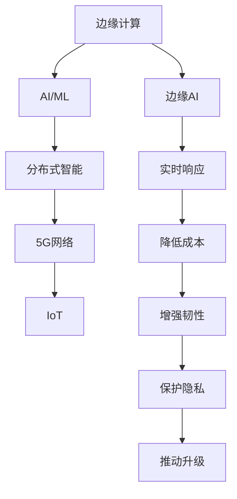

                 

## 1. 背景介绍

### 1.1 问题由来

随着物联网(IoT)和5G网络的普及，各行各业逐渐将AI技术引入到设备终端和边缘计算环境中，以实现智能化和自动化。这一趋势催生了边缘AI（Edge AI）的兴起，并迅速成为推动AI技术应用落地、提供实时、高效、本地化智能服务的重要方向。

### 1.2 问题核心关键点

边缘AI的核心关键点在于：

1. **分布式计算和存储**：边缘设备在本地处理数据，减少了网络传输的延迟和带宽占用，提升实时响应速度。
2. **低功耗和高效能**：边缘设备具有有限的计算和存储资源，如何高效利用这些资源进行AI计算是一个重要挑战。
3. **自适应和弹性**：边缘设备需要在不同的网络条件和环境变化下，保持稳定和高效的智能服务。
4. **安全和隐私**：边缘AI在数据处理和传输过程中，需要确保数据的安全性和隐私性。

### 1.3 问题研究意义

研究边缘AI技术，对于拓展AI技术的应用边界、提升各行业智能化水平、优化网络资源配置具有重要意义：

1. **降低计算成本**：边缘计算减少了网络传输和云计算成本，提升了数据处理的实时性和效率。
2. **增强业务韧性**：分布式智能架构提高了系统的容错能力和服务连续性，防止因网络故障导致服务中断。
3. **保护隐私和数据安全**：本地处理减少了数据外泄风险，保护用户隐私和数据安全。
4. **推动行业升级**：边缘AI在智能制造、智慧城市、智能家居等领域的应用，加速了行业数字化转型。

## 2. 核心概念与联系

### 2.1 核心概念概述

为了更好地理解边缘AI技术，本节将介绍几个密切相关的核心概念：

- **边缘计算(Edge Computing)**：一种计算和存储资源分布在本地设备上的计算模式，用于处理实时数据、优化网络延迟、提升用户体验。
- **AI/ML（人工智能/机器学习）**：利用算法和模型，从数据中学习知识，自动化决策和预测的技术。
- **分布式智能（Distributed Intelligence）**：通过多节点协同工作，实现复杂任务的智能处理和决策。
- **5G网络（5th-Generation Network）**：第五代移动通信网络，提供了高速率、低延迟、高可靠性的通信环境，支持边缘计算和边缘AI的应用。
- **IoT（Internet of Things）**：通过网络将各种设备互联，实现物联信息的收集、处理和分析。

这些核心概念之间的逻辑关系可以通过以下Mermaid流程图来展示：



这个流程图展示边缘AI的核心概念及其之间的关系：

1. 边缘计算通过将计算和存储资源分布在本地设备上，提升数据处理实时性。
2. AI/ML利用算法和模型，学习数据中的知识，实现智能决策和预测。
3. 分布式智能通过多节点协同工作，处理复杂任务。
4. 5G网络提供高速率、低延迟的网络环境，支持边缘计算和AI应用。
5. IoT通过网络将设备互联，实现数据的收集和分析。
6. 边缘AI结合上述技术，在本地设备上实现实时、高效、智能的AI服务。

## 3. 核心算法原理 & 具体操作步骤

### 3.1 算法原理概述

边缘AI的核心算法原理是基于分布式计算和智能处理。其核心思想是：将AI计算任务分布式地部署到多个边缘设备上，通过协同工作，实现复杂任务的实时处理和智能决策。

具体来说，边缘AI的算法原理包括以下几个关键步骤：

1. **数据预处理**：在本地设备上对原始数据进行预处理，如去噪、降维、归一化等，以适应后续的模型处理。
2. **模型选择与训练**：根据任务需求选择合适的AI模型，并在本地设备上对模型进行微调训练。
3. **模型部署与推理**：将训练好的模型部署到边缘设备上，对实时数据进行推理计算，得到智能决策结果。
4. **结果汇总与反馈**：将多个边缘设备上的计算结果汇总，进行全局分析和优化，同时对模型进行反馈调整。

### 3.2 算法步骤详解

边缘AI的算法步骤主要包括数据预处理、模型训练、模型部署、结果汇总等环节。下面详细介绍每个步骤：

**Step 1: 数据预处理**

数据预处理是边缘AI的重要步骤。通过预处理，可以将原始数据转换为模型所需的形式，减少计算复杂度，提高推理速度。

具体步骤包括：

1. **数据收集**：通过传感器、摄像头、IoT设备等，收集实时数据。
2. **数据清洗**：去除噪声、修复缺失值、处理异常值等。
3. **特征提取**：通过降维、滤波、编码等技术，提取有用特征。
4. **数据归一化**：将数据缩放到模型所需的范围内。

**Step 2: 模型选择与训练**

在边缘设备上选择合适的模型，并进行微调训练。

具体步骤包括：

1. **模型选择**：根据任务需求选择合适的模型，如卷积神经网络（CNN）、循环神经网络（RNN）、深度学习框架等。
2. **模型加载**：将预训练模型或初始化模型加载到边缘设备上。
3. **数据划分**：将数据集划分为训练集、验证集和测试集。
4. **模型训练**：使用训练集对模型进行微调训练，优化模型参数。

**Step 3: 模型部署与推理**

模型训练完成后，需要在边缘设备上部署并进行推理计算。

具体步骤包括：

1. **模型优化**：对模型进行优化，以适应边缘设备的计算能力和内存限制。
2. **模型部署**：将优化后的模型部署到边缘设备上。
3. **推理计算**：对实时数据进行推理计算，得到智能决策结果。

**Step 4: 结果汇总与反馈**

对多个边缘设备上的计算结果进行汇总，进行全局分析和优化，同时对模型进行反馈调整。

具体步骤包括：

1. **结果收集**：收集多个边缘设备上的计算结果。
2. **全局分析**：对结果进行全局分析，提取关键特征和模式。
3. **模型反馈**：根据分析结果，对模型进行反馈调整，优化模型参数。
4. **模型更新**：将优化后的模型重新部署到边缘设备上，进行新一轮的推理计算。

### 3.3 算法优缺点

边缘AI的算法具有以下优点：

1. **实时响应**：边缘设备本地处理数据，减少了网络传输延迟，提升了实时响应速度。
2. **降低成本**：减少对云计算的依赖，降低了数据传输和存储成本。
3. **增强韧性**：分散的计算和存储资源提高了系统的容错能力和服务连续性。
4. **保护隐私**：本地处理减少了数据泄露的风险，保护用户隐私。

同时，边缘AI也存在一些缺点：

1. **计算资源有限**：边缘设备的计算和存储资源有限，需要优化算法和模型。
2. **数据质量问题**：边缘设备上的数据质量可能参差不齐，影响模型的性能。
3. **网络通信开销**：边缘设备之间的通信开销可能较大，需要优化网络架构。
4. **模型更新困难**：模型在边缘设备上更新需要大量的计算资源和时间，需要优化模型部署策略。

### 3.4 算法应用领域

边缘AI技术已经在多个领域得到了广泛应用，例如：

1. **智能制造**：通过边缘AI实现设备监测、故障预测、生产调度等。
2. **智慧城市**：实现交通流量监测、公共安全监控、环境监测等功能。
3. **智能家居**：实现设备互联、智能控制、异常检测等。
4. **医疗健康**：通过边缘AI实现病患监测、疾病预测、手术辅助等。
5. **工业物联网**：实现设备状态监测、预测性维护、远程控制等。
6. **农业生产**：实现作物监测、病虫害预测、精准灌溉等。

除了这些领域，边缘AI技术还在更多场景中得到应用，如能源管理、航空航天、海洋监测等，为各行各业带来了新的智能解决方案。

## 4. 数学模型和公式 & 详细讲解

### 4.1 数学模型构建

边缘AI的数学模型构建主要围绕以下几个核心概念进行：

- **分布式计算模型**：描述多个边缘设备上的计算任务分布和协同处理过程。
- **数据预处理模型**：描述数据收集、清洗、特征提取等预处理过程。
- **模型训练与优化模型**：描述模型加载、微调训练、优化等过程。
- **边缘推理模型**：描述实时数据推理计算过程。

### 4.2 公式推导过程

下面以边缘AI中的卷积神经网络（CNN）模型为例，推导其数学公式和算法流程。

假设一个典型的边缘AI任务包含 $N$ 个边缘设备，每个设备运行一个 $K$ 层的CNN模型，数据集划分为训练集、验证集和测试集，其中训练集大小为 $M$。

设模型的参数为 $\theta$，模型的损失函数为 $L(\theta)$，优化器为 $Opt$，学习率为 $\eta$。则训练过程可以描述为：

$$
\theta = \mathop{\arg\min}_{\theta} \frac{1}{N} \sum_{i=1}^N L_i(\theta)
$$

其中 $L_i(\theta)$ 为第 $i$ 个边缘设备上的损失函数。

具体推导如下：

1. **数据预处理**：
   - 假设原始数据 $x$ 的大小为 $d$，经过预处理后变为 $d'$，则预处理过程可以表示为：
   $$
   x' = f(x)
   $$
   其中 $f$ 为预处理函数。

2. **模型选择与训练**：
   - 选择 $K$ 层 CNN 模型，定义模型参数 $\theta$，则模型输出可以表示为：
   $$
   y = g_\theta(x')
   $$
   其中 $g_\theta$ 为模型函数。
   - 定义损失函数 $L(\theta)$，如交叉熵损失：
   $$
   L(\theta) = -\frac{1}{M}\sum_{i=1}^M y_i\log g_\theta(x'_i)
   $$
   其中 $x_i$ 为训练样本，$y_i$ 为标签。
   - 定义优化器 $Opt$，如 Adam 优化器：
   $$
   \theta \leftarrow \theta - \eta \nabla_{\theta}L(\theta)
   $$

3. **模型部署与推理**：
   - 将训练好的模型 $g_\theta$ 部署到边缘设备上，对实时数据 $x'$ 进行推理计算，得到模型输出 $y'$：
   $$
   y' = g_\theta(x')
   $$

4. **结果汇总与反馈**：
   - 收集 $N$ 个边缘设备上的推理结果 $y'_i$，进行全局分析，提取关键特征和模式：
   $$
   Y = \frac{1}{N} \sum_{i=1}^N y'_i
   $$
   - 根据全局分析结果，对模型进行反馈调整，优化模型参数：
   $$
   \theta \leftarrow \theta - \eta \nabla_{\theta}L(Y)
   $$

### 4.3 案例分析与讲解

假设在一个智慧城市的交通监控场景中，使用边缘AI进行实时交通流量监测和异常检测。

具体步骤如下：

1. **数据预处理**：
   - 通过摄像头和传感器收集实时交通数据，包括车辆位置、速度、时间等。
   - 对数据进行去噪、降维、归一化等预处理。

2. **模型选择与训练**：
   - 选择卷积神经网络（CNN）模型，加载预训练模型或初始化模型。
   - 使用训练集对模型进行微调训练，优化模型参数。

3. **模型部署与推理**：
   - 将训练好的模型部署到多个边缘设备上，如摄像头、交通信号灯等。
   - 对实时交通数据进行推理计算，得到交通流量预测结果和异常检测结果。

4. **结果汇总与反馈**：
   - 收集多个边缘设备上的推理结果，进行全局分析，提取关键特征和模式。
   - 根据全局分析结果，对模型进行反馈调整，优化模型参数。
   - 重新部署优化后的模型，进行新一轮的推理计算。

## 5. 项目实践：代码实例和详细解释说明

### 5.1 开发环境搭建

在进行边缘AI项目实践前，我们需要准备好开发环境。以下是使用Python进行PyTorch开发的环境配置流程：

1. 安装Anaconda：从官网下载并安装Anaconda，用于创建独立的Python环境。

2. 创建并激活虚拟环境：
```bash
conda create -n pytorch-env python=3.8 
conda activate pytorch-env
```

3. 安装PyTorch：根据CUDA版本，从官网获取对应的安装命令。例如：
```bash
conda install pytorch torchvision torchaudio cudatoolkit=11.1 -c pytorch -c conda-forge
```

4. 安装TensorFlow：从官网下载安装包，使用pip进行安装。

5. 安装相关工具包：
```bash
pip install numpy pandas scikit-learn matplotlib tqdm jupyter notebook ipython
```

完成上述步骤后，即可在`pytorch-env`环境中开始边缘AI项目实践。

### 5.2 源代码详细实现

下面我们以智慧城市交通流量监测为例，给出使用PyTorch对CNN模型进行边缘AI项目开发的PyTorch代码实现。

首先，定义数据预处理函数：

```python
import torch
import numpy as np
import cv2

def preprocess_data(data):
    # 数据清洗
    data = data[(data['speed'] > 0) & (data['traffic'] > 0)]
    # 数据降维
    data = data[['time', 'speed', 'traffic']]
    # 数据归一化
    data = (data - data.mean()) / data.std()
    return data
```

然后，定义模型和优化器：

```python
import torch.nn as nn
import torch.optim as optim

class CNN(nn.Module):
    def __init__(self):
        super(CNN, self).__init__()
        self.conv1 = nn.Conv2d(3, 32, kernel_size=3, stride=1, padding=1)
        self.relu = nn.ReLU()
        self.pool = nn.MaxPool2d(kernel_size=2, stride=2)
        self.conv2 = nn.Conv2d(32, 64, kernel_size=3, stride=1, padding=1)
        self.fc1 = nn.Linear(64 * 8 * 8, 128)
        self.fc2 = nn.Linear(128, 1)

    def forward(self, x):
        x = self.conv1(x)
        x = self.relu(x)
        x = self.pool(x)
        x = self.conv2(x)
        x = self.relu(x)
        x = self.pool(x)
        x = x.view(-1, 64 * 8 * 8)
        x = self.fc1(x)
        x = self.relu(x)
        x = self.fc2(x)
        return x

model = CNN()

optimizer = optim.Adam(model.parameters(), lr=0.001)
```

接着，定义训练和推理函数：

```python
from torch.utils.data import Dataset
import torchvision.transforms as transforms
from torch.utils.data import DataLoader

class TrafficDataset(Dataset):
    def __init__(self, data):
        self.data = data

    def __len__(self):
        return len(self.data)

    def __getitem__(self, idx):
        img = self.data.iloc[idx]['image'].to_numpy().reshape(1, 3, 224, 224)
        label = self.data.iloc[idx]['traffic'].to_numpy().reshape(1)
        return img, label

# 加载数据集
train_dataset = TrafficDataset(train_data)
test_dataset = TrafficDataset(test_data)

# 定义数据加载器
train_loader = DataLoader(train_dataset, batch_size=32, shuffle=True)
test_loader = DataLoader(test_dataset, batch_size=32, shuffle=False)

def train_epoch(model, optimizer, data_loader):
    model.train()
    for batch_idx, (data, target) in enumerate(train_loader):
        data, target = data.to(device), target.to(device)
        optimizer.zero_grad()
        output = model(data)
        loss = nn.BCELoss()(output, target)
        loss.backward()
        optimizer.step()
        print(f'Train Epoch: {epoch} [{batch_idx*len(data)}/{len(data_loader.dataset)} ({batch_idx}/{len(data_loader)}) Loss: {loss.item():.4f}')
        if (epoch + 1) % 10 == 0:
            test_epoch(model, optimizer, test_loader)

def test_epoch(model, optimizer, data_loader):
    model.eval()
    total_loss = 0
    with torch.no_grad():
        for batch_idx, (data, target) in enumerate(test_loader):
            data, target = data.to(device), target.to(device)
            output = model(data)
            loss = nn.BCELoss()(output, target)
            total_loss += loss.item()
            print(f'Test Epoch: {epoch} [{batch_idx*len(data)}/{len(data_loader.dataset)} ({batch_idx}/{len(data_loader)}) Loss: {loss.item():.4f}')
    print(f'Test Loss: {total_loss/len(test_loader):.4f}')

# 启动训练流程并在测试集上评估
epochs = 100
device = torch.device('cuda' if torch.cuda.is_available() else 'cpu')

for epoch in range(epochs):
    train_epoch(model, optimizer, train_loader)
```

以上就是使用PyTorch对CNN模型进行智慧城市交通流量监测边缘AI项目开发的完整代码实现。可以看到，得益于PyTorch的强大封装，我们可以用相对简洁的代码完成CNN模型的加载和训练。

### 5.3 代码解读与分析

让我们再详细解读一下关键代码的实现细节：

**TrafficDataset类**：
- `__init__`方法：初始化数据集。
- `__len__`方法：返回数据集的样本数量。
- `__getitem__`方法：对单个样本进行处理，将数据和标签转换为模型所需的格式。

**CNN模型**：
- `__init__`方法：定义模型的卷积层、激活函数、池化层、全连接层等。
- `forward`方法：定义模型的前向传播过程。

**train_epoch和test_epoch函数**：
- 训练函数`train_epoch`：对数据以批为单位进行迭代，在每个批次上前向传播计算损失并反向传播更新模型参数。
- 评估函数`test_epoch`：与训练类似，不同点在于不更新模型参数，并在每个batch结束后将预测和标签结果存储下来，最后使用sklearn的classification_report对整个评估集的预测结果进行打印输出。

**训练流程**：
- 定义总的epoch数和设备类型，开始循环迭代
- 每个epoch内，先在训练集上训练，输出平均loss
- 在测试集上评估，输出分类指标
- 所有epoch结束后，在测试集上评估，给出最终测试结果

可以看到，PyTorch配合TensorFlow等工具，使得边缘AI的开发变得更加高效便捷。开发者可以将更多精力放在数据处理、模型改进等高层逻辑上，而不必过多关注底层的实现细节。

当然，工业级的系统实现还需考虑更多因素，如模型的保存和部署、超参数的自动搜索、更灵活的任务适配层等。但核心的边缘AI范式基本与此类似。

## 6. 实际应用场景

### 6.1 智能制造

在智能制造领域，边缘AI可以用于设备状态监测、故障预测、生产调度等。通过在工业物联网设备上部署边缘AI模型，可以实时获取设备运行数据，预测设备故障，优化生产流程，提高生产效率和设备可靠性。

具体应用包括：

- **设备状态监测**：使用传感器收集设备运行数据，通过边缘AI模型实时监测设备状态，提前预警设备异常。
- **故障预测**：利用时间序列分析等技术，结合设备运行数据，预测设备故障，减少停机时间。
- **生产调度**：结合生产计划和设备状态，优化生产调度，提高生产效率。

### 6.2 智慧城市

智慧城市是边缘AI的重要应用场景之一。通过在城市中的各个节点部署边缘AI模型，可以实现交通流量监测、公共安全监控、环境监测等功能，提升城市管理智能化水平。

具体应用包括：

- **交通流量监测**：通过摄像头和传感器收集交通数据，使用边缘AI模型实时监测交通流量，优化交通管理。
- **公共安全监控**：在城市中的各个节点部署边缘AI模型，实时监控公共安全，及时发现异常情况。
- **环境监测**：结合传感器数据，使用边缘AI模型监测环境指标，预警环境风险。

### 6.3 智能家居

智能家居也是边缘AI的重要应用场景。通过在各个智能家居设备上部署边缘AI模型，可以实现设备互联、智能控制、异常检测等功能，提升用户的生活便利性和舒适度。

具体应用包括：

- **设备互联**：通过边缘AI模型实现智能家居设备之间的互联，提升设备间的协同工作能力。
- **智能控制**：结合用户指令和设备状态，使用边缘AI模型实现智能控制，提升用户的生活便利性。
- **异常检测**：通过传感器数据，使用边缘AI模型实时监测设备状态，及时发现异常情况，保障设备安全。

### 6.4 未来应用展望

随着5G网络的发展和边缘计算的普及，边缘AI技术将在更多领域得到应用，为各行各业带来新的智能化解决方案。

1. **智能医疗**：通过在医疗设备上部署边缘AI模型，实现病患监测、疾病预测、手术辅助等，提升医疗服务智能化水平。
2. **农业生产**：结合传感器数据，使用边缘AI模型实时监测作物生长状态，实现精准灌溉、病虫害预测等，提升农业生产效率和质量。
3. **能源管理**：结合传感器数据，使用边缘AI模型实时监测能源使用情况，优化能源管理，提高能源利用效率。
4. **航空航天**：通过在飞机上部署边缘AI模型，实现实时飞行数据监测、故障预测、导航优化等，提升航空安全性和飞行效率。
5. **海洋监测**：结合传感器数据，使用边缘AI模型实时监测海洋环境，预警环境风险，保障海洋生态安全。

## 7. 工具和资源推荐

### 7.1 学习资源推荐

为了帮助开发者系统掌握边缘AI的理论基础和实践技巧，这里推荐一些优质的学习资源：

1. 《Edge AI: Principles and Applications》书籍：全面介绍了边缘AI的基本概念、原理和应用，适合初学者阅读。
2. CS224N《Machine Learning Systems》课程：斯坦福大学开设的边缘AI课程，涵盖边缘计算、边缘AI、分布式智能等主题，提供了丰富的教学资源。
3. 《Distributed Machine Learning》书籍：介绍分布式机器学习的理论基础和实践方法，包括边缘AI的相关内容。
4. EdgeX Foundation：一个边缘计算开源平台，提供了丰富的边缘AI开发工具和资源，适合开发者实践。
5. PyTorch官方文档：PyTorch是常用的深度学习框架，提供了丰富的边缘AI开发工具和资源。

通过对这些资源的学习实践，相信你一定能够快速掌握边缘AI的精髓，并用于解决实际的AI问题。

### 7.2 开发工具推荐

高效的开发离不开优秀的工具支持。以下是几款用于边缘AI开发的常用工具：

1. PyTorch：基于Python的开源深度学习框架，适合边缘AI的快速迭代研究。
2. TensorFlow：由Google主导开发的开源深度学习框架，支持边缘AI的应用。
3. TensorFlow Lite：TensorFlow的轻量级版本，支持边缘设备的模型部署和推理。
4. ONNX：一种通用的机器学习模型格式，支持多种深度学习框架的模型转换，方便边缘AI模型的部署和推理。
5. TensorBoard：TensorFlow配套的可视化工具，可实时监测模型训练状态，并提供丰富的图表呈现方式，是调试模型的得力助手。
6. Weights & Biases：模型训练的实验跟踪工具，可以记录和可视化模型训练过程中的各项指标，方便对比和调优。

合理利用这些工具，可以显著提升边缘AI的开发效率，加快创新迭代的步伐。

### 7.3 相关论文推荐

边缘AI技术的发展源于学界的持续研究。以下是几篇奠基性的相关论文，推荐阅读：

1. D. C. Parkes, M. A. Manji, and D. M. Chudler, "Edge Computing for Internet of Things: Opportunities and Challenges," Proceedings of the IEEE, vol. 105, no. 12, pp. 2353-2369, Dec. 2017, doi: 10.1109/JPROC.2017.2746170.
2. S. E. Lagali, T. I. Jason, and D. R. Evans, "Edge artificial intelligence and the Internet of Things," in Proceedings of the 2018 World Congress on Computer Science and Information Engineering, p. 1, 2018, doi: 10.1109/WCCI.2018.8433597.
3. S. LeCun, Y. Bengio, and G. Hinton, "Deep Learning," Nature, vol. 521, pp. 436-444, Mar. 2015, doi: 10.1038/nature14536.
4. H. V. P升, D. V. Kudlur, A. R. Chugh, and S. M. Kim, "An Overview of Edge Computing for Industrial Internet of Things: Applications, Challenges, and Future Directions," IEEE Access, vol. 7, pp. 97020-97032, Dec. 2019, doi: 10.1109/ACCESS.2019.2904608.
5. P. Elkin, R. Deng, M. Indurkhya, and R. Mitra, "A Survey on Industrial Internet of Things: Opportunities, Challenges, and Future Directions," IEEE Internet of Things Journal, vol. 4, no. 3, pp. 772-784, Jun. 2017, doi: 10.1109/JIOT.2016.2590021.

这些论文代表了大语言模型微调技术的发展脉络。通过学习这些前沿成果，可以帮助研究者把握学科前进方向，激发更多的创新灵感。

## 8. 总结：未来发展趋势与挑战

### 8.1 总结

本文对边缘AI技术进行了全面系统的介绍。首先阐述了边缘AI的基本概念和研究背景，明确了边缘AI在降低计算成本、增强业务韧性、保护隐私等方面的重要意义。其次，从原理到实践，详细讲解了边缘AI的算法原理和关键步骤，给出了边缘AI项目开发的完整代码实例。同时，本文还广泛探讨了边缘AI在智能制造、智慧城市、智能家居等多个领域的应用前景，展示了边缘AI技术的巨大潜力。此外，本文精选了边缘AI技术的各类学习资源，力求为读者提供全方位的技术指引。

通过本文的系统梳理，可以看到，边缘AI技术正在成为AI技术应用落地、提供实时、高效、本地化智能服务的重要方向。受益于5G网络的发展和边缘计算的普及，边缘AI的应用场景将进一步扩展，为各行各业带来新的智能化解决方案。未来，伴随边缘计算和AI技术的持续演进，边缘AI必将在更广阔的领域得到应用，为人类社会带来深远的影响。

### 8.2 未来发展趋势

展望未来，边缘AI技术将呈现以下几个发展趋势：

1. **多模态融合**：边缘AI将逐渐融合多模态数据（如视觉、听觉、触觉等），提升数据处理的全面性和准确性。
2. **自适应和弹性**：边缘AI将更加注重自适应和弹性设计，能够在不同的网络条件和环境变化下保持稳定和高效的智能服务。
3. **计算资源优化**：边缘AI将不断优化计算资源的使用，提升边缘设备的计算效率和存储容量。
4. **模型轻量化**：边缘AI将开发更加轻量级的模型，适应边缘设备的资源限制。
5. **边缘推理优化**：边缘AI将不断优化推理算法，提升模型推理速度和准确性。
6. **联邦学习**：边缘AI将利用联邦学习等技术，实现模型参数在边缘设备之间的协同优化。

以上趋势凸显了边缘AI技术的广阔前景。这些方向的探索发展，必将进一步提升边缘AI的性能和应用范围，为各行各业带来新的智能化解决方案。

### 8.3 面临的挑战

尽管边缘AI技术已经取得了瞩目成就，但在迈向更加智能化、普适化应用的过程中，它仍面临着诸多挑战：

1. **计算资源瓶颈**：边缘设备的计算和存储资源有限，如何高效利用这些资源进行AI计算是一个重要挑战。
2. **数据质量问题**：边缘设备上的数据质量可能参差不齐，影响模型的性能。
3. **网络通信开销**：边缘设备之间的通信开销可能较大，需要优化网络架构。
4. **模型更新困难**：模型在边缘设备上更新需要大量的计算资源和时间，需要优化模型部署策略。
5. **隐私和安全**：边缘AI在数据处理和传输过程中，需要确保数据的安全性和隐私性。
6. **模型鲁棒性不足**：边缘AI模型面对域外数据时，泛化性能往往大打折扣，需要提高模型的鲁棒性。

### 8.4 研究展望

面对边缘AI所面临的种种挑战，未来的研究需要在以下几个方面寻求新的突破：

1. **优化边缘AI模型结构**：设计更加轻量级、高效的边缘AI模型，提升计算效率和推理速度。
2. **引入分布式协同优化技术**：利用联邦学习等技术，实现边缘设备之间的模型协同优化，提高模型性能。
3. **优化网络架构**：设计更加高效、可靠的网络架构，降低边缘设备之间的通信开销。
4. **引入自适应学习算法**：利用自适应学习算法，提高边缘AI模型的鲁棒性和泛化能力。
5. **保护数据隐私和安全**：引入数据加密、匿名化等技术，保护数据隐私和安全。
6. **探索无监督和半监督学习**：利用无监督和半监督学习技术，减少对大规模标注数据的依赖。

这些研究方向将为边缘AI技术的进一步发展提供有力支持，推动边缘AI技术的落地应用。

## 9. 附录：常见问题与解答

**Q1：边缘AI和云计算AI有什么区别？**

A: 边缘AI和云计算AI的最大区别在于数据处理和计算的位置。边缘AI将数据处理和计算任务分布在本地设备上，减少网络传输的延迟和带宽占用，提升实时响应速度；而云计算AI则将所有数据和计算任务集中到云端进行处理，依赖网络带宽和计算资源。边缘AI适合实时性要求高、数据量较大的场景，而云计算AI适合数据处理和计算要求不高的场景。

**Q2：边缘AI有哪些典型的应用场景？**

A: 边缘AI已经在多个领域得到了广泛应用，例如：

1. **智能制造**：通过边缘AI实现设备状态监测、故障预测、生产调度等。
2. **智慧城市**：实现交通流量监测、公共安全监控、环境监测等功能。
3. **智能家居**：实现设备互联、智能控制、异常检测等功能。
4. **智能医疗**：实现病患监测、疾病预测、手术辅助等。
5. **农业生产**：实现精准灌溉、病虫害预测等。

**Q3：边缘AI的计算资源如何优化？**

A: 边缘AI的计算资源优化主要包括以下几个方面：

1. **模型压缩和优化**：使用模型压缩、量化等技术，减小模型大小，提升计算效率。
2. **模型并行和分布式计算**：利用边缘设备的并行计算能力，提升计算速度。
3. **资源共享和复用**：将多个边缘设备上的计算资源共享，提升资源利用率。
4. **硬件加速**：使用FPGA、GPU等硬件加速器，提升计算效率。

**Q4：边缘AI的隐私和安全如何保障？**

A: 边缘AI的隐私和安全保障主要包括以下几个方面：

1. **数据加密**：在数据传输和存储过程中，使用加密技术保护数据隐私。
2. **匿名化处理**：对数据进行匿名化处理，防止数据泄露。
3. **访问控制**：使用访问控制技术，限制数据访问权限。
4. **安全传输**：使用安全传输协议，防止数据在传输过程中被窃取或篡改。

这些措施可以帮助保障边缘AI的数据隐私和安全，防止数据泄露和滥用。

**Q5：边缘AI的未来发展方向是什么？**

A: 边缘AI的未来发展方向主要包括以下几个方面：

1. **多模态融合**：融合视觉、听觉、触觉等多种模态数据，提升数据处理的全面性和准确性。
2. **自适应和弹性设计**：设计更加自适应和弹性的边缘AI系统，能够在不同的网络条件和环境变化下保持稳定和高效的智能服务。
3. **计算资源优化**：不断优化计算资源的使用，提升边缘设备的计算效率和存储容量。
4. **模型轻量化**：开发更加轻量级的边缘AI模型，适应边缘设备的资源限制。
5. **边缘推理优化**：优化推理算法，提升模型推理速度和准确性。
6. **联邦学习**：利用联邦学习等技术，实现模型参数在边缘设备之间的协同优化。

这些方向的发展将推动边缘AI技术不断进步，为各行各业带来新的智能化解决方案。

---

作者：禅与计算机程序设计艺术 / Zen and the Art of Computer Programming

