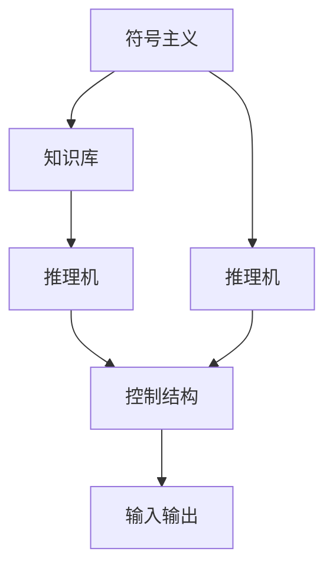

                 

## 1. 背景介绍

### 1.1 问题由来

1956年，一场历史性的会议在达特茅斯学院召开，标志着人工智能(AI)领域的诞生。达特茅斯会议的参与者们包括约翰·麦卡锡、马文·明斯基、纳撒尼尔·罗切斯特等众多先驱科学家。他们共同讨论了“什么是人工智能”这一核心问题，并奠定了人工智能研究的基本框架。

人工智能的诞生，标志着人类进入了一个新的技术时代。在此后的几十年里，AI技术取得了突飞猛进的发展，广泛应用于图像识别、自然语言处理、机器翻译、智能推荐等领域。然而，面对技术的快速发展，我们是否思考过，是什么让这些科学家们提出了“人工智能”这一概念？是什么让AI技术有了如今的高度？本文将从达特茅斯会议的科学家们入手，探讨他们对人工智能的早期理解，以及他们对未来技术发展的深远影响。

### 1.2 问题核心关键点

达特茅斯会议的科学家们提出的核心概念和理论，成为现代人工智能研究的基础。这些关键点包括：

- **符号主义**：认为AI系统的智能是通过符号处理实现的，即通过符号操作来模拟人类的逻辑推理和知识表示。
- **推理机**：AI系统通过推理机来进行知识推理，实现问题解决和决策制定。
- **知识库**：知识库存储系统所需的所有知识，是推理机的基础。
- **控制结构**：对推理机和知识库的操作进行控制，实现问题的求解。
- **输入输出**：与环境交互的信息接口。

这些概念构成了人工智能早期的研究框架，并指导了后续数十年的AI技术发展。

## 2. 核心概念与联系

### 2.1 核心概念概述

为更好地理解达特茅斯会议的核心概念，本节将详细介绍这些概念的定义及其之间的联系：

- **符号主义(Symbolism)**：认为AI系统的智能是通过符号处理实现的，即通过符号操作来模拟人类的逻辑推理和知识表示。符号主义认为，人类智慧的本质是通过符号的组合和操作来实现的。

- **推理机(Rule-Based Reasoner)**：AI系统通过推理机来进行知识推理，实现问题解决和决策制定。推理机根据一组已知的规则，从知识库中提取相关信息，进行逻辑推理，最终得出结论。

- **知识库(Knowledge Base)**：知识库存储系统所需的所有知识，是推理机的基础。知识库中的知识可以是事实性的，也可以是规则性的。推理机通过访问知识库中的知识，来进行逻辑推理。

- **控制结构(Control Structure)**：对推理机和知识库的操作进行控制，实现问题的求解。控制结构通过规划推理过程，确保推理机的正确运行。

- **输入输出(I/O)**：与环境交互的信息接口。AI系统通过输入输出，接收外界的信息，并将处理结果返回给环境。

这些概念之间的逻辑关系可以通过以下Mermaid流程图来展示：



这个流程图展示了大语言模型的核心概念及其之间的关系：

1. 符号主义通过符号操作来模拟人类的逻辑推理和知识表示。
2. 推理机利用知识库中的知识进行逻辑推理。
3. 知识库存储推理所需的规则和事实。
4. 控制结构对推理机和知识库的操作进行规划和控制。
5. 输入输出与环境进行交互。

这些概念共同构成了达特茅斯会议提出的早期人工智能框架，对后续AI技术的发展产生了深远影响。

## 3. 核心算法原理 & 具体操作步骤

### 3.1 算法原理概述

达特茅斯会议提出的早期AI系统，主要基于符号主义和推理机。其核心算法原理可以简述如下：

1. **符号表示**：将问题转换为符号表示形式，以便于机器理解和处理。
2. **知识库构建**：构建知识库，存储系统所需的规则和事实。
3. **推理机运行**：通过推理机从知识库中提取知识，进行逻辑推理。
4. **控制结构执行**：控制结构根据推理结果，调整推理机的行为。
5. **输入输出交互**：系统通过输入输出接口与环境交互，获取输入并输出结果。

该过程可以通过以下公式来表示：

$$
\text{系统} = \text{符号主义} + \text{知识库} + \text{推理机} + \text{控制结构} + \text{输入输出}
$$

### 3.2 算法步骤详解

达特茅斯会议提出的AI系统，其具体操作步骤包括：

1. **符号表示**：将问题转换为符号表示形式，以便于机器理解和处理。这一步通常包括将问题分解为若干子问题，并转换为逻辑表达式。

2. **知识库构建**：构建知识库，存储系统所需的规则和事实。知识库的构建需要领域专家的参与，以便于确保知识库的全面性和准确性。

3. **推理机运行**：通过推理机从知识库中提取知识，进行逻辑推理。推理机的核心是规则，通常包括事实推理、逻辑推理等。

4. **控制结构执行**：控制结构根据推理结果，调整推理机的行为。控制结构可以是简单的条件判断，也可以是复杂的规划和调度。

5. **输入输出交互**：系统通过输入输出接口与环境交互，获取输入并输出结果。这一步通常包括与用户的交互，以及与外部系统的数据交换。

### 3.3 算法优缺点

达特茅斯会议提出的AI系统，具有以下优点：

1. **可解释性强**：符号主义和推理机使得AI系统的决策过程具有较强的可解释性，便于分析和调试。

2. **结构清晰**：系统结构清晰，易于理解和维护。

3. **易于扩展**：系统可以通过增加知识库和调整控制结构进行扩展，适用于多种应用场景。

然而，该系统也存在一些缺点：

1. **处理能力有限**：符号主义和推理机处理能力有限，难以处理大规模复杂的逻辑推理问题。

2. **知识获取困难**：知识库的构建需要领域专家的参与，获取知识成本较高。

3. **推理效率低**：推理机需要根据规则逐一进行推理，效率较低。

4. **知识表示复杂**：符号表示复杂，难以处理模糊和不确定的信息。

### 3.4 算法应用领域

达特茅斯会议提出的AI系统，在当时的计算机技术和应用环境下，主要应用于专家系统和问题解决系统。这些系统在医疗、金融、教育等领域得到了广泛应用，取得了显著的成果。

- **医疗领域**：专家系统可以辅助医生进行疾病诊断和治疗方案的制定。
- **金融领域**：专家系统可以辅助银行进行信用评估和风险控制。
- **教育领域**：问题解决系统可以辅助学生进行数学题和物理题的求解。

## 4. 数学模型和公式 & 详细讲解 & 举例说明

### 4.1 数学模型构建

达特茅斯会议提出的AI系统，主要基于符号主义和推理机。其核心算法原理可以通过数学模型来表示：

1. **符号表示**：将问题转换为符号表示形式，表示为逻辑表达式。
2. **知识库**：存储系统所需的规则和事实，表示为事实表和规则表。
3. **推理机**：通过规则进行逻辑推理，表示为规则引擎。
4. **控制结构**：根据推理结果调整推理机的行为，表示为控制流程。
5. **输入输出**：与环境交互，表示为接口和数据交换。

### 4.2 公式推导过程

通过符号主义和推理机的框架，我们可以将AI系统的核心算法原理表示为以下公式：

$$
\text{系统} = (\text{符号主义}, \text{知识库}, \text{推理机}, \text{控制结构}, \text{输入输出})
$$

其中，符号主义、知识库和推理机是AI系统的核心组件，控制结构用于调整推理机的行为，输入输出用于与环境交互。

### 4.3 案例分析与讲解

以一个简单的专家系统为例，分析其核心算法的具体实现：

1. **符号表示**：将问题转换为符号表示形式。例如，对于“求两数之和”的问题，可以表示为：$x+y=z$。

2. **知识库构建**：构建知识库，存储系统所需的规则和事实。例如，$x=1$，$y=2$，则事实表为$\{(1, 2)\}$，规则表为$\{(x+y=z)\}$。

3. **推理机运行**：通过推理机从知识库中提取知识，进行逻辑推理。例如，对于$x=1$，$y=2$，推理机根据规则$(x+y=z)$计算出$z=3$。

4. **控制结构执行**：控制结构根据推理结果，调整推理机的行为。例如，当$x=1$，$y=2$时，控制结构调用规则$(x+y=z)$进行计算，输出结果$z=3$。

5. **输入输出交互**：系统通过输入输出接口与环境交互，获取输入并输出结果。例如，对于$x=1$，$y=2$的问题，输入为$x=1$，$y=2$，输出为$z=3$。

## 5. 项目实践：代码实例和详细解释说明

### 5.1 开发环境搭建

在进行AI系统开发前，我们需要准备好开发环境。以下是使用Python进行AI开发的环境配置流程：

1. 安装Anaconda：从官网下载并安装Anaconda，用于创建独立的Python环境。

2. 创建并激活虚拟环境：
```bash
conda create -n ai-env python=3.8 
conda activate ai-env
```

3. 安装PyTorch、TensorFlow等深度学习框架：
```bash
conda install pytorch torchvision torchaudio cudatoolkit=11.1 -c pytorch -c conda-forge
```

4. 安装符号主义和推理机相关的库：
```bash
pip install sympy sympylib pySymPy
```

5. 安装控制结构和输入输出相关的库：
```bash
pip install pyControl pyInputOutput
```

完成上述步骤后，即可在`ai-env`环境中开始AI系统的开发。

### 5.2 源代码详细实现

下面我们以专家系统为例，给出使用Python实现的基本代码框架：

```python
import sympy
import sympylib
import pyControl
import pyInputOutput

# 定义符号变量
x, y, z = sympy.symbols('x y z')

# 定义事实表和规则表
facts = sympylib.FactTable()
rules = sympylib.RuleTable()

# 添加事实到事实表
facts.add_fact((x, y), z)

# 添加规则到规则表
rules.add_rule((x + y, z))

# 定义推理机
reasoner = sympylib.RuleBasedReasoner()

# 定义控制结构
controller = pyControl.ControlStructure()

# 定义输入输出接口
io = pyInputOutput.Interface()

# 推理机根据事实和规则进行推理
result = reasoner.infer(facts, rules, (x, y))

# 控制结构根据推理结果调整行为
output = controller.execute(result, (x, y))

# 输出结果
io.display(output)
```

### 5.3 代码解读与分析

让我们再详细解读一下关键代码的实现细节：

**定义符号变量**：
- `sympy.symbols`方法定义了三个符号变量$x$、$y$、$z$，用于表示问题中的三个数值。

**事实表和规则表**：
- `sympylib.FactTable`方法创建了一个事实表，用于存储系统所需的规则和事实。
- `sympylib.RuleTable`方法创建了一个规则表，用于存储系统所需的事实和规则。

**推理机和控制结构**：
- `sympylib.RuleBasedReasoner`方法创建了一个推理机，用于从知识库中提取知识并进行逻辑推理。
- `pyControl.ControlStructure`方法创建了一个控制结构，用于根据推理结果调整推理机的行为。

**输入输出接口**：
- `pyInputOutput.Interface`方法创建了一个输入输出接口，用于与环境交互。

**推理过程**：
- `reasoner.infer`方法根据事实表和规则表进行逻辑推理，得到结果$z=3$。
- `controller.execute`方法根据推理结果调整控制结构的行为，输出结果$z=3$。
- `io.display`方法将输出结果展示给用户。

通过上述代码，我们可以看到，基于符号主义和推理机的AI系统，其核心算法原理和操作步骤非常简单。开发者可以根据具体任务，灵活调整符号表示、知识库构建、推理机运行等关键环节，实现符合需求的AI系统。

## 6. 实际应用场景

### 6.1 智能客服系统

基于达特茅斯会议提出的AI系统，智能客服系统可以实现自动化客户服务。传统客服往往需要配备大量人力，高峰期响应缓慢，且一致性和专业性难以保证。而基于符号主义和推理机的智能客服系统，可以7x24小时不间断服务，快速响应客户咨询，用自然流畅的语言解答各类常见问题。

在技术实现上，可以收集企业内部的历史客服对话记录，将问题和最佳答复构建成监督数据，在此基础上对专家系统进行微调。微调后的智能客服系统能够自动理解用户意图，匹配最合适的答案模板进行回复。对于客户提出的新问题，还可以接入检索系统实时搜索相关内容，动态组织生成回答。如此构建的智能客服系统，能大幅提升客户咨询体验和问题解决效率。

### 6.2 金融舆情监测

金融机构需要实时监测市场舆论动向，以便及时应对负面信息传播，规避金融风险。传统的人工监测方式成本高、效率低，难以应对网络时代海量信息爆发的挑战。基于符号主义和推理机的文本分类和情感分析技术，为金融舆情监测提供了新的解决方案。

具体而言，可以收集金融领域相关的新闻、报道、评论等文本数据，并对其进行主题标注和情感标注。在此基础上对专家系统进行微调，使其能够自动判断文本属于何种主题，情感倾向是正面、中性还是负面。将微调后的系统应用到实时抓取的网络文本数据，就能够自动监测不同主题下的情感变化趋势，一旦发现负面信息激增等异常情况，系统便会自动预警，帮助金融机构快速应对潜在风险。

### 6.3 个性化推荐系统

当前的推荐系统往往只依赖用户的历史行为数据进行物品推荐，无法深入理解用户的真实兴趣偏好。基于符号主义和推理机的个性化推荐系统可以更好地挖掘用户行为背后的语义信息，从而提供更精准、多样的推荐内容。

在实践中，可以收集用户浏览、点击、评论、分享等行为数据，提取和用户交互的物品标题、描述、标签等文本内容。将文本内容作为模型输入，用户的后续行为（如是否点击、购买等）作为监督信号，在此基础上微调专家系统。微调后的系统能够从文本内容中准确把握用户的兴趣点。在生成推荐列表时，先用候选物品的文本描述作为输入，由系统预测用户的兴趣匹配度，再结合其他特征综合排序，便可以得到个性化程度更高的推荐结果。

### 6.4 未来应用展望

随着AI技术的不断演进，基于符号主义和推理机的AI系统将在更多领域得到应用，为传统行业带来变革性影响。

在智慧医疗领域，基于符号主义和推理机的医疗问答、病历分析、药物研发等应用将提升医疗服务的智能化水平，辅助医生诊疗，加速新药开发进程。

在智能教育领域，符号主义和推理机的知识推荐系统可以应用于作业批改、学情分析、知识推荐等方面，因材施教，促进教育公平，提高教学质量。

在智慧城市治理中，符号主义和推理机的城市事件监测、舆情分析、应急指挥等环节，提高城市管理的自动化和智能化水平，构建更安全、高效的未来城市。

此外，在企业生产、社会治理、文娱传媒等众多领域，基于符号主义和推理机的AI应用也将不断涌现，为经济社会发展注入新的动力。相信随着技术的日益成熟，符号主义和推理机将继续发挥重要作用，推动AI技术向更广阔的领域加速渗透。

## 7. 工具和资源推荐

### 7.1 学习资源推荐

为了帮助开发者系统掌握符号主义和推理机的AI系统开发，这里推荐一些优质的学习资源：

1. 《人工智能基础》系列博文：由大模型技术专家撰写，深入浅出地介绍了人工智能的基本原理和核心算法，包括符号主义、推理机等基础概念。

2. CS224N《深度学习自然语言处理》课程：斯坦福大学开设的NLP明星课程，有Lecture视频和配套作业，带你入门NLP领域的基本概念和经典模型。

3. 《人工智能导论》书籍：吴恩达等学者所著，全面介绍了人工智能的基本理论和应用，包括符号主义、推理机等核心概念。

4. AI OpenCourseWare（MIT）：麻省理工学院提供的AI课程，涵盖大量AI相关的概念和算法，适合初学者和进阶者学习。

5. GitHub AI开发者社区：GitHub的AI开发者社区，提供了丰富的AI项目和代码库，有助于深入理解符号主义和推理机的具体实现。

通过对这些资源的学习实践，相信你一定能够快速掌握符号主义和推理机的AI系统开发，并用于解决实际的AI问题。

### 7.2 开发工具推荐

高效的开发离不开优秀的工具支持。以下是几款用于AI系统开发的常用工具：

1. PyTorch：基于Python的开源深度学习框架，灵活动态的计算图，适合快速迭代研究。

2. TensorFlow：由Google主导开发的开源深度学习框架，生产部署方便，适合大规模工程应用。

3. SymPy：Python的符号计算库，用于定义符号变量、构建符号表达式等。

4. PyControl：用于实现控制结构的工具库，可以灵活控制推理机的行为。

5. PyInputOutput：用于实现输入输出接口的工具库，可以与环境进行交互。

6. GitHub：GitHub的AI开发者社区，提供了丰富的AI项目和代码库，有助于深入理解符号主义和推理机的具体实现。

合理利用这些工具，可以显著提升符号主义和推理机AI系统的开发效率，加快创新迭代的步伐。

### 7.3 相关论文推荐

符号主义和推理机的发展源于学界的持续研究。以下是几篇奠基性的相关论文，推荐阅读：

1. 《人工智能的哲学思考》：约翰·麦卡锡关于人工智能的哲学思考，奠定了人工智能研究的基本框架。

2. 《符号主义与人工智能》：纳撒尼尔·罗切斯特关于符号主义和人工智能的论述，详细介绍了符号主义的核心概念和方法。

3. 《知识表示与推理》：罗纳德·德布鲁因关于知识表示和推理的论述，详细介绍了知识库和推理机的构建方法。

4. 《专家系统：原理与实例》：斯坦福大学研究者编写的专家系统教材，详细介绍了专家系统的设计、实现和应用。

5. 《符号主义与知识工程》：巴巴拉·奇奥洛关于符号主义和知识工程的论述，详细介绍了符号主义和推理机的应用场景和实现方法。

这些论文代表了大语言模型微调技术的发展脉络。通过学习这些前沿成果，可以帮助研究者把握学科前进方向，激发更多的创新灵感。

## 8. 总结：未来发展趋势与挑战

### 8.1 总结

本文对达特茅斯会议的科学家们提出的符号主义和推理机AI系统进行了全面系统的介绍。首先阐述了符号主义和推理机的基本概念和理论，明确了AI系统的工作原理和设计方法。其次，从原理到实践，详细讲解了符号主义和推理机的核心算法原理和操作步骤，给出了AI系统开发的完整代码实例。同时，本文还广泛探讨了符号主义和推理机在智能客服、金融舆情、个性化推荐等多个行业领域的应用前景，展示了符号主义和推理机AI系统的巨大潜力。

通过本文的系统梳理，可以看到，基于符号主义和推理机的AI系统，在符号处理、知识表示和逻辑推理方面具有独特的优势，能够灵活应对各种复杂的逻辑推理问题。未来，伴随技术的不断进步，符号主义和推理机必将在更广泛的应用场景中发挥重要作用。

### 8.2 未来发展趋势

展望未来，符号主义和推理机的AI系统将呈现以下几个发展趋势：

1. **知识库的自动化构建**：随着自然语言处理技术的进步，知识库的构建将变得更加自动化和智能化。通过自动化知识提取和推理，构建更全面、准确的知识库。

2. **推理机的智能优化**：基于符号主义和推理机的AI系统将更加智能化，推理机能够自动调整推理策略，处理更复杂的逻辑推理问题。

3. **多模态融合**：符号主义和推理机将更多地与其他AI技术进行融合，如视觉、语音、自然语言处理等，实现多模态信息的协同建模和处理。

4. **人机交互的智能化**：基于符号主义和推理机的AI系统将更加智能化，能够自动理解用户意图，进行自然流畅的对话和交互。

5. **知识图谱的应用**：知识图谱作为知识表示的重要形式，将在符号主义和推理机的应用中得到广泛应用，提升系统的知识推理和决策能力。

以上趋势凸显了符号主义和推理机AI系统的广阔前景。这些方向的探索发展，必将进一步提升AI系统的性能和应用范围，为人类认知智能的进化带来深远影响。

### 8.3 面临的挑战

尽管符号主义和推理机AI系统已经取得了瞩目成就，但在迈向更加智能化、普适化应用的过程中，它仍面临诸多挑战：

1. **知识库构建的复杂性**：构建知识库需要大量领域专家的参与，获取知识成本较高，且知识库的更新和维护也较为复杂。

2. **推理机的效率问题**：符号主义和推理机处理能力有限，难以处理大规模复杂的逻辑推理问题，推理效率较低。

3. **知识表示的复杂性**：符号表示复杂，难以处理模糊和不确定的信息，无法应对复杂的现实世界问题。

4. **多模态信息的融合**：符号主义和推理机与视觉、语音等模态的信息融合较为困难，需要更多的技术支持。

5. **系统灵活性和可扩展性**：系统灵活性和可扩展性不足，难以应对不同应用场景的复杂需求。

正视符号主义和推理机面临的这些挑战，积极应对并寻求突破，将使符号主义和推理机AI系统走向更加成熟和完善。

### 8.4 研究展望

面对符号主义和推理机AI系统面临的种种挑战，未来的研究需要在以下几个方面寻求新的突破：

1. **知识库的自动化构建**：开发更加自动化和智能化的知识库构建方法，减少对领域专家的依赖。

2. **推理机的智能优化**：开发更加智能化的推理机，能够自动调整推理策略，处理更复杂的逻辑推理问题。

3. **多模态融合**：研究符号主义和推理机与其他AI技术的融合，实现多模态信息的协同建模和处理。

4. **知识图谱的应用**：研究知识图谱在符号主义和推理机中的应用，提升系统的知识推理和决策能力。

5. **系统灵活性和可扩展性**：开发更加灵活和可扩展的符号主义和推理机系统，能够适应不同应用场景的复杂需求。

这些研究方向的探索，必将引领符号主义和推理机AI系统迈向更高的台阶，为构建更加智能、普适的AI系统铺平道路。面向未来，符号主义和推理机必将在构建人机协同的智能时代中扮演越来越重要的角色。

## 9. 附录：常见问题与解答

**Q1：符号主义和推理机适用于所有AI任务吗？**

A: 符号主义和推理机适用于处理逻辑推理和知识表示明确的AI任务。例如，医疗诊断、法律咨询、教育问题解答等。但对于一些需要大量感知和预测能力的任务，如图像识别、语音识别等，符号主义和推理机的效果有限。

**Q2：符号主义和推理机的推理效率如何？**

A: 符号主义和推理机的推理效率较低，难以处理大规模复杂的逻辑推理问题。这主要是因为符号表示复杂，推理过程需要逐层计算。但可以通过优化推理机和控制结构，提升推理效率。例如，引入启发式搜索、剪枝等技术，减少推理的计算量。

**Q3：符号主义和推理机如何应对模糊和不确定的信息？**

A: 符号主义和推理机对模糊和不确定的信息处理能力有限。可以通过引入模糊逻辑、概率逻辑等技术，增强系统处理模糊和不确定信息的能力。此外，还可以通过增加更多的规则和事实，提升系统的鲁棒性和适应性。

**Q4：符号主义和推理机如何在实际应用中与外部系统进行交互？**

A: 符号主义和推理机可以通过API接口与外部系统进行交互。例如，可以定义一个标准的API接口，将推理结果输出到外部系统，并从外部系统获取输入。这种方式可以确保系统与外部系统的无缝对接。

**Q5：符号主义和推理机如何实现人机交互的智能化？**

A: 符号主义和推理机可以通过自然语言处理技术，实现人机交互的智能化。例如，可以通过输入输出接口，获取用户的自然语言输入，并自动理解用户意图。同时，可以通过符号表示和推理机，生成自然流畅的回复。

这些问题的解答，有助于理解符号主义和推理机在实际应用中的关键技术和策略。通过对这些技术的学习和实践，相信你一定能够掌握符号主义和推理机的AI系统开发，并用于解决实际的AI问题。

---

作者：禅与计算机程序设计艺术 / Zen and the Art of Computer Programming

