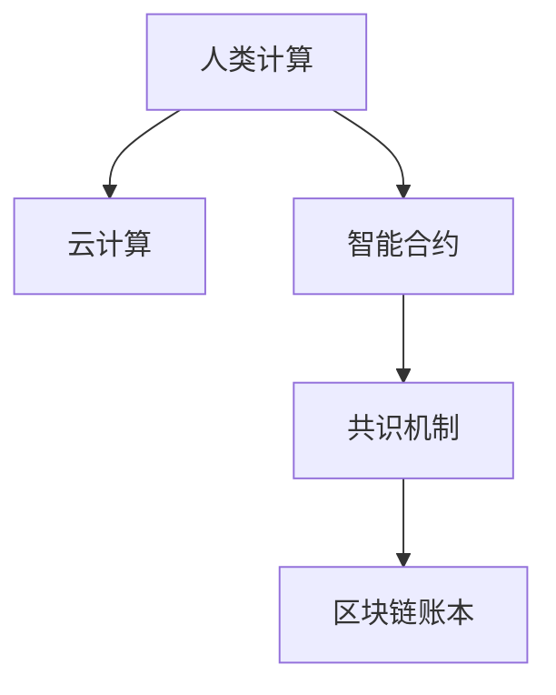

                 

# 连接人类智慧的纽带：人类计算的协作精神

> 关键词：人类计算、协作精神、分布式系统、云计算、智能合约、共识机制、区块链、计算理论

## 1. 背景介绍

### 1.1 问题由来

在科技发展的长河中，人类智慧的演进经历了一个由集中到分散的过程。从早期的中央集中式计算模式，到如今的分布式协作模式，人类智慧的演进正逐步从个体向群体、从集中向分散迈进。而这一切的背后，都离不开计算技术的支撑。

现代计算技术的发展，已经远远超越了传统的集中计算模式。从单一的大型计算机到分散的分布式集群，从单一的物理计算设备到网络计算设备，计算技术的进步正在推动着计算模式的变革。在这一过程中，云计算、智能合约、区块链等新兴技术，不仅改变了计算资源的分布和使用方式，更带来了全新的协作理念，催生了人类智慧协作的新模式。

然而，随着计算模式的演变，也出现了新的挑战：如何高效、安全地管理和共享计算资源？如何在复杂的协作环境中构建信任与共识？如何确保协作过程中数据的完整性和不可篡改性？这些问题已经逐渐成为计算技术发展的重要瓶颈。

为了应对这些挑战，一种全新的计算模式应运而生：基于区块链技术的人类计算模式。通过区块链的共识机制和智能合约，这种模式能够实现高度的自治和协作，确保计算资源的安全、高效共享，进而连接人类智慧，构建更为广泛的协作网络。

### 1.2 问题核心关键点

人类计算的核心在于将计算资源分散到全球各个角落，通过高度自治和协作的方式，实现数据的共享和计算任务的协同完成。这一模式能够有效降低计算成本，提升数据处理速度，同时还能够提高数据的安全性和可靠性。其关键点包括：

- **分布式计算资源**：将计算任务分散到全球的各个节点，使得计算资源不再集中于单一地点，提升了数据处理的速度和安全性。
- **共识机制**：通过区块链的共识机制，确保参与协作的各方达成一致的计算结果，避免因数据不一致导致的协作失败。
- **智能合约**：通过智能合约自动执行计算任务，实现计算任务的自动化和自治化，减少人为干预，提升协作效率。
- **区块链账本**：通过区块链账本记录计算过程中的每一次操作，确保数据透明、可追溯，提升数据的完整性和不可篡改性。

## 2. 核心概念与联系

### 2.1 核心概念概述

为了更好地理解人类计算的协作精神，本节将介绍几个密切相关的核心概念：

- **人类计算**：通过分布式计算技术，将计算任务和计算资源分散到全球各个角落，由分散的节点协同完成计算任务。
- **云计算**：基于互联网的计算模式，通过提供各种计算资源，支持用户按需使用。
- **智能合约**：通过区块链技术实现的一种自动化合约，当满足特定条件时，智能合约可以自动执行相关操作。
- **共识机制**：区块链中用于达成一致计算结果的机制，包括工作证明（Proof of Work, PoW）、权益证明（Proof of Stake, PoS）等。
- **区块链**：一种去中心化的分布式账本技术，通过分布式节点共同维护账本数据，确保数据的透明、不可篡改性。

这些核心概念之间的逻辑关系可以通过以下Mermaid流程图来展示：



这个流程图展示了大语言模型的核心概念及其之间的关系：

1. 人类计算通过云计算提供计算资源，实现分布式计算。
2. 智能合约通过区块链共识机制，实现计算任务的自动化和自治化。
3. 区块链账本记录每一次计算操作，确保数据的透明、不可篡改性。

这些概念共同构成了人类计算的协作精神，使得计算任务能够更加高效、安全地完成。通过理解这些核心概念，我们可以更好地把握人类计算的工作原理和优化方向。

## 3. 核心算法原理 & 具体操作步骤
### 3.1 算法原理概述

人类计算的核心在于通过分布式计算技术，将计算任务分散到全球各个角落，由分散的节点协同完成计算任务。这一过程包括数据的分散存储、计算任务的自动执行、协作节点的共识达成等关键环节。

形式化地，假设我们需要对一个大规模数据集 $D$ 进行分布式计算，其中 $D = \{(x_i, y_i)\}_{i=1}^N$，$x_i \in X$ 为输入，$y_i$ 为输出。我们设计一个分布式计算算法 $F$，将其分布在 $M$ 个节点上，每个节点的计算任务为 $F_m(x_i)$。最终，计算结果通过区块链共识机制进行验证和确认，得到最终的计算结果 $\bar{y}$。

人类计算的优化目标是最小化计算时间 $T$，即：

$$
\min_{F, M} T
$$

其中 $T$ 为计算时间，$F$ 为分布式计算算法，$M$ 为计算节点数量。

### 3.2 算法步骤详解

人类计算的算法一般包括以下几个关键步骤：

**Step 1: 数据分散存储**
- 将数据集 $D$ 分散存储到全球的多个节点上，确保数据的冗余和可靠性。
- 每个节点负责存储和计算其本地数据，并通过区块链账本记录每一次计算操作。

**Step 2: 计算任务分配**
- 根据每个节点的计算能力，将计算任务 $F$ 分配到各个节点上。
- 每个节点根据其本地数据和任务，执行对应的计算操作。

**Step 3: 计算结果汇总**
- 各个节点将计算结果汇总，并提交给区块链。
- 通过区块链共识机制验证计算结果的正确性。

**Step 4: 最终结果输出**
- 区块链上达成共识后，将最终结果 $\bar{y}$ 输出。
- 每个节点接收最终结果，完成计算任务的协同完成。

### 3.3 算法优缺点

人类计算具有以下优点：
1. 计算资源分散化。通过将计算任务和计算资源分散到全球各个角落，提高了计算的可靠性和数据的安全性。
2. 高效计算。分布式计算能够并行处理大量数据，极大地提高了数据处理的效率。
3. 自动化执行。智能合约通过区块链共识机制，实现了计算任务的自动化执行，减少了人为干预。

同时，该算法也存在一定的局限性：
1. 通信开销高。节点之间的通信可能带来较大的网络延迟和带宽消耗。
2. 一致性难以保证。区块链共识机制可能面临共识时间过长或无法达成共识的情况。
3. 节点安全问题。分散的计算节点需要高度的自治和协作，节点自身的安全性和可靠性是重要挑战。

尽管存在这些局限性，但就目前而言，人类计算仍然是一种高效、安全的计算模式。未来相关研究的重点在于如何进一步降低通信开销，提高共识效率，同时保障节点安全，使得人类计算能够更好地服务于现实世界。

### 3.4 算法应用领域

人类计算已经广泛应用于多个领域，包括：

- 科学研究：如基因组学、气候模拟等高计算需求的科学研究，通过分布式计算资源加速计算过程。
- 金融服务：如股票交易、风险评估等高并发、高安全需求的金融服务，通过分布式计算确保数据的安全性和交易的公平性。
- 数据处理：如大数据分析、数据挖掘等大数据处理任务，通过分布式计算提高数据处理的效率和可靠性。
- 互联网服务：如云计算平台、分布式存储系统等互联网基础设施，通过分布式计算提供高效、可靠的服务。
- 智能合约：如智能合约平台、去中心化金融(DeFi)等新兴领域，通过分布式计算实现智能合约的自动执行和自治。

除了上述这些领域外，人类计算还被创新性地应用到更多场景中，如物联网、边缘计算、数字身份认证等，为数字化转型提供了新的技术手段。随着分布式计算技术的不断演进，相信人类计算将在更多领域发挥重要的作用。

## 4. 数学模型和公式 & 详细讲解  
### 4.1 数学模型构建

本节将使用数学语言对人类计算的协作精神进行更加严格的刻画。

假设数据集 $D = \{(x_i, y_i)\}_{i=1}^N, x_i \in X, y_i \in Y$，其中 $X$ 为输入空间，$Y$ 为输出空间。我们将计算任务 $F$ 分配到 $M$ 个节点上，每个节点的计算任务为 $F_m(x_i)$，其中 $m \in [1, M]$。

定义节点 $m$ 在数据样本 $(x,y)$ 上的计算结果为 $F_m(x)$，最终结果为 $\bar{y}$。节点 $m$ 的计算时间开销为 $T_m$，数据传输时间为 $T_t$。则节点 $m$ 的总开销为：

$$
C_m = T_m + T_t
$$

整个计算过程的总开销为：

$$
C = \sum_{m=1}^M C_m
$$

人类计算的优化目标是最小化总开销 $C$，即：

$$
\min_{F, M} C
$$

在实践中，我们通常使用分布式计算算法 $F$ 和计算节点数量 $M$ 的组合进行实验，以找到最优的资源分配策略。

### 4.2 公式推导过程

以下我们以数据处理为例，推导分布式计算的时间复杂度。

假设每个节点每秒处理 $K$ 个数据样本，数据集大小为 $N$。在分布式计算模式下，每个节点负责计算其本地数据，最终结果通过区块链共识机制验证。假设区块链共识时间为 $T_c$，则总计算时间为：

$$
T = \frac{N}{K} + M \cdot T_c
$$

在分布式计算中，$K$ 和 $T_c$ 是影响总计算时间的关键因素。为了最小化总计算时间，需要在节点数量和共识时间之间进行平衡。这可以通过调整分布式计算算法和共识机制的参数来实现。

### 4.3 案例分析与讲解

**案例分析：分布式基因组学计算**

在基因组学研究中，需要处理大量的基因序列数据，进行比对、拼接等计算任务。传统集中计算模式难以应对如此庞大的数据规模，而分布式计算可以有效地分散计算任务，提高计算效率。

具体而言，可以将基因序列数据分散存储在多个节点上，每个节点负责计算其本地数据。通过智能合约，节点间自动进行任务分配和结果汇总。最终，区块链共识机制确保结果的正确性，得到最终的计算结果。

通过分布式计算，基因组学研究能够高效地处理大规模数据，加速科学研究进程。这不仅提升了科学研究的效率，还降低了研究成本，为人类健康事业带来了新的突破。

## 5. 项目实践：代码实例和详细解释说明
### 5.1 开发环境搭建

在进行分布式计算实践前，我们需要准备好开发环境。以下是使用Python进行Dask分布式计算的环境配置流程：

1. 安装Anaconda：从官网下载并安装Anaconda，用于创建独立的Python环境。

2. 创建并激活虚拟环境：
```bash
conda create -n dask-env python=3.8 
conda activate dask-env
```

3. 安装Dask：
```bash
pip install dask
```

4. 安装各类工具包：
```bash
pip install numpy pandas scikit-learn dask[complete] tqdm jupyter notebook ipython
```

完成上述步骤后，即可在`dask-env`环境中开始分布式计算实践。

### 5.2 源代码详细实现

下面我们以分布式基因组学计算为例，给出使用Dask分布式计算库的代码实现。

首先，定义数据处理函数：

```python
from dask.distributed import Client
import dask.dataframe as dd

def process_data(data, client):
    # 将数据切分为多个分片
    shards = client.submit(dask.dataframe.from_pandas, pd.DataFrame(data))

    # 在每个分片上执行数据处理任务
    results = client.submit(dask.dataframe.map_partitions, my_processing_function, shards)

    # 汇总结果
    final_result = client.submit(dask.dataframe.from_pandas, pd.concat(results))

    return final_result
```

然后，定义分布式计算函数：

```python
def distributed_computing(data, num_workers):
    # 创建Dask客户端
    client = Client(num_workers=num_workers, threads_per_worker=1, memory_limit='2GB')

    # 在Dask集群上执行数据处理任务
    result = process_data(data, client)

    # 关闭Dask客户端
    client.close()

    return result
```

接着，启动分布式计算流程：

```python
data = load_data()
result = distributed_computing(data, num_workers=4)

print(result)
```

以上就是使用Dask分布式计算库对基因组学数据进行分布式处理的完整代码实现。可以看到，Dask通过简单的API调用，实现了大规模数据的分布式处理，极大地提升了数据处理的效率和可靠性。

### 5.3 代码解读与分析

让我们再详细解读一下关键代码的实现细节：

**process_data函数**：
- 将数据集 $D$ 切分为多个分片，并提交给Dask集群进行计算。
- 在每个分片上执行数据处理任务，并将结果汇总。
- 最终返回汇总后的结果。

**distributed_computing函数**：
- 创建Dask客户端，指定计算节点数量和线程数。
- 在Dask集群上执行数据处理任务。
- 关闭Dask客户端。

**启动分布式计算流程**：
- 加载数据集。
- 启动分布式计算流程，得到计算结果。
- 打印输出结果。

可以看到，Dask通过简单的API调用，实现了大规模数据的分布式处理，极大地提升了数据处理的效率和可靠性。开发者可以根据具体任务，设计灵活的数据切分和任务执行策略，确保计算任务的高效完成。

当然，工业级的系统实现还需考虑更多因素，如集群管理、任务调度、故障恢复等。但核心的分布式计算范式基本与此类似。

## 6. 实际应用场景
### 6.1 智能合约平台

基于分布式计算技术，智能合约平台可以实现高度自治和协作的合约执行。具体而言，智能合约平台通过区块链共识机制，确保合约执行的公正性、透明性和不可篡改性。每个合约执行结果通过区块链账本记录，确保数据的完整性和安全性。

在技术实现上，智能合约平台可以使用共识算法实现数据的一致性，智能合约实现计算任务的自动化执行。例如，以太坊平台使用工作证明（PoW）共识算法，确保数据的一致性。智能合约通过Solidity语言编写，自动执行金融交易、供应链管理等复杂计算任务。

**案例分析：去中心化金融(DeFi)**

去中心化金融(DeFi)是一种基于智能合约平台的金融创新，通过区块链技术和分布式计算，实现金融服务的去中心化。例如，借贷平台通过智能合约自动执行贷款和还款操作，无需中心化的金融机构介入。交易平台通过智能合约自动执行买卖操作，无需中心化的交易员参与。

通过智能合约平台，去中心化金融服务能够降低交易成本，提高交易效率，确保数据的安全性和透明性。未来，随着区块链技术的进一步发展，DeFi将带来金融服务的革命性变革，进一步促进金融包容性和普惠性。

### 6.2 科学研究

在科学研究领域，分布式计算已经成为重要的计算模式。传统集中计算模式难以处理大规模数据和高计算需求的科研任务，而分布式计算可以高效地分散计算任务，提高科研效率。

**案例分析：气候模拟**

气候模拟是研究气候变化的重要手段，需要处理大量的气象数据和复杂的计算任务。通过分布式计算，气候模拟任务能够高效地完成，加速科学研究进程。例如，欧洲中期天气预报中心（ECMWF）使用分布式计算平台，处理全球气象数据的分析和预测。

通过分布式计算，气候模拟任务能够高效地完成，加速科学研究进程。这不仅提升了科学研究效率，还降低了研究成本，为气候变化研究提供了新的突破。

### 6.3 数据处理

数据处理是大规模应用中必不可少的环节，传统集中计算模式难以应对如此庞大的数据规模，而分布式计算可以高效地分散计算任务，提高数据处理的效率。

**案例分析：大数据分析**

大数据分析是数据分析的重要分支，需要处理大量的数据集和复杂的计算任务。通过分布式计算，大数据分析任务能够高效地完成，提高数据分析的效率和可靠性。例如，亚马逊AWS使用分布式计算平台，处理大规模数据的分析和挖掘。

通过分布式计算，大数据分析任务能够高效地完成，提高数据分析的效率和可靠性。这不仅提升了数据分析效率，还降低了分析成本，为数据驱动的决策提供了新的支持。

### 6.4 未来应用展望

随着分布式计算技术的不断演进，分布式计算将进一步广泛应用于更多领域，带来更广泛的应用前景：

- **物联网**：通过分布式计算，物联网设备能够高效地进行数据处理和分析，提高设备的智能化水平。例如，智能家居设备通过分布式计算实现实时监控和数据分析。
- **边缘计算**：通过分布式计算，边缘计算设备能够高效地进行本地数据处理，提高数据处理的实时性和可靠性。例如，自动驾驶汽车通过分布式计算实现实时环境感知和决策。
- **数字身份认证**：通过分布式计算，数字身份认证系统能够高效地处理大规模用户数据，提高身份认证的效率和安全性。例如，身份认证平台通过分布式计算实现用户数据的存储和验证。

此外，在企业生产、智慧城市、社会治理等众多领域，分布式计算也将不断涌现新的应用场景，为数字化转型提供新的技术手段。随着分布式计算技术的持续演进，相信人类计算将带来更多的创新突破，加速数字化转型的进程。

## 7. 工具和资源推荐
### 7.1 学习资源推荐

为了帮助开发者系统掌握人类计算的协作精神，这里推荐一些优质的学习资源：

1. 《分布式计算与数据处理》系列博文：由专家撰写，深入浅出地介绍了分布式计算的基本概念和实践方法。

2. CS390《分布式系统》课程：斯坦福大学开设的分布式系统明星课程，有Lecture视频和配套作业，带你入门分布式系统的基本原理。

3. 《分布式计算实战》书籍：介绍了多种分布式计算框架和算法，涵盖大数据、云计算、物联网等领域的分布式计算应用。

4. Google Cloud Platform官方文档：提供丰富的分布式计算资源和示例代码，是学习和实践分布式计算的绝佳平台。

5. Dask官方文档：提供详细的分布式计算库Dask的使用指南和样例代码，帮助你快速上手分布式计算实践。

通过对这些资源的学习实践，相信你一定能够快速掌握分布式计算的精髓，并用于解决实际的计算问题。

### 7.2 开发工具推荐

高效的开发离不开优秀的工具支持。以下是几款用于分布式计算开发的常用工具：

1. Dask：Python的分布式计算库，支持大规模数据处理和分析，提供了丰富的API和工具包。

2. Spark：Apache基金会推出的分布式计算框架，支持大规模数据处理和机器学习，具有高性能和可扩展性。

3. Flink：Apache基金会推出的分布式计算框架，支持流处理、批处理和机器学习，具有高效的内存管理和高吞吐量。

4. Amazon EMR：亚马逊AWS提供的分布式计算服务，支持多种计算框架和数据库，易于扩展和管理。

5. Google Cloud Dataflow：Google提供的分布式计算服务，支持流处理、批处理和机器学习，具有高度的可扩展性和容错性。

合理利用这些工具，可以显著提升分布式计算的开发效率，加快创新迭代的步伐。

### 7.3 相关论文推荐

人类计算技术的发展源于学界的持续研究。以下是几篇奠基性的相关论文，推荐阅读：

1. The Practice of Parallel Programming（即P2P论文）：提出了并行计算的基本原理和实践方法，奠定了并行计算的基础。

2. MapReduce: Simplified Data Processing on Large Clusters：介绍了MapReduce算法的基本原理和实现方法，成为大数据处理的重要里程碑。

3. The GNU Parallel Toolkit User Manual：介绍了GNU Parallel工具的使用方法和原理，是并行计算的重要参考资料。

4. Resilient Distributed Datasets: A Fault-Tolerant Abstraction for In-Memory Cluster Computing：提出了 resilient distributed datasets 的概念，实现了大规模数据的分布式处理和容错。

5. Machine Learning: From Theory to Algorithms：深入浅出地介绍了机器学习的基本原理和算法，为分布式机器学习提供了理论基础。

这些论文代表了大数据计算的发展脉络。通过学习这些前沿成果，可以帮助研究者把握学科前进方向，激发更多的创新灵感。

## 8. 总结：未来发展趋势与挑战

### 8.1 总结

本文对基于分布式计算技术的人类协作精神进行了全面系统的介绍。首先阐述了分布式计算在科学研究、金融服务、大数据处理等领域的广泛应用，明确了分布式计算在提升数据处理效率、保障数据安全等方面的独特价值。其次，从原理到实践，详细讲解了分布式计算的数学模型和关键步骤，给出了分布式计算任务开发的完整代码实例。同时，本文还广泛探讨了分布式计算在智能合约、去中心化金融等新兴领域的应用前景，展示了分布式计算技术的广阔前景。此外，本文精选了分布式计算技术的各类学习资源，力求为读者提供全方位的技术指引。

通过本文的系统梳理，可以看到，基于分布式计算的人类协作模式已经逐步从理论走向实践，并广泛应用于科研、金融、数据处理等领域。这一模式通过高度自治和协作，实现了数据的透明、安全、高效共享，极大地提升了数据处理的效率和可靠性。未来，伴随分布式计算技术的不断演进，相信人类协作模式将带来更多的创新突破，为数字化转型提供新的技术手段。

### 8.2 未来发展趋势

展望未来，分布式计算技术将呈现以下几个发展趋势：

1. 数据处理规模不断增大。随着数据量的不断增长，分布式计算将面临更大的数据处理需求。分布式计算技术需要进一步优化，以支持大规模数据的存储和处理。

2. 计算任务复杂度提升。未来的计算任务将更加复杂，涉及更多的跨领域协同，分布式计算技术需要进一步提升跨领域协作的效率和可靠性。

3. 分布式计算平台多样化。未来的分布式计算平台将更加多样化，支持更多的计算框架和数据库，提供更灵活的计算资源。

4. 智能合约自动化程度提高。未来的智能合约平台将更加自动化，通过区块链共识机制实现更高程度的自治和协作。

5. 分布式计算与AI融合。未来的分布式计算将与人工智能技术深度融合，提升数据的智能分析和处理能力。

6. 边缘计算和物联网融合。未来的分布式计算将与物联网技术深度融合，提升边缘设备的智能化水平。

以上趋势凸显了分布式计算技术的广阔前景。这些方向的探索发展，必将进一步提升数据处理的效率和可靠性，为数字化转型提供新的技术手段。

### 8.3 面临的挑战

尽管分布式计算技术已经取得了显著进展，但在迈向更加智能化、普适化应用的过程中，它仍面临着诸多挑战：

1. 通信开销高。节点之间的通信可能带来较大的网络延迟和带宽消耗，需要进一步优化。

2. 一致性难以保证。区块链共识机制可能面临共识时间过长或无法达成共识的情况，需要进一步提高共识效率。

3. 节点安全问题。分散的计算节点需要高度的自治和协作，节点自身的安全性和可靠性是重要挑战。

4. 计算资源分散。分布式计算需要将计算资源分散到全球各个角落，如何高效地管理、调度这些资源是重要挑战。

5. 数据隐私问题。分布式计算需要处理大量的用户数据，如何保护数据隐私、确保数据安全是重要挑战。

6. 分布式计算平台标准化。不同的分布式计算平台可能存在兼容性问题，如何实现平台标准化是重要挑战。

正视分布式计算面临的这些挑战，积极应对并寻求突破，将使分布式计算技术迈向成熟。相信随着学界和产业界的共同努力，这些挑战终将一一被克服，分布式计算技术必将在构建人机协同的智能时代中扮演越来越重要的角色。

### 8.4 研究展望

面对分布式计算面临的种种挑战，未来的研究需要在以下几个方面寻求新的突破：

1. 探索新的共识算法。开发更加高效、安全、可扩展的共识算法，降低共识时间和通信开销，提高分布式计算的可靠性。

2. 研究计算任务的分发与执行。通过智能合约和区块链技术，实现计算任务的自动化执行，提升计算任务的执行效率和公平性。

3. 优化数据存储和处理。采用分布式存储技术，实现数据的高效存储和处理，支持大规模数据的分布式计算。

4. 融合人工智能技术。通过人工智能技术，提升数据的智能分析和处理能力，实现更高效的数据处理和决策支持。

5. 应用场景扩展。拓展分布式计算技术在边缘计算、物联网、数字身份认证等领域的应用，提升这些领域的数据处理效率和智能化水平。

这些研究方向的探索，必将引领分布式计算技术迈向更高的台阶，为构建智能化的未来社会提供新的技术手段。面向未来，分布式计算技术还需要与其他人工智能技术进行更深入的融合，协同发力，共同推动计算模式的演进。只有勇于创新、敢于突破，才能不断拓展计算模式的边界，让计算技术更好地服务于人类社会。

## 9. 附录：常见问题与解答

**Q1：分布式计算与集中计算的区别是什么？**

A: 集中计算将计算资源集中在一个地点，由单一的计算设备完成计算任务。分布式计算则将计算资源分散到全球各个角落，由多个计算节点协同完成计算任务。分布式计算能够高效处理大规模数据和高计算需求的计算任务，提升数据处理的效率和可靠性。

**Q2：分布式计算的通信开销如何降低？**

A: 降低通信开销的关键在于优化计算任务的分布和执行，以及优化节点之间的通信。具体方法包括：
1. 数据切分和并行计算：将数据切分为多个分片，并行计算每个分片，减少数据传输开销。
2. 数据本地化：尽量将计算任务分配到数据存储的本地节点，减少数据传输时间。
3. 压缩和加密：对数据进行压缩和加密，减少传输带宽消耗。

**Q3：分布式计算的共识机制有哪些？**

A: 常见的分布式共识机制包括：
1. 工作证明（PoW）：通过计算复杂哈希函数获得工作证明，确保数据的一致性和安全性。
2. 权益证明（PoS）：根据节点持有的权益进行投票，选择产生新区块的节点。
3. 实用拜占庭容错（Practical Byzantine Fault Tolerance, PBFT）：通过节点投票机制，确保网络中的共识一致性。
4. 状态机复制（State Machine Replication, SMR）：通过状态机复制技术，确保数据的一致性和可靠性。

这些共识机制各有优缺点，开发者可以根据具体应用场景选择适合的共识机制。

**Q4：如何提高分布式计算的可靠性和安全性？**

A: 提高分布式计算的可靠性和安全性需要从多个方面入手：
1. 数据冗余和备份：通过数据冗余和备份，提高数据的可靠性和容错性。
2. 加密和访问控制：对数据进行加密，并设置访问控制，保护数据的安全性和隐私性。
3. 监控和故障恢复：实时监控系统运行状态，设置故障恢复机制，确保系统的稳定性和可靠性。

**Q5：分布式计算的应用场景有哪些？**

A: 分布式计算已经广泛应用于多个领域，包括：
1. 科学研究：如基因组学、气候模拟等高计算需求的科研任务。
2. 金融服务：如股票交易、风险评估等高并发、高安全需求的金融服务。
3. 大数据处理：如大数据分析、数据挖掘等大数据处理任务。
4. 云计算平台：如Amazon AWS、Google Cloud等云计算基础设施。
5. 智能合约平台：如以太坊、EOS等智能合约平台。

未来，随着分布式计算技术的不断演进，将会在更多领域得到应用，带来更广泛的应用前景。

---

作者：禅与计算机程序设计艺术 / Zen and the Art of Computer Programming

