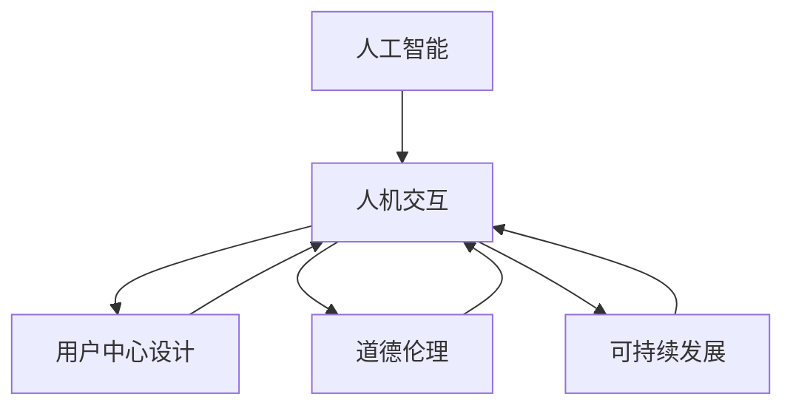

                 

# 连接科技与人文：构建以人为本的科技未来

> 关键词：人工智能, 人机交互, 用户中心设计, 道德伦理, 可持续发展

## 1. 背景介绍

### 1.1 问题由来
当前，科技与人文的融合已经成为全球范围内的一个重要议题。随着人工智能技术的迅猛发展，其在医疗、教育、交通等各个领域的广泛应用，不仅极大地提升了人类生活的便利性，也带来了前所未有的机遇和挑战。然而，科技的飞速发展也引发了一系列社会、伦理和道德问题，如隐私泄露、就业替代、算法偏见等，需要我们从人文的角度去思考和应对。

### 1.2 问题核心关键点
科技与人文融合的关键点在于如何平衡技术的发展与人的价值。在科技不断演进的过程中，我们需要以人为本，坚守道德伦理，注重可持续发展，确保技术的正面影响。这要求我们不仅关注技术本身，更要关注技术背后的人，关注技术的社会影响。

### 1.3 问题研究意义
研究科技与人文融合的意义在于，只有在充分理解科技与人文交互的基础上，才能制定出科学合理的发展策略，构建一个更加和谐、公平、可持续的未来。这不仅有助于推动技术的创新和应用，也有助于提升人类生活的质量，实现科技与人的深度结合。

## 2. 核心概念与联系

### 2.1 核心概念概述

为了更好地理解科技与人文融合的内在逻辑，本节将介绍几个核心概念：

- **人工智能(Artificial Intelligence, AI)**：一种能够模拟人类智能的技术，涵盖了学习、推理、感知、语言处理等多个方面。AI技术的核心在于通过数据和算法模拟人类的思维过程，实现自主学习和决策。

- **人机交互(Human-Computer Interaction, HCI)**：研究如何设计、实现和评估人与计算机之间的交互，以提高用户体验和系统的易用性。HCI旨在通过科技手段，更好地服务于人。

- **用户中心设计(User-Centered Design, UCD)**：一种设计方法，强调在设计过程中始终以用户需求和体验为核心，通过调研、原型测试、用户反馈等手段，不断迭代优化产品。

- **道德伦理(Ethics and Ethics)**：在科技应用中，确保技术行为符合道德规范和伦理标准，避免技术带来的负面影响。道德伦理是科技与人文融合的重要保障。

- **可持续发展(Sustainable Development)**：在科技发展过程中，注重环境保护、资源节约和长远利益，确保技术进步与生态平衡的和谐统一。

这些核心概念之间的逻辑关系可以通过以下Mermaid流程图来展示：



这个流程图展示了几大核心概念及其之间的关系：

1. 人工智能技术为人机交互提供了技术支撑。
2. 用户中心设计强调了技术服务于人的目的。
3. 道德伦理为科技应用提供了伦理保障。
4. 可持续发展要求科技发展兼顾环境和社会的长远利益。
5. 人机交互是连接科技与人文的桥梁，确保技术服务于人的目标得以实现。

## 3. 核心算法原理 & 具体操作步骤
### 3.1 算法原理概述

科技与人文融合的核心在于如何通过科技手段更好地服务于人。在这一过程中，算法扮演着关键角色。算法通过数据分析和处理，可以实现对人类需求的精准理解和满足，从而提升用户体验，实现科技与人文的深度结合。

### 3.2 算法步骤详解

科技与人文融合的算法设计可以分为以下几个步骤：

**Step 1: 需求调研与用户画像构建**
- 通过问卷调查、访谈等方式，收集用户的实际需求和痛点，建立详细的用户画像。
- 分析用户行为数据，提取用户偏好、兴趣等信息。

**Step 2: 算法设计**
- 根据用户需求和行为数据，选择合适的算法模型进行设计。如决策树、神经网络、强化学习等。
- 优化算法性能，确保其高效、准确、稳定。

**Step 3: 原型测试与迭代优化**
- 基于算法模型设计原型系统，并开展用户测试。
- 根据用户反馈，对系统进行迭代优化，提升用户体验。

**Step 4: 持续改进**
- 定期收集用户反馈和系统使用数据，持续改进算法模型。
- 引入新技术、新算法，提升系统的智能化水平。

### 3.3 算法优缺点

科技与人文融合的算法设计具有以下优点：
1. 高度定制化。通过精准分析用户需求，提供个性化的服务，提升用户满意度。
2. 高效自动化。算法能够自动化处理大量数据，减轻人工工作负担，提升处理效率。
3. 数据驱动。通过数据分析，发现隐藏在用户行为背后的规律和趋势，指导决策。

同时，该算法也存在一些局限性：
1. 数据依赖。算法的准确性和效果很大程度上依赖于数据的质量和多样性，数据偏差可能导致算法偏见。
2. 复杂性高。复杂的算法模型需要更多的计算资源和专业技能，推广应用难度较大。
3. 透明性不足。部分复杂算法如深度学习，难以解释其内部决策过程，可能缺乏透明度和可解释性。

### 3.4 算法应用领域

科技与人文融合的算法广泛应用在多个领域，例如：

- 智能医疗：通过数据分析和机器学习，实现个性化诊疗、健康监测、智能辅助诊断等功能。
- 智能教育：通过学习分析，实现个性化教学、智能推荐、学习行为分析等功能。
- 智能交通：通过大数据分析和算法优化，实现智能导航、交通流预测、智能停车等功能。
- 智慧城市：通过物联网和人工智能技术，实现城市治理、环境保护、智能安防等功能。

这些应用不仅提升了服务质量，也实现了科技与人文的深度融合。未来，随着算法的不断进步，更多领域的融合将进一步深化，带来更加广泛的社会效益。

## 4. 数学模型和公式 & 详细讲解 & 举例说明
### 4.1 数学模型构建

在科技与人文融合的算法设计中，数学模型扮演着重要角色。通过对数据的分析，可以构建出各种模型，用于指导决策和优化。以下是几个常见的数学模型：

- **线性回归模型**：用于分析用户行为与目标变量之间的关系。公式为 $y = \beta_0 + \beta_1 x_1 + \cdots + \beta_n x_n + \epsilon$，其中 $y$ 为目标变量，$x_1, \cdots, x_n$ 为自变量，$\beta_0, \cdots, \beta_n$ 为模型参数，$\epsilon$ 为误差项。

- **决策树模型**：用于分类和预测。通过递归地将数据集分成更小的子集，构建出一颗决策树，用于分类或回归。公式为：

  $$
  tree(T, D) = \mathop{\arg\min}_{T} \sum_{i=1}^N L(Y_i, T(D_i))
  $$

  其中 $T$ 为决策树，$D$ 为数据集，$L$ 为损失函数，$Y_i$ 为真实标签，$D_i$ 为样本数据。

- **深度学习模型**：用于处理复杂的数据关系，如图像、语音等。常见的深度学习模型包括卷积神经网络(CNN)、循环神经网络(RNN)、变分自编码器(VAE)等。以卷积神经网络为例，公式为：

  $$
  \hat{y} = \sigma(Wx + b)
  $$

  其中 $x$ 为输入数据，$W$ 为权重，$b$ 为偏置，$\sigma$ 为激活函数。

### 4.2 公式推导过程

以线性回归模型为例，推导其基本公式。假设我们有 $N$ 个样本数据 $(x_1, y_1), \cdots, (x_N, y_N)$，其中 $x_i \in \mathbb{R}^d$，$y_i \in \mathbb{R}$。我们希望找到一个线性模型 $y = \beta_0 + \beta_1 x_1 + \cdots + \beta_n x_n$，使得最小化均方误差损失函数 $L(y, \hat{y}) = \frac{1}{2N} \sum_{i=1}^N (y_i - \hat{y_i})^2$。通过最小二乘法，求解最优的参数 $\beta_0, \cdots, \beta_n$：

$$
\beta = \mathop{\arg\min}_{\beta} \sum_{i=1}^N (y_i - \hat{y_i})^2
$$

其中 $\hat{y_i} = \beta_0 + \beta_1 x_{i1} + \cdots + \beta_n x_{in}$。通过求解上述优化问题，可以得到最优的模型参数 $\beta$。

### 4.3 案例分析与讲解

以智能推荐系统为例，说明如何通过算法实现用户需求的精准匹配。智能推荐系统通过分析用户的历史行为数据，构建用户画像，并结合商品或内容数据，通过机器学习模型预测用户可能感兴趣的商品或内容，实现个性化推荐。

具体而言，我们可以使用协同过滤、基于内容的推荐、深度学习等算法模型。协同过滤算法通过分析用户行为数据，找到相似用户，推荐其喜欢的商品或内容。基于内容的推荐算法通过分析商品或内容的属性特征，找到相似的商品或内容。深度学习算法通过构建神经网络模型，学习用户与商品或内容之间的关系，实现更加精准的推荐。

## 5. 项目实践：代码实例和详细解释说明
### 5.1 开发环境搭建

在进行科技与人文融合的算法实践前，我们需要准备好开发环境。以下是使用Python进行TensorFlow开发的环境配置流程：

1. 安装Anaconda：从官网下载并安装Anaconda，用于创建独立的Python环境。

2. 创建并激活虚拟环境：
```bash
conda create -n tf-env python=3.8 
conda activate tf-env
```

3. 安装TensorFlow：根据CUDA版本，从官网获取对应的安装命令。例如：
```bash
conda install tensorflow=2.5.0
```

4. 安装相关库：
```bash
pip install numpy pandas sklearn scipy matplotlib jupyter notebook ipython
```

完成上述步骤后，即可在`tf-env`环境中开始算法实践。

### 5.2 源代码详细实现

下面我们以智能推荐系统为例，给出使用TensorFlow进行协同过滤算法的PyTorch代码实现。

```python
import tensorflow as tf
from tensorflow.keras.layers import Dense, Input, Embedding
from tensorflow.keras.models import Model
from tensorflow.keras.optimizers import Adam
from tensorflow.keras.callbacks import EarlyStopping
import numpy as np
import pandas as pd
import matplotlib.pyplot as plt

# 准备数据
data = pd.read_csv('user_item_interaction.csv')
user_ids = data['user_id'].unique().tolist()
item_ids = data['item_id'].unique().tolist()

# 划分训练集和测试集
train_ratio = 0.8
train_data = data.sample(frac=train_ratio, random_state=42)
test_data = data.drop(train_data.index)

# 构建模型
input_user = Input(shape=1, name='user')
input_item = Input(shape=1, name='item')
user_embedding = Embedding(len(user_ids), 10, input_length=1)(input_user)
item_embedding = Embedding(len(item_ids), 10, input_length=1)(input_item)
user_item = tf.keras.layers.Dot(axes=1)([user_embedding, item_embedding])
dot_product = Dense(1, activation='sigmoid')(user_item)
model = Model(inputs=[input_user, input_item], outputs=dot_product)

# 编译模型
model.compile(optimizer=Adam(learning_rate=0.01), loss='binary_crossentropy', metrics=['accuracy'])

# 训练模型
history = model.fit(x=[train_data['user_id'].values, train_data['item_id'].values],
                   y=train_data['interaction'].values,
                   validation_data=([test_data['user_id'].values, test_data['item_id'].values], test_data['interaction'].values),
                   epochs=100, batch_size=64, callbacks=[EarlyStopping(patience=10)])

# 评估模型
loss, accuracy = model.evaluate(x=[test_data['user_id'].values, test_data['item_id'].values], y=test_data['interaction'].values)
print(f'Test loss: {loss:.4f}')
print(f'Test accuracy: {accuracy:.4f}')
```

### 5.3 代码解读与分析

让我们再详细解读一下关键代码的实现细节：

**数据准备**：
- 使用Pandas读取用户与物品交互数据，并提取用户ID、物品ID和交互标签。
- 划分训练集和测试集，确保模型训练和评估的公正性。

**模型构建**：
- 使用Keras构建协同过滤模型，包含用户嵌入层和物品嵌入层，通过点积计算用户和物品的相似度。
- 使用sigmoid激活函数将相似度转换为0-1之间的概率，表示用户是否与物品进行过交互。

**模型编译与训练**：
- 使用Adam优化器，设置学习率为0.01，损失函数为二元交叉熵。
- 使用EarlyStopping回调函数，防止过拟合。

**模型评估**：
- 在测试集上评估模型性能，输出测试损失和准确率。

可以看到，TensorFlow提供了丰富的API和工具，使得机器学习模型的设计和训练变得简单易用。开发者可以通过这些工具快速构建和优化模型，实现科技与人文的融合应用。

## 6. 实际应用场景
### 6.1 智能医疗

在智能医疗领域，科技与人文的融合极大地提升了医疗服务的质量和效率。通过数据分析和机器学习，可以实现智能诊断、健康管理、个性化治疗等功能。

具体而言，我们可以利用电子病历数据，构建患者的健康画像，并通过机器学习模型，预测患者的病情变化和治疗效果。同时，还可以通过自然语言处理技术，分析医生的诊断报告，提取重要的医学知识，辅助医生的诊疗决策。

### 6.2 智能教育

在智能教育领域，科技与人文的融合推动了个性化学习和智能教学的发展。通过数据分析和机器学习，可以实现智能推荐、学习行为分析、教学效果评估等功能。

具体而言，我们可以利用学生的学习数据，构建学生画像，并通过机器学习模型，推荐适合的学习资源和练习题。同时，还可以通过自然语言处理技术，分析学生的作业和测试，提取学习难点和兴趣点，指导教师的个性化教学。

### 6.3 智能交通

在智能交通领域，科技与人文的融合提升了交通管理的智能化水平。通过数据分析和机器学习，可以实现智能导航、交通流预测、智能停车等功能。

具体而言，我们可以利用交通数据，构建交通画像，并通过机器学习模型，预测交通流量和路况。同时，还可以通过自然语言处理技术，分析交通监控视频和语音信息，辅助交通管理和调度。

### 6.4 未来应用展望

随着科技与人文融合的不断深入，未来将有更多领域受益于这种融合。例如：

- 智慧城市：通过物联网和人工智能技术，实现城市治理、环境保护、智能安防等功能。
- 智能制造：通过数据分析和机器学习，实现智能生产、质量控制、设备维护等功能。
- 社交媒体：通过数据分析和自然语言处理，实现内容推荐、情感分析、舆情监测等功能。

未来，随着科技与人文融合的不断深化，更多领域的融合将进一步实现，带来更加广泛的社会效益。

## 7. 工具和资源推荐
### 7.1 学习资源推荐

为了帮助开发者系统掌握科技与人文融合的理论基础和实践技巧，这里推荐一些优质的学习资源：

1. 《AI与人文：构建智能社会的未来》系列博文：由大模型技术专家撰写，深入浅出地介绍了AI与人文的融合范式、典型应用等。

2. 《Human-Centered AI》课程：斯坦福大学开设的AI伦理课程，探讨如何在AI应用中维护人类价值。

3. 《设计心理学》书籍：Don Norman所著，全面介绍了人机交互设计和用户体验的心理学原理。

4. 《道德伦理与人工智能》书籍：探讨AI技术在伦理、法律、社会等方面的应用和挑战。

5. 《机器学习实践》书籍：涵盖机器学习算法和实践的各个方面，提供丰富的代码实例和工程经验。

通过对这些资源的学习实践，相信你一定能够快速掌握科技与人文融合的精髓，并用于解决实际的AI应用问题。
###  7.2 开发工具推荐

高效的开发离不开优秀的工具支持。以下是几款用于科技与人文融合开发的常用工具：

1. TensorFlow：基于Python的开源深度学习框架，灵活动态的计算图，适合快速迭代研究。

2. PyTorch：基于Python的开源深度学习框架，易于扩展和调试，适合工程应用。

3. Keras：基于TensorFlow和Theano的高级神经网络API，易于上手和调试，适合快速原型设计。

4. Weights & Biases：模型训练的实验跟踪工具，可以记录和可视化模型训练过程中的各项指标，方便对比和调优。

5. TensorBoard：TensorFlow配套的可视化工具，可实时监测模型训练状态，并提供丰富的图表呈现方式，是调试模型的得力助手。

6. Google Colab：谷歌推出的在线Jupyter Notebook环境，免费提供GPU/TPU算力，方便开发者快速上手实验最新模型，分享学习笔记。

合理利用这些工具，可以显著提升科技与人文融合任务的开发效率，加快创新迭代的步伐。

### 7.3 相关论文推荐

科技与人文融合的研究源于学界的持续研究。以下是几篇奠基性的相关论文，推荐阅读：

1. 《AI与人文融合：构建智能社会的未来》：探讨AI技术在人文社会中的应用和挑战。

2. 《AI伦理：技术与人文的交汇点》：讨论AI伦理的理论基础和实际应用。

3. 《人机交互设计的新趋势》：探讨未来人机交互设计的发展方向和挑战。

4. 《深度学习在教育领域的应用》：探讨深度学习技术在教育中的实际应用和效果。

5. 《智能交通系统的伦理考量》：讨论智能交通系统在伦理、隐私等方面的问题。

这些论文代表了大模型微调技术的发展脉络。通过学习这些前沿成果，可以帮助研究者把握学科前进方向，激发更多的创新灵感。

## 8. 总结：未来发展趋势与挑战
### 8.1 总结

本文对科技与人文融合的方法进行了全面系统的介绍。首先阐述了科技与人文融合的研究背景和意义，明确了科技与人文交互的价值和目标。其次，从原理到实践，详细讲解了科技与人文融合的算法设计过程，给出了具体代码实例。同时，本文还广泛探讨了科技与人文融合在医疗、教育、交通等诸多领域的应用前景，展示了科技与人文融合的广泛应用。

通过本文的系统梳理，可以看到，科技与人文融合是一种全面、多维度的技术创新，不仅能提升应用系统的智能化水平，还能更好地服务于人，实现科技与人文的深度结合。未来，伴随着技术的不断进步和应用的不断拓展，科技与人文融合必将在更多领域带来深远影响。

### 8.2 未来发展趋势

展望未来，科技与人文融合的发展趋势主要体现在以下几个方面：

1. **多学科融合**：未来将更多地引入心理学、社会学、伦理学等学科的理论和方法，提升科技与人文融合的深度和广度。

2. **人机协同**：未来将更多地关注人机交互界面的优化设计，提升用户的使用体验和系统智能化水平。

3. **伦理治理**：未来将更多地关注AI技术的伦理问题，如隐私保护、算法偏见、决策透明性等，确保技术的健康发展。

4. **可持续发展**：未来将更多地关注AI技术在环境保护、资源节约等方面的应用，推动可持续发展目标的实现。

5. **全球合作**：未来将更多地关注跨国界合作，推动AI技术在全球范围内的普及和应用。

以上趋势凸显了科技与人文融合技术的广阔前景。这些方向的探索发展，必将进一步提升科技与人文融合的深度和广度，带来更加广泛的社会效益。

### 8.3 面临的挑战

尽管科技与人文融合技术已经取得了一定进展，但在迈向更加智能化、普适化应用的过程中，它仍面临着诸多挑战：

1. **数据隐私**：AI技术在应用过程中，如何保护用户的隐私数据，防止数据滥用和泄露，是一个重要的问题。

2. **算法偏见**：AI模型在训练过程中可能学习到数据中的偏见，导致输出结果的不公正和不公平。

3. **透明度和可解释性**：部分复杂算法如深度学习，难以解释其内部决策过程，可能缺乏透明度和可解释性。

4. **伦理道德**：AI技术在应用过程中可能带来伦理和道德问题，如决策透明性、责任归属等。

5. **资源消耗**：AI技术在应用过程中，可能面临计算资源、存储资源等硬件瓶颈，需要进一步优化。

6. **用户接受度**：部分AI技术可能难以被用户接受，需要进行更多的用户教育和宣传。

正视科技与人文融合面临的这些挑战，积极应对并寻求突破，将是大模型微调走向成熟的必由之路。相信随着学界和产业界的共同努力，这些挑战终将一一被克服，科技与人文融合必将在构建人机协同的智能时代中扮演越来越重要的角色。

### 8.4 研究展望

面对科技与人文融合所面临的挑战，未来的研究需要在以下几个方面寻求新的突破：

1. **隐私保护技术**：开发更加安全的隐私保护技术，确保用户数据的安全和隐私。

2. **算法公平性**：研究算法公平性技术，消除算法中的偏见和歧视，确保AI应用的公正性。

3. **模型可解释性**：研究模型可解释性技术，提升AI系统的透明度和可解释性，增强用户信任。

4. **伦理治理框架**：制定AI伦理治理框架，确保AI应用的伦理合法性。

5. **资源优化技术**：开发更加高效的资源优化技术，提升AI系统的计算和存储效率。

6. **用户接受度提升**：开展用户教育和宣传，提升用户对AI技术的接受度和理解度。

这些研究方向的探索，必将引领科技与人文融合技术迈向更高的台阶，为构建安全、可靠、可解释、可控的智能系统铺平道路。面向未来，科技与人文融合技术还需要与其他人工智能技术进行更深入的融合，如知识表示、因果推理、强化学习等，多路径协同发力，共同推动自然语言理解和智能交互系统的进步。只有勇于创新、敢于突破，才能不断拓展语言模型的边界，让智能技术更好地造福人类社会。

---

作者：禅与计算机程序设计艺术 / Zen and the Art of Computer Programming

