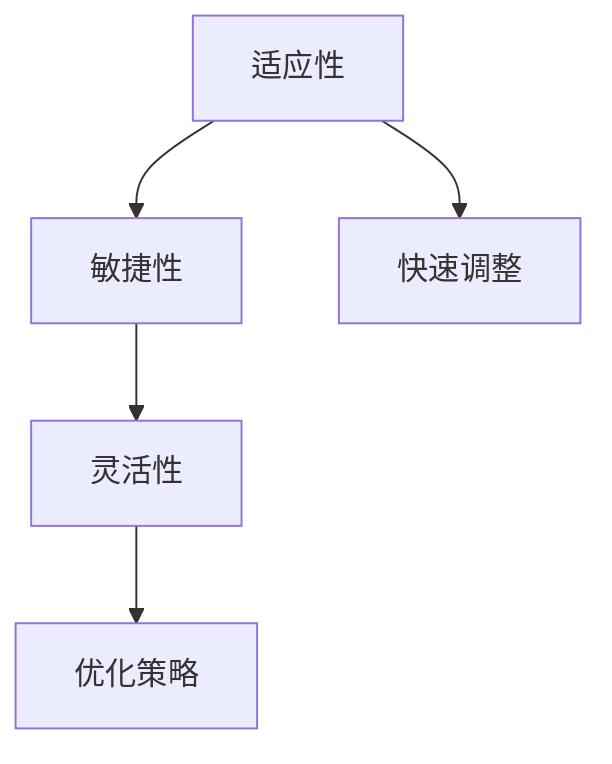

                 

# 适应性和灵活性：适应性是指适应新环境的能力，灵活性则是更高层级的适应性

## 1. 背景介绍

### 1.1 问题由来

在计算机科学的各个领域，适应性和灵活性是衡量技术能力的重要指标。适应性（Adaptability）是指系统对新环境或变化的适应能力，能在复杂多变的环境中迅速调整和优化自身行为。灵活性（Flexibility）则是在适应性的基础上，对环境变化能够进行更为高级的适应和策略调整。

在软件工程和人工智能领域，适应性和灵活性显得尤为重要。随着科技的飞速发展，技术环境和需求不断变化，对于系统和技术的需求也变得越来越复杂。而适应性和灵活性，则是确保系统持续发展的关键。

### 1.2 问题核心关键点

本文将从理论和实践两个层面，深入探讨适应性和灵活性的概念、原理和实现方法。我们将重点关注以下几个问题：

1. **适应性的定义**：如何定义适应性，它是如何影响系统性能的？
2. **灵活性的实现**：如何实现系统灵活性，灵活性对系统的长期维护和优化有何帮助？
3. **适应性与灵活性之间的关系**：两者是如何相互影响，如何平衡两者的关系？
4. **技术应用实例**：在软件开发、人工智能等领域的实际应用案例，展示适应性和灵活性的重要性和实现方式。

## 2. 核心概念与联系

### 2.1 核心概念概述

**适应性（Adaptability）**：指系统对新环境或变化的快速响应和适应能力。这包括系统对环境变化的感知、识别和调整。适应性强的系统能够在面对未知或快速变化的环境时，快速调整策略和行为，以保持高效和稳定。

**灵活性（Flexibility）**：基于适应性的进一步提升，指系统能够根据环境变化调整更为高级的策略和行为。灵活性强的系统不仅能够快速适应新环境，还能在适应过程中学习和优化，以更好地应对未来的变化。

**敏捷性（Agility）**：与适应性和灵活性紧密相关的一个概念，是指系统能够快速响应需求变化，快速开发和部署新的功能或解决方案。

这三个概念之间的关系可以通过以下Mermaid流程图来展示：



这个流程图展示了三者的逻辑关系：

1. 适应性是基础，指系统对环境的快速响应。
2. 基于适应性，通过敏捷开发实现快速部署。
3. 灵活性建立在适应性和敏捷性的基础上，指系统在适应过程中学习优化策略，提升整体性能。

## 3. 核心算法原理 & 具体操作步骤

### 3.1 算法原理概述

在讨论适应性和灵活性的算法原理时，我们主要关注以下几个方面：

1. **感知与识别**：系统如何感知环境变化，识别出需要调整的参数和策略。
2. **调整与优化**：系统如何基于感知和识别结果，调整参数和策略，以适应新环境。
3. **学习与积累**：系统如何在适应过程中学习新知识，积累经验，优化策略。

这些过程可以通过机器学习、强化学习等算法来实现。其中，机器学习用于从历史数据中学习模式和规律，强化学习则用于在交互中不断调整策略以优化性能。

### 3.2 算法步骤详解

下面以一个简单的机器学习例子来说明适应性和灵活性的实现步骤：

**Step 1: 数据收集与预处理**

1. 收集环境数据，如用户行为、系统日志等。
2. 对数据进行清洗和标准化，去除噪音和异常值。

**Step 2: 模型训练与调整**

1. 使用历史数据训练机器学习模型。
2. 在模型训练过程中，引入交叉验证等技术，防止过拟合。
3. 根据验证集的表现，调整模型的超参数和结构，以提升模型性能。

**Step 3: 策略优化与部署**

1. 在模型训练完成后，根据当前环境和新数据，优化模型策略。
2. 将优化后的模型部署到生产环境，进行实时监控和反馈。
3. 根据实时监控数据，进一步调整策略，以应对新的环境变化。

### 3.3 算法优缺点

适应性和灵活性算法的主要优点包括：

1. **快速响应**：能够快速适应新环境，快速调整策略，提高系统的稳定性和可靠性。
2. **自我优化**：系统能够在运行过程中学习和优化，提升性能。
3. **降低成本**：通过自动化调整和优化，减少了人工干预和维护成本。

主要缺点包括：

1. **复杂性**：算法实现复杂，需要综合考虑数据、模型、策略等多个因素。
2. **数据需求高**：需要大量高质量的数据来训练和优化模型。
3. **资源消耗**：算法通常需要较高的计算和存储资源。

### 3.4 算法应用领域

适应性和灵活性算法在各个领域都有广泛应用，以下是几个典型案例：

1. **软件开发**：敏捷开发和持续集成（CI/CD）管道，使软件系统能够快速响应需求变化。
2. **网络安全**：基于机器学习和强化学习的入侵检测系统，能够实时适应新的攻击模式。
3. **金融交易**：算法交易系统，根据市场变化实时调整交易策略，提升收益。
4. **智能推荐**：个性化推荐系统，根据用户行为变化动态调整推荐算法和策略。

## 4. 数学模型和公式 & 详细讲解

### 4.1 数学模型构建

适应性和灵活性算法的数学模型可以基于以下假设：

1. 环境状态 $S$ 是连续变化的。
2. 模型在每个时间步 $t$ 的策略为 $\pi_t$，策略参数为 $\theta_t$。
3. 策略参数 $\theta_t$ 根据环境状态 $S_t$ 进行更新。

因此，适应性和灵活性算法的数学模型可以表示为：

$$
\theta_{t+1} = f(S_t, \theta_t)
$$

其中 $f$ 为策略更新函数。

### 4.2 公式推导过程

以强化学习为例，假设有一个环境 $E$，和一个代理 $A$，目标是在每个时间步 $t$ 选择动作 $a_t$，最大化累计奖励 $R_t$。代理 $A$ 在时间步 $t$ 的策略为 $\pi_t(a_t|s_t)$，参数为 $\theta_t$。策略更新函数 $f$ 为：

$$
\theta_{t+1} = \theta_t + \eta_t \nabla \mathcal{L}(\theta_t)
$$

其中 $\eta_t$ 为学习率，$\mathcal{L}$ 为损失函数，通常为累计奖励的最大化。

### 4.3 案例分析与讲解

假设我们有一个金融交易系统，需要根据市场数据实时调整交易策略。市场数据可以表示为一个时间序列 $S_t = \{s_1, s_2, ..., s_t\}$，其中 $s_t$ 表示时间 $t$ 的市场状态，包括股票价格、市场情绪等。交易策略 $\pi_t$ 包括买入、卖出等动作，参数为 $\theta_t$，包括买入概率、卖出价格等。

通过强化学习算法，交易系统能够根据市场数据 $S_t$ 实时更新策略参数 $\theta_t$，以最大化累计收益。在每一步更新中，系统根据当前市场状态 $S_t$ 和历史交易记录，计算出策略 $\pi_t$ 的累积奖励 $R_t$，并使用梯度下降方法更新策略参数 $\theta_t$，以提升未来收益。

## 5. 项目实践：代码实例和详细解释说明

### 5.1 开发环境搭建

为了实现适应性和灵活性算法，我们需要搭建一个合适的开发环境。以下是使用Python和TensorFlow搭建的基本步骤：

1. 安装Python：建议使用Anaconda或Miniconda，以方便管理和创建虚拟环境。
2. 安装TensorFlow：可以使用pip安装TensorFlow，并指定需要的版本。
3. 安装其他依赖库：如NumPy、Pandas、scikit-learn等，用于数据处理和模型训练。
4. 设置环境变量：确保Python和TensorFlow的路径设置正确，能够在命令行和IDE中使用。

### 5.2 源代码详细实现

以下是一个简单的金融交易系统的代码实现，用于演示适应性和灵活性的算法：

```python
import tensorflow as tf
import numpy as np

class FinancialTradingSystem:
    def __init__(self, num_actions=2):
        self.num_actions = num_actions
        self.learning_rate = 0.01
        self.epsilon = 0.1
        self.q_network = self.build_q_network()

    def build_q_network(self):
        model = tf.keras.Sequential([
            tf.keras.layers.Dense(64, input_shape=(5,), activation='relu'),
            tf.keras.layers.Dense(64, activation='relu'),
            tf.keras.layers.Dense(self.num_actions, activation='linear')
        ])
        return model

    def choose_action(self, state):
        if np.random.uniform() < self.epsilon:
            return np.random.randint(0, self.num_actions)
        else:
            q_values = self.q_network.predict(state)
            return np.argmax(q_values[0])

    def update_q_network(self, state, action, reward, next_state):
        target = reward + np.max(self.q_network.predict(next_state))
        q_values = self.q_network.predict(state)
        q_values[0, action] = target
        self.q_network.fit(state, q_values, epochs=1, verbose=0)

    def run(self, num_episodes):
        state = self.generate_state()
        for episode in range(num_episodes):
            action = self.choose_action(state)
            reward = self.get_reward(action)
            next_state = self.generate_next_state()
            self.update_q_network(state, action, reward, next_state)
            state = next_state

def generate_state():
    # 生成市场数据
    return np.random.rand(5)

def get_reward(action):
    # 根据动作获取奖励
    if action == 0:
        return 0.1
    else:
        return -0.1

def generate_next_state():
    # 生成下一个市场状态
    return np.random.rand(5)
```

### 5.3 代码解读与分析

上述代码中，我们实现了简单的金融交易系统的模型。模型包括一个Q网络，用于估计不同状态下采取不同动作的累积奖励。在每个时间步，模型根据当前状态和策略，选择动作，并更新Q网络参数，以适应市场变化。

在代码中，我们使用TensorFlow的Keras API构建了Q网络，并定义了choose_action、update_q_network、run等函数，分别用于选择动作、更新Q网络、运行交易系统。这些函数通过简单的逻辑实现，展示了适应性和灵活性算法的核心步骤。

### 5.4 运行结果展示

运行上述代码，可以观察到交易系统在多轮交易后，策略参数 $\theta_t$ 和累积收益的变化情况。由于市场状态和交易策略的变化，系统能够动态调整策略，最大化累积收益。

## 6. 实际应用场景

### 6.1 智能推荐系统

智能推荐系统是适应性和灵活性算法的典型应用之一。推荐系统需要根据用户的历史行为数据和实时行为数据，动态调整推荐策略，以提供个性化的推荐结果。通过适应性和灵活性算法，推荐系统能够实时学习用户偏好，优化推荐模型，提升推荐效果。

### 6.2 动态定价系统

动态定价系统需要根据市场供需关系和实时价格数据，实时调整商品价格，以最大化收益。通过适应性和灵活性算法，系统能够动态优化价格策略，应对市场变化，提高经济效益。

### 6.3 自适应网络安全

网络安全系统需要根据威胁变化，实时调整检测和防护策略。通过适应性和灵活性算法，系统能够快速适应新威胁，优化防护策略，提升安全水平。

## 7. 工具和资源推荐

### 7.1 学习资源推荐

为了深入理解适应性和灵活性算法的原理和实现，以下是一些推荐的资源：

1. 《Reinforcement Learning: An Introduction》：Reinforcement Learning领域的经典教材，详细介绍了强化学习的理论和实现方法。
2. TensorFlow官方文档：TensorFlow提供了丰富的机器学习和深度学习工具，包括TensorBoard、Keras等，是实现适应性和灵活性算法的重要工具。
3. Coursera和edX等在线课程：提供许多关于机器学习和深度学习的在线课程，涵盖了从基础到高级的知识点。
4. GitHub上的开源项目：如TensorFlow Examples，提供了许多实用的机器学习算法实现，可以作为学习参考。

### 7.2 开发工具推荐

以下是一些推荐的开发工具：

1. Python：Python是机器学习和深度学习领域的主流语言，具有丰富的科学计算库和框架支持。
2. TensorFlow和PyTorch：这两个深度学习框架提供了丰富的API和工具，支持高效的模型训练和部署。
3. Jupyter Notebook：用于编写和运行Python代码，支持代码块、注释和可视化输出。
4. Google Colab：Google提供的免费在线Jupyter Notebook环境，支持GPU和TPU算力，方便实验和共享。

### 7.3 相关论文推荐

以下是一些推荐的相关论文：

1. "Adaptive Machine Learning"：探讨了适应性机器学习的理论和实现方法，涵盖了数据驱动的决策和动态学习等内容。
2. "Flexible Systems Design"：介绍了灵活系统设计的原则和实践，包括可重构架构、组件化设计和微服务等。
3. "Reinforcement Learning in Adaptive Systems"：介绍了在自适应系统中使用强化学习的理论和实践，涵盖自适应控制和动态优化等内容。

## 8. 总结：未来发展趋势与挑战

### 8.1 研究成果总结

本文从理论和实践两个层面，探讨了适应性和灵活性算法的核心概念和实现方法。通过分析机器学习、强化学习等算法原理，展示了适应性和灵活性算法在不同场景中的应用。同时，提供了代码实现和运行结果，帮助读者理解算法的实现细节和实际效果。

### 8.2 未来发展趋势

适应性和灵活性算法在未来将呈现以下几个发展趋势：

1. **智能化升级**：随着AI技术的进步，适应性和灵活性算法将更加智能化，能够自动学习、优化和适应新环境。
2. **多模态融合**：未来的算法将更多地融合多模态数据，如文本、图像、音频等，以提升适应性和灵活性。
3. **边缘计算支持**：适应性和灵活性算法将在边缘计算环境中得到广泛应用，实现实时响应和优化。
4. **自动化调优**：算法将更加自动化，能够根据环境变化自动调整策略和参数，减少人工干预。

### 8.3 面临的挑战

适应性和灵活性算法在实现和发展过程中，仍然面临一些挑战：

1. **数据质量**：高质量的数据是算法实现的前提，但获取和维护数据往往成本高、难度大。
2. **计算资源**：算法通常需要大量的计算资源，特别是在深度学习和强化学习中，计算和存储资源消耗较大。
3. **模型复杂性**：算法的实现复杂性较高，需要综合考虑多个因素，如数据、模型、策略等。
4. **鲁棒性**：算法需要具备一定的鲁棒性，以应对环境变化和噪音干扰。

### 8.4 研究展望

未来的研究需要在以下几个方面进一步探索：

1. **自适应算法优化**：研究更加高效、智能的自适应算法，减少数据和计算资源的需求。
2. **多模态数据融合**：研究多模态数据融合算法，提升算法的适应性和灵活性。
3. **边缘计算优化**：研究在边缘计算环境中的适应性算法优化方法，提高系统的实时性和可靠性。
4. **自动化调优**：研究自动化的调优方法，减少人工干预，提升系统的自动化水平。

适应性和灵活性算法在未来的发展和应用中，将进一步推动人工智能技术的发展，为系统在复杂多变的环境中获得更好的适应性和性能提供有力支持。

## 9. 附录：常见问题与解答

**Q1: 适应性和灵活性算法的核心是什么？**

A: 适应性和灵活性算法的核心在于感知、识别和优化。系统能够感知环境变化，识别出需要调整的参数和策略，并通过优化算法调整和优化策略，以适应新环境。

**Q2: 适应性和灵活性算法如何应用在推荐系统中？**

A: 在推荐系统中，系统需要根据用户的历史行为和实时行为，动态调整推荐策略。系统能够感知用户行为变化，识别出用户的偏好变化，并通过优化算法调整推荐模型，提供更个性化的推荐结果。

**Q3: 适应性和灵活性算法如何实现自适应网络安全？**

A: 在网络安全中，系统需要根据威胁变化，实时调整检测和防护策略。系统能够感知威胁变化，识别出需要调整的策略参数，并通过优化算法调整策略，以应对新威胁，提升安全水平。

通过本文的探讨，我们深入理解了适应性和灵活性算法的核心原理和实现方法，并展示了其在多个场景中的应用。适应性和灵活性是现代系统设计和优化的重要目标，通过不断探索和实践，我们相信未来的大规模、智能系统将更加适应复杂多变的环境，为用户提供更好的服务。

---

作者：禅与计算机程序设计艺术 / Zen and the Art of Computer Programming

