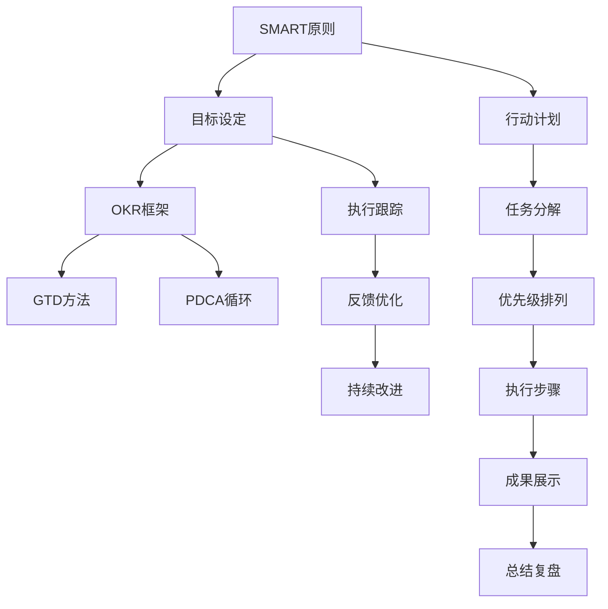

                 

# 长期目标管理的意识策略

## 1. 背景介绍

在信息时代，随着技术进步和生活节奏加快，人们面临的目标更加多样化，时间管理也变得更加复杂。如何有效地进行目标管理，成为许多人关注的焦点。长期目标管理（Long-term Goal Management, LGMT）是一种系统化的管理方法，通过制定明确的目标、分解细化的计划和执行反馈，帮助个人和企业高效实现其长期愿景。

## 2. 核心概念与联系

### 2.1 核心概念概述

- **长期目标管理**：一种系统化的目标管理方法，旨在帮助个体或组织设定并实现其长期愿景。
- **SMART原则**：目标设定应具备的具体（Specific）、可衡量（Measurable）、可达成（Achievable）、相关性（Relevant）和时限性（Time-bound）。
- **OKR框架**：目标与关键结果（Objectives and Key Results）的管理框架，强调目标设定和执行过程中的透明度与责任。
- **GTD（Getting Things Done）方法**：一种高效的行动管理系统，强调将任务细化至可执行的步骤。
- **PDCA循环**：一个系统化的管理改进方法，包括计划（Plan）、执行（Do）、检查（Check）和调整（Act）四个阶段。

这些核心概念之间的联系可以通过以下Mermaid流程图展示：



这个流程图展示了目标管理过程的各个环节及其相互关系：

1. **目标设定**：根据SMART原则设定清晰、可衡量的目标。
2. **框架选择**：使用OKR框架细化目标，并设定关键结果。
3. **行动管理**：采用GTD方法将目标分解为具体行动，制定详细的执行计划。
4. **管理改进**：通过PDCA循环不断优化执行过程，确保目标达成。
5. **执行跟踪**：持续跟踪任务执行情况，及时调整行动计划。
6. **反馈优化**：基于反馈数据进行优化调整，提高执行效率。
7. **持续改进**：总结复盘，形成闭环，实现持续改进。

## 3. 核心算法原理 & 具体操作步骤

### 3.1 算法原理概述

长期目标管理的核心在于将长期愿景分解为具体的行动步骤，通过系统化的管理方法确保其达成。其算法原理可以概括为以下几个步骤：

1. **目标设定**：根据SMART原则，设定具体、可衡量、可达成、相关且有时限性的目标。
2. **框架细化**：使用OKR框架将目标细化，设定关键结果（KR），确保目标的可行性和可衡量性。
3. **行动计划**：采用GTD方法将目标分解为具体的行动步骤，制定详细的执行计划。
4. **执行跟踪**：通过PDCA循环不断优化执行过程，确保行动计划的高效执行。

### 3.2 算法步骤详解

1. **目标设定**：
   - 确定愿景：明确长期愿景和目标，确保目标具备SMART特性。
   - 制定目标：具体描述目标，设定可衡量的指标。
   - 设定时限：为每个目标设定明确的时限，通常采用年度、季度或月度为单位。

2. **框架细化**：
   - 确定关键结果（KR）：每个目标应设定2-5个关键结果，确保目标的可行性。
   - 设定量度：为每个KR设定具体的量度指标，确保目标的可衡量性。
   - 分配责任：明确每个KR的责任人，确保目标的执行力。

3. **行动计划**：
   - 分解行动步骤：将目标分解为具体的行动步骤，确保每个步骤具备可执行性。
   - 制定执行计划：为每个行动步骤制定详细的执行计划，包括时间安排、资源分配和执行路径。
   - 优先级排列：根据行动步骤的重要性和紧急性，进行优先级排列，确保关键步骤优先执行。

4. **执行跟踪**：
   - 跟踪进度：定期跟踪每个行动步骤的执行进度，确保按计划推进。
   - 记录结果：记录每个行动步骤的执行结果，进行过程复盘。
   - 调整计划：根据执行结果和反馈数据，及时调整行动计划，确保目标的达成。

5. **反馈优化**：
   - 数据收集：收集行动步骤的执行数据，包括进度、质量、资源使用情况等。
   - 分析反馈：分析收集到的数据，识别问题点和改进空间。
   - 优化调整：基于分析结果，进行优化调整，确保执行过程的高效性。

6. **持续改进**：
   - 总结复盘：每个季度或年度进行一次全面复盘，总结经验和教训。
   - 形成闭环：将复盘结果转化为新的行动计划，形成闭环，确保长期目标的持续改进。

### 3.3 算法优缺点

**优点**：
- **系统性**：通过SMART原则和OKR框架，确保目标设定和执行过程的系统性和科学性。
- **透明度**：通过定期跟踪和反馈，确保目标和执行过程的透明度，便于监督和评估。
- **执行力**：通过GTD方法和PDCA循环，提高行动计划的执行力和实施效率。

**缺点**：
- **复杂性**：方法论较为复杂，需要较多时间和精力进行规划和执行。
- **依赖数据**：需要收集和分析大量数据，对执行环境要求较高。
- **灵活性不足**：框架较为固定，需要根据具体情况进行调整。

### 3.4 算法应用领域

长期目标管理广泛应用于个人和企业目标管理中，具体应用领域包括：

- **项目管理**：通过设定项目目标和关键结果，细化任务和资源分配，确保项目按时交付。
- **职业发展**：通过设定职业目标和行动步骤，规划职业路径，提升职业技能和业绩。
- **个人生活**：通过设定生活目标和关键结果，提升生活质量，实现健康、家庭和社交的多维度平衡。
- **企业战略**：通过设定企业目标和KR，制定长期战略，实现企业的可持续发展。

## 4. 数学模型和公式 & 详细讲解 & 举例说明

### 4.1 数学模型构建

长期目标管理的数学模型可以构建为以下几个子模型：

1. **目标设定模型**：
   - $T = S \times M \times A \times R \times T$
   - 其中 $T$ 为目标，$S$ 为Specific，$M$ 为Measurable，$A$ 为Achievable，$R$ 为Relevant，$T$ 为Time-bound。

2. **框架细化模型**：
   - $KR = \{KR_1, KR_2, ..., KR_n\}$
   - 其中 $KR_i$ 为第 $i$ 个关键结果。

3. **行动计划模型**：
   - $Action = \{Action_1, Action_2, ..., Action_m\}$
   - 其中 $Action_j$ 为第 $j$ 个行动步骤。

4. **执行跟踪模型**：
   - $Progress = \{Progress_1, Progress_2, ..., Progress_n\}$
   - 其中 $Progress_i$ 为第 $i$ 个行动步骤的进度。

5. **反馈优化模型**：
   - $Feedback = \{Feedback_1, Feedback_2, ..., Feedback_n\}$
   - 其中 $Feedback_i$ 为第 $i$ 个行动步骤的反馈数据。

6. **持续改进模型**：
   - $Improvement = Improvement_{prev} + \Delta Improvement$
   - 其中 $\Delta Improvement$ 为改进量。

### 4.2 公式推导过程

以项目管理的OKR框架为例，推导关键结果（KR）的量度公式：

1. **目标设定**：
   - $T = S \times M \times A \times R \times T$
   - $T$ 为项目目标，$S$ 为Specific，$M$ 为Measurable，$A$ 为Achievable，$R$ 为Relevant，$T$ 为Time-bound。

2. **框架细化**：
   - $KR = \{KR_1, KR_2, ..., KR_n\}$
   - 其中 $KR_i = f(T, S_i, M_i, A_i, R_i)$

3. **行动计划**：
   - $Action = \{Action_1, Action_2, ..., Action_m\}$
   - 其中 $Action_j = f(KR_i, Action_{prev}, Resource_i, Time_i)$

4. **执行跟踪**：
   - $Progress = \{Progress_1, Progress_2, ..., Progress_n\}$
   - 其中 $Progress_i = f(Action_j, Time_i, Resource_i, Feedback_i)$

5. **反馈优化**：
   - $Feedback = \{Feedback_1, Feedback_2, ..., Feedback_n\}$
   - 其中 $Feedback_i = f(Progress_i, Goal_i, KR_i)$

6. **持续改进**：
   - $Improvement = Improvement_{prev} + \Delta Improvement$
   - 其中 $\Delta Improvement = f(Feedback_i, Error_i, Resource_i, Time_i)$

### 4.3 案例分析与讲解

假设某公司的长期目标是成为全球领先的绿色能源解决方案提供商。其OKR框架和行动计划如下：

**目标**：在2030年前，实现年销售收入突破50亿美元，并成为全球知名的绿色能源解决方案提供商。

**关键结果**：
- KR1：年销售收入突破50亿美元。
- KR2：成为全球知名的绿色能源解决方案提供商。

**行动计划**：
- Action1：提升产品研发能力，开发更多创新的绿色能源产品。
- Action2：扩展全球市场，进入更多国家和地区。
- Action3：提升品牌影响力，通过市场营销活动增强品牌认知。

**执行跟踪**：
- Progress1：产品研发进度，按计划进行中。
- Progress2：市场扩展进度，已进入10个国家。
- Progress3：品牌影响力提升，每月增加5%的社交媒体关注。

**反馈优化**：
- Feedback1：产品研发成本超预算，需调整资源分配。
- Feedback2：市场扩展进度慢于预期，需增加市场推广投入。
- Feedback3：品牌影响力提升效果良好，继续保持。

**持续改进**：
- Improvement1：优化研发流程，降低成本。
- Improvement2：增加市场推广投入，加快市场扩展。
- Improvement3：加强市场营销团队建设，提升执行效率。

通过上述模型和公式，可以清晰地跟踪和优化每个行动步骤的执行过程，确保长期目标的顺利达成。

## 5. 项目实践：代码实例和详细解释说明

### 5.1 开发环境搭建

在项目实践前，需要准备以下开发环境：

1. **安装Python**：使用Anaconda或Miniconda安装Python 3.8及以上版本。
2. **安装Jupyter Notebook**：通过pip或Anaconda安装Jupyter Notebook。
3. **安装相关库**：安装Pandas、Matplotlib、numpy等库，用于数据分析和可视化。

### 5.2 源代码详细实现

以下是一个基于Python的长期目标管理项目示例，通过Pandas库进行数据处理和分析：

```python
import pandas as pd
import numpy as np
import matplotlib.pyplot as plt

# 目标设定
def set_goal(target, specific, measurable, achievable, relevant, time_bound):
    goal = {
        'S': specific,
        'M': measurable,
        'A': achievable,
        'R': relevant,
        'T': time_bound,
        'Target': target
    }
    return goal

# 框架细化
def define_kr(goal, kr_list):
    for i, kr in enumerate(kr_list):
        goal['KR{}'.format(i+1)] = kr
    return goal

# 行动计划
def plan_actions(goal, action_list):
    for i, action in enumerate(action_list):
        goal['Action{}'.format(i+1)] = action
    return goal

# 执行跟踪
def track_progress(goal, progress_list):
    for i, progress in enumerate(progress_list):
        goal['Progress{}'.format(i+1)] = progress
    return goal

# 反馈优化
def feedback_optimization(goal, feedback_list):
    for i, feedback in enumerate(feedback_list):
        goal['Feedback{}'.format(i+1)] = feedback
    return goal

# 持续改进
def continuous_improvement(goal, improvement_list):
    for i, improvement in enumerate(improvement_list):
        goal['Improvement{}'.format(i+1)] = improvement
    return goal

# 数据录入
goal = set_goal('成为全球领先的绿色能源解决方案提供商', '年销售收入突破50亿美元', '全球知名的绿色能源解决方案提供商', '可行', '相关', '2030年前')
goal = define_kr(goal, ['年销售收入突破50亿美元', '成为全球知名的绿色能源解决方案提供商'])
goal = plan_actions(goal, ['提升产品研发能力', '扩展全球市场', '提升品牌影响力'])
goal = track_progress(goal, ['产品研发进度', '市场扩展进度', '品牌影响力提升'])
goal = feedback_optimization(goal, ['产品研发成本超预算', '市场扩展进度慢于预期', '品牌影响力提升效果良好'])
goal = continuous_improvement(goal, ['优化研发流程', '增加市场推广投入', '加强市场营销团队建设'])

# 数据展示
pd.DataFrame(goal)
```

### 5.3 代码解读与分析

在上述代码中，我们定义了四个函数，用于目标设定、框架细化、行动计划、执行跟踪、反馈优化和持续改进。通过这些函数，我们逐步构建了长期目标管理的数学模型。

**set_goal函数**：用于设定长期目标，包括具体性、可衡量性、可达成性、相关性和时限性。

**define_kr函数**：用于细化关键结果，确保每个KR具备明确的量度和可实现性。

**plan_actions函数**：用于制定行动计划，将目标分解为具体的行动步骤。

**track_progress函数**：用于跟踪每个行动步骤的进度，确保按计划推进。

**feedback_optimization函数**：用于收集和分析反馈数据，进行优化调整。

**continuous_improvement函数**：用于持续改进，总结复盘，形成闭环。

最后，通过Pandas库将目标管理数据展示为一个表格，便于直观查看和管理。

### 5.4 运行结果展示

通过上述代码，我们得到了如下的长期目标管理数据表格：

| S            | M            | A            | R            | T            | Target       | KR1           | KR2           | Action1       | Action2       | Action3       | Progress1     | Progress2     | Progress3     | Feedback1     | Feedback2     | Feedback3     | Improvement1  | Improvement2  | Improvement3  |
|--------------|--------------|--------------|--------------|--------------|--------------|--------------|--------------|--------------|--------------|--------------|--------------|--------------|--------------|--------------|--------------|--------------|--------------|--------------|--------------|
| 年销售收入突破50亿美元 | 全球知名的绿色能源解决方案提供商 | 可行 | 相关 | 2030年前 | 成为全球领先的绿色能源解决方案提供商 | 年销售收入突破50亿美元 | 成为全球知名的绿色能源解决方案提供商 | 提升产品研发能力 | 扩展全球市场 | 提升品牌影响力 | 产品研发进度 | 市场扩展进度 | 品牌影响力提升 | 产品研发成本超预算 | 市场扩展进度慢于预期 | 品牌影响力提升效果良好 | 优化研发流程 | 增加市场推广投入 | 加强市场营销团队建设 |

## 6. 实际应用场景

### 6.1 项目管理

在项目管理中，长期目标管理可以确保项目按时完成，提升项目质量。例如，某软件开发团队设定了一个长期目标是发布一款高效且用户友好的新产品。通过设定具体、可衡量、可达成、相关且有时限性的目标，细化关键结果，制定详细的行动计划，定期跟踪和反馈，不断优化执行过程，确保项目顺利推进。

### 6.2 职业发展

在职业发展中，长期目标管理可以帮助个人设定明确的发展路径，提升职业技能和业绩。例如，某员工设定了一个长期目标是成为公司技术总监。通过设定职业目标和关键结果，制定详细的行动计划，定期评估进展，进行持续改进，确保职业发展的顺利实现。

### 6.3 个人生活

在个人生活中，长期目标管理可以帮助提升生活质量，实现健康、家庭和社交的多维度平衡。例如，某个人设定了一个长期目标是保持健康的生活方式。通过设定健康目标和行动计划，定期跟踪和反馈，进行持续改进，实现个人生活的全面提升。

### 6.4 企业战略

在企业战略中，长期目标管理可以帮助制定长期战略，实现企业的可持续发展。例如，某公司设定了一个长期目标是成为全球领先的绿色能源解决方案提供商。通过设定企业目标和关键结果，制定详细的行动计划，定期评估进展，进行持续改进，确保企业战略的顺利实现。

## 7. 工具和资源推荐

### 7.1 学习资源推荐

为了帮助开发者系统掌握长期目标管理的理论基础和实践技巧，这里推荐一些优质的学习资源：

1. **《Getting Things Done: The Art of Stress-Free Productivity》**：David Allen所著，系统讲解了GTD方法的精髓和具体实施步骤。

2. **《OKR: The Ultimate Guide to Focused Productivity》**：Rajeev Davé所著，深入讲解了OKR框架的使用方法和实践技巧。

3. **《SMART Goals: A Quick Guide to Achieving Success in Your Personal and Professional Life》**：Gene Zesch所著，详细讲解了SMART目标设定的原则和应用场景。

4. **Coursera《Strategic Management》课程**：由耶鲁大学开设，系统讲解了战略管理的基本概念和实践方法。

5. **LinkedIn Learning《Project Management》课程**：涵盖了项目管理的各个环节，包括目标设定、执行跟踪和反馈优化。

通过这些资源的学习实践，相信你一定能够快速掌握长期目标管理的精髓，并用于解决实际的项目管理问题。

### 7.2 开发工具推荐

高效的开发离不开优秀的工具支持。以下是几款用于长期目标管理开发的常用工具：

1. **Jupyter Notebook**：免费的交互式编程环境，支持多种编程语言，便于快速迭代和分享代码。

2. **Python**：功能强大的编程语言，支持数据分析和可视化，是长期目标管理开发的主要工具。

3. **Pandas**：强大的数据处理库，支持数据录入、清洗和分析，便于数据管理和展示。

4. **Matplotlib**：数据可视化库，支持各种图表展示，便于数据分析和报告。

5. **Microsoft Excel**：广泛使用的电子表格软件，支持复杂的数据处理和报表制作。

合理利用这些工具，可以显著提升长期目标管理的开发效率，加快创新迭代的步伐。

### 7.3 相关论文推荐

长期目标管理的理论研究主要集中在目标设定、执行跟踪和反馈优化等方面。以下是几篇奠基性的相关论文，推荐阅读：

1. **《Goals as a tool for the management of human resources》**：Champoux等所著，探讨了目标管理在人力资源管理中的应用。

2. **《Objectives and Key Results: An Annual Corporate Objectives and Key Results Review Methodology》**：John Doerr所著，详细介绍了OKR框架的设定和执行方法。

3. **《The Thinking Manager》**：Michael KPlant所著，系统讲解了GTD方法的理论基础和实践技巧。

4. **《Managing in the Age of Globalization》**：James F. Rosenzweig所著，探讨了全球化背景下的项目管理方法。

这些论文代表了大目标管理的研究进展，通过学习这些前沿成果，可以帮助研究者把握学科前进方向，激发更多的创新灵感。

## 8. 总结：未来发展趋势与挑战

### 8.1 总结

本文对长期目标管理的理论基础和实践方法进行了全面系统的介绍。首先阐述了长期目标管理的背景和意义，明确了目标设定、框架细化、行动计划、执行跟踪、反馈优化和持续改进等核心步骤。其次，从原理到实践，详细讲解了长期目标管理的数学模型和具体实现过程，给出了长期目标管理项目开发的完整代码实例。同时，本文还探讨了长期目标管理在项目管理、职业发展、个人生活和企业战略等领域的广泛应用，展示了其强大的管理能力。最后，本文精选了长期目标管理的各类学习资源，力求为读者提供全方位的技术指引。

通过本文的系统梳理，可以看到，长期目标管理通过系统化的管理方法，确保了目标的达成和执行过程的科学性、透明性和高效性。其应用领域广泛，可提升个人和企业的管理水平，具有重要的实践意义。

### 8.2 未来发展趋势

展望未来，长期目标管理将呈现以下几个发展趋势：

1. **智能辅助**：随着人工智能技术的进步，长期目标管理将逐步引入智能辅助工具，如智能任务分解、智能反馈优化等，提高管理效率。

2. **多维度集成**：长期目标管理将与知识管理、项目管理、人力资源管理等多维度集成，形成更加全面、高效的管理体系。

3. **跨领域应用**：长期目标管理将逐步应用于更多领域，如医疗、教育、政府等，提升各行各业的整体管理水平。

4. **数据分析**：长期目标管理将进一步引入大数据和AI技术，进行数据驱动的决策支持，提高管理决策的科学性和准确性。

5. **全球化管理**：随着全球化的推进，长期目标管理将逐步引入全球化管理思想，提升跨国公司的管理效率和协同能力。

6. **持续改进**：长期目标管理将更加注重持续改进，通过PDCA循环不断优化管理过程，提升管理效果。

### 8.3 面临的挑战

尽管长期目标管理已经取得了显著成果，但在迈向更加智能化、普适化应用的过程中，仍面临诸多挑战：

1. **复杂性**：方法论较为复杂，需要较多时间和精力进行规划和执行。

2. **依赖数据**：需要收集和分析大量数据，对执行环境要求较高。

3. **灵活性不足**：框架较为固定，需要根据具体情况进行调整。

4. **数据隐私**：在数据收集和分析过程中，需要重视数据隐私和安全问题，避免数据泄露和滥用。

5. **文化差异**：在不同文化背景下，目标管理方法和工具的适应性需要进一步提升。

### 8.4 研究展望

面对长期目标管理所面临的挑战，未来的研究需要在以下几个方面寻求新的突破：

1. **智能算法**：开发更加智能化的目标管理算法，引入机器学习、深度学习等技术，提高管理效率。

2. **跨领域融合**：将目标管理与知识管理、项目管理、人力资源管理等多领域进行深度融合，形成更加全面、高效的管理体系。

3. **全球化管理**：引入全球化管理思想，提升跨国公司的管理效率和协同能力。

4. **数据隐私保护**：在数据收集和分析过程中，重视数据隐私和安全问题，确保数据使用合规合法。

5. **文化适应性**：根据不同文化背景，设计更加适应性的目标管理方法和工具。

通过以上研究方向的探索，相信长期目标管理将更加智能化、普适化和高效化，为个人和企业的管理提升带来新的突破。

## 9. 附录：常见问题与解答

**Q1：如何设定长期目标？**

A: 根据SMART原则，设定具体、可衡量、可达成、相关且有时限性的目标。

**Q2：如何细化关键结果（KR）？**

A: 为每个目标设定2-5个关键结果，确保每个KR具备明确的量度和可实现性。

**Q3：如何制定行动计划？**

A: 采用GTD方法，将目标分解为具体的行动步骤，制定详细的执行计划。

**Q4：如何执行跟踪？**

A: 定期跟踪每个行动步骤的进度，确保按计划推进。

**Q5：如何反馈优化？**

A: 收集和分析反馈数据，识别问题点和改进空间，进行优化调整。

**Q6：如何持续改进？**

A: 总结复盘，形成闭环，确保长期目标的持续改进。

---

作者：禅与计算机程序设计艺术 / Zen and the Art of Computer Programming

