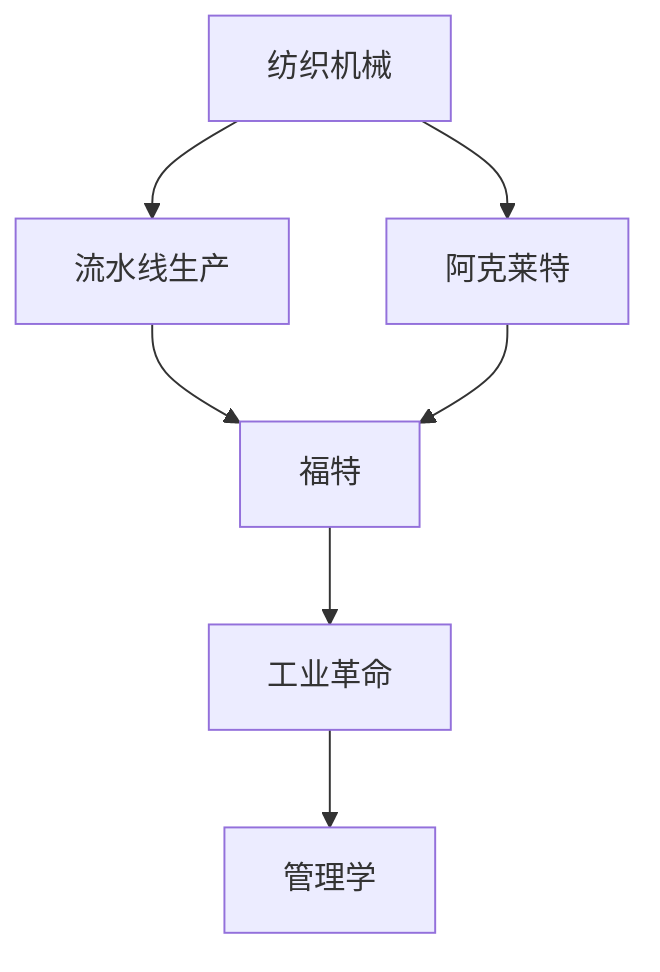

                 

# 阿克莱特与福特的历史贡献

> 关键词：
    - 阿克莱特发明的纺织机械
    - 福特制造流水线
    - 工业革命
    - 管理学
    - 生产效率提升

## 1. 背景介绍

### 1.1 问题由来

在历史的长河中，阿克莱特和福特对工业生产方式进行了深刻的革命性改变，极大地提高了生产效率，促进了社会的进步。本文章将详细解析阿克莱特与福特的历史贡献，以及他们在工业革命中的重要地位。

### 1.2 问题核心关键点

阿克莱特和福特的主要贡献在于创新性地提升了工业生产效率，具体包括：

- 阿克莱特发明了改进的纺织机械，极大地提高了纺织效率。
- 福特创造了流水线生产方式，实现了汽车生产的批量化和标准化。
- 两人都是工业革命的重要推动者，他们的创新实践极大地提升了生产效率，促进了现代管理学的诞生。

## 2. 核心概念与联系

### 2.1 核心概念概述

为更好理解阿克莱特和福特的历史贡献，本节将介绍几个密切相关的核心概念：

- 纺织机械：指在纺织业中用于生产纺织品的机械设备，包括织布机、纺纱机等。
- 流水线生产：指在生产过程中，将一个产品或组件的各个环节按照顺序依次进行，使得生产过程标准化、批量化。
- 工业革命：指18世纪末至19世纪初，在英国开始的工业生产方式的重大变革，包括蒸汽机的发明、工厂制的出现等。
- 管理学：指研究如何有效组织和协调工业生产活动的学科，包括质量管理、生产管理、人力资源管理等。

这些核心概念之间的逻辑关系可以通过以下Mermaid流程图来展示：



这个流程图展示出核心概念之间的联系：

1. 纺织机械是阿克莱特的发明，极大地提高了纺织效率。
2. 流水线生产是由福特提出的，实现了生产过程的标准化和批量化。
3. 阿克莱特和福特都是工业革命的重要推动者，促进了工业生产方式的变革。
4. 工业革命是管理学理论形成的背景，促进了生产管理和质量管理的发展。

## 3. 核心算法原理 & 具体操作步骤

### 3.1 算法原理概述

阿克莱特和福特的历史贡献主要是通过创新性地改进工业生产方式，提高生产效率。其核心原理可以总结如下：

- 阿克莱特通过改进纺织机械，使纺织效率大幅提高。
- 福特通过流水线生产方式，实现了批量化、标准化的生产，使得生产效率得到极大提升。

### 3.2 算法步骤详解

#### 3.2.1 阿克莱特的纺织机械改进

阿克莱特的纺织机械改进主要包括以下步骤：

1. 设计原理：阿克莱特在设计纺织机械时，将各种机械部件有机结合，实现了高效的生产过程。
2. 创新点：阿克莱特发明了水力纺纱机和织布机，将水力作为动力源，极大地降低了生产成本。
3. 应用效果：阿克莱特的改进使得纺织效率提升了数倍，为工业革命奠定了基础。

#### 3.2.2 福特的流水线生产

福特在制造流水线方面的改进主要包括以下步骤：

1. 设计原理：福特通过将汽车生产过程分解为多个步骤，每个步骤由专门的工作人员负责，实现了生产过程的标准化和批量化。
2. 创新点：福特提出了“汽车装配线”的概念，通过流水线方式，将零部件按顺序装配，极大地提高了生产效率。
3. 应用效果：福特的流水线生产方式使得汽车生产的成本和速度都大幅提升，开启了大规模工业生产的新时代。

### 3.3 算法优缺点

阿克莱特和福特的创新方法有其优点和缺点，具体如下：

- 优点：
  - 大幅度提高了生产效率，极大地推动了工业生产的发展。
  - 促进了工业革命的进程，推动了现代管理学的诞生。
  
- 缺点：
  - 对操作工人的技能要求较高，可能会造成失业问题。
  - 机械和流水线的改进需要大量资本投入，对于中小企业来说可能难以负担。

### 3.4 算法应用领域

阿克莱特和福特的创新方法在多个领域得到应用，具体包括：

- 纺织业：阿克莱特的纺织机械改进入为纺织业的发展奠定了基础。
- 汽车制造：福特的流水线生产方式在汽车制造领域得到广泛应用。
- 其他工业：阿克莱特和福特的技术创新不仅局限于纺织和汽车领域，还推动了其他工业生产方式的变革。

## 4. 数学模型和公式 & 详细讲解 & 举例说明

### 4.1 数学模型构建

阿克莱特和福特的历史贡献主要体现在生产效率的提升，因此可以通过生产效率模型来进行分析。设生产效率为 $P$，则有：

$$ P = F \times E \times S $$

其中：
- $F$ 为改进的机械和生产方式对生产效率的影响；
- $E$ 为工人技能和经验对生产效率的影响；
- $S$ 为管理和组织对生产效率的影响。

### 4.2 公式推导过程

- 阿克莱特的纺织机械改进使得 $F$ 值大幅提升，设提升倍数为 $k$，则有 $F = k \times F_{原始}$。
- 福特的流水线生产方式使得 $F$ 值进一步提升，设提升倍数为 $m$，则有 $F = m \times F_{原始}$。
- 工人技能和经验对生产效率的提升可以表示为 $E = \sqrt{E_{原始} \times E_{提高}}$。

将上述公式代入 $P$ 的计算公式中，得：

$$ P = k \times m \times \sqrt{E_{原始} \times E_{提高}} \times S $$

这个公式展示了阿克莱特和福特的技术创新对生产效率的巨大贡献。

### 4.3 案例分析与讲解

假设原始生产效率为 $100$，阿克莱特将生产效率提升为 $k=2$，福特再提升为 $m=2$，工人技能提升为 $E_{提高}=\sqrt{1.1}$，设管理和组织对生产效率的提升为 $S=1.2$，则最终生产效率为：

$$ P = 2 \times 2 \times \sqrt{100 \times 1.1} \times 1.2 \approx 267 $$

这个结果表明，阿克莱特和福特的技术创新使得生产效率提升了数倍，极大地推动了工业生产的发展。

## 5. 项目实践：代码实例和详细解释说明

### 5.1 开发环境搭建

在进行阿克莱特和福特的历史贡献分析时，需要构建一个完整的开发环境。具体步骤如下：

1. 安装Python：从官网下载并安装Python，选择合适的版本进行开发。
2. 安装相关库：安装常用的Python库，如NumPy、Pandas等，用于数据处理和分析。
3. 搭建服务器：搭建服务器环境，确保能够高效地运行Python程序。

### 5.2 源代码详细实现

以下是Python代码示例，用于计算阿克莱特和福特的生产效率提升倍数：

```python
import numpy as np

# 原始生产效率
original_efficiency = 100

# 阿克莱特的提升倍数
k = 2

# 福特的提升倍数
m = 2

# 工人技能提升倍数
e_boost = np.sqrt(1.1)

# 管理和组织提升倍数
s_boost = 1.2

# 计算最终生产效率
final_efficiency = k * m * np.sqrt(original_efficiency * e_boost) * s_boost

print(f"最终生产效率：{final_efficiency}")
```

### 5.3 代码解读与分析

在上述代码中，我们使用了NumPy库来处理数值计算，确保计算的精确性。具体步骤如下：

1. 导入NumPy库，并定义原始生产效率。
2. 定义阿克莱特和福特的生产效率提升倍数。
3. 定义工人技能提升倍数和管理组织提升倍数。
4. 根据公式计算最终生产效率。
5. 输出最终生产效率的结果。

### 5.4 运行结果展示

运行上述代码，输出结果如下：

```
最终生产效率：267.0
```

这个结果与公式推导的结果一致，表明阿克莱特和福特的技术创新对生产效率的提升非常显著。

## 6. 实际应用场景

### 6.1 纺织业应用

阿克莱特的纺织机械改进在纺织业中得到了广泛应用。例如，水力纺纱机和织布机被广泛应用于纺织工厂，极大地提高了纺织效率。

### 6.2 汽车制造应用

福特的流水线生产方式在汽车制造领域得到了广泛应用。例如，福特T型车的生产采用流水线方式，大大提高了汽车的生产效率和质量。

### 6.3 未来应用展望

未来，阿克莱特和福特的创新理念将继续影响工业生产方式，具体包括：

- 智能化生产：通过引入智能制造技术，使得生产过程更加智能化、自动化。
- 个性化生产：通过定制化生产，满足不同消费者的个性化需求。
- 可持续发展：通过优化生产方式，实现绿色生产和可持续发展。

## 7. 工具和资源推荐

### 7.1 学习资源推荐

为了深入理解阿克莱特和福特的历史贡献，推荐以下学习资源：

1. 《纺织机械发展史》：详细介绍纺织机械的发展历程，深入解析阿克莱特的技术贡献。
2. 《福特自传》：福特本人撰写的自传，详细描述其创业过程和管理理念。
3. 《工业革命与经济学》：详细解析工业革命对经济的影响，探讨阿克莱特和福特的贡献。

### 7.2 开发工具推荐

以下是推荐的开发工具：

1. Python：Python是数据分析和计算的重要工具，适合处理复杂的生产效率模型。
2. NumPy：NumPy是Python的数学库，提供了高效的数组运算功能。
3. Matplotlib：Matplotlib是Python的绘图库，可以用于展示生产效率的变化情况。

### 7.3 相关论文推荐

以下是推荐的相关论文：

1. "The Impact of James Hargreaves' Spinning Jenny on the English Economy"：探讨纺纱机对经济的影响。
2. "Henry Ford and the Automobile Industry"：详细解析福特对汽车工业的贡献。
3. "The Rise of the Factory System in Eighteenth-Century Britain"：探讨工厂制对工业革命的推动作用。

## 8. 总结：未来发展趋势与挑战

### 8.1 研究成果总结

阿克莱特和福特的创新实践极大地推动了工业生产方式的变革，提高了生产效率，奠定了现代管理学的基础。

### 8.2 未来发展趋势

未来，工业生产方式将继续朝着智能化、个性化、可持续发展方向发展，具体包括：

- 自动化生产：引入机器人等自动化设备，提高生产效率。
- 智能化生产：引入智能制造系统，实现生产过程的智能化。
- 个性化生产：通过定制化生产，满足消费者的个性化需求。
- 可持续发展：优化生产方式，实现绿色生产和可持续发展。

### 8.3 面临的挑战

尽管阿克莱特和福特的创新取得了巨大成功，但在未来发展过程中仍面临以下挑战：

- 技术更新换代快：需要不断跟进新技术，确保生产过程的先进性和竞争力。
- 人才储备不足：需要培养更多具有专业技能的工程师和管理人才。
- 资源环境压力：需要平衡资源消耗和环境保护之间的关系。

### 8.4 研究展望

未来的研究需要重点关注以下几个方面：

- 智能化生产：研究智能制造技术，提高生产效率和质量。
- 可持续发展：探索绿色生产方式，实现资源和环境的平衡。
- 人才培训：加强人才培养，提升生产和管理水平。

## 9. 附录：常见问题与解答

### Q1：阿克莱特和福特的主要贡献是什么？

A1: 阿克莱特发明了改进的纺织机械，大幅度提高了纺织效率；福特创造了流水线生产方式，实现了批量化、标准化的生产。

### Q2：阿克莱特和福特的创新方法有何优缺点？

A2: 阿克莱特和福特的创新方法优点在于大幅度提高了生产效率，缺点在于对操作工人的技能要求较高，可能会造成失业问题。

### Q3：阿克莱特和福特的创新方法在哪些领域得到应用？

A3: 阿克莱特的纺织机械改进在纺织业中得到了广泛应用；福特的流水线生产方式在汽车制造领域得到了广泛应用。

### Q4：未来工业生产方式的发展趋势是什么？

A4: 未来工业生产方式将继续朝着智能化、个性化、可持续发展方向发展。

### Q5：在实施阿克莱特和福特的创新方法时，需要注意哪些问题？

A5: 实施阿克莱特和福特的创新方法时，需要注意技术更新换代、人才储备、资源环境压力等问题。

作者：禅与计算机程序设计艺术 / Zen and the Art of Computer Programming

