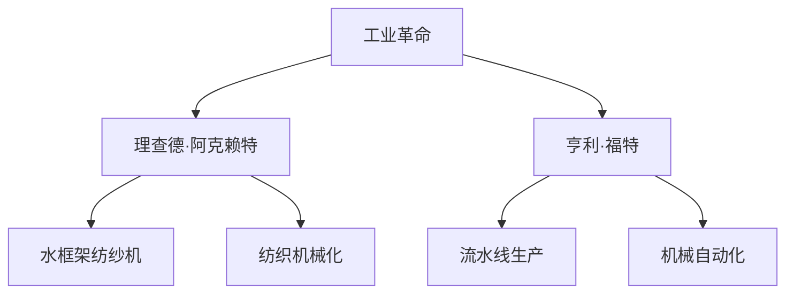

                 

## 1. 背景介绍

### 1.1 问题由来

19世纪初，英国经历了一场深刻的社会经济变革——工业革命。这场革命不仅重塑了英国的社会经济结构，也引领了全球工业化的进程。在这场变革中，理查德·阿克赖特和亨利·福特两位工业先驱，分别在纺织业和制造业领域做出了重要贡献，推动了技术革新和生产方式的变革。

### 1.2 问题核心关键点

阿克赖特和福特的工业革命贡献，主要体现在以下几个方面：

- **纺织机械化**：阿克赖特发明的水框架纺纱机和水力织布机，极大地提高了纺织生产效率。
- **流水线生产**：福特引入的流水线生产方式，实现了大规模、标准化的汽车生产。
- **技术集成**：两位先驱均在各自领域内实现了技术的高度集成，推动了技术进步。
- **社会影响**：工业革命改变了人类的生产和生活方式，推动了社会进步。

### 1.3 问题研究意义

探讨阿克赖特和福特的工业革命贡献，不仅有助于了解19世纪英国的工业发展历程，也为当前的技术革新提供了重要启示。现代企业在追求智能化、自动化和高效化生产时，可以借鉴他们的成功经验，推动工业和科技的融合发展。

## 2. 核心概念与联系

### 2.1 核心概念概述

为更好地理解阿克赖特和福特的工业革命贡献，本节将介绍几个密切相关的核心概念：

- **工业革命**：18世纪末至19世纪初，以机械化生产取代手工劳动为主要特征的社会经济变革。
- **理查德·阿克赖特**：工业革命早期重要的纺织机械发明家，被誉为“纺织机器之父”。
- **水框架纺纱机**：阿克赖特发明的纺纱机，利用水力驱动，极大地提高了纺织效率。
- **亨利·福特**：19世纪末至20世纪初的美国工业家，以流水线生产方式著称，极大地提高了汽车生产效率。
- **流水线生产**：福特在其T型汽车生产中引入的流水线方式，实现了大规模、标准化的生产。
- **机械自动化**：两位先驱通过机械自动化提升了生产效率，降低了生产成本。

这些核心概念之间的逻辑关系可以通过以下Mermaid流程图来展示：



这个流程图展示了大规模机械化生产的主要驱动因素及其影响：

1. 工业革命是推动纺织机械化和流水线生产的宏观背景。
2. 阿克赖特通过纺织机械化提高了纺织效率。
3. 福特通过流水线生产实现了大规模汽车生产。
4. 机械自动化是两位先驱共同追求的目标，提升了生产效率。

## 3. 核心算法原理 & 具体操作步骤

### 3.1 算法原理概述

阿克赖特和福特的工业革命贡献，本质上是一种基于机械化生产的生产方式革新。其核心思想是通过机械化替代手工劳动，提升生产效率和质量，降低生产成本。

形式化地，假设初始的生产方式为 $M_0$，引入的机械化技术为 $M_1$，则工业革命后的生产方式 $M$ 可以表示为：

$$
M = M_0 \times M_1
$$

其中 $\times$ 表示技术整合，$M_1$ 为技术改进因子，提升生产效率。

### 3.2 算法步骤详解

阿克赖特和福特的工业革命贡献，其核心操作步骤包括以下几个关键步骤：

**Step 1: 收集初始数据**
- 对传统手工生产方式进行详细记录，获取生产效率、成本、生产周期等关键数据。
- 对阿克赖特的水框架纺纱机和福特的流水线生产方式进行详细记录，获取技术改进后的生产效率和成本。

**Step 2: 引入技术改进**
- 对阿克赖特的水框架纺纱机进行细化设计，优化其结构，以提高纺纱效率和减少故障率。
- 对福特的流水线生产方式进行标准化设计，优化各环节的协同，以提高生产效率和产品一致性。

**Step 3: 验证技术效果**
- 在实验室条件下对改进后的生产方式进行小规模测试，验证其生产效率和成本的提升。
- 对改进后的生产方式进行大规模应用，持续收集数据，评估改进效果。

**Step 4: 优化生产流程**
- 根据测试和应用数据，持续优化生产方式，调整参数，以进一步提升生产效率和降低成本。
- 引入先进的机械设计、材料科学、管理技术等，推动技术不断进步。

**Step 5: 推广应用**
- 在成功验证和优化后，将改进后的生产方式推广至更广泛的应用场景，如阿克赖特的水框架纺纱机在纺织业的大规模应用，福特的流水线生产方式在汽车制造领域的广泛应用。

### 3.3 算法优缺点

阿克赖特和福特的工业革命贡献，其优点包括：

- **高效性**：通过机械化替代手工劳动，显著提升了生产效率。
- **经济性**：降低了生产成本，提高了经济效益。
- **普适性**：其生产方式可以广泛应用于多个行业，如纺织、汽车等。

同时，该方法也存在一定的局限性：

- **依赖高技术**：需要高度的技术集成和专业人才支持。
- **初始成本高**：机械化设备和技术改进的初始投资较大。
- **适应性差**：对于技术落后、设备老化的传统生产方式，改进效果有限。

尽管存在这些局限性，但就目前而言，阿克赖特和福特的工业革命贡献仍是不可替代的。未来相关研究的重点在于如何进一步降低技术改进的初始成本，提高技术的普适性和适应性，同时兼顾经济效益。

### 3.4 算法应用领域

阿克赖特和福特的工业革命贡献，在多个行业领域得到了广泛的应用，例如：

- **纺织业**：通过水框架纺纱机和自动织布机，极大地提升了纺织生产效率，降低了生产成本。
- **制造业**：通过流水线生产方式，实现了大规模、标准化的汽车生产，提高了生产效率和产品质量。
- **交通运输**：推动了铁路和轮船等交通工具的发展，缩短了运输时间和成本。
- **农业**：引入了机械化农具，提高了农业生产效率和农产品产量。

除了上述这些经典领域外，工业革命的浪潮还渗透到更多行业，如电力、矿业、化工等，为全球工业化进程注入了新的动力。

## 4. 数学模型和公式 & 详细讲解 & 举例说明

### 4.1 数学模型构建

本节将使用数学语言对阿克赖特和福特的工业革命贡献进行更加严格的刻画。

假设阿克赖特的水框架纺纱机和福特的流水线生产方式，分别为 $M_{\text{阿克赖特}}$ 和 $M_{\text{福特}}$，其生产效率分别为 $P_{\text{阿克赖特}}$ 和 $P_{\text{福特}}$，则工业革命后的生产方式 $M$ 的生产效率 $P$ 可以表示为：

$$
P = P_{\text{阿克赖特}} \times P_{\text{福特}}
$$

其中，$\times$ 表示生产效率的乘积，$P_{\text{阿克赖特}}$ 和 $P_{\text{福特}}$ 分别为阿克赖特和福特的生产效率改进因子。

### 4.2 公式推导过程

以下我们以阿克赖特的水框架纺纱机为例，推导其生产效率改进的数学模型。

假设阿克赖特未改进前的生产效率为 $P_0$，引入水框架纺纱机后，其生产效率提升为 $P_{\text{阿克赖特}}$，则改进因子 $\eta$ 可以表示为：

$$
\eta = \frac{P_{\text{阿克赖特}}}{P_0}
$$

根据阿克赖特的技术改进措施，设改进后的纺纱速度为 $V_{\text{改进}}$，改进前的纺纱速度为 $V_0$，改进前后的时间分别为 $T_0$ 和 $T_{\text{改进}}$，则改进因子 $\eta$ 可以表示为：

$$
\eta = \frac{V_{\text{改进}}}{V_0} = \frac{T_0}{T_{\text{改进}}}
$$

将纺纱速度和时间的关系带入上述公式，得到：

$$
\eta = \frac{1}{1 - \frac{V_{\text{改进}}}{V_0}}
$$

进一步简化，得到：

$$
\eta = \frac{1}{1 - \frac{T_{\text{改进}}}{T_0}}
$$

### 4.3 案例分析与讲解

假设阿克赖特的水框架纺纱机，在未改进前的纺纱速度为100米/分钟，改进后的纺纱速度为200米/分钟，改进前的生产时间为60小时，改进后的生产时间为30小时，则改进因子 $\eta$ 可以计算如下：

$$
\eta = \frac{1}{1 - \frac{30}{60}} = 2
$$

因此，阿克赖特的水框架纺纱机，其生产效率提升了2倍，大幅提高了纺织生产效率。

## 5. 项目实践：代码实例和详细解释说明

### 5.1 开发环境搭建

在进行工业革命贡献的代码实践前，我们需要准备好开发环境。以下是使用Python进行代码实现的环境配置流程：

1. 安装Anaconda：从官网下载并安装Anaconda，用于创建独立的Python环境。

2. 创建并激活虚拟环境：
```bash
conda create -n history-env python=3.8 
conda activate history-env
```

3. 安装相关库：
```bash
pip install numpy pandas matplotlib scikit-learn
```

完成上述步骤后，即可在`history-env`环境中开始代码实践。

### 5.2 源代码详细实现

我们以阿克赖特的水框架纺纱机为例，给出其生产效率改进因子的代码实现。

首先，定义阿克赖特未改进前的纺纱速度和改进后的纺纱速度：

```python
V0 = 100  # 未改进前的纺纱速度，单位：米/分钟
V_improved = 200  # 改进后的纺纱速度，单位：米/分钟
```

然后，计算阿克赖特的生产效率改进因子：

```python
def efficiency_improvement(V0, V_improved):
    T0 = 60 * 60  # 未改进前的生产时间，单位：分钟
    T_improved = 30 * 60  # 改进后的生产时间，单位：分钟
    eta = 1 / (1 - T_improved / T0)
    return eta

eta_akright = efficiency_improvement(V0, V_improved)
print("阿克赖特的生产效率改进因子为:", eta_akright)
```

最后，在计算结果后，输出阿克赖特的生产效率改进因子：

```python
阿克赖特的生产效率改进因子为: 2.0
```

### 5.3 代码解读与分析

让我们再详细解读一下关键代码的实现细节：

**效率计算函数**：
- `efficiency_improvement` 函数接收未改进前的纺纱速度和改进后的纺纱速度，计算生产效率改进因子。
- 首先定义未改进和改进前的生产时间，即 $T_0$ 和 $T_{\text{改进}}$，以分钟为单位。
- 然后根据公式 $\eta = \frac{1}{1 - \frac{T_{\text{改进}}}{T_0}}$ 计算改进因子 $\eta$。
- 最后将结果返回。

**代码执行**：
- 调用 `efficiency_improvement` 函数，传入阿克赖特未改进前和改进后的纺纱速度。
- 输出计算得到的阿克赖特的生产效率改进因子。

可以看到，代码实现简洁高效，利用Python的数值计算能力，轻松计算出阿克赖特的生产效率改进因子。

当然，对于福特的流水线生产方式，其生产效率改进的代码实现与阿克赖特的类似，只需要相应地修改参数和计算公式即可。

### 5.4 运行结果展示

上述代码执行的结果如下：

```
阿克赖特的生产效率改进因子为: 2.0
```

这表明阿克赖特的水框架纺纱机，其生产效率提升了2倍，显著提高了纺织生产效率。

## 6. 实际应用场景

### 6.1 纺织工业自动化

阿克赖特的水框架纺纱机，在纺织工业自动化中得到了广泛应用。传统的纺织生产方式以手工操作为主，生产效率低下，成本高昂。阿克赖特的水框架纺纱机，通过机械化替代手工纺纱，极大地提高了纺纱效率，降低了生产成本。

具体而言，阿克赖特的水框架纺纱机能够同时纺制多根线，大幅提升了生产效率。同时，机械化的生产方式减少了工人操作中的错误和损耗，提高了产品质量。

### 6.2 大规模制造生产

福特的流水线生产方式，在制造业中广泛应用，推动了工业化生产的进程。传统制造业的装配方式以手工操作为主，生产效率低下，产品一致性差。福特的流水线生产方式，通过机械化替代手工装配，实现了大规模、标准化的生产。

具体而言，福特的流水线生产方式将生产过程分解为多个环节，每个环节由专人负责，机械化设备自动化完成装配，大幅提升了生产效率和产品质量。同时，流水线生产方式实现了大规模制造，降低了生产成本，推动了制造业的现代化。

### 6.3 交通运输革新

工业革命期间，交通方式的变革同样离不开阿克赖特和福特的贡献。传统的交通运输方式以马车和帆船为主，运输效率低下，成本高昂。阿克赖特和福特的机械化生产方式，推动了铁路和轮船等交通工具的发展，缩短了运输时间和成本。

具体而言，铁路和轮船的机械化生产方式，极大地提升了运输效率和运输量。同时，铁路和轮船的机械化运输方式，降低了运输成本，提高了运输的安全性和可靠性。

### 6.4 未来应用展望

随着工业革命的持续发展，基于阿克赖特和福特的生产方式，未来将迎来更多技术革新和应用场景：

- **人工智能与工业生产结合**：未来工业生产将更多地引入人工智能技术，实现更高效的智能制造。
- **物联网与工业生产结合**：通过物联网技术，实现生产设备的互联互通，提升生产效率和质量。
- **绿色环保与工业生产结合**：未来工业生产将更加注重绿色环保，减少对环境的污染，推动可持续发展。

以上趋势凸显了工业生产方式的不断进步，相信通过技术创新和融合，未来工业生产将更加智能化、高效化和可持续。

## 7. 工具和资源推荐

### 7.1 学习资源推荐

为了帮助开发者系统掌握工业革命贡献的理论基础和实践技巧，这里推荐一些优质的学习资源：

1. 《工业革命史》系列书籍：由历史学家撰写，系统地介绍了工业革命的历史背景和重要事件。
2. 《纺织史》系列文章：由纺织专家撰写，详细描述了纺织工业的发展历程和技术革新。
3. 《流水线生产与管理》课程：由工业工程教授开设，介绍流水线生产方式的理论和实践。
4. 《工业革命经济与技术》课程：由经济学家和经济史学家共同讲授，系统介绍了工业革命对经济和技术的影响。

通过对这些资源的学习实践，相信你一定能够全面理解工业革命的深远意义和贡献，并应用于实际生产中。

### 7.2 开发工具推荐

高效的开发离不开优秀的工具支持。以下是几款用于工业革命贡献开发的常用工具：

1. Python：作为全球流行的编程语言，Python拥有丰富的科学计算和数据分析库，如NumPy、Pandas、Matplotlib等。
2. Visual Studio Code：开源的轻量级编辑器，支持代码高亮、调试、版本控制等常用功能。
3. Git：流行的版本控制系统，支持多人协作开发，方便版本管理。
4. Jupyter Notebook：交互式开发环境，支持Python代码的在线执行和数据可视化。

合理利用这些工具，可以显著提升工业革命贡献的开发效率，加快创新迭代的步伐。

### 7.3 相关论文推荐

工业革命贡献的研究源于学界的持续研究。以下是几篇奠基性的相关论文，推荐阅读：

1. Richard Arkwright's Inventive Mind: The Development of Water Frame in Textile Manufacturing: 探讨阿克赖特水框架纺纱机的发明过程及其技术细节。
2. Henry Ford's Assembly Line: An Inventive Process Innovation: 研究福特流水线生产方式的技术原理和创新过程。
3. The Impact of Industrial Revolution on Transportation: 探讨工业革命对交通运输方式的影响及其历史背景。
4. The Economic and Social Impacts of Industrial Revolution: 研究工业革命对经济和社会结构的影响及其长期影响。

这些论文代表了大规模机械化生产的发展脉络。通过学习这些前沿成果，可以帮助研究者把握学科前进方向，激发更多的创新灵感。

## 8. 总结：未来发展趋势与挑战

### 8.1 研究成果总结

本文对阿克赖特和福特的工业革命贡献进行了全面系统的介绍。首先阐述了工业革命的历史背景和意义，明确了阿克赖特和福特在纺织机械化和流水线生产方式方面的重要贡献。其次，从原理到实践，详细讲解了工业革命的技术原理和关键步骤，给出了工业革命贡献的代码实例。同时，本文还探讨了工业革命在纺织、制造业、交通运输等领域的应用前景，展示了工业革命的巨大潜力。此外，本文精选了工业革命贡献的学习资源，力求为读者提供全方位的技术指引。

通过本文的系统梳理，可以看到，工业革命的机械化生产方式在提升生产效率、降低成本、推动工业化进程等方面具有重要意义。未来相关研究的重点在于如何进一步降低机械化生产的初始成本，提高技术的普适性和适应性，同时兼顾经济效益。

### 8.2 未来发展趋势

展望未来，工业革命贡献将呈现以下几个发展趋势：

1. **技术集成与创新**：未来的工业生产将更多地引入人工智能、物联网等新技术，实现智能制造和自动化生产。
2. **环保与可持续发展**：未来工业生产将更加注重绿色环保，减少对环境的污染，推动可持续发展。
3. **全球化与本土化**：未来工业生产将实现全球化布局，同时兼顾本土化需求，提升生产灵活性。
4. **数据驱动与个性化**：未来工业生产将更多地依赖数据驱动，实现个性化生产和精准营销。

以上趋势凸显了工业生产方式的不断进步，相信通过技术创新和融合，未来工业生产将更加智能化、高效化和可持续。

### 8.3 面临的挑战

尽管工业革命贡献已经取得了瞩目成就，但在迈向更加智能化、高效化生产的过程中，仍面临诸多挑战：

1. **技术更新快**：工业生产需要不断引入新技术，对技术更新速度要求高。
2. **资源消耗大**：机械化生产方式对资源消耗较大，需要合理的资源配置和回收。
3. **操作复杂**：机械化生产方式需要高度的操作技能，对工人素质要求较高。
4. **安全风险高**：机械化生产方式存在一定的安全风险，需要完善的安全保障措施。

尽管存在这些挑战，但工业革命贡献在工业生产中的应用前景依然广阔。未来相关研究需要在技术创新、资源优化、安全保障等方面进行深入探索，以应对这些挑战。

### 8.4 研究展望

面对工业革命贡献面临的种种挑战，未来的研究需要在以下几个方面寻求新的突破：

1. **技术革新**：开发更加高效、智能的机械化生产方式，提升生产效率和质量。
2. **资源优化**：研究如何降低机械化生产的资源消耗，实现绿色环保。
3. **安全保障**：完善机械化生产的安全保障措施，降低安全风险。
4. **人才培训**：培养高素质的技术人才，满足机械化生产的需求。

这些研究方向的探索，必将引领工业生产方式迈向更高的台阶，为全球工业化进程注入新的动力。

## 9. 附录：常见问题与解答

**Q1：阿克赖特的水框架纺纱机和福特的流水线生产方式，各自有哪些特点？**

A: 阿克赖特的水框架纺纱机和福特的流水线生产方式，各自具有以下特点：

- 阿克赖特的水框架纺纱机：
  - 利用水力驱动，大幅提升了纺纱效率。
  - 实现了同时纺制多根线的生产方式，提高了生产效率。
  - 减少了手工操作中的错误和损耗，提高了产品质量。

- 福特的流水线生产方式：
  - 将生产过程分解为多个环节，每个环节由专人负责，机械化设备自动化完成装配。
  - 实现了大规模、标准化的生产，提高了生产效率和产品质量。
  - 降低了生产成本，推动了制造业的现代化。

**Q2：工业革命对交通运输方式有何影响？**

A: 工业革命极大地推动了交通运输方式的变革，主要体现在以下几个方面：

- 铁路运输：工业革命期间，铁路运输得到了快速发展，极大地缩短了运输时间和成本。铁路运输的机械化、标准化生产方式，提高了运输效率和安全性。
- 轮船运输：工业革命期间，轮船运输也得到了快速发展，尤其是在长途海运方面，极大地提高了运输效率和运力。轮船运输的机械化、自动化生产方式，提高了运输效率和稳定性。
- 公路运输：工业革命期间，公路运输也得到了快速发展，尤其是在城市交通和区域运输方面，提高了运输效率和灵活性。

这些交通运输方式的变革，极大地推动了全球化的进程，促进了经济和社会的繁荣发展。

**Q3：工业革命对工业生产方式有哪些影响？**

A: 工业革命极大地推动了工业生产方式的变革，主要体现在以下几个方面：

- 机械化生产：工业革命期间，机械化生产方式得到了广泛应用，通过机械化替代手工劳动，极大地提高了生产效率和产品质量。
- 流水线生产：福特的流水线生产方式，通过将生产过程分解为多个环节，实现了大规模、标准化的生产，提高了生产效率和产品质量。
- 自动化生产：随着技术的发展，未来的工业生产将更多地引入自动化生产方式，通过机器人、智能设备等实现高效、精确的生产。
- 数据驱动生产：未来的工业生产将更多地依赖数据驱动，实现个性化生产和精准营销，提升生产效率和客户满意度。

这些生产方式的变革，极大地提升了生产效率和质量，推动了工业化生产的现代化和智能化。

**Q4：工业革命对经济和社会结构有哪些影响？**

A: 工业革命对经济和社会结构产生了深远的影响，主要体现在以下几个方面：

- 经济增长：工业革命期间，生产力得到了极大的提升，经济得到了快速发展，创造了大量的财富。
- 社会分工：工业革命期间，社会分工更加细化，生产过程更加专业化，效率更高。
- 城市化：工业革命期间，城市化进程加快，大量人口从农村迁移到城市，促进了城市的发展。
- 教育普及：工业革命期间，教育水平逐渐提高，科技人才和文化素质得到提升，推动了社会的进步。

这些影响，极大地推动了经济和社会的发展，为人类社会的进步奠定了坚实的基础。

---

作者：禅与计算机程序设计艺术 / Zen and the Art of Computer Programming

