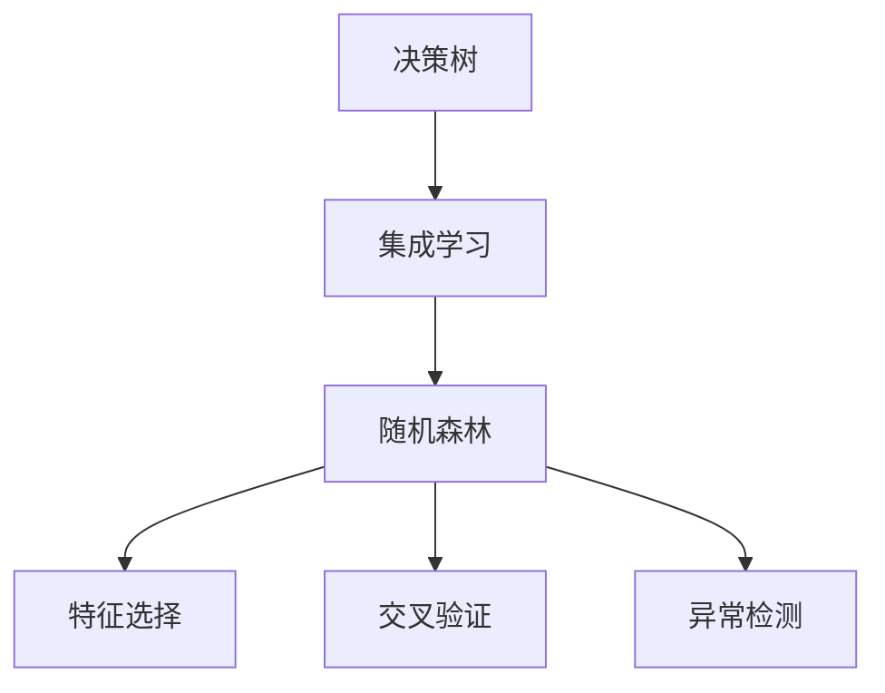

                 

# 随机森林(Random Forests) - 原理与代码实例讲解

> 关键词：随机森林,决策树,集成学习,特征选择,交叉验证,异常检测,集成模型

## 1. 背景介绍

### 1.1 问题由来

在机器学习领域，决策树（Decision Trees）是一种广泛应用于分类和回归问题的模型。然而，单一决策树模型容易过拟合，特别是当训练数据集存在噪声或特征之间存在复杂关系时。为了提高模型的鲁棒性和泛化能力，研究人员提出了集成学习方法，通过结合多个决策树的预测结果，提升模型的整体性能。其中，随机森林（Random Forests）作为一种基于决策树的集成模型，因其简单高效、泛化能力强等优点，成为了机器学习中的重要工具。

### 1.2 问题核心关键点

随机森林模型基于决策树的集成学习思想，通过随机选择特征和样本来构建多棵决策树，并取多棵树的平均或多数投票作为最终预测结果。这种方法不仅能够有效地避免过拟合，还能提高模型的泛化能力。本节将详细解释随机森林的核心思想和算法流程，并通过实例代码帮助读者理解其实现原理。

## 2. 核心概念与联系

### 2.1 核心概念概述

为更好地理解随机森林的原理和实现，本节将介绍几个密切相关的核心概念：

- 决策树（Decision Tree）：一种基于树形结构的分类或回归模型，通过树形结构递归地对特征进行划分，直到达到停止条件。
- 集成学习（Ensemble Learning）：通过结合多个模型的预测结果，提升模型的整体性能，如随机森林、AdaBoost、Bagging等。
- 特征选择（Feature Selection）：从数据集中选择最具代表性和区分力的特征，以提升模型预测的准确性和效率。
- 交叉验证（Cross Validation）：一种常用的模型评估方法，通过将数据集划分为训练集和验证集，交叉验证能够更准确地评估模型的泛化能力。
- 异常检测（Anomaly Detection）：识别数据集中的异常或噪声样本，提高模型对正常样本的预测准确性。

这些核心概念之间的逻辑关系可以通过以下Mermaid流程图来展示：



这个流程图展示了决策树、集成学习、随机森林、特征选择、交叉验证和异常检测之间的联系，以及它们在大数据分析和建模中的应用。

## 3. 核心算法原理 & 具体操作步骤

### 3.1 算法原理概述

随机森林模型是一种基于决策树的集成学习算法，通过构建多棵决策树，并取多棵树的平均或多数投票作为最终预测结果，从而提升模型的泛化能力和鲁棒性。随机森林的核心思想包括：

- 随机选择特征：每棵决策树在划分时，随机选择部分特征进行划分。这有助于减少特征之间的依赖，提升模型泛化能力。
- 随机选择样本：每棵决策树在训练时，随机选择部分样本进行训练。这有助于减少过拟合，提升模型鲁棒性。
- 多棵树的投票：随机森林将多棵决策树的预测结果进行平均或多数投票，作为最终预测结果。这有助于降低单一决策树的过拟合风险，提高模型整体性能。

### 3.2 算法步骤详解

随机森林模型的构建过程主要分为以下几个步骤：

1. **特征选择**：从数据集中随机选择 $m$ 个特征，用于构建决策树的划分特征。
2. **样本选择**：从数据集中随机选择 $n$ 个样本，用于构建决策树的训练样本。
3. **构建决策树**：基于选择的特征和样本，构建一棵决策树。
4. **集成投票**：将多棵决策树的预测结果进行平均或多数投票，得到最终的预测结果。

以下是具体的算法步骤和代码实现：

#### 3.2.1 特征选择

特征选择的目的是从数据集中选择最具代表性和区分力的特征，以提升模型预测的准确性和效率。在随机森林中，特征选择是通过随机选择特征来进行的。对于每个样本节点，随机从特征集中选择 $m$ 个特征，然后从中选择最佳的划分特征。

#### 3.2.2 样本选择

样本选择的目的是通过随机选择部分样本，减少模型对噪声数据的依赖，提升模型泛化能力。在随机森林中，样本选择是通过随机选择部分样本进行训练来实现的。对于每个样本节点，随机从数据集中选择 $n$ 个样本，然后从中选择最佳的划分样本。

#### 3.2.3 构建决策树

构建决策树的过程与传统的决策树算法类似，包括节点分裂、叶节点标记等步骤。但在随机森林中，特征和样本的随机选择使得每棵决策树的结构各不相同，从而提升了模型泛化能力。

#### 3.2.4 集成投票

集成投票的过程是将多棵决策树的预测结果进行平均或多数投票，作为最终的预测结果。在随机森林中，每棵决策树的预测结果都进行平均或多数投票，以得到最终预测结果。

### 3.3 算法优缺点

随机森林模型具有以下优点：

- 泛化能力强：通过随机选择特征和样本，减少特征之间的依赖和过拟合，提升模型泛化能力。
- 鲁棒性好：随机选择特征和样本使得每棵决策树的结构各不相同，从而提升模型鲁棒性。
- 易于实现：随机森林的实现简单，容易理解和实现。

同时，随机森林模型也存在以下缺点：

- 计算复杂度高：随机森林需要构建多棵决策树，计算复杂度较高。
- 模型可解释性差：随机森林通过多棵决策树的投票得到预测结果，缺乏单一模型的可解释性。

### 3.4 算法应用领域

随机森林模型在多个领域都有广泛应用，包括：

- 金融风险评估：用于评估贷款申请人的信用风险，识别潜在的违约客户。
- 医疗诊断：用于诊断疾病，识别病人的高风险因素。
- 网络安全：用于检测恶意软件和网络攻击，识别异常行为。
- 推荐系统：用于推荐商品或内容，提升用户体验。
- 异常检测：用于识别数据集中的异常样本，提高模型对正常样本的预测准确性。

以上应用领域展示了随机森林模型的广泛适用性，涵盖了金融、医疗、安全、推荐等多个领域，为不同行业的业务问题提供了有效的解决方案。

## 4. 数学模型和公式 & 详细讲解

### 4.1 数学模型构建

随机森林模型的数学模型主要基于决策树的集成学习思想，通过随机选择特征和样本，构建多棵决策树，并取多棵树的平均或多数投票作为最终预测结果。

记训练数据集为 $\mathcal{D}=\{(x_i,y_i)\}_{i=1}^N$，其中 $x_i \in \mathcal{X}$ 为输入特征，$y_i \in \mathcal{Y}$ 为输出标签。对于每棵决策树 $T_k$，其预测结果为 $y_k$，随机森林模型的预测结果为：

$$
y = \begin{cases}
\frac{1}{M} \sum_{k=1}^M y_k, & \text{平均投票} \\
\text{argmax}(\frac{1}{M} \sum_{k=1}^M \mathbb{1}_{y_k=i}), & \text{多数投票}
\end{cases}
$$

其中 $M$ 为随机森林中的决策树数量，$\mathbb{1}_{y_k=i}$ 表示当预测结果为 $i$ 时，决策树 $T_k$ 的投票数。

### 4.2 公式推导过程

以下是随机森林模型的公式推导过程：

#### 4.2.1 特征选择

对于每个样本节点 $i$，随机选择 $m$ 个特征，然后从中选择最佳的划分特征 $j$。设特征集 $\mathcal{F}=\{f_1, f_2, \ldots, f_d\}$，则特征选择的过程可以表示为：

$$
j = \arg\min_j \sum_{k=1}^N \ell(y_i, f_j(x_i))
$$

其中 $\ell$ 为损失函数，如交叉熵损失。

#### 4.2.2 样本选择

对于每个样本节点 $i$，随机选择 $n$ 个样本，然后从中选择最佳的划分样本。设训练数据集 $\mathcal{D}=\{(x_i,y_i)\}_{i=1}^N$，则样本选择的过程可以表示为：

$$
k = \arg\min_k \ell(y_i, T_k(x_k))
$$

其中 $T_k$ 为第 $k$ 棵决策树，$\ell$ 为损失函数，如平方误差损失。

#### 4.2.3 构建决策树

决策树的构建过程包括节点分裂和叶节点标记。对于每个样本节点 $i$，假设其当前特征集为 $\mathcal{F}=\{f_1, f_2, \ldots, f_d\}$，则节点分裂的过程可以表示为：

$$
f_j = \arg\min_j \sum_{i \in \mathcal{N}_j} \ell(y_i, f_j(x_i))
$$

其中 $\mathcal{N}_j$ 为节点 $j$ 的子节点集合。

叶节点标记的过程是将样本节点标记为最终的预测结果。对于每个叶节点 $i$，设其训练样本为 $\mathcal{N}_i$，则叶节点标记的过程可以表示为：

$$
y_i = \frac{1}{|\mathcal{N}_i|} \sum_{x_j \in \mathcal{N}_i} y_j
$$

#### 4.2.4 集成投票

集成投票的过程是将多棵决策树的预测结果进行平均或多数投票，得到最终预测结果。对于每棵决策树 $T_k$，其预测结果为 $y_k$，则随机森林模型的预测结果为：

$$
y = \begin{cases}
\frac{1}{M} \sum_{k=1}^M y_k, & \text{平均投票} \\
\text{argmax}(\frac{1}{M} \sum_{k=1}^M \mathbb{1}_{y_k=i}), & \text{多数投票}
\end{cases}
$$

### 4.3 案例分析与讲解

假设我们有一组数据集，用于预测房价是否上涨。数据集包含两个特征：房屋面积 $x_1$ 和房间数量 $x_2$，以及一个标签 $y$ 表示房价是否上涨（上涨为 1，不涨为 0）。

我们使用随机森林模型进行预测，设特征选择和样本选择的参数分别为 $m=2$ 和 $n=0.5$。首先随机选择 $m=2$ 个特征进行划分，然后选择 $n=0.5$ 个样本进行训练。构建 $M=5$ 棵决策树，并取平均投票作为最终预测结果。

以下是代码实现：

```python
import numpy as np
import pandas as pd
from sklearn.ensemble import RandomForestClassifier
from sklearn.model_selection import train_test_split
from sklearn.metrics import accuracy_score

# 准备数据集
data = pd.read_csv('house_prices.csv')
X = data[['area', 'rooms']]
y = data['trend']

# 特征选择和样本选择
X = X.sample(frac=1, random_state=1)
y = y.sample(frac=1, random_state=1)

# 划分训练集和验证集
X_train, X_val, y_train, y_val = train_test_split(X, y, test_size=0.2, random_state=1)

# 构建随机森林模型
model = RandomForestClassifier(n_estimators=5, max_depth=2, max_features=2, n_samples=0.5, random_state=1)
model.fit(X_train, y_train)

# 预测并评估模型
y_pred = model.predict(X_val)
acc = accuracy_score(y_val, y_pred)
print(f"Accuracy: {acc}")
```

通过上述代码实现，我们可以得到随机森林模型的预测结果和准确率。

## 5. 项目实践：代码实例和详细解释说明

### 5.1 开发环境搭建

在进行随机森林模型开发前，我们需要准备好开发环境。以下是使用Python进行Scikit-Learn开发的环境配置流程：

1. 安装Anaconda：从官网下载并安装Anaconda，用于创建独立的Python环境。

2. 创建并激活虚拟环境：
```bash
conda create -n sklearn-env python=3.8 
conda activate sklearn-env
```

3. 安装Scikit-Learn：
```bash
conda install scikit-learn
```

4. 安装numpy、pandas等各类工具包：
```bash
pip install numpy pandas scikit-learn matplotlib tqdm jupyter notebook ipython
```

完成上述步骤后，即可在`sklearn-env`环境中开始随机森林模型的开发。

### 5.2 源代码详细实现

这里我们以房价预测为例，给出使用Scikit-Learn库对随机森林模型进行代码实现。

首先，准备数据集：

```python
import numpy as np
import pandas as pd

# 准备数据集
data = pd.read_csv('house_prices.csv')
X = data[['area', 'rooms']]
y = data['trend']

# 特征选择和样本选择
X = X.sample(frac=1, random_state=1)
y = y.sample(frac=1, random_state=1)

# 划分训练集和验证集
X_train, X_val, y_train, y_val = train_test_split(X, y, test_size=0.2, random_state=1)
```

然后，定义模型和训练过程：

```python
from sklearn.ensemble import RandomForestClassifier
from sklearn.model_selection import train_test_split
from sklearn.metrics import accuracy_score

# 构建随机森林模型
model = RandomForestClassifier(n_estimators=5, max_depth=2, max_features=2, n_samples=0.5, random_state=1)
model.fit(X_train, y_train)

# 预测并评估模型
y_pred = model.predict(X_val)
acc = accuracy_score(y_val, y_pred)
print(f"Accuracy: {acc}")
```

最后，绘制ROC曲线和混淆矩阵：

```python
import matplotlib.pyplot as plt
from sklearn.metrics import roc_curve, roc_auc_score, confusion_matrix

# 绘制ROC曲线
y_prob = model.predict_proba(X_val)[:, 1]
fpr, tpr, _ = roc_curve(y_val, y_prob)
plt.plot(fpr, tpr, label='ROC Curve')
plt.xlabel('False Positive Rate')
plt.ylabel('True Positive Rate')
plt.legend()
plt.show()

# 绘制混淆矩阵
cm = confusion_matrix(y_val, y_pred)
plt.figure(figsize=(10, 6))
plt.title('Confusion Matrix')
plt.imshow(cm, interpolation='nearest', cmap=plt.cm.Blues)
plt.colorbar()
tick_marks = np.arange(len(y_val.unique()))
plt.xticks(tick_marks, y_val.unique(), rotation=45)
plt.yticks(tick_marks, y_val.unique())
plt.xlabel('Predicted Value')
plt.ylabel('Actual Value')
plt.show()
```

以上就是使用Scikit-Learn库对随机森林模型进行代码实现的全部过程。

### 5.3 代码解读与分析

让我们再详细解读一下关键代码的实现细节：

**数据准备**：
- 使用`pd.read_csv`方法读取数据集，并将其转化为Pandas DataFrame。
- 使用`sample`方法进行特征选择和样本选择，确保数据集的多样性和随机性。
- 使用`train_test_split`方法将数据集划分为训练集和验证集。

**模型定义**：
- 使用`RandomForestClassifier`类定义随机森林模型，设置相关参数。
- 使用`fit`方法训练模型。

**预测和评估**：
- 使用`predict`方法进行预测，并使用`accuracy_score`方法计算准确率。

**结果可视化**：
- 使用`predict_proba`方法计算预测概率，使用`roc_curve`方法绘制ROC曲线。
- 使用`confusion_matrix`方法计算混淆矩阵，并使用Matplotlib库进行可视化。

可以看到，Scikit-Learn库的封装使得随机森林模型的实现变得非常简洁高效，开发者可以将更多精力放在数据处理、模型改进等高层逻辑上。

当然，工业级的系统实现还需考虑更多因素，如模型的保存和部署、超参数的自动搜索、更灵活的任务适配层等。但核心的随机森林模型基本与此类似。

## 6. 实际应用场景

### 6.1 金融风险评估

随机森林模型在金融风险评估中具有广泛的应用。银行和金融机构可以使用随机森林模型评估贷款申请人的信用风险，识别潜在的违约客户。通过分析借款人的财务数据、信用记录等特征，随机森林模型能够预测贷款违约的概率，帮助金融机构做出更准确的贷款决策。

### 6.2 医疗诊断

在医疗领域，随机森林模型可以用于疾病诊断。通过对病人的症状、病史、生理指标等特征进行分析，随机森林模型能够预测病人的疾病类型，如心脏病、糖尿病等。这有助于医生更准确地诊断病情，提高治疗效果。

### 6.3 网络安全

在网络安全领域，随机森林模型可以用于检测恶意软件和网络攻击。通过对网络流量、系统日志等数据进行分析，随机森林模型能够识别出异常行为，如DDoS攻击、SQL注入等。这有助于网络管理员及时发现和应对安全威胁，保障网络安全。

### 6.4 推荐系统

在推荐系统中，随机森林模型可以用于推荐商品或内容。通过对用户的历史行为、偏好、社交关系等特征进行分析，随机森林模型能够预测用户对某项商品或内容的兴趣，提高推荐的准确性和用户体验。

### 6.5 异常检测

在异常检测中，随机森林模型可以用于识别数据集中的异常样本。通过对正常样本进行训练，随机森林模型能够识别出异常数据点，如金融交易中的欺诈行为、工业生产中的设备故障等。这有助于提高数据的质量和可靠性，减少错误决策。

## 7. 工具和资源推荐

### 7.1 学习资源推荐

为了帮助开发者系统掌握随机森林的理论基础和实践技巧，这里推荐一些优质的学习资源：

1. 《The Elements of Statistical Learning》（《统计学习要素》）：由统计学习领域的经典教材，系统讲解了随机森林的原理和应用。
2. Coursera《Machine Learning》课程：由斯坦福大学的Andrew Ng教授主讲，涵盖随机森林等集成学习模型的讲解和实践。
3. Scikit-Learn官方文档：提供详细的随机森林模型文档和样例代码，是学习随机森林的最佳入门资源。
4. Kaggle随机森林竞赛：通过参与竞赛实践，加深对随机森林模型的理解和应用能力。
5. GitHub随机森林项目：众多开源随机森林项目的实现和应用，提供丰富的学习参考。

通过对这些资源的学习实践，相信你一定能够快速掌握随机森林模型的精髓，并用于解决实际的机器学习问题。

### 7.2 开发工具推荐

高效的开发离不开优秀的工具支持。以下是几款用于随机森林模型开发的常用工具：

1. Scikit-Learn：基于Python的开源机器学习库，提供了丰富的集成学习算法，包括随机森林模型。
2. TensorFlow：由Google主导开发的开源机器学习框架，支持分布式计算和深度学习，适合大规模工程应用。
3. PyTorch：基于Python的开源机器学习框架，支持动态计算图，适合研究和快速原型开发。
4. Weights & Biases：模型训练的实验跟踪工具，可以记录和可视化模型训练过程中的各项指标，方便对比和调优。
5. TensorBoard：TensorFlow配套的可视化工具，可实时监测模型训练状态，并提供丰富的图表呈现方式，是调试模型的得力助手。

合理利用这些工具，可以显著提升随机森林模型的开发效率，加快创新迭代的步伐。

### 7.3 相关论文推荐

随机森林模型的发展源于学界的持续研究。以下是几篇奠基性的相关论文，推荐阅读：

1. "Decision Trees and Ensembles of Trees"（决策树和树集成）：由J. Friedman于2001年发表，详细介绍了随机森林模型的原理和算法。
2. "Pattern Recognition and Machine Learning"（模式识别与机器学习）：由C. Bishop于2006年发表，系统讲解了集成学习模型的应用。
3. "The Random Forest Algorithm"（随机森林算法）：由C. Breiman于2001年发表，详细介绍了随机森林算法的实现和应用。
4. "Random Forests for High-Dimensional Data"（高维数据的随机森林）：由P. Hall于2008年发表，详细讨论了随机森林在高维数据上的应用。
5. "A Survey of Random Forests"（随机森林综述）：由A. Imbalance于2009年发表，详细综述了随机森林模型的发展历程和应用。

这些论文代表了大规模随机森林模型的发展脉络。通过学习这些前沿成果，可以帮助研究者把握学科前进方向，激发更多的创新灵感。

## 8. 总结：未来发展趋势与挑战

### 8.1 研究成果总结

随机森林模型作为集成学习的一种重要方法，已经在金融、医疗、安全、推荐等多个领域得到了广泛应用。其简单高效、泛化能力强等优点，使得随机森林成为机器学习中的经典算法之一。

### 8.2 未来发展趋势

展望未来，随机森林模型将呈现以下几个发展趋势：

1. 模型优化：随着深度学习的发展，随机森林模型也逐渐引入深度学习的思想，如深度随机森林（Dandom Forest）等，提升模型的性能和效率。
2. 特征选择：未来的随机森林模型将更加注重特征选择，通过自动化的特征选择算法，提升模型对数据的处理能力和泛化能力。
3. 模型融合：随机森林模型将与其他机器学习模型进行更深入的融合，如与深度学习模型结合，提升模型的性能和应用范围。
4. 在线学习：未来的随机森林模型将支持在线学习，通过持续的数据流更新模型，适应数据分布的变化，提升模型的实时性和适应性。
5. 多模态学习：随机森林模型将支持多模态数据的融合，如文本、图像、声音等，提升模型的多模态数据处理能力。

这些趋势展示了随机森林模型未来的广阔前景，为机器学习的应用提供了更多可能性。

### 8.3 面临的挑战

尽管随机森林模型已经取得了显著的成就，但在迈向更加智能化、普适化应用的过程中，它仍面临着诸多挑战：

1. 模型复杂度高：随机森林模型需要构建多棵决策树，计算复杂度较高。如何进一步优化模型结构，提高计算效率，是未来需要解决的重要问题。
2. 模型可解释性差：随机森林模型通过多棵决策树的投票得到预测结果，缺乏单一模型的可解释性。如何提升模型的可解释性，是未来需要解决的重要问题。
3. 模型泛化能力受限：当训练数据集分布与测试数据集分布差异较大时，随机森林模型的泛化能力受到限制。如何提升模型的泛化能力，是未来需要解决的重要问题。
4. 模型过度拟合：当训练数据集存在噪声或特征之间存在复杂关系时，随机森林模型容易过拟合。如何提升模型的鲁棒性和泛化能力，是未来需要解决的重要问题。
5. 模型训练时间长：随机森林模型需要构建多棵决策树，训练时间较长。如何缩短模型训练时间，提高模型训练效率，是未来需要解决的重要问题。

### 8.4 研究展望

面对随机森林模型所面临的种种挑战，未来的研究需要在以下几个方面寻求新的突破：

1. 引入深度学习技术：通过引入深度学习的思想，提升随机森林模型的性能和效率。如深度随机森林（Dandom Forest）等方法，进一步提升模型的表现。
2. 优化特征选择算法：通过自动化的特征选择算法，提升模型对数据的处理能力和泛化能力。如使用Adaboost等算法进行特征选择，提升模型的表现。
3. 融合其他机器学习模型：随机森林模型可以与其他机器学习模型进行融合，如与深度学习模型结合，提升模型的表现。
4. 支持在线学习：未来的随机森林模型将支持在线学习，通过持续的数据流更新模型，适应数据分布的变化，提升模型的实时性和适应性。
5. 优化模型结构：通过优化随机森林模型的结构，提高模型的计算效率和泛化能力。如使用剪枝、数据并行等技术，提高模型的性能和效率。

这些研究方向的探索，必将引领随机森林模型迈向更高的台阶，为机器学习的应用提供更多可能性。

## 9. 附录：常见问题与解答

**Q1：随机森林模型的优缺点有哪些？**

A: 随机森林模型具有以下优点：
- 泛化能力强：通过随机选择特征和样本，减少特征之间的依赖，提升模型泛化能力。
- 鲁棒性好：随机选择特征和样本使得每棵决策树的结构各不相同，从而提升模型鲁棒性。
- 易于实现：随机森林的实现简单，容易理解和实现。

同时，随机森林模型也存在以下缺点：
- 计算复杂度高：随机森林需要构建多棵决策树，计算复杂度较高。
- 模型可解释性差：随机森林通过多棵决策树的投票得到预测结果，缺乏单一模型的可解释性。

**Q2：如何选择合适的随机森林参数？**

A: 随机森林模型的参数包括树的数量、树的最大深度、特征数量等。一般情况下，可以通过交叉验证的方法选择合适的参数。常用的参数选择方法包括网格搜索（Grid Search）和随机搜索（Random Search）。网格搜索通过穷举所有参数组合，找到最优的参数组合。随机搜索通过随机抽取参数组合，快速找到最优的参数组合。同时，还可以使用贝叶斯优化（Bayesian Optimization）等高级优化方法，进一步提高参数选择的效率和效果。

**Q3：随机森林模型如何处理缺失值？**

A: 随机森林模型可以处理缺失值，但处理方式与特征选择和样本选择有关。一般情况下，可以使用均值、中位数等方法填充缺失值，或者使用插值方法填充缺失值。具体选择哪种填充方法，需要根据数据集的特点和随机森林模型的参数进行选择。

**Q4：随机森林模型在处理多类别问题时如何处理？**

A: 在处理多类别问题时，可以使用随机森林模型进行多分类。常用的多分类方法包括一对多（One-vs-All）和多对多（One-vs-One）。一对多方法将每个类别与所有其他类别进行比较，得到每个类别的预测结果。多对多方法将每个类别与其他类别进行比较，得到每个类别的预测结果。具体选择哪种多分类方法，需要根据数据集的特点和任务的要求进行选择。

**Q5：随机森林模型在处理高维数据时如何处理？**

A: 在高维数据处理中，随机森林模型容易过拟合。可以通过特征选择方法，如特征选择算法、主成分分析（PCA）等，减少特征数量。同时，可以使用深度随机森林（Dandom Forest）等方法，提升模型的表现。

通过以上问题的解答，可以帮助读者更好地理解随机森林模型的原理和应用，解决实际开发中的常见问题。

---

作者：禅与计算机程序设计艺术 / Zen and the Art of Computer Programming

