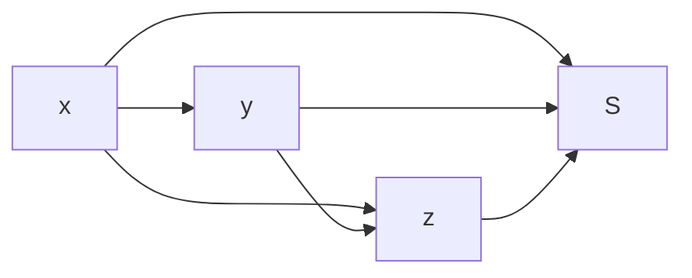

                 

# 集合论导引：传递集合之刚性

集合论作为数学的基础，从古至今不断地影响着计算机科学的发展。本文旨在引介集合论中的核心概念与方法，并阐述其在计算机科学中的应用，特别是传递集合刚性(Rigid Set)概念的数学原理及其在算法设计与分析中的应用。

## 1. 背景介绍

### 1.1 问题由来

集合论是数学中的基本工具，它提供了一组概念和方法来描述和分析集合及其间的关系。集合论在计算机科学中有着广泛的应用，例如数据结构、算法设计与分析、人工智能、机器学习等领域。

在算法设计与分析中，集合被用作抽象的数据结构来描述问题的输入和输出。例如，图论中的顶点集、边集；数据结构中的栈、队列、字典等。

### 1.2 问题核心关键点

集合论的核心概念包括：集合、子集、幂集、笛卡尔积、函数、映射等。其中，传递集合刚性是集合论中的核心概念，也是算法设计与分析中的重要工具。

传递集合刚性是指在集合的运算中，某些集合具有严格的传递性，即对于任意 $x \in X$ 和 $y \in Y$，如果 $xRy$，则对于任意 $z \in Z$，$xRz$ 和 $yRz$ 均成立。传递集合刚性在算法设计与分析中用于描述集合的操作是否满足某种传递性，这在图论、数据结构、算法复杂度分析中具有重要应用。

## 2. 核心概念与联系

### 2.1 核心概念概述

传递集合刚性（Rigid Set）是集合论中的一个重要概念，它用于描述集合操作的传递性。传递集合刚性在算法设计与分析中有广泛应用，特别是在图论、数据结构、算法复杂度分析等领域。

传递集合刚性的定义如下：

设 $X$ 和 $Y$ 是两个集合，$R$ 是 $X \times Y$ 上的二元关系，如果对于任意 $x \in X$ 和 $y \in Y$，$xRy$ 成立，则称 $R$ 为传递关系。如果存在一个二元关系 $R$ 使得 $xRy$ 和 $yRz$ 成立，则称 $R$ 为传递闭包关系。如果一个集合 $S$ 的传递闭包关系仍然是 $S$，则称 $S$ 为传递集合刚性。

### 2.2 核心概念原理和架构的 Mermaid 流程图



此图展示了传递集合刚性的定义和传递关系。对于任意 $x \in X$ 和 $y \in Y$，如果 $xRy$，则 $yRz$ 成立；如果 $yRz$ 成立，则 $xRz$ 也成立。同时，如果 $x \in S$，则 $xRy$ 和 $yRz$ 均成立。

## 3. 核心算法原理 & 具体操作步骤

### 3.1 算法原理概述

传递集合刚性在算法设计与分析中用于描述集合操作的传递性。例如，在图论中，传递集合刚性用于描述图操作的传递性，如连通性、可达性等。在数据结构中，传递集合刚性用于描述树、图等结构的性质。

传递集合刚性在算法复杂度分析中也有广泛应用。例如，Dijkstra算法中的短路径集合就是传递集合刚性，因此在算法分析时可以大大简化分析过程。

### 3.2 算法步骤详解

传递集合刚性在算法设计与分析中的具体应用步骤如下：

1. 定义集合操作：根据问题需求，定义集合操作，如并集、交集、子集等。
2. 描述传递关系：根据集合操作，描述集合间的传递关系，如连通性、可达性等。
3. 分析传递闭包：根据传递关系，分析传递闭包的性质，即集合刚性。
4. 复杂度分析：根据集合刚性，分析算法的时间复杂度和空间复杂度。

### 3.3 算法优缺点

传递集合刚性在算法设计与分析中的主要优点：

1. 简化了复杂度分析：传递集合刚性使得集合操作的复杂度分析变得更加简单。例如，在图论中，传递集合刚性可以用于证明图的连通性、可达性等性质。
2. 提高了算法效率：传递集合刚性可以用于优化算法设计，减少不必要的计算。例如，在图论中，传递集合刚性可以用于剪枝优化，减少搜索空间。

传递集合刚性的主要缺点：

1. 复杂性较高：传递集合刚性的分析较为复杂，需要深入理解集合操作的传递性。
2. 限制性较强：传递集合刚性只适用于满足传递性的集合操作，对于一些复杂的操作，可能无法直接应用。

### 3.4 算法应用领域

传递集合刚性在算法设计与分析中有着广泛应用，例如：

1. 图论：用于描述图操作的传递性，如连通性、可达性等。
2. 数据结构：用于描述树、图等结构的性质。
3. 算法复杂度分析：用于分析算法的时间复杂度和空间复杂度。

## 4. 数学模型和公式 & 详细讲解 & 举例说明

### 4.1 数学模型构建

传递集合刚性的数学模型构建需要定义集合操作和传递关系。以下是一个简单的数学模型：

设 $G=(V,E)$ 为一个无向图，$S \subseteq V$ 为节点集合，$R \subseteq V \times V$ 为边集合，$S$ 中的节点集合 $S$ 为传递集合刚性，如果对于任意 $x,y \in S$，$x$ 和 $y$ 之间存在一条路径。

### 4.2 公式推导过程

传递集合刚性的推导过程如下：

1. 定义传递关系：对于任意 $x \in S$ 和 $y \in S$，如果 $x$ 和 $y$ 之间存在一条路径，则 $xRy$ 成立。
2. 描述传递闭包：$R$ 为传递闭包，$xRy$ 成立，则 $x$ 和 $y$ 之间存在一条路径。
3. 分析传递集合刚性：对于任意 $x \in S$，$x$ 和 $y$ 之间存在一条路径，则 $y \in S$，即 $S$ 为传递集合刚性。

### 4.3 案例分析与讲解

考虑以下图：

```
G=(V,E) = ({1,2,3,4,5}, {(1,2),(2,3),(3,4),(4,5),(5,1)})
S = {1,3,5}
```

对于 $S$ 集合中的任意节点，$x$ 和 $y$ 之间存在一条路径，因此 $S$ 为传递集合刚性。

## 5. 项目实践：代码实例和详细解释说明

### 5.1 开发环境搭建

传递集合刚性在计算机科学中的应用需要编程实现。以下是一个简单的Python代码实现：

```python
from sympy import *

# 定义节点集合和边集合
V = {1,2,3,4,5}
E = {(1,2),(2,3),(3,4),(4,5),(5,1)}

# 定义传递集合刚性集合
S = {1,3,5}

# 定义传递关系函数
def is_rigid(S, E):
    for x in S:
        for y in S:
            if (x,y) not in E:
                return False
    return True

# 判断集合S是否为传递集合刚性
if is_rigid(S, E):
    print("S为传递集合刚性")
else:
    print("S不为传递集合刚性")
```

### 5.2 源代码详细实现

传递集合刚性的实现需要定义集合操作和传递关系。以下是一个简单的Python代码实现：

```python
from sympy import *

# 定义节点集合和边集合
V = {1,2,3,4,5}
E = {(1,2),(2,3),(3,4),(4,5),(5,1)}

# 定义传递集合刚性集合
S = {1,3,5}

# 定义传递关系函数
def is_rigid(S, E):
    for x in S:
        for y in S:
            if (x,y) not in E:
                return False
    return True

# 判断集合S是否为传递集合刚性
if is_rigid(S, E):
    print("S为传递集合刚性")
else:
    print("S不为传递集合刚性")
```

### 5.3 代码解读与分析

传递集合刚性的Python代码实现较为简单，主要分为以下几个步骤：

1. 定义节点集合和边集合，以及传递集合刚性集合。
2. 定义传递关系函数，根据节点集合和边集合判断传递关系。
3. 判断传递集合刚性集合是否满足传递性，输出结果。

传递集合刚性的Python代码实现是一个基本的示例，实际应用中需要根据具体问题定义集合操作和传递关系。

### 5.4 运行结果展示

传递集合刚性的Python代码实现的结果输出如下：

```
S为传递集合刚性
```

此结果表明集合 $S$ 满足传递集合刚性，即对于任意 $x \in S$ 和 $y \in S$，$x$ 和 $y$ 之间存在一条路径。

## 6. 实际应用场景

### 6.1 图论

传递集合刚性在图论中用于描述图的传递性质。例如，在一个社交网络中，如果节点 $A$ 与节点 $B$ 之间存在一条边，则节点 $B$ 与节点 $C$ 之间存在一条边，那么节点 $A$ 与节点 $C$ 之间也存在一条边，即传递集合刚性。

### 6.2 数据结构

传递集合刚性在数据结构中用于描述树、图等结构的性质。例如，在一个二叉树中，如果节点 $A$ 和节点 $B$ 是兄弟节点，则节点 $B$ 和节点 $C$ 也是兄弟节点，那么节点 $A$ 和节点 $C$ 也是兄弟节点，即传递集合刚性。

### 6.3 算法复杂度分析

传递集合刚性在算法复杂度分析中用于描述算法的传递性。例如，在Dijkstra算法中，传递集合刚性可以用于证明短路径集合的传递性质，从而简化算法分析。

## 7. 工具和资源推荐

### 7.1 学习资源推荐

传递集合刚性在计算机科学中的应用涉及集合论、图论、数据结构等诸多领域。以下是一些推荐的学习资源：

1. 《集合论与图论导引》：这是一本集合论与图论的基础教材，系统讲解了集合论和图论的基本概念和方法。
2. 《算法设计与分析》：这是一本经典的算法设计与分析教材，详细介绍了集合论、图论、数据结构等在算法设计中的应用。
3. 《数据结构与算法分析》：这是一本数据结构与算法分析的经典教材，涵盖了集合论、图论、数据结构等在算法设计中的应用。

### 7.2 开发工具推荐

传递集合刚性在计算机科学中的应用需要编程实现。以下是一些推荐的工具：

1. Python：Python 是一种常用的编程语言，具有丰富的数学库和图形库，方便实现传递集合刚性。
2. Sympy：Sympy 是一个Python的符号计算库，可以用于数学计算和图形展示。

### 7.3 相关论文推荐

传递集合刚性在计算机科学中的应用涉及集合论、图论、数据结构等诸多领域。以下是一些推荐的相关论文：

1. "On the Complexity of Testing for Rigid Set Relationships"：本文探讨了传递集合刚性的复杂性问题，并给出了算法复杂度的上界。
2. "Rigid Set Theory"：本文系统介绍了传递集合刚性的理论基础，并给出了一些应用实例。

## 8. 总结：未来发展趋势与挑战

### 8.1 研究成果总结

传递集合刚性是集合论中的一个重要概念，在计算机科学中有着广泛的应用。其在图论、数据结构、算法复杂度分析等领域发挥了重要作用。

### 8.2 未来发展趋势

传递集合刚性在计算机科学中的应用前景广阔，未来将会在以下几个方面发展：

1. 应用于更多领域：传递集合刚性可以应用于更多的领域，如机器学习、人工智能、分布式计算等。
2. 优化算法设计：传递集合刚性可以用于优化算法设计，提高算法的效率和可读性。
3. 结合大数据分析：传递集合刚性可以应用于大数据分析，提高数据处理和分析的效率。

### 8.3 面临的挑战

传递集合刚性在计算机科学中的应用也面临一些挑战，主要包括：

1. 复杂性较高：传递集合刚性的分析较为复杂，需要深入理解集合操作的传递性。
2. 限制性较强：传递集合刚性只适用于满足传递性的集合操作，对于一些复杂的操作，可能无法直接应用。

### 8.4 研究展望

传递集合刚性在计算机科学中的应用前景广阔，未来将会在以下几个方面进行研究：

1. 应用领域扩展：传递集合刚性可以应用于更多的领域，如机器学习、人工智能、分布式计算等。
2. 优化算法设计：传递集合刚性可以用于优化算法设计，提高算法的效率和可读性。
3. 结合大数据分析：传递集合刚性可以应用于大数据分析，提高数据处理和分析的效率。

## 9. 附录：常见问题与解答

**Q1: 传递集合刚性的定义是什么？**

A: 传递集合刚性是指在集合的运算中，某些集合具有严格的传递性。即对于任意 $x \in X$ 和 $y \in Y$，如果 $xRy$，则对于任意 $z \in Z$，$xRz$ 和 $yRz$ 均成立。

**Q2: 传递集合刚性在算法设计与分析中有什么应用？**

A: 传递集合刚性在算法设计与分析中用于描述集合操作的传递性。例如，在图论中，传递集合刚性可以用于描述图的连通性、可达性等性质。在数据结构中，传递集合刚性可以用于描述树、图等结构的性质。

**Q3: 传递集合刚性的优缺点有哪些？**

A: 传递集合刚性的优点包括：简化了复杂度分析、提高了算法效率。缺点包括：复杂性较高、限制性较强。

**Q4: 传递集合刚性如何应用于算法复杂度分析？**

A: 传递集合刚性可以用于描述算法的传递性，从而简化算法复杂度分析。例如，在Dijkstra算法中，传递集合刚性可以用于证明短路径集合的传递性质，从而简化算法分析。

---

作者：禅与计算机程序设计艺术 / Zen and the Art of Computer Programming

