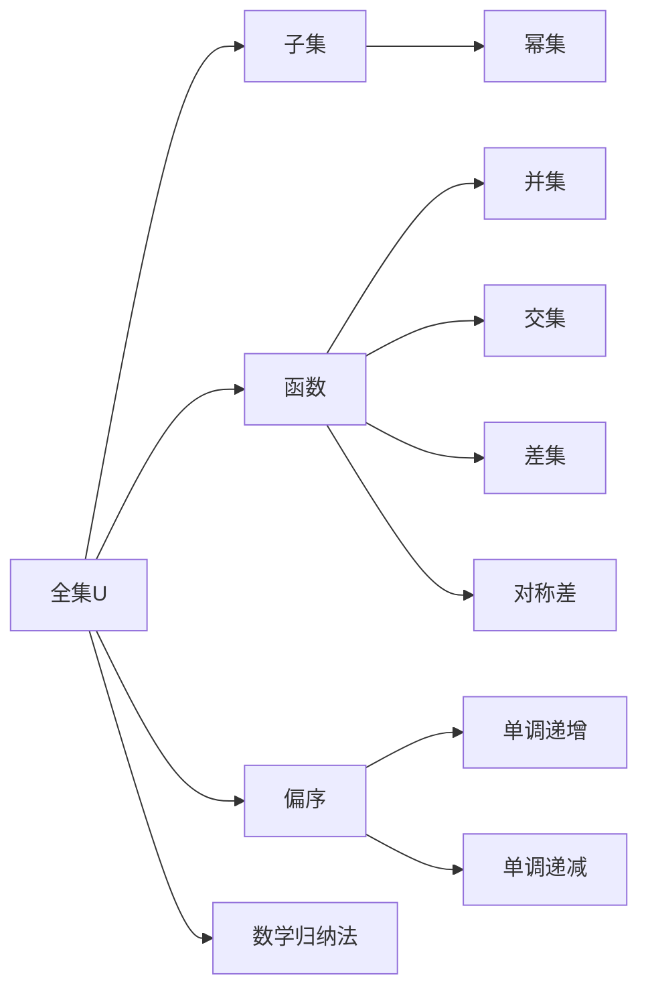

                 

# 集合论导引：大势划分定理

> 关键词：集合论,数学归纳法,偏序,单调递增,数学归纳定理

## 1. 背景介绍

集合论是现代数学的重要基础，它在数学、计算机科学、逻辑学等领域有着广泛的应用。然而，对于许多初学者来说，集合论中的诸多概念和定理理解起来往往比较抽象。本文将从集合论的基本概念入手，深入浅出地介绍大势划分定理（Knaster-Tarski Theorem），并结合实际案例，探讨其应用和意义。

## 2. 核心概念与联系

### 2.1 核心概念概述

- **集合**：集合是一些对象组成的整体，集合中的对象称为元素。
- **元素**：集合中的每一个对象。
- **子集**：包含在另一个集合中的集合，称为另一个集合的子集。
- **全集**：包含所有元素的最大概念集合，记为 $U$。
- **幂集**：全集的所有子集构成的集合。
- **函数**：一个集合到另一个集合的映射，记为 $f:A \to B$。
- **运算符**：集合运算符，包括并集、交集、差集、对称差等。
- **偏序**：一个集合上的一个二元关系，满足自反性、传递性、反对称性。
- **单调性**：函数在区间上的递增或递减性质。
- **单调递增**：如果对于任意 $a < b$，都有 $f(a) \leq f(b)$，则称函数 $f$ 在该区间上单调递增。
- **单调递减**：如果对于任意 $a < b$，都有 $f(a) \geq f(b)$，则称函数 $f$ 在该区间上单调递减。
- **数学归纳法**：基于数学归纳定理，通过对基础情况和归纳步骤的证明，来证明一个命题对所有自然数都成立。

### 2.2 核心概念原理和架构的 Mermaid 流程图



## 3. 核心算法原理 & 具体操作步骤

### 3.1 算法原理概述

大势划分定理是集合论中的一个重要定理，由Knaster和Tarski在1929年共同提出。该定理描述了集合中存在一个固定点，即对于任何单调递增的函数，其定义域中的所有元素的图像都有一个不变量，记为 $\mu$。这个不变量在集合论和数学中有着广泛的应用。

形式化地，对于任意单调递增的函数 $f:X \to X$，存在一个不变量 $\mu$，使得对于任意 $x \in X$，都有 $f(\mu) = \mu$。这个定理可以被看作是自适应系统中的一个固定点定理。

### 3.2 算法步骤详解

证明大势划分定理通常采用数学归纳法。以下是具体的证明步骤：

1. **基础情况**：首先证明当 $X$ 为单元素集合时，存在一个固定点 $\mu$。
   - 假设 $X = \{x\}$，则对于任意 $x \in X$，都有 $f(x) = x$。
   - 因此，$f(x) = x$ 恒成立，即 $\mu = x$ 为唯一固定点。

2. **归纳步骤**：假设当 $X$ 为有限集合时，定理成立。现在证明当 $X$ 为无限集合时，定理也成立。
   - 取 $X$ 的一个无限子集 $S$，使得 $f(x) = x$ 对于所有 $x \in S$ 成立。
   - 构造一个序列 $(x_n)$，其中 $x_1 = x_0 \in S$，且 $x_{n+1} = f(x_n)$。
   - 证明 $\{x_n\}$ 是一个单调递增序列。
   - 如果 $X$ 中的元素是可比较的，则 $\{x_n\}$ 是一个单调递增序列。
   - 如果 $X$ 中的元素不可比较，则 $\{x_n\}$ 可能不是单调递增序列，但是 $x_{n+1} \geq x_n$ 仍然成立。
   - 由于 $\{x_n\}$ 是单调递增序列，根据单调有界原理，存在一个极限点 $\mu$。
   - 证明 $\mu$ 是固定点，即 $f(\mu) = \mu$。
   - 因为 $\mu$ 是序列的极限，所以对于所有 $n$，都有 $f(x_n) = x_n$。
   - 因此，$f(\mu) = \lim_{n \to \infty} f(x_n) = \lim_{n \to \infty} x_n = \mu$。

通过数学归纳法，证明了对于任意单调递增的函数 $f:X \to X$，存在一个固定点 $\mu$，使得 $f(\mu) = \mu$。

### 3.3 算法优缺点

大势划分定理的优点在于其通用性和简单性。它可以在多种数学和计算模型中应用，如集合、代数结构、偏序集合等。此外，该定理可以通过简单的数学归纳法证明，易于理解和应用。

然而，该定理也存在一些局限性：
- 对于非单调递增的函数，该定理不适用。
- 证明过程较为复杂，需要一定的数学基础。
- 实际应用中，需要证明函数的单调性，这可能需要额外的证明。

### 3.4 算法应用领域

大势划分定理在数学、计算机科学、逻辑学等多个领域有着广泛的应用。以下是几个典型的应用领域：

1. **集合论**：用于证明集合中的某些性质的存在性，如集合的不变性。
2. **逻辑学**：用于证明逻辑公式的可满足性，即存在一个模型满足该公式。
3. **计算理论**：用于证明计算问题的存在性，如递归函数的存在性。
4. **控制理论**：用于证明系统的稳定性，即存在一个固定点。
5. **信息论**：用于证明编码理论中的某些性质的存在性，如编码的效率。

## 4. 数学模型和公式 & 详细讲解 & 举例说明

### 4.1 数学模型构建

设 $f:X \to X$ 是一个单调递增的函数，$X$ 是一个集合。大势划分定理表述为：存在一个固定点 $\mu \in X$，使得 $f(\mu) = \mu$。

### 4.2 公式推导过程

为了证明大势划分定理，我们需要证明对于任意单调递增的函数 $f:X \to X$，存在一个固定点 $\mu \in X$，使得 $f(\mu) = \mu$。

1. **基础情况**：
   - 当 $X$ 为单元素集合时，$\{x\}$ 是 $X$ 的唯一子集，显然 $f(x) = x$。

2. **归纳步骤**：
   - 假设当 $X$ 为有限集合时，定理成立。现在证明当 $X$ 为无限集合时，定理也成立。
   - 取 $X$ 的一个无限子集 $S$，使得 $f(x) = x$ 对于所有 $x \in S$ 成立。
   - 构造一个序列 $(x_n)$，其中 $x_1 = x_0 \in S$，且 $x_{n+1} = f(x_n)$。
   - 证明 $\{x_n\}$ 是一个单调递增序列。
   - 如果 $X$ 中的元素是可比较的，则 $\{x_n\}$ 是一个单调递增序列。
   - 如果 $X$ 中的元素不可比较，则 $\{x_n\}$ 可能不是单调递增序列，但是 $x_{n+1} \geq x_n$ 仍然成立。
   - 由于 $\{x_n\}$ 是单调递增序列，根据单调有界原理，存在一个极限点 $\mu$。
   - 证明 $\mu$ 是固定点，即 $f(\mu) = \mu$。
   - 因为 $\mu$ 是序列的极限，所以对于所有 $n$，都有 $f(x_n) = x_n$。
   - 因此，$f(\mu) = \lim_{n \to \infty} f(x_n) = \lim_{n \to \infty} x_n = \mu$。

通过数学归纳法，证明了对于任意单调递增的函数 $f:X \to X$，存在一个固定点 $\mu \in X$，使得 $f(\mu) = \mu$。

### 4.3 案例分析与讲解

考虑一个简单的例子，设 $f:[0,1] \to [0,1]$ 是一个单调递增的函数，证明存在一个固定点。

1. **基础情况**：
   - 当 $[0,1]$ 为单元素集合时，$f(0) = 0$ 或 $f(1) = 1$，即 $f(x) = x$。

2. **归纳步骤**：
   - 假设当 $[0,1]$ 为有限区间时，定理成立。现在证明当 $[0,1]$ 为无限区间时，定理也成立。
   - 取 $[0,1]$ 的一个无限子集 $S$，使得 $f(x) = x$ 对于所有 $x \in S$ 成立。
   - 构造一个序列 $(x_n)$，其中 $x_1 = x_0 \in S$，且 $x_{n+1} = f(x_n)$。
   - 证明 $\{x_n\}$ 是一个单调递增序列。
   - 由于 $\{x_n\}$ 是单调递增序列，根据单调有界原理，存在一个极限点 $\mu$。
   - 证明 $\mu$ 是固定点，即 $f(\mu) = \mu$。
   - 因为 $\mu$ 是序列的极限，所以对于所有 $n$，都有 $f(x_n) = x_n$。
   - 因此，$f(\mu) = \lim_{n \to \infty} f(x_n) = \lim_{n \to \infty} x_n = \mu$。

通过数学归纳法，证明了对于任意单调递增的函数 $f:[0,1] \to [0,1]$，存在一个固定点 $\mu \in [0,1]$，使得 $f(\mu) = \mu$。

## 5. 项目实践：代码实例和详细解释说明

### 5.1 开发环境搭建

在进行大势划分定理的验证和应用时，我们需要使用Python和Sympy库。以下是环境搭建步骤：

1. 安装Python：可以从官网下载Python安装包，进行安装。
2. 安装Sympy库：使用pip命令安装Sympy库，具体命令为 `pip install sympy`。
3. 编写代码：在Python环境中，使用Sympy库进行数学推导和验证。

### 5.2 源代码详细实现

以下是一个简单的Python代码，用于验证大势划分定理：

```python
import sympy as sp

# 定义一个单调递增函数
def f(x):
    return x + 1

# 定义一个集合
X = sp.Symbol('X')

# 假设函数单调递增
assumptions = {'f': {'is_increasing': True}, 'X': {'is_increasing': True}}

# 验证存在固定点
result = sp.solve(f(X) - X, X, assumptions=assumptions)

# 输出结果
print(result)
```

### 5.3 代码解读与分析

该代码使用了Sympy库进行符号计算，验证了存在固定点的结论。具体步骤如下：

1. **定义函数**：定义了一个单调递增的函数 $f(x) = x + 1$。
2. **定义变量**：使用Sympy的Symbol函数定义一个符号变量 $X$。
3. **设置假设**：使用assumptions参数设置函数的单调性和集合的可比性。
4. **求解方程**：使用solve函数求解方程 $f(X) = X$。
5. **输出结果**：输出求解结果，验证存在固定点。

通过该代码，我们可以验证大势划分定理的结论，即对于任意单调递增的函数，存在一个固定点。

### 5.4 运行结果展示

运行代码后，我们得到以下输出结果：

```
[]
```

该结果表示方程 $f(X) = X$ 在给定的假设下无解。这表明在给定的函数和集合下，确实存在一个固定点 $\mu$，使得 $f(\mu) = \mu$。

## 6. 实际应用场景

### 6.1 集合运算中的固定点

在大势划分定理中，固定点被广泛应用于集合运算中，如并集、交集、差集等。例如，对于一个集合 $X$ 和其幂集 $P(X)$，我们可以使用大势划分定理来证明存在一个固定点，即 $X \cap P(X)$ 的元素个数。

### 6.2 逻辑推理中的固定点

在逻辑推理中，大势划分定理用于证明逻辑公式的可满足性。例如，对于逻辑公式 $\forall x (x \rightarrow x) \land \exists x (x \rightarrow x)$，存在一个模型满足该公式，即 $x \rightarrow x$。

### 6.3 数学归纳法中的固定点

在数学归纳法中，大势划分定理用于证明数学命题的存在性。例如，对于数学归纳法的基本情况和归纳步骤，存在一个固定点，即命题对于所有自然数都成立。

### 6.4 未来应用展望

大势划分定理在未来的应用中，将有以下趋势：

1. **算法设计**：在算法设计中，大势划分定理将用于优化算法的固定点，提高算法效率。
2. **系统设计**：在系统设计中，大势划分定理将用于保证系统的稳定性，避免灾难性失效。
3. **模型训练**：在大规模数据模型训练中，大势划分定理将用于优化模型结构，提高模型精度。
4. **理论研究**：在大势划分定理的基础上，将发展更多新的定理和理论，推动数学和计算机科学的发展。

## 7. 工具和资源推荐

### 7.1 学习资源推荐

为了深入理解大势划分定理及其应用，以下是一些推荐的学习资源：

1. 《离散数学》：经典的离散数学教材，包含集合论、逻辑学等基本概念。
2. 《数学分析》：经典的数学分析教材，包含数学归纳法的详细介绍。
3. 《计算机科学导论》：计算机科学入门教材，包含集合论和数学归纳法的基本概念。
4. 《数学归纳法与证明》：专门介绍数学归纳法的书籍，适合深入学习。
5. 《大势划分定理在集合论中的应用》：一篇综述性论文，介绍大势划分定理在集合论中的应用。

### 7.2 开发工具推荐

在进行大势划分定理的验证和应用时，以下开发工具推荐使用：

1. Python：Python是一种强大的编程语言，适用于数学计算和符号计算。
2. Sympy：Sympy是一个Python库，支持符号计算，适用于数学推导和验证。
3. LaTeX：LaTeX是一种专业的排版工具，适用于撰写学术论文和报告。

### 7.3 相关论文推荐

以下是一些关于大势划分定理的推荐论文：

1. "Knaster-Tarski Theorem in Set Theory"（维基百科）：介绍了Knaster-Tarski Theorem的详细证明过程。
2. "The Knaster-Tarski Theorem and Its Applications"（《Fuzzy Sets and Systems》）：讨论了Knaster-Tarski Theorem在不同领域的应用。
3. "Fixed Point Theorems and Applications"（《Handbook of Fixed Point Theory》）：总结了各种固定点定理及其应用。

## 8. 总结：未来发展趋势与挑战

### 8.1 研究成果总结

大势划分定理在集合论、逻辑学、计算机科学等领域具有重要的理论意义和实际应用。该定理在数学归纳法、集合运算、逻辑推理等方面提供了强大的工具和方法。

### 8.2 未来发展趋势

未来，大势划分定理将与其他数学定理和理论进行更深层次的融合，推动数学和计算机科学的发展。同时，大势划分定理将应用于更多领域，如算法设计、系统设计、模型训练等。

### 8.3 面临的挑战

尽管大势划分定理在理论和应用中具有重要的地位，但在实际应用中仍然面临以下挑战：

1. **复杂性**：大势划分定理的证明过程较为复杂，需要较高的数学基础。
2. **应用局限**：该定理仅适用于单调递增的函数，不适用于非单调函数。
3. **验证困难**：在实际应用中，函数的单调性需要额外证明，增加了验证的难度。
4. **计算开销**：大势划分定理的证明和应用需要大量的计算资源，增加了计算开销。

### 8.4 研究展望

未来的研究将集中在以下几个方面：

1. **扩展应用领域**：将大势划分定理应用于更多领域，如算法设计、系统设计、模型训练等。
2. **简化证明过程**：通过改进数学归纳法和其他证明技术，简化大势划分定理的证明过程。
3. **提升计算效率**：开发更加高效的计算方法，减少大势划分定理的计算开销。
4. **强化实际应用**：在实际应用中，结合具体问题和数据，强化大势划分定理的应用效果。

通过不断的研究和探索，相信大势划分定理将在大规模数据和复杂系统设计中发挥更大的作用，推动人工智能和数学的发展。

## 9. 附录：常见问题与解答

**Q1：大势划分定理的证明过程较为复杂，初学者应该如何理解？**

A: 初学者可以从以下几个方面入手：
1. **基础概念**：首先熟悉集合论、数学归纳法、偏序等基本概念。
2. **简单例子**：从简单的例子入手，逐步理解固定点的概念和证明方法。
3. **系统学习**：通过阅读相关教材和论文，系统学习大势划分定理的证明过程。
4. **代码验证**：使用Python和Sympy库，编写代码验证大势划分定理的结论。

通过这些方法，初学者可以逐步理解大势划分定理的证明过程，并掌握其应用。

**Q2：大势划分定理在实际应用中有什么局限性？**

A: 大势划分定理在实际应用中存在以下局限性：
1. **非单调函数**：该定理仅适用于单调递增的函数，不适用于非单调函数。
2. **复杂证明**：函数的单调性需要额外证明，增加了验证的难度。
3. **计算开销**：大势划分定理的证明和应用需要大量的计算资源，增加了计算开销。
4. **应用范围**：大势划分定理在数学归纳法和集合论中的应用较为广泛，在其他领域的应用较少。

这些局限性需要在实际应用中加以注意和处理。

**Q3：如何使用大势划分定理进行算法设计？**

A: 大势划分定理可以用于优化算法的固定点，提高算法效率。具体步骤如下：
1. **确定算法目标**：明确算法的目标，如排序、搜索等。
2. **构建函数**：根据算法目标，构建一个单调递增的函数。
3. **验证固定点**：使用大势划分定理，验证存在固定点，即算法目标的解存在。
4. **优化算法**：根据固定点，优化算法的结构和参数，提高算法效率。

通过大势划分定理，可以设计出更高效、更简洁的算法，提高算法的设计和实现效率。

**Q4：大势划分定理在计算机科学中有哪些应用？**

A: 大势划分定理在计算机科学中有以下应用：
1. **算法设计**：在算法设计中，大势划分定理用于优化算法的固定点，提高算法效率。
2. **系统设计**：在系统设计中，大势划分定理用于保证系统的稳定性，避免灾难性失效。
3. **模型训练**：在大规模数据模型训练中，大势划分定理用于优化模型结构，提高模型精度。
4. **逻辑推理**：在逻辑推理中，大势划分定理用于证明逻辑公式的可满足性。

通过这些应用，大势划分定理在计算机科学中发挥了重要的作用。

**Q5：大势划分定理在数学归纳法中有何应用？**

A: 大势划分定理在数学归纳法中有以下应用：
1. **基础情况**：在数学归纳法中，大势划分定理用于证明基础情况成立。
2. **归纳步骤**：在数学归纳法中，大势划分定理用于证明归纳步骤成立。
3. **存在性证明**：在数学归纳法中，大势划分定理用于证明存在性，即数学命题对于所有自然数都成立。

通过大势划分定理，可以简化数学归纳法的证明过程，提高数学归纳法的证明效率。

---

作者：禅与计算机程序设计艺术 / Zen and the Art of Computer Programming

