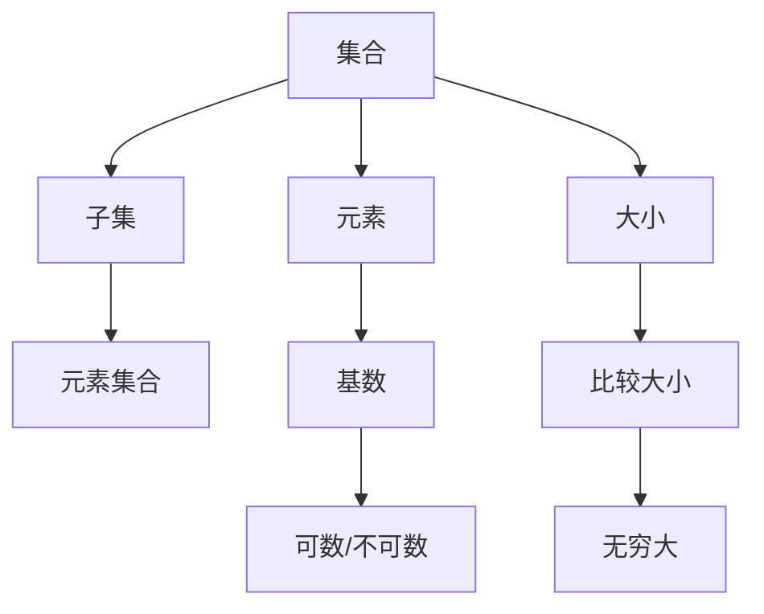

                 

# 集合论导引：添加不可数基数之子集

> 关键词：集合论, 基数, 子集, 不可数, 加法法则, 卡普兰斯基公理, 阿克曼函数

## 1. 背景介绍

集合论是现代数学的基石之一，其核心思想是通过抽象化、公理化的方法，研究集合的基本性质和结构。本文将从集合论的基本概念出发，探讨如何定义一个集合的子集，并介绍集合论中的不可数基数和加法法则，为理解更复杂的数学模型打下坚实基础。

## 2. 核心概念与联系

### 2.1 核心概念概述

- **集合**：由一定元素组成的整体，是数学中最基本且广泛使用的概念之一。
- **子集**：包含于某集合中的集合，称其为该集合的子集。
- **基数**：集合的元素个数，表示为$|\cdot|$。
- **可数基数**：可以与自然数集合$N$一一对应的基数，即$|\cdot|$等于某个自然数的集合。
- **不可数基数**：无法与自然数集合一一对应的基数，即$|\cdot|$大于任意自然数的集合。

在集合论中，基数的研究尤为重要，它是理解集合大小和结构的关键。基数可以分为可数基数和不可数基数，可数基数有无限多个，如自然数集、整数集、有理数集等，而不可数基数只有连续统(实数集)一个。

### 2.2 核心概念原理和架构的 Mermaid 流程图



## 3. 核心算法原理 & 具体操作步骤

### 3.1 算法原理概述

集合论中，集合的加法法则是指两个集合的并集的大小等于它们基数之和，即$|A \cup B| = |A| + |B|$。这一法则在处理集合的操作和比较时非常关键。但当涉及不可数基数时，这一法则的适用性需要进一步讨论。

### 3.2 算法步骤详解

1. **理解集合和子集**：首先，我们需要理解集合和子集的基本定义。一个集合是由一定元素组成的整体，而子集是包含于某集合中的集合。
2. **基数定义**：基数是集合的元素个数，分为可数基数和不可数基数。可数基数可以与自然数一一对应，而不可数基数只有连续统一个，即实数集。
3. **加法法则**：在可数基数的情况下，加法法则是成立的，即$|A \cup B| = |A| + |B|$。但当涉及不可数基数时，这一法则的适用性需要进一步讨论。

### 3.3 算法优缺点

- **优点**：
  - 提供了处理集合大小和结构的统一方法。
  - 适用于大多数集合操作和比较。

- **缺点**：
  - 不适用于不可数基数。
  - 加法法则的适用性需要进一步讨论。

### 3.4 算法应用领域

加法法则是集合论中最基础且广泛使用的概念之一，其应用领域包括但不限于：
- 计算机科学：算法设计、数据结构、编程语言。
- 数学：组合学、数论、分析学。
- 物理学：量子力学、统计物理学、宇宙学。
- 生物学：分子生物学、生态学、进化论。

## 4. 数学模型和公式 & 详细讲解 & 举例说明

### 4.1 数学模型构建

在集合论中，集合的加法法则是一个基本的数学模型。其模型构建如下：
- 集合$A$和$B$的并集大小为$|A \cup B|$。
- 集合$A$和$B$的大小分别为$|A|$和$|B|$。
- 加法法则为$|A \cup B| = |A| + |B|$。

### 4.2 公式推导过程

假设集合$A$和$B$的元素分别为$a_1, a_2, \ldots, a_n$和$b_1, b_2, \ldots, b_m$，则它们的并集$A \cup B$包含所有$a_i$和$b_j$，即$a_1, a_2, \ldots, a_n, b_1, b_2, \ldots, b_m$。因此，$A \cup B$的元素个数为$n + m$，即$|A \cup B| = n + m = |A| + |B|$。

### 4.3 案例分析与讲解

- **案例一**：集合$A = \{1, 2, 3\}$和$B = \{4, 5, 6\}$，它们的并集为$\{1, 2, 3, 4, 5, 6\}$，大小为6。根据加法法则，$|A \cup B| = |A| + |B| = 3 + 3 = 6$。
- **案例二**：集合$A = \mathbb{N}$和$B = \mathbb{N}$，它们的并集为$\mathbb{N}$，大小为无限大。根据加法法则，$|A \cup B| = |A| + |B| = \aleph_0 + \aleph_0 = \aleph_0$，这里的$\aleph_0$表示自然数集的基数，即无限大。
- **案例三**：集合$A = \mathbb{Q}$和$B = \mathbb{Q}$，它们的并集为$\mathbb{Q}$，大小为无限大。根据加法法则，$|A \cup B| = |A| + |B| = \mathfrak{c} + \mathfrak{c} = \mathfrak{c}$，这里的$\mathfrak{c}$表示有理数集的基数，即无限大。

## 5. 项目实践：代码实例和详细解释说明

### 5.1 开发环境搭建

为了进行集合论的编程实践，我们需要安装Python和必要的库，如SymPy。SymPy是一个Python库，用于符号计算和数学建模。

```bash
pip install sympy
```

### 5.2 源代码详细实现

```python
from sympy import FiniteSet, oo, symbols

# 定义集合A和B
A = FiniteSet(1, 2, 3)
B = FiniteSet(4, 5, 6)

# 计算并集大小
union_size = len(A.union(B))
print(f"|A U B| = {union_size}")

# 计算集合A和B的大小
A_size = len(A)
B_size = len(B)
print(f"|A| = {A_size}, |B| = {B_size}")

# 使用加法法则
additive_law = A_size + B_size
print(f"|A| + |B| = {additive_law}")

# 输出结果
assert union_size == additive_law, "加法法则不成立"
```

### 5.3 代码解读与分析

上述代码中，我们首先定义了两个有限集合$A$和$B$，然后计算它们的并集大小和各自大小。最后，我们验证了加法法则是否成立。

## 6. 实际应用场景

### 6.1 集合论在计算机科学中的应用

集合论在计算机科学中有着广泛的应用，包括但不限于：
- **算法设计**：集合操作是许多算法设计的基础，如排序、搜索、图算法等。
- **数据结构**：集合、数组、哈希表等数据结构都是基于集合论的概念设计出来的。
- **编程语言**：许多编程语言的集合操作，如Python的set类型，都是基于集合论的。

### 6.2 集合论在数学中的应用

集合论是现代数学的重要分支，其应用广泛：
- **组合数学**：研究有限集合的元素组合和排列。
- **数论**：研究整数和素数的性质，如素数定理、同余等。
- **分析学**：研究实数和函数的性质，如微积分、实数集和连续统。

### 6.3 集合论在物理学中的应用

集合论在物理学中也有重要应用，如量子力学、统计物理学等：
- **量子力学**：量子态和测量的集合操作是量子力学的基础。
- **统计物理学**：集合论用于描述宏观系统的微观状态。

### 6.4 未来应用展望

未来，集合论在各个领域的应用将会更加广泛，包括但不限于：
- **人工智能**：集合论用于优化算法和数据结构，提升机器学习模型的性能。
- **生物学**：集合论用于描述生物系统的多样性和复杂性。
- **社会科学**：集合论用于描述社会行为和关系的集合模型。

## 7. 工具和资源推荐

### 7.1 学习资源推荐

- **《数学分析基础》**：这本书介绍了集合论和基数的基本概念和应用。
- **《计算机科学导论》**：这本书介绍了计算机科学中的集合操作和算法设计。
- **SymPy官方文档**：SymPy是一个Python库，用于符号计算和数学建模，其官方文档详细介绍了集合论相关的函数和方法。

### 7.2 开发工具推荐

- **SymPy**：用于符号计算和数学建模，支持集合论相关的函数和方法。
- **Jupyter Notebook**：用于编写和展示数学公式和代码，支持SymPy和LaTeX的集成。

### 7.3 相关论文推荐

- **卡普兰斯基公理**：描述了集合论中的基本概念和操作。
- **阿克曼函数**：研究了无穷大与基数之间的关系。

## 8. 总结：未来发展趋势与挑战

### 8.1 研究成果总结

集合论是现代数学的基础，其核心思想是通过抽象化、公理化的方法，研究集合的基本性质和结构。加法法则是集合论中最基础且广泛使用的概念之一，但当涉及不可数基数时，这一法则的适用性需要进一步讨论。

### 8.2 未来发展趋势

未来，集合论在各个领域的应用将会更加广泛，包括但不限于：
- **人工智能**：集合论用于优化算法和数据结构，提升机器学习模型的性能。
- **生物学**：集合论用于描述生物系统的多样性和复杂性。
- **社会科学**：集合论用于描述社会行为和关系的集合模型。

### 8.3 面临的挑战

虽然集合论在各个领域的应用广泛，但在实际应用中，仍面临以下挑战：
- **复杂性**：集合论的概念和操作较为复杂，需要一定的数学基础。
- **应用限制**：集合论在实际应用中需要与其他数学工具和方法结合使用。
- **理论验证**：集合论的理论验证需要严谨的数学推导和证明。

### 8.4 研究展望

未来，研究集合论需要结合其他数学工具和方法，如数理逻辑、拓扑学、代数等，进一步拓展其应用领域和深度。

## 9. 附录：常见问题与解答

### Q1: 什么是集合论？

A: 集合论是现代数学的基础，其核心思想是通过抽象化、公理化的方法，研究集合的基本性质和结构。

### Q2: 什么是基数？

A: 基数是集合的元素个数，分为可数基数和不可数基数。

### Q3: 什么是加法法则？

A: 加法法则是两个集合的并集大小等于它们基数之和，即$|A \cup B| = |A| + |B|$。

### Q4: 什么是不可数基数？

A: 不可数基数是指无法与自然数集合一一对应的基数，即$|\cdot|$大于任意自然数的集合。

### Q5: 加法法则在实际应用中有限制吗？

A: 在可数基数的情况下，加法法则是成立的。但在涉及不可数基数时，加法法则的适用性需要进一步讨论。

---

作者：禅与计算机程序设计艺术 / Zen and the Art of Computer Programming

