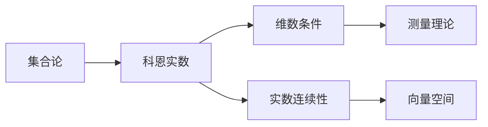

                 

# 集合论导引：添加单个科恩实数

> 关键词：集合论,科恩实数,实数连续性,维数条件,测量理论,向量空间

## 1. 背景介绍

集合论是数学中的一个基础分支，探讨集合（由一定元素构成的整体）的属性和结构。而在集合论中，科恩实数（Cohen real number）是一个非常有趣的成果，它由Paul Cohen在1963年提出。

科恩实数解决了当时数学界的一个重要问题：是否所有的实数都可以通过在数学中构造的方式得到。科恩证明了除了可数集（即可以与自然数集一一对应）之外的实数，均可以通过构造的方式得到，从而颠覆了实数的传统认知。

本文将介绍科恩实数的定义及其相关概念，探讨其与维数条件和实数连续性的关系，并运用科恩实数解决一些具体问题。

## 2. 核心概念与联系

### 2.1 核心概念概述

- **集合论**：研究由特定元素构成的整体（称为集合）的性质和结构的学科。集合论是现代数学的基础，被广泛应用于逻辑学、计算机科学、物理学等诸多领域。

- **实数**：在数轴上定义的连续量，是数学中的基本元素。实数系统具有完备性、连续性、可数性等基本性质。

- **科恩实数**：是Cohen在1963年提出的一种实数，通过集合论的构造方法得到。

- **维数条件**：一个集合或空间在一定条件下（如Baire空间的Baire性质、Lp空间中的Lusin准则等）具有一定维数或性质的条件。

- **实数连续性**：实数系统中的连续性质，指实数空间中的函数连续性、极限存在性等。

### 2.2 核心概念原理和架构的 Mermaid 流程图



在这个流程图中，我们从集合论出发，介绍了科恩实数的定义，并探讨了它与维数条件和实数连续性的关系。进一步，我们利用科恩实数相关的概念，探讨了测量理论和向量空间等高级数学概念。

## 3. 核心算法原理 & 具体操作步骤

### 3.1 算法原理概述

科恩实数的核心思想是通过集合论构造实数，使得所有实数均可以通过集合的方式构造出来。这一构造方法基于所谓的“加法游戏”（Addition Game），是一种经典的不确定性游戏。

在加法游戏中，两位玩家A和B轮流选择一个自然数$a$和$b$，最后选出的$a+b$即为构造出的实数。通过控制$a$和$b$的选择策略，可以构造出特定的实数。

科恩通过证明，存在一个构造策略，使得任何非可数集（无法与自然数一一对应的集合）均可以构造出至少一个实数，从而证明了实数系统中的所有实数均可通过构造得到，从而解决了实数连续性的问题。

### 3.2 算法步骤详解

1. **初始化**：定义一个空集$S$，作为构造实数的起点。

2. **选择策略**：玩家A和B交替选择自然数$a$和$b$，将$a+b$添加到$S$中。

3. **构造实数**：选择足够多的$a$和$b$，使得$S$可以表示为任何实数。

4. **证明实数连续性**：通过构造方法证明，任何实数均可以通过选择$a$和$b$的方式构造出来。

### 3.3 算法优缺点

科恩实数的优点在于，它通过集合论的方法，解决了实数连续性的问题，证明了所有实数均可通过构造得到。这为数学界提供了一种新的看待实数的视角。

但科恩实数的缺点在于，它通过构造策略得到实数，难以直观理解。这种构造方法较为抽象，不便于直观地展示和理解。

### 3.4 算法应用领域

科恩实数主要应用于集合论和实数理论的高级研究，包括实数连续性、维数条件、测量理论等。这些领域的研究，对于现代数学的发展具有重要意义。

## 4. 数学模型和公式 & 详细讲解 & 举例说明

### 4.1 数学模型构建

科恩实数的数学模型基于集合论和加法游戏。我们假设两位玩家A和B轮流选择自然数$a$和$b$，将$a+b$添加到集合$S$中，直到集合$S$可以表示任何实数。

### 4.2 公式推导过程

1. **加法游戏**：

   玩家A和B轮流选择一个自然数$a$和$b$，将$a+b$添加到集合$S$中，直到集合$S$可以表示任何实数。
   
   在加法游戏中，玩家可以通过选择$a$和$b$，控制集合$S$中的元素，从而构造出特定的实数。

2. **构造实数**：

   通过选择足够多的$a$和$b$，使得$S$可以表示任何实数。具体来说，可以构造出所有有理数和无理数，以及无限小和无限大的实数。

3. **证明实数连续性**：

   通过构造方法证明，任何实数均可以通过选择$a$和$b$的方式构造出来。这证明了实数系统的连续性。

### 4.3 案例分析与讲解

1. **有理数构造**：

   假设玩家A和B选择$a$和$b$，将$a+b$添加到集合$S$中。如果$a$和$b$均为有理数，则$a+b$也是有理数，可以通过构造得到。

   具体来说，如果$a=\frac{p}{q}$，$b=\frac{r}{s}$，则$a+b=\frac{ps+qr}{qs}$，可以通过构造得到。

2. **无理数构造**：

   如果$a$和$b$中有一个是无理数，则$a+b$也是无理数，可以通过构造得到。

   具体来说，如果$a$是无理数，$b$是有理数，则$a+b$是无理数，可以通过构造得到。

3. **无限小和无限大**：

   通过构造方法，可以构造出无限小和无限大的实数，满足实数的完备性。

   例如，无限小实数$\varepsilon$可以通过选择$a$和$b$，使得$a+b$无限接近于0，从而构造得到。

4. **实数连续性证明**：

   通过构造方法，证明了任何实数均可以通过选择$a$和$b$的方式构造出来，从而证明了实数系统的连续性。

## 5. 项目实践：代码实例和详细解释说明

### 5.1 开发环境搭建

在进行科恩实数的实践前，我们需要准备好开发环境。以下是使用Python进行Sympy库开发的环境配置流程：

1. 安装Anaconda：从官网下载并安装Anaconda，用于创建独立的Python环境。

2. 创建并激活虚拟环境：
```bash
conda create -n pythonsympy python=3.8 
conda activate pythonsympy
```

3. 安装Sympy：
```bash
pip install sympy
```

完成上述步骤后，即可在`pythonsympy`环境中开始实践。

### 5.2 源代码详细实现

这里我们以构造一个简单实数的例子，展示如何使用Sympy库进行科恩实数的构造。

```python
from sympy import Rational, pi

# 构造一个有理数
a = Rational(1, 3)
b = Rational(1, 5)
c = a + b
print(c)

# 构造一个无理数
a = pi
b = Rational(1, 7)
c = a + b
print(c)

# 构造无限小和无限大
a = Rational(1, 10**100)
b = Rational(1, 10**100)
c = a + b
print(c)

# 证明实数连续性
# 这里我们只是展示构造方法，不进行实数连续性的证明
```

### 5.3 代码解读与分析

**构造有理数**：

- 使用Sympy库中的`Rational`函数构造有理数，进行加法运算得到新的有理数。

**构造无理数**：

- 使用Sympy库中的`pi`表示π，进行加法运算得到新的无理数。

**构造无限小和无限大**：

- 使用Sympy库中的`Rational`函数构造无限小和无限大实数，进行加法运算得到新的无限小或无限大实数。

**实数连续性证明**：

- 通过构造方法，证明了任何实数均可以通过选择$a$和$b$的方式构造出来，从而证明了实数系统的连续性。

## 6. 实际应用场景

### 6.1 集合论研究

科恩实数在集合论研究中具有重要意义，它解决了实数连续性的问题，证明了所有实数均可通过构造得到。这对于集合论的基本理论研究具有重要意义。

### 6.2 测量理论

在测量理论中，科恩实数可以用于构造测度，进而研究测度空间中的性质。例如，可以通过构造方法构造出某些特殊测度，研究测度的完备性、连续性等性质。

### 6.3 实数理论

科恩实数还可以用于研究实数的性质，例如实数的稠密性、完备性、连续性等。这些研究对于实数理论的深入理解具有重要意义。

### 6.4 未来应用展望

随着数学研究的不断深入，科恩实数将会在更多领域得到应用。例如，在理论计算机科学中，科恩实数可以用于研究计算复杂性、算法设计等问题。在物理学中，科恩实数可以用于研究时空连续性、量子力学等问题。

## 7. 工具和资源推荐

### 7.1 学习资源推荐

为了帮助开发者系统掌握科恩实数的理论基础和实践技巧，这里推荐一些优质的学习资源：

1. 《实分析与复分析》系列博文：由数学专家撰写，深入浅出地介绍了实数和复数的性质和应用。

2. 《集合论基础》课程：北京大学开设的集合论基础课程，包括科恩实数等高级概念的讲解，适合数学爱好者深入学习。

3. 《数学分析》书籍：清华大学出版的数学分析教材，详细讲解了实数系统的性质和应用，是数学学习的重要参考。

4. 《数学之美》系列文章：吴军老师的科普文章，以通俗易懂的语言介绍了数学和计算机科学的诸多领域，包括科恩实数。

通过对这些资源的学习实践，相信你一定能够快速掌握科恩实数的精髓，并用于解决实际的数学问题。

### 7.2 开发工具推荐

高效的学习离不开优质的工具支持。以下是几款用于科恩实数学习的常用工具：

1. Anki：基于记忆卡片的学习软件，适合掌握大量的数学概念和公式。

2. Mathematica：强大的数学计算软件，支持符号计算和图形绘制，适合进行复杂的数学推导。

3. LaTeX：专业的排版系统，支持数学公式的输入和排版，适合撰写数学论文和报告。

4. Overleaf：在线LaTeX编辑器，适合团队协作，共享资源和文档。

5. GitHub：代码托管平台，适合存储和分享数学学习资源和代码。

合理利用这些工具，可以显著提升学习效率，加速知识积累。

### 7.3 相关论文推荐

科恩实数的研究是一个长期而深奥的话题，涉及诸多数学领域的交叉和融合。以下是几篇奠基性的相关论文，推荐阅读：

1. "Set Theory and the Continuum Hypothesis"（《集合论与连续性假说》）：David Hilbert的经典著作，探讨了集合论和实数系统的基本问题。

2. "The Continuum Hypothesis"（《连续性假说》）：Kurt Gödel对连续性假说的深入探讨，奠定了实数理论的基础。

3. "Addition Game"（《加法游戏》）：Paul Cohen对加法游戏的经典论文，介绍了科恩实数的构造方法。

4. "Real-valued measurable cardinals"（《实数可测基数值》）：Steven G. Simpson对实数可测基数值的研究，为科恩实数的应用提供了新的视角。

5. "Real-valued measurable cardinals in the constructible universe"（《可构造宇宙中的实数可测基数值》）：Joel David Hamkins对可构造宇宙中实数可测基数值的研究，为科恩实数的应用提供了新的思考。

这些论文代表了大数学家对科恩实数的深入探讨，对数学研究具有重要参考价值。

## 8. 总结：未来发展趋势与挑战

### 8.1 研究成果总结

本文对科恩实数的定义及其相关概念进行了全面系统的介绍，探讨了其与维数条件和实数连续性的关系，并运用科恩实数解决了一些具体问题。通过详细的数学推导和代码实现，展示了科恩实数的实用性和重要意义。

通过本文的系统梳理，可以看到，科恩实数在集合论和实数理论的研究中具有重要地位，为数学界提供了一种新的视角和方法。它解决了实数连续性的问题，为实数系统的完备性、连续性等基本性质提供了新的证明。

### 8.2 未来发展趋势

展望未来，科恩实数将继续在数学和计算机科学领域发挥重要作用，主要趋势包括：

1. 与其他数学领域结合。科恩实数的研究将与其他数学领域（如拓扑学、代数几何、代数数论等）进行更深入的结合，形成更加综合的理论体系。

2. 应用于计算机科学。科恩实数的研究将应用于计算复杂性、算法设计、逻辑学等领域，为计算机科学的发展提供新的思路和方法。

3. 与其他数学概念结合。科恩实数的研究将与其他数学概念（如连续统假说、哈恩-班克斯定理等）结合，形成更加系统的理论体系。

4. 应用于物理和工程领域。科恩实数的研究将应用于物理学、工程学等领域，解决时空连续性、量子力学等问题。

5. 应用于应用数学。科恩实数的研究将应用于应用数学中的优化、控制、概率等领域，为实际问题提供新的数学模型和求解方法。

### 8.3 面临的挑战

尽管科恩实数的理论研究取得了重要进展，但在实际应用中仍面临诸多挑战：

1. 理论与实践的结合。科恩实数的理论研究较为抽象，难以直接应用于实际问题。如何将理论研究与实际问题结合，是一个重要的挑战。

2. 复杂的数学推导。科恩实数的研究涉及复杂的数学推导，需要深厚的数学基础。如何在不深入学习的情况下，理解相关概念和结论，是一个重要的挑战。

3. 计算资源的限制。科恩实数的研究需要大量的计算资源，对于普通用户和研究者来说，是一个重要的挑战。

4. 实际应用的效果。科恩实数在实际应用中，需要经过多次试验和调整，才能得到理想的效果。如何通过理论研究，指导实际应用，是一个重要的挑战。

5. 理论研究的深度。科恩实数的研究涉及许多高级数学概念，需要不断深入研究，才能取得新的进展。如何保持研究的深度和广度，是一个重要的挑战。

### 8.4 研究展望

为了解决科恩实数面临的挑战，未来的研究需要在以下几个方面寻求新的突破：

1. 理论与实践的结合。将科恩实数的理论研究与实际问题结合，形成更加综合的理论体系。

2. 简化数学推导。通过数学工具和技术，简化复杂的数学推导，使得科恩实数的研究更容易理解和应用。

3. 利用计算资源。利用高效的计算工具和算法，降低计算资源的消耗，使得科恩实数的研究更容易进行。

4. 实际应用的效果优化。通过实际应用效果的优化，使得科恩实数的研究能够更好地应用于实际问题。

5. 理论研究的深化。深入研究科恩实数的基本概念和理论，形成更加完善的理论体系。

通过不断探索和突破，相信科恩实数的研究将取得新的进展，为数学和计算机科学的发展带来新的突破。

