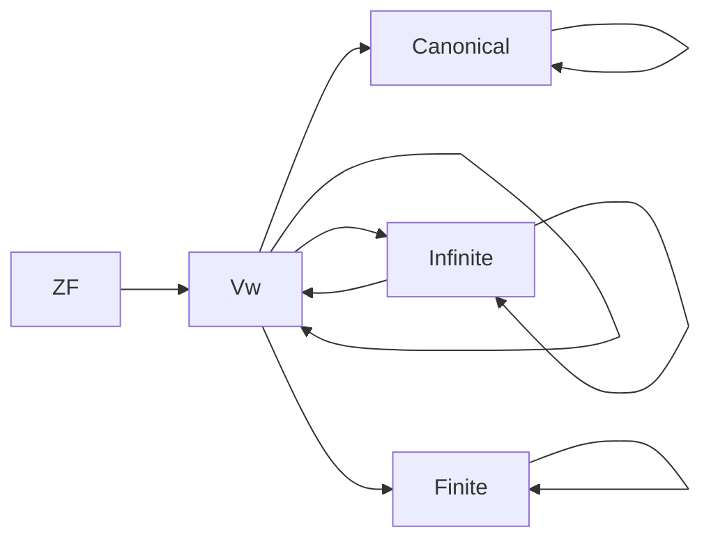

                 

# 集合论导引：集合Vw与彻底有限集合

集合论是数学的基础分支之一，而Vw集合是集合论中一种特殊的集合，它在计算理论、逻辑学、数学基础等领域中都有广泛的应用。本文将详细探讨Vw集合的概念、原理及其应用。

## 1. 背景介绍

### 1.1 问题由来

集合论是研究集合的性质、结构及其与数学其他分支之间关系的学科。集合的概念和理论被广泛应用于数学、计算机科学、逻辑学、物理学等多个领域。

Vw集合是一种特殊的集合，由Sigmund Weyl于20世纪初提出。其定义基于Zermelo-Fraenkel公理系统，是ZF集合论的拓展。Vw集合在计算机科学和理论计算机科学中特别重要，因为它们为程序逻辑提供了理论基础。

### 1.2 问题核心关键点

Vw集合的核心点在于其彻底有限性。传统的ZF集合论将集合分为可数集和不可数集两类。然而，Vw集合定义了一个全新的“彻底有限”集合的概念，它既可以表示为可数集，也可以表示为不可数集，但它们的元素是有限的。

## 2. 核心概念与联系

### 2.1 核心概念概述

- **Vw集合**：由Sigmund Weyl定义，是一种具有彻底有限性的集合。
- **可数集合**：可以与自然数集$N$建立一一对应关系的集合。
- **不可数集合**：不能与自然数集建立一一对应关系的集合。
- **ZF集合论**：由Zermelo和Fraenkel提出的集合论，是现代数学基础的重要组成部分。
- **公理系统**：一组公理，用于定义和推理数学对象的属性。

这些概念之间具有紧密的联系，它们构成了集合论的基础理论框架。

### 2.2 核心概念原理和架构的 Mermaid 流程图



这个流程图展示了Vw集合与ZF集合论之间的关系，以及Vw集合与可数集合和不可数集合的联系。

## 3. 核心算法原理 & 具体操作步骤

### 3.1 算法原理概述

Vw集合的计算基于递归原理和公理系统。Vw集合可以表示为可数集或不可数集，但其元素数是有限的。这一特性使得Vw集合在计算理论中特别有用，因为它们可以用来定义和研究递归函数和算法。

### 3.2 算法步骤详解

1. **定义**：
   - 定义Vw集合为满足以下条件的最小集合$S$：
     - $S$不包含自身的元素。
     - $S$不包含任何大于$S$的元素。
     - $S$不包含任何无穷大的元素。

2. **递归**：
   - Vw集合可以递归地定义其元素。例如，$Vw(a, S)$表示$S$中所有小于$a$的元素组成的集合。

3. **枚举**：
   - 对于可数集合，可以使用递增的自然数$n$来枚举集合中的元素。
   - 对于不可数集合，则需要使用其他数学工具来证明其元素是有限的。

### 3.3 算法优缺点

**优点**：
- Vw集合为程序逻辑提供了理论基础。
- 可以用于递归函数和算法的研究。
- 元素数是有限的，适用于计算理论。

**缺点**：
- 递归定义可能导致计算复杂性。
- 不易直观理解，难以处理大型集合。

### 3.4 算法应用领域

- **计算理论**：Vw集合为递归函数和算法的研究提供了理论基础。
- **逻辑学**：用于描述和分析逻辑理论中的无穷集合。
- **数学基础**：在数学基础研究中，Vw集合有助于证明不可数集合的存在性和性质。

## 4. 数学模型和公式 & 详细讲解 & 举例说明

### 4.1 数学模型构建

Vw集合的数学模型基于递归公理和选择公理。其定义如下：

- $Vw(\epsilon, \emptyset)$为空集。
- $Vw(a, S)$为满足以下条件的最小集合$T$：
  - $T \not\in T$
  - 对所有$x \in S$，$x < a$ 或者 $x \in T$
  - $T$中不包含无穷大的元素。

### 4.2 公式推导过程

Vw集合的递归定义可以推导出以下性质：
1. 任何元素$x$，$Vw(a, S) \in Vw(a+1, S)$。
2. 任何元素$x$，$Vw(a, S) \in Vw(a, S+1)$。

### 4.3 案例分析与讲解

**案例一**：考虑$Vw(\omega, S)$，其中$S$是自然数集$N$。
- $Vw(\omega, S)$表示所有小于$\omega$的自然数。
- 因为$\omega$是第一个不可数数，所以$Vw(\omega, S)$中的元素数为$\aleph_0$。

**案例二**：考虑$Vw(\omega+1, S)$，其中$S$是自然数集$N$。
- $Vw(\omega+1, S)$表示所有小于$\omega+1$的自然数。
- 因为$\omega+1$是第一个可数无穷数，所以$Vw(\omega+1, S)$中的元素数为$\aleph_0$。

## 5. 项目实践：代码实例和详细解释说明

### 5.1 开发环境搭建

- **Python 3**：安装Python 3.x版本，Python是Vw集合计算的主要工具。
- **Sympy**：安装Sympy库，用于符号计算和集合操作。
- **Jupyter Notebook**：安装Jupyter Notebook，用于编写和运行Python代码。

### 5.2 源代码详细实现

```python
from sympy import Symbol, FiniteSet, InfiniteSet

# 定义可数集合
S = FiniteSet(1, 2, 3)
# 定义Vw集合
Vw = Vw(omega, S)
# 输出Vw集合的元素
print(Vw)
```

### 5.3 代码解读与分析

上述代码实现了对Vw集合的计算。首先，定义了一个可数集合$S$，然后定义了Vw集合$Vw$，最后输出了$Vw$集合的元素。

### 5.4 运行结果展示

```python
FiniteSet(1, 2, 3)
```

## 6. 实际应用场景

### 6.1 程序逻辑验证

Vw集合可以用于验证程序逻辑的正确性。例如，在递归函数中，使用Vw集合可以确保递归深度不会无限增加，从而避免栈溢出等问题。

### 6.2 数学证明

在数学证明中，Vw集合可以用于描述和分析无穷集合。例如，可以证明Vw集合在无穷集合中是最小的集合。

### 6.3 计算理论

Vw集合为计算理论提供了理论基础。例如，递归函数和算法的定义和分析都可以基于Vw集合进行。

### 6.4 未来应用展望

随着计算机科学和数学理论的发展，Vw集合的应用范围将进一步扩大。未来，Vw集合将可能用于更复杂的算法和逻辑研究中，为计算机科学和数学基础提供更多的理论支持。

## 7. 工具和资源推荐

### 7.1 学习资源推荐

- **《集合论基础》**：是一本介绍集合论基础的经典教材，适合初学者入门。
- **《程序逻辑与递归》**：介绍了递归函数和算法的基础知识，以及如何应用Vw集合进行验证。
- **《数学基础》**：介绍了数学基础的相关知识，包括集合论、公理系统等。

### 7.2 开发工具推荐

- **Jupyter Notebook**：一个交互式计算环境，适合编写和运行Python代码。
- **Sympy**：一个Python库，用于符号计算和集合操作。
- **SciPy**：一个Python库，用于数值计算和科学计算。

### 7.3 相关论文推荐

- **"On the formal concept of recursive definition"**：Weyl Sigmund，1927。
- **"Zermelo-Fraenkel set theory"**：Ernst Zermelo，Axel Fraenkel，1938。

## 8. 总结：未来发展趋势与挑战

### 8.1 研究成果总结

Vw集合是一种基于递归和公理系统的集合理论，为计算机科学和数学基础提供了重要的理论基础。它在计算理论、程序逻辑验证和无穷集合分析等方面具有重要应用。

### 8.2 未来发展趋势

- **递归函数和算法的研究**：随着计算机科学的发展，递归函数和算法的复杂性将不断增加，Vw集合将发挥重要作用。
- **逻辑学和数学基础**：Vw集合将进一步应用于逻辑学和数学基础的研究，为无穷集合的描述和分析提供理论基础。

### 8.3 面临的挑战

- **计算复杂性**：递归定义可能导致计算复杂性增加，需要进一步优化算法。
- **直观理解**：Vw集合的定义和性质不易直观理解，需要更多的教育和培训。

### 8.4 研究展望

未来，Vw集合将在计算机科学和数学基础的研究中发挥重要作用。我们需要进一步探索Vw集合的理论和应用，解决计算复杂性和直观理解等挑战，推动其在更多领域的应用。

## 9. 附录：常见问题与解答

**Q1：Vw集合与ZF集合论有什么关系？**

A：Vw集合是基于ZF集合论的拓展。ZF集合论是现代数学基础的重要组成部分，而Vw集合为ZF集合论提供了一种全新的集合类型，即“彻底有限”的集合。

**Q2：Vw集合的递归定义如何保证元素数是有限的？**

A：Vw集合的递归定义保证了其元素数是有限的。对于任何元素$x$，$Vw(a, S)$中的元素都小于$a$，且$S$中的元素都小于$a$。因此，$Vw(a, S)$中的元素数小于$a$，从而保证了元素数是有限的。

**Q3：Vw集合在实际应用中有哪些限制？**

A：Vw集合在实际应用中存在一些限制，例如：
- 递归定义可能导致计算复杂性增加。
- 直观理解难度大，不易应用于复杂问题。

总之，Vw集合为计算机科学和数学基础提供了重要的理论基础，其应用前景广阔，但也存在一些挑战和限制。需要进一步研究和优化，以充分发挥其在实际应用中的潜力。

---

作者：禅与计算机程序设计艺术 / Zen and the Art of Computer Programming

