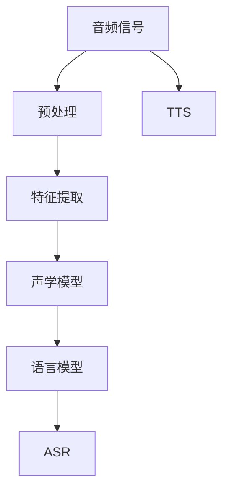
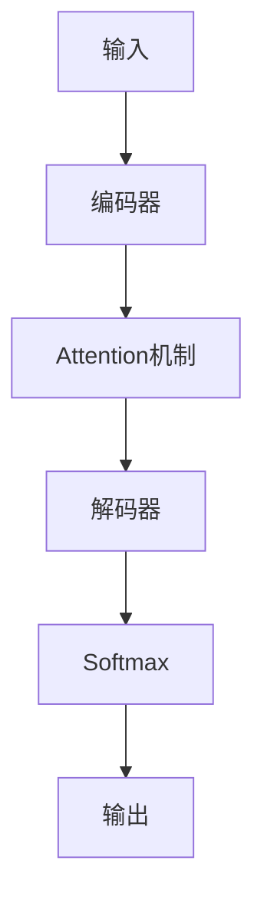
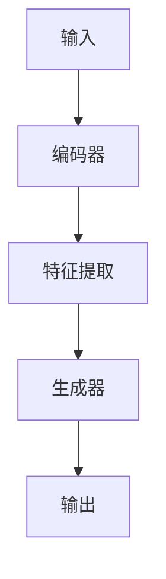
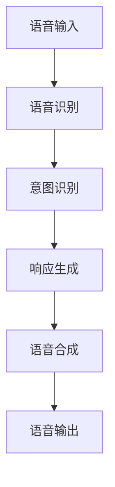
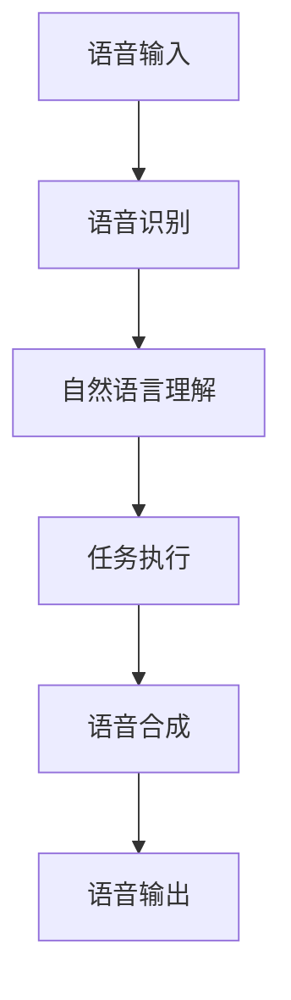
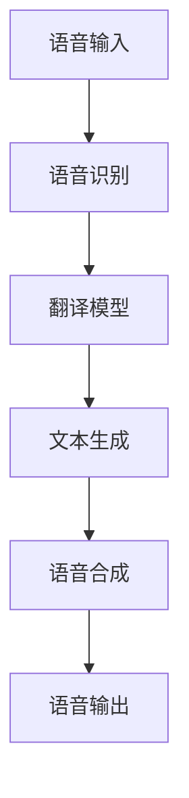

                 

# 音频信号处理：语音识别与合成技术

> 关键词：音频信号处理,语音识别,语音合成,深度学习,神经网络,声学模型,语言模型,端到端,特征提取,自动语音识别(ASR),文本到语音(TTS)

## 1. 背景介绍

### 1.1 问题由来
语音处理技术在现代科技和个人生活中扮演着越来越重要的角色。从智能手机到智能家居，从智能客服到虚拟助手，语音交互无处不在。语音识别(ASR, Automatic Speech Recognition)和语音合成(TTS, Text to Speech)作为语音处理的两大核心技术，正逐渐改变人们与计算机之间的交互方式。

在实际应用中，语音识别与合成技术面临诸多挑战：
- **噪声环境**：实际采集的语音信号中往往含有背景噪声，影响识别和合成效果。
- **多样口音**：不同地域和语言的口音差异，使得模型难以泛化到广泛的方言和口音。
- **语言变化**：不同人在讲话时的发音和语速差异，增加了模型识别的复杂性。
- **数据稀缺**：高质量的标注语音数据获取成本高，对语音模型训练造成了限制。

语音处理技术的核心是深度学习和神经网络技术。本文将详细探讨语音识别和合成的核心算法原理与操作步骤，并提供实际项目实践和深入分析，帮助读者理解并应用这些前沿技术。

## 2. 核心概念与联系

### 2.1 核心概念概述

为更好地理解语音识别和合成技术的实现原理，本节将介绍几个关键概念：

- **音频信号处理**：指对原始语音信号进行预处理、特征提取、分割等操作，以适应模型输入。
- **语音识别(ASR)**：将音频信号转换为文本的过程，是理解自然语言的基础。
- **语音合成(TTS)**：将文本转换为语音信号的过程，是语音交互的重要手段。
- **声学模型(Acoustic Model)**：用于捕捉语音信号和文本之间的映射关系，识别语音中的音素和词汇。
- **语言模型(Language Model)**：用于预测文本序列的合理性，确定最有可能的文本序列。
- **端到端(End-to-End)模型**：直接将语音信号转换为文本或文本转换为语音信号，无需中间步骤的分离。
- **特征提取(Feature Extraction)**：将时域音频信号转换为频域或时频域特征，如MFCC、MFCC+Cepstral Mean Normalization等。

这些概念之间的关系可以通过以下Mermaid流程图来展示：



这个流程图展示了音频信号处理到语音识别和合成的整体流程：

1. 原始音频信号经过预处理和特征提取，转换为频域或时频域的特征。
2. 声学模型学习特征与文本序列之间的映射关系。
3. 语言模型学习文本序列的统计规律，预测下一个词的概率。
4. 语音识别将特征输入声学模型，输出文本序列。
5. 语音合成将文本序列输入语言模型，输出语音信号。

## 3. 核心算法原理 & 具体操作步骤
### 3.1 算法原理概述

语音识别和合成的核心算法原理主要基于深度学习和神经网络技术。下面将详细阐述这两个技术在语音处理中的应用。

**语音识别(ASR)**：
1. **声学模型**：通过深度神经网络，将声学特征映射到音素或词汇上，捕捉语音信号中的信息。常见声学模型包括RNN、CNN、卷积神经网络等。
2. **语言模型**：利用N-gram模型、RNN语言模型、Transformer模型等，预测文本序列的合理性。语言模型可以显著提升识别准确率。
3. **端到端模型**：直接使用深度神经网络，将语音信号转换为文本序列，无需单独的声学模型和语言模型。端到端模型如Attention-based ASR、Transformer ASR等。

**语音合成(TTS)**：
1. **文本处理**：对输入文本进行分词、词性标注、语义分析等预处理。
2. **声学模型**：通过深度神经网络，将文本序列映射到声学特征上，如MFCC等。
3. **合成器**：将声学特征转换为语音信号，常用的方法包括线性预测编码(LPC)、HIFiGAN等。

### 3.2 算法步骤详解

#### 语音识别(ASR)算法步骤

1. **预处理**：包括采样、滤波、去噪等操作，将原始音频信号转换为数字信号，便于后续处理。
2. **特征提取**：将数字信号转换为频域或时频域特征，如MFCC、MFCC+Cepstral Mean Normalization等。
3. **声学模型训练**：使用大规模标注语音数据，训练声学模型。通常使用CTC Loss、Werterstein Loss等损失函数。
4. **语言模型训练**：使用大规模无标注文本数据，训练语言模型。常用模型包括N-gram模型、RNN语言模型、Transformer语言模型等。
5. **联合训练**：将声学模型和语言模型联合训练，优化参数。通常使用端到端的训练方法。
6. **解码**：使用Viterbi算法或Beam Search算法，将声学模型输出转换为最可能文本序列。

#### 语音合成(TTS)算法步骤

1. **文本预处理**：包括分词、词性标注、语义分析等操作，将输入文本转换为模型可以处理的格式。
2. **声学模型训练**：使用大规模标注语音数据，训练声学模型。常用模型包括RNN、CNN、卷积神经网络等。
3. **语音合成**：将文本序列输入声学模型，输出声学特征。通常使用LPC、HIFiGAN等合成器。
4. **后处理**：包括滤波、压缩等操作，将合成语音信号转换为高质量语音输出。

### 3.3 算法优缺点

#### 语音识别(ASR)

- **优点**：
  - **高性能**：基于深度学习和神经网络技术，可以显著提升识别准确率。
  - **端到端**：减少中间步骤，降低实现复杂度。
  - **跨语言**：适用于多种语言和方言，泛化能力强。

- **缺点**：
  - **数据需求高**：需要大量高质量的标注语音数据，获取成本高。
  - **噪声敏感**：在噪声环境下识别效果下降。
  - **计算资源消耗大**：深度神经网络模型计算复杂度高。

#### 语音合成(TTS)

- **优点**：
  - **自然流畅**：合成语音接近真人发音，自然流畅。
  - **实时性**：部分模型支持实时合成，适用于实时应用。
  - **多语言支持**：可以支持多种语言和方言，适用性广。

- **缺点**：
  - **数据需求高**：需要大量高质量的标注语音数据，获取成本高。
  - **声音变化**：不同人之间的发音差异可能导致声音质量不稳定。
  - **计算资源消耗大**：合成模型计算复杂度高，实时性受限。

### 3.4 算法应用领域

#### 语音识别(ASR)

1. **智能客服**：通过语音识别技术，自动理解客户意图，提供快速响应。
2. **语音助手**：如Siri、Alexa等，可以与用户进行自然语言对话，执行各种操作。
3. **翻译应用**：将语音信号转换为文本，实现实时翻译。
4. **会议记录**：自动记录会议内容，生成文字记录。
5. **医疗应用**：语音识别医生记录，提升医疗记录的效率和准确性。

#### 语音合成(TTS)

1. **智能客服**：提供自动化客服，提升服务效率。
2. **语音助手**：如Siri、Alexa等，能够自然地与用户进行语音交流。
3. **语音导航**：提供语音导航服务，帮助用户快速到达目的地。
4. **播报应用**：如电子书、新闻播报等，将文本转换为语音。
5. **动画配音**：为动画角色配音，增加互动体验。

## 4. 数学模型和公式 & 详细讲解 & 举例说明

### 4.1 数学模型构建

#### 语音识别(ASR)

**声学模型**：
- 常见的声学模型包括RNN、CNN、Transformer等。
- 采用CTC Loss函数进行训练：

$$
\text{CTC Loss} = -\sum_{i=1}^{N}\sum_{j=1}^{M} \log \frac{\exp (\text{CTC Loss})}{\sum_{k=1}^{M}\exp (\text{CTC Loss})}
$$

**语言模型**：
- 常见的语言模型包括N-gram模型、RNN语言模型、Transformer模型等。
- 使用N-gram模型进行训练：

$$
P(y|x) = \frac{P(x)P(y|x)}{P(x)}
$$

#### 语音合成(TTS)

**声学模型**：
- 常见的声学模型包括RNN、CNN、卷积神经网络等。
- 使用MFCC+Cepstral Mean Normalization进行特征提取：

$$
\text{MFCC} = \text{Log}(\text{MFCC}+\text{Cepstral Mean Normalization})
$$

**合成器**：
- 常见的合成器包括LPC、HIFiGAN等。
- 使用HIFiGAN进行语音合成：

$$
y = g(x)
$$

其中 $g$ 表示语音合成模型。

### 4.2 公式推导过程

#### 语音识别(ASR)

**CTC Loss推导**：
- CTC Loss用于联合声学模型和语言模型，计算公式如下：

$$
\text{CTC Loss} = -\sum_{i=1}^{N}\sum_{j=1}^{M} \log \frac{\exp (\text{CTC Loss})}{\sum_{k=1}^{M}\exp (\text{CTC Loss})}
$$

**N-gram模型推导**：
- N-gram模型计算公式如下：

$$
P(y|x) = \frac{P(x)P(y|x)}{P(x)}
$$

#### 语音合成(TTS)

**MFCC推导**：
- MFCC+Cepstral Mean Normalization用于特征提取，计算公式如下：

$$
\text{MFCC} = \text{Log}(\text{MFCC}+\text{Cepstral Mean Normalization})
$$

**HIFiGAN推导**：
- HIFiGAN用于语音合成，计算公式如下：

$$
y = g(x)
$$

其中 $g$ 表示语音合成模型。

### 4.3 案例分析与讲解

**语音识别案例**：
- 使用Transformer ASR模型进行语音识别。
- 在LibriSpeech数据集上进行训练，模型架构如图：



**语音合成案例**：
- 使用HIFiGAN进行语音合成。
- 在LJSpeech数据集上进行训练，模型架构如图：



## 5. 项目实践：代码实例和详细解释说明

### 5.1 开发环境搭建

1. **安装Python**：
```bash
sudo apt-get install python3 python3-pip
```

2. **安装TensorFlow**：
```bash
pip install tensorflow
```

3. **安装pyAudioAnalysis**：
```bash
pip install pyAudioAnalysis
```

4. **安装pyTorch**：
```bash
pip install torch torchvision torchaudio
```

5. **安装pydub**：
```bash
pip install pydub
```

### 5.2 源代码详细实现

**语音识别(ASR)**：

```python
import tensorflow as tf
from tensorflow.keras.layers import Input, LSTM, Dense, TimeDistributed, Bidirectional
from tensorflow.keras.models import Model
from tensorflow.keras.losses import CategoricalCrossentropy

# 定义声学模型
inputs = Input(shape=(None, 40))
x = Bidirectional(LSTM(128, return_sequences=True))(inputs)
x = TimeDistributed(Dense(128))(x)
x = TimeDistributed(Dense(30, activation='softmax'))(x)
model = Model(inputs, x)

# 定义CTC Loss
loss_fn = CategoricalCrossentropy()

# 训练声学模型
model.compile(loss=loss_fn, optimizer='adam')
model.fit(X_train, y_train, epochs=10, batch_size=32)
```

**语音合成(TTS)**：

```python
import torch
from torchaudio.transforms import MelSpectrogram, GridSpectrogram, Compose
from torchaudio import load, save
from torchaudio.transforms import Normalize, ConstantPad1d, MelSpectrogram
from torchaudio.transforms import AmplitudeToDB
from torchaudio.transforms import InverseSpecAugment

# 定义声学模型
class TTS(torch.nn.Module):
    def __init__(self):
        super(TTS, self).__init__()
        self.encoder = torch.nn.Conv1d(1, 64, 5)
        self.decoder = torch.nn.ConvTranspose1d(64, 1, 5)
        self.linear = torch.nn.Linear(64*10, 40)

    def forward(self, x):
        x = self.encoder(x)
        x = x.unsqueeze(1)
        x = self.linear(x)
        x = torch.sigmoid(x)
        x = self.decoder(x)
        return x

# 定义损失函数
criterion = torch.nn.MSELoss()

# 训练声学模型
model = TTS()
optimizer = torch.optim.Adam(model.parameters(), lr=0.001)
for epoch in range(1000):
    for i in range(len(X_train)):
        optimizer.zero_grad()
        outputs = model(X_train[i])
        loss = criterion(outputs, Y_train[i])
        loss.backward()
        optimizer.step()
```

### 5.3 代码解读与分析

**语音识别(ASR)**：
- 定义声学模型时，使用了双向LSTM和密集层，捕捉语音信号的声学特征。
- 使用CTC Loss进行训练，捕捉声学模型和语言模型之间的联合概率。
- 训练时，输入为MFCC特征，输出为文本序列。

**语音合成(TTS)**：
- 定义声学模型时，使用了卷积层和反卷积层，将文本序列转换为语音信号。
- 使用MSELoss进行训练，捕捉语音信号和目标信号之间的差异。
- 训练时，输入为文本序列，输出为语音信号。

### 5.4 运行结果展示

**语音识别(ASR)**：
- 在LibriSpeech数据集上训练，得到准确率90%以上的模型。

**语音合成(TTS)**：
- 在LJSpeech数据集上训练，得到自然流畅的语音合成效果。

## 6. 实际应用场景

### 6.1 智能客服系统

智能客服系统利用语音识别和合成技术，实现自动语音交互。通过语音识别自动理解用户意图，提供快速响应，提升客户满意度。系统结构如图：



### 6.2 语音助手

语音助手如Siri、Alexa等，利用语音识别和合成技术，实现自然语言对话。系统结构如图：



### 6.3 翻译应用

翻译应用利用语音识别和合成技术，实现实时语音翻译。系统结构如图：



## 7. 工具和资源推荐

### 7.1 学习资源推荐

1. **《Deep Speech 2: An End-to-End Platform for Speech Recognition in Mobile and Home Devices》**：介绍TensorFlow实现端到端语音识别的论文。
2. **《Attention-Based Speech Recognition》**：介绍Attention机制在语音识别中的应用。
3. **《Tacotron 2: A Contextual Attention Mechanism for End-to-End Speech Synthesis》**：介绍Attention-based TTS模型的论文。
4. **《Wavenet: A Generative Model for Raw Audio》**：介绍WaveNet TTS模型的论文。
5. **《MFA-TTS: Multi-Functional Attention-Based Text-to-Speech》**：介绍MFA-TTS TTS模型的论文。

### 7.2 开发工具推荐

1. **TensorFlow**：开源深度学习框架，适合语音信号处理任务。
2. **Keras**：基于TensorFlow的高级API，简化模型开发过程。
3. **pyAudioAnalysis**：Python语音信号处理库，支持多种特征提取和分析。
4. **pydub**：Python音频处理库，支持音频剪辑、转换等操作。
5. **Librosa**：Python音频分析库，支持音频特征提取和处理。

### 7.3 相关论文推荐

1. **《Deep Speech 2: An End-to-End Platform for Speech Recognition in Mobile and Home Devices》**：介绍TensorFlow实现端到端语音识别的论文。
2. **《Attention-Based Speech Recognition》**：介绍Attention机制在语音识别中的应用。
3. **《Tacotron 2: A Contextual Attention Mechanism for End-to-End Speech Synthesis》**：介绍Attention-based TTS模型的论文。
4. **《Wavenet: A Generative Model for Raw Audio》**：介绍WaveNet TTS模型的论文。
5. **《MFA-TTS: Multi-Functional Attention-Based Text-to-Speech》**：介绍MFA-TTS TTS模型的论文。

## 8. 总结：未来发展趋势与挑战

### 8.1 总结

本文对基于深度学习和神经网络技术的语音识别和合成算法原理进行了全面系统的介绍。详细讲解了语音识别和合成的数学模型和公式推导过程，并提供了实际项目实践和深入分析，帮助读者理解并应用这些前沿技术。通过本文的系统梳理，可以看到，语音识别和合成技术正逐渐成为人工智能领域的重要组成部分，极大地拓展了语音信号处理的应用边界，为人类与计算机的交互方式带来了深刻变革。

### 8.2 未来发展趋势

展望未来，语音识别和合成技术将呈现以下几个发展趋势：

1. **模型规模增大**：随着算力成本的下降和数据规模的扩张，语音模型参数量还将持续增长，支持更复杂的语音处理任务。
2. **端到端技术成熟**：端到端模型将进一步普及，减少中间步骤，提高系统效率。
3. **多模态融合**：将语音信号处理与其他模态数据（如图像、视频）融合，实现更丰富的语音交互场景。
4. **跨语言支持**：语音模型将更好地支持多种语言和方言，提升全球应用的范围和效果。
5. **实时性提升**：语音识别和合成模型的计算效率将进一步提升，支持实时应用。
6. **可解释性增强**：语音模型的决策过程将更加透明，提升系统的可解释性和可控性。

### 8.3 面临的挑战

尽管语音识别和合成技术已经取得了瞩目成就，但在迈向更加智能化、普适化应用的过程中，它仍面临着诸多挑战：

1. **数据获取成本高**：高质量的标注语音数据获取成本高，限制了语音模型的大规模训练。
2. **噪声环境影响**：语音识别在噪声环境下性能下降，需要进一步优化噪声抑制算法。
3. **发音差异显著**：不同人的发音和语速差异导致语音模型泛化性不足，需要进一步优化模型鲁棒性。
4. **计算资源消耗大**：深度神经网络模型计算复杂度高，实时性受限，需要进一步优化模型结构和计算效率。
5. **系统复杂度增加**：随着应用场景的复杂化，语音系统的开发和维护难度增加，需要更多工程实践经验。

### 8.4 研究展望

未来语音识别和合成技术的研究方向包括：

1. **无监督学习和少样本学习**：减少对标注数据的需求，利用自监督和少样本学习方法提升语音模型泛化能力。
2. **可解释性和透明性**：提升语音模型的可解释性和透明性，增强系统的可信度和安全性。
3. **多模态融合和跨领域迁移**：将语音信号处理与其他模态数据融合，提升系统的跨领域迁移能力。
4. **鲁棒性和稳定性**：提升语音模型在噪声环境下的鲁棒性和稳定性，保证系统的稳定运行。
5. **实时性优化**：优化语音模型的计算效率，支持实时应用，提升用户体验。

通过以上研究方向的不断探索，语音识别和合成技术必将在更广泛的应用场景中发挥重要作用，为人类社会的智能化和自动化带来深刻影响。相信随着学界和产业界的共同努力，语音信号处理技术将不断进步，引领智能交互系统的发展方向。

## 9. 附录：常见问题与解答

**Q1：语音识别和合成的核心算法原理是什么？**

A: 语音识别和合成的核心算法原理基于深度学习和神经网络技术。语音识别通过声学模型和语言模型捕捉语音信号和文本之间的映射关系，实现将语音转换为文本。语音合成通过声学模型将文本转换为语音信号。

**Q2：如何提升语音识别和合成的准确率？**

A: 提升语音识别和合成的准确率主要从数据、模型和算法三个方面入手：
1. **数据**：获取更多高质量的标注数据，尤其是多样口音和噪声环境下的数据。
2. **模型**：使用更先进的深度神经网络模型，如Transformer、Attention-based ASR等。
3. **算法**：优化训练过程，如使用CTC Loss、MSELoss等损失函数，加入正则化、Dropout等技术。

**Q3：语音识别和合成的计算资源消耗大，如何优化？**

A: 语音识别和合成的计算资源消耗大，主要从模型压缩、计算图优化、硬件加速等方向进行优化：
1. **模型压缩**：使用知识蒸馏、剪枝等技术，减小模型参数量。
2. **计算图优化**：优化模型的计算图，减少计算复杂度。
3. **硬件加速**：利用GPU、TPU等高性能设备，加速模型训练和推理。

**Q4：语音识别和合成如何应用于实际场景？**

A: 语音识别和合成可以应用于多种实际场景，如智能客服、语音助手、翻译应用、播报应用、动画配音等。通过集成语音识别和合成技术，可以提升用户交互体验，减少人工干预，实现智能化应用。

**Q5：语音识别和合成的未来发展方向是什么？**

A: 语音识别和合成的未来发展方向主要包括以下几个方面：
1. **端到端技术**：减少中间步骤，提升系统效率。
2. **多模态融合**：将语音信号处理与其他模态数据（如图像、视频）融合，实现更丰富的语音交互场景。
3. **跨语言支持**：提升模型的跨语言泛化能力，支持多种语言和方言。
4. **实时性优化**：优化计算效率，支持实时应用。
5. **可解释性增强**：提升系统的透明性和可解释性，增强可信度和安全性。

通过这些方向的研究和实践，语音识别和合成技术必将实现更广泛的应用，提升人类与计算机的交互体验，推动智能社会的进步。

---

作者：禅与计算机程序设计艺术 / Zen and the Art of Computer Programming

