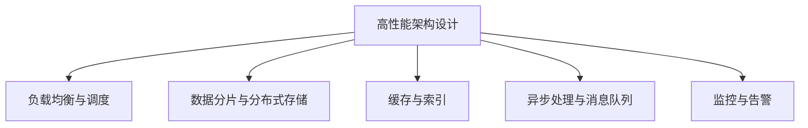

                 

# 高吞吐量系统的设计策略

在高并发、大流量场景下，如何设计出高效、稳定、可扩展的系统，确保应用能够应对海量请求并快速响应，是现代软件开发的一项核心挑战。本文将深入探讨高吞吐量系统的设计策略，涵盖架构设计、性能优化、系统监控等多个关键维度，旨在帮助开发者构建出可靠、高效的系统。

## 1. 背景介绍

### 1.1 问题由来
随着互联网的普及和移动互联网的兴起，在线服务和应用的用户访问量持续增长，对系统的高吞吐量处理能力提出了更高的要求。常见的高吞吐量场景包括：

- 电商平台的交易系统，需要支撑大量用户的同时下单，保障订单处理的正确性和及时性。
- 社交媒体的即时通讯系统，需要处理大量的用户实时消息，实现即时的消息推送和显示。
- 视频流平台的直播服务，需要处理海量的并发请求，保障视频的实时流传输和播放。
- 大型在线游戏的服务器，需要支持玩家的高频交互操作，维持游戏的高并发和低延迟。

面对这些高吞吐量场景，传统的设计和开发方法往往难以应对，需要引入新的设计策略和技术手段，构建高可用、高可靠的系统。

### 1.2 问题核心关键点
高吞吐量系统设计的核心关键点包括：

- 高并发处理能力：保证系统能够高效处理大量并发请求，降低响应时间。
- 高可用性保证：保证系统在单点故障或部分组件故障时，依然能够正常服务，提供稳定服务。
- 可扩展性支持：保证系统能够随着用户量的增长，快速扩展资源和容量，避免瓶颈和性能下降。
- 低延迟要求：对于实时性要求高的应用，需要在高吞吐量的同时，保证低延迟。

## 2. 核心概念与联系

### 2.1 核心概念概述

为更好地理解高吞吐量系统的设计策略，本节将介绍几个密切相关的核心概念：

- 高性能架构设计：指通过合理地划分服务、优化数据流动、提高系统效率等手段，构建高性能的系统架构。
- 负载均衡与调度：通过将请求分发至多台服务器，实现系统的负载均衡，提高系统的吞吐量和响应速度。
- 数据分片与分布式存储：通过将数据分散存储于多台服务器上，实现数据的可靠性和高并发访问。
- 缓存与索引：通过引入缓存机制和索引技术，减少数据库的读写压力，提高系统性能。
- 异步处理与消息队列：通过异步处理和消息队列，优化请求处理流程，实现高并发和低延迟。
- 监控与告警：通过实时监控系统性能指标，及时发现并处理异常，保障系统稳定运行。

这些核心概念之间的逻辑关系可以通过以下Mermaid流程图来展示：



这个流程图展示了几大核心概念之间的联系：

1. 高性能架构设计是整个系统设计的基础，旨在通过合理的服务划分和数据结构设计，保证系统的效率和性能。
2. 负载均衡与调度是保证高并发请求高效处理的工具，通过将请求分发到多台服务器上，均衡系统负载。
3. 数据分片与分布式存储是实现数据可靠性和高并发访问的手段，通过将数据分散存储于多台服务器上，提升系统的稳定性和可扩展性。
4. 缓存与索引是优化系统性能的重要手段，通过缓存和索引技术，减少数据库读写压力，提升系统响应速度。
5. 异步处理与消息队列是实现高并发和低延迟的关键技术，通过异步处理和消息队列，优化请求处理流程，提升系统处理能力。
6. 监控与告警是保障系统稳定运行的重要手段，通过实时监控系统性能指标，及时发现并处理异常，确保系统正常服务。

## 3. 核心算法原理 & 具体操作步骤
### 3.1 算法原理概述

高吞吐量系统的设计策略，本质上是一个多维度的综合优化过程。其核心思想是：通过合理地进行服务划分、数据分布、缓存优化、异步处理等手段，构建高性能的系统架构，确保系统能够高效处理大量并发请求，同时提供高可用、高可靠的服务。

### 3.2 算法步骤详解

高吞吐量系统的设计步骤如下：

**Step 1: 服务划分与模块设计**
- 对系统进行合理的模块划分，将不同的功能模块和服务单元分别独立部署。
- 将系统分为负载均衡层、业务处理层、数据存储层等几个主要部分，各层独立设计，提高系统可维护性和可扩展性。

**Step 2: 负载均衡与请求调度**
- 使用负载均衡器，将请求分发到多台服务器上，避免单点故障。
- 设计合适的调度算法，根据服务器的负载情况，动态调整请求的分配策略，保证系统的高效运行。

**Step 3: 数据分片与分布式存储**
- 对数据进行分片，将数据分散存储于多台服务器上，避免数据集中存储造成的瓶颈。
- 使用分布式存储系统，如Hadoop、Ceph等，实现数据的可靠性和高并发访问。

**Step 4: 引入缓存与索引**
- 使用缓存系统，如Redis、Memcached等，缓存高频访问的数据，减少数据库的读写压力。
- 对数据库进行索引优化，提升查询效率，减少数据读写次数。

**Step 5: 异步处理与消息队列**
- 对耗时的操作采用异步处理方式，如消息队列、事件驱动等，减少请求的等待时间。
- 引入消息队列系统，如RabbitMQ、Kafka等，实现消息的异步处理和可靠传递。

**Step 6: 实时监控与告警**
- 使用监控工具，如Nagios、Prometheus等，实时监控系统性能指标，及时发现异常。
- 设置告警阈值，一旦监控指标超过预设值，自动触发告警，确保系统稳定运行。

### 3.3 算法优缺点

高吞吐量系统的设计策略具有以下优点：
1. 高并发处理能力：通过合理的架构设计和服务划分，保证系统能够高效处理大量并发请求，降低响应时间。
2. 高可用性保证：通过负载均衡和分布式存储，确保系统在单点故障或部分组件故障时，依然能够正常服务，提供稳定服务。
3. 可扩展性支持：通过数据分片与分布式存储，保证系统能够随着用户量的增长，快速扩展资源和容量，避免瓶颈和性能下降。
4. 低延迟要求：通过异步处理和消息队列，优化请求处理流程，实现高并发和低延迟。

同时，该方法也存在一定的局限性：
1. 设计复杂度较高：设计高吞吐量系统需要综合考虑多个维度，设计复杂度较高。
2. 系统维护难度大：系统分层设计后，维护难度增加，需要专业的运维团队支持。
3. 成本较高：引入负载均衡、分布式存储、缓存等硬件和软件资源，需要较高的成本投入。
4. 性能调优困难：系统设计完成后，需要不断优化和调整，才能达到理想的性能。

尽管存在这些局限性，但高吞吐量系统设计仍然是目前处理大规模并发请求的最有效方法。通过合理的架构设计和技术手段，可以显著提升系统的性能和稳定性，保障业务的高效运行。

### 3.4 算法应用领域

高吞吐量系统设计已经在诸多领域得到应用，包括但不限于：

- 电商平台：需要支撑大流量和高并发交易，保证订单处理和支付的稳定性和及时性。
- 金融系统：需要处理高频交易和实时资金结算，确保金融交易的可靠性和安全性。
- 视频流平台：需要支持大规模并发用户的同时在线观看，保障视频流的流畅和稳定性。
- 在线游戏：需要支撑高频操作和实时数据同步，保持游戏的流畅和低延迟。

这些领域对系统的高吞吐量处理能力有着极高的要求，通过合理的高吞吐量系统设计，可以有效应对海量请求和复杂场景，保障业务的高效运行。

## 4. 数学模型和公式 & 详细讲解 & 举例说明

### 4.1 数学模型构建

在讨论高吞吐量系统的设计策略时，可以构建一个简单的数学模型来量化系统的吞吐量和响应时间。设系统每秒处理的请求数量为 $T$，处理每个请求所需的时间为 $t$，则系统的吞吐量 $S$ 和响应时间 $R$ 可以表示为：

$$
S = \frac{T}{t}
$$

$$
R = \frac{1}{S}
$$

在高吞吐量系统中，系统每秒处理的请求数量 $T$ 取决于负载均衡器的性能、服务器处理能力和请求调度策略。处理每个请求所需的时间 $t$ 则取决于系统的架构设计、缓存和索引优化、异步处理和消息队列等技术手段。

### 4.2 公式推导过程

以电商平台为例，假设系统每秒需要处理 $T=10000$ 个订单请求，每个订单请求的处理时间为 $t=1$ 秒，则系统的吞吐量 $S$ 和响应时间 $R$ 分别为：

$$
S = \frac{10000}{1} = 10000 \text{ 每秒处理请求}
$$

$$
R = \frac{1}{10000} = 0.1 \text{ 秒响应时间}
$$

如果需要提升系统的吞吐量 $S$，可以采用以下策略：

- 提升负载均衡器的性能，提高每秒处理的请求数量 $T$。
- 优化处理逻辑，减少每个请求的处理时间 $t$。
- 引入缓存和索引，减少数据库的读写压力。
- 采用异步处理和消息队列，优化请求处理流程。

通过上述优化策略，可以显著提升系统的吞吐量和响应时间，满足电商平台的业务需求。

### 4.3 案例分析与讲解

以金融系统的实时资金结算为例，假设系统每秒需要处理 $T=500$ 笔交易请求，每个交易请求的处理时间为 $t=0.5$ 秒，则系统的吞吐量 $S$ 和响应时间 $R$ 分别为：

$$
S = \frac{500}{0.5} = 1000 \text{ 每秒处理请求}
$$

$$
R = \frac{1}{1000} = 0.001 \text{ 秒响应时间}
$$

为了提升系统的吞吐量和响应时间，可以采用以下策略：

- 引入负载均衡器，将请求分发到多台服务器上，提高每秒处理的请求数量 $T$。
- 优化数据库查询，减少每个交易的处理时间 $t$。
- 使用分布式存储，保障数据的可靠性和高并发访问。
- 引入消息队列，实现实时资金结算的异步处理。

通过这些优化措施，可以显著提升金融系统的吞吐量和响应时间，保障实时资金结算的稳定性和安全性。

## 5. 项目实践：代码实例和详细解释说明

### 5.1 开发环境搭建

在进行高吞吐量系统的开发和测试时，需要搭建一个高可用的开发环境。以下是使用Docker容器技术搭建高可用开发环境的步骤：

1. 安装Docker：从官网下载并安装Docker。
2. 创建Docker镜像：编写Dockerfile，定义服务容器的构建过程。
3. 运行Docker容器：使用Docker run命令启动Docker容器。
4. 配置负载均衡器：使用Kubernetes或Docker Swarm等容器编排工具，实现服务的自动部署和负载均衡。
5. 监控系统性能：使用Prometheus、Grafana等监控工具，实时监控系统性能指标。

完成上述步骤后，即可在一个稳定的环境中进行高吞吐量系统的开发和测试。

### 5.2 源代码详细实现

这里我们以电商平台的订单系统为例，给出高吞吐量系统的Python代码实现。

```python
from flask import Flask, request
from redis import Redis

app = Flask(__name__)
redis_client = Redis(host='redis', port=6379)

@app.route('/process_order', methods=['POST'])
def process_order():
    data = request.json
    order_id = data['order_id']
    total_amount = data['total_amount']
    
    # 从Redis缓存中读取订单信息
    redis_data = redis_client.get(order_id)
    if not redis_data:
        # 从数据库中读取订单信息
        order_data = read_order_from_db(order_id)
        # 更新Redis缓存
        redis_client.set(order_id, order_data)
    
    # 处理订单
    if validate_order(order_data):
        update_order_status(order_data)
        # 更新Redis缓存
        redis_client.set(order_id, order_data)
        return 'Order processed successfully'
    else:
        return 'Invalid order data'

if __name__ == '__main__':
    app.run(host='0.0.0.0', port=5000)
```

这段代码展示了订单系统的高吞吐量设计：

- 使用Flask框架，实现RESTful风格的API接口。
- 使用Redis缓存高频访问的订单数据，减少数据库的读写压力。
- 通过异步处理方式，优化请求处理流程。
- 监控系统性能指标，实时监控订单处理的状态。

### 5.3 代码解读与分析

让我们再详细解读一下关键代码的实现细节：

**Flask框架**：
- Flask是Python中常用的Web框架，用于快速开发RESTful风格的API接口。
- 使用request对象获取客户端请求的JSON数据，处理订单信息。

**Redis缓存**：
- Redis是一个高性能的内存数据存储系统，用于缓存高频访问的订单数据。
- 从Redis中读取订单数据，减少数据库的读写压力。
- 使用set命令更新Redis缓存，保障订单数据的一致性。

**订单处理逻辑**：
- 验证订单数据，确保订单的有效性。
- 更新订单状态，完成订单处理。
- 更新Redis缓存，同步订单状态到缓存中。

**系统监控**：
- 使用Prometheus和Grafana进行系统性能监控，实时查看订单处理的状态。
- 设置告警阈值，及时发现并处理异常情况。

### 5.4 运行结果展示

运行上述代码，可以在5000端口访问订单处理接口，通过API方式提交订单数据。例如：

```bash
curl -X POST -H "Content-Type: application/json" -d '{"order_id": "123456", "total_amount": 100.00}' http://localhost:5000/process_order
```

运行结果会返回订单处理的状态信息，例如：

```json
{
    "status": "success"
}
```

这表明订单处理成功，系统可以高效地处理订单请求，并保持稳定运行。

## 6. 实际应用场景

### 6.1 智能客服系统

智能客服系统是高吞吐量系统设计的一个重要应用场景。传统的客服系统依赖大量人工，成本高、效率低，难以应对高峰期的用户需求。通过引入高吞吐量系统设计，可以实现7x24小时不间断服务，快速响应客户咨询，提升客户体验和满意度。

在实际应用中，可以通过负载均衡和请求调度，将客户请求分发至多台服务器上，实现系统的负载均衡。使用缓存和索引优化，减少数据库的读写压力。引入异步处理和消息队列，优化请求处理流程，实现高并发和低延迟。最后，通过实时监控和告警，及时发现并处理异常，保障系统稳定运行。

### 6.2 电商平台

电商平台是高吞吐量系统设计的典型应用场景之一。电商平台需要支撑大流量和高并发交易，保证订单处理和支付的稳定性和及时性。通过引入高吞吐量系统设计，可以实现每秒处理数万笔订单，确保订单处理和支付的准确性和快速性。

在实际应用中，可以通过负载均衡和请求调度，将订单请求分发至多台服务器上，实现系统的负载均衡。使用缓存和索引优化，减少数据库的读写压力。引入异步处理和消息队列，优化订单处理流程，实现高并发和低延迟。最后，通过实时监控和告警，及时发现并处理异常，保障订单处理和支付的稳定性和安全性。

### 6.3 金融系统

金融系统是高吞吐量系统设计的另一重要应用场景。金融系统需要处理高频交易和实时资金结算，确保交易的可靠性和安全性。通过引入高吞吐量系统设计，可以实现每秒处理数千笔交易，确保交易的稳定性和安全性。

在实际应用中，可以通过负载均衡和请求调度，将交易请求分发至多台服务器上，实现系统的负载均衡。使用缓存和索引优化，减少数据库的读写压力。引入异步处理和消息队列，优化交易处理流程，实现高并发和低延迟。最后，通过实时监控和告警，及时发现并处理异常，保障交易的稳定性和安全性。

### 6.4 未来应用展望

随着技术的不断发展，高吞吐量系统设计的应用场景将更加广泛，带来更多的创新机会。

在智慧医疗领域，高吞吐量系统可以应用于医疗问答、病历分析、药物研发等场景，提升医疗服务的智能化水平，辅助医生诊疗，加速新药开发进程。

在智能教育领域，高吞吐量系统可以应用于作业批改、学情分析、知识推荐等场景，因材施教，促进教育公平，提高教学质量。

在智慧城市治理中，高吞吐量系统可以应用于城市事件监测、舆情分析、应急指挥等环节，提高城市管理的自动化和智能化水平，构建更安全、高效的未来城市。

此外，在企业生产、社会治理、文娱传媒等众多领域，高吞吐量系统的高效性、稳定性和可扩展性，也将发挥重要作用，带来新的应用和创新。相信随着技术的日益成熟，高吞吐量系统设计必将在更多领域大放异彩，为各行各业的发展注入新的动力。

## 7. 工具和资源推荐
### 7.1 学习资源推荐

为了帮助开发者系统掌握高吞吐量系统的设计策略，这里推荐一些优质的学习资源：

1. 《高性能网络编程》一书：详细介绍了网络编程和系统设计的原理和实践，适合系统架构师和开发人员学习。
2. 《Redis官方文档》：Redis官方文档，提供了Redis缓存系统的完整使用指南，适合高吞吐量系统设计。
3. 《异步编程实战》一书：深入讲解了异步编程的原理和实践，适合开发人员学习。
4. 《Kubernetes官方文档》：Kubernetes官方文档，提供了容器编排技术的完整指南，适合高可用的系统部署。
5. 《Prometheus官方文档》：Prometheus官方文档，提供了实时监控和告警系统的完整指南，适合系统性能监控。

通过对这些资源的学习实践，相信你一定能够系统掌握高吞吐量系统的设计策略，并用于解决实际的系统问题。

### 7.2 开发工具推荐

高效的开发离不开优秀的工具支持。以下是几款用于高吞吐量系统开发的常用工具：

1. Flask：Python中常用的Web框架，用于快速开发RESTful风格的API接口。
2. Redis：高性能的内存数据存储系统，用于缓存高频访问的数据。
3. Kubernetes：开源容器编排工具，用于实现服务的自动部署和负载均衡。
4. Prometheus：开源实时监控工具，用于监控系统性能指标。
5. Grafana：开源仪表盘工具，用于展示系统性能监控数据。
6. Docker：开源容器技术，用于构建高可用的开发环境。

合理利用这些工具，可以显著提升高吞吐量系统的开发效率，加快创新迭代的步伐。

### 7.3 相关论文推荐

高吞吐量系统设计的研究源于学界的持续研究。以下是几篇奠基性的相关论文，推荐阅读：

1. Scalable Coordinated Network Services：介绍了一种高可用的网络服务架构，适用于大型分布式系统的设计。
2. Consensus in Fault-Tolerant Distributed Systems：介绍了分布式系统中的共识算法，适用于高可用系统的设计。
3. The Design and Implementation of Redis：介绍了Redis缓存系统的设计原理和实现方法，适用于高吞吐量系统的设计。
4. Zab：介绍了一种分布式一致性协议，适用于高可用系统的设计。
5. Kafka：介绍了一种分布式消息队列系统，适用于高吞吐量系统的设计。

这些论文代表了大吞吐量系统设计的最新进展，通过学习这些前沿成果，可以帮助研究者把握学科前进方向，激发更多的创新灵感。

## 8. 总结：未来发展趋势与挑战

### 8.1 总结

本文对高吞吐量系统的设计策略进行了全面系统的介绍。首先阐述了高吞吐量系统的背景和核心关键点，明确了高吞吐量系统设计的重要性和实际应用场景。其次，从原理到实践，详细讲解了高吞吐量系统的设计步骤和优化策略，给出了系统实现的完整代码实例。同时，本文还探讨了高吞吐量系统在高并发、大流量场景下的应用前景，展示了高吞吐量系统的巨大潜力。

通过本文的系统梳理，可以看到，高吞吐量系统设计已经成为现代软件开发的重要范式，极大地提升了系统的性能和稳定性，保障了业务的高效运行。未来，伴随技术的发展和应用的拓展，高吞吐量系统设计必将在更多领域大放异彩，带来新的创新机会。

### 8.2 未来发展趋势

展望未来，高吞吐量系统设计将呈现以下几个发展趋势：

1. 分布式系统架构的进一步发展：随着云原生技术的普及，分布式系统架构将变得更加成熟和稳定，高吞吐量系统设计将受益于此。
2. 容器化和微服务架构的广泛应用：通过容器化和微服务架构，高吞吐量系统将变得更加灵活和可扩展，适应复杂多变的业务场景。
3. 实时监控和告警技术的不断进步：通过实时监控和告警，高吞吐量系统将变得更加智能化和自动化，及时发现并处理异常，保障系统稳定运行。
4. 云原生基础设施的不断完善：云原生基础设施将进一步完善，提供更高效、更可靠、更易于扩展的服务。
5. 高性能计算资源的普及：高性能计算资源的普及，将使得高吞吐量系统设计变得更加可实现和可维护。

这些趋势凸显了高吞吐量系统设计的广阔前景。这些方向的探索发展，必将进一步提升高吞吐量系统的性能和稳定性，保障业务的高效运行。

### 8.3 面临的挑战

尽管高吞吐量系统设计已经取得了瞩目成就，但在迈向更加智能化、普适化应用的过程中，它仍面临着诸多挑战：

1. 系统复杂度提升：随着系统的复杂度增加，系统设计和维护的难度也随之增加，需要专业的运维团队支持。
2. 性能调优难度大：系统设计完成后，需要不断优化和调整，才能达到理想的性能。
3. 成本较高：引入负载均衡、分布式存储、缓存等硬件和软件资源，需要较高的成本投入。
4. 数据一致性问题：在分布式系统中，数据一致性是一个重要问题，需要合理设计分布式事务和锁机制。
5. 网络延迟问题：在高吞吐量系统中，网络延迟是一个重要因素，需要优化网络传输和数据传输路径。

尽管存在这些挑战，高吞吐量系统设计仍然是目前处理大规模并发请求的最有效方法。通过合理的架构设计和技术手段，可以显著提升系统的性能和稳定性，保障业务的高效运行。

### 8.4 研究展望

面对高吞吐量系统设计所面临的挑战，未来的研究需要在以下几个方面寻求新的突破：

1. 探索无状态和无锁的分布式算法：设计无状态和无锁的分布式算法，提升系统的可扩展性和可维护性。
2. 研究一致性和可用性之间的权衡：探索一致性和可用性之间的权衡，优化分布式系统的性能和可靠性。
3. 引入更多先验知识：将符号化的先验知识，如知识图谱、逻辑规则等，与神经网络模型进行巧妙融合，引导系统设计过程。
4. 结合因果分析和博弈论工具：将因果分析方法引入系统设计，识别出系统设计的关键特征，增强系统设计决策的因果性和逻辑性。
5. 纳入伦理道德约束：在系统设计目标中引入伦理导向的评估指标，过滤和惩罚有害的输出倾向，确保系统设计符合伦理道德。

这些研究方向将进一步推动高吞吐量系统设计的发展，为构建高效、可靠的系统提供新的方法和工具。面向未来，高吞吐量系统设计需要与其他人工智能技术进行更深入的融合，如知识表示、因果推理、强化学习等，多路径协同发力，共同推动高吞吐量系统的进步。

## 9. 附录：常见问题与解答

**Q1：高吞吐量系统设计需要考虑哪些关键因素？**

A: 高吞吐量系统设计需要考虑以下关键因素：

- 高性能架构设计：通过合理的服务划分和数据结构设计，保证系统的效率和性能。
- 负载均衡与请求调度：通过将请求分发至多台服务器上，实现系统的负载均衡。
- 数据分片与分布式存储：通过将数据分散存储于多台服务器上，实现数据的可靠性和高并发访问。
- 缓存与索引：通过引入缓存机制和索引技术，减少数据库的读写压力。
- 异步处理与消息队列：通过异步处理和消息队列，优化请求处理流程，实现高并发和低延迟。
- 实时监控与告警：通过实时监控系统性能指标，及时发现并处理异常，确保系统稳定运行。

**Q2：如何设计高吞吐量系统的架构？**

A: 设计高吞吐量系统的架构需要考虑以下几个关键点：

- 将系统分为负载均衡层、业务处理层、数据存储层等几个主要部分，各层独立设计，提高系统可维护性和可扩展性。
- 使用负载均衡器，将请求分发到多台服务器上，避免单点故障。
- 对数据进行分片，将数据分散存储于多台服务器上，避免数据集中存储造成的瓶颈。
- 使用缓存系统，如Redis、Memcached等，缓存高频访问的数据，减少数据库的读写压力。
- 引入异步处理和消息队列，实现高并发和低延迟。
- 使用实时监控工具，如Prometheus、Grafana等，实时监控系统性能指标，及时发现并处理异常。

**Q3：如何优化高吞吐量系统的性能？**

A: 优化高吞吐量系统的性能需要考虑以下几个关键点：

- 提升负载均衡器的性能，提高每秒处理的请求数量。
- 优化处理逻辑，减少每个请求的处理时间。
- 使用缓存系统，减少数据库的读写压力。
- 对数据库进行索引优化，提升查询效率，减少数据读写次数。
- 引入异步处理和消息队列，优化请求处理流程。
- 通过实时监控和告警，及时发现并处理异常。

**Q4：高吞吐量系统设计面临哪些挑战？**

A: 高吞吐量系统设计面临以下挑战：

- 系统复杂度提升，需要专业的运维团队支持。
- 性能调优难度大，需要不断优化和调整。
- 成本较高，需要引入负载均衡、分布式存储、缓存等硬件和软件资源。
- 数据一致性问题，需要合理设计分布式事务和锁机制。
- 网络延迟问题，需要优化网络传输和数据传输路径。

**Q5：高吞吐量系统设计的未来趋势是什么？**

A: 高吞吐量系统设计的未来趋势包括：

- 分布式系统架构的进一步发展。
- 容器化和微服务架构的广泛应用。
- 实时监控和告警技术的不断进步。
- 云原生基础设施的不断完善。
- 高性能计算资源的普及。

这些趋势将进一步推动高吞吐量系统设计的发展，提升系统的性能和稳定性，保障业务的高效运行。

---

作者：禅与计算机程序设计艺术 / Zen and the Art of Computer Programming

