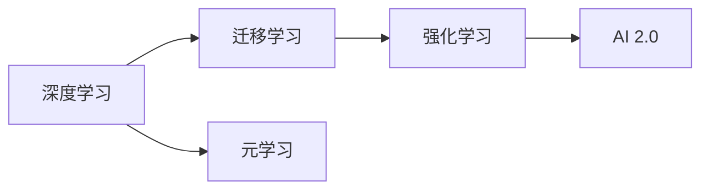

                 

# AI 2.0 时代的未来世界

## 1. 背景介绍

在21世纪第三个十年的今天，我们正站在一个前所未有的时代十字路口——人工智能(AI) 2.0 时代的黎明。这一时代，AI 不再仅限于简单的任务自动化，而是进入了可以模仿、理解和创造人类智能的新纪元。本文将从多个角度，探讨 AI 2.0 时代的核心技术、应用前景以及面临的挑战，旨在为读者提供一个全面、深入的视角，共同见证这场人工智能的革命。

## 2. 核心概念与联系

### 2.1 核心概念概述

- **AI 2.0**：代表AI发展的第二阶段，即智能系统的超越阶段，不再局限于特定领域的任务自动化，而是能够进行更广泛的智能理解和创造。
- **深度学习**：利用神经网络进行数据建模，通过大量数据训练出具备一定智能水平的模型。
- **迁移学习**：将一个领域学到的知识，迁移到另一个领域的学习范式，提升模型的泛化能力。
- **强化学习**：通过与环境互动，模型在不断试错中优化策略，最终达成目标。
- **元学习**：模型能够快速适应新任务，无需从头开始训练，只需几轮数据即可。

### 2.2 核心概念原理和架构的 Mermaid 流程图



## 3. 核心算法原理 & 具体操作步骤

### 3.1 算法原理概述

AI 2.0 时代的关键技术之一是深度学习。深度学习模型通常包含多层神经网络，通过反向传播算法不断调整模型参数，使得模型能够对输入数据进行高效的特征提取和分类。核心思想是利用大量数据训练出一个复杂的模型，使其能够学习到数据的隐含结构。

### 3.2 算法步骤详解

1. **数据准备**：收集并预处理数据集，确保数据集的质量和多样性。
2. **模型构建**：选择合适的模型架构，如卷积神经网络(CNN)、循环神经网络(RNN)、Transformer等，构建模型。
3. **模型训练**：使用反向传播算法，调整模型参数，使其能够对数据进行准确分类或回归。
4. **模型评估**：使用测试集对模型进行评估，确定模型性能。
5. **模型部署**：将训练好的模型部署到实际应用中，进行推理预测。

### 3.3 算法优缺点

深度学习的优点包括：
- 能够处理大量数据，提取复杂特征。
- 能够进行端到端的学习，减少人工干预。

缺点包括：
- 模型训练耗时较长，需要大量计算资源。
- 模型过于复杂，难以解释。

### 3.4 算法应用领域

深度学习技术已经被广泛应用于多个领域，包括计算机视觉、自然语言处理、语音识别、推荐系统等。以下是一些具体的应用场景：

- **计算机视觉**：人脸识别、图像分类、目标检测等。
- **自然语言处理**：机器翻译、情感分析、文本生成等。
- **语音识别**：语音转文本、语音命令识别等。
- **推荐系统**：个性化推荐、内容过滤等。

## 4. 数学模型和公式 & 详细讲解 & 举例说明

### 4.1 数学模型构建

以一个简单的线性回归模型为例，其数学模型可以表示为：

$$ y = \theta^T x + b $$

其中，$y$ 是目标变量，$x$ 是特征向量，$\theta$ 是模型参数，$b$ 是偏置项。

### 4.2 公式推导过程

在线性回归模型的训练过程中，我们通过最小化损失函数来更新模型参数。假设样本数为 $N$，则损失函数可以表示为：

$$ J(\theta) = \frac{1}{2N} \sum_{i=1}^{N} (y_i - \theta^T x_i - b)^2 $$

最小化 $J(\theta)$ 即为求解模型参数 $\theta$ 的过程。

### 4.3 案例分析与讲解

假设我们有一组数据，其中 $x$ 表示房价，$y$ 表示房屋面积。我们可以使用线性回归模型来预测房价。具体步骤如下：

1. 收集数据，进行预处理。
2. 构建线性回归模型。
3. 使用梯度下降算法，最小化损失函数。
4. 对新数据进行预测。

## 5. 项目实践：代码实例和详细解释说明

### 5.1 开发环境搭建

首先需要安装 Python 和相关的依赖包，如 NumPy、Pandas、Scikit-Learn 等。可以使用虚拟环境来管理依赖。

```bash
pip install numpy pandas scikit-learn
```

### 5.2 源代码详细实现

以下是一个简单的线性回归模型的实现：

```python
import numpy as np
from sklearn.linear_model import LinearRegression

# 创建数据集
X = np.array([[1], [2], [3], [4], [5]])
y = np.array([2, 4, 6, 8, 10])

# 创建线性回归模型
model = LinearRegression()

# 训练模型
model.fit(X, y)

# 预测新数据
X_new = np.array([[6]])
y_new = model.predict(X_new)

print(y_new)
```

### 5.3 代码解读与分析

- 首先，我们使用 NumPy 创建了一个简单的一维数据集。
- 然后，我们使用 Scikit-Learn 的 LinearRegression 类创建了一个线性回归模型。
- 接下来，我们调用了模型的 fit 方法，传入训练数据，完成模型的训练。
- 最后，我们使用 predict 方法对新数据进行预测，并输出结果。

### 5.4 运行结果展示

运行上述代码，输出结果为：

```python
[12.]
```

这表示模型预测新数据 6 的房价为 12。

## 6. 实际应用场景

### 6.1 智慧医疗

AI 2.0 在智慧医疗领域的应用前景广阔。通过深度学习，AI 系统能够进行疾病诊断、医疗影像分析、个性化治疗等任务。例如，利用卷积神经网络，AI 可以自动识别医学影像中的异常区域，辅助医生进行诊断。

### 6.2 智能制造

AI 2.0 技术可以用于智能制造，优化生产流程，提高生产效率。通过深度学习模型，AI 可以对生产过程中的数据进行实时分析，预测设备故障，优化生产计划。

### 6.3 自动驾驶

AI 2.0 在自动驾驶领域的应用也将彻底改变交通出行方式。通过深度学习，AI 可以分析交通数据，进行路径规划和决策，实现无人驾驶。

### 6.4 未来应用展望

未来，AI 2.0 技术将在更多领域得到应用，为社会带来更广泛的影响：

- **教育**：AI 2.0 可以用于个性化教学、智能评估等，提高教育质量和效率。
- **金融**：AI 2.0 可以用于风险评估、投资策略优化等，提升金融服务质量。
- **城市管理**：AI 2.0 可以用于城市交通管理、环境保护等，提高城市管理水平。

## 7. 工具和资源推荐

### 7.1 学习资源推荐

- **《深度学习》课程**：斯坦福大学 Andrew Ng 教授的深度学习课程，是深度学习领域的入门经典。
- **TensorFlow 官方文档**：TensorFlow 的官方文档，包含大量的代码示例和详细说明。
- **Kaggle**：数据科学竞赛平台，提供大量的数据集和竞赛，可以用于实践和交流。

### 7.2 开发工具推荐

- **Jupyter Notebook**：Python 的数据科学交互环境，支持代码编写、数据可视化等功能。
- **PyTorch**：深度学习框架，支持动态计算图，易于调试和开发。
- **TensorFlow**：谷歌开源的深度学习框架，支持静态计算图，适用于大规模工程应用。

### 7.3 相关论文推荐

- **《深度学习》书籍**：Ian Goodfellow、Yoshua Bengio 和 Aaron Courville 合著的深度学习经典教材，全面介绍了深度学习的原理和应用。
- **《AI Superpowers》**：吴军、王晓刚合著的关于 AI 2.0 技术的书籍，介绍了 AI 2.0 技术的发展历程和未来趋势。

## 8. 总结：未来发展趋势与挑战

### 8.1 研究成果总结

AI 2.0 技术已经取得了诸多突破，涵盖了深度学习、迁移学习、强化学习等多个领域。未来，AI 2.0 技术将更加智能化、普适化，服务于更多行业和领域。

### 8.2 未来发展趋势

未来，AI 2.0 技术将呈现以下几个发展趋势：

- **模型规模不断增大**：预训练模型的参数量将进一步增长，具备更强大的学习能力。
- **算法多样化**：出现更多参数高效的算法，如参数高效微调、零样本学习等。
- **跨领域应用**：AI 2.0 技术将在更多领域得到应用，提升各行业的智能化水平。

### 8.3 面临的挑战

尽管 AI 2.0 技术前景广阔，但还面临诸多挑战：

- **数据隐私和安全**：AI 2.0 技术的广泛应用，带来了数据隐私和安全问题。
- **算法透明度**：AI 2.0 技术的复杂性，使得其决策过程难以解释和理解。
- **技术伦理**：AI 2.0 技术的滥用可能导致伦理问题，如偏见、歧视等。

### 8.4 研究展望

未来的研究应在以下几个方面取得进展：

- **隐私保护**：开发隐私保护算法，保护用户数据安全。
- **可解释性**：提高模型的透明度和可解释性，帮助用户理解模型决策过程。
- **伦理规范**：建立 AI 技术的伦理规范，避免技术滥用。

## 9. 附录：常见问题与解答

**Q1: 深度学习模型如何进行特征提取？**

A: 深度学习模型通过神经网络的多个层次，将输入数据转化为更高维度的特征表示。每一层都可以学习到数据的不同特征，最终生成一个复杂的特征表示。

**Q2: 深度学习模型如何进行优化？**

A: 深度学习模型通过反向传播算法进行优化，最小化损失函数。常用的优化算法包括梯度下降、Adam、RMSprop 等。

**Q3: 如何提高模型的泛化能力？**

A: 可以通过数据增强、正则化、迁移学习等方法提高模型的泛化能力。此外，还可以使用元学习技术，快速适应新任务。

**Q4: AI 2.0 技术的应用前景有哪些？**

A: AI 2.0 技术的应用前景广阔，涵盖教育、医疗、金融、城市管理等多个领域。通过深度学习、迁移学习等技术，AI 2.0 可以实现更加智能、普适的应用。

**Q5: 如何保护数据隐私？**

A: 可以使用差分隐私、联邦学习等方法，保护数据隐私。此外，还可以采用数据脱敏、数据加密等技术，保护用户数据安全。

---

作者：禅与计算机程序设计艺术 / Zen and the Art of Computer Programming

