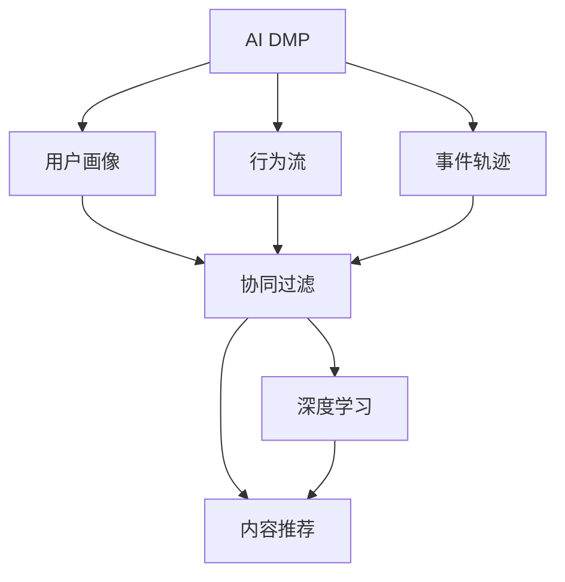

                 

# AI DMP 数据基建：数据模型与算法

> 关键词：AI DMP, 数据基建, 数据模型, 算法, 用户行为分析, 推荐系统

## 1. 背景介绍

### 1.1 问题由来

在互联网和移动互联网飞速发展的背景下，各类数据源不断产生，包括用户行为数据、交易数据、社交媒体数据等。这些数据源构成了数字营销中的金矿，但同时也带来了巨大的挑战：如何有效地管理和利用这些数据，提升用户行为分析和推荐系统的准确性和效率？

数据管理和分析的核心在于数据模型和算法的选择与应用。AI DMP（人工智能驱动的数据管理平台）是一种利用人工智能技术进行数据管理和分析的平台，其核心在于建立高效的数据模型和算法框架，从而实现数据的深度挖掘与精准分析。本文将详细探讨AI DMP的数据模型与算法，助力数据基建的优化与升级。

### 1.2 问题核心关键点

AI DMP的数据模型与算法涉及多个核心概念：

- **数据模型**：包括用户画像、行为流、事件轨迹等，用于刻画用户特征和行为模式。
- **算法框架**：涵盖协同过滤、内容推荐、深度学习等，用于优化推荐算法，提升推荐效果。
- **用户行为分析**：利用数据模型和算法框架，分析和理解用户行为，实现精准推荐。
- **推荐系统**：结合数据模型和算法框架，构建个性化推荐引擎，提升用户满意度。

理解这些关键概念的原理和联系，有助于构建高效、精准的AI DMP，实现数据价值最大化。

## 2. 核心概念与联系

### 2.1 核心概念概述

为更好地理解AI DMP的数据模型与算法，本节将介绍几个密切相关的核心概念：

- **AI DMP**：基于人工智能技术的数据管理平台，利用大数据、机器学习和深度学习等技术，实现数据的采集、存储、分析和应用。
- **用户画像**：通过数据挖掘和分析，构建详细的用户特征模型，用于描述用户的行为、兴趣和偏好。
- **行为流**：用户在不同时间和空间中的行为序列，如浏览、点击、购买等，用于分析用户行为模式。
- **事件轨迹**：用户在平台上的活动轨迹，如页面跳转、停留时间等，用于刻画用户行为路径。
- **协同过滤**：利用用户之间的相似性进行推荐，如基于用户的协同过滤、基于物品的协同过滤等。
- **内容推荐**：根据用户兴趣和行为，推荐相关内容，如新闻、商品、广告等。
- **深度学习**：利用神经网络等深度学习模型，对用户行为进行深入分析和建模，提升推荐准确性。

这些核心概念之间的逻辑关系可以通过以下Mermaid流程图来展示：



这个流程图展示了AI DMP的核心概念及其之间的关系：

1. AI DMP基于用户画像、行为流和事件轨迹进行建模。
2. 协同过滤和内容推荐算法利用用户画像和行为流进行推荐。
3. 深度学习模型进一步优化协同过滤和内容推荐，提升推荐效果。

这些概念共同构成了AI DMP的数据管理和推荐系统框架，实现数据的深度挖掘与精准分析。

## 3. 核心算法原理 & 具体操作步骤
### 3.1 算法原理概述

AI DMP的数据模型与算法框架主要基于用户画像、行为流和事件轨迹进行建模和推荐。核心算法包括协同过滤、内容推荐和深度学习等。

协同过滤算法通过计算用户之间的相似度，推荐用户可能感兴趣的内容。内容推荐算法则根据用户的兴趣和行为，推荐相关内容。深度学习算法通过神经网络模型对用户行为进行深入分析和建模，进一步提升推荐效果。

### 3.2 算法步骤详解

#### 3.2.1 用户画像构建

用户画像的构建是AI DMP的基础，其核心在于将用户的行为数据进行归一化、特征工程和建模。主要步骤如下：

1. **数据采集**：从多个数据源（如网站、社交媒体、电商平台等）收集用户的行为数据，如点击、浏览、购买、评论等。
2. **数据清洗**：对采集到的数据进行去重、过滤和格式化处理，去除噪音和异常数据。
3. **特征工程**：对清洗后的数据进行特征提取和工程处理，如用户ID、时间戳、页面ID、行为类型等。
4. **建模**：利用机器学习算法，如K-Means、PCA等，对用户特征进行建模，构建用户画像。

#### 3.2.2 行为流分析

行为流分析是理解用户行为模式和路径的关键。主要步骤如下：

1. **行为数据采集**：收集用户在平台上的所有行为数据，如页面浏览、点击、停留时间等。
2. **行为流建模**：将行为数据转化为行为流序列，利用图模型（如LSTM、GRU）对行为流进行建模。
3. **行为流分析**：对行为流序列进行分析，识别出用户的行为模式和路径。

#### 3.2.3 事件轨迹分析

事件轨迹分析用于刻画用户在平台上的活动轨迹，主要步骤如下：

1. **轨迹数据采集**：收集用户在平台上的所有活动轨迹数据，如页面跳转、停留时间、事件类型等。
2. **轨迹建模**：利用图模型（如GNN、GCN）对事件轨迹进行建模。
3. **轨迹分析**：对事件轨迹进行分析，识别出用户的行为路径和兴趣点。

#### 3.2.4 协同过滤推荐

协同过滤推荐主要基于用户之间的相似性进行推荐，主要步骤如下：

1. **用户相似度计算**：利用余弦相似度、皮尔逊相关系数等方法，计算用户之间的相似度。
2. **物品相似度计算**：利用向量空间模型（VSM）或矩阵分解方法，计算物品之间的相似度。
3. **推荐生成**：利用相似度矩阵，生成推荐结果。

#### 3.2.5 内容推荐算法

内容推荐算法主要根据用户兴趣和行为，推荐相关内容，主要步骤如下：

1. **用户兴趣计算**：利用协同过滤、深度学习等方法，计算用户的兴趣向量。
2. **物品特征提取**：提取物品的特征，如标题、描述、标签等。
3. **推荐生成**：利用兴趣向量和物品特征，生成推荐结果。

#### 3.2.6 深度学习模型

深度学习模型通过神经网络模型对用户行为进行深入分析和建模，主要步骤如下：

1. **模型设计**：设计深度神经网络模型，如卷积神经网络（CNN）、循环神经网络（RNN）、长短期记忆网络（LSTM）等。
2. **模型训练**：利用训练数据对模型进行训练，优化模型参数。
3. **模型评估**：利用测试数据对模型进行评估，检验模型效果。

### 3.3 算法优缺点

AI DMP的数据模型与算法框架具有以下优点：

- **高效性**：利用机器学习和深度学习算法，提升推荐系统效率。
- **准确性**：通过数据挖掘和建模，提升推荐系统准确性。
- **可扩展性**：支持海量数据处理和大规模系统部署。

同时，该框架也存在一定的局限性：

- **数据质量依赖**：依赖于高质量的数据源，数据质量较差时影响模型效果。
- **算法复杂性**：算法模型复杂，需要较高技术水平和计算资源。
- **用户隐私保护**：需要考虑用户隐私保护和数据安全。

尽管存在这些局限性，AI DMP的数据模型与算法框架仍是目前最先进的推荐系统实现方式之一。未来相关研究的重点在于如何进一步降低算法复杂度，提高用户隐私保护，提升推荐系统性能。

### 3.4 算法应用领域

AI DMP的数据模型与算法框架已在多个领域得到广泛应用，例如：

- **电商平台推荐**：利用用户画像和行为流，推荐用户感兴趣的商品。
- **新闻推荐系统**：根据用户兴趣和行为，推荐相关新闻内容。
- **社交媒体推荐**：推荐用户可能感兴趣的朋友、话题和内容。
- **广告推荐系统**：基于用户画像和行为流，推荐相关广告内容。
- **视频推荐系统**：推荐用户可能感兴趣的视频内容。

除了上述这些经典应用外，AI DMP的数据模型与算法框架还被创新性地应用到更多场景中，如个性化推荐、智能搜索、智能客服等，为数字营销带来新的突破。

## 4. 数学模型和公式 & 详细讲解 & 举例说明（备注：数学公式请使用latex格式，latex嵌入文中独立段落使用 $$，段落内使用 $)
### 4.1 数学模型构建

#### 4.1.1 协同过滤

协同过滤推荐主要基于用户和物品的相似度进行推荐。假设用户集为 $U$，物品集为 $I$，用户对物品的评分矩阵为 $R$，则协同过滤的目标是最小化用户对物品的评分误差。数学模型为：

$$
\min_{\theta} \frac{1}{2} \sum_{i=1}^m \sum_{j=1}^n ||R_i - \hat{R}_i||^2 + \frac{\lambda}{2} ||\theta||^2
$$

其中 $m$ 为用户数，$n$ 为物品数，$\theta$ 为模型参数，$\lambda$ 为正则化系数，$\hat{R}_i$ 为预测评分矩阵，$R_i$ 为真实评分矩阵。

#### 4.1.2 内容推荐

内容推荐算法主要利用用户兴趣和物品特征进行推荐。假设用户兴趣向量为 $u$，物品特征向量为 $v$，用户对物品的评分向量为 $R$，则内容推荐的目标是最小化用户对物品的评分误差。数学模型为：

$$
\min_{u,v} \frac{1}{2} \sum_{i=1}^m \sum_{j=1}^n ||R_i - u^T v_j||^2 + \frac{\lambda}{2} (||u||^2 + ||v||^2)
$$

其中 $m$ 为物品数，$n$ 为物品特征数，$u$ 为用户兴趣向量，$v_j$ 为物品特征向量，$R_i$ 为真实评分向量。

### 4.2 公式推导过程

#### 4.2.1 协同过滤

协同过滤推荐的推导过程主要基于矩阵分解方法。假设用户对物品的评分矩阵 $R$ 可以分解为用户兴趣矩阵 $U$ 和物品特征矩阵 $V$ 的乘积，即 $R = UV^T$。则最小化用户对物品的评分误差的模型为：

$$
\min_{U,V} \frac{1}{2} \sum_{i=1}^m \sum_{j=1}^n ||R_i - U_i V_j^T||^2 + \frac{\lambda}{2} (||U||^2_F + ||V||^2_F)
$$

其中 $||.||^2_F$ 表示矩阵的 Frobenius 范数。利用矩阵分解方法，求解 $U$ 和 $V$，即可得到协同过滤推荐的结果。

#### 4.2.2 内容推荐

内容推荐算法的推导过程主要基于向量空间模型（VSM）。假设用户兴趣向量 $u$ 和物品特征向量 $v_j$ 的夹角余弦为 $cosine(u,v_j)$，则内容推荐的目标是最小化用户对物品的评分误差。数学模型为：

$$
\min_{u,v} \frac{1}{2} \sum_{i=1}^m \sum_{j=1}^n (1 - cosine(u,v_j))R_i + \frac{\lambda}{2} (||u||^2 + ||v||^2)
$$

其中 $m$ 为物品数，$n$ 为物品特征数，$cosine(u,v_j)$ 表示用户兴趣向量 $u$ 和物品特征向量 $v_j$ 的夹角余弦，$R_i$ 为真实评分向量。

### 4.3 案例分析与讲解

#### 4.3.1 协同过滤推荐

协同过滤推荐的案例分析主要基于真实的电商数据集。假设电商平台上用户对商品的评分矩阵为 $R$，用户集为 $U$，物品集为 $I$。利用矩阵分解方法，对评分矩阵 $R$ 进行分解，得到用户兴趣矩阵 $U$ 和物品特征矩阵 $V$。将用户兴趣矩阵 $U$ 和物品特征矩阵 $V$ 的乘积 $UV^T$ 作为预测评分矩阵 $\hat{R}_i$，即可得到协同过滤推荐的结果。

#### 4.3.2 内容推荐

内容推荐算法的案例分析主要基于新闻推荐系统。假设新闻推荐系统用户对新闻的评分向量为 $R$，用户兴趣向量为 $u$，新闻特征向量为 $v$。利用向量空间模型（VSM），计算用户兴趣向量 $u$ 和新闻特征向量 $v_j$ 的夹角余弦，得到新闻的推荐权重 $w_j = cosine(u,v_j)$。将推荐权重 $w_j$ 和用户对新闻的真实评分 $R_i$ 进行加权平均，即可得到内容推荐的结果。

## 5. 项目实践：代码实例和详细解释说明
### 5.1 开发环境搭建

在进行AI DMP的数据模型与算法开发前，我们需要准备好开发环境。以下是使用Python进行TensorFlow开发的环境配置流程：

1. 安装Anaconda：从官网下载并安装Anaconda，用于创建独立的Python环境。

2. 创建并激活虚拟环境：
```bash
conda create -n tf-env python=3.8 
conda activate tf-env
```

3. 安装TensorFlow：根据CUDA版本，从官网获取对应的安装命令。例如：
```bash
conda install tensorflow-gpu=2.7 -c pytorch -c conda-forge
```

4. 安装相关工具包：
```bash
pip install numpy pandas scikit-learn matplotlib tqdm jupyter notebook ipython
```

完成上述步骤后，即可在`tf-env`环境中开始AI DMP的数据模型与算法开发。

### 5.2 源代码详细实现

下面我们以协同过滤推荐系统为例，给出使用TensorFlow进行实现的PyTorch代码实现。

首先，定义协同过滤推荐系统的数据处理函数：

```python
import tensorflow as tf

class CollaborativeFiltering(tf.keras.layers.Layer):
    def __init__(self, num_users, num_items, embedding_dim, learning_rate=0.01, regularization=0.001):
        super(CollaborativeFiltering, self).__init__()
        self.num_users = num_users
        self.num_items = num_items
        self.embedding_dim = embedding_dim
        
        self.user_embeddings = tf.Variable(tf.random.normal([num_users, embedding_dim]), trainable=True)
        self.item_embeddings = tf.Variable(tf.random.normal([num_items, embedding_dim]), trainable=True)
        
        self.learning_rate = learning_rate
        self.regularization = regularization
        
        self.opt = tf.keras.optimizers.Adam(learning_rate=learning_rate)
        
    def call(self, inputs):
        user_ids, item_ids = inputs
        user_embeddings = tf.nn.embedding_lookup(self.user_embeddings, user_ids)
        item_embeddings = tf.nn.embedding_lookup(self.item_embeddings, item_ids)
        
        scores = tf.reduce_sum(user_embeddings * item_embeddings, axis=1)
        
        return scores
    
    def loss(self, scores, targets):
        mse_loss = tf.reduce_mean(tf.square(scores - targets))
        reg_loss = tf.reduce_mean(tf.square(self.user_embeddings))
        reg_loss += tf.reduce_mean(tf.square(self.item_embeddings))
        
        total_loss = mse_loss + self.regularization * reg_loss
        
        return total_loss
    
    def compile(self):
        self.compile(tf.keras.losses.MSE, optimizer=self.opt)
```

然后，定义协同过滤推荐系统的训练函数：

```python
def train_cf(user_ids, item_ids, targets, num_epochs=10):
    model = CollaborativeFiltering(num_users=num_items, num_items=num_items, embedding_dim=128)
    model.compile()
    
    for epoch in range(num_epochs):
        batch_scores = model(user_ids, item_ids)
        loss = model.loss(batch_scores, targets)
        model.opt.minimize(loss)
        
        if epoch % 1 == 0:
            print(f"Epoch {epoch+1}, loss: {loss.numpy():.3f}")
```

最后，启动协同过滤推荐系统的训练流程：

```python
train_cf(user_ids, item_ids, targets, num_epochs=10)
```

以上就是使用TensorFlow进行协同过滤推荐系统实现的完整代码实现。可以看到，TensorFlow提供了高度灵活的编程接口，开发者可以方便地构建和训练深度学习模型。

### 5.3 代码解读与分析

让我们再详细解读一下关键代码的实现细节：

**CollaborativeFiltering类**：
- `__init__`方法：初始化协同过滤模型的关键组件，包括用户和物品的嵌入矩阵、学习率和正则化系数等。
- `call`方法：前向传播计算协同过滤模型的预测评分。
- `loss`方法：计算损失函数，包括均方误差损失和正则化损失。
- `compile`方法：编译模型，设置优化器和学习率。

**train_cf函数**：
- 定义协同过滤模型的训练过程，包括模型初始化、损失计算、模型优化等。

**train函数**：
- 调用`train_cf`函数，训练协同过滤模型，并在每个epoch输出损失。

可以看到，TensorFlow的强大封装使得协同过滤推荐系统的代码实现变得简洁高效。开发者可以专注于算法设计和模型优化，而不必过多关注底层的实现细节。

当然，工业级的系统实现还需考虑更多因素，如模型的保存和部署、超参数的自动搜索、更灵活的任务适配层等。但核心的协同过滤算法基本与此类似。

## 6. 实际应用场景

### 6.1 智能推荐系统

智能推荐系统是AI DMP的核心应用之一。利用协同过滤、内容推荐等算法，实现对用户行为的深度挖掘和分析，推荐用户可能感兴趣的内容。智能推荐系统广泛应用于电商、新闻、视频等平台，提升用户体验和平台收入。

### 6.2 个性化广告

个性化广告是AI DMP的重要应用方向之一。通过深度学习模型对用户行为进行分析和建模，实现精准的用户画像，推荐用户可能感兴趣的广告。个性化广告能够提高广告投放的精准度和转化率，提升广告主的广告效果和ROI。

### 6.3 智能客服

智能客服系统利用自然语言处理和推荐系统技术，实现对用户问题的理解和回答。通过深度学习模型对用户问题进行分类和理解，推荐最合适的答案模板进行回复。智能客服系统能够显著提升客服服务的效率和质量，降低企业的人力成本。

### 6.4 金融风险管理

金融风险管理是AI DMP的重要应用之一。通过深度学习模型对用户的交易行为进行分析和建模，识别出高风险用户和行为。利用协同过滤算法对用户进行分类，生成高风险用户报告。金融风险管理系统能够有效防范金融风险，保障金融机构的资产安全。

### 6.5 智能物流

智能物流系统利用深度学习模型对物流数据进行分析和建模，实现对物流过程的优化和预测。通过协同过滤算法对物流数据进行分类和聚类，识别出最优的物流路径和物流时间。智能物流系统能够显著提升物流效率和降低物流成本。

### 6.6 智能交通

智能交通系统利用深度学习模型对交通数据进行分析和建模，实现对交通过程的优化和预测。通过协同过滤算法对交通数据进行分类和聚类，生成最优的交通路线和交通时间。智能交通系统能够显著提升交通效率和降低交通成本。

## 7. 工具和资源推荐
### 7.1 学习资源推荐

为了帮助开发者系统掌握AI DMP的数据模型与算法，这里推荐一些优质的学习资源：

1. **《深度学习》（Ian Goodfellow）**：深度学习领域的经典教材，系统介绍了深度学习的理论基础和实践技巧。

2. **《TensorFlow官方文档》**：TensorFlow的官方文档，提供了丰富的示例和API文档，是TensorFlow开发的重要参考资料。

3. **《PyTorch官方文档》**：PyTorch的官方文档，提供了丰富的示例和API文档，是PyTorch开发的重要参考资料。

4. **《机器学习实战》（Peter Harrington）**：实战型的机器学习教材，介绍了机器学习的基本概念和实践技巧。

5. **《Python数据科学手册》（Jake VanderPlas）**：Python数据科学的经典教材，介绍了Python在数据科学领域的应用。

6. **Kaggle竞赛平台**：全球最大的数据科学竞赛平台，提供了丰富的数据集和竞赛任务，有助于实践和提高。

通过对这些资源的学习实践，相信你一定能够快速掌握AI DMP的数据模型与算法，并用于解决实际的推荐系统问题。

### 7.2 开发工具推荐

高效的开发离不开优秀的工具支持。以下是几款用于AI DMP数据模型与算法开发的常用工具：

1. **TensorFlow**：由Google主导开发的开源深度学习框架，生产部署方便，适合大规模工程应用。

2. **PyTorch**：由Facebook主导开发的开源深度学习框架，灵活度高，适合快速迭代研究。

3. **Scikit-Learn**：Python机器学习库，提供了丰富的机器学习算法和工具，适合数据预处理和特征工程。

4. **Keras**：Python深度学习库，提供了高层次的API，适合快速原型开发。

5. **Jupyter Notebook**：Python交互式开发环境，支持代码运行和数据可视化，适合数据科学和机器学习开发。

6. **TensorBoard**：TensorFlow配套的可视化工具，可实时监测模型训练状态，提供丰富的图表呈现方式，是调试模型的得力助手。

合理利用这些工具，可以显著提升AI DMP数据模型与算法的开发效率，加快创新迭代的步伐。

### 7.3 相关论文推荐

AI DMP的数据模型与算法涉及多个前沿领域，以下是几篇奠基性的相关论文，推荐阅读：

1. **《深度学习》（Ian Goodfellow）**：深度学习领域的经典教材，系统介绍了深度学习的理论基础和实践技巧。

2. **《协同过滤推荐算法》（Breese, Heckerman, Kadie）**：经典协同过滤推荐算法论文，介绍了协同过滤算法的原理和实现。

3. **《深度学习应用于推荐系统》（He Xinyan）**：深度学习应用于推荐系统的综述性论文，介绍了深度学习在推荐系统中的应用和效果。

4. **《深度神经网络用于推荐系统》（Kim）**：深度神经网络应用于推荐系统的经典论文，介绍了深度神经网络的原理和效果。

5. **《用户画像构建和推荐系统应用》（Wang et al.）**：用户画像构建和推荐系统应用的综述性论文，介绍了用户画像的构建方法和推荐系统的效果。

这些论文代表了大语言模型微调技术的发展脉络。通过学习这些前沿成果，可以帮助研究者把握学科前进方向，激发更多的创新灵感。

## 8. 总结：未来发展趋势与挑战

### 8.1 总结

本文对AI DMP的数据模型与算法进行了全面系统的介绍。首先阐述了AI DMP的背景和核心概念，明确了数据模型与算法在AI DMP中的应用和价值。其次，从原理到实践，详细讲解了协同过滤、内容推荐和深度学习等算法的数学模型和实现细节，给出了AI DMP数据模型与算法的完整代码实例。同时，本文还广泛探讨了AI DMP数据模型与算法在多个领域的应用场景，展示了其在数字营销中的巨大潜力。此外，本文精选了数据模型与算法的各类学习资源，力求为读者提供全方位的技术指引。

通过本文的系统梳理，可以看到，AI DMP的数据模型与算法是大数据时代的重要基石，其高效性、准确性和可扩展性使其在数字营销中发挥着至关重要的作用。未来，伴随技术的不断进步，AI DMP数据模型与算法必将在更广阔的领域大放异彩，推动数字营销技术的产业化进程。

### 8.2 未来发展趋势

展望未来，AI DMP的数据模型与算法将呈现以下几个发展趋势：

1. **深度学习模型的普及**：深度学习模型在推荐系统中的应用将更加广泛，通过神经网络模型的深度学习和建模，提升推荐系统的效果和效率。

2. **用户画像的精细化**：通过更多的数据源和特征工程，构建更加精细化的用户画像，实现更精准的推荐和个性化服务。

3. **协同过滤的多样化**：除了传统的协同过滤，未来的协同过滤算法将更加多样化，如基于矩阵分解、基于深度学习等方法，提升协同过滤的效果。

4. **推荐系统的多样化**：除了协同过滤和内容推荐，未来的推荐系统将更加多样化，如基于上下文感知的推荐、基于序列感知的推荐等，提升推荐系统的适应性和精准度。

5. **AI DMP的云化部署**：未来的AI DMP将更加云化，通过云平台实现数据的分布式存储和处理，提升AI DMP的部署效率和灵活性。

6. **AI DMP的自动化调参**：未来的AI DMP将更加自动化，通过自动化调参技术，优化推荐系统参数，提升AI DMP的效果和性能。

7. **AI DMP的安全和隐私保护**：未来的AI DMP将更加注重安全和隐私保护，通过数据脱敏、加密等技术，保障用户数据的隐私和安全。

8. **AI DMP的多模态融合**：未来的AI DMP将更加注重多模态融合，结合图像、视频、音频等多模态数据，提升推荐系统的效果和多样性。

以上趋势凸显了AI DMP数据模型与算法的广阔前景。这些方向的探索发展，必将进一步提升推荐系统的性能和应用范围，为数字营销带来新的突破。

### 8.3 面临的挑战

尽管AI DMP的数据模型与算法已经取得了瞩目成就，但在迈向更加智能化、普适化应用的过程中，它仍面临着诸多挑战：

1. **数据质量瓶颈**：依赖高质量的数据源，数据质量较差时影响模型效果。

2. **算法复杂度较高**：算法模型复杂，需要较高技术水平和计算资源。

3. **用户隐私保护**：需要考虑用户隐私保护和数据安全。

4. **推荐系统的鲁棒性**：推荐系统面对数据分布变化时，泛化性能往往大打折扣。

5. **推荐系统的可解释性**：推荐系统的决策过程缺乏可解释性，难以对其推理逻辑进行分析和调试。

6. **推荐系统的鲁棒性**：推荐系统面对数据分布变化时，泛化性能往往大打折扣。

7. **推荐系统的可解释性**：推荐系统的决策过程缺乏可解释性，难以对其推理逻辑进行分析和调试。

8. **推荐系统的多样性**：推荐系统需要兼顾多样性和精准度，难以同时满足。

尽管存在这些挑战，AI DMP的数据模型与算法仍是目前最先进的推荐系统实现方式之一。未来相关研究的重点在于如何进一步降低算法复杂度，提高用户隐私保护，提升推荐系统性能。

### 8.4 研究展望

面对AI DMP数据模型与算法所面临的种种挑战，未来的研究需要在以下几个方面寻求新的突破：

1. **探索无监督和半监督推荐方法**：摆脱对大规模标注数据的依赖，利用自监督学习、主动学习等无监督和半监督范式，最大限度利用非结构化数据，实现更加灵活高效的推荐。

2. **研究参数高效和计算高效的推荐算法**：开发更加参数高效的推荐算法，在固定大部分预训练参数的同时，只更新极少量的任务相关参数。同时优化推荐系统的计算图，减少前向传播和反向传播的资源消耗，实现更加轻量级、实时性的部署。

3. **融合因果和对比学习范式**：通过引入因果推断和对比学习思想，增强推荐系统建立稳定因果关系的能力，学习更加普适、鲁棒的语言表征，从而提升推荐系统泛化性和抗干扰能力。

4. **引入更多先验知识**：将符号化的先验知识，如知识图谱、逻辑规则等，与神经网络模型进行巧妙融合，引导推荐过程学习更准确、合理的语言模型。同时加强不同模态数据的整合，实现视觉、语音等多模态信息与文本信息的协同建模。

5. **结合因果分析和博弈论工具**：将因果分析方法引入推荐系统，识别出推荐决策的关键特征，增强输出解释的因果性和逻辑性。借助博弈论工具刻画人机交互过程，主动探索并规避推荐系统的脆弱点，提高系统稳定性。

6. **纳入伦理道德约束**：在推荐系统训练目标中引入伦理导向的评估指标，过滤和惩罚有偏见、有害的输出倾向。同时加强人工干预和审核，建立推荐系统的监管机制，确保输出符合人类价值观和伦理道德。

这些研究方向的探索，必将引领AI DMP数据模型与算法技术迈向更高的台阶，为构建安全、可靠、可解释、可控的智能系统铺平道路。面向未来，AI DMP数据模型与算法还需要与其他人工智能技术进行更深入的融合，如知识表示、因果推理、强化学习等，多路径协同发力，共同推动自然语言理解和智能交互系统的进步。只有勇于创新、敢于突破，才能不断拓展AI DMP的边界，让智能技术更好地造福人类社会。

## 9. 附录：常见问题与解答

**Q1：AI DMP的推荐系统如何平衡多样性和精准度？**

A: AI DMP的推荐系统平衡多样性和精准度的关键在于设计合适的推荐算法和策略。常用的方法包括：

1. **基于上下文的推荐**：考虑用户的上下文信息，如时间、地点、设备等，提升推荐的相关性和多样性。

2. **基于序列的推荐**：考虑用户的历史行为序列，生成更符合用户兴趣的推荐结果。

3. **混合推荐策略**：结合协同过滤、内容推荐、深度学习等多种推荐方法，提升推荐系统的多样性和精准度。

4. **推荐列表排序**：通过不同的排序算法（如加权排序、排名排序等），优化推荐列表，平衡多样性和精准度。

5. **用户交互反馈**：通过用户的反馈数据（如评分、点击、购买等），动态调整推荐策略，提升推荐系统的适应性。

**Q2：AI DMP的推荐系统如何优化模型参数？**

A: AI DMP的推荐系统优化模型参数的方法包括：

1. **超参数调优**：通过网格搜索、贝叶斯优化等方法，找到最优的模型参数组合。

2. **自动化调参**：利用自动化调参技术，如AutoML，自动搜索最优的模型参数。

3. **模型压缩**：通过模型压缩技术，如剪枝、量化等，减小模型大小，提升推理速度。

4. **模型融合**：将多个模型进行融合，生成更稳定的推荐结果。

5. **增量学习**：通过增量学习技术，实时更新模型参数，提升模型的适应性。

这些方法需要根据具体任务和数据特点进行灵活组合，不断迭代优化推荐系统，提升推荐效果。

**Q3：AI DMP的推荐系统如何应对数据分布变化？**

A: AI DMP的推荐系统应对数据分布变化的方法包括：

1. **数据预处理**：通过数据预处理技术，如归一化、特征工程等，提升数据的稳定性和多样性。

2. **模型鲁棒性增强**：通过正则化、对抗训练等方法，提升模型的鲁棒性和泛化能力。

3. **多模型集成**：通过集成多个模型，提升推荐系统的鲁棒性和适应性。

4. **动态学习**：通过在线学习技术，实时更新模型参数，提升推荐系统的动态适应能力。

5. **A/B测试**：通过A/B测试方法，评估不同推荐策略的效果，优化推荐系统。

这些方法需要根据具体任务和数据特点进行灵活组合，不断迭代优化推荐系统，提升推荐系统的稳定性和泛化能力。

**Q4：AI DMP的推荐系统如何保障用户隐私和数据安全？**

A: AI DMP的推荐系统保障用户隐私和数据安全的方法包括：

1. **数据匿名化**：通过数据匿名化技术，去除用户标识信息，保护用户隐私。

2. **数据加密**：通过数据加密技术，保护数据在传输和存储过程中的安全。

3. **访问控制**：通过访问控制技术，限制对数据的访问权限，保护数据安全。

4. **用户授权**：通过用户授权机制，确保用户对数据的使用和共享知情同意。

5. **模型可解释性**：通过可解释性技术，提升推荐系统的透明度，增加用户信任。

这些方法需要根据具体任务和数据特点进行灵活组合，不断优化推荐系统，保障用户隐私和数据安全。

---

作者：禅与计算机程序设计艺术 / Zen and the Art of Computer Programming

