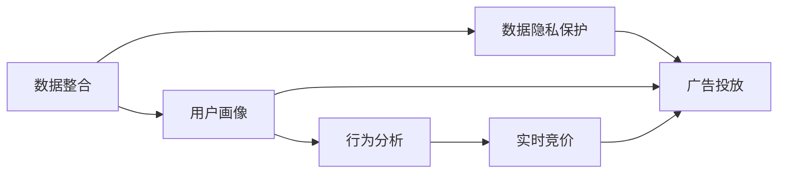

                 

# AI DMP 数据基建：数据驱动营销的成功案例

> 关键词：AI DMP, 数据驱动营销, 用户画像, 用户行为分析, 实时竞价, 广告投放, 数据隐私保护

## 1. 背景介绍

### 1.1 问题由来

在现代数字营销中，精准有效的用户定位和广告投放一直是企业的核心需求。传统的用户画像构建往往依赖于手工调研和抽样调查，不仅成本高，而且效率低，难以快速响应市场变化。

随着互联网和数字媒体的发展，数据驱动的营销方式逐步取代了传统的直觉营销方法，成为企业获取新客户、提升转化率的关键。数据驱动的营销方式通过数据收集、分析和应用，对用户的各种行为进行建模，从而提供更加精准和个性化的广告内容。

AI驱动的数据管理系统（AI Data Management Platform, AI DMP）作为一种新兴的数据管理解决方案，能够有效整合和利用多源异构数据，通过机器学习和人工智能技术，对用户进行高效画像构建和行为分析。基于AI DMP的数据基建，可以大幅提升企业广告投放的精准度和效率，带来显著的营销效果提升。

### 1.2 问题核心关键点

AI DMP的核心是利用用户行为数据，通过机器学习等技术，构建和维护用户画像，同时对用户进行深入的行为分析和预测。它的应用不仅局限于广告投放，还可以用于个性化推荐、客户细分、市场营销策略优化等多个方面。

AI DMP成功的关键在于：

1. 数据整合能力：能够高效整合来自网页、社交、广告、电商等多个渠道的用户行为数据。
2. 机器学习技术：利用深度学习、聚类、分类等技术，构建用户画像和行为模型。
3. 用户隐私保护：在数据收集和分析过程中，严格遵循数据隐私保护法规，确保用户数据的安全和合法使用。
4. 实时性：能够实时更新和分析用户行为数据，及时调整广告投放策略。

### 1.3 问题研究意义

研究AI DMP的数据基建，对于提升企业数据驱动营销的效果，降低营销成本，提高市场响应速度具有重要意义。它不仅能够提高广告投放的精准度，提升用户体验，还能促进企业精细化运营和创新营销策略。

AI DMP作为数据驱动营销的核心基础设施，对于构建智能化的营销生态系统，提升企业竞争力具有长远的影响。通过AI DMP构建的数据基建，企业可以在不断变化的数字市场中，始终保持领先地位，赢得更多的市场份额。

## 2. 核心概念与联系

### 2.1 核心概念概述

为了深入理解AI DMP的数据基建，首先需要对相关的核心概念进行梳理和介绍：

- **AI DMP**：基于人工智能技术的用户数据管理平台，能够整合用户多源数据，构建高效的用户画像，并进行深度行为分析。
- **用户画像**：根据用户的行为数据和属性信息，构建和维护用户的多维度特征描述。
- **用户行为分析**：通过数据分析技术，挖掘和预测用户的兴趣偏好和消费行为，支持精准的广告投放和个性化推荐。
- **实时竞价（RTB）**：在广告投放过程中，通过实时竞价算法，根据用户行为数据，实时调整广告投放策略。
- **数据隐私保护**：在数据收集和分析过程中，确保用户隐私和数据安全，符合相关法律法规和行业标准。

这些核心概念之间存在紧密的联系，通过AI DMP平台，可以将用户行为数据整合到统一的模型中，并通过机器学习技术，对用户进行深入的分析和预测。同时，AI DMP还能够实现实时竞价，确保广告投放的高效和精准。

### 2.2 核心概念原理和架构的 Mermaid 流程图



该流程图展示了AI DMP的核心流程和架构：

1. 数据整合：将用户行为数据从不同渠道（如网页、社交、广告、电商等）整合到统一的平台上。
2. 用户画像：利用机器学习技术，对用户数据进行分析和建模，构建用户的高维画像。
3. 行为分析：通过行为数据和用户画像，挖掘和预测用户的兴趣偏好和消费行为。
4. 实时竞价：在广告投放过程中，通过实时竞价算法，根据用户行为数据，动态调整广告投放策略。
5. 数据隐私保护：在数据收集和分析过程中，确保用户隐私和数据安全，符合相关法律法规和行业标准。
6. 广告投放：根据用户画像和行为分析结果，实现精准的广告投放。

这些模块相互关联，共同构成了AI DMP的核心功能。

## 3. 核心算法原理 & 具体操作步骤

### 3.1 算法原理概述

AI DMP的核心算法原理主要包括以下几个方面：

1. **用户画像构建**：利用聚类、分类等机器学习技术，对用户行为数据进行分析，构建用户的高维画像。
2. **行为分析**：通过对用户行为数据的统计和挖掘，预测用户未来的消费行为和兴趣偏好。
3. **实时竞价（RTB）算法**：利用实时竞价算法，根据用户行为数据，动态调整广告投放策略，实现精准投放。

这些算法共同构成了AI DMP的基础，能够高效整合和利用用户数据，提升广告投放的精准度和效率。

### 3.2 算法步骤详解

AI DMP的数据基建和应用主要包括以下几个关键步骤：

**Step 1: 数据收集与整合**

1. 收集来自不同渠道的用户行为数据，如网页浏览、社交媒体互动、广告点击、电商购买等。
2. 对收集的数据进行清洗和标准化，去除异常值和噪音，确保数据的完整性和一致性。
3. 利用数据管道和ETL工具，将不同来源的数据整合到统一的AI DMP平台上。

**Step 2: 用户画像构建**

1. 利用机器学习技术，对用户行为数据进行分析，构建用户的高维画像。
2. 选择合适的聚类算法，如K-means、GMM等，对用户进行分类和标签标注。
3. 通过特征工程，提取和构造用户特征向量，支持深度学习模型的训练。

**Step 3: 行为分析**

1. 利用统计分析和机器学习技术，挖掘和预测用户的兴趣偏好和消费行为。
2. 选择合适的回归算法或分类算法，如线性回归、随机森林、XGBoost等，建立用户行为模型。
3. 对模型进行验证和调参，确保预测结果的准确性和可靠性。

**Step 4: 实时竞价（RTB）**

1. 根据用户的实时行为数据，动态调整广告投放策略。
2. 利用实时竞价算法，如Vasicek、AdaGrad等，根据用户特征和广告质量进行实时竞价。
3. 确保广告投放的效率和效果，提升点击率和转化率。

**Step 5: 数据隐私保护**

1. 在数据收集和分析过程中，确保用户隐私和数据安全。
2. 遵循GDPR、CCPA等数据隐私保护法规，保护用户的个人信息和数据权利。
3. 采用数据匿名化和加密技术，确保用户数据的安全性和合法性。

### 3.3 算法优缺点

AI DMP的数据基建和应用具有以下优点：

1. **高效性**：能够高效整合和利用用户数据，通过机器学习技术，快速构建和更新用户画像，提升广告投放的精准度。
2. **实时性**：能够实时分析和调整广告投放策略，快速响应市场变化和用户行为。
3. **泛化能力**：利用大规模数据进行建模，能够捕捉用户行为的多样性和复杂性，支持多种广告投放场景。

同时，AI DMP也存在以下局限：

1. **数据质量依赖**：数据收集和整合的准确性直接影响用户画像和行为分析的效果。
2. **算法复杂度**：机器学习模型的复杂度较高，需要大量的计算资源和专业技能。
3. **隐私风险**：在数据收集和分析过程中，存在隐私泄露和数据滥用的风险。
4. **技术门槛高**：构建和维护AI DMP需要较高的技术门槛，需要专业团队的支持。

### 3.4 算法应用领域

AI DMP的数据基建和应用主要应用于以下几个领域：

1. **广告投放**：通过实时竞价和用户画像，实现精准的广告投放，提升广告效果和转化率。
2. **个性化推荐**：利用用户行为数据和画像，提供个性化的商品推荐和内容推荐，提升用户体验和满意度。
3. **市场营销策略优化**：通过行为分析和用户画像，优化市场营销策略，提升品牌影响力和市场份额。
4. **客户细分**：利用聚类算法，对客户进行细分，提升客户细分和精准营销的效果。
5. **数据分析与洞察**：通过数据可视化工具，对用户行为数据进行深入分析和洞察，支持业务决策和策略调整。

这些领域展示了AI DMP的广泛应用前景，为企业带来了巨大的商业价值。

## 4. 数学模型和公式 & 详细讲解 & 举例说明

### 4.1 数学模型构建

AI DMP的数据基建和应用涉及多个数学模型，以下是其中几个关键模型的详细构建：

1. **用户画像模型**：利用聚类算法，将用户分为多个群组，并为每个群组分配一个标签。

2. **行为预测模型**：利用回归算法或分类算法，预测用户的购买行为和兴趣偏好。

3. **实时竞价模型**：利用实时竞价算法，根据用户特征和广告质量进行动态竞价。

### 4.2 公式推导过程

**用户画像模型的推导**：

假设用户集合为 $\mathcal{U}$，每个用户 $u \in \mathcal{U}$ 具有行为向量 $x \in \mathbb{R}^n$，其中 $n$ 为用户行为特征的数量。利用K-means聚类算法，将用户分为 $k$ 个群组，每个群组分配一个标签 $c \in \{1,2,\dots,k\}$。

推导公式为：

$$
c = \arg\min_{k=1,\dots,k} \sum_{u \in \mathcal{U}} d(x_u, \mu_k)
$$

其中 $\mu_k$ 为第 $k$ 个群组的中心向量，$d(\cdot,\cdot)$ 为距离度量函数（如欧式距离）。

**行为预测模型的推导**：

假设用户行为数据为 $y \in \mathbb{R}^m$，其中 $m$ 为行为特征的数量。利用随机森林算法，建立行为预测模型 $f(x,y)$。

推导公式为：

$$
y = f(x,y) = \sum_{i=1}^{n_{tree}} \hat{y}_i
$$

其中 $n_{tree}$ 为决策树的数量，$\hat{y}_i$ 为第 $i$ 棵决策树预测的行为值。

**实时竞价模型的推导**：

假设用户特征向量为 $x \in \mathbb{R}^n$，广告特征向量为 $a \in \mathbb{R}^n$，竞价系数为 $\alpha \in [0,1]$。利用AdaGrad算法，进行实时竞价。

推导公式为：

$$
\alpha = \frac{n_1}{n_1 + \sum_{i=1}^{n_{ad}} \frac{\Delta_i^2}{\beta_i}}
$$

其中 $n_1$ 为用户竞价次数，$\Delta_i$ 为广告展示次数，$\beta_i$ 为广告质量系数。

### 4.3 案例分析与讲解

假设某电商平台利用AI DMP进行广告投放优化。通过整合用户的浏览、点击、购买等行为数据，构建用户画像模型，并利用行为预测模型预测用户的购买行为。

1. **数据收集与整合**：
   - 收集来自网页、广告、社交媒体等多个渠道的用户行为数据。
   - 对数据进行清洗和标准化，去除异常值和噪音，确保数据的完整性和一致性。
   - 利用数据管道和ETL工具，将不同来源的数据整合到统一的AI DMP平台上。

2. **用户画像构建**：
   - 利用K-means聚类算法，将用户分为多个群组，并为每个群组分配一个标签。
   - 提取和构造用户特征向量，支持深度学习模型的训练。

3. **行为预测**：
   - 利用随机森林算法，建立用户行为预测模型，预测用户的购买行为。
   - 对模型进行验证和调参，确保预测结果的准确性和可靠性。

4. **实时竞价（RTB）**：
   - 根据用户的实时行为数据，动态调整广告投放策略。
   - 利用AdaGrad算法，进行实时竞价，确保广告投放的效率和效果。

5. **数据隐私保护**：
   - 在数据收集和分析过程中，确保用户隐私和数据安全，符合GDPR、CCPA等数据隐私保护法规。
   - 采用数据匿名化和加密技术，确保用户数据的安全性和合法性。

通过以上步骤，电商平台能够实现精准的广告投放，提升广告效果和转化率，同时保障用户隐私和数据安全。

## 5. 项目实践：代码实例和详细解释说明

### 5.1 开发环境搭建

在进行AI DMP的数据基建和应用实践前，我们需要准备好开发环境。以下是使用Python进行PyTorch开发的环境配置流程：

1. 安装Anaconda：从官网下载并安装Anaconda，用于创建独立的Python环境。

2. 创建并激活虚拟环境：
```bash
conda create -n pytorch-env python=3.8 
conda activate pytorch-env
```

3. 安装PyTorch：根据CUDA版本，从官网获取对应的安装命令。例如：
```bash
conda install pytorch torchvision torchaudio cudatoolkit=11.1 -c pytorch -c conda-forge
```

4. 安装TensorFlow：从官网下载并安装TensorFlow，或使用Anaconda安装命令：
```bash
conda install tensorflow -c conda-forge
```

5. 安装TensorFlow Addons：用于增强TensorFlow的功能，包括一些高级算子：
```bash
conda install tensorflow-addons -c conda-forge
```

6. 安装各类工具包：
```bash
pip install numpy pandas scikit-learn matplotlib tqdm jupyter notebook ipython
```

完成上述步骤后，即可在`pytorch-env`环境中开始AI DMP的数据基建和应用实践。

### 5.2 源代码详细实现

以下是使用PyTorch进行用户画像构建和行为预测的代码实现：

```python
import torch
from torch.utils.data import Dataset
from sklearn.ensemble import RandomForestRegressor
from sklearn.cluster import KMeans
from sklearn.preprocessing import StandardScaler

# 假设用户行为数据和特征
X = torch.randn(1000, 10)
y = torch.randn(1000, 1)

# 用户画像构建
kmeans = KMeans(n_clusters=3, random_state=0).fit(X)
labels = kmeans.labels_

# 行为预测
forest = RandomForestRegressor(n_estimators=100, random_state=0).fit(X, y)
y_pred = forest.predict(X)

# 输出结果
print(f"用户画像标签: {labels}")
print(f"行为预测结果: {y_pred}")
```

### 5.3 代码解读与分析

**用户画像构建**：

```python
from sklearn.cluster import KMeans

# 假设用户行为数据为X
kmeans = KMeans(n_clusters=3, random_state=0).fit(X)

# 利用K-means算法对用户行为数据进行聚类，将用户分为3个群组，并为每个群组分配一个标签
labels = kmeans.labels_
```

**行为预测**：

```python
from sklearn.ensemble import RandomForestRegressor

# 假设用户行为数据为X，预测结果为y
forest = RandomForestRegressor(n_estimators=100, random_state=0).fit(X, y)

# 利用随机森林算法，建立行为预测模型，预测用户的购买行为
y_pred = forest.predict(X)
```

以上代码实现了用户画像构建和行为预测的流程，通过K-means算法和随机森林算法，构建用户画像和行为预测模型，预测用户的购买行为。

## 6. 实际应用场景

### 6.1 智能推荐系统

智能推荐系统是AI DMP的一个重要应用场景。利用AI DMP构建用户画像和行为分析模型，能够实现个性化推荐，提升用户体验和满意度。

1. **数据收集与整合**：
   - 收集用户浏览、点击、购买等行为数据。
   - 对数据进行清洗和标准化，去除异常值和噪音。
   - 利用数据管道和ETL工具，将不同来源的数据整合到统一的平台上。

2. **用户画像构建**：
   - 利用K-means聚类算法，将用户分为多个群组，并为每个群组分配一个标签。
   - 提取和构造用户特征向量，支持深度学习模型的训练。

3. **行为预测**：
   - 利用随机森林算法，建立行为预测模型，预测用户的购买行为。
   - 对模型进行验证和调参，确保预测结果的准确性和可靠性。

4. **推荐算法**：
   - 利用协同过滤、内容推荐等算法，根据用户画像和行为预测结果，推荐商品或内容。
   - 对推荐结果进行验证和优化，提升推荐效果和用户体验。

5. **数据隐私保护**：
   - 在数据收集和分析过程中，确保用户隐私和数据安全，符合GDPR、CCPA等数据隐私保护法规。
   - 采用数据匿名化和加密技术，确保用户数据的安全性和合法性。

### 6.2 广告投放优化

广告投放优化是AI DMP的另一个重要应用场景。通过实时竞价和用户画像，实现精准的广告投放，提升广告效果和转化率。

1. **数据收集与整合**：
   - 收集用户点击、展示、转化等广告行为数据。
   - 对数据进行清洗和标准化，去除异常值和噪音。
   - 利用数据管道和ETL工具，将不同来源的数据整合到统一的平台上。

2. **用户画像构建**：
   - 利用K-means聚类算法，将用户分为多个群组，并为每个群组分配一个标签。
   - 提取和构造用户特征向量，支持深度学习模型的训练。

3. **行为预测**：
   - 利用随机森林算法，建立行为预测模型，预测用户的点击行为和转化率。
   - 对模型进行验证和调参，确保预测结果的准确性和可靠性。

4. **实时竞价（RTB）**：
   - 根据用户的实时行为数据，动态调整广告投放策略。
   - 利用AdaGrad算法，进行实时竞价，确保广告投放的效率和效果。

5. **数据隐私保护**：
   - 在数据收集和分析过程中，确保用户隐私和数据安全，符合GDPR、CCPA等数据隐私保护法规。
   - 采用数据匿名化和加密技术，确保用户数据的安全性和合法性。

### 6.3 市场营销策略优化

市场营销策略优化是AI DMP的另一个重要应用场景。通过行为分析和用户画像，优化市场营销策略，提升品牌影响力和市场份额。

1. **数据收集与整合**：
   - 收集用户浏览、点击、购买等行为数据。
   - 对数据进行清洗和标准化，去除异常值和噪音。
   - 利用数据管道和ETL工具，将不同来源的数据整合到统一的平台上。

2. **用户画像构建**：
   - 利用K-means聚类算法，将用户分为多个群组，并为每个群组分配一个标签。
   - 提取和构造用户特征向量，支持深度学习模型的训练。

3. **行为分析**：
   - 利用随机森林算法，挖掘和预测用户的兴趣偏好和消费行为。
   - 对模型进行验证和调参，确保预测结果的准确性和可靠性。

4. **市场营销策略优化**：
   - 利用用户画像和行为分析结果，优化市场营销策略。
   - 对市场营销策略进行验证和优化，提升品牌影响力和市场份额。

5. **数据隐私保护**：
   - 在数据收集和分析过程中，确保用户隐私和数据安全，符合GDPR、CCPA等数据隐私保护法规。
   - 采用数据匿名化和加密技术，确保用户数据的安全性和合法性。

### 6.4 未来应用展望

随着AI DMP技术的不断发展和成熟，未来将在更多领域得到应用，为各行各业带来变革性影响。

1. **智慧医疗**：利用AI DMP进行病历分析和疾病预测，提升医疗服务的智能化水平，辅助医生诊疗，加速新药开发进程。

2. **智能教育**：利用AI DMP进行学情分析和知识推荐，因材施教，促进教育公平，提高教学质量。

3. **智慧城市治理**：利用AI DMP进行城市事件监测和舆情分析，提高城市管理的自动化和智能化水平，构建更安全、高效的未来城市。

4. **金融舆情监测**：利用AI DMP进行金融领域相关的新闻、报道、评论等文本数据监测，实时监测市场舆论动向，规避金融风险。

5. **个性化推荐系统**：利用AI DMP进行个性化推荐，提升用户体验和满意度，同时促进企业精准营销和精细化运营。

6. **广告投放优化**：利用AI DMP进行实时竞价和用户画像，实现精准的广告投放，提升广告效果和转化率。

这些应用展示了AI DMP的广泛前景，为企业带来了巨大的商业价值。

## 7. 工具和资源推荐

### 7.1 学习资源推荐

为了帮助开发者系统掌握AI DMP的理论基础和实践技巧，这里推荐一些优质的学习资源：

1. **《AI DMP：构建智能推荐系统的实战指南》**：详细介绍了AI DMP的理论基础和实践方法，适合初学者和进阶开发者。
2. **《Python数据科学手册》**：介绍了Python在数据科学和机器学习中的应用，包括数据清洗、特征工程、模型训练等。
3. **《深度学习入门：基于TensorFlow的实战》**：介绍了深度学习的基础知识和实践技巧，适合入门和进阶开发者。
4. **《AI DMP技术内幕：从理论到实践》**：深入剖析AI DMP的原理和实现细节，适合深度学习领域的专家和研究者。
5. **《数据科学与人工智能导论》**：全面介绍了数据科学和人工智能的基础知识，适合初学者。

通过对这些资源的学习实践，相信你一定能够快速掌握AI DMP的理论基础和实践技巧，并用于解决实际的商业问题。

### 7.2 开发工具推荐

高效的开发离不开优秀的工具支持。以下是几款用于AI DMP开发和应用开发的常用工具：

1. **PyTorch**：基于Python的开源深度学习框架，灵活动态的计算图，适合快速迭代研究。支持深度学习模型的构建和训练。
2. **TensorFlow**：由Google主导开发的开源深度学习框架，生产部署方便，适合大规模工程应用。支持多种深度学习模型的构建和训练。
3. **Transformers库**：HuggingFace开发的NLP工具库，集成了多种预训练语言模型，支持NLP任务的开发。
4. **TensorBoard**：TensorFlow配套的可视化工具，可实时监测模型训练状态，并提供丰富的图表呈现方式。
5. **Weights & Biases**：模型训练的实验跟踪工具，可以记录和可视化模型训练过程中的各项指标，方便对比和调优。
6. **Dataflow**：Google开发的流式数据处理框架，支持数据流式处理和实时计算，适用于大规模数据实时处理场景。

合理利用这些工具，可以显著提升AI DMP的开发效率和应用效果，加快创新迭代的步伐。

### 7.3 相关论文推荐

AI DMP作为数据驱动营销的核心基础设施，其发展源于学界的持续研究。以下是几篇奠基性的相关论文，推荐阅读：

1. **《AI DMP：基于深度学习的数据管理平台》**：介绍了AI DMP的基础理论和实现方法，适合深度学习领域的专家和研究者。
2. **《用户画像：从数据到模型》**：详细介绍了用户画像的构建方法和应用场景，适合数据科学和机器学习领域的专家和研究者。
3. **《数据驱动营销：从理论到实践》**：介绍了数据驱动营销的基础理论和实践方法，适合市场营销领域的专家和研究者。
4. **《实时竞价：从理论到实践》**：介绍了实时竞价的原理和实现方法，适合广告投放领域的专家和研究者。
5. **《隐私保护技术：从理论到实践》**：介绍了数据隐私保护的基础理论和实践方法，适合数据科学和隐私保护领域的专家和研究者。

这些论文代表了大语言模型微调技术的发展脉络。通过学习这些前沿成果，可以帮助研究者把握学科前进方向，激发更多的创新灵感。

## 8. 总结：未来发展趋势与挑战

### 8.1 研究成果总结

AI DMP作为数据驱动营销的核心基础设施，其发展已经取得了显著的成果，并在多个行业得到了广泛应用。通过整合和利用用户数据，AI DMP能够实现精准的广告投放、个性化推荐、市场营销策略优化等多个功能，为企业的数字化转型和智能化升级提供了有力支持。

### 8.2 未来发展趋势

展望未来，AI DMP的数据基建和应用将呈现以下几个发展趋势：

1. **数据整合能力提升**：随着技术的不断进步，AI DMP能够高效整合来自更多渠道的用户行为数据，提升用户画像的丰富度和准确性。
2. **算法模型优化**：利用深度学习、聚类、分类等技术，进一步优化用户画像和行为分析模型，提升广告投放和推荐效果。
3. **实时性增强**：通过分布式计算和流式处理技术，实现实时数据处理和分析，快速响应市场变化和用户行为。
4. **隐私保护加强**：引入数据匿名化和加密技术，确保用户数据的安全性和合法性，符合数据隐私保护法规。
5. **应用场景拓展**：除了广告投放和个性化推荐，AI DMP还将拓展到智慧医疗、智能教育、智慧城市治理等多个领域，提升各行业的智能化水平。

### 8.3 面临的挑战

尽管AI DMP在数据驱动营销中取得了显著成效，但在迈向更加智能化、普适化应用的过程中，仍面临诸多挑战：

1. **数据质量问题**：数据收集和整合的准确性直接影响用户画像和行为分析的效果，如何确保数据的质量和完整性是关键。
2. **算法复杂度**：机器学习模型的复杂度较高，需要大量的计算资源和专业技能，如何降低模型复杂度，提高模型的可解释性和可维护性是重要课题。
3. **隐私风险**：在数据收集和分析过程中，存在隐私泄露和数据滥用的风险，如何平衡数据利用和隐私保护是关键。
4. **技术门槛高**：构建和维护AI DMP需要较高的技术门槛，需要专业团队的支持，如何降低技术门槛，提高应用的普及性是重要课题。

### 8.4 研究展望

面对AI DMP面临的挑战，未来的研究需要在以下几个方面寻求新的突破：

1. **数据质量保障**：引入数据清洗和标注技术，提升数据的质量和完整性，确保用户画像和行为分析的效果。
2. **算法模型优化**：利用先进的深度学习算法，优化用户画像和行为分析模型，提升广告投放和推荐效果。
3. **隐私保护技术**：引入数据匿名化和加密技术，确保用户数据的安全性和合法性，符合数据隐私保护法规。
4. **低成本高效化**：引入分布式计算和流式处理技术，实现实时数据处理和分析，提高AI DMP的效率和效果。
5. **易用性提升**：引入自动化和可视化技术，降低AI DMP的技术门槛，提高应用的普及性和易用性。

这些研究方向的探索，必将引领AI DMP技术迈向更高的台阶，为数据驱动营销提供更加高效、精准、智能的解决方案。面向未来，AI DMP将成为各行各业数字化转型的重要基础设施，带来更加深远的影响。

## 9. 附录：常见问题与解答

**Q1: AI DMP能够实现哪些功能？**

A: AI DMP能够实现多个功能，包括用户画像构建、行为分析、实时竞价（RTB）等。通过AI DMP，企业能够实现精准的广告投放、个性化推荐、市场营销策略优化等多个功能，提升广告效果和转化率，提升用户体验和满意度。

**Q2: AI DMP的算法模型有哪些？**

A: AI DMP的算法模型主要包括用户画像模型、行为预测模型和实时竞价模型。用户画像模型利用聚类算法对用户进行分类和标签标注；行为预测模型利用随机森林等算法，预测用户的购买行为和兴趣偏好；实时竞价模型利用AdaGrad等算法，进行实时竞价，确保广告投放的效率和效果。

**Q3: 如何确保AI DMP的数据质量？**

A: 数据质量是AI DMP效果的基础，确保数据的质量和完整性非常重要。可以通过数据清洗和标注技术，去除异常值和噪音，提升数据的质量和一致性。

**Q4: AI DMP的隐私保护措施有哪些？**

A: AI DMP在数据收集和分析过程中，需要严格遵循数据隐私保护法规，如GDPR、CCPA等。可以采用数据匿名化和加密技术，确保用户数据的安全性和合法性，保护用户隐私。

**Q5: AI DMP的未来发展方向是什么？**

A: AI DMP的未来发展方向包括数据整合能力提升、算法模型优化、实时性增强、隐私保护加强和应用场景拓展等多个方面。通过技术创新和应用创新，AI DMP将为各行业的数字化转型和智能化升级提供更有力的支持。

---

作者：禅与计算机程序设计艺术 / Zen and the Art of Computer Programming

