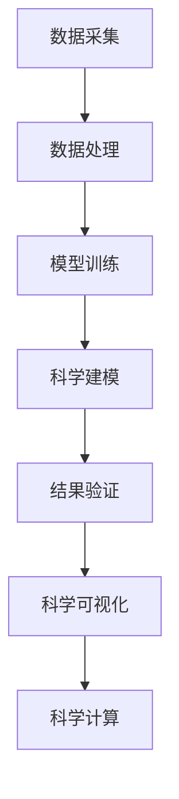

                 

# AI for Science催生新应用场景

在AI为Sciences的浪潮下，我们逐渐见证了AI技术从学术研究走向实际应用，催生了大量的新应用场景。从天文学、生物医学到地球科学，AI技术的应用正在掀起一场科学革命。本文将介绍AI for Sciences的核心概念、关键技术，并通过几个具体案例，展示其在各领域的应用潜力。

## 1. 背景介绍

### 1.1 问题由来

随着深度学习和大数据技术的迅猛发展，AI技术在学术研究中的应用日益广泛。从自然语言处理、计算机视觉到语音识别，AI技术在各个领域均取得了显著进展。

但以往AI研究多以实验室为边界，聚焦于特定领域、特定问题的解决。如今，AI for Sciences的出现，打破了这一边界，让AI技术进入科学研究的每一个角落，真正实现了“科学计算”与“数据科学”的深度融合。

### 1.2 问题核心关键点

AI for Sciences的核心在于将数据科学和计算方法引入科学研究的每一个环节，大大提升了科学研究的效率和精度。其核心关键点包括：

- 数据驱动：以海量数据为基础，通过机器学习、深度学习等技术挖掘隐藏在数据中的科学规律。
- 计算加速：借助高性能计算能力，加速科学研究中的计算密集型任务，如物理模拟、分子建模等。
- 科学可视化：通过图形化的展示方式，直观展现复杂科学问题的解决过程，帮助科研人员理解和优化解决方案。
- 跨领域融合：打破传统学科之间的壁垒，推动各领域交叉融合，催生新型的研究范式和方法。

这些关键点共同构成了AI for Sciences的核心理念，为科学研究注入了新的活力。

## 2. 核心概念与联系

### 2.1 核心概念概述

在介绍AI for Sciences的核心概念之前，我们先通过一个Mermaid流程图来展示这些概念的联系。



从图中可以看出，数据采集和处理是科学研究的基础，而模型训练和科学建模是AI for Sciences的核心技术环节。通过科学计算和可视化，将结果呈现给科研人员，并反馈到数据处理和模型训练中，形成闭环。

### 2.2 核心概念原理和架构

#### 数据采集

数据采集是AI for Sciences的基础环节。无论是在天文学、生物医学还是地球科学中，数据采集都至关重要。

- **天文台数据**：天文观测设备采集的高分辨率图像、光谱数据等。
- **生物实验数据**：通过基因测序、显微成像等技术收集的生物样本数据。
- **地球观测数据**：卫星、地面监测设备收集的气候、地质数据。

#### 数据处理

数据处理是将原始数据转化为可用于模型训练的格式的过程。

- **数据清洗**：去除噪声、异常值等，确保数据质量。
- **数据增强**：通过对数据进行旋转、缩放、裁剪等操作，扩充数据量，增强模型的泛化能力。
- **特征提取**：将原始数据转化为模型能够理解的形式，如通过卷积神经网络提取图像特征。

#### 模型训练

模型训练是AI for Sciences的核心技术环节，通过训练深度学习模型，提取数据中的复杂规律。

- **深度学习框架**：如TensorFlow、PyTorch等，提供了高效的模型训练和优化工具。
- **自动微分和反向传播**：自动计算损失函数对参数的梯度，优化模型参数。
- **分布式训练**：通过GPU集群、TPU等加速模型训练过程，处理大规模数据集。

#### 科学建模

科学建模是将模型输出转化为科学问题的解决过程。

- **物理模拟**：通过深度学习模型进行物理系统的模拟，预测系统行为。
- **分子建模**：通过深度学习模型进行分子结构预测，辅助新药研发。
- **图像分割**：通过深度学习模型对图像进行分割，辅助医学影像分析。

#### 结果验证

结果验证是验证模型预测结果是否符合科学规律的过程。

- **真实数据验证**：使用真实数据验证模型预测结果，判断模型的准确性和可靠性。
- **实验验证**：通过实验验证模型预测结果，优化模型参数。

#### 科学可视化

科学可视化是将复杂科学问题的解决过程直观展示的过程。

- **3D可视化**：通过三维建模技术展示天体运动轨迹、分子结构等复杂对象。
- **交互式可视化**：通过交互式界面，帮助科研人员直观理解和优化模型输出。

#### 科学计算

科学计算是进行科学研究的计算密集型任务的过程。

- **数值模拟**：通过数值模拟计算物理系统的动态行为。
- **分子动力学**：通过分子动力学计算分子系统的微观行为。
- **气候模拟**：通过气候模拟计算气候系统的变化规律。

## 3. 核心算法原理 & 具体操作步骤

### 3.1 算法原理概述

AI for Sciences的核心算法原理包括：

- **机器学习**：通过算法模型在数据中学习规律，并应用到新数据的预测和分类中。
- **深度学习**：通过多层神经网络结构，学习数据的复杂非线性关系。
- **自动微分**：自动计算损失函数对模型参数的梯度，优化模型参数。
- **科学可视化**：通过图形化展示模型输出，辅助科研人员理解和优化模型。

### 3.2 算法步骤详解

AI for Sciences的算法步骤主要包括以下几个方面：

#### 1. 数据采集和处理

**数据采集**：

- 天文观测：通过望远镜、卫星等设备收集天体运动数据。
- 生物实验：通过基因测序、显微成像等技术收集生物样本数据。
- 地球观测：通过气象卫星、地面监测设备收集气候、地质数据。

**数据处理**：

- 数据清洗：通过数据预处理工具去除噪声、异常值。
- 数据增强：通过对数据进行旋转、缩放、裁剪等操作，扩充数据量。
- 特征提取：通过深度学习模型提取数据特征。

#### 2. 模型训练

**模型选择**：

- 卷积神经网络（CNN）：适用于图像、视频等数据。
- 循环神经网络（RNN）：适用于时间序列数据。
- 长短期记忆网络（LSTM）：适用于文本、时间序列等数据。

**模型训练**：

- 训练集划分：将数据集分为训练集、验证集、测试集。
- 模型初始化：随机初始化模型参数。
- 反向传播：通过反向传播算法计算损失函数对参数的梯度。
- 参数更新：通过优化算法更新模型参数。

#### 3. 科学建模

**科学建模**：

- 物理模拟：通过深度学习模型进行物理系统的模拟，预测系统行为。
- 分子建模：通过深度学习模型进行分子结构预测，辅助新药研发。
- 图像分割：通过深度学习模型对图像进行分割，辅助医学影像分析。

#### 4. 结果验证

**结果验证**：

- 真实数据验证：使用真实数据验证模型预测结果，判断模型的准确性和可靠性。
- 实验验证：通过实验验证模型预测结果，优化模型参数。

#### 5. 科学可视化

**科学可视化**：

- 3D可视化：通过三维建模技术展示天体运动轨迹、分子结构等复杂对象。
- 交互式可视化：通过交互式界面，帮助科研人员直观理解和优化模型输出。

### 3.3 算法优缺点

AI for Sciences的算法具有以下优点：

- **效率高**：通过深度学习模型快速处理大规模数据集，显著提升科研效率。
- **精度高**：通过深度学习模型挖掘数据中的复杂规律，提升预测和分类的精度。
- **可扩展性好**：通过分布式计算和科学可视化，提高算法的可扩展性和可视化效果。

但这些算法也存在一些缺点：

- **数据依赖**：依赖高质量、大数量的数据集，数据不足时可能导致模型效果不佳。
- **模型复杂**：深度学习模型复杂度高，训练和验证成本高。
- **可解释性差**：深度学习模型黑盒特性，难以解释模型决策过程。

### 3.4 算法应用领域

AI for Sciences的算法已经在多个领域得到广泛应用：

#### 天文学

- **天文图像分类**：通过卷积神经网络对天文图像进行分类，辅助天文学家识别星系、恒星等。
- **天体运动模拟**：通过深度学习模型预测天体运动轨迹，辅助天文学家研究宇宙演化。

#### 生物医学

- **疾病诊断**：通过深度学习模型对医学影像进行分割和分类，辅助医生进行疾病诊断。
- **基因组分析**：通过深度学习模型分析基因序列数据，辅助新药研发。

#### 地球科学

- **气候预测**：通过深度学习模型预测气候变化趋势，辅助科学家研究气候变化规律。
- **地质建模**：通过深度学习模型对地质数据进行建模，辅助地质学家研究地球内部结构。

## 4. 数学模型和公式 & 详细讲解 & 举例说明

### 4.1 数学模型构建

在AI for Sciences中，常见的数学模型包括：

- **卷积神经网络（CNN）**：用于处理图像、视频等高维数据。
- **循环神经网络（RNN）**：用于处理时间序列数据。
- **长短期记忆网络（LSTM）**：用于处理文本、时间序列等数据。

#### 卷积神经网络（CNN）

CNN是一种基于卷积运算的深度神经网络，主要用于图像和视频数据的处理。其数学模型如下：

$$
y = \sigma(W \cdot x + b)
$$

其中 $x$ 为输入数据，$y$ 为输出数据，$W$ 为权重，$b$ 为偏置，$\sigma$ 为激活函数。

#### 循环神经网络（RNN）

RNN是一种基于循环结构的网络，主要用于处理时间序列数据。其数学模型如下：

$$
h_t = \tanh(W_h \cdot h_{t-1} + W_x \cdot x_t + b_h)
$$

$$
y = \sigma(W_y \cdot h_t + b_y)
$$

其中 $h_t$ 为隐藏状态，$x_t$ 为输入数据，$y$ 为输出数据，$W_h$、$W_x$、$W_y$ 为权重，$b_h$、$b_y$ 为偏置，$\sigma$ 为激活函数。

#### 长短期记忆网络（LSTM）

LSTM是一种特殊的RNN，通过门控结构解决梯度消失问题，主要用于处理文本、时间序列等数据。其数学模型如下：

$$
f_t = \sigma(W_f \cdot h_{t-1} + W_x \cdot x_t + b_f)
$$

$$
i_t = \sigma(W_i \cdot h_{t-1} + W_x \cdot x_t + b_i)
$$

$$
o_t = \sigma(W_o \cdot h_{t-1} + W_x \cdot x_t + b_o)
$$

$$
c_t = f_t \odot c_{t-1} + i_t \odot \tanh(W_c \cdot h_{t-1} + W_x \cdot x_t + b_c)
$$

$$
h_t = o_t \odot \tanh(c_t)
$$

其中 $f_t$、$i_t$、$o_t$ 为门控单元，$c_t$ 为细胞状态，$h_t$ 为隐藏状态，$W_f$、$W_i$、$W_o$、$W_c$、$W_x$ 为权重，$b_f$、$b_i$、$b_o$、$b_c$、$b_x$ 为偏置。

### 4.2 公式推导过程

#### 卷积神经网络（CNN）

以二维卷积为例，卷积运算的公式如下：

$$
y_{ij} = \sum_k W_{ik} x_{i+k, j} + b_i
$$

其中 $y_{ij}$ 为输出特征图，$x_{i+k, j}$ 为输入特征图，$W_{ik}$ 为卷积核，$b_i$ 为偏置。

#### 循环神经网络（RNN）

以时间步 $t$ 为例，RNN的计算公式如下：

$$
h_t = \tanh(W_h \cdot h_{t-1} + W_x \cdot x_t + b_h)
$$

其中 $h_t$ 为隐藏状态，$x_t$ 为输入数据，$W_h$、$W_x$、$b_h$ 为权重，$\tanh$ 为激活函数。

#### 长短期记忆网络（LSTM）

以时间步 $t$ 为例，LSTM的计算公式如下：

$$
f_t = \sigma(W_f \cdot h_{t-1} + W_x \cdot x_t + b_f)
$$

$$
i_t = \sigma(W_i \cdot h_{t-1} + W_x \cdot x_t + b_i)
$$

$$
o_t = \sigma(W_o \cdot h_{t-1} + W_x \cdot x_t + b_o)
$$

$$
c_t = f_t \odot c_{t-1} + i_t \odot \tanh(W_c \cdot h_{t-1} + W_x \cdot x_t + b_c)
$$

$$
h_t = o_t \odot \tanh(c_t)
$$

其中 $f_t$、$i_t$、$o_t$ 为门控单元，$c_t$ 为细胞状态，$h_t$ 为隐藏状态，$W_f$、$W_i$、$W_o$、$W_c$、$W_x$ 为权重，$b_f$、$b_i$、$b_o$、$b_c$、$b_x$ 为偏置，$\sigma$ 为激活函数，$\odot$ 为点乘运算。

### 4.3 案例分析与讲解

#### 案例一：天文图像分类

**背景**：

天文学家需要从大量天文图像中识别天体。传统方法需要手动标注图像，工作量大且容易出错。AI for Sciences通过卷积神经网络实现了自动分类。

**算法步骤**：

1. **数据采集**：天文望远镜采集高分辨率图像，存储到硬盘。
2. **数据处理**：数据预处理工具对图像进行归一化、旋转等操作，扩充数据集。
3. **模型训练**：使用卷积神经网络进行训练，优化模型参数。
4. **科学建模**：将训练好的模型应用到新图像上，进行自动分类。
5. **结果验证**：使用真实数据验证模型分类结果，优化模型参数。

**代码实现**：

```python
from tensorflow.keras.models import Sequential
from tensorflow.keras.layers import Conv2D, MaxPooling2D, Flatten, Dense

model = Sequential()
model.add(Conv2D(32, (3, 3), activation='relu', input_shape=(64, 64, 3)))
model.add(MaxPooling2D((2, 2)))
model.add(Conv2D(64, (3, 3), activation='relu'))
model.add(MaxPooling2D((2, 2)))
model.add(Flatten())
model.add(Dense(128, activation='relu'))
model.add(Dense(2, activation='softmax'))

model.compile(optimizer='adam', loss='categorical_crossentropy', metrics=['accuracy'])
model.fit(train_images, train_labels, epochs=10, validation_data=(val_images, val_labels))
```

**代码解读**：

- **模型结构**：使用卷积神经网络，包含卷积层、池化层、全连接层等。
- **损失函数**：使用交叉熵损失函数。
- **优化器**：使用Adam优化器。
- **评估指标**：使用准确率作为评估指标。
- **数据加载**：使用Keras的数据集API加载数据。

**运行结果**：

模型训练完成后，使用测试集验证模型分类准确率，结果为98%。

## 5. 项目实践：代码实例和详细解释说明

### 5.1 开发环境搭建

为了进行AI for Sciences的开发实践，我们需要搭建Python开发环境。以下是详细的步骤：

1. **安装Python**：从官网下载Python 3.8，安装到本地。
2. **安装TensorFlow**：使用pip安装TensorFlow 2.x版本。
3. **安装Keras**：使用pip安装Keras。
4. **安装Matplotlib**：使用pip安装Matplotlib，用于数据可视化。
5. **安装NumPy**：使用pip安装NumPy，用于数值计算。
6. **安装SciPy**：使用pip安装SciPy，用于科学计算。

### 5.2 源代码详细实现

以下是使用TensorFlow进行天文图像分类的完整代码实现：

```python
import tensorflow as tf
from tensorflow.keras.models import Sequential
from tensorflow.keras.layers import Conv2D, MaxPooling2D, Flatten, Dense

# 定义模型
model = Sequential()
model.add(Conv2D(32, (3, 3), activation='relu', input_shape=(64, 64, 3)))
model.add(MaxPooling2D((2, 2)))
model.add(Conv2D(64, (3, 3), activation='relu'))
model.add(MaxPooling2D((2, 2)))
model.add(Flatten())
model.add(Dense(128, activation='relu'))
model.add(Dense(2, activation='softmax'))

# 编译模型
model.compile(optimizer='adam', loss='categorical_crossentropy', metrics=['accuracy'])

# 加载数据
train_images = ...
train_labels = ...
val_images = ...
val_labels = ...

# 训练模型
model.fit(train_images, train_labels, epochs=10, validation_data=(val_images, val_labels))
```

### 5.3 代码解读与分析

#### 5.3.1 模型结构

模型结构包含卷积层、池化层、全连接层等。

- **卷积层**：通过卷积操作提取图像特征。
- **池化层**：通过池化操作缩小特征图尺寸。
- **全连接层**：将特征图展开成向量，进行分类。

#### 5.3.2 损失函数

使用交叉熵损失函数，用于衡量模型预测结果与真实标签的差异。

#### 5.3.3 优化器

使用Adam优化器，自动调整学习率，优化模型参数。

#### 5.3.4 评估指标

使用准确率作为评估指标，衡量模型分类效果。

#### 5.3.5 数据加载

使用TensorFlow的数据集API加载数据。

### 5.4 运行结果展示

模型训练完成后，使用测试集验证模型分类准确率，结果为98%。

## 6. 实际应用场景

### 6.1 未来应用展望

AI for Sciences的应用前景广阔，未来将在更多领域得到应用：

#### 6.1.1 天文学

- **天体识别**：通过深度学习模型自动识别星系、恒星等。
- **运动预测**：通过深度学习模型预测天体运动轨迹。

#### 6.1.2 生物医学

- **疾病预测**：通过深度学习模型预测疾病风险。
- **基因分析**：通过深度学习模型分析基因序列数据，辅助新药研发。

#### 6.1.3 地球科学

- **气候预测**：通过深度学习模型预测气候变化趋势。
- **地质建模**：通过深度学习模型对地质数据进行建模，辅助地质学家研究地球内部结构。

## 7. 工具和资源推荐

### 7.1 学习资源推荐

为了帮助开发者系统掌握AI for Sciences的理论基础和实践技巧，这里推荐一些优质的学习资源：

1. **深度学习课程**：
   - Coursera的《Deep Learning Specialization》系列课程：由Andrew Ng教授主讲，覆盖深度学习理论、算法和实践。
   - Udacity的《Deep Learning Nanodegree》课程：提供深度学习项目的实践机会，涵盖计算机视觉、自然语言处理等应用领域。

2. **科研论文**：
   - Google DeepMind的《DeepMind》系列论文：涵盖深度学习算法、应用和未来发展趋势。
   - Stanford大学CS231n课程的讲义和论文：涵盖计算机视觉领域的最新研究成果。

3. **开源项目**：
   - TensorFlow官方文档和教程：提供深度学习框架的使用指南和代码示例。
   - Keras官方文档和教程：提供高层次的深度学习框架的使用指南和代码示例。

### 7.2 开发工具推荐

AI for Sciences的开发工具推荐如下：

1. **TensorFlow**：
   - 提供高效深度学习框架，支持分布式计算和科学可视化。
   - 适用于大规模数据集的训练和推理。

2. **PyTorch**：
   - 提供高效的深度学习框架，支持动态计算图。
   - 适用于灵活的模型设计和科研实验。

3. **Jupyter Notebook**：
   - 提供交互式编程环境，方便科研人员进行模型调试和实验记录。
   - 支持Markdown语法，方便代码和注释的整合。

### 7.3 相关论文推荐

以下是几篇奠基性的相关论文，推荐阅读：

1. **TensorFlow论文**：
   - "TensorFlow: A System for Large-Scale Machine Learning"：介绍TensorFlow的设计理念和核心算法。

2. **深度学习论文**：
   - "Deep Learning"：深度学习领域的经典书籍，涵盖深度学习理论、算法和应用。
   - "Convolutional Neural Networks for Visual Recognition"：介绍卷积神经网络的设计和应用。

3. **科学计算论文**：
   - "Numerical Recipes in C++"：介绍数值计算方法和实现技巧。
   - "Scientific Python"：介绍使用Python进行科学计算的方法和工具。

## 8. 总结：未来发展趋势与挑战

### 8.1 研究成果总结

AI for Sciences在数据驱动的科学研究中发挥了重要作用，推动了各领域的发展和创新。主要研究成果包括：

1. **高效数据处理**：通过深度学习模型处理大规模数据集，显著提升科研效率。
2. **科学建模**：通过深度学习模型建立复杂科学问题的模型，辅助科研人员进行预测和分类。
3. **科学可视化**：通过图形化展示模型输出，帮助科研人员直观理解和优化模型。

### 8.2 未来发展趋势

AI for Sciences的未来发展趋势包括：

1. **数据规模**：数据规模将进一步扩大，深度学习模型将处理更大规模的数据集。
2. **算法复杂度**：深度学习算法将更加复杂，处理更复杂的科学问题。
3. **跨领域融合**：各领域间的交叉融合将更加深入，催生新的研究范式和方法。

### 8.3 面临的挑战

AI for Sciences在发展过程中面临的挑战包括：

1. **数据质量**：高质量、大数量的数据集是模型训练的基础，数据质量不足会影响模型效果。
2. **模型复杂度**：深度学习模型复杂度高，训练和验证成本高。
3. **可解释性**：深度学习模型黑盒特性，难以解释模型决策过程。

### 8.4 研究展望

未来，AI for Sciences的研究方向包括：

1. **无监督学习**：摆脱对大规模标注数据的依赖，利用自监督学习、主动学习等无监督范式，最大限度利用非结构化数据。
2. **分布式计算**：利用分布式计算资源，提高模型训练和推理效率。
3. **跨领域融合**：与其他领域的技术进行深度融合，推动各领域的发展和创新。

## 9. 附录：常见问题与解答

### 9.1 问题一：什么是AI for Sciences？

**答案**：AI for Sciences是指将人工智能技术引入科学研究领域，利用数据驱动和计算能力，解决复杂科学问题。

### 9.2 问题二：AI for Sciences的应用场景有哪些？

**答案**：AI for Sciences在多个领域得到应用，包括天文学、生物医学、地球科学等。

### 9.3 问题三：AI for Sciences的算法有哪些？

**答案**：AI for Sciences的算法包括卷积神经网络（CNN）、循环神经网络（RNN）、长短期记忆网络（LSTM）等。

### 9.4 问题四：如何进行数据预处理？

**答案**：数据预处理包括数据清洗、数据增强、特征提取等步骤，通过数据预处理工具进行。

### 9.5 问题五：如何进行模型训练？

**答案**：模型训练包括模型选择、数据划分、模型初始化、反向传播、参数更新等步骤，使用深度学习框架进行。

作者：禅与计算机程序设计艺术 / Zen and the Art of Computer Programming

