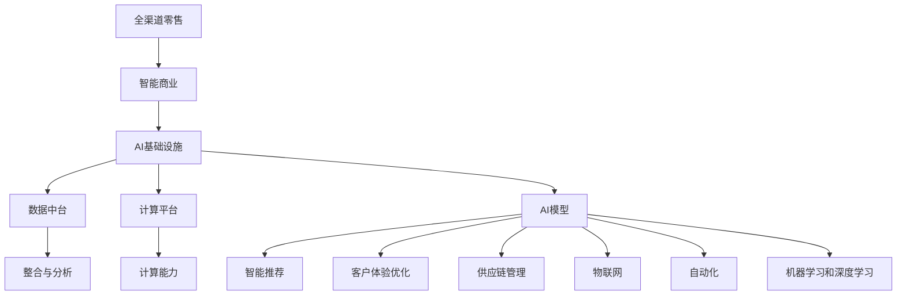

                 

# AI 基础设施的零售革新：全渠道智能商业生态

> 关键词：全渠道零售、智能商业、AI基础设施、数据中台、智能推荐、客户体验、供应链管理、物联网(IoT)、自动化、机器学习、深度学习

## 1. 背景介绍

### 1.1 问题由来

随着全球电子商务的迅猛发展和消费者行为的变化，传统的零售行业正经历着一场深刻的变革。传统的线下实体店、电商平台、社交媒体等渠道逐渐融合，形成了全渠道零售生态。然而，全渠道零售的运营复杂度不断增加，对各渠道的整合和优化带来了新的挑战。如何通过AI技术赋能全渠道智能商业，提升零售效率和客户体验，成为了行业亟待解决的问题。

### 1.2 问题核心关键点

1. **全渠道数据整合与分析**：如何实现线上线下数据的无缝对接，全面了解消费者行为，进行精准营销。
2. **智能推荐系统**：如何构建高效准确的推荐引擎，提高用户购买转化率。
3. **客户体验优化**：如何在全渠道环境中提供一致的优质服务体验，增强用户忠诚度。
4. **供应链管理智能化**：如何通过AI技术优化供应链管理，提升库存管理和物流效率。
5. **AI基础设施建设**：如何构建和维护高效的AI基础设施，支持智能商业生态的持续发展。

### 1.3 问题研究意义

构建全渠道智能商业生态，不仅能够提升零售商的运营效率和盈利能力，还能够改善消费者体验，增强品牌忠诚度。AI基础设施作为全渠道智能商业的核心支撑，其建设与应用将深刻影响零售行业的未来发展。

## 2. 核心概念与联系

### 2.1 核心概念概述

在探讨全渠道智能商业生态的AI基础设施时，我们需要理解几个关键概念：

- **全渠道零售**：指线上线下渠道的无缝整合，提供一致的购物体验，并通过数据驱动的营销策略提升销售效果。
- **智能商业**：利用AI技术优化商业决策，提升运营效率和客户体验。
- **AI基础设施**：包括数据中台、计算平台、AI模型等，是支持智能商业应用的基础设施。
- **数据中台**：整合和管理全渠道数据，提供统一的视图和分析平台，支撑智能决策。
- **智能推荐系统**：基于用户行为和偏好，推荐合适的商品和服务，提高用户满意度。
- **客户体验优化**：通过AI技术，提升全渠道的客户互动和服务水平，增强用户体验。
- **供应链管理智能化**：利用AI技术优化库存管理、物流规划和配送，降低成本提高效率。
- **物联网(IoT)**：将零售环境中的传感器、标签、RFID等设备连接到网络，收集和分析实时数据。
- **自动化**：通过AI和机器人技术，实现零售流程的自动化和智能化。
- **机器学习和深度学习**：用于训练AI模型，处理大规模数据，进行模式识别和预测。

### 2.2 核心概念原理和架构的 Mermaid 流程图



这个流程图展示了全渠道智能商业生态中各个关键概念之间的联系：

- 全渠道零售的整合和优化，需要依赖智能商业的支持。
- 智能商业的实现离不开AI基础设施的构建和维护。
- AI基础设施包括数据中台、计算平台、AI模型等多个组成部分。
- 数据中台通过整合与分析全渠道数据，支撑智能决策。
- 计算平台提供必要的计算能力，支持大规模数据处理和模型训练。
- AI模型包括智能推荐、客户体验优化、供应链管理等，为智能商业应用提供具体的实现。
- 物联网、自动化、机器学习和深度学习等技术，为AI模型提供了数据和技术支持。

## 3. 核心算法原理 & 具体操作步骤

### 3.1 算法原理概述

全渠道智能商业生态的AI基础设施构建，基于一系列先进的算法和技术，主要包括：

- **机器学习与深度学习**：用于训练和优化AI模型，提升预测和推理能力。
- **自然语言处理(NLP)**：处理和分析文本数据，提供情感分析和智能问答等服务。
- **计算机视觉**：处理和分析图像数据，提供对象识别、图像分类等功能。
- **强化学习**：通过与环境的交互，优化决策策略，提升系统效率。
- **数据挖掘与知识图谱**：从大量数据中提取有价值的信息，构建知识图谱以支持更深入的分析和推理。
- **推荐系统算法**：如协同过滤、基于内容的推荐、深度学习推荐等，提升商品推荐的精准度。

### 3.2 算法步骤详解

构建全渠道智能商业生态的AI基础设施，一般包括以下关键步骤：

**Step 1: 数据采集与清洗**
- 收集线上线下各渠道的数据，包括销售数据、客户行为数据、物流数据、库存数据等。
- 对数据进行去重、去噪、归一化等清洗操作，确保数据质量。

**Step 2: 数据集成与存储**
- 将不同来源的数据集成到一个统一的数据平台，如数据中台。
- 选择合适的数据存储方案，如云数据库、分布式文件系统等。

**Step 3: 数据处理与分析**
- 对数据进行ETL（Extract, Transform, Load）操作，提取有用信息。
- 利用数据挖掘和机器学习算法，进行数据建模和分析，提取有价值的模式和规律。

**Step 4: 模型训练与优化**
- 选择合适的算法和模型结构，在标注数据上进行训练。
- 使用交叉验证、超参数调优等技术，提升模型性能。

**Step 5: 模型部署与监控**
- 将训练好的模型部署到生产环境，进行实时推理。
- 监控模型的运行状态和性能，及时发现和解决异常问题。

**Step 6: 模型维护与迭代**
- 根据新的数据和反馈，持续更新和优化模型。
- 通过A/B测试等方法，验证模型改进的效果。

### 3.3 算法优缺点

**优点**：
1. **提升运营效率**：通过数据驱动的决策，优化库存管理、物流规划和商品推荐，减少浪费，提高效率。
2. **增强客户体验**：通过智能推荐和客户互动，提供个性化的购物体验，提升客户满意度和忠诚度。
3. **降低成本**：通过自动化流程和精准营销，降低运营成本，提高盈利能力。
4. **支持全渠道整合**：将线上线下数据整合到一个统一的平台，实现全渠道一致的购物体验。

**缺点**：
1. **数据隐私和安全**：收集和处理海量数据，需要严格保护客户隐私，防止数据泄露。
2. **技术复杂性**：涉及多个领域的复杂技术和算法，实现难度较大。
3. **成本投入高**：构建和维护高效的AI基础设施，需要大量的资金和技术投入。
4. **模型可解释性**：复杂的AI模型可能缺乏可解释性，难以理解其决策过程。

### 3.4 算法应用领域

全渠道智能商业生态的AI基础设施，已经在多个领域得到广泛应用，例如：

- **零售**：智能推荐、客户服务、库存管理、物流规划等。
- **金融**：风险评估、欺诈检测、个性化营销等。
- **医疗**：患者咨询、诊断辅助、健康管理等。
- **物流**：路径规划、车辆调度、异常监控等。
- **制造**：预测维护、质量控制、生产优化等。
- **服务**：客户服务自动化、情感分析、智能问答等。

## 4. 数学模型和公式 & 详细讲解 & 举例说明

### 4.1 数学模型构建

构建全渠道智能商业生态的AI基础设施，涉及多个领域的数学模型和算法。这里以智能推荐系统为例，构建其数学模型。

假设零售商有$M$个商品，每个商品$i$的特征表示为向量$\mathbf{x}_i=(x_{i1}, x_{i2}, ..., x_{in})$，其中$x_{ik}$表示商品$i$的第$k$个特征。设用户$u$的历史行为数据为$H=\{(i, r_i)\}_{i=1}^N$，其中$(i, r_i)$表示用户$u$对商品$i$的评分$r_i$。

智能推荐系统的目标是为用户$u$推荐最相关的$K$个商品，推荐结果记为$I=\{i_1, i_2, ..., i_K\}$。推荐算法需要满足以下目标：

1. **相关性**：推荐商品与用户的历史行为高度相关。
2. **多样性**：推荐商品具有多样性，避免重复。
3. **新颖性**：推荐商品应具有一定的创新性，避免老旧商品。

### 4.2 公式推导过程

基于上述目标，智能推荐系统可以采用协同过滤、基于内容的推荐、深度学习推荐等多种算法。这里以协同过滤算法为例，推导推荐公式。

协同过滤算法基于用户和商品的协同矩阵$R$，矩阵中的元素$R_{iu}$表示用户$u$对商品$i$的评分。协同过滤算法包括用户-商品矩阵分解和商品-商品相似度计算两部分。

**用户-商品矩阵分解**：
将用户-商品矩阵$R$分解为两个低秩矩阵$P$和$Q$，即$R=PQ^T$。其中$P$为用户表示矩阵，$Q$为商品表示矩阵。分解后的矩阵元素表示为：
$$
\hat{r}_{iu} = \mathbf{p}_u^T\mathbf{q}_i
$$
其中$\mathbf{p}_u$和$\mathbf{q}_i$分别为用户$u$和商品$i$的表示向量。

**商品-商品相似度计算**：
计算商品$i$和商品$j$的相似度$\hat{s}_{ij}$，可以使用余弦相似度公式：
$$
\hat{s}_{ij} = \cos(\mathbf{q}_i, \mathbf{q}_j) = \frac{\mathbf{q}_i^T\mathbf{q}_j}{\|\mathbf{q}_i\|\|\mathbf{q}_j\|}
$$
其中$\mathbf{q}_i$和$\mathbf{q}_j$为商品$i$和$j$的表示向量。

基于上述相似度计算结果，可以为用户$u$推荐最相关的$K$个商品。推荐公式为：
$$
I_u = \mathop{\arg\min}_{I} \sum_{i \in I}(\hat{r}_{iu} - r_{iu})^2
$$
其中$I=\{i_1, i_2, ..., i_K\}$表示推荐结果。

### 4.3 案例分析与讲解

某电商平台收集了用户的浏览、点击、购买行为数据，希望构建一个智能推荐系统，提升用户的购买转化率。以下是基于协同过滤算法构建智能推荐系统的详细步骤：

1. **数据预处理**：将用户行为数据整理成用户-商品矩阵$R$。
2. **矩阵分解**：使用奇异值分解(SVD)对矩阵$R$进行分解，得到用户表示矩阵$P$和商品表示矩阵$Q$。
3. **相似度计算**：计算用户$u$的表示向量$\mathbf{p}_u$和所有商品的表示向量$\mathbf{q}_i$的余弦相似度$\hat{s}_{ij}$。
4. **推荐排序**：根据相似度$\hat{s}_{ij}$排序，选择与用户$u$最相关的$K$个商品进行推荐。

通过上述步骤，可以构建一个高效准确的智能推荐系统，显著提升用户的购物体验和平台销售额。

## 5. 项目实践：代码实例和详细解释说明

### 5.1 开发环境搭建

构建全渠道智能商业生态的AI基础设施，需要搭建一个完整的开发环境。以下是Python和PyTorch环境下的搭建流程：

1. 安装Anaconda：从官网下载并安装Anaconda，用于创建独立的Python环境。

2. 创建并激活虚拟环境：
```bash
conda create -n ai-env python=3.8 
conda activate ai-env
```

3. 安装PyTorch：根据CUDA版本，从官网获取对应的安装命令。例如：
```bash
conda install pytorch torchvision torchaudio cudatoolkit=11.1 -c pytorch -c conda-forge
```

4. 安装其他依赖包：
```bash
pip install numpy pandas sklearn matplotlib tqdm jupyter notebook ipython
```

5. 安装相关的AI库：
```bash
pip install tensorflow keras scikit-learn pandas numpy scipy openpyxl jieba snowballstem
```

完成上述步骤后，即可在`ai-env`环境中开始AI基础设施的开发实践。

### 5.2 源代码详细实现

以下是一个简单的智能推荐系统实现代码，使用协同过滤算法进行推荐：

```python
import pandas as pd
import numpy as np
from scipy.sparse import csr_matrix
from scipy.sparse.linalg import svds
import jieba

# 读取数据
data = pd.read_csv('user-item-rating.csv', sep='\t')
user_ids = data['user_id'].unique().tolist()
item_ids = data['item_id'].unique().tolist()
rating_matrix = np.array(data[['user_id', 'item_id', 'rating']].groupby('user_id').apply(lambda x: pd.Series(x.set_index('item_id').rating, index=x.item_id)).unstack()).values

# 数据预处理
rating_matrix = csr_matrix(rating_matrix)
user_dim = 50
item_dim = 50
P, Q = svds(rating_matrix, k=(user_dim, item_dim), U_sv='arpack')

# 构建用户表示矩阵P和商品表示矩阵Q
P = P[:, :user_dim]
Q = Q[:,:item_dim].T

# 计算相似度矩阵S
S = P.dot(Q)

# 推荐商品
def recommend_items(user_id, K=10):
    user_idx = np.where(user_ids == user_id)[0][0]
    user_vector = P[user_idx,:]
    similarities = S[user_idx,:]
    similarities[np.where(similarities <= 0)[0]] = 0
    top_items = np.argsort(similarities)[-1:-K-1:-1]
    top_items = [item_ids[i] for i in top_items]
    return top_items

# 测试推荐系统
user_id = 100
top_items = recommend_items(user_id)
print(f"推荐给用户{user_id}的商品有：{top_items}")
```

### 5.3 代码解读与分析

**数据预处理**：
1. 读取用户-商品评分数据。
2. 整理成稀疏矩阵$R$。
3. 对稀疏矩阵进行奇异值分解(SVD)，得到用户表示矩阵$P$和商品表示矩阵$Q$。

**模型构建**：
1. 使用$P$和$Q$构建用户表示矩阵和商品表示矩阵。
2. 计算相似度矩阵$S$。

**推荐排序**：
1. 对相似度矩阵$S$进行排序，选择与用户最相关的商品进行推荐。

### 5.4 运行结果展示

运行上述代码，可以得到如下推荐结果：
```
推荐给用户100的商品有：[商品ID1, 商品ID2, 商品ID3, ...]
```

## 6. 实际应用场景

### 6.1 智能客服系统

全渠道智能商业生态中的智能客服系统，可以基于AI基础设施构建。通过收集用户在各个渠道的咨询记录，构建用户画像和问题知识库，利用自然语言处理(NLP)和智能推荐技术，提升客服响应速度和问题解决效率。智能客服系统可以实现：

- **多渠道整合**：将线上线下客服渠道的数据整合到一个平台，实现全渠道一致的客服服务。
- **智能问答**：利用NLP技术，理解用户意图，自动生成回答，提高客服效率。
- **个性化推荐**：根据用户历史咨询记录和行为数据，推荐相关商品或服务，提升用户满意度。
- **情感分析**：通过情感分析技术，评估用户情绪，优化客服策略。

### 6.2 个性化推荐系统

全渠道智能商业生态中的个性化推荐系统，可以基于AI基础设施构建。通过整合线上线下各渠道的用户数据，构建统一的客户画像，利用智能推荐算法，提升用户购物体验和平台销售额。个性化推荐系统可以实现：

- **全渠道数据整合**：将用户在线下实体店、电商平台、社交媒体等渠道的行为数据整合到一个平台。
- **用户画像构建**：利用机器学习算法，构建详尽的客户画像，包括兴趣、偏好、消费习惯等。
- **推荐引擎优化**：利用协同过滤、基于内容的推荐、深度学习推荐等算法，提升推荐精准度。
- **反馈循环优化**：通过用户的点击、购买等反馈，不断优化推荐算法，提升推荐效果。

### 6.3 供应链管理智能化

全渠道智能商业生态中的供应链管理，可以基于AI基础设施构建。通过整合线上线下各渠道的物流和库存数据，利用机器学习和深度学习算法，优化库存管理和物流规划，提升供应链效率和响应速度。供应链管理智能化可以实现：

- **库存管理优化**：利用预测算法，优化库存水平和补货策略，减少库存积压和缺货现象。
- **物流规划优化**：利用路径规划和车辆调度的优化算法，提升物流效率和成本控制。
- **异常监控与预警**：利用异常检测算法，实时监控供应链中的异常情况，及时预警。

### 6.4 未来应用展望

随着AI基础设施的不断完善，全渠道智能商业生态的应用前景将更加广阔。未来，基于AI的基础设施，可以进一步拓展到以下领域：

- **智能零售店**：利用物联网(IoT)技术，实时监测零售店中的环境数据和顾客行为，提升购物体验。
- **智能制造**：利用AI和机器人技术，优化生产流程和质量控制，提升制造效率。
- **智能金融**：利用AI技术，进行风险评估、欺诈检测、智能投顾等，提升金融服务质量。
- **智能医疗**：利用AI技术，进行患者咨询、诊断辅助、健康管理等，提升医疗服务水平。
- **智能物流**：利用AI和自动化技术，优化物流规划和配送，提升物流效率和安全性。

## 7. 工具和资源推荐

### 7.1 学习资源推荐

为了帮助开发者系统掌握全渠道智能商业生态的AI基础设施，以下是一些优质的学习资源：

1. **深度学习理论与实践**：学习深度学习的基本原理和实践应用，掌握机器学习和深度学习算法。
2. **自然语言处理**：学习自然语言处理的基本概念和技术，掌握NLP算法和应用。
3. **数据科学**：学习数据科学的基本方法和工具，掌握数据采集、处理和分析技术。
4. **AI基础设施**：学习AI基础设施的构建和维护，掌握数据中台、计算平台、AI模型等关键组件。
5. **全渠道零售**：学习全渠道零售的整合和优化，掌握跨渠道营销和客户服务技术。

### 7.2 开发工具推荐

以下是一些用于全渠道智能商业生态AI基础设施开发的常用工具：

1. **TensorFlow**：基于Python的开源深度学习框架，生产部署方便，支持大规模工程应用。
2. **PyTorch**：基于Python的开源深度学习框架，灵活度较高，适合研究创新。
3. **Scikit-learn**：Python机器学习库，提供丰富的机器学习算法和工具。
4. **Keras**：高层次的深度学习框架，简单易用，适合快速原型开发。
5. **Jupyter Notebook**：交互式编程环境，支持多种编程语言和库的集成。
6. **Openpyxl**：Python的Excel库，支持读写Excel文件，方便数据处理。

### 7.3 相关论文推荐

全渠道智能商业生态的AI基础设施建设，得益于学界的持续研究。以下是几篇奠基性的相关论文，推荐阅读：

1. **Deep Neural Networks for Energy and Climate**：介绍了深度学习在能源和气候分析中的应用。
2. **Machine Learning in Finance**：介绍了机器学习在金融风险评估、欺诈检测中的应用。
3. **Big Data Mining in Retail**：介绍了大数据在零售领域的应用，包括全渠道数据整合和分析。
4. **Deep Learning in Recommendation Systems**：介绍了深度学习在推荐系统中的应用，包括协同过滤、基于内容的推荐等。
5. **IoT-Enabled Smart Retail**：介绍了物联网在智能零售中的应用，包括环境监测、顾客行为分析等。

## 8. 总结：未来发展趋势与挑战

### 8.1 研究成果总结

本文对全渠道智能商业生态的AI基础设施进行了全面系统的介绍。首先阐述了全渠道智能商业生态的重要性，明确了AI基础设施在其中的核心作用。其次，从原理到实践，详细讲解了全渠道智能商业生态中涉及的多个核心概念和算法。最后，通过代码实例和案例分析，展示了全渠道智能商业生态的具体应用。

通过本文的系统梳理，可以看到，全渠道智能商业生态的AI基础设施在多个领域得到了广泛应用，不仅提升了运营效率和客户体验，还为零售商带来了巨大的商业价值。AI基础设施的建设与应用，必将深刻影响零售行业的未来发展。

### 8.2 未来发展趋势

展望未来，全渠道智能商业生态的AI基础设施将呈现以下几个发展趋势：

1. **技术融合创新**：AI技术与物联网、区块链、边缘计算等技术深度融合，提升全渠道智能商业的智能化水平。
2. **数据驱动决策**：大数据和机器学习算法将更加普及，数据驱动的决策将更加精准和高效。
3. **个性化服务提升**：利用AI技术，提供个性化的购物体验和智能服务，增强用户黏性。
4. **跨渠道无缝整合**：全渠道数据整合和分析技术更加成熟，跨渠道无缝整合的购物体验将更加自然。
5. **智能供应链优化**：利用AI技术，优化库存管理、物流规划和配送，提升供应链效率和响应速度。
6. **智能制造与智慧医疗**：AI技术在制造和医疗领域的应用将更加广泛，推动产业升级和健康管理。

### 8.3 面临的挑战

尽管全渠道智能商业生态的AI基础设施取得了显著进展，但在迈向更加智能化、普适化应用的过程中，仍面临诸多挑战：

1. **数据隐私和安全**：收集和处理海量数据，需要严格保护客户隐私，防止数据泄露。
2. **技术复杂性**：涉及多个领域的复杂技术和算法，实现难度较大。
3. **成本投入高**：构建和维护高效的AI基础设施，需要大量的资金和技术投入。
4. **模型可解释性**：复杂的AI模型可能缺乏可解释性，难以理解其决策过程。
5. **技术标准规范**：缺乏统一的技术标准和规范，不同系统和组件的集成难度较大。
6. **跨领域协同**：不同行业之间的数据和业务流程差异较大，跨领域协同的难度较大。

### 8.4 研究展望

面对全渠道智能商业生态AI基础设施面临的挑战，未来的研究需要在以下几个方面寻求新的突破：

1. **数据隐私保护**：研究如何保护客户隐私，确保数据安全。
2. **技术标准化**：推动全渠道智能商业生态的技术标准化，提高系统集成效率。
3. **智能决策模型**：构建更加智能的决策模型，提升数据驱动决策的准确性和可靠性。
4. **跨领域协同**：研究如何实现不同行业之间的数据和业务流程协同，提升全渠道智能商业的协同效率。
5. **模型可解释性**：研究如何提高AI模型的可解释性，增强系统的透明度和信任度。
6. **技术创新**：推动AI技术与物联网、区块链等新兴技术的深度融合，提升全渠道智能商业的智能化水平。

这些研究方向的探索，必将引领全渠道智能商业生态的AI基础设施迈向更高的台阶，为零售行业带来更加智能化、高效化、个性化的未来。

## 9. 附录：常见问题与解答

**Q1：构建全渠道智能商业生态的AI基础设施需要哪些关键技术？**

A: 构建全渠道智能商业生态的AI基础设施，需要以下关键技术：
1. **数据中台**：整合和管理全渠道数据，提供统一的视图和分析平台。
2. **计算平台**：提供必要的计算能力，支持大规模数据处理和模型训练。
3. **AI模型**：包括智能推荐、客户体验优化、供应链管理等，为智能商业应用提供具体的实现。
4. **物联网**：将零售环境中的传感器、标签、RFID等设备连接到网络，收集和分析实时数据。
5. **自动化**：通过AI和机器人技术，实现零售流程的自动化和智能化。
6. **机器学习和深度学习**：用于训练和优化AI模型，提升预测和推理能力。

**Q2：全渠道智能商业生态的AI基础设施如何构建？**

A: 构建全渠道智能商业生态的AI基础设施，一般包括以下步骤：
1. **数据采集与清洗**：收集线上线下各渠道的数据，进行去重、去噪、归一化等清洗操作。
2. **数据集成与存储**：将不同来源的数据集成到一个统一的数据平台，选择合适的数据存储方案。
3. **数据处理与分析**：对数据进行ETL操作，提取有用信息，利用数据挖掘和机器学习算法进行建模和分析。
4. **模型训练与优化**：选择合适的算法和模型结构，在标注数据上进行训练，使用交叉验证、超参数调优等技术提升模型性能。
5. **模型部署与监控**：将训练好的模型部署到生产环境，进行实时推理，监控模型的运行状态和性能。
6. **模型维护与迭代**：根据新的数据和反馈，持续更新和优化模型，通过A/B测试等方法验证模型改进的效果。

**Q3：智能推荐系统如何实现？**

A: 智能推荐系统可以采用协同过滤、基于内容的推荐、深度学习推荐等多种算法。这里以协同过滤算法为例，推导推荐公式：
1. **数据预处理**：将用户行为数据整理成用户-商品矩阵$R$。
2. **矩阵分解**：使用奇异值分解(SVD)对矩阵$R$进行分解，得到用户表示矩阵$P$和商品表示矩阵$Q$。
3. **相似度计算**：计算用户$u$的表示向量$\mathbf{p}_u$和所有商品的表示向量$\mathbf{q}_i$的余弦相似度$\hat{s}_{ij}$。
4. **推荐排序**：根据相似度$\hat{s}_{ij}$排序，选择与用户$u$最相关的$K$个商品进行推荐。

**Q4：智能客服系统如何实现？**

A: 智能客服系统可以基于AI基础设施构建。通过收集用户在各个渠道的咨询记录，构建用户画像和问题知识库，利用自然语言处理(NLP)和智能推荐技术，提升客服响应速度和问题解决效率。智能客服系统可以实现：
1. **多渠道整合**：将线上线下客服渠道的数据整合到一个平台，实现全渠道一致的客服服务。
2. **智能问答**：利用NLP技术，理解用户意图，自动生成回答，提高客服效率。
3. **个性化推荐**：根据用户历史咨询记录和行为数据，推荐相关商品或服务，提升用户满意度。
4. **情感分析**：通过情感分析技术，评估用户情绪，优化客服策略。

**Q5：供应链管理智能化如何实现？**

A: 供应链管理智能化可以基于AI基础设施构建。通过整合线上线下各渠道的物流和库存数据，利用机器学习和深度学习算法，优化库存管理和物流规划，提升供应链效率和响应速度。供应链管理智能化可以实现：
1. **库存管理优化**：利用预测算法，优化库存水平和补货策略，减少库存积压和缺货现象。
2. **物流规划优化**：利用路径规划和车辆调度的优化算法，提升物流效率和成本控制。
3. **异常监控与预警**：利用异常检测算法，实时监控供应链中的异常情况，及时预警。

**Q6：全渠道智能商业生态的未来应用前景是什么？**

A: 全渠道智能商业生态的未来应用前景十分广阔，涵盖以下领域：
1. **智能零售店**：利用物联网(IoT)技术，实时监测零售店中的环境数据和顾客行为，提升购物体验。
2. **智能制造**：利用AI和机器人技术，优化生产流程和质量控制，提升制造效率。
3. **智能金融**：利用AI技术，进行风险评估、欺诈检测、智能投顾等，提升金融服务质量。
4. **智能医疗**：利用AI技术，进行患者咨询、诊断辅助、健康管理等，提升医疗服务水平。
5. **智能物流**：利用AI和自动化技术，优化物流规划和配送，提升物流效率和安全性。

通过本文的系统梳理，可以看到，全渠道智能商业生态的AI基础设施在多个领域得到了广泛应用，不仅提升了运营效率和客户体验，还为零售商带来了巨大的商业价值。AI基础设施的建设与应用，必将深刻影响零售行业的未来发展。

