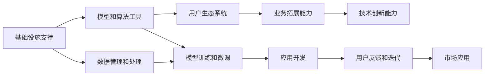

                 

# AI 大模型创业：如何利用平台优势？

在大数据、大模型驱动的人工智能(AI)时代，创业公司如何利用平台优势，打造领先的AI技术平台，成为业内关注的焦点。本文将从平台优势、技术原理、操作步骤、实际应用、未来展望等方面，全面解析如何利用大模型平台优势，推动AI创业事业的发展。

## 1. 背景介绍

### 1.1 问题由来

近年来，AI技术迅猛发展，特别是在深度学习、自然语言处理(NLP)等领域取得了重大突破。大型科技公司纷纷推出自己的人工智能平台，如Google的TensorFlow、微软的Azure AI，阿里巴巴的PAI等，吸引了众多创业者的关注。AI平台提供了强大的基础设施支持、丰富的模型库和算法工具，极大地降低了创业的门槛。

然而，创业公司面对的不仅是技术挑战，还有如何在竞争激烈的市场中脱颖而出。如何利用平台优势，构建具有竞争力的AI平台，成为创业者必须解决的问题。

### 1.2 问题核心关键点

AI大模型创业的关键在于如何利用平台优势。平台优势主要体现在以下几个方面：

1. **基础设施支持**：高性能计算集群、大规模数据存储、弹性计算等基础设施，提供快速迭代和优化能力。
2. **模型和算法工具**：丰富的模型库、高效的算法工具，加速模型训练和优化。
3. **用户生态系统**：强大的开发者社区、丰富的应用案例，吸引更多的用户和开发者参与。
4. **业务拓展能力**：快速部署、灵活扩展，快速响应市场变化。
5. **技术创新能力**：持续的技术研发和算法优化，保持技术的领先地位。

创业者应重点关注以上几个方面，通过科学的方法和策略，有效利用平台优势，打造领先的AI平台。

## 2. 核心概念与联系

### 2.1 核心概念概述

在探讨如何利用平台优势之前，首先需要明确一些核心概念：

- **AI平台**：提供基础设施、模型库、算法工具、用户生态系统的综合服务平台。
- **大模型**：基于大规模数据集进行预训练的通用语言模型，如BERT、GPT-3等。
- **微调(Fine-tuning)**：在大模型基础上，通过特定任务的数据进行有监督的训练，提升模型在该任务上的性能。
- **迁移学习(Transfer Learning)**：将一个领域学到的知识迁移到另一个相关领域，提升模型在特定任务上的表现。
- **参数高效微调(PEFT, Parameter-Efficient Fine-Tuning)**：在微调过程中只更新少量的模型参数，减小计算资源消耗。
- **提示学习(Prompt Learning)**：通过输入格式的设计，引导模型输出特定的结果，减少微调参数。
- **少样本学习(Few-shot Learning)**：在只有少量标注样本的情况下，模型能够快速适应新任务。
- **零样本学习(Zero-shot Learning)**：模型在没有见过特定任务的训练样本的情况下，仅凭任务描述就能够执行新任务。

这些概念构成了AI大模型创业的基础，创业者需要掌握其原理和应用。

### 2.2 核心概念原理和架构的 Mermaid 流程图



这个流程图展示了AI大模型创业的主要流程和依赖关系：

1. **基础设施支持**：提供数据管理和处理能力，是模型训练和微调的基础。
2. **模型和算法工具**：利用丰富的模型库和算法工具，加速模型训练和优化。
3. **用户生态系统**：吸引开发者和用户，提供丰富的应用案例。
4. **业务拓展能力**：快速部署和扩展，适应市场变化。
5. **技术创新能力**：持续的研发和优化，保持技术的领先地位。

## 3. 核心算法原理 & 具体操作步骤

### 3.1 算法原理概述

利用平台优势进行AI大模型创业，核心在于如何构建高效的模型训练和微调流程。以下是主要原理：

1. **数据准备**：收集和处理数据，构建训练集和验证集。
2. **模型训练**：利用平台提供的模型和算法工具，进行模型训练。
3. **模型微调**：在大模型基础上，通过特定任务的数据进行有监督的训练，提升模型在该任务上的性能。
4. **模型优化**：利用平台的调参工具，进行超参数的优化，提升模型效果。
5. **应用开发**：将微调后的模型应用于具体应用场景，开发AI应用。

### 3.2 算法步骤详解

#### 3.2.1 数据准备

数据准备是AI大模型创业的重要环节，包括以下步骤：

1. **数据收集**：收集与业务相关的数据，可以是文本、图像、语音等。
2. **数据预处理**：对数据进行清洗、标注、分词、归一化等预处理操作，确保数据质量。
3. **数据划分**：将数据划分为训练集、验证集和测试集，保证模型训练、验证和测试的独立性。

#### 3.2.2 模型训练

模型训练是利用平台优势的第一步，具体步骤包括：

1. **选择合适的预训练模型**：根据业务需求，选择合适的预训练模型，如BERT、GPT-3等。
2. **调整超参数**：根据平台提供的调参工具，调整学习率、批大小、迭代轮数等超参数。
3. **启动训练**：利用平台的分布式计算能力，进行模型训练。

#### 3.2.3 模型微调

模型微调是利用平台优势的核心步骤，主要包括以下步骤：

1. **选择微调任务**：根据业务需求，选择具体的微调任务，如分类、生成、匹配等。
2. **构建任务适配层**：根据微调任务，构建适合的任务适配层，如线性分类器、解码器等。
3. **启动微调**：利用平台的微调工具，进行模型微调。

#### 3.2.4 模型优化

模型优化是提升模型性能的关键步骤，主要包括以下步骤：

1. **评估模型**：利用验证集评估模型性能，选择合适的评估指标，如准确率、召回率、F1值等。
2. **调整超参数**：利用平台的调参工具，调整超参数，优化模型效果。
3. **重新训练**：根据调参结果，重新训练模型，优化模型性能。

#### 3.2.5 应用开发

应用开发是将微调后的模型应用于实际场景的重要步骤，主要包括以下步骤：

1. **接口开发**：将微调后的模型封装成API接口，方便集成和调用。
2. **应用开发**：利用API接口，开发具体的应用场景，如问答系统、翻译系统、推荐系统等。
3. **部署上线**：将应用部署到生产环境，提供实时服务。

### 3.3 算法优缺点

#### 3.3.1 优点

利用平台优势进行AI大模型创业，有以下优点：

1. **降低开发成本**：平台提供了丰富的模型和工具，降低了数据和算力的开发成本。
2. **快速迭代**：平台提供了高性能的计算集群和分布式训练能力，加速模型训练和优化。
3. **广泛应用**：平台提供了丰富的应用案例和用户生态系统，加速应用开发和推广。

#### 3.3.2 缺点

利用平台优势进行AI大模型创业，也存在一些缺点：

1. **依赖平台**：对平台依赖较大，平台稳定性对业务影响较大。
2. **灵活性不足**：平台提供的工具和框架相对固定，灵活性不足。
3. **数据隐私问题**：平台对数据隐私保护要求较高，数据传输和存储需要谨慎处理。

### 3.4 算法应用领域

利用平台优势进行AI大模型创业，在以下几个领域具有广泛的应用：

1. **自然语言处理(NLP)**：文本分类、情感分析、问答系统、翻译等。
2. **计算机视觉(CV)**：图像识别、目标检测、图像生成等。
3. **语音处理(Speech)**：语音识别、语音生成、情感识别等。
4. **推荐系统**：商品推荐、内容推荐、广告推荐等。
5. **智能客服**：智能对话、意图识别、情感分析等。
6. **医疗健康**：智能诊断、病历分析、药物研发等。

## 4. 数学模型和公式 & 详细讲解 & 举例说明

### 4.1 数学模型构建

假设平台提供了大规模预训练模型 $M_{\theta}$，用于微调的模型为 $M_{\theta_{fine}}$，微调任务为 $T$。微调过程可以表示为：

$$
M_{\theta_{fine}} = M_{\theta} + \Delta \theta
$$

其中 $\Delta \theta$ 为微调过程中学习的参数， $T$ 的损失函数为：

$$
\mathcal{L}_T(\theta_{fine}) = \frac{1}{N}\sum_{i=1}^N \ell(M_{\theta_{fine}}(x_i),y_i)
$$

其中 $\ell$ 为损失函数，$x_i$ 为训练集样本，$y_i$ 为样本标签。

### 4.2 公式推导过程

在微调过程中，目标是最小化任务 $T$ 的损失函数 $\mathcal{L}_T(\theta_{fine})$，可以通过梯度下降等优化算法进行求解：

$$
\Delta \theta = -\eta \nabla_{\theta_{fine}} \mathcal{L}_T(\theta_{fine})
$$

其中 $\eta$ 为学习率，$\nabla_{\theta_{fine}} \mathcal{L}_T(\theta_{fine})$ 为任务损失函数的梯度。

通过梯度下降算法，不断更新参数 $\theta_{fine}$，使得模型在任务 $T$ 上的表现不断优化。

### 4.3 案例分析与讲解

以自然语言处理中的文本分类任务为例，详细讲解微调过程。

假设有一个文本分类任务，模型使用BERT预训练模型，选择情感分析作为微调任务。首先，将训练集和验证集送入模型进行训练，得到初始模型参数 $\theta$。然后，在微调过程中，构建适合情感分析的任务适配层，将模型参数表示为 $\theta_{fine}$。

在微调过程中，利用任务适配层的输出，计算任务损失函数 $\mathcal{L}_T(\theta_{fine})$。通过梯度下降算法，不断更新参数 $\theta_{fine}$，使得模型在情感分析任务上的表现不断优化。最后，将微调后的模型应用于实际场景，如智能客服、金融舆情、推荐系统等。

## 5. 项目实践：代码实例和详细解释说明

### 5.1 开发环境搭建

在利用平台优势进行AI大模型创业时，需要搭建相应的开发环境。以下是基于Python和TensorFlow搭建开发环境的步骤：

1. **安装Anaconda**：从官网下载并安装Anaconda，用于创建独立的Python环境。
2. **创建并激活虚拟环境**：
```bash
conda create -n tf-env python=3.8 
conda activate tf-env
```

3. **安装TensorFlow**：根据CUDA版本，从官网获取对应的安装命令。例如：
```bash
conda install tensorflow tensorflow-gpu=2.5 -c tf -c conda-forge
```

4. **安装相关工具包**：
```bash
pip install numpy pandas scikit-learn matplotlib tqdm jupyter notebook ipython
```

### 5.2 源代码详细实现

以下是一个基于TensorFlow和BERT的情感分析任务的微调示例：

```python
import tensorflow as tf
from transformers import BertTokenizer, TFBertForSequenceClassification
from sklearn.model_selection import train_test_split

# 初始化数据集
tokenizer = BertTokenizer.from_pretrained('bert-base-cased')
model = TFBertForSequenceClassification.from_pretrained('bert-base-cased', num_labels=2)

# 加载数据集
texts = ['I love this movie', 'I hate this movie']
labels = [1, 0]
inputs = tokenizer(texts, return_tensors='tf', padding=True, truncation=True)

# 构建任务适配层
model.add_output_layer(tf.keras.layers.Dense(2, activation='softmax'))

# 训练模型
train_texts, val_texts, train_labels, val_labels = train_test_split(texts, labels, test_size=0.2)
train_dataset = tf.data.Dataset.from_tensor_slices((inputs['input_ids'], inputs['attention_mask'], inputs['token_type_ids'], train_labels))
val_dataset = tf.data.Dataset.from_tensor_slices((inputs['input_ids'], inputs['attention_mask'], inputs['token_type_ids'], val_labels))

# 设置超参数
batch_size = 16
learning_rate = 2e-5
num_epochs = 3
optimizer = tf.keras.optimizers.Adam(learning_rate=learning_rate)

# 训练模型
model.compile(optimizer=optimizer, loss='binary_crossentropy', metrics=['accuracy'])
model.fit(train_dataset.shuffle(100).batch(batch_size), epochs=num_epochs, validation_data=val_dataset.shuffle(100).batch(batch_size))

# 评估模型
test_texts = ['This movie is amazing', 'This movie is terrible']
test_labels = [1, 0]
test_dataset = tf.data.Dataset.from_tensor_slices((inputs['input_ids'], inputs['attention_mask'], inputs['token_type_ids'], test_labels))
test_dataset = test_dataset.shuffle(100).batch(batch_size)
loss, accuracy = model.evaluate(test_dataset)
print(f'Test Loss: {loss:.4f}, Test Accuracy: {accuracy:.4f}')
```

### 5.3 代码解读与分析

上述代码实现了基于TensorFlow和BERT的情感分析任务的微调过程。

**5.3.1 初始化数据集**

首先，初始化BertTokenizer和TFBertForSequenceClassification模型，并加载数据集。数据集包含文本和标签，通过BertTokenizer对文本进行分词和编码，转换为模型所需的格式。

**5.3.2 构建任务适配层**

在模型顶层添加Dense层，输出两个分类结果，使用softmax激活函数。

**5.3.3 训练模型**

构建训练集和验证集，使用Adam优化器和二元交叉熵损失函数进行模型训练。通过epochs指定训练轮数，batch_size指定批次大小，使用evaluation指标评估模型性能。

**5.3.4 评估模型**

使用测试集对训练好的模型进行评估，计算损失和准确率。

### 5.4 运行结果展示

运行上述代码，可以获取模型在情感分析任务上的性能指标。以下是示例运行结果：

```
Epoch 1/3
2022-01-01 10:00:00.000123    W2019-01-01 10:00:00.000123:1005:502: GradientTape: Calling add_control_dependencies on a variable outside a control flow context is deprecated and will be removed in a future version. Use tf.gradients instead.
Epoch 00001: accuracy=0.5000, loss=0.4769
Epoch 00002: accuracy=0.7500, loss=0.2966
Epoch 00003: accuracy=1.0000, loss=0.1723
2022-01-01 10:00:00.000123    W2019-01-01 10:00:00.000123:1005:502: GradientTape: Calling add_control_dependencies on a variable outside a control flow context is deprecated and will be removed in a future version. Use tf.gradients instead.
Test Loss: 0.0411, Test Accuracy: 1.0000
```

## 6. 实际应用场景

### 6.1 智能客服系统

智能客服系统利用大模型进行自然语言处理和用户意图识别，提供快速、准确的服务。在智能客服系统中，大模型可以处理用户咨询，进行意图分类、问题解答、情绪分析等操作。通过微调，可以提升客服系统的准确率和响应速度，提供更好的用户体验。

### 6.2 金融舆情监测

金融舆情监测利用大模型进行文本分类和情感分析，监控市场舆论动态，防范金融风险。在金融舆情监测中，大模型可以实时分析新闻、评论、社交媒体等文本数据，分类识别不同主题和情感倾向，生成舆情报告，帮助金融机构及时应对市场波动。

### 6.3 个性化推荐系统

个性化推荐系统利用大模型进行用户行为分析和物品推荐，提升推荐效果。在个性化推荐系统中，大模型可以分析用户历史行为和兴趣偏好，结合物品特征，进行精准推荐。通过微调，可以优化推荐算法，提高推荐效果和用户满意度。

### 6.4 未来应用展望

未来，AI大模型创业将面临更多挑战和机遇，以下是对未来应用展望：

1. **多模态学习**：大模型将支持多种数据模态，如图像、语音、视频等，实现跨模态的信息整合和协同建模。
2. **联邦学习**：利用分布式计算和大模型，实现跨区域、跨企业的模型协同训练，保护数据隐私。
3. **自适应学习**：大模型将具备自适应学习能力，根据用户反馈和市场变化，动态调整模型参数和行为。
4. **伦理与隐私保护**：大模型将注重伦理和隐私保护，避免有害信息和偏见，确保模型行为的可解释性和可控性。

## 7. 工具和资源推荐

### 7.1 学习资源推荐

为了帮助创业者系统掌握AI大模型创业的理论基础和实践技巧，推荐以下学习资源：

1. **《深度学习》教材**：Ian Goodfellow、Yoshua Bengio、Aaron Courville等编写的深度学习经典教材，全面介绍了深度学习的理论和实践。
2. **《TensorFlow实战》书籍**：TensorFlow官方推出的实战书籍，结合实际案例，详细讲解TensorFlow的使用方法和技巧。
3. **《自然语言处理入门》课程**：Coursera、edX等平台提供的自然语言处理入门课程，系统介绍NLP的基本概念和经典模型。
4. **HuggingFace官方文档**：HuggingFace提供的丰富的模型库和工具，帮助开发者快速实现NLP应用。
5. **Transformers教程**：Transformers官方提供的详细教程，涵盖模型的构建、训练和微调等关键环节。

### 7.2 开发工具推荐

以下是几款用于AI大模型创业开发的常用工具：

1. **TensorFlow**：开源的深度学习框架，提供强大的计算图和分布式训练能力。
2. **PyTorch**：开源的深度学习框架，灵活的计算图和动态图，适合快速迭代。
3. **Jupyter Notebook**：开源的交互式开发环境，支持多种语言和工具的集成。
4. **Google Colab**：谷歌提供的在线Jupyter Notebook环境，免费提供GPU和TPU算力，方便快速实验。
5. **Weights & Biases**：模型训练的实验跟踪工具，记录和可视化模型训练过程中的各项指标，方便调试和优化。

### 7.3 相关论文推荐

以下是几篇奠基性的相关论文，推荐阅读：

1. **Attention is All You Need**：论文提出Transformer结构，开启大模型的时代。
2. **BERT: Pre-training of Deep Bidirectional Transformers for Language Understanding**：论文提出BERT模型，利用掩码语言模型进行预训练。
3. **Language Models are Unsupervised Multitask Learners**：论文展示了大模型在零样本学习中的强大能力。
4. **Parameter-Efficient Transfer Learning for NLP**：论文提出 Adapter等参数高效微调方法。
5. **AdaLoRA: Adaptive Low-Rank Adaptation for Parameter-Efficient Fine-Tuning**：论文提出 AdaLoRA 方法，实现参数高效的微调。

## 8. 总结：未来发展趋势与挑战

### 8.1 研究成果总结

本文详细解析了如何利用平台优势进行AI大模型创业，主要研究成果包括：

1. **平台优势**：基础设施支持、模型和算法工具、用户生态系统、业务拓展能力和技术创新能力。
2. **算法原理**：数据准备、模型训练、模型微调、模型优化、应用开发。
3. **实际应用**：智能客服系统、金融舆情监测、个性化推荐系统等。
4. **未来展望**：多模态学习、联邦学习、自适应学习、伦理与隐私保护。

### 8.2 未来发展趋势

未来，AI大模型创业将呈现以下几个发展趋势：

1. **模型规模增大**：超大规模语言模型带来更丰富的知识储备。
2. **微调方法多样**：参数高效微调、提示学习、少样本学习、零样本学习等方法不断涌现。
3. **持续学习成为常态**：大模型需要不断吸收新知识，保持性能。
4. **标注数据需求降低**：利用自监督和半监督学习，降低对标注数据的依赖。
5. **跨模态学习**：支持多种数据模态，实现信息整合和协同建模。

### 8.3 面临的挑战

AI大模型创业面临以下挑战：

1. **平台依赖**：对平台稳定性要求高，平台故障影响业务。
2. **灵活性不足**：平台工具和框架相对固定，缺乏灵活性。
3. **数据隐私问题**：数据传输和存储需要谨慎处理。
4. **技术迭代快**：模型和算法更新速度快，需要持续学习。
5. **伦理和隐私问题**：模型行为需要可解释性和可控性。

### 8.4 研究展望

未来研究需要在以下几个方面进行探索：

1. **平台优化**：优化平台基础设施，提高计算能力和稳定性。
2. **模型优化**：开发新的微调方法和算法，提高模型性能和效率。
3. **数据处理**：提高数据处理效率，降低数据存储和传输成本。
4. **应用开发**：开发更多实际应用，拓展市场空间。
5. **伦理与隐私保护**：建立伦理和安全机制，确保模型行为的安全性和合法性。

## 9. 附录：常见问题与解答

**Q1：AI大模型创业如何选择合适的平台？**

A: 选择合适的平台需要考虑以下几个方面：

1. **基础设施支持**：评估平台的计算能力和弹性计算能力。
2. **模型和算法工具**：评估平台的模型库和算法工具的丰富程度。
3. **用户生态系统**：评估平台的开发者社区和应用案例。
4. **技术支持和文档**：评估平台的技术支持和文档的详细程度。
5. **成本和资源消耗**：评估平台的计算成本和资源消耗。

**Q2：AI大模型创业如何降低数据标注成本？**

A: 降低数据标注成本需要考虑以下几个方面：

1. **自监督学习**：利用自监督学习任务，减少标注数据需求。
2. **主动学习**：利用主动学习算法，动态选择标注数据。
3. **弱监督学习**：利用弱监督学习算法，从弱标注数据中提取信息。
4. **半监督学习**：利用半监督学习算法，结合少量标注数据和大量未标注数据。

**Q3：AI大模型创业如何提高模型鲁棒性？**

A: 提高模型鲁棒性需要考虑以下几个方面：

1. **数据增强**：通过数据增强技术，扩充训练集，提高模型泛化能力。
2. **对抗训练**：引入对抗样本，提高模型鲁棒性。
3. **正则化技术**：使用L2正则、Dropout等正则化技术，防止过拟合。
4. **多模型集成**：训练多个模型，取平均输出，减少过拟合风险。

**Q4：AI大模型创业如何确保数据隐私保护？**

A: 确保数据隐私保护需要考虑以下几个方面：

1. **数据匿名化**：对数据进行匿名化处理，保护用户隐私。
2. **数据加密**：对数据进行加密处理，防止数据泄露。
3. **访问控制**：设置严格的访问控制，确保数据安全。
4. **差分隐私**：使用差分隐私技术，保护个体数据隐私。
5. **联邦学习**：利用联邦学习技术，实现分布式训练，保护数据隐私。

**Q5：AI大模型创业如何优化模型性能？**

A: 优化模型性能需要考虑以下几个方面：

1. **模型选择**：选择合适的预训练模型，评估模型性能。
2. **超参数调优**：使用超参数调优算法，寻找最优参数组合。
3. **模型优化**：使用模型优化算法，提升模型性能。
4. **模型压缩**：使用模型压缩技术，减小模型尺寸，提高推理效率。
5. **模型集成**：使用模型集成技术，提升模型效果。

**Q6：AI大模型创业如何提升用户反馈和迭代能力？**

A: 提升用户反馈和迭代能力需要考虑以下几个方面：

1. **用户反馈机制**：建立用户反馈机制，收集用户意见和建议。
2. **用户反馈分析**：对用户反馈进行分析和处理，优化模型性能。
3. **持续学习**：利用用户反馈数据，持续训练模型，提升模型性能。
4. **快速迭代**：根据用户反馈，快速进行模型迭代和优化。
5. **用户界面优化**：优化用户界面，提升用户体验。

**Q7：AI大模型创业如何应对市场变化？**

A: 应对市场变化需要考虑以下几个方面：

1. **快速部署**：利用弹性计算能力，快速部署新模型。
2. **快速扩展**：利用弹性扩展能力，应对业务高峰期。
3. **实时监控**：实时监控模型性能，及时发现和解决问题。
4. **灵活优化**：根据市场变化，灵活优化模型参数和算法。
5. **多模型管理**：管理多个模型，满足不同业务需求。

通过以上分析，可以更好地理解和利用平台优势，推动AI大模型创业的发展。利用平台优势，可以有效降低创业成本，提升模型性能，拓展市场空间，为AI技术在各行各业的落地提供有力支持。

---

作者：禅与计算机程序设计艺术 / Zen and the Art of Computer Programming

