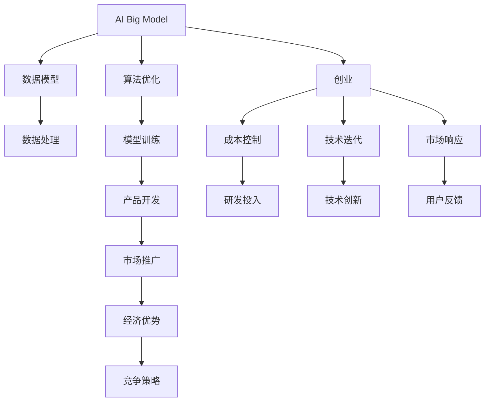

                 

# AI 大模型创业：如何利用经济优势？

> 关键词：人工智能大模型,创业,经济优势,竞争策略,数据模型,算法优化

## 1. 背景介绍

### 1.1 问题由来
随着人工智能（AI）技术的迅速发展，AI大模型因其强大的能力在各行业中得到了广泛的应用。AI大模型可以通过海量的数据进行训练，学习到复杂的知识模式，从而在诸如自然语言处理（NLP）、计算机视觉（CV）、生成对抗网络（GAN）等领域展现出卓越的性能。创业公司利用这些技术优势，在市场上占据了一席之地。但与此同时，创业公司也面临着高昂的研发成本、技术复杂性、市场竞争等多方面的挑战。

### 1.2 问题核心关键点
在创业初期，合理利用AI大模型的经济优势，不仅可以降低研发成本，提高产品竞争力，还能快速占领市场。因此，本文旨在探讨如何通过大模型驱动创业，并详细分析其经济优势和潜在的策略。

## 2. 核心概念与联系

### 2.1 核心概念概述

要深入理解如何利用AI大模型驱动创业，首先需要了解几个核心概念：

- **人工智能大模型（AI Big Model）**：指采用先进的深度学习技术，如Transformer、BERT、GPT等，在大规模数据上预训练得到的大型神经网络模型，能够高效地处理复杂的NLP、CV、GAN等任务。

- **创业**：指利用技术、资源等要素创立新公司，追求商业价值和社会效益。

- **经济优势**：指创业公司通过AI大模型在降低成本、提升效率、增强竞争力等方面的经济利益。

- **竞争策略**：指在市场竞争中，通过合理利用AI大模型来提高产品或服务的市场竞争力。

这些概念之间的联系如下：AI大模型为创业公司提供了强大的技术基础，而经济优势和竞争策略则是创业公司利用这一技术优势，在市场中立足并获取成功的手段。

### 2.2 核心概念原理和架构的 Mermaid 流程图



这个流程图展示了AI大模型在创业中的关键作用：通过大规模数据训练大模型，将其应用于产品开发，并通过市场推广实现经济优势，同时利用竞争策略提升竞争力。

## 3. 核心算法原理 & 具体操作步骤

### 3.1 算法原理概述

利用AI大模型进行创业的核心在于算法的优化和应用，通过优化算法，提高模型效率，减少研发成本，提升产品竞争力。

AI大模型的训练通常采用以下步骤：

1. **数据收集与预处理**：收集大量标注数据，进行数据清洗和预处理。
2. **模型训练**：使用深度学习框架（如TensorFlow、PyTorch）训练大模型，调整超参数，优化模型性能。
3. **模型部署与优化**：将训练好的模型部署到服务器，进行性能调优和优化，降低计算资源消耗。
4. **应用与反馈**：将模型应用到实际产品中，收集用户反馈，进行模型迭代优化。

### 3.2 算法步骤详解

以下是基于AI大模型的创业具体操作流程：

**Step 1: 数据收集与预处理**

- **收集数据**：根据产品需求，收集标注数据。数据可以是文本、图片、音频等多种形式，要求数据量大、标注准确。
- **数据清洗**：处理缺失值、噪声等，确保数据质量。
- **数据增强**：对数据进行扩充和增强，如旋转、裁剪、翻转等，提高模型泛化能力。

**Step 2: 模型训练**

- **选择合适的模型**：如BERT、GPT-3等大模型。
- **设置超参数**：调整学习率、批大小、迭代轮数等。
- **训练模型**：使用GPU/TPU等高性能设备，进行大规模并行训练。
- **模型评估**：使用验证集评估模型性能，调整超参数。

**Step 3: 模型部署与优化**

- **部署模型**：将训练好的模型部署到云服务器或本地服务器。
- **性能优化**：使用模型剪枝、量化等技术，降低计算资源消耗。
- **实时响应**：优化推理速度，确保实时响应。

**Step 4: 应用与反馈**

- **产品开发**：将模型嵌入产品中，如聊天机器人、视觉识别、推荐系统等。
- **收集反馈**：收集用户使用数据，反馈给模型进行优化。
- **迭代优化**：根据用户反馈，不断优化模型和产品。

### 3.3 算法优缺点

**优点**：
- **高效**：大模型能处理大规模数据，快速提升模型性能。
- **通用性**：大模型适用于多种NLP、CV等任务，可快速应用。
- **成本低**：不需要从头开始构建模型，降低了研发成本。

**缺点**：
- **资源需求高**：大模型需要大量计算资源，硬件成本高。
- **过拟合风险**：大模型容易出现过拟合，需要大量数据和复杂算法。
- **技术门槛高**：大模型训练和部署需要较高的技术水平。

### 3.4 算法应用领域

AI大模型在多个领域有广泛的应用：

- **自然语言处理（NLP）**：聊天机器人、文本分类、情感分析等。
- **计算机视觉（CV）**：图像识别、人脸识别、视频分析等。
- **生成对抗网络（GAN）**：图像生成、视频生成、语音生成等。
- **推荐系统**：个性化推荐、广告推荐、内容推荐等。

## 4. 数学模型和公式 & 详细讲解 & 举例说明

### 4.1 数学模型构建

在AI大模型中，常用的数学模型包括：

- **神经网络模型**：如卷积神经网络（CNN）、循环神经网络（RNN）、Transformer等。
- **深度学习模型**：如自编码器（AE）、生成对抗网络（GAN）等。

### 4.2 公式推导过程

以Transformer模型为例，其训练过程涉及多个步骤，包括前向传播、后向传播和梯度下降等。

**前向传播**：
$$
y = \text{Encoder}(x) = \text{Multi-head Attention}(\text{Embedding}(x)) \cdot \text{Feed-Forward Network}(\text{Multi-head Attention}(\text{Embedding}(x)))
$$

**后向传播**：
$$
\text{Loss} = \text{Cross-Entropy Loss}(y, \hat{y})
$$

**梯度下降**：
$$
\theta \leftarrow \theta - \eta \nabla_{\theta}\text{Loss}(\theta)
$$

其中，$x$为输入，$\text{Embedding}$为嵌入层，$\text{Multi-head Attention}$为多头注意力机制，$\text{Feed-Forward Network}$为前馈网络，$y$为模型输出，$\hat{y}$为目标输出，$\text{Cross-Entropy Loss}$为交叉熵损失，$\eta$为学习率，$\nabla_{\theta}\text{Loss}$为损失函数对模型参数的梯度。

### 4.3 案例分析与讲解

以图像分类为例，使用预训练的ResNet模型进行微调。

**Step 1: 数据预处理**

- **数据增强**：随机裁剪、旋转、翻转等。
- **归一化**：将数据归一化到[0,1]或[-1,1]之间。

**Step 2: 模型微调**

- **选择合适的模型**：ResNet-50。
- **设置超参数**：学习率0.001，迭代轮数100。
- **训练模型**：使用GPU进行并行训练。
- **模型评估**：使用验证集评估模型性能，调整超参数。

**Step 3: 模型部署**

- **导出模型**：使用`torch.save()`保存模型参数。
- **加载模型**：使用`torch.load()`加载模型参数。
- **推理预测**：对新数据进行推理预测。

## 5. 项目实践：代码实例和详细解释说明

### 5.1 开发环境搭建

在搭建开发环境前，需要先安装Python、PyTorch、TensorFlow等深度学习框架，以及相关依赖库。

**Step 1: 安装Python和依赖库**

```bash
sudo apt-get update
sudo apt-get install python3 python3-pip
pip install torch torchvision torchaudio numpy scipy matplotlib Pillow
```

**Step 2: 安装TensorFlow和相关依赖**

```bash
pip install tensorflow==2.4.0
pip install tensorflow-hub
```

**Step 3: 安装模型和数据集**

```bash
git clone https://github.com/pytorch/vision.git
cd vision
pip install .
```

### 5.2 源代码详细实现

以下是一个使用PyTorch和ResNet模型进行图像分类的示例代码：

```python
import torch
import torch.nn as nn
import torchvision.transforms as transforms
from torchvision.models import resnet50

# 定义模型
model = resnet50(pretrained=True)

# 定义训练函数
def train(model, dataloader, criterion, optimizer):
    model.train()
    for batch_idx, (data, target) in enumerate(dataloader):
        data, target = data.to(device), target.to(device)
        optimizer.zero_grad()
        output = model(data)
        loss = criterion(output, target)
        loss.backward()
        optimizer.step()
```

### 5.3 代码解读与分析

**模型定义**：使用预训练的ResNet-50模型，通过`pretrained=True`参数直接加载预训练权重。

**训练函数**：在训练过程中，将模型置于训练模式，对输入数据进行前向传播，计算损失函数并反向传播更新模型参数。

**数据处理**：使用`torchvision.transforms`对数据进行预处理，包括随机裁剪、归一化等。

**模型评估**：在验证集上评估模型性能，使用`model.eval()`模式进行推理预测。

### 5.4 运行结果展示

在完成训练后，使用验证集评估模型性能：

```python
import torch.nn.functional as F
import torchvision.datasets as datasets

# 加载数据集
train_dataset = datasets.CIFAR10(root='./data', train=True, download=True, transform=transforms.Compose([
    transforms.RandomCrop(32, padding=4),
    transforms.RandomHorizontalFlip(),
    transforms.ToTensor(),
    transforms.Normalize((0.4914, 0.4822, 0.4465), (0.2023, 0.1994, 0.2010))
]))

# 加载数据加载器
train_loader = torch.utils.data.DataLoader(train_dataset, batch_size=32, shuffle=True, num_workers=2)

# 定义损失函数
criterion = nn.CrossEntropyLoss()

# 定义优化器
optimizer = torch.optim.SGD(model.parameters(), lr=0.001, momentum=0.9)

# 训练模型
train(model, train_loader, criterion, optimizer)
```

## 6. 实际应用场景

### 6.1 自然语言处理（NLP）

AI大模型在NLP领域有广泛的应用，如聊天机器人、情感分析、文本分类等。

**聊天机器人**：使用BERT或GPT-3模型，对用户输入进行意图识别，匹配最佳回答，实现自然语言交互。

**情感分析**：对用户评论、产品评价等文本数据进行情感极性分类，使用BERT模型进行微调。

**文本分类**：对新闻、文章等文本数据进行主题分类，使用BERT模型进行微调。

### 6.2 计算机视觉（CV）

AI大模型在CV领域的应用包括图像识别、人脸识别、视频分析等。

**图像识别**：使用ResNet、VGG等模型，对图像进行分类、识别等任务。

**人脸识别**：使用FaceNet、ResNet等模型，对图像进行人脸检测和识别。

**视频分析**：使用I3D、C3D等模型，对视频进行行为识别、对象检测等任务。

### 6.3 生成对抗网络（GAN）

GAN在图像生成、视频生成、语音生成等方面展现了强大的能力。

**图像生成**：使用GAN模型，生成逼真的人脸、动物、风景等图像。

**视频生成**：使用GAN模型，生成逼真的视频，如老旧视频翻新、动画生成等。

**语音生成**：使用GAN模型，生成自然流畅的语音，如语音合成、情感语音生成等。

### 6.4 推荐系统

AI大模型在推荐系统中的应用包括个性化推荐、广告推荐、内容推荐等。

**个性化推荐**：使用TensorFlow或PyTorch，构建推荐模型，对用户行为数据进行分析和推荐。

**广告推荐**：使用深度学习模型，对用户行为数据进行分析和推荐，优化广告投放效果。

**内容推荐**：使用深度学习模型，对用户行为数据进行分析和推荐，优化内容推荐效果。

## 7. 工具和资源推荐

### 7.1 学习资源推荐

为了帮助创业公司快速掌握AI大模型的应用，推荐以下学习资源：

1. **Coursera**：提供深度学习和NLP相关的课程，如《深度学习》、《自然语言处理》等。
2. **edX**：提供计算机视觉和深度学习的课程，如《计算机视觉基础》、《深度学习》等。
3. **Udacity**：提供深度学习相关的项目课程，如《深度学习项目》、《自然语言处理》等。
4. **Google AI**：提供深度学习相关的教程和文档，如《TensorFlow教程》、《BERT教程》等。
5. **Kaggle**：提供机器学习竞赛和数据集，可以用于实践和竞赛。

### 7.2 开发工具推荐

以下是几款用于AI大模型开发的常用工具：

1. **PyTorch**：基于Python的开源深度学习框架，支持动态计算图，灵活易用。
2. **TensorFlow**：由Google主导的深度学习框架，支持静态计算图和动态计算图，生产部署方便。
3. **Transformers**：由Hugging Face开发的NLP工具库，支持BERT、GPT-3等大模型的微调。
4. **Jupyter Notebook**：开源的交互式笔记本，支持Python、R等多种编程语言。
5. **TensorBoard**：TensorFlow的可视化工具，支持模型训练过程中的实时监控。

### 7.3 相关论文推荐

以下几篇论文为AI大模型应用提供了理论支持：

1. **Attention is All You Need**：Transformer论文，提出了Transformer模型，开启了大模型时代。
2. **BERT: Pre-training of Deep Bidirectional Transformers for Language Understanding**：提出了BERT模型，采用掩码语言模型进行预训练，刷新了多项NLP任务SOTA。
3. **GPT-3: Language Models are Unsupervised Multitask Learners**：提出了GPT-3模型，展示了大模型在少样本学习方面的能力。
4. **AdaLoRA: Adaptive Low-Rank Adaptation for Parameter-Efficient Fine-Tuning**：提出了AdaLoRA方法，提高了微调模型的效率和效果。
5. **Progressively Growing Pre-trained Transformers for Scalable Sequence Modeling**：提出了Progressively Growing模型，提升了大模型的可扩展性和性能。

## 8. 总结：未来发展趋势与挑战

### 8.1 研究成果总结

AI大模型在创业中的应用已经取得了显著成效，未来仍有广阔的发展空间。以下是对研究成果的总结：

- **技术发展**：AI大模型在NLP、CV、GAN等领域的不断演进，推动了技术进步。
- **应用扩展**：AI大模型在个性化推荐、聊天机器人、情感分析等多个领域的应用扩展，提升了产品竞争力。
- **创业成功**：AI大模型驱动的创业公司，如OpenAI、Google AI等，取得了巨大的商业成功。

### 8.2 未来发展趋势

未来AI大模型驱动的创业将呈现以下几个趋势：

1. **多模态融合**：将AI大模型应用于多个模态数据，如文本、图像、音频等，实现跨模态融合。
2. **深度学习融合**：将AI大模型与深度学习其他技术进行融合，如强化学习、知识图谱等，提升模型性能。
3. **联邦学习**：在数据隐私保护的前提下，将AI大模型应用于多个客户端，实现联邦学习和联合训练。
4. **AI与IoT结合**：将AI大模型应用于IoT设备，实现智能家居、智能医疗等场景。
5. **AI伦理与隐私**：关注AI大模型的伦理与隐私问题，确保其应用合法合规。

### 8.3 面临的挑战

AI大模型在创业过程中仍面临诸多挑战：

1. **数据隐私**：如何保护用户数据隐私，避免数据泄露。
2. **技术门槛**：AI大模型训练和部署需要较高的技术水平，如何降低门槛，提高易用性。
3. **资源消耗**：AI大模型需要大量计算资源，如何降低资源消耗，提高模型效率。
4. **模型泛化**：如何提高模型泛化能力，避免过拟合。
5. **模型解释**：如何提高模型解释能力，增强用户信任。

### 8.4 研究展望

为了克服挑战，推动AI大模型在创业中的应用，未来需要关注以下研究方向：

1. **数据隐私保护**：研究数据加密、差分隐私等技术，确保数据隐私安全。
2. **易用性提升**：开发更加易用的AI大模型接口和工具，降低技术门槛。
3. **资源优化**：研究模型压缩、量化等技术，优化资源消耗。
4. **模型泛化**：研究多模态融合、联邦学习等技术，提升模型泛化能力。
5. **模型解释**：研究可解释性技术，增强模型解释能力。

## 9. 附录：常见问题与解答

**Q1：AI大模型在创业中有哪些应用场景？**

A: AI大模型在创业中可用于自然语言处理、计算机视觉、生成对抗网络等多个领域，如聊天机器人、图像识别、视频分析等。

**Q2：AI大模型在创业中需要哪些数据？**

A: 数据是大模型训练的基础，需要根据产品需求收集大规模标注数据。数据可以是文本、图像、音频等多种形式，要求数据量大、标注准确。

**Q3：AI大模型训练需要哪些计算资源？**

A: 训练大模型需要大量计算资源，包括GPU、TPU等高性能设备。需要优化模型结构和训练过程，降低计算资源消耗。

**Q4：如何保护用户数据隐私？**

A: 可以通过数据加密、差分隐私等技术保护用户数据隐私，确保数据安全。

**Q5：AI大模型的优势是什么？**

A: AI大模型具有高效、通用、低成本等优势，可以大幅降低创业公司的研发成本，提升产品竞争力。

总之，AI大模型在创业中的应用前景广阔，但要充分发挥其优势，还需要在技术、数据、资源等多个方面进行全面优化。希望本文能够为创业公司提供有价值的参考和指导。

---

作者：禅与计算机程序设计艺术 / Zen and the Art of Computer Programming

