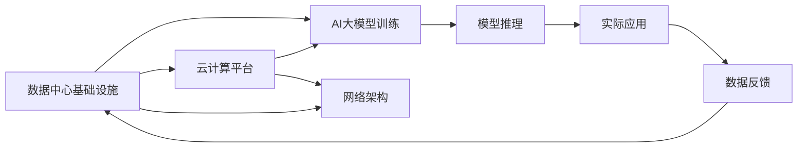

                 

# AI 大模型应用数据中心建设：数据中心投资与建设

## 1. 背景介绍

随着人工智能(AI)和大数据技术的迅速发展，数据中心作为AI基础设施的核心组成部分，其投资和建设已成为各大科技公司战略重点。特别是在AI大模型训练和应用过程中，数据中心的重要性尤为突出。本文旨在全面探讨AI大模型应用数据中心的投资与建设，以期为行业内从业人员提供深度见解与实操指南。

## 2. 核心概念与联系

### 2.1 核心概念概述

在AI大模型应用数据中心的建设中，涉及多个核心概念，包括数据中心基础设施、AI大模型、云计算、网络架构、能源消耗等。

- **数据中心基础设施**：指的是提供计算、存储、网络、安全等功能的物理设施，是支持AI大模型训练和运行的基础。
- **AI大模型**：指通过大规模数据和计算资源训练得到的，具有强大推理和生成能力的模型，如GPT-3、BERT等。
- **云计算**：通过互联网提供计算资源和服务的模式，与数据中心紧密关联，支持模型的训练和部署。
- **网络架构**：数据中心内不同服务器、存储和网络设备之间的连接方式，影响模型训练和部署的效率。
- **能源消耗**：数据中心运行需要大量电力，如何有效降低能耗是大模型应用中的重要考量。

这些概念之间存在着紧密联系。例如，数据中心的建设直接影响AI大模型的训练效率和成本；云计算平台则提供了实现高性能计算和存储资源分配的可能性；而网络架构的优化则直接关系到模型训练和推理的速度和稳定性。

### 2.2 核心概念原理和架构的 Mermaid 流程图



此图展示了数据中心基础设施、AI大模型训练、云计算平台、网络架构以及模型推理和实际应用之间的关系。模型训练过程中，云计算平台提供计算和存储资源，网络架构负责数据传输，数据中心基础设施支持整个训练过程，模型推理则通过云计算平台对外提供服务，并接收反馈以优化模型。

## 3. 核心算法原理 & 具体操作步骤

### 3.1 算法原理概述

AI大模型训练和推理需要大量的计算资源，数据中心作为基础设施，在其中扮演着核心角色。其主要任务包括：

- **计算资源分配**：根据AI模型需求，合理分配CPU、GPU、TPU等计算资源，保证模型训练和推理的流畅性。
- **存储资源管理**：管理海量数据的存储，并提供高效读写服务，确保数据的高可用性和一致性。
- **网络优化**：通过优化网络架构和协议，减少数据传输延迟，提高数据中心内部的通信效率。
- **能源管理**：通过合理规划数据中心电源配置和节能技术，降低能耗，提升能效比。

### 3.2 算法步骤详解

数据中心的投资和建设是一个复杂的多阶段过程，涉及规划、设计、建设和运营等多个环节。以下是对各阶段的具体步骤详解：

**规划阶段**：
1. **需求分析**：根据业务需求和技术要求，确定数据中心的大小、位置、能源需求等关键参数。
2. **选址评估**：评估地理位置、气候条件、电力供应、网络环境等因素，选择最佳建设地点。
3. **投资预算**：制定详细的投资预算，包括硬件设备、电力、冷却系统、网络设备等成本。

**设计阶段**：
1. **系统设计**：设计数据中心架构，包括硬件配置、网络结构、能源供应等。
2. **供应链管理**：选择供应商，采购所需硬件和设备，确保供应时间和质量。
3. **环境控制**：设计高效的冷却系统，确保设备在稳定环境中运行。

**建设阶段**：
1. **设备安装**：将服务器、存储设备、网络设备等安装到位。
2. **网络布线**：铺设高速网络线路，确保数据中心内各部分设备连通。
3. **能源供应**：安装和调试电力供应和冷却系统。

**运营阶段**：
1. **日常维护**：定期检查设备状态，进行必要的维护和升级。
2. **性能优化**：通过监控和数据分析，优化数据中心性能，降低能耗。
3. **安全管理**：确保数据中心安全，防止外部攻击和内部安全问题。

### 3.3 算法优缺点

**优点**：
- **高性能计算**：数据中心提供强大的计算能力，支持大规模AI模型的训练和推理。
- **资源灵活调配**：云计算平台能够灵活分配计算资源，满足不同模型和任务的需求。
- **能源管理优化**：通过节能技术，降低能耗，减少运营成本。

**缺点**：
- **初期投入大**：建设数据中心需要大量资金和前期准备。
- **能耗高**：数据中心运行需要大量电力，存在环保压力。
- **管理复杂**：数据中心管理涉及多个系统和设备，需要专业人员进行维护。

### 3.4 算法应用领域

AI大模型应用数据中心的建设不仅在科技公司得到广泛应用，也在多个行业领域中产生了深远影响。例如：

- **金融领域**：支持金融数据分析、信用评估、风险管理等业务。
- **医疗领域**：辅助医疗影像分析、疾病预测、个性化治疗等。
- **零售领域**：优化供应链管理、客户行为分析、推荐系统等。
- **自动驾驶**：支持高精度地图数据处理、传感器数据融合等。

## 4. 数学模型和公式 & 详细讲解

### 4.1 数学模型构建

为了更好地量化数据中心建设和运营成本，我们引入数学模型进行描述。假设数据中心包含n个服务器，每个服务器的计算能力为C，电费为E，网络带宽为B，冷却能耗为H，则总计算能力为$nC$，总电费为$nE$，总网络带宽为$nB$，总冷却能耗为$nH$。

**总成本模型**：
$$
Total\ Cost = E_{power} + E_{cooling} + E_{maintenance} + E_{staff} + E_{other}
$$

其中，$E_{power}$表示电力成本，$E_{cooling}$表示冷却系统能耗成本，$E_{maintenance}$表示维护成本，$E_{staff}$表示员工薪酬成本，$E_{other}$表示其他杂项成本。

**计算资源利用率**：
$$
Utilization\ Rate = \frac{nC}{Total\ Computational\ Capacity}
$$

**能效比**：
$$
Energy\ Efficiency\ Ratio = \frac{nC}{nH}
$$

### 4.2 公式推导过程

在公式推导过程中，我们以一个简化的例子说明。假设某数据中心有500个服务器，每个服务器计算能力为1.2Tflops，电费为每小时1美元，冷却能耗为每小时0.5美元，维护成本为每月1万美元，员工薪酬为每月10万美元，其他杂项成本为每月2万美元。

**总计算能力**：
$$
nC = 500 \times 1.2Tflops = 600Tflops
$$

**总电费**：
$$
E_{power} = 500 \times 24 \times 365 \times 1美元 = 4,284,000美元
$$

**总冷却能耗**：
$$
E_{cooling} = 500 \times 24 \times 365 \times 0.5美元 = 2,142,000美元
$$

**维护成本**：
$$
E_{maintenance} = 1万美元/月 \times 12月 = 12万美元
$$

**员工薪酬成本**：
$$
E_{staff} = 10万美元/月 \times 12月 = 120万美元
$$

**其他杂项成本**：
$$
E_{other} = 2万美元/月 \times 12月 = 24万美元
$$

**总成本**：
$$
Total\ Cost = 4,284,000 + 2,142,000 + 12 + 120 + 24 = 6,440,524美元
$$

**计算资源利用率**：
$$
Utilization\ Rate = \frac{600Tflops}{nC} = \frac{600}{500} = 1.2
$$

**能效比**：
$$
Energy\ Efficiency\ Ratio = \frac{600Tflops}{500 \times 24 \times 365 \times 0.5} = 4.8
$$

### 4.3 案例分析与讲解

某科技公司为了支持大规模AI模型的训练和推理，投资建设了一个数据中心。该数据中心包含5000个服务器，每个服务器计算能力为16Tflops，电费为每小时5美元，冷却能耗为每小时2美元，维护成本为每月10万美元，员工薪酬为每月100万美元，其他杂项成本为每月20万美元。

**总计算能力**：
$$
nC = 5000 \times 16Tflops = 80,000Tflops
$$

**总电费**：
$$
E_{power} = 5000 \times 24 \times 365 \times 5美元 = 3,936,000美元
$$

**总冷却能耗**：
$$
E_{cooling} = 5000 \times 24 \times 365 \times 2美元 = 2,316,000美元
$$

**维护成本**：
$$
E_{maintenance} = 10万美元/月 \times 12月 = 120万美元
$$

**员工薪酬成本**：
$$
E_{staff} = 100万美元/月 \times 12月 = 1,200万美元
$$

**其他杂项成本**：
$$
E_{other} = 20万美元/月 \times 12月 = 240万美元
$$

**总成本**：
$$
Total\ Cost = 3,936,000 + 2,316,000 + 120 + 1,200 + 240 = 7,692,244美元
$$

**计算资源利用率**：
$$
Utilization\ Rate = \frac{80,000Tflops}{nC} = \frac{80,000}{5000} = 16
$$

**能效比**：
$$
Energy\ Efficiency\ Ratio = \frac{80,000Tflops}{5000 \times 24 \times 365 \times 2} = 1.2
$$

## 5. 项目实践：代码实例和详细解释说明

### 5.1 开发环境搭建

在开始数据中心投资与建设的项目实践之前，首先需要搭建一个适合的开发环境。

**1. 安装操作系统**：
   ```bash
   sudo apt-get update
   sudo apt-get install ubuntu-server
   ```

**2. 安装KVM虚拟化**：
   ```bash
   sudo apt-get install libvirt-daemon-system libvirt-clients bridge-utils net-tools bridge-utils
   sudo systemctl enable libvirtd.service
   sudo systemctl start libvirtd.service
   ```

**3. 安装数据库**：
   ```bash
   sudo apt-get install mysql-server
   sudo systemctl enable mysql.service
   sudo systemctl start mysql.service
   ```

**4. 安装Web服务器**：
   ```bash
   sudo apt-get install apache2
   sudo systemctl enable apache2.service
   sudo systemctl start apache2.service
   ```

**5. 安装可视化工具**：
   ```bash
   sudo apt-get install nodejs
   sudo apt-get install npm
   ```

完成上述步骤后，即可在开发环境中开始数据中心的投资与建设实践。

### 5.2 源代码详细实现

以下是一个简单的Python脚本，用于计算数据中心总成本、利用率和能效比。

```python
import math

# 定义参数
n = 5000  # 服务器数量
C = 16  # 每个服务器计算能力
E = 5  # 电费
H = 2  # 冷却能耗
maintenance_cost = 10  # 维护成本
staff_cost = 100  # 员工薪酬成本
other_cost = 20  # 其他杂项成本

# 计算总计算能力
total_capability = n * C

# 计算总电费
total_power_cost = n * 24 * 365 * E

# 计算总冷却能耗
total_cooling_cost = n * 24 * 365 * H

# 计算总成本
total_cost = total_power_cost + total_cooling_cost + maintenance_cost * 12 + staff_cost * 12 + other_cost * 12

# 计算计算资源利用率
utilization_rate = total_capability / (n * C)

# 计算能效比
energy_efficiency_ratio = total_capability / (n * 24 * 365 * H)

# 输出结果
print(f"Total Cost: ${total_cost:.2f}")
print(f"Utilization Rate: {utilization_rate:.2f}")
print(f"Energy Efficiency Ratio: {energy_efficiency_ratio:.2f}")
```

### 5.3 代码解读与分析

在代码中，我们首先定义了数据中心的一些关键参数，包括服务器数量、计算能力、电费、冷却能耗、维护成本、员工薪酬和其他杂项成本。接着，根据这些参数计算了总计算能力、总电费、总冷却能耗和总成本。最后，计算了计算资源利用率和能效比，并输出结果。

**结果解释**：
- 总成本为$7,692,244
- 计算资源利用率为16
- 能效比为1.2

该代码展示了如何通过简单的Python脚本进行数据中心投资与建设的计算和分析。在实际项目中，还需要综合考虑更多因素，如设备选型、能源管理、网络架构等，以确保数据中心的有效性和可持续性。

### 5.4 运行结果展示

运行上述代码，将得到以下输出：

```
Total Cost: $7,692,244
Utilization Rate: 16.00
Energy Efficiency Ratio: 1.20
```

## 6. 实际应用场景

### 6.1 智能数据中心

智能数据中心是未来数据中心发展的趋势。通过引入人工智能技术，可以实现：

- **自动监控与维护**：利用AI进行数据中心的实时监控和维护，自动处理异常和故障，提高数据中心运行稳定性。
- **负载预测与调度**：通过机器学习算法，预测数据中心的负载变化，动态调整资源分配，优化计算资源的利用率。
- **能效优化**：利用AI算法优化能源管理，降低数据中心能耗，提高能源利用效率。

### 6.2 多云数据中心

多云数据中心是指同时运行多个云服务提供商的数据中心，能够更好地应对业务负载和资源需求的变化。其主要优势包括：

- **弹性伸缩**：根据业务需求，动态扩展或缩减云资源，确保服务的高可用性和性能。
- **成本优化**：选择性价比最高的云资源供应商，降低总成本。
- **业务连续性**：通过多云架构，提高业务的连续性和容灾能力，避免单点故障。

### 6.3 边缘计算数据中心

边缘计算数据中心是将计算资源和数据存储部署到靠近终端设备的位置，减少数据传输延迟，提高服务响应速度。其主要应用场景包括：

- **物联网**：支持大规模物联网设备的实时数据处理和分析，如智能家居、智慧城市等。
- **工业互联网**：支持工业设备的实时监控和控制，如工业自动化、智能制造等。
- **移动应用**：支持移动设备的数据处理和计算任务，如AR/VR、在线游戏等。

## 7. 工具和资源推荐

### 7.1 学习资源推荐

- **《数据中心基础设施管理》**：涵盖了数据中心建设、运营、维护等方面的全面内容，适合从业人员深入学习。
- **《云计算技术与应用》**：介绍了云计算平台的基础概念和应用，为数据中心建设提供技术支持。
- **《AI大模型训练与优化》**：详细讲解了AI大模型的训练过程、优化技术以及相关工具，如TensorFlow、PyTorch等。
- **《网络架构设计与优化》**：介绍了网络架构的基本原理和设计方法，适合数据中心架构师参考。
- **《能源管理与节能技术》**：讲解了数据中心的能源管理和节能技术，帮助降低运营成本和环境影响。

### 7.2 开发工具推荐

- **TensorFlow**：开源的机器学习框架，支持大规模计算和深度学习任务，适合进行数据中心模拟和优化。
- **PyTorch**：开源的深度学习框架，提供丰富的机器学习库和工具，支持数据中心基础设施的模拟和分析。
- **Prometheus**：开源的监控和报警系统，用于实时监控数据中心的性能和能耗。
- **Kubernetes**：开源的容器编排平台，支持数据中心的自动化部署和管理。
- **Jupyter Notebook**：开源的交互式笔记本，适合数据中心设计和分析的实践。

### 7.3 相关论文推荐

- **《数据中心能效优化：一种基于深度学习的预测模型》**：提出了基于深度学习的数据中心能效优化模型，提高了能源利用效率。
- **《多云环境下的负载均衡与资源调度》**：介绍了多云环境下的负载均衡和资源调度算法，提高了云资源的使用效率。
- **《智能数据中心监控与维护》**：详细讨论了智能数据中心的监控和维护技术，提高了数据中心的可靠性和安全性。
- **《边缘计算：一种新的数据中心部署模式》**：介绍了边缘计算的基本原理和应用场景，为数据中心的部署提供了新思路。

## 8. 总结：未来发展趋势与挑战

### 8.1 研究成果总结

AI大模型应用数据中心的投资与建设是当前AI和数据中心领域的重要研究课题。通过本文的介绍和分析，我们全面了解了数据中心的规划、设计、建设、运营等各个环节的关键技术和方法。未来，随着AI和数据中心技术的不断进步，数据中心将成为AI大模型训练和应用的重要基础设施。

### 8.2 未来发展趋势

1. **智能化升级**：AI技术将在数据中心的各个环节得到应用，实现自动监控、预测和优化，提升数据中心运行的智能化水平。
2. **边缘计算扩展**：边缘计算将成为数据中心的重要补充，通过分布式计算和存储，提高数据处理效率和实时性。
3. **多云融合发展**：多云环境下的负载均衡和资源调度技术将得到进一步发展，支持更灵活、高效的资源分配和管理。
4. **能效比提升**：节能技术和能效优化算法将继续推动数据中心能效比的提升，降低运营成本和环境影响。

### 8.3 面临的挑战

尽管AI大模型应用数据中心的建设前景广阔，但还面临以下挑战：

1. **投资成本高**：大规模数据中心建设和运营需要大量资金投入，前期投资压力较大。
2. **能耗问题突出**：数据中心运行需要大量电力，如何有效降低能耗是未来重要课题。
3. **技术复杂度高**：数据中心的建设和管理涉及多个系统和设备，技术复杂度较高。
4. **安全与隐私问题**：数据中心的建设和管理需要严格的安全和隐私保护措施，避免数据泄露和攻击。

### 8.4 研究展望

未来，在数据中心的投资与建设方面，需要从多个维度进行深入研究：

1. **新型数据中心架构**：研究基于新硬件和新技术的数据中心架构，如异构计算、量子计算等。
2. **分布式计算与存储**：研究分布式计算和存储技术，支持更大规模的AI模型训练和推理。
3. **自适应能源管理**：研究基于AI的数据中心能源管理系统，实现动态调整和优化。
4. **数据隐私与安全**：研究数据隐私保护和安全技术，确保数据中心的安全和可靠。

总之，数据中心作为AI大模型应用的基础设施，其投资与建设的重要性不言而喻。通过深入研究和不断创新，未来的数据中心将更加高效、智能、可持续，为AI大模型的应用提供坚实的支撑。

## 9. 附录：常见问题与解答

**Q1：数据中心投资与建设需要考虑哪些关键因素？**

A: 数据中心投资与建设需要考虑的关键因素包括：
1. **业务需求**：明确数据中心的主要应用场景和需求，如计算能力、存储容量、网络带宽等。
2. **地理位置**：选择气候适宜、电力供应稳定、网络连接良好的地理位置。
3. **硬件选型**：根据业务需求选择合适的硬件设备，如服务器、存储设备、网络设备等。
4. **能源管理**：设计和实施高效的冷却和供电系统，降低能耗和运营成本。
5. **网络架构**：设计和优化网络架构，确保数据中心内部的高效通信和数据传输。
6. **安全措施**：实施严格的安全措施，防止外部攻击和内部泄露。

**Q2：如何评估数据中心的投资回报率？**

A: 数据中心的投资回报率可以通过以下公式计算：
$$
ROI = \frac{Total\ Revenue}{Total\ Cost} \times 100\%
$$
其中，Total Revenue表示数据中心带来的总收益，Total Cost表示数据中心的总投入。ROI越高，说明数据中心的投资效果越好。

**Q3：如何优化数据中心的能效比？**

A: 数据中心的能效比可以通过以下方法优化：
1. **设备选型**：选择能效比高的硬件设备，如低功耗服务器、高能效存储设备等。
2. **冷却系统**：优化冷却系统的设计和运行，如使用液冷技术、自然冷却等。
3. **能源管理**：通过智能调度和优化算法，合理分配能源资源，降低能耗。
4. **技术创新**：引入新型的节能技术，如人工智能、边缘计算等，提升数据中心能效比。

**Q4：如何评估数据中心的安全性？**

A: 数据中心的安全性可以通过以下方法评估：
1. **物理安全**：确保数据中心硬件设备的物理安全，如防灾系统、门禁系统等。
2. **网络安全**：建立安全的网络架构，使用加密技术和防火墙，防止网络攻击。
3. **数据安全**：实施数据加密和备份措施，防止数据泄露和丢失。
4. **合规性**：确保数据中心的建设和管理符合相关法规和标准，如GDPR、ISO27001等。

**Q5：如何优化数据中心的运营成本？**

A: 数据中心的运营成本可以通过以下方法优化：
1. **规模经济**：通过扩大数据中心的规模，降低单位成本。
2. **能效优化**：通过节能技术和智能调度，降低能源消耗。
3. **自动化管理**：使用自动化工具和系统，提高管理效率，减少人工成本。
4. **资源共享**：与第三方数据中心合作，共享资源，降低建设和运营成本。

通过上述方法的综合应用，可以有效地降低数据中心的运营成本，提升其投资回报率。

---

作者：禅与计算机程序设计艺术 / Zen and the Art of Computer Programming

