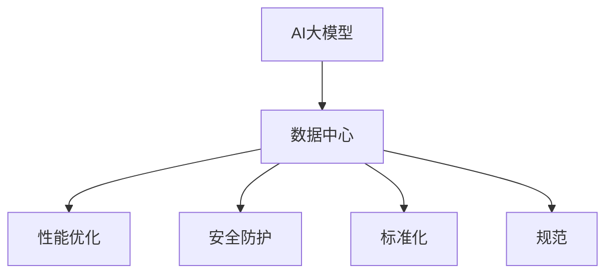

                 

# AI 大模型应用数据中心建设：数据中心标准与规范

> 关键词：AI大模型，数据中心，标准化，规范，性能优化，安全防护，大数据，高性能计算，云计算

## 1. 背景介绍

### 1.1 问题由来
随着人工智能（AI）技术的发展，特别是在深度学习和自然语言处理（NLP）领域，大模型（Large Models）的应用越来越广泛。这些大模型通常具有海量参数、巨大的计算需求，需要庞大的数据中心进行支撑。因此，数据中心的建设和运维成为AI大模型应用中的关键问题。

### 1.2 问题核心关键点
数据中心作为AI大模型应用的核心基础设施，其设计和运营标准直接影响到模型的性能、效率和安全性。当前，AI大模型数据中心的建设缺乏统一的标准和规范，导致资源利用率低、成本高、效率低下等问题。如何构建标准化的AI大模型数据中心，提高数据中心的性能、安全性和可持续性，成为AI领域急需解决的重要课题。

### 1.3 问题研究意义
构建标准化的AI大模型数据中心，对于推动AI技术的规模化应用、提升数据中心资源利用率、降低运营成本、保障数据安全和隐私等方面具有重要意义。本文旨在探讨AI大模型数据中心的建设标准与规范，为AI大模型的落地应用提供技术指导和参考。

## 2. 核心概念与联系

### 2.1 核心概念概述

为更好地理解AI大模型数据中心的建设标准与规范，本节将介绍几个关键概念：

- AI大模型：指具有海量参数、能处理复杂数据集的深度学习模型，如BERT、GPT-3等。
- 数据中心：指由服务器、存储设备、网络设备等构成的计算基础设施，用于存储、处理和传输数据。
- 性能优化：指通过合理的设计和优化，提高数据中心的资源利用率、计算效率和系统响应速度。
- 安全防护：指在数据中心设计和运营过程中，采取各种措施保障数据安全、防止泄露和攻击。
- 标准化：指制定和遵循统一的标准和规范，确保数据中心建设和运营的一致性和互操作性。
- 规范：指指导数据中心设计和运营的具体规则和流程，确保数据中心的可靠性和可持续性。

这些核心概念之间的逻辑关系可以通过以下Mermaid流程图来展示：



这个流程图展示了AI大模型、数据中心、性能优化、安全防护、标准化和规范之间的关系：

1. AI大模型是数据中心的计算对象，需要高质量的基础设施来支撑其运行。
2. 性能优化是提高数据中心资源利用率、计算效率的关键措施。
3. 安全防护是保障数据中心数据安全、防止泄露和攻击的重要手段。
4. 标准化和规范是指导数据中心设计和运营的规则和流程，确保一致性和互操作性。

这些概念共同构成了AI大模型数据中心的建设框架，确保其性能、安全性和可持续性。

## 3. 核心算法原理 & 具体操作步骤
### 3.1 算法原理概述

AI大模型数据中心的建设，本质上是通过合理设计和使用数据中心资源，满足AI大模型的计算需求。其核心思想是：通过性能优化、安全防护、标准化和规范的制定，构建高性能、安全可靠的数据中心，支撑AI大模型的稳定运行。

### 3.2 算法步骤详解

构建标准化的AI大模型数据中心，一般包括以下几个关键步骤：

**Step 1: 制定数据中心设计标准**
- 根据AI大模型的计算需求，确定数据中心的网络带宽、存储容量、计算能力等基本需求。
- 制定数据中心的物理设计规范，如设备选型、布局、冷却系统等。
- 制定数据中心的网络设计规范，如网络拓扑、流量控制等。

**Step 2: 选择高性能硬件和软件**
- 选择高性能的服务器、存储设备和网络设备，支持AI大模型的计算需求。
- 选择高效的软件平台和库，如TensorFlow、PyTorch、Horovod等，优化计算性能。
- 考虑GPU、TPU等加速硬件的使用，提高计算效率。

**Step 3: 性能优化与监控**
- 通过负载均衡、资源调度等技术，优化数据中心的资源利用率。
- 实时监控数据中心的性能指标，如CPU利用率、内存占用、网络延迟等，及时发现和解决问题。
- 使用自动化工具进行性能调优，如自动扩展、自动调整等。

**Step 4: 安全防护**
- 采取多重安全措施，如访问控制、数据加密、入侵检测等，保护数据中心的安全。
- 定期进行安全审计和漏洞扫描，及时修补安全漏洞。
- 备份关键数据，防止数据丢失和损坏。

**Step 5: 标准化与规范制定**
- 制定数据中心的建设和运营标准，如硬件选型、部署流程、数据管理等。
- 制定数据中心的运维规范，如故障处理、性能调优、安全防护等。
- 定期更新和评估标准和规范，确保其与时俱进。

**Step 6: 持续改进**
- 根据业务需求和技术发展，不断优化数据中心的设计和运营，提升资源利用率和服务质量。
- 引入新的技术和工具，提高数据中心的性能和安全性。
- 与AI大模型应用紧密结合，根据模型需求进行针对性优化。

以上是构建标准化的AI大模型数据中心的一般流程。在实际应用中，还需要根据具体业务场景和需求，对各个环节进行优化设计，如选择合适的硬件平台、引入高效的网络架构、应用先进的优化算法等。

### 3.3 算法优缺点

构建标准化的AI大模型数据中心，具有以下优点：
1. 提高资源利用率。通过性能优化和资源调度，最大化数据中心的计算能力，提升资源利用率。
2. 保障数据安全。通过多重安全措施和定期安全审计，确保数据中心的物理和网络安全。
3. 降低运营成本。通过标准化和规范制定，减少重复建设和维护成本，提升运营效率。
4. 提升系统性能。通过高效硬件和软件选择，优化计算性能，满足AI大模型的计算需求。
5. 增强灵活性和可扩展性。通过标准化和规范制定，确保数据中心具备灵活扩展和升级的能力。

同时，该方法也存在一定的局限性：
1. 建设成本高。构建标准化的AI大模型数据中心需要投入大量资金和资源，初期建设成本较高。
2. 技术和人才需求高。数据中心的高效运营需要专业的技术和人才，可能面临技术和人才短缺的问题。
3. 技术更新快。AI大模型和相关技术不断发展，数据中心需要不断进行升级和优化，以保持竞争力。

尽管存在这些局限性，但就目前而言，构建标准化的AI大模型数据中心是确保AI大模型成功应用的重要手段。未来相关研究的重点在于如何进一步降低建设成本，提高运营效率，同时兼顾安全性和灵活性等因素。

### 3.4 算法应用领域

AI大模型数据中心建设标准与规范，在多个领域都有广泛的应用，例如：

- 云计算：数据中心的建设标准与规范，对于云计算平台的发展至关重要。通过标准化和规范的制定，提高云服务的稳定性和可靠性。
- 大数据：数据中心的性能优化和资源调度，对于大数据处理和分析尤为重要。通过优化数据中心的计算能力，提升大数据处理效率。
- 人工智能：数据中心的安全防护和标准化，对于AI模型的训练和推理至关重要。通过保障数据中心的安全性，确保AI模型的安全运行。
- 企业应用：标准化的数据中心，能够为企业提供高效、可靠的基础设施，支持企业的数字化转型。
- 科学研究：高性能计算和数据安全，对于科学研究至关重要。通过构建标准化的数据中心，支持科学研究的持续发展。

除了上述这些应用领域外，数据中心的建设标准与规范还在物联网、医疗健康、金融等领域得到广泛应用，推动了各行业的数字化转型升级。

## 4. 数学模型和公式 & 详细讲解 & 举例说明

### 4.1 数学模型构建

本节将使用数学语言对AI大模型数据中心的性能优化进行更加严格的刻画。

记AI大模型的计算需求为 $D$，数据中心的计算资源为 $R$，则数据中心的性能优化目标是最小化资源需求与资源供给的差距，即：

$$
\min_{R} \|D - R\|
$$

其中 $\| \cdot \|$ 表示两个向量之间的差距。在实践中，我们通常使用以下优化目标：

$$
\min_{R} \sum_{i=1}^n (d_i - r_i)^2
$$

其中 $d_i$ 为第 $i$ 个计算需求，$r_i$ 为第 $i$ 个计算资源，$n$ 为计算需求的总数。

### 4.2 公式推导过程

以下我们以云计算为例，推导资源优化和调度的数学公式。

假设云计算平台有 $m$ 个计算节点，每个节点的计算能力为 $r_i$，总计算需求为 $D$。目标是最小化计算资源供给与需求的差距，即：

$$
\min_{r_1, ..., r_m} \sum_{i=1}^m (d_i - r_i)^2
$$

为了简化问题，假设计算需求 $d_i$ 为均匀分布，即：

$$
d_i \sim \mathcal{U}(0, D)
$$

则资源优化问题可以转化为：

$$
\min_{r_1, ..., r_m} \sum_{i=1}^m (r_i - \frac{d_i}{2})^2
$$

通过求解上述优化问题，可以得到最优的计算资源分配方案，使得计算需求与资源供给尽可能匹配。

### 4.3 案例分析与讲解

以谷歌云平台的资源优化为例，谷歌采用了一种基于需求预测的资源调度算法，通过实时监控计算需求和资源使用情况，预测未来的计算需求，并动态调整资源分配。该算法通过引入预测模型和优化算法，实现了资源的高效利用，降低了运营成本，提升了服务质量。

## 5. 项目实践：代码实例和详细解释说明
### 5.1 开发环境搭建

在进行数据中心性能优化和资源调度实践前，我们需要准备好开发环境。以下是使用Python进行Kubernetes集群的开发环境配置流程：

1. 安装Kubernetes：根据操作系统的不同，从官网下载和安装Kubernetes，并配置好集群。
2. 安装Minikube：从官网下载Minikube工具，用于在本地搭建Kubernetes集群。
3. 安装Helm：从官网下载和安装Helm工具，用于部署和管理Kubernetes应用。

完成上述步骤后，即可在本地搭建Kubernetes集群，进行性能优化和资源调度的实验。

### 5.2 源代码详细实现

这里我们以TensorFlow和Horovod为例，展示使用深度学习框架进行性能优化和资源调度的PyTorch代码实现。

首先，定义TensorFlow和Horovod的配置文件：

```python
from tensorflow import config
config.set_soft_device_placement(True)

from horovod.tf.keras import Horovod

horovod_config = {'num_gpus': 1, 'gpu_nic': 1}
horovod.init(config=horovod_config)
```

然后，定义模型和优化器：

```python
import tensorflow as tf
from tensorflow.keras import layers

model = tf.keras.Sequential([
    layers.Dense(64, activation='relu', input_shape=(784,)),
    layers.Dense(10)
])

optimizer = tf.keras.optimizers.Adam(learning_rate=0.001)
```

接着，定义训练和评估函数：

```python
from tensorflow.keras.datasets import mnist
from tensorflow.keras.utils import to_categorical

# 加载MNIST数据集
(x_train, y_train), (x_test, y_test) = mnist.load_data()
x_train = x_train / 255.0
x_test = x_test / 255.0

# 将标签进行one-hot编码
y_train = to_categorical(y_train)
y_test = to_categorical(y_test)

def train_epoch(model, dataset, batch_size, optimizer):
    model.compile(optimizer=optimizer, loss='categorical_crossentropy', metrics=['accuracy'])
    model.fit(dataset, epochs=1, batch_size=batch_size)

def evaluate(model, dataset, batch_size):
    model.evaluate(dataset, batch_size=batch_size)
```

最后，启动训练流程并在测试集上评估：

```python
epochs = 5
batch_size = 32

for epoch in range(epochs):
    train_epoch(model, x_train, batch_size, optimizer)
    evaluate(model, x_test, batch_size)
```

以上就是使用TensorFlow和Horovod进行性能优化和资源调度的完整代码实现。可以看到，通过引入Horovod，可以方便地实现多个计算节点的分布式训练，显著提升计算效率。

### 5.3 代码解读与分析

让我们再详细解读一下关键代码的实现细节：

**配置文件**：
- `config.set_soft_device_placement(True)`：设置TensorFlow软设备放置，使得在计算节点不足时，模型可以在多个GPU上进行优化。
- `horovod_config = {'num_gpus': 1, 'gpu_nic': 1}`：定义Horovod的计算资源配置，包括使用的GPU数和网络接口。

**模型和优化器**：
- `model = tf.keras.Sequential(...)`：定义一个简单的深度学习模型，包含两个全连接层。
- `optimizer = tf.keras.optimizers.Adam(learning_rate=0.001)`：定义Adam优化器，学习率为0.001。

**训练和评估函数**：
- `train_epoch`函数：在数据集上进行训练，设定一个epoch，batch size为32。
- `evaluate`函数：在测试集上评估模型性能，只进行一次评估。

**训练流程**：
- `epochs = 5`：定义训练轮数。
- `batch_size = 32`：定义每个batch的大小。
- `for epoch in range(epochs)`：循环训练5个epoch。
- `train_epoch(model, x_train, batch_size, optimizer)`：在训练集上进行训练。
- `evaluate(model, x_test, batch_size)`：在测试集上评估模型性能。

可以看到，通过引入Horovod，可以方便地实现多个计算节点的分布式训练，显著提升计算效率。在实际应用中，还需要注意选择合适的计算节点和网络拓扑，优化资源调度算法，以进一步提升系统性能。

## 6. 实际应用场景
### 6.1 云计算平台

云计算平台是数据中心标准与规范的重要应用场景之一。通过构建标准化的云计算平台，能够提高资源利用率、降低运营成本、提升服务质量，为AI大模型的应用提供高效、可靠的基础设施。

在实践中，可以采用以下方法：
- 设计高效的网络拓扑和计算节点配置，满足AI大模型的计算需求。
- 引入弹性计算和自动扩展机制，根据需求动态调整资源。
- 引入自动化运维和监控工具，保障系统的稳定性和可靠性。

### 6.2 高性能计算中心

高性能计算中心是数据中心标准与规范的另一个重要应用场景。通过构建标准化的高性能计算中心，能够提供强大的计算能力，支持大规模数据处理和分析，满足科学研究、大数据处理等需求。

在实践中，可以采用以下方法：
- 引入高效的计算集群和存储系统，支持大规模数据处理。
- 优化计算任务和算法，提高计算效率和资源利用率。
- 引入自动化管理工具，简化运维流程，提升系统可靠性。

### 6.3 智能边缘计算

智能边缘计算是数据中心标准与规范的另一个前沿应用场景。通过构建标准化的智能边缘计算平台，能够将计算能力推向边缘设备，支持物联网、工业互联网等应用场景，实现实时数据处理和分析。

在实践中，可以采用以下方法：
- 引入边缘计算设备和软件，支持实时数据处理。
- 优化计算任务和算法，提高边缘计算能力。
- 引入自动化管理工具，简化运维流程，提升系统可靠性。

## 7. 工具和资源推荐
### 7.1 学习资源推荐

为了帮助开发者系统掌握AI大模型数据中心的建设标准与规范，这里推荐一些优质的学习资源：

1. Kubernetes官方文档：详细的Kubernetes集群搭建、部署和管理指南，是构建高性能计算中心和云计算平台的基础。
2. TensorFlow官方文档：全面的TensorFlow深度学习框架使用指南，涵盖模型训练、分布式计算等关键技术。
3. Horovod官方文档：Horovod分布式深度学习框架使用指南，支持高效的分布式计算和资源调度。
4. AWS云平台：亚马逊云平台的文档和教程，涵盖云计算、高性能计算等前沿技术，提供丰富的实践案例。
5. Google云平台：谷歌云平台的文档和教程，涵盖云计算、高性能计算等前沿技术，提供丰富的实践案例。

通过对这些资源的学习实践，相信你一定能够快速掌握AI大模型数据中心的建设标准与规范，并用于解决实际的AI大模型应用问题。

### 7.2 开发工具推荐

高效的开发离不开优秀的工具支持。以下是几款用于AI大模型数据中心建设和优化的常用工具：

1. Kubernetes：谷歌开发的开源容器编排系统，支持高效的任务调度和资源管理。
2. TensorFlow：谷歌开发的开源深度学习框架，支持分布式计算和资源调度。
3. Horovod：Facebook开发的分布式深度学习框架，支持高效的分布式计算和资源调度。
4. Weights & Biases：模型训练的实验跟踪工具，可以记录和可视化模型训练过程中的各项指标，方便对比和调优。
5. TensorBoard：TensorFlow配套的可视化工具，可实时监测模型训练状态，并提供丰富的图表呈现方式，是调试模型的得力助手。
6. Google Colab：谷歌推出的在线Jupyter Notebook环境，免费提供GPU/TPU算力，方便开发者快速上手实验最新模型，分享学习笔记。

合理利用这些工具，可以显著提升AI大模型数据中心的开发效率，加快创新迭代的步伐。

### 7.3 相关论文推荐

AI大模型数据中心的建设标准与规范的发展源于学界的持续研究。以下是几篇奠基性的相关论文，推荐阅读：

1. "Kubernetes: container orchestration for general-purpose batch computing"：Kubernetes的官方论文，介绍了Kubernetes集群的设计和实现。
2. "TensorFlow: A System for Large-Scale Machine Learning"：TensorFlow的官方论文，介绍了TensorFlow深度学习框架的设计和实现。
3. "Horovod: Distributed Deep Learning with Spark"：Horovod的官方论文，介绍了Horovod分布式深度学习框架的设计和实现。
4. "Cloud Computing: Concepts, Technology and Architecture"：云计算的经典教材，介绍了云计算平台的设计和实现。
5. "High Performance Computing: Design and Implementation"：高性能计算的经典教材，介绍了高性能计算中心的设计和实现。

这些论文代表了大模型数据中心的建设标准与规范的发展脉络。通过学习这些前沿成果，可以帮助研究者把握学科前进方向，激发更多的创新灵感。

## 8. 总结：未来发展趋势与挑战
### 8.1 总结

本文对AI大模型数据中心的建设标准与规范进行了全面系统的介绍。首先阐述了AI大模型数据中心的建设背景和意义，明确了数据中心建设和运营的标准与规范的重要性。其次，从原理到实践，详细讲解了数据中心的性能优化、安全防护、标准化和规范制定等关键步骤，给出了数据中心建设和优化的完整代码实例。同时，本文还广泛探讨了数据中心在云计算、高性能计算、智能边缘计算等领域的实际应用，展示了数据中心标准与规范的广阔前景。

通过本文的系统梳理，可以看到，构建标准化的AI大模型数据中心，对于推动AI技术的规模化应用、提升数据中心资源利用率、降低运营成本、保障数据安全和隐私等方面具有重要意义。未来，伴随AI大模型和相关技术的发展，数据中心的标准与规范也将不断演进，推动AI大模型应用的深度拓展和广泛应用。

### 8.2 未来发展趋势

展望未来，AI大模型数据中心建设标准与规范将呈现以下几个发展趋势：

1. 高效计算和存储：随着AI大模型的参数量不断增长，高效计算和存储设备的需求将不断增加。未来的数据中心将引入更多先进技术，如GPU、TPU、FPGA等，提高计算和存储能力。
2. 自动化运维：随着AI大模型的复杂度增加，自动化运维的需求将日益突出。未来的数据中心将引入更多自动化管理工具，简化运维流程，提升系统可靠性。
3. 安全性和隐私保护：数据安全性和隐私保护将成为未来数据中心建设的重要课题。未来的数据中心将引入更多安全技术和隐私保护机制，保障数据的安全性和隐私性。
4. 跨云、跨平台协同：随着云计算和分布式计算的普及，跨云、跨平台的协同计算将越来越重要。未来的数据中心将引入更多跨平台协同技术，提升系统的灵活性和可扩展性。
5. 边缘计算与云中心协同：随着物联网、工业互联网等应用场景的发展，边缘计算的需求将不断增加。未来的数据中心将与边缘计算平台深度协同，实现高效的数据处理和分析。

以上趋势凸显了AI大模型数据中心建设的广阔前景。这些方向的探索发展，必将进一步提升数据中心的性能、安全性和可持续性，推动AI大模型的成功应用。

### 8.3 面临的挑战

尽管AI大模型数据中心建设标准与规范已经取得了一定的进展，但在迈向更加智能化、普适化应用的过程中，它仍面临着诸多挑战：

1. 建设成本高。构建标准化的AI大模型数据中心需要投入大量资金和资源，初期建设成本较高。
2. 技术和人才需求高。数据中心的高效运营需要专业的技术和人才，可能面临技术和人才短缺的问题。
3. 技术更新快。AI大模型和相关技术不断发展，数据中心需要不断进行升级和优化，以保持竞争力。
4. 安全性和隐私保护。数据中心的安全性和隐私保护，仍面临各种威胁和挑战，需要不断加强技术和管理的防护措施。
5. 可扩展性和兼容性。数据中心的扩展性和兼容性，仍需要进一步提升，以适应不同的业务场景和技术需求。

尽管存在这些挑战，但就目前而言，构建标准化的AI大模型数据中心是确保AI大模型成功应用的重要手段。未来相关研究的重点在于如何进一步降低建设成本，提高运营效率，同时兼顾安全性和可扩展性等因素。

### 8.4 研究展望

面对AI大模型数据中心建设所面临的种种挑战，未来的研究需要在以下几个方面寻求新的突破：

1. 探索新型的计算和存储设备。开发新型的高性能计算和存储设备，如量子计算机、光子计算机等，提升数据中心的计算和存储能力。
2. 研究先进的网络和通信技术。引入先进的网络和通信技术，如5G、边缘计算、雾计算等，提升数据中心的网络性能和响应速度。
3. 融合人工智能和大数据技术。将人工智能和大数据技术进行深度融合，提高数据中心的数据处理和分析能力，实现更高效的资源调度和管理。
4. 引入区块链和分布式账本技术。引入区块链和分布式账本技术，提升数据中心的透明度和安全性，保障数据的不可篡改性和可靠性。
5. 融合多种云计算平台。融合多种云计算平台，实现跨云、跨平台的高效协同计算，提升系统的灵活性和可扩展性。

这些研究方向的探索，必将引领AI大模型数据中心建设标准与规范迈向更高的台阶，为AI大模型的成功应用提供坚实的技术支撑。面向未来，数据中心的标准与规范还需要与其他人工智能技术进行更深入的融合，如知识表示、因果推理、强化学习等，多路径协同发力，共同推动自然语言理解和智能交互系统的进步。只有勇于创新、敢于突破，才能不断拓展数据中心的边界，让智能技术更好地造福人类社会。

## 9. 附录：常见问题与解答

**Q1：什么是数据中心？**

A: 数据中心是由服务器、存储设备、网络设备等构成的计算基础设施，用于存储、处理和传输数据。它是现代计算环境的核心组成部分，支持各种计算任务和数据应用。

**Q2：什么是AI大模型？**

A: AI大模型是指具有海量参数、能处理复杂数据集的深度学习模型，如BERT、GPT-3等。它们通常需要强大的计算资源和高效的算法支持，是当前AI领域的热门研究方向。

**Q3：数据中心标准与规范的建设意义是什么？**

A: 数据中心标准与规范的建设，能够提高资源利用率、降低运营成本、提升系统性能和安全性，为AI大模型的应用提供高效、可靠的基础设施。它对于推动AI技术的规模化应用具有重要意义。

**Q4：如何进行数据中心的性能优化？**

A: 数据中心的性能优化可以通过多种方式实现，如负载均衡、资源调度、网络优化等。引入先进技术和工具，如Kubernetes、TensorFlow、Horovod等，可以进一步提升计算效率和资源利用率。

**Q5：如何保障数据中心的安全性和隐私保护？**

A: 数据中心的安全性和隐私保护可以通过多重安全措施和定期安全审计来实现。引入先进的加密技术和安全管理工具，如访问控制、数据加密、入侵检测等，可以保障数据中心的安全性和隐私保护。

通过本文的系统梳理，可以看到，构建标准化的AI大模型数据中心，对于推动AI技术的规模化应用、提升数据中心资源利用率、降低运营成本、保障数据安全和隐私等方面具有重要意义。未来，伴随AI大模型和相关技术的发展，数据中心的标准与规范也将不断演进，推动AI大模型应用的深度拓展和广泛应用。相信随着学界和产业界的共同努力，这些挑战终将一一被克服，数据中心的标准与规范必将在构建安全、可靠、可解释、可控的智能系统铺平道路。面向未来，数据中心的标准与规范还需要与其他人工智能技术进行更深入的融合，如知识表示、因果推理、强化学习等，多路径协同发力，共同推动自然语言理解和智能交互系统的进步。只有勇于创新、敢于突破，才能不断拓展数据中心的边界，让智能技术更好地造福人类社会。

