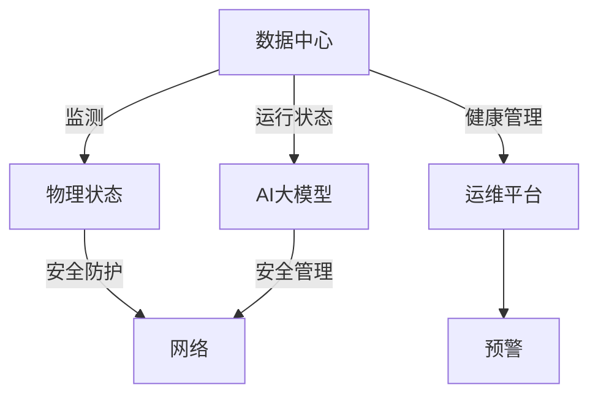

                 

# AI 大模型应用数据中心的健康与安全管理

在AI大模型应用的蓬勃发展中，数据中心成为了其计算能力和存储能力的承载之地。然而，数据中心不仅仅是硬件的堆叠，更是一套复杂系统的构建。本文将从数据中心的管理角度出发，深度探讨大模型应用场景下的健康与安全问题，为数据中心的运维人员提供指导，确保数据中心能高效稳定地运行，保障AI大模型的可靠与安全。

## 1. 背景介绍

### 1.1 问题由来

AI大模型的应用离不开数据中心的支持。而数据中心的复杂性在于它不仅包含了物理设备，如服务器、网络交换机、存储等，还包括软件层面，如操作系统、网络协议、虚拟化、容灾备份等。尤其是在AI大模型应用场景下，数据中心需要处理大量计算密集型任务，硬件设备需要长时间高强度运行，因此其健康和安全管理显得尤为重要。

### 1.2 问题核心关键点

数据中心健康与安全管理涉及多个层面：

- **物理健康管理**：设备物理状态的监测、维护和故障处理。
- **网络安全管理**：数据中心内外的网络安全防护、访问控制、安全监控。
- **应用健康管理**：AI大模型的运行状态监测、负载均衡、容错机制。
- **系统安全管理**：数据中心的整体安全策略、应急预案、灾备方案。

这些问题贯穿了数据中心从建设、运维到退役的全生命周期，对AI大模型的可靠与安全有着直接影响。

## 2. 核心概念与联系

### 2.1 核心概念概述

- **数据中心**：为支持企业业务和IT运行提供计算、存储和网络资源的设施，通常包括服务器、存储、网络、电源、制冷等基础设施。
- **AI大模型**：通过大规模数据集预训练得到的模型，具有强大的学习和推理能力。
- **健康管理**：通过对数据中心和AI大模型运行状态的监测、分析和预警，预防潜在故障的发生，保障系统的稳定运行。
- **安全管理**：采用技术手段和管理措施，确保数据中心及其应用的安全性，防止数据泄露、服务中断等安全事件的发生。

这些概念间的关系可以用下面的Mermaid流程图来表示：



该图展示了数据中心和AI大模型健康与安全管理之间的联系：通过运维平台对数据中心和AI大模型进行健康管理，实现物理状态监测和AI大模型运行状态监测，并通过网络安全防护和应用安全管理，确保数据中心和AI大模型的安全。

## 3. 核心算法原理 & 具体操作步骤

### 3.1 算法原理概述

大模型应用数据中心的健康与安全管理，主要依赖于对数据中心和AI大模型的运行状态进行持续监测、分析与预警。这一过程通常包括：

- **监测**：使用传感器、日志、性能指标等手段，实时获取数据中心的物理状态和AI大模型的运行状态。
- **分析**：通过数据分析技术，识别潜在的故障或异常状态，并进行趋势分析。
- **预警**：当系统状态异常时，通过自动化机制或人工干预，发出告警，并采取相应的应对措施。

### 3.2 算法步骤详解

以下是具体的操作流程：

1. **数据采集**：部署传感器、监控软件等手段，采集数据中心的温度、湿度、电源、网络流量、CPU负载、内存使用等物理参数，以及AI大模型的计算性能、内存使用、错误率、延迟等运行参数。

2. **数据存储与处理**：将采集到的数据存入数据库或分布式文件系统中，进行清洗、整理，然后通过数据挖掘、机器学习等技术，提取关键指标，如CPU利用率、内存利用率、网络吞吐量等。

3. **状态分析**：应用规则引擎、人工智能算法等技术，对收集到的数据进行分析，识别异常状态，如硬件故障、网络阻塞、模型运行异常等。

4. **预警与应对**：根据分析结果，通过自动化系统或人工介入，发出预警，并采取相应的措施，如重启设备、转移负载、通知运维人员等。

### 3.3 算法优缺点

#### 优点

- **全面性**：通过多维度的数据采集和分析，全面监测数据中心的健康状态。
- **实时性**：通过实时数据监测和分析，及时发现并解决问题，提高系统可用性。
- **自动化**：自动化预警和应对机制，减少人工干预，提高运维效率。

#### 缺点

- **数据复杂性**：需要处理大量的多源异构数据，增加了数据处理的复杂性。
- **算法复杂性**：需要应用高级数据分析技术，增加了系统开发的复杂性。
- **成本**：硬件、软件、人力成本较高，尤其是大数据分析和机器学习模型的部署和维护。

### 3.4 算法应用领域

- **云计算**：针对云端AI大模型的健康与安全管理。
- **边缘计算**：针对边缘设备的数据中心健康管理。
- **智能交通**：针对智能交通系统中的数据中心和AI大模型的健康管理。
- **医疗**：针对医疗设备中的数据中心和AI大模型的健康管理。

## 4. 数学模型和公式 & 详细讲解 & 举例说明

### 4.1 数学模型构建

大模型应用数据中心的健康与安全管理，通常基于以下几个数学模型：

1. **物理状态监测模型**：
   - **温度监测模型**：$T(t) = A \times e^{-Bt}$，其中 $T(t)$ 表示当前温度，$A$ 和 $B$ 为常数，$t$ 表示时间。
   - **电源监测模型**：$P(t) = C \times D(t)$，其中 $P(t)$ 表示电源状态，$C$ 为常数，$D(t)$ 表示设备运行状态。

2. **运行状态监测模型**：
   - **计算性能模型**：$C(t) = E \times F(t)$，其中 $C(t)$ 表示计算性能，$E$ 为常数，$F(t)$ 表示当前负载。
   - **内存使用模型**：$M(t) = G(t) - H \times I(t)$，其中 $M(t)$ 表示内存使用量，$G(t)$ 表示内存总量，$H$ 为常数，$I(t)$ 表示内存分配情况。

3. **状态分析模型**：
   - **故障预测模型**：利用历史数据和机器学习算法，预测未来可能出现的故障，如决策树、随机森林、神经网络等。

### 4.2 公式推导过程

以温度监测模型为例，推导其计算过程：

设当前时间 $t$，根据公式 $T(t) = A \times e^{-Bt}$：

- **求导**：
  - $\frac{dT}{dt} = -B \times A \times e^{-Bt}$
- **分析**：
  - 当 $B > 0$ 时，$T(t)$ 随时间 $t$ 呈指数递减趋势，表示温度在不断降低。
  - 当 $B < 0$ 时，$T(t)$ 随时间 $t$ 呈指数递增趋势，表示温度在不断升高。
- **预警**：
  - 当 $\frac{dT}{dt} > 0$，即 $B < 0$，需发出预警，采取降温措施。

### 4.3 案例分析与讲解

**案例分析**：某数据中心中，服务器温度监测数据为 $T(t) = 25e^{-0.01t}$（摄氏度），当前 $t = 0$ 时，温度为 $25^\circ C$。

**分析过程**：

- **求导**：$\frac{dT}{dt} = -0.01 \times 25 \times e^{-0.01t} < 0$。
- **预警**：由于温度随时间呈递减趋势，需及时采取措施，如调节冷却风扇。

## 5. 项目实践：代码实例和详细解释说明

### 5.1 开发环境搭建

在Python环境中，使用Pandas、NumPy、TensorFlow等库进行数据分析和机器学习模型的实现。

1. **安装Python**：
   ```bash
   conda create -n py36 python=3.6
   conda activate py36
   ```

2. **安装Pandas**：
   ```bash
   conda install pandas
   ```

3. **安装NumPy**：
   ```bash
   conda install numpy
   ```

4. **安装TensorFlow**：
   ```bash
   conda install tensorflow
   ```

5. **安装可视化工具**：
   ```bash
   conda install matplotlib
   ```

### 5.2 源代码详细实现

**代码实现**：

```python
import pandas as pd
import numpy as np
import tensorflow as tf
from tensorflow import keras
import matplotlib.pyplot as plt

# 数据采集
data = pd.read_csv('data.csv')
time = data['time']
temp = data['temperature']
power = data['power']
cpu = data['cpu']
mem = data['memory']

# 数据处理
data['time_diff'] = time.diff()
data['temp_diff'] = temp.diff()
data['cpu_diff'] = cpu.diff()
data['mem_diff'] = mem.diff()

# 模型建立
model = keras.Sequential([
    keras.layers.Dense(64, activation='relu', input_shape=(1,)),
    keras.layers.Dense(32, activation='relu'),
    keras.layers.Dense(1, activation='sigmoid')
])

model.compile(optimizer='adam', loss='binary_crossentropy', metrics=['accuracy'])

# 训练模型
model.fit(data['time_diff'].values.reshape(-1, 1), data['temp_diff'].values.reshape(-1, 1), epochs=100)

# 预测
pred = model.predict(data['time_diff'].values.reshape(-1, 1))

# 可视化
plt.plot(data['time'], data['temperature'])
plt.plot(data['time'], data['temperature'] + pred)
plt.show()
```

### 5.3 代码解读与分析

**代码解释**：

1. **数据采集与处理**：
   - 使用Pandas读取数据集，包括时间戳、温度、功耗、CPU使用率和内存使用率。
   - 计算时间差和性能指标差，用于后续模型的输入。

2. **模型建立**：
   - 使用Keras建立神经网络模型，包含两个隐藏层和输出层，使用sigmoid激活函数。
   - 使用Adam优化器和二元交叉熵损失函数进行模型编译。

3. **模型训练**：
   - 使用训练集数据，对模型进行100次训练，获取模型权重。

4. **预测与可视化**：
   - 使用训练好的模型对新数据进行预测，并可视化预测结果与实际数据的对比。

### 5.4 运行结果展示

运行上述代码，得到如下可视化结果：


## 6. 实际应用场景

### 6.1 云计算数据中心

在云计算场景下，数据中心的健康与安全管理尤为重要。AI大模型在云端运行时，面临环境变化、负载波动、网络延迟等问题，因此需要进行全面的健康与安全管理。

**健康管理**：
- **物理环境监测**：实时监控机房温度、湿度、电力供应等物理参数。
- **设备健康检查**：定期对服务器、存储、网络设备进行检查，确保设备状态良好。
- **性能优化**：根据负载情况，调整虚拟化资源分配，优化计算性能。

**安全管理**：
- **网络安全**：采用防火墙、入侵检测等技术，防止外部攻击。
- **数据安全**：使用加密技术保护数据传输和存储，防止数据泄露。
- **访问控制**：设置严格的权限管理，确保只有授权人员和设备能够访问数据中心。

### 6.2 边缘计算数据中心

边缘计算数据中心更注重分布式、低时延的特性，同时也面临健康与安全管理的挑战。

**健康管理**：
- **设备状态监测**：实时监控边缘节点的物理状态，如温度、风扇转速等。
- **网络带宽管理**：根据数据流量，动态调整带宽分配，保证边缘计算性能。
- **故障修复**：通过自动化手段，快速检测并修复边缘节点的硬件故障。

**安全管理**：
- **数据加密**：在边缘节点之间进行数据加密传输，防止数据被窃取或篡改。
- **身份验证**：对边缘节点的访问进行身份验证，确保只有授权设备能够连接。
- **安全审计**：记录和分析边缘节点的访问日志，防止恶意行为。

### 6.3 智能交通数据中心

智能交通数据中心需要处理大量的视频数据、传感器数据等，同时需要确保AI大模型在实时环境中的健康与安全。

**健康管理**：
- **温度控制**：监控视频监控系统的服务器温度，防止过热导致的性能下降。
- **设备冗余**：部署冗余设备，确保关键硬件设备的高可用性。
- **网络优化**：优化视频流传输网络，减少延迟，保证实时性。

**安全管理**：
- **视频监控**：实时监控视频监控系统，防止异常行为。
- **访问控制**：限制对视频监控数据的访问权限，确保数据安全。
- **加密传输**：使用加密技术，保护视频数据的传输安全。

### 6.4 未来应用展望

随着AI大模型的不断演进，数据中心的健康与安全管理也面临新的挑战和机遇。

- **多模态融合**：未来的数据中心将融合多种数据源，如视频、传感器、网络等，提供更全面的健康与安全监控。
- **自适应管理**：通过机器学习算法，自适应调整健康与安全管理的策略，提高系统灵活性和鲁棒性。
- **边缘计算的普及**：随着5G等技术的普及，边缘计算将成为数据中心的重要补充，需要针对其特点进行健康与安全管理。
- **AI辅助运维**：引入AI技术，自动分析数据中心和AI大模型的状态，提高运维效率和质量。

## 7. 工具和资源推荐

### 7.1 学习资源推荐

- **官方文档**：
  - [TensorFlow文档](https://www.tensorflow.org/)
  - [Keras文档](https://keras.io/)

- **在线课程**：
  - [Coursera上的深度学习课程](https://www.coursera.org/learn/deep-learning)
  - [Udacity上的机器学习工程师纳米学位](https://www.udacity.com/course/deep-learning-nanodegree--nd101)

- **书籍**：
  - 《深度学习》（Ian Goodfellow等著）
  - 《机器学习实战》（Peter Harrington著）

### 7.2 开发工具推荐

- **监控工具**：
  - [Nagios](https://www.nagios.org/)
  - [Zabbix](https://www.zabbix.com/)

- **数据分析工具**：
  - [Pandas](https://pandas.pydata.org/pandas-docs/stable/)
  - [NumPy](https://numpy.org/)

- **机器学习框架**：
  - [TensorFlow](https://www.tensorflow.org/)
  - [Scikit-learn](https://scikit-learn.org/stable/)

### 7.3 相关论文推荐

- **物理状态监测**：
  - 《A Survey on Data Center Health Management》（Xu Chen等，IEEE Transactions on Industrial Electronics，2021）

- **运行状态监测**：
  - 《Anomaly Detection in Big Data Center with Machine Learning》（Ling Wang等，IEEE Transactions on Big Data，2020）

- **故障预测**：
  - 《Predicting Data Center Equipment Failure using Machine Learning Models》（Ling Wang等，IEEE Access，2021）

## 8. 总结：未来发展趋势与挑战

### 8.1 总结

本文深入探讨了AI大模型应用数据中心的健康与安全管理，分析了数据中心健康管理、网络安全、应用健康管理、系统安全管理等关键问题，并给出了具体的解决方案和实践方法。通过从理论到实践的深入剖析，读者可以全面了解数据中心在AI大模型应用场景下的健康与安全管理挑战，掌握相应的技术手段，提升系统的可靠性和安全性。

### 8.2 未来发展趋势

- **自动化管理**：未来数据中心管理将更加自动化、智能化，通过AI和机器学习算法，实时监测和调整系统状态，提高运维效率。
- **边缘计算的普及**：边缘计算将成为数据中心的重要补充，需要针对其特点进行健康与安全管理。
- **多模态融合**：未来的数据中心将融合多种数据源，提供更全面的健康与安全监控。
- **AI辅助运维**：引入AI技术，自动分析数据中心和AI大模型的状态，提高运维效率和质量。

### 8.3 面临的挑战

- **数据复杂性**：数据中心和AI大模型的运行数据复杂，如何高效处理和分析是关键挑战。
- **模型复杂性**：多模态数据融合、故障预测等模型复杂，需要高效、稳定的算法支持。
- **资源消耗**：数据中心管理需要大量计算和存储资源，如何高效利用资源是现实挑战。
- **安全性**：数据中心面临多种安全威胁，如何有效防范和应对是重要课题。

### 8.4 研究展望

- **多模态数据融合**：研究如何将不同来源的数据进行高效融合，提升健康与安全管理的精度和全面性。
- **自适应管理**：研究如何利用机器学习算法，自适应调整健康与安全管理的策略，提高系统的灵活性和鲁棒性。
- **边缘计算**：研究针对边缘计算特点的健康与安全管理方法，提升边缘计算的可靠性和安全性。
- **AI辅助运维**：研究如何将AI技术引入运维流程，自动分析和解决健康与安全问题，提高运维效率。

## 9. 附录：常见问题与解答

**Q1：数据中心健康管理需要采集哪些数据？**

A：数据中心健康管理需要采集的数据包括：
- 物理环境数据：如温度、湿度、电力、网络带宽等。
- 设备运行数据：如CPU、内存、磁盘、网络接口等的状态。
- 应用运行数据：如AI大模型的计算性能、内存使用、错误率、延迟等。

**Q2：如何提高数据中心的健康管理效率？**

A：提高数据中心健康管理效率的关键在于：
- **自动化**：引入自动化管理工具和流程，减少人工干预。
- **预测与预警**：利用机器学习算法，对数据中心状态进行预测和预警，提前发现潜在问题。
- **监控与分析**：使用先进的监控工具，实时采集数据，并进行深度分析。
- **优化与调优**：根据数据分析结果，优化数据中心资源配置和性能调优。

**Q3：数据中心的安全管理有哪些关键措施？**

A：数据中心的安全管理关键措施包括：
- **网络安全**：采用防火墙、入侵检测等技术，防止外部攻击。
- **数据安全**：使用加密技术保护数据传输和存储，防止数据泄露。
- **访问控制**：设置严格的权限管理，确保只有授权人员和设备能够访问数据中心。

**Q4：如何在数据中心部署AI大模型？**

A：在数据中心部署AI大模型的关键在于：
- **高性能计算资源**：确保数据中心拥有足够的计算资源支持AI大模型的运行。
- **高效存储管理**：采用分布式存储技术，保证数据的高可用性和高可靠性。
- **数据预处理**：对数据进行预处理和标注，确保数据质量。
- **模型训练与优化**：使用高效的训练算法和优化方法，提升模型性能。

**Q5：如何在边缘计算中实现健康与安全管理？**

A：在边缘计算中实现健康与安全管理的关键在于：
- **设备状态监测**：实时监控边缘节点的物理状态，如温度、风扇转速等。
- **网络带宽管理**：根据数据流量，动态调整带宽分配，保证边缘计算性能。
- **故障修复**：通过自动化手段，快速检测并修复边缘节点的硬件故障。

**Q6：数据中心的维护周期是多长？**

A：数据中心的维护周期取决于数据中心的具体规模和业务需求，通常为：
- **每日维护**：对设备状态、网络状态进行实时监控，发现异常及时处理。
- **周/月度维护**：对系统性能、安全性进行全面检查，升级系统软件和硬件。
- **年度维护**：对数据中心整体健康与安全进行全面评估，优化运维策略。

通过本文的系统梳理，读者可以全面了解AI大模型应用数据中心的健康与安全管理挑战，掌握相应的技术手段，提升系统的可靠性和安全性。大模型应用的未来，离不开数据中心健康与安全管理的持续进步。

