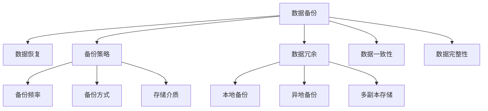

                 

# AI 大模型应用数据中心的数据备份

> 关键词：AI大模型,数据备份,数据安全,数据恢复,数据冗余

## 1. 背景介绍

在人工智能（AI）时代，尤其是大模型的兴起，数据中心成为了支持这些复杂模型训练和运行的重要基础设施。随着数据量的激增，数据中心的备份和恢复机制显得尤为重要。尽管数据中心在物理上能够提供安全的环境，但数据丢失和损坏的风险始终存在。数据备份不仅需要确保数据的完整性和一致性，还需要能够在需要时快速恢复，以保证业务的连续性和可靠性。

### 1.1 问题由来

数据中心存储大量关键数据，包括模型训练数据、中间结果和最终模型文件。这些数据一旦丢失或损坏，可能导致模型失效，影响业务运营。因此，数据备份是数据中心运营的关键环节之一。传统的数据备份方法往往采用定时复制、增量备份等技术，但这些方法在大规模数据和复杂模型场景下，面临存储和恢复效率低下的问题。

### 1.2 问题核心关键点

在数据中心备份问题上，核心在于：
1. **数据完整性**：确保备份数据与原数据完全一致，避免数据丢失和损坏。
2. **备份效率**：在大规模数据集和复杂模型中，备份和恢复的效率直接影响系统的可用性和性能。
3. **恢复速度**：在数据丢失或损坏时，快速恢复数据中心服务，避免业务中断。
4. **备份策略**：根据数据重要性，选择不同的备份策略和存储介质，确保备份数据的可用性和成本效益。
5. **冗余和容灾**：通过多副本存储、跨数据中心部署等措施，提高数据备份的可靠性和持久性。

### 1.3 问题研究意义

研究和实施高效的数据备份机制，对于保障数据中心的安全和业务连续性具有重要意义：

1. **减少数据丢失风险**：通过定期的数据备份，即使发生硬件故障或人为失误，也可以快速恢复数据，保障业务连续性。
2. **提升系统可靠性**：备份机制是数据中心高可用性设计的重要组成部分，确保数据中心的稳定运行。
3. **支持业务迭代和优化**：备份数据可以帮助研究人员和开发者跟踪模型和数据的变化，支持模型的迭代优化。
4. **合规性要求**：某些行业对数据备份有严格的合规要求，如金融、医疗等，备份机制是合规审核的重要内容。
5. **业务连续性和灾难恢复**：在极端情况下，如自然灾害等，备份数据是关键资产，确保业务能够快速恢复。

## 2. 核心概念与联系

### 2.1 核心概念概述

为更好地理解数据中心数据备份的原理和流程，本节将介绍几个密切相关的核心概念：

- **数据备份(Data Backup)**：指在数据中心存储环境中，定期或实时地将数据复制到另一个存储介质上的过程，用于在数据丢失或损坏时进行恢复。
- **数据恢复(Data Recovery)**：指从备份介质中读取数据，恢复到原始存储介质或目标环境中的过程。
- **备份策略(Backup Strategy)**：指根据数据的重要性和业务需求，制定的备份频率、备份方式、存储介质等策略。
- **数据冗余(Data Redundancy)**：指通过复制数据，确保数据备份的可靠性和持久性，常见的有本地备份、异地备份、多副本存储等。
- **数据一致性(Data Consistency)**：指备份数据与原数据的精确一致性，避免数据丢失或损坏。
- **数据完整性(Data Integrity)**：指备份数据中不包含任何损坏或缺失的部分，确保数据的可用性和完整性。

这些核心概念之间的逻辑关系可以通过以下Mermaid流程图来展示：



这个流程图展示了大模型数据中心备份的关键概念及其之间的关系：

1. 数据备份是数据恢复的前提，通过备份数据确保数据丢失时能够快速恢复。
2. 备份策略指导备份频率、方式和存储介质，确保备份数据的可用性和成本效益。
3. 数据冗余通过多副本存储等手段，提高备份数据的可靠性和持久性。
4. 数据一致性和数据完整性是备份数据的基本要求，确保备份数据的质量和可用性。

这些概念共同构成了数据中心数据备份的基本框架，使得备份机制能够有效地保障数据的可靠性和业务的连续性。

## 3. 核心算法原理 & 具体操作步骤
### 3.1 算法原理概述

数据中心的数据备份，本质上是一个数据复制和存储的过程。其核心思想是：通过定时或实时地将数据复制到另一个存储介质上，以实现数据丢失或损坏时的快速恢复。

形式化地，假设原始数据集为 $D=\{x_1,x_2,...,x_n\}$，其中 $x_i$ 表示第 $i$ 个数据点。备份策略为 $\mathcal{B}=\{S,\Delta,T\}$，其中 $S$ 表示备份存储介质，$\Delta$ 表示备份频率（如每天备份一次），$T$ 表示备份窗口大小（如保留最近一天的数据）。则备份过程可以描述为：

$$
\text{Backup}(D,\mathcal{B}) = \{B_1,B_2,...,B_k\}
$$

其中 $B_i$ 表示第 $i$ 个备份数据集，包含在时间窗口 $t_{i-1}$ 到 $t_i$ 内生成的数据。

数据恢复的过程可以描述为：

$$
\text{Restore}(D,\mathcal{B},B_k) = D_{\text{restored}}
$$

其中 $D_{\text{restored}}$ 表示恢复后的原始数据集，包含从备份数据集 $B_k$ 中读取的数据。

### 3.2 算法步骤详解

数据中心的数据备份和恢复过程一般包括以下几个关键步骤：

**Step 1: 设计备份策略**
- 确定备份频率 $\Delta$，如每天、每周等。
- 确定备份窗口大小 $T$，如保留最近一天的数据。
- 选择合适的备份存储介质 $S$，如硬盘、云存储等。

**Step 2: 实现数据备份**
- 将原始数据 $D$ 分批次复制到备份存储介质 $S$ 中。
- 对于大规模数据集，可以采用增量备份、异步备份等技术，提高备份效率。
- 确保备份数据的完整性和一致性，使用校验和、数据指纹等技术验证备份数据的正确性。

**Step 3: 实现数据恢复**
- 从备份存储介质 $S$ 中读取最新的备份数据集 $B_k$。
- 将备份数据 $B_k$ 恢复到原始存储介质或目标环境 $D_{\text{restored}}$ 中。
- 确保恢复数据的一致性和完整性，使用校验和、数据指纹等技术验证恢复数据的正确性。

**Step 4: 监控备份状态**
- 实时监控备份过程的状态，包括备份进度、存储介质状态等。
- 根据备份状态调整备份策略，如遇到存储介质故障，立即启动应急备份流程。

**Step 5: 测试和优化**
- 定期测试备份和恢复过程，评估备份数据的可用性和恢复速度。
- 根据测试结果优化备份策略，如增加备份频率、优化存储介质等。

### 3.3 算法优缺点

数据中心的数据备份方法具有以下优点：
1. **高可用性**：通过备份机制，数据中心在硬件故障或人为失误时，可以快速恢复，保障业务连续性。
2. **数据冗余**：备份数据提供多副本存储，提高数据冗余性和持久性，降低数据丢失风险。
3. **灵活性**：备份策略可以根据数据的重要性和业务需求进行调整，优化备份效率和成本。

同时，该方法也存在一些局限性：
1. **存储成本高**：备份数据的存储需要大量存储空间，尤其是在大规模数据集和复杂模型中。
2. **备份效率低**：在增量备份和异步备份模式下，备份过程的效率可能受到影响。
3. **恢复过程复杂**：恢复数据时，需要确保备份数据的完整性和一致性，恢复过程可能较为复杂。

尽管存在这些局限性，但就目前而言，数据中心备份仍然是保障数据安全和业务连续性的重要手段。未来相关研究的重点在于如何进一步降低备份存储成本，提高备份和恢复效率，同时兼顾数据完整性和一致性。

### 3.4 算法应用领域

数据中心数据备份技术广泛应用于各种业务场景，例如：

- 数据库备份和恢复：数据库作为核心数据存储系统，需要定期进行备份，确保在数据丢失或损坏时能够快速恢复。
- 文件服务器备份和恢复：文件服务器存储大量文件数据，备份机制是确保数据完整性和业务连续性的重要手段。
- 云存储备份和恢复：云存储服务提供商通常提供备份和恢复机制，帮助用户应对数据丢失和损坏的风险。
- 数据中心冗余部署：通过多数据中心备份和恢复，提高数据中心的容灾能力和业务连续性。
- 物理硬件故障恢复：在硬件故障发生时，备份数据可用于快速恢复硬件状态，保障业务连续性。

除了这些经典应用外，备份技术也被创新性地应用到更多场景中，如虚拟化备份、云原生备份、区块链数据备份等，为数据中心和云服务提供了更全面的保护。

## 4. 数学模型和公式 & 详细讲解 & 举例说明
### 4.1 数学模型构建

本节将使用数学语言对数据中心备份和恢复过程进行更加严格的刻画。

记原始数据集为 $D=\{x_1,x_2,...,x_n\}$，其中 $x_i$ 表示第 $i$ 个数据点。备份策略为 $\mathcal{B}=\{S,\Delta,T\}$，其中 $S$ 表示备份存储介质，$\Delta$ 表示备份频率，$T$ 表示备份窗口大小。备份数据集为 $B_k=\{x_{t_{k-1}},x_{t_k-1},...,x_{t_k}\}$，其中 $t_{k-1}$ 和 $t_k$ 表示备份时间窗口的起始和结束时间。

定义备份数据集 $B_k$ 的校验和为 $C(B_k)$，则备份数据的完整性可以通过校验和来验证：

$$
C(B_k) = \sum_{x_i \in B_k} C(x_i)
$$

其中 $C(x_i)$ 表示数据点 $x_i$ 的校验和。

### 4.2 公式推导过程

以下我们以数据库备份和恢复为例，推导备份数据校验和的计算公式。

假设数据库中存储的数据文件为 $D=\{f_1,f_2,...,f_n\}$，每个文件 $f_i$ 的校验和为 $C(f_i)$。备份策略为 $\mathcal{B}=\{S,\Delta,T\}$，则备份数据集 $B_k$ 的校验和为：

$$
C(B_k) = \sum_{f_j \in B_k} C(f_j)
$$

其中 $f_j$ 表示备份数据集 $B_k$ 中包含的文件。

在恢复过程中，将备份数据 $B_k$ 恢复到原始存储介质，并对每个文件 $f_j$ 重新计算校验和，并与恢复后的校验和 $C(f_j')$ 进行比较，以验证恢复数据的完整性：

$$
\text{Verify}(C(f_j),C(f_j')) = \left\{\begin{array}{ll}
\text{True}, & C(f_j) = C(f_j') \\
\text{False}, & C(f_j) \neq C(f_j')
\end{array}\right.
$$

如果所有恢复文件通过校验，则认为恢复成功，否则失败。

### 4.3 案例分析与讲解

假设某银行数据库存储了客户的账户信息，每个账户文件包含客户的姓名、余额等敏感信息。为确保数据的安全性和业务连续性，银行定期进行数据库备份。具体备份流程如下：

**Step 1: 设计备份策略**
- 备份频率为每天备份一次，备份窗口大小为最近一天的数据。
- 备份存储介质为云端存储服务。

**Step 2: 实现数据备份**
- 每天定时备份当前全天数据，并上传到云端存储。
- 对每个备份文件计算校验和，并存储到数据库的备份元数据表中。

**Step 3: 实现数据恢复**
- 在业务中断时，从云端存储中下载最新的备份数据集。
- 对每个备份文件重新计算校验和，并与恢复前存储的校验和进行比较，验证数据的完整性。
- 如果所有恢复文件通过校验，则将备份文件恢复到数据库中。

**Step 4: 监控备份状态**
- 实时监控备份过程的状态，包括备份进度、存储介质状态等。
- 根据备份状态调整备份策略，如遇到存储介质故障，立即启动应急备份流程。

**Step 5: 测试和优化**
- 定期测试备份和恢复过程，评估备份数据的可用性和恢复速度。
- 根据测试结果优化备份策略，如增加备份频率、优化存储介质等。

通过上述备份和恢复流程，银行可以确保数据库在硬件故障或人为失误时，快速恢复数据，保障业务的连续性和数据的安全性。

## 5. 项目实践：代码实例和详细解释说明
### 5.1 开发环境搭建

在进行数据中心备份和恢复实践前，我们需要准备好开发环境。以下是使用Python进行数据备份和恢复的开发环境配置流程：

1. 安装Anaconda：从官网下载并安装Anaconda，用于创建独立的Python环境。

2. 创建并激活虚拟环境：
```bash
conda create -n db_backup python=3.8 
conda activate db_backup
```

3. 安装必要的Python库：
```bash
pip install numpy pandas SQLAlchemy boto3
```

4. 配置环境变量：
```bash
export AWS_ACCESS_KEY_ID=YOUR_ACCESS_KEY
export AWS_SECRET_ACCESS_KEY=YOUR_SECRET_KEY
export AWS_STORAGE_CLASS=S3
export AWS_S3_BUCKET=YOUR_BUCKET_NAME
```

5. 运行Python脚本：
```bash
python backup.py
python restore.py
```

完成上述步骤后，即可在`db_backup`环境中开始数据中心备份和恢复的实践。

### 5.2 源代码详细实现

我们先以数据库备份为例，给出Python代码实现。

```python
import boto3
import numpy as np

# 初始化S3客户端
s3 = boto3.client('s3')

# 备份函数
def backup_db():
    # 从数据库中获取所有数据文件
    files = get_files_from_db()

    # 计算每个文件的校验和
    file_hashes = [calculate_hash(file) for file in files]

    # 创建备份文件列表
    backup_files = [file for file in files]

    # 将备份文件上传到S3
    upload_files_to_s3(backup_files)

    # 将校验和存储到数据库中
    store_hashes_to_db(file_hashes)

# 恢复函数
def restore_db():
    # 从S3中下载备份文件
    backup_files = download_files_from_s3()

    # 计算备份文件的校验和
    file_hashes = [calculate_hash(file) for file in backup_files]

    # 将备份文件恢复到数据库中
    restore_files_to_db(backup_files)

    # 验证恢复文件的完整性
    verify_files(file_hashes)

# 其他辅助函数
def get_files_from_db():
    # 从数据库中获取所有数据文件
    pass

def calculate_hash(file):
    # 计算文件的校验和
    pass

def upload_files_to_s3(files):
    # 将文件上传到S3
    pass

def store_hashes_to_db(file_hashes):
    # 将校验和存储到数据库中
    pass

def download_files_from_s3():
    # 从S3中下载备份文件
    pass

def restore_files_to_db(files):
    # 将备份文件恢复到数据库中
    pass

def verify_files(file_hashes):
    # 验证恢复文件的完整性
    pass
```

这段代码实现了一个简单的数据中心备份和恢复流程，包括备份和恢复函数，以及其他辅助函数。在实际应用中，还需要进一步完善和优化。

### 5.3 代码解读与分析

让我们再详细解读一下关键代码的实现细节：

**backup_db函数**：
- 从数据库中获取所有数据文件。
- 计算每个文件的校验和，并存储到数据库中。
- 创建备份文件列表，并上传到S3存储介质中。

**restore_db函数**：
- 从S3中下载备份文件。
- 计算备份文件的校验和，并验证其完整性。
- 将备份文件恢复到数据库中。

**get_files_from_db函数**：
- 从数据库中获取所有数据文件，并进行预处理。

**calculate_hash函数**：
- 计算文件的校验和，可以使用MD5、SHA等哈希算法。

**upload_files_to_s3函数**：
- 将文件上传到S3存储介质中。

**store_hashes_to_db函数**：
- 将校验和存储到数据库中。

**download_files_from_s3函数**：
- 从S3中下载备份文件。

**restore_files_to_db函数**：
- 将备份文件恢复到数据库中。

**verify_files函数**：
- 验证恢复文件的完整性，使用校验和进行比较。

这些函数共同构成了一个完整的数据中心备份和恢复流程，包括数据获取、校验和计算、备份存储、恢复验证等关键步骤。在实际应用中，开发者可以根据具体需求进一步完善和优化这些函数，以实现更加高效和可靠的数据备份和恢复机制。

## 6. 实际应用场景
### 6.1 智能客服系统

在智能客服系统中，数据备份和恢复机制至关重要。客服系统需要处理大量的用户请求和对话记录，数据丢失或损坏可能导致用户投诉增加、客户流失，甚至影响品牌声誉。通过定期的数据备份，客服系统可以在硬件故障或数据损坏时快速恢复，确保服务的连续性和可靠性。

### 6.2 金融舆情监测系统

金融舆情监测系统需要实时收集和分析互联网上的金融舆情，为决策者提供参考。系统中的数据量庞大且实时性要求高，数据备份和恢复机制是不可或缺的。定期备份系统数据，可以在数据丢失或损坏时快速恢复，避免因数据丢失导致的决策失误。

### 6.3 医疗影像诊断系统

医疗影像诊断系统存储了大量患者的影像数据，数据备份和恢复机制可以确保系统在硬件故障或数据损坏时，能够快速恢复，保障医疗服务的连续性和数据的安全性。通过定期备份和冗余存储，系统可以抵御硬件故障和自然灾害等风险，保障患者的隐私和数据安全。

### 6.4 未来应用展望

随着数据中心备份技术的不断发展，未来将在以下几个方面进一步演进：

1. **云原生备份**：利用云存储和容器技术，实现更高效、更灵活的数据备份和恢复。
2. **自动化的备份和恢复**：通过自动化脚本和监控系统，实现备份和恢复的自动化，减少人工干预和操作错误。
3. **跨数据中心备份**：在多个数据中心之间进行数据备份和恢复，提高数据冗余性和容灾能力。
4. **多副本存储和冗余**：通过多副本存储和冗余机制，提高数据的可靠性和持久性。
5. **区块链技术备份**：利用区块链的不可篡改性和分布式特性，提供更加安全可靠的数据备份解决方案。

这些技术的发展将进一步提升数据中心的数据备份和恢复能力，保障数据的安全性和业务的连续性。

## 7. 工具和资源推荐
### 7.1 学习资源推荐

为了帮助开发者系统掌握数据中心备份和恢复的理论基础和实践技巧，这里推荐一些优质的学习资源：

1. 《数据中心技术》系列书籍：详细介绍了数据中心的基础设施、备份和恢复机制等核心内容，是数据中心运维人员的必读书籍。
2. AWS 云存储文档：详细介绍了AWS S3等云存储服务的数据备份和恢复机制，帮助云服务用户实现高效的数据备份。
3. Google Cloud Storage文档：介绍了Google Cloud Storage的数据备份和恢复机制，支持跨地域和多副本存储。
4. IBM数据中心备份和恢复课程：IBM提供的在线课程，系统介绍了数据中心的备份和恢复技术，包括硬件冗余、数据复制等。
5. Red Hat企业级备份和恢复培训课程：Red Hat提供的培训课程，涵盖数据中心备份和恢复的最佳实践和工具使用。

通过这些学习资源，开发者可以系统掌握数据中心备份和恢复的理论基础和实践技巧，进一步提升自身的专业水平。

### 7.2 开发工具推荐

高效的开发离不开优秀的工具支持。以下是几款用于数据中心备份和恢复开发的常用工具：

1. AWS Backup：AWS提供的云备份服务，支持S3、EBS等多种存储介质的备份和恢复。
2. Google Cloud Storage：Google提供的云存储服务，支持跨地域和多副本存储，具备高可用性和高可靠性。
3. IBM Spectrum Protect：IBM提供的企业级数据备份和恢复解决方案，支持混合云备份和恢复。
4. Acronis Backup：功能强大的企业级备份和恢复工具，支持本地和云备份，具备自动化和监控功能。
5. Veeam Backup & Replication：功能丰富的备份和恢复工具，支持多种数据源和存储介质的备份和恢复。

合理利用这些工具，可以显著提升数据中心备份和恢复的开发效率，加快创新迭代的步伐。

### 7.3 相关论文推荐

数据中心备份技术的研究源于学界的持续探索。以下是几篇奠基性的相关论文，推荐阅读：

1. "A Survey of Data Backup Technologies"（《数据备份技术的综述》）：介绍数据备份技术的现状和发展趋势，帮助读者全面了解该领域的进展。
2. "Cloud-Based Backup Solutions: Trends and Challenges"（《基于云的备份解决方案：趋势和挑战》）：讨论云备份技术的发展和应用，分析其面临的挑战和解决方案。
3. "Storage Systems and Technologies: Data Replication"（《存储系统和技术：数据复制》）：介绍数据复制技术的基本原理和应用场景，帮助读者理解数据冗余和容灾机制。
4. "Blockchain-Based Data Backup System"（《基于区块链的数据备份系统》）：提出基于区块链的数据备份解决方案，利用区块链的不可篡改性提高数据备份的安全性和可靠性。
5. "Data Backup and Recovery Strategies for Cloud Computing"（《云计算中的数据备份和恢复策略》）：讨论云环境下的数据备份和恢复策略，分析其特点和优势。

这些论文代表了大数据中心备份技术的研究前沿，通过学习这些前沿成果，可以帮助研究者把握学科前进方向，激发更多的创新灵感。

## 8. 总结：未来发展趋势与挑战
### 8.1 总结

本文对数据中心备份和恢复技术进行了全面系统的介绍。首先阐述了数据中心备份和恢复的重要性和挑战，明确了备份机制在保障数据安全和业务连续性方面的核心作用。其次，从原理到实践，详细讲解了数据备份和恢复的数学模型和关键步骤，给出了数据备份和恢复的代码实现和详细解释。同时，本文还探讨了数据备份和恢复技术的广泛应用场景，展示了其在智能客服、金融舆情、医疗影像等领域的重要价值。此外，本文精选了数据备份和恢复技术的各类学习资源，力求为读者提供全方位的技术指引。

通过本文的系统梳理，可以看到，数据中心备份和恢复技术在保障数据安全和业务连续性方面具有重要意义。备份机制不仅能够防止数据丢失和损坏，还能提高数据的冗余性和容灾能力，是数据中心高可用性设计的关键组成部分。未来，随着技术的不断进步，数据备份和恢复将变得更加高效、可靠和灵活，为数据中心和云服务提供更全面的保护。

### 8.2 未来发展趋势

展望未来，数据中心备份和恢复技术将呈现以下几个发展趋势：

1. **云原生备份**：利用云存储和容器技术，实现更高效、更灵活的数据备份和恢复。云原生备份将为数据中心提供更加灵活和可扩展的备份解决方案。
2. **自动化备份和恢复**：通过自动化脚本和监控系统，实现备份和恢复的自动化，减少人工干预和操作错误。自动化备份和恢复将提高备份和恢复的效率和准确性。
3. **跨数据中心备份**：在多个数据中心之间进行数据备份和恢复，提高数据冗余性和容灾能力。多数据中心备份将为数据中心提供更加可靠的备份和恢复机制。
4. **区块链技术备份**：利用区块链的不可篡改性和分布式特性，提供更加安全可靠的数据备份解决方案。区块链技术备份将提升数据备份的安全性和透明性。
5. **持续数据保护**：利用持续数据保护(CDP)技术，实现数据的实时备份和恢复，避免数据丢失和损坏。CDP技术将进一步提升数据中心的数据保护能力。

这些趋势凸显了数据中心备份和恢复技术的发展方向，将进一步提升数据中心的数据安全和业务连续性。

### 8.3 面临的挑战

尽管数据中心备份和恢复技术已经取得了一定的进展，但在实现高效、可靠、安全的数据备份和恢复方面，仍面临以下挑战：

1. **存储成本高**：大规模数据备份需要大量的存储资源，存储成本较高。如何在提高备份效率的同时，降低存储成本，是一个重要的研究方向。
2. **备份效率低**：在增量备份和异步备份模式下，备份效率可能受到影响。如何提高备份效率，减少备份时间，是备份技术需要解决的难题。
3. **数据完整性和一致性**：在备份和恢复过程中，确保数据的完整性和一致性是关键。如何验证备份数据的正确性和完整性，是备份技术需要解决的问题。
4. **恢复过程复杂**：恢复数据时，需要确保备份数据的完整性和一致性，恢复过程可能较为复杂。如何简化恢复过程，提高恢复效率，是备份技术需要解决的问题。
5. **灾难恢复和容灾**：在极端情况下，如自然灾害等，数据备份的可靠性和持久性面临挑战。如何实现跨地域和多数据中心的备份和恢复，提高容灾能力，是备份技术需要解决的问题。

这些挑战凸显了数据中心备份和恢复技术的复杂性，需要在备份策略、备份工具、备份流程等多个环节进行深入研究，以实现高效、可靠、安全的数据备份和恢复机制。

### 8.4 研究展望

面对数据中心备份和恢复技术所面临的挑战，未来的研究需要在以下几个方面寻求新的突破：

1. **分布式备份和恢复**：通过分布式备份和恢复技术，提高备份和恢复的效率和可靠性。分布式备份和恢复将为数据中心提供更加灵活和可扩展的备份解决方案。
2. **智能化备份和恢复**：利用机器学习和大数据技术，实现备份和恢复的智能化，优化备份策略和恢复流程。智能化备份和恢复将提高备份和恢复的效率和准确性。
3. **区块链技术备份**：利用区块链的不可篡改性和分布式特性，提供更加安全可靠的数据备份解决方案。区块链技术备份将提升数据备份的安全性和透明性。
4. **跨平台备份和恢复**：通过跨平台备份和恢复技术，支持不同数据源和存储介质的备份和恢复。跨平台备份和恢复将为数据中心提供更加灵活和可扩展的备份解决方案。
5. **多层次数据保护**：利用多层次的数据保护机制，包括文件、数据库、应用等多层次的备份和恢复。多层次数据保护将提高数据中心的数据保护能力。

这些研究方向将引领数据中心备份和恢复技术的进步，为数据中心和云服务提供更全面、高效和可靠的数据保护机制。面向未来，数据中心备份和恢复技术将结合多种技术手段，共同构建更加安全、可靠、高效的数据中心备份和恢复体系。

## 9. 附录：常见问题与解答

**Q1：数据备份和恢复有哪些步骤？**

A: 数据备份和恢复的步骤主要包括：
1. 设计备份策略，包括备份频率、备份窗口大小和存储介质。
2. 实现数据备份，将原始数据复制到备份存储介质中。
3. 实现数据恢复，从备份存储介质中读取备份数据，恢复到原始存储介质或目标环境。
4. 监控备份状态，实时监控备份过程的状态，调整备份策略。
5. 测试和优化，定期测试备份和恢复过程，优化备份策略。

**Q2：如何选择备份存储介质？**

A: 备份存储介质的选择需要考虑以下因素：
1. 存储容量：备份存储介质的容量应满足备份数据的需求。
2. 成本效益：备份存储介质的成本和性能应平衡。
3. 可靠性：备份存储介质的可靠性和持久性应满足业务需求。
4. 可扩展性：备份存储介质应支持数据扩展和迁移。

常见的备份存储介质包括硬盘、磁带、云存储等。可以根据实际需求进行选择。

**Q3：数据备份时需要注意哪些问题？**

A: 数据备份时需要注意以下问题：
1. 数据的完整性和一致性：确保备份数据的完整性和一致性，避免数据丢失或损坏。
2. 存储介质的可靠性和持久性：选择合适的存储介质，确保备份数据的可靠性和持久性。
3. 备份效率：提高备份效率，减少备份时间。
4. 备份策略的灵活性和可扩展性：根据数据的重要性和业务需求，调整备份策略，优化备份效率和成本。
5. 备份过程的自动化和监控：通过自动化脚本和监控系统，实现备份和恢复的自动化，减少人工干预和操作错误。

通过合理设计和优化备份过程，可以最大化地提高数据备份的效率和可靠性，确保数据中心的安全和业务的连续性。

**Q4：数据恢复时需要注意哪些问题？**

A: 数据恢复时需要注意以下问题：
1. 恢复数据的完整性和一致性：确保恢复数据的完整性和一致性，验证恢复数据的正确性。
2. 恢复过程的自动化和监控：通过自动化脚本和监控系统，实现恢复过程的自动化，减少人工干预和操作错误。
3. 恢复数据的验证和测试：通过测试数据和验证过程，确保恢复数据的正确性和可靠性。
4. 恢复数据的安全性和隐私保护：在恢复过程中，确保恢复数据的安全性和隐私保护，避免数据泄露和滥用。
5. 恢复过程的监控和告警：实时监控恢复过程的状态，设置异常告警阈值，确保恢复过程的顺利进行。

通过合理设计和优化恢复过程，可以最大化地提高数据恢复的效率和可靠性，确保数据中心的安全和业务的连续性。

**Q5：数据中心备份和恢复的实际应用有哪些？**

A: 数据中心备份和恢复的实际应用包括：
1. 数据库备份和恢复：备份数据库数据，避免数据丢失和损坏，支持数据恢复和业务连续性。
2. 文件服务器备份和恢复：备份文件服务器数据，支持文件恢复和业务连续性。
3. 云存储备份和恢复：备份云存储数据，支持数据恢复和业务连续性。
4. 数据中心冗余部署：通过多数据中心备份和恢复，提高数据冗余性和容灾能力。
5. 物理硬件故障恢复：备份物理硬件状态，支持硬件恢复和业务连续性。

这些应用场景展示了数据中心备份和恢复技术在实际中的应用价值和重要性。

---

作者：禅与计算机程序设计艺术 / Zen and the Art of Computer Programming

