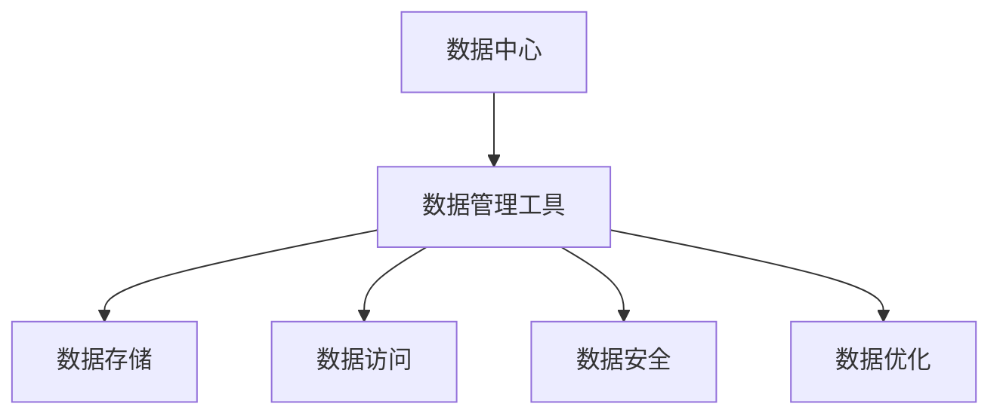

                 

# AI 大模型应用数据中心的数据管理工具

> 关键词：
1. 人工智能(AI)大模型
2. 数据中心
3. 数据管理
4. 模型训练
5. 数据存储
6. 高效访问
7. 安全性

## 1. 背景介绍

### 1.1 问题由来

随着人工智能技术的不断进步，尤其是深度学习模型的快速发展，大模型在各种应用场景中取得了显著成果。然而，这些模型的训练和运行需要大量的数据资源，数据中心在这一过程中扮演着至关重要的角色。数据中心的建设和管理水平直接影响AI大模型的训练效果和应用质量。

在数据中心中，数据管理工具是大模型应用的基础设施。数据管理工具的好坏直接关系到数据的存储、访问和处理效率。本文将详细探讨AI大模型应用数据中心的数据管理工具，帮助读者理解这些工具的原理和应用。

### 1.2 问题核心关键点

数据管理工具的核心在于如何高效、安全地存储、管理和访问数据，以及如何与AI大模型的训练和推理过程无缝衔接。关键点包括：

- 数据的存储和管理方式。
- 数据的访问速度和效率。
- 数据的安全性和隐私保护。
- 与AI大模型训练和推理的协同优化。

本文将围绕这些问题，深入剖析数据管理工具的设计和实现，并提供实际的代码示例和应用场景。

## 2. 核心概念与联系

### 2.1 核心概念概述

在讨论数据管理工具之前，首先需要明确几个关键概念：

- AI大模型：指通过大规模深度学习训练得到的复杂模型，能够进行复杂的特征提取和决策。
- 数据中心：由大量服务器、存储设备和网络设备构成的数据处理环境，支持大模型的训练和推理。
- 数据管理工具：用于数据存储、访问和处理的工具，是大模型应用的重要基础设施。

这些概念之间相互关联，共同构成了AI大模型应用的数据生态系统。

### 2.2 核心概念原理和架构的 Mermaid 流程图

以下是数据管理工具的核心概念原理和架构的 Mermaid 流程图：



这个流程图展示了数据管理工具在数据中心中的作用。数据管理工具负责数据存储、访问、安全和优化，确保AI大模型的训练和推理能够高效、安全地进行。

## 3. 核心算法原理 & 具体操作步骤

### 3.1 算法原理概述

数据管理工具的核心算法原理在于高效、安全地存储、管理和访问数据。主要包括以下几个方面：

- 数据存储：通过分布式文件系统或数据库存储数据，支持大规模数据的分布式存储。
- 数据访问：通过缓存和索引技术，提高数据访问速度和效率。
- 数据安全：通过访问控制和加密技术，确保数据的安全性和隐私保护。
- 数据优化：通过数据压缩和缓存技术，优化数据访问和存储效率。

### 3.2 算法步骤详解

以下是数据管理工具的核心算法步骤：

**Step 1: 数据存储**

- 使用分布式文件系统（如Hadoop、Ceph）或数据库（如MySQL、MongoDB）存储数据。
- 将数据按照不同的类型和用途进行分区和命名。
- 定期进行数据备份，确保数据的安全性和可恢复性。

**Step 2: 数据访问**

- 使用缓存技术（如Redis、Memcached）缓存热点数据，提高访问速度。
- 使用索引技术（如B+树、哈希索引）加速数据查询。
- 优化数据访问路径，减少I/O操作，提高访问效率。

**Step 3: 数据安全**

- 使用访问控制列表（ACL）或角色基準（RBAC）进行数据权限控制。
- 对敏感数据进行加密存储和传输。
- 使用审计日志记录数据访问行为，确保数据安全。

**Step 4: 数据优化**

- 使用数据压缩技术（如Gzip、Snappy）减少存储空间。
- 使用缓存技术（如Hadoop的HDFS缓存）提高数据访问速度。
- 使用数据分区技术（如分片、分桶）优化数据分布和访问。

### 3.3 算法优缺点

数据管理工具的优势在于能够高效、安全地存储和管理数据，支持大规模数据的分布式存储和访问。但同时也存在一些缺点：

- 复杂度较高：数据管理工具的实现和维护需要较高的技术水平。
- 成本较高：高可用性和高扩展性的数据中心需要大量的硬件投入。
- 数据冗余：数据存储和备份需要占用大量的存储空间。

### 3.4 算法应用领域

数据管理工具广泛应用于各种AI大模型应用场景中，包括：

- 计算机视觉：存储和访问大规模图像和视频数据。
- 自然语言处理：存储和访问大规模文本数据。
- 语音识别：存储和访问大规模音频数据。
- 推荐系统：存储和访问用户行为和物品属性数据。

## 4. 数学模型和公式 & 详细讲解 & 举例说明

### 4.1 数学模型构建

数据管理工具的数学模型构建主要涉及数据的分布式存储、访问和优化。以下是一些关键的数学模型：

**数据分布式存储模型：**

假设数据中心有n个节点，每个节点存储了数据集D的1/k部分，其中k是数据分片的数量。数据存储的位置可以使用哈希函数计算，即：

$$
hash(D_i) = (hash(D) + i) \mod n
$$

其中，$D_i$表示数据分片i，$hash(D)$表示整个数据集的哈希值，$i$表示节点的编号。

**数据访问速度模型：**

假设数据存储在缓存中，访问速度为$C$，未缓存时的访问速度为$S$。缓存命中率$H$表示访问缓存中的数据占总访问量的比例。则实际访问速度为：

$$
V = C \times H + S \times (1 - H)
$$

**数据压缩模型：**

假设原始数据大小为$V$，压缩后的数据大小为$V'$，压缩比为$r$。则：

$$
r = \frac{V'}{V}
$$

### 4.2 公式推导过程

以下是数据管理工具核心公式的推导过程：

**数据分布式存储：**

假设数据中心有n个节点，每个节点存储了数据集D的1/k部分，其中k是数据分片的数量。数据存储的位置可以使用哈希函数计算，即：

$$
hash(D_i) = (hash(D) + i) \mod n
$$

其中，$D_i$表示数据分片i，$hash(D)$表示整个数据集的哈希值，$i$表示节点的编号。

**数据访问速度：**

假设数据存储在缓存中，访问速度为$C$，未缓存时的访问速度为$S$。缓存命中率$H$表示访问缓存中的数据占总访问量的比例。则实际访问速度为：

$$
V = C \times H + S \times (1 - H)
$$

**数据压缩：**

假设原始数据大小为$V$，压缩后的数据大小为$V'$，压缩比为$r$。则：

$$
r = \frac{V'}{V}
$$

### 4.3 案例分析与讲解

以存储和访问大规模图像数据为例，分析数据管理工具的应用：

**数据存储：**

使用Hadoop的HDFS存储大规模图像数据。图像数据按照不同类型和用途进行分区和命名，每个分区存储在不同的HDFS节点上。通过使用分布式哈希表，可以快速定位数据分片的位置。

**数据访问：**

使用Redis缓存热点图像数据，减少访问HDFS的开销。同时使用HDFS的块缓存技术，将频繁访问的数据块缓存到本地内存中，进一步提高访问速度。

**数据安全：**

使用RBAC进行数据访问权限控制，确保只有授权用户才能访问敏感数据。对敏感数据进行加密存储和传输，防止数据泄露。

**数据优化：**

使用Gzip对图像数据进行压缩，减少存储空间。同时使用Hadoop的HDFS数据分区技术，优化数据分布和访问。

## 5. 项目实践：代码实例和详细解释说明

### 5.1 开发环境搭建

以下是使用Python进行数据管理工具开发的开发环境配置流程：

1. 安装Anaconda：从官网下载并安装Anaconda，用于创建独立的Python环境。

2. 创建并激活虚拟环境：
```bash
conda create -n data-management python=3.8 
conda activate data-management
```

3. 安装Python包：
```bash
pip install hdfs pyhdfs redis
```

4. 安装数据管理工具的Python封装库：
```bash
pip install hdfs-io-article
```

### 5.2 源代码详细实现

以下是使用Hadoop和Redis实现数据管理工具的Python代码实现：

```python
from hdfs import InsecureClient
from hdfs.io import HDFSClient
from redis import Redis

# 初始化HDFS客户端
client = InsecureClient('http://hdfs:50070', user='hdfs')

# 初始化Redis客户端
redis_client = Redis(host='localhost', port=6379)

# 存储数据到HDFS
def store_data_to_hdfs(data_path, file_name, data):
    file_path = f'/user/hdfs/{file_name}'
    with client.write(file_path, replication=3) as writer:
        writer.write(data.encode())

# 从HDFS读取数据
def read_data_from_hdfs(data_path, file_name):
    file_path = f'/user/hdfs/{file_name}'
    with client.read(file_path) as reader:
        return reader.read()

# 缓存数据到Redis
def cache_data_to_redis(key, data):
    redis_client.set(key, data)

# 从Redis读取数据
def read_data_from_redis(key):
    return redis_client.get(key)
```

### 5.3 代码解读与分析

让我们再详细解读一下关键代码的实现细节：

**store_data_to_hdfs函数**：
- 使用Hadoop的HDFS客户端将数据存储到HDFS，设置3份复制，确保数据的可靠性。
- 使用HDFS的write方法将数据写入文件，并自动进行分片和复制。

**read_data_from_hdfs函数**：
- 使用Hadoop的HDFS客户端从HDFS读取数据。
- 使用HDFS的read方法读取文件，返回数据字符串。

**cache_data_to_redis函数**：
- 使用Redis客户端将数据缓存到Redis，支持快速访问。
- 使用Redis的set方法将数据存储到Redis。

**read_data_from_redis函数**：
- 使用Redis客户端从Redis读取数据。
- 使用Redis的get方法读取缓存的数据。

**运行结果展示**：
- 使用store_data_to_hdfs函数将数据存储到HDFS，可以使用read_data_from_hdfs函数读取数据。
- 使用cache_data_to_redis函数将数据缓存到Redis，可以使用read_data_from_redis函数读取缓存的数据。

## 6. 实际应用场景

### 6.1 智能医疗

在智能医疗领域，数据管理工具可以用于存储和访问大规模患者数据、医疗影像数据和医疗记录。通过数据管理工具的高效管理和访问，智能医疗系统可以更快地进行数据查询、分析和处理，提升医疗服务的质量和效率。

### 6.2 金融风控

在金融风控领域，数据管理工具可以用于存储和访问大规模交易数据、用户行为数据和风险评估数据。通过数据管理工具的高效管理和访问，金融风控系统可以更快地进行数据查询、分析和处理，提高风险评估的准确性和及时性，减少金融风险。

### 6.3 智能制造

在智能制造领域，数据管理工具可以用于存储和访问大规模生产数据、设备运行数据和质量检测数据。通过数据管理工具的高效管理和访问，智能制造系统可以更快地进行数据查询、分析和处理，提升生产效率和产品质量。

### 6.4 未来应用展望

未来，数据管理工具将在更多领域得到应用，为各行各业带来变革性影响。

- 在智慧城市治理中，数据管理工具可以用于存储和访问城市基础设施数据、环境数据和公共安全数据。通过数据管理工具的高效管理和访问，智慧城市治理系统可以更快地进行数据查询、分析和处理，提高城市管理的自动化和智能化水平，构建更安全、高效的未来城市。

- 在智慧农业中，数据管理工具可以用于存储和访问农业生产数据、土壤数据和气象数据。通过数据管理工具的高效管理和访问，智慧农业系统可以更快地进行数据查询、分析和处理，提升农业生产效率和农产品质量。

- 在智慧能源中，数据管理工具可以用于存储和访问能源生产数据、设备运行数据和能耗数据。通过数据管理工具的高效管理和访问，智慧能源系统可以更快地进行数据查询、分析和处理，提高能源利用效率，减少能源浪费。

## 7. 工具和资源推荐

### 7.1 学习资源推荐

为了帮助开发者系统掌握数据管理工具的理论基础和实践技巧，这里推荐一些优质的学习资源：

1. 《分布式文件系统》系列博文：由大模型技术专家撰写，深入浅出地介绍了分布式文件系统的原理、应用和最佳实践。

2. 《Redis官方文档》：Redis官方提供的文档，涵盖了Redis的基本用法、高级功能和性能调优等，是Redis学习的重要资源。

3. 《Apache Hadoop官方文档》：Hadoop官方提供的文档，涵盖了Hadoop的基本用法、高级功能和性能调优等，是Hadoop学习的重要资源。

4. 《数据管理工具》课程：各大在线教育平台提供的相关课程，系统介绍了数据管理工具的原理、应用和最佳实践。

5. 《数据管理工具》书籍：介绍数据管理工具的书籍，涵盖了数据存储、访问、安全和优化等各个方面，是深入学习的必备资料。

通过对这些资源的学习实践，相信你一定能够快速掌握数据管理工具的精髓，并用于解决实际的数据管理问题。

### 7.2 开发工具推荐

高效的开发离不开优秀的工具支持。以下是几款用于数据管理工具开发的常用工具：

1. Python：由于其简洁易用和丰富的第三方库，Python是数据管理工具开发的首选语言。

2. Hadoop：由Apache基金会主导开发的分布式计算框架，支持大规模数据处理。

3. Redis：由VMware公司主导开发的内存数据库，支持高性能的数据缓存和访问。

4. HDFS：Hadoop的分布式文件系统，支持大规模数据的分布式存储。

5. ElasticSearch：分布式搜索引擎，支持大规模数据的快速查询和索引。

6. Spark：Apache基金会主导开发的分布式计算框架，支持大规模数据的处理和分析。

合理利用这些工具，可以显著提升数据管理工具的开发效率，加快创新迭代的步伐。

### 7.3 相关论文推荐

数据管理工具的发展源于学界的持续研究。以下是几篇奠基性的相关论文，推荐阅读：

1. Google File System：Google公司发表的分布式文件系统论文，奠定了分布式存储技术的基础。

2. Hadoop分布式文件系统：Apache基金会发表的分布式文件系统论文，介绍了HDFS的基本原理和应用。

3. Redis：VMware公司发表的内存数据库论文，介绍了Redis的基本原理和应用。

4. MapReduce：Google公司发表的分布式计算论文，介绍了MapReduce的基本原理和应用。

5. Spark分布式计算框架：Apache基金会发表的分布式计算框架论文，介绍了Spark的基本原理和应用。

这些论文代表了大数据管理技术的发展脉络。通过学习这些前沿成果，可以帮助研究者把握学科前进方向，激发更多的创新灵感。

## 8. 总结：未来发展趋势与挑战

### 8.1 总结

本文对数据管理工具在大模型应用数据中心中的作用进行了全面系统的介绍。首先阐述了数据管理工具在大模型应用中的重要性，明确了其在数据存储、访问、安全和优化方面的核心作用。其次，从原理到实践，详细讲解了数据管理工具的设计和实现，提供了实际的代码示例和应用场景。同时，本文还广泛探讨了数据管理工具在智能医疗、金融风控、智能制造等众多领域的应用前景，展示了数据管理工具的广阔应用空间。

通过本文的系统梳理，可以看到，数据管理工具是大模型应用基础设施的重要组成部分，其设计和实现对大模型的训练和推理效率有着至关重要的影响。未来，伴随数据管理工具的持续演进，相信大模型在各行业的应用将更加高效、安全和稳定。

### 8.2 未来发展趋势

展望未来，数据管理工具将呈现以下几个发展趋势：

- 数据管理技术的智能化：未来数据管理工具将更加智能化，能够自动检测数据访问模式，优化数据管理策略，提高数据访问效率。

- 数据管理技术的融合化：未来数据管理工具将与人工智能、区块链等技术进行深度融合，形成更加全面、安全、高效的数据管理解决方案。

- 数据管理技术的分布化：未来数据管理工具将更加分布化，支持大规模、分布式数据的存储和管理，提升数据处理能力。

- 数据管理技术的个性化：未来数据管理工具将更加个性化，根据不同行业和场景的需求，提供定制化的数据管理服务。

- 数据管理技术的安全性：未来数据管理工具将更加注重数据的安全性和隐私保护，确保数据的合规性和安全性。

以上趋势凸显了数据管理工具的广阔前景，这些方向的探索发展，必将进一步提升大模型应用的性能和安全性，为各行各业带来更高效、更安全、更可靠的数据管理服务。

### 8.3 面临的挑战

尽管数据管理工具已经取得了显著进展，但在迈向更加智能化、分布化、个性化的过程中，仍面临诸多挑战：

- 数据存储和访问效率：如何在大规模数据下保证高效的数据访问和存储，仍是数据管理工具面临的重要挑战。

- 数据安全性和隐私保护：如何在数据存储和访问过程中，确保数据的安全性和隐私保护，防止数据泄露和滥用，是数据管理工具的重要课题。

- 数据管理和人工智能的协同优化：如何将数据管理技术与人工智能技术进行深度融合，提升AI大模型的训练和推理效率，是未来数据管理工具的重要研究方向。

- 数据管理工具的复杂性：如何降低数据管理工具的复杂度，提高其易用性和可维护性，是未来数据管理工具的重要方向。

- 数据管理技术的标准化：如何在数据管理技术领域形成统一的标准和规范，促进数据管理技术的普及和应用，是未来数据管理工具的重要方向。

正视数据管理工具面临的这些挑战，积极应对并寻求突破，将是大模型数据管理工具迈向成熟的关键。相信随着学界和产业界的共同努力，这些挑战终将一一被克服，数据管理工具必将在构建安全、可靠、高效的大模型应用生态中扮演越来越重要的角色。

### 8.4 研究展望

未来，数据管理工具需要在以下几个方面寻求新的突破：

- 探索更加智能化的数据管理技术：通过引入人工智能技术，实现数据管理过程的自动化和智能化，提升数据管理效率。

- 研究更加安全的数据管理技术：通过引入区块链等技术，提升数据管理的透明度和安全性，确保数据合规和隐私保护。

- 开发更加分布化的数据管理技术：通过引入分布式计算和存储技术，支持大规模、分布式数据的存储和管理，提升数据处理能力。

- 探索更加个性化的数据管理技术：通过引入个性化推荐技术，根据不同行业和场景的需求，提供定制化的数据管理服务。

- 研究更加高效的数据管理技术：通过引入高性能计算和存储技术，提升数据管理效率，降低数据管理成本。

这些研究方向的探索，必将引领数据管理工具技术迈向更高的台阶，为构建安全、可靠、高效、智能的大模型应用生态提供技术保障。

## 9. 附录：常见问题与解答

**Q1：数据管理工具如何保证数据的安全性和隐私保护？**

A: 数据管理工具通过访问控制和加密技术，确保数据的安全性和隐私保护。具体措施包括：

- 使用访问控制列表（ACL）或角色基準（RBAC）进行数据权限控制，确保只有授权用户才能访问敏感数据。
- 对敏感数据进行加密存储和传输，防止数据泄露和滥用。
- 使用审计日志记录数据访问行为，确保数据安全。

**Q2：数据管理工具的存储效率如何？**

A: 数据管理工具的存储效率主要通过数据压缩技术实现。具体措施包括：

- 使用数据压缩技术（如Gzip、Snappy）减少存储空间。
- 使用缓存技术（如Hadoop的HDFS缓存）提高数据访问速度。

**Q3：数据管理工具的访问效率如何？**

A: 数据管理工具的访问效率主要通过缓存和索引技术实现。具体措施包括：

- 使用缓存技术（如Redis、Memcached）缓存热点数据，提高访问速度。
- 使用索引技术（如B+树、哈希索引）加速数据查询。

**Q4：数据管理工具的扩展性如何？**

A: 数据管理工具的扩展性主要通过分布式存储和计算技术实现。具体措施包括：

- 使用分布式文件系统（如Hadoop、Ceph）支持大规模数据的分布式存储。
- 使用分布式计算框架（如Spark、Flink）支持大规模数据的分布式计算。

**Q5：数据管理工具的易用性如何？**

A: 数据管理工具的易用性主要通过API接口和可视化管理界面实现。具体措施包括：

- 提供API接口支持数据管理工具的编程调用，提高易用性。
- 提供可视化管理界面，方便用户进行数据管理和监控。

通过对这些问题的解答，可以帮助读者全面了解数据管理工具的原理和应用，为实际开发和应用提供技术支持。

---

作者：禅与计算机程序设计艺术 / Zen and the Art of Computer Programming

