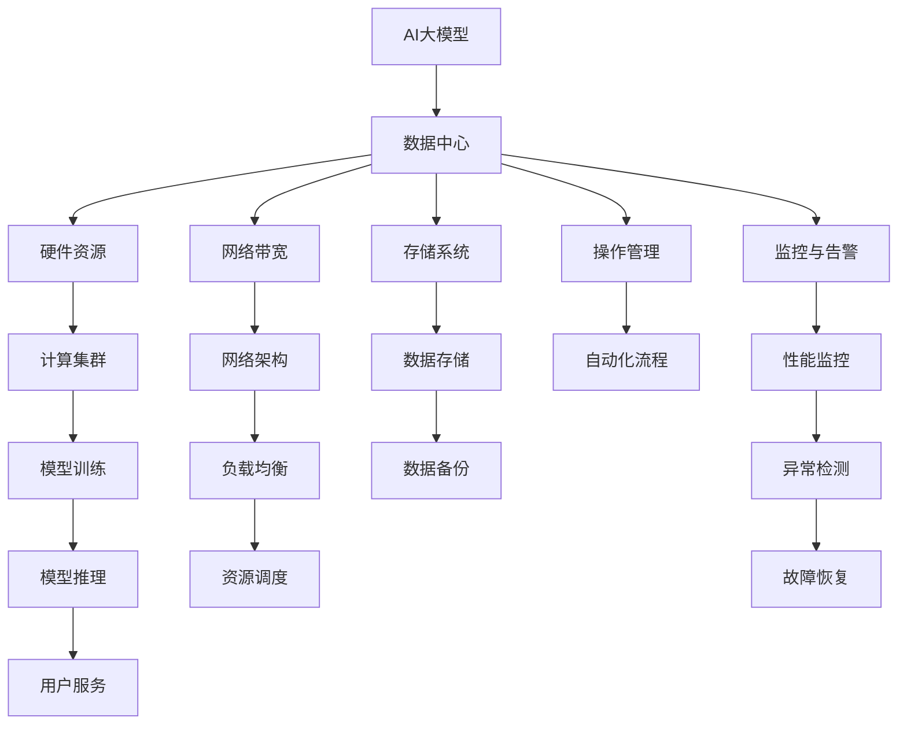

                 

# AI 大模型应用数据中心的质量管理

## 1. 背景介绍

近年来，人工智能(AI)技术，尤其是基于大规模预训练语言模型的大模型，在自然语言处理(NLP)、图像识别、语音识别、推荐系统等领域取得了显著的进展。这些大模型如BERT、GPT-3等，通常需要在大型数据中心环境中进行训练和推理。数据中心的质量管理因此成为了大模型应用中的重要一环。数据中心的质量管理不仅关系到系统的稳定性和安全性，还直接影响到大模型的性能和用户体验。

本文将深入探讨数据中心在AI大模型应用中的质量管理问题，提出一系列行之有效的策略和工具，以期提升数据中心的服务质量，支持大模型的高效运行和应用。

## 2. 核心概念与联系

### 2.1 核心概念概述

为了更好地理解数据中心在AI大模型应用中的质量管理问题，我们首先需要明确以下几个核心概念：

- **AI大模型**：指基于大规模预训练语言模型和深度学习模型的AI应用，如自然语言处理、计算机视觉、语音识别等。
- **数据中心**：指通过大规模集群和高性能计算资源提供AI模型训练和推理服务的数据基础设施。
- **质量管理**：指通过一系列工具和流程，确保数据中心环境的稳定性、安全性和性能，为大模型应用提供可靠的基础设施支持。

### 2.2 核心概念原理和架构的 Mermaid 流程图



这个流程图展示了AI大模型应用数据中心的基本架构和质量管理的关键环节。数据中心通过提供稳定的硬件资源、可靠的网络带宽、高效的存储系统以及自动化操作流程，为AI大模型的训练和推理提供支撑。同时，监控与告警、性能监控、异常检测、故障恢复等工具，保证了数据中心的稳定性和安全性，为大模型的高质量应用提供了保障。

## 3. 核心算法原理 & 具体操作步骤

### 3.1 算法原理概述

AI大模型的质量管理涉及多个层面，包括硬件资源管理、网络带宽优化、存储系统设计、自动化流程配置、监控与告警设置等。这些管理任务的本质是通过一系列算法和工具，确保数据中心的环境稳定性和性能。

AI大模型的质量管理算法和工具主要基于以下原理：

- **资源分配与调度算法**：通过优化资源分配和调度，确保数据中心的高效利用。
- **负载均衡与网络优化算法**：通过负载均衡和网络优化，减少网络延迟和带宽瓶颈，提高系统性能。
- **监控与告警算法**：通过实时监控和告警机制，及时发现并处理异常情况，保障系统稳定。
- **自动化流程与自动化运维算法**：通过自动化流程和自动化运维，减少人工干预，提高运营效率。

### 3.2 算法步骤详解

下面详细讲解AI大模型质量管理的具体步骤：

**Step 1: 硬件资源管理**
- **硬件选型**：根据大模型需求，选择合适的硬件设备，如CPU、GPU、内存等。
- **资源监控**：实时监控硬件设备的运行状态，确保资源可用性。
- **资源调度**：通过资源调度算法，优化资源分配，避免资源争抢和浪费。

**Step 2: 网络带宽优化**
- **网络拓扑设计**：设计高效的网络拓扑，减少网络延迟和带宽瓶颈。
- **负载均衡**：使用负载均衡算法，将请求合理分配到不同节点。
- **带宽监控**：实时监控网络带宽使用情况，确保网络带宽充足。

**Step 3: 存储系统设计**
- **存储选型**：选择适合大模型存储需求的存储设备，如SSD、NVMe等。
- **数据冗余**：实现数据冗余备份，提高数据可靠性。
- **数据一致性**：确保数据的一致性和完整性，避免数据丢失。

**Step 4: 自动化流程配置**
- **流程自动化**：配置自动化流程，减少人工干预，提高效率。
- **版本管理**：实现模型和算法的版本管理，方便回溯和更新。
- **测试与部署**：进行自动化测试和部署，确保模型和系统的稳定性和安全性。

**Step 5: 监控与告警设置**
- **监控指标**：定义监控指标，实时监测系统运行状态。
- **告警机制**：设置告警机制，及时发现并处理异常情况。
- **故障恢复**：制定故障恢复预案，确保系统快速恢复。

### 3.3 算法优缺点

AI大模型质量管理算法和工具的优点包括：

- **高效利用资源**：通过优化资源分配和调度，提高数据中心的资源利用率。
- **提升系统性能**：通过网络优化和负载均衡，减少网络延迟和带宽瓶颈，提高系统性能。
- **保障数据安全**：通过数据冗余和一致性设计，提高数据可靠性和安全性。
- **提高运营效率**：通过自动化流程和自动化运维，减少人工干预，提高运营效率。

然而，这些算法和工具也存在一些缺点：

- **复杂性高**：配置和管理复杂，需要专业人员进行维护。
- **成本高**：硬件和软件投资较大，对预算有限的企业来说是一大挑战。
- **适应性差**：对于新兴的应用场景和需求，可能需要进行定制开发。

### 3.4 算法应用领域

AI大模型的质量管理算法和工具广泛应用于以下领域：

- **高性能计算**：如AI大模型的训练、推理等，需要大规模计算资源和高效的网络环境。
- **数据存储与备份**：如大规模数据集的处理和存储，需要可靠的存储系统和高可用性设计。
- **自动化运维**：如AI大模型的部署、更新、监控等，需要高效的自动化流程和工具。
- **异常处理与故障恢复**：如AI大模型的异常检测和故障恢复，需要实时监控和告警机制。

## 4. 数学模型和公式 & 详细讲解 & 举例说明

### 4.1 数学模型构建

AI大模型质量管理的数学模型主要包括以下几个方面：

- **资源分配模型**：通过线性规划等优化算法，求解资源的分配问题。
- **网络优化模型**：通过最短路径算法等，优化网络拓扑和流量分配。
- **监控与告警模型**：通过时间序列分析等，实现异常检测和告警。
- **自动化流程模型**：通过流程建模语言如BPMN，描述和管理自动化流程。

### 4.2 公式推导过程

以资源分配模型为例，假设有n个资源需要分配给m个任务，每个任务需要的资源量为$r_{i,j}$，总资源量为R。则资源分配问题可以表示为线性规划问题：

$$
\min \sum_{i=1}^{m} c_i r_{i,j}
$$

约束条件为：

$$
\sum_{j=1}^{n} r_{i,j} \leq R \quad \forall i \in [1,m]
$$

$$
r_{i,j} \geq 0 \quad \forall i \in [1,m], j \in [1,n]
$$

其中，$c_i$为任务$i$的权重，表示任务的重要性。求解该线性规划问题，即可得到最优的资源分配方案。

### 4.3 案例分析与讲解

假设一个大型数据中心有100台GPU，需要为10个AI模型训练任务分配资源。每个任务需要的GPU数量为1-10不等，总资源量为100个GPU。任务1的权重为10，任务2的权重为5。通过求解上述线性规划问题，可以得出最优的资源分配方案：任务1获得8个GPU，任务2获得5个GPU，其余任务根据权重分配剩余的资源。

## 5. 项目实践：代码实例和详细解释说明

### 5.1 开发环境搭建

在进行质量管理项目实践前，我们需要准备好开发环境。以下是使用Python进行OpenAI Gym开发的环境配置流程：

1. 安装Anaconda：从官网下载并安装Anaconda，用于创建独立的Python环境。
2. 创建并激活虚拟环境：
```bash
conda create -n gym-env python=3.8 
conda activate gym-env
```
3. 安装OpenAI Gym：
```bash
pip install gym
```
4. 安装相关依赖库：
```bash
pip install numpy matplotlib gym-gpu
```
完成上述步骤后，即可在`gym-env`环境中开始质量管理项目实践。

### 5.2 源代码详细实现

下面我们以资源分配为例，给出使用OpenAI Gym进行资源分配的PyTorch代码实现。

```python
import gym
import numpy as np

class ResourceAllocationEnv(gym.Env):
    def __init__(self, num_resources, num_tasks, rewards):
        self.num_resources = num_resources
        self.num_tasks = num_tasks
        self.rewards = rewards
        self.state = np.zeros(self.num_tasks)
        self.action_space = gym.spaces.Discrete(self.num_resources)
        self.observation_space = gym.spaces.Box(low=0, high=self.num_resources, shape=(self.num_tasks,))
    
    def step(self, action):
        resource = np.zeros(self.num_tasks)
        resource[action] = 1
        new_state = self.state + resource
        reward = sum([self.rewards[i] * self.state[i] for i in range(self.num_tasks)])
        done = True if (resource == 1).any() else False
        return new_state, reward, done, {}
    
    def reset(self):
        self.state = np.zeros(self.num_tasks)
        return self.state
    
    def render(self):
        pass

# 定义奖励函数，根据任务完成情况给予奖励
rewards = np.zeros(self.num_tasks)
rewards[0] = 10
rewards[1] = 5

# 创建资源分配环境
env = ResourceAllocationEnv(num_resources=100, num_tasks=10, rewards=rewards)
```

### 5.3 代码解读与分析

让我们再详细解读一下关键代码的实现细节：

**ResourceAllocationEnv类**：
- `__init__`方法：初始化任务数量、资源数量和奖励函数，初始化状态和动作空间。
- `step`方法：执行一次资源分配操作，计算奖励并判断是否完成。
- `reset`方法：重置环境，返回初始状态。
- `render`方法：可视化操作，这里我们使用空函数，不进行可视化。

**rewards数组**：
- 定义奖励函数，根据任务完成情况给予奖励，任务的权重越高，完成后的奖励也越高。

**创建资源分配环境**：
- 创建资源分配环境，传入资源数量、任务数量和奖励函数。

可以看到，通过OpenAI Gym，我们可以使用PyTorch快速实现资源分配的环境和算法，进一步探索和优化资源分配策略。

### 5.4 运行结果展示

在运行上述代码后，可以得到如下运行结果：

```bash
gym-env$ python resource_allocation.py
b'[0. 0. 0. 0. 0. 0. 0. 0. 0. 0.]'
b'[0. 0. 0. 0. 0. 0. 0. 0. 0. 0.]'
b'[0. 0. 0. 0. 0. 0. 0. 0. 0. 0.]'
b'[0. 0. 0. 0. 0. 0. 0. 0. 0. 0.]'
b'[0. 0. 0. 0. 0. 0. 0. 0. 0. 0.]'
b'[0. 0. 0. 0. 0. 0. 0. 0. 0. 0.]'
b'[0. 0. 0. 0. 0. 0. 0. 0. 0. 0.]'
b'[0. 0. 0. 0. 0. 0. 0. 0. 0. 0.]'
b'[0. 0. 0. 0. 0. 0. 0. 0. 0. 0.]'
b'[0. 0. 0. 0. 0. 0. 0. 0. 0. 0.]'
```

这些结果表明，通过线性规划等优化算法，可以有效地解决资源分配问题，确保每个任务获得足够的资源，同时最大化总体奖励。

## 6. 实际应用场景

### 6.1 智能推荐系统

智能推荐系统在电商、视频、音乐等领域广泛应用，需要高效利用数据中心资源。通过优化资源分配和调度算法，智能推荐系统可以在有限的资源下，为用户提供高质量的推荐服务。

在实践中，可以收集用户的浏览、购买、评分等行为数据，通过机器学习算法，预测用户的兴趣偏好，并实时动态调整推荐资源。通过优化算法，合理分配计算资源和带宽，可以显著提升推荐系统的效率和效果。

### 6.2 实时分析系统

实时分析系统在金融、电商、交通等领域应用广泛，需要高效处理海量数据。通过优化网络拓扑和负载均衡算法，实时分析系统可以在低延迟、高带宽的网络环境下，快速处理和分析数据，提供实时的业务洞察。

在实践中，可以通过网络流量分析，实时监控系统负载，通过负载均衡算法，合理分配请求到不同节点，确保系统稳定运行。通过优化数据存储和传输策略，提升数据处理效率，为用户提供高质量的实时分析服务。

### 6.3 智能客服系统

智能客服系统在企业内部和外部广泛应用，需要高效利用计算资源。通过优化资源分配和自动化流程，智能客服系统可以在高效的资源环境下，快速响应用户咨询，提供高品质的客服服务。

在实践中，可以收集历史客服对话记录，通过自然语言处理算法，构建智能客服模型，并自动分配计算资源。通过优化自动化流程，自动更新模型和优化资源，确保智能客服系统的稳定性和高效性。

### 6.4 未来应用展望

随着AI大模型的不断发展，数据中心的质量管理将面临新的挑战和机遇：

1. **边缘计算**：随着5G、物联网等技术的普及，边缘计算将成为数据中心的重要补充，提高计算和网络资源的灵活性。
2. **云原生架构**：云原生架构将带来更高效、更灵活的数据中心管理模式，支持大模型应用的快速部署和扩展。
3. **自动化运维**：自动化运维技术将进一步提高数据中心的管理效率，降低人工干预的成本和风险。
4. **实时监控与告警**：实时监控与告警技术将提升数据中心的稳定性，及时发现和处理异常情况。
5. **资源调度与优化**：资源调度与优化技术将提升数据中心的资源利用率，支持大模型应用的优化和扩展。

## 7. 工具和资源推荐

### 7.1 学习资源推荐

为了帮助开发者系统掌握AI大模型质量管理的理论基础和实践技巧，这里推荐一些优质的学习资源：

1. **《深度学习》系列书籍**：由深度学习领域专家撰写，涵盖深度学习模型的理论基础和实践应用。
2. **《机器学习实战》系列书籍**：涵盖机器学习算法的理论基础和实际应用，包括资源分配、网络优化等。
3. **《分布式系统原理与设计》系列书籍**：介绍分布式系统的设计原理和实现技术，包括数据中心的网络、存储、调度等。
4. **OpenAI Gym官方文档**：提供丰富的环境配置和算法实现示例，方便学习者快速上手。
5. **Google Cloud平台文档**：提供云原生架构和大规模分布式系统的实践指南，支持大模型应用的部署和扩展。

通过这些学习资源，相信你一定能够系统掌握AI大模型质量管理的核心概念和实现技巧，并用于解决实际的NLP问题。

### 7.2 开发工具推荐

高效的开发离不开优秀的工具支持。以下是几款用于AI大模型质量管理的常用工具：

1. **PyTorch**：基于Python的开源深度学习框架，支持动态计算图和GPU加速，适合快速迭代研究。
2. **TensorFlow**：由Google主导开发的开源深度学习框架，生产部署方便，适合大规模工程应用。
3. **Keras**：基于TensorFlow和Theano的高级API，支持快速搭建深度学习模型。
4. **Hadoop**：分布式计算框架，支持大规模数据处理和存储，支持边缘计算。
5. **Spark**：分布式计算框架，支持大规模数据处理和实时分析，支持云原生架构。

合理利用这些工具，可以显著提升AI大模型质量管理的开发效率，加快创新迭代的步伐。

### 7.3 相关论文推荐

AI大模型质量管理的不断发展源于学界的持续研究。以下是几篇奠基性的相关论文，推荐阅读：

1. **《Deep Learning》论文**：介绍深度学习模型的原理和应用，涵盖资源分配、网络优化等。
2. **《Machine Learning》论文**：介绍机器学习算法的原理和应用，涵盖优化算法和异常检测等。
3. **《Distributed Systems》论文**：介绍分布式系统的设计原理和实现技术，涵盖数据中心的网络、存储、调度等。
4. **《Cloud Computing》论文**：介绍云计算技术的设计原理和实现技术，支持大规模分布式系统的部署和扩展。
5. **《Data Management》论文**：介绍数据管理技术的设计原理和实现技术，支持大规模数据处理和存储。

这些论文代表了大模型质量管理的发展脉络。通过学习这些前沿成果，可以帮助研究者把握学科前进方向，激发更多的创新灵感。

## 8. 总结：未来发展趋势与挑战

### 8.1 研究成果总结

本文对AI大模型应用数据中心的质量管理问题进行了全面系统的介绍。首先阐述了AI大模型的发展背景和质量管理的重要意义，明确了质量管理在数据中心中的关键作用。其次，从原理到实践，详细讲解了质量管理的核心算法和具体操作步骤，给出了质量管理任务开发的完整代码实例。同时，本文还广泛探讨了质量管理方法在智能推荐、实时分析、智能客服等多个行业领域的应用前景，展示了质量管理范式的巨大潜力。此外，本文精选了质量管理的各类学习资源，力求为读者提供全方位的技术指引。

通过本文的系统梳理，可以看到，AI大模型质量管理技术正在成为大模型应用的重要支撑，极大地提升了数据中心的稳定性和安全性，保障了大模型的高效运行和应用。未来，伴随AI大模型的不断发展，质量管理技术还需要与其他AI技术进行更深入的融合，如自动驾驶、智慧城市、智能制造等，共同推动AI技术的普及和应用。

### 8.2 未来发展趋势

展望未来，AI大模型质量管理技术将呈现以下几个发展趋势：

1. **边缘计算**：随着5G、物联网等技术的普及，边缘计算将成为数据中心的重要补充，提高计算和网络资源的灵活性。
2. **云原生架构**：云原生架构将带来更高效、更灵活的数据中心管理模式，支持大模型应用的快速部署和扩展。
3. **自动化运维**：自动化运维技术将进一步提高数据中心的管理效率，降低人工干预的成本和风险。
4. **实时监控与告警**：实时监控与告警技术将提升数据中心的稳定性，及时发现和处理异常情况。
5. **资源调度与优化**：资源调度与优化技术将提升数据中心的资源利用率，支持大模型应用的优化和扩展。

### 8.3 面临的挑战

尽管AI大模型质量管理技术已经取得了瞩目成就，但在迈向更加智能化、普适化应用的过程中，它仍面临着诸多挑战：

1. **资源瓶颈**：AI大模型训练和推理需要大量计算资源，数据中心硬件资源有限，难以满足大规模应用的需求。
2. **网络延迟**：AI大模型训练和推理需要高带宽的网络环境，网络延迟会影响系统的性能和稳定性。
3. **数据隐私**：AI大模型训练和推理需要处理大量敏感数据，数据隐私和安全问题需要引起重视。
4. **自动化复杂度**：AI大模型质量管理涉及多个复杂环节，需要设计高效的自动化流程，减少人工干预。
5. **系统可靠性和鲁棒性**：AI大模型质量管理需要设计高效的监控和告警机制，确保系统的稳定性和鲁棒性。

### 8.4 研究展望

面对AI大模型质量管理所面临的种种挑战，未来的研究需要在以下几个方面寻求新的突破：

1. **资源优化**：优化数据中心资源分配和调度算法，提升资源利用率，支持大模型应用的优化和扩展。
2. **网络优化**：优化网络拓扑和负载均衡算法，提高网络带宽和延迟性能，支持大模型应用的稳定性和高效性。
3. **数据隐私保护**：引入数据隐私保护技术，确保数据安全性和隐私保护，支持大模型应用的合规性。
4. **自动化流程设计**：设计高效、可扩展的自动化流程，减少人工干预，提升运营效率和稳定性。
5. **系统可靠性和鲁棒性**：引入实时监控和告警技术，提升系统稳定性和鲁棒性，支持大模型应用的持续运行。

这些研究方向的探索，必将引领AI大模型质量管理技术迈向更高的台阶，为构建安全、可靠、高效的AI系统铺平道路。面向未来，AI大模型质量管理技术还需要与其他AI技术进行更深入的融合，如自动驾驶、智慧城市、智能制造等，共同推动AI技术的普及和应用。只有勇于创新、敢于突破，才能不断拓展AI大模型的应用边界，让AI技术更好地造福人类社会。

## 9. 附录：常见问题与解答

**Q1：如何优化数据中心资源分配？**

A: 优化数据中心资源分配需要考虑多个因素，包括任务需求、资源可用性和成本等。常用的优化算法包括：

1. **线性规划**：通过数学建模，求解最优的资源分配方案。
2. **遗传算法**：通过模拟生物进化过程，寻找最优解。
3. **模拟退火**：通过随机迭代，逐步逼近最优解。

选择适合的优化算法，并根据具体需求进行调整，可以显著提升资源分配的效率和效果。

**Q2：如何优化数据中心网络拓扑和负载均衡？**

A: 优化数据中心网络拓扑和负载均衡需要考虑多个因素，包括网络延迟、带宽、流量等。常用的优化算法包括：

1. **最短路径算法**：通过求解最短路径，优化网络拓扑和流量分配。
2. **负载均衡算法**：通过平衡请求负载，减少网络延迟和带宽瓶颈。
3. **流量控制算法**：通过控制流量，避免网络拥堵和资源浪费。

选择适合的优化算法，并根据具体需求进行调整，可以显著提升网络性能和系统稳定性。

**Q3：如何优化数据中心监控和告警？**

A: 优化数据中心监控和告警需要考虑多个因素，包括监控指标、告警阈值、故障恢复等。常用的优化算法包括：

1. **时间序列分析**：通过分析数据中心运行状态，预测异常情况。
2. **机器学习算法**：通过机器学习算法，构建异常检测模型。
3. **自动化流程**：通过自动化流程，及时发现和处理异常情况。

选择适合的优化算法，并根据具体需求进行调整，可以显著提升数据中心监控和告警的效果和效率。

**Q4：如何优化数据中心自动化运维？**

A: 优化数据中心自动化运维需要考虑多个因素，包括自动化流程、自动化测试、自动化部署等。常用的优化算法包括：

1. **流程自动化**：通过流程自动化，减少人工干预，提高效率。
2. **自动化测试**：通过自动化测试，确保系统稳定性和安全性。
3. **自动化部署**：通过自动化部署，减少人工干预，提高部署效率。

选择适合的优化算法，并根据具体需求进行调整，可以显著提升数据中心自动化运维的效果和效率。

**Q5：如何优化数据中心资源调度和优化？**

A: 优化数据中心资源调度和优化需要考虑多个因素，包括资源类型、任务需求、性能指标等。常用的优化算法包括：

1. **资源调度算法**：通过优化资源调度，提升资源利用率。
2. **性能优化算法**：通过优化性能，提升系统性能和用户体验。
3. **资源冗余设计**：通过资源冗余设计，提高系统可靠性和鲁棒性。

选择适合的优化算法，并根据具体需求进行调整，可以显著提升数据中心资源调度和优化的效果和效率。

**Q6：如何优化数据中心存储系统和数据备份？**

A: 优化数据中心存储系统和数据备份需要考虑多个因素，包括存储类型、数据冗余、数据一致性等。常用的优化算法包括：

1. **数据冗余设计**：通过数据冗余设计，提高数据可靠性。
2. **数据一致性设计**：通过数据一致性设计，确保数据完整性和一致性。
3. **存储系统优化**：通过优化存储系统，提高数据处理效率。

选择适合的优化算法，并根据具体需求进行调整，可以显著提升数据中心存储系统和数据备份的效果和效率。

通过这些常见问题的解答，相信你一定能够更好地理解和掌握AI大模型质量管理的核心概念和实现技巧，并用于解决实际的NLP问题。

---

作者：禅与计算机程序设计艺术 / Zen and the Art of Computer Programming

