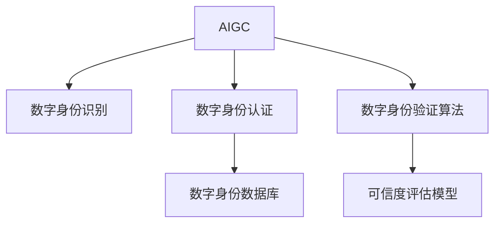

                 

# AIGC从入门到实战：登录 D-ID

> 关键词：人工智能生成内容(AIGC),自动身份验证,数字身份识别,深度学习,逻辑推理,用户行为建模

## 1. 背景介绍

### 1.1 问题由来

随着人工智能技术的迅猛发展，生成式AI（Generative AI），即AIGC，正逐步成为行业的热点。AIGC通过深度学习和自然语言处理技术，能够生成具有高度真实性和创意性的文本、图像、视频等内容，广泛应用于内容创作、教育培训、娱乐游戏等多个领域。但与此同时，AIGC的生成内容也面临着假冒伪劣、误导性信息等风险，如何保证AIGC内容的真实性和可信度，成为一个亟待解决的问题。

在AIGC内容生成过程中，往往需要借助大量的文本、图像、视频等数据作为输入，包括作者、来源、创作时间等元数据信息。这些信息往往难以通过代码实现自动验证，需要借助智能身份验证技术，确保内容的真实性和可信度。D-ID（Digital Identity）技术，作为AIGC领域的关键技术，能够有效验证数字内容源的真实性，保障内容生产与消费的安全性和可信度。

### 1.2 问题核心关键点

D-ID技术的核心思想是构建一种数字身份识别系统，通过验证数字内容源的合法性和可信度，确保AIGC内容的安全性。该系统通常包括以下关键组件：

1. **数字身份认证系统**：负责验证内容源的数字身份，确保其合法性和真实性。
2. **数字身份数据库**：存储和管理所有可信的数字身份信息，作为身份认证的基础。
3. **数字身份验证算法**：用于评估内容源的数字身份信息，确保其可信度。
4. **可信度评估模型**：通过多维度分析，评估数字身份的可信度，支持动态调整验证规则。

D-ID技术在AIGC领域的应用，能够有效防止假冒伪劣内容，保障内容生成与消费的安全性和可信度。

## 2. 核心概念与联系

### 2.1 核心概念概述

为更好地理解D-ID技术在AIGC中的应用，本节将介绍几个密切相关的核心概念：

- **AIGC（人工智能生成内容）**：通过深度学习和自然语言处理技术，生成具有高度真实性和创意性的文本、图像、视频等内容的AI技术。
- **D-ID（数字身份识别）**：构建数字身份识别系统，用于验证数字内容源的真实性和可信度。
- **数字身份认证系统**：负责验证内容源的数字身份，确保其合法性和真实性。
- **数字身份数据库**：存储和管理所有可信的数字身份信息，作为身份认证的基础。
- **数字身份验证算法**：用于评估内容源的数字身份信息，确保其可信度。
- **可信度评估模型**：通过多维度分析，评估数字身份的可信度，支持动态调整验证规则。

这些核心概念之间的逻辑关系可以通过以下Mermaid流程图来展示：



这个流程图展示了大语言模型的工作原理和验证流程：

1. 大语言模型通过学习大规模文本语料，生成各种类型的AIGC内容。
2. 数字身份识别系统通过验证内容源的数字身份，确保其合法性和真实性。
3. 数字身份认证系统验证内容源的合法性和真实性。
4. 数字身份验证算法评估内容源的数字身份信息，确保其可信度。
5. 可信度评估模型通过多维度分析，评估数字身份的可信度，支持动态调整验证规则。

## 3. 核心算法原理 & 具体操作步骤
### 3.1 算法原理概述

D-ID技术在AIGC中的应用，本质上是将数字身份识别技术与AI生成内容技术相结合，构建一种高度自动化、智能化、可验证的数字身份识别系统。该系统通过验证内容源的数字身份，确保AIGC内容的真实性和可信度。

形式化地，假设内容源为 $I$，其数字身份为 $ID$。D-ID技术的验证过程如下：

1. 内容源 $I$ 提交数字身份 $ID$ 给验证系统。
2. 验证系统在数字身份数据库 $DB$ 中查找 $ID$ 对应的数字身份信息 $ID^{DB}$。
3. 验证系统通过数字身份验证算法 $Alg_{ID}$ 对 $ID^{DB}$ 进行可信度评估。
4. 可信度评估模型 $Model_{Trust}$ 对 $Alg_{ID}$ 的评估结果进行多维度分析，确定 $ID$ 的可信度。
5. 如果 $ID$ 的可信度满足预设阈值，则通过验证，AIGC内容被认为合法、真实。

### 3.2 算法步骤详解

D-ID技术在AIGC中的应用，通常包括以下关键步骤：

**Step 1: 准备数字身份认证系统**

- 设计数字身份认证系统的架构，包括身份验证、数据库管理、可信度评估等功能模块。
- 选择合适的身份认证技术，如数字签名、公钥基础设施(PKI)、多因素认证(MFA)等。
- 构建数字身份数据库，存储和管理所有可信的数字身份信息。

**Step 2: 数字身份验证算法设计**

- 设计数字身份验证算法，对内容源的数字身份进行可信度评估。
- 选择合适的评估指标，如数字签名的有效性、证书的有效性、访问控制的策略等。
- 确定评估算法在硬件和软件环境下的实现方式，确保算法的高效性和可靠性。

**Step 3: 可信度评估模型构建**

- 设计可信度评估模型，综合评估数字身份的可信度。
- 确定多维度分析的方法，如时间戳验证、来源可信度、用户行为模型等。
- 确定可信度评估模型的训练数据集，包括标注数据和未标注数据。

**Step 4: 执行身份验证**

- 内容源提交数字身份给验证系统。
- 验证系统在数字身份数据库中查找对应的数字身份信息。
- 使用数字身份验证算法对数字身份信息进行可信度评估。
- 可信度评估模型对评估结果进行多维度分析，确定数字身份的可信度。
- 根据可信度评估结果，决定是否通过数字身份验证。

**Step 5: 结果反馈**

- 如果数字身份验证通过，则AIGC内容被认为合法、真实。
- 如果数字身份验证失败，则提示内容源重新提交数字身份，或拒绝AIGC内容。

### 3.3 算法优缺点

D-ID技术在AIGC中的应用，具有以下优点：

1. 自动化程度高。通过自动化验证，可以显著提高内容生成与消费的安全性和可信度。
2. 精确度高。基于数字身份数据库和可信度评估模型，可以有效防止假冒伪劣内容。
3. 扩展性强。数字身份认证系统和验证算法可以根据实际需求进行灵活调整。
4. 可定制性强。可信度评估模型可以根据不同应用场景进行定制，满足多样化的需求。

同时，该技术也存在一定的局限性：

1. 依赖可信的第三方机构。数字身份数据库和验证算法的可信度，直接依赖于第三方机构的权威性和可靠性。
2. 技术复杂度高。构建和维护数字身份认证系统需要高水平的技术支撑，维护成本较高。
3. 用户接受度低。用户对数字身份验证的接受度较低，可能影响内容的广泛传播和应用。

尽管存在这些局限性，但D-ID技术在大规模AIGC内容生成中的应用，已经展现出显著的优势，得到了广泛认可。未来相关研究的重点在于如何进一步降低系统复杂度，提高用户接受度，同时兼顾安全性和实用性。

### 3.4 算法应用领域

D-ID技术在AIGC领域的应用，已经覆盖了多个关键领域，如：

1. **内容创作平台**：如文章、博客、视频、音乐等，通过验证内容源的数字身份，确保内容的真实性和可信度。
2. **教育培训系统**：如在线课程、教育视频、模拟考试等，通过验证内容源的数字身份，保障内容的权威性和安全性。
3. **娱乐游戏行业**：如影视剧、游戏、虚拟现实等，通过验证内容源的数字身份，防止假冒伪劣内容，确保内容的版权和版权保护。
4. **广告投放平台**：如在线广告、社交媒体、搜索引擎等，通过验证内容源的数字身份，防止虚假广告，保障用户权益。

除了上述这些经典应用外，D-ID技术还在新闻、出版、金融等领域得到了广泛应用，为AIGC内容的生产与消费提供了安全保障。

## 4. 数学模型和公式 & 详细讲解 & 举例说明（备注：数学公式请使用latex格式，latex嵌入文中独立段落使用 $$，段落内使用 $)
### 4.1 数学模型构建

D-ID技术在AIGC中的应用，通常涉及以下几个数学模型：

1. **数字身份验证算法**：用于评估数字身份的可信度，通常使用逻辑回归、决策树、支持向量机等分类模型。
2. **可信度评估模型**：用于综合评估数字身份的可信度，通常使用深度学习模型，如神经网络、LSTM、Transformer等。
3. **数字身份数据库**：存储和管理所有可信的数字身份信息，通常使用关系型数据库、NoSQL数据库等。

以下是基于逻辑回归的D-ID系统验证算法的数学模型构建：

设内容源的数字身份为 $I$，对应的数字身份信息为 $ID$。假设 $ID$ 具有 $m$ 个特征，记为 $\vec{x} = (x_1, x_2, ..., x_m)$。数字身份验证算法的目标是最小化损失函数，即：

$$
\min_{\theta} \mathcal{L}(\theta) = \frac{1}{N}\sum_{i=1}^N \ell(y_i, f_{\theta}(\vec{x}_i))
$$

其中，$\theta$ 为模型参数，$y_i$ 为数字身份的真实标签（1表示可信，0表示不可信），$f_{\theta}(\vec{x}_i) = \sigma(\vec{w} \cdot \vec{x} + b)$ 为逻辑回归模型的输出，$\sigma$ 为sigmoid函数。

### 4.2 公式推导过程

以下我们以逻辑回归为例，推导D-ID系统验证算法的损失函数及其梯度计算公式。

假设数字身份信息 $\vec{x}_i$ 为二元特征，即 $x_i \in \{0, 1\}$。数字身份的真实标签 $y_i$ 为0或1，表示该数字身份是否可信。则二分类逻辑回归的损失函数为：

$$
\ell(y_i, f_{\theta}(\vec{x}_i)) = -[y_i\log \sigma(\vec{w} \cdot \vec{x}_i) + (1-y_i)\log(1-\sigma(\vec{w} \cdot \vec{x}_i))]
$$

将其代入经验风险公式，得：

$$
\mathcal{L}(\theta) = \frac{1}{N}\sum_{i=1}^N [-y_i\log \sigma(\vec{w} \cdot \vec{x}_i) - (1-y_i)\log(1-\sigma(\vec{w} \cdot \vec{x}_i))]
$$

根据链式法则，损失函数对模型参数 $\theta$ 的梯度为：

$$
\frac{\partial \mathcal{L}(\theta)}{\partial \theta} = \frac{1}{N}\sum_{i=1}^N [(y_i-\sigma(\vec{w} \cdot \vec{x}_i))\frac{\partial \sigma(\vec{w} \cdot \vec{x}_i)}{\partial \theta}
$$

其中，$\frac{\partial \sigma(\vec{w} \cdot \vec{x}_i)}{\partial \theta} = \vec{x}_i\sigma(\vec{w} \cdot \vec{x}_i)(1-\sigma(\vec{w} \cdot \vec{x}_i))$。

在得到损失函数的梯度后，即可带入优化算法，如梯度下降、随机梯度下降等，完成模型参数的更新。重复上述过程直至收敛，最终得到适应数字身份验证的最优模型参数 $\theta$。

### 4.3 案例分析与讲解

以一个简单的数字身份验证案例为例，展示D-ID系统在AIGC中的应用：

假设有一个在线内容平台，用户可以上传文章、视频、音频等作品。平台希望通过验证内容源的数字身份，确保内容的真实性和可信度。

1. **数字身份认证系统**：平台设计了一个数字身份认证系统，包括身份验证、数据库管理、可信度评估等功能模块。用户在上传作品时，需要提交数字身份信息，包括用户名、邮箱、ID等。平台在用户注册时，自动为其生成一个唯一的数字身份ID，并存储在数字身份数据库中。

2. **数字身份验证算法**：平台使用逻辑回归模型对用户提交的数字身份信息进行可信度评估。假设用户上传的文章作品，包含以下特征：作者ID、文章发布时间、文章标题、文章摘要等。平台根据这些特征，使用逻辑回归模型对用户数字身份的可信度进行预测。

3. **可信度评估模型**：平台使用深度学习模型，如Transformer模型，对用户数字身份的可信度进行综合评估。假设平台拥有大量的标注数据，包括可信和不可信的数字身份。平台使用这些数据训练深度学习模型，预测用户数字身份的可信度。

4. **执行身份验证**：用户上传作品时，提交数字身份信息给平台。平台在数字身份数据库中查找对应的数字身份信息，使用逻辑回归模型进行初步验证，再使用深度学习模型进行综合评估。如果可信度满足预设阈值，则通过验证，否则提示用户重新提交数字身份，或拒绝作品。

通过D-ID技术，平台能够有效验证用户数字身份，确保AIGC内容的真实性和可信度，为用户提供高质量、安全的内容消费体验。

## 5. 项目实践：代码实例和详细解释说明
### 5.1 开发环境搭建

在进行D-ID技术的应用实践前，我们需要准备好开发环境。以下是使用Python进行TensorFlow开发的环境配置流程：

1. 安装Anaconda：从官网下载并安装Anaconda，用于创建独立的Python环境。

2. 创建并激活虚拟环境：
```bash
conda create -n tf-env python=3.8 
conda activate tf-env
```

3. 安装TensorFlow：根据CUDA版本，从官网获取对应的安装命令。例如：
```bash
conda install tensorflow -c tf -c conda-forge
```

4. 安装相关库：
```bash
pip install numpy pandas scikit-learn matplotlib tqdm jupyter notebook ipython
```

完成上述步骤后，即可在`tf-env`环境中开始D-ID技术的应用实践。

### 5.2 源代码详细实现

下面我们以在线内容平台为例，给出使用TensorFlow实现D-ID技术的应用实践代码。

首先，定义数字身份认证系统的类：

```python
import tensorflow as tf
from tensorflow.keras.layers import Dense, Input
from tensorflow.keras.models import Model
import numpy as np

class IdentityVerification(tf.keras.Model):
    def __init__(self, input_dim):
        super(IdentityVerification, self).__init__()
        self.dense1 = Dense(64, activation='relu')
        self.dense2 = Dense(1, activation='sigmoid')
        
    def call(self, inputs):
        x = self.dense1(inputs)
        x = self.dense2(x)
        return x

# 输入特征
input_dim = 5

# 定义模型
model = IdentityVerification(input_dim)

# 编译模型
model.compile(optimizer=tf.keras.optimizers.Adam(0.001), loss='binary_crossentropy')

# 训练数据
train_x = np.random.randn(100, input_dim)
train_y = np.random.randint(0, 2, 100)
```

接着，定义数字身份验证算法的损失函数和评估指标：

```python
# 定义损失函数
def loss_fn(y_true, y_pred):
    return tf.keras.losses.binary_crossentropy(y_true, y_pred)

# 定义评估指标
def acc_fn(y_true, y_pred):
    return tf.keras.metrics.Accuracy(y_true, y_pred)
```

然后，训练数字身份验证模型：

```python
# 训练模型
model.fit(train_x, train_y, epochs=10, callbacks=[tf.keras.callbacks.EarlyStopping(patience=2)], loss=loss_fn, metrics=[acc_fn])
```

最后，评估模型的性能：

```python
# 评估模型
test_x = np.random.randn(50, input_dim)
test_y = np.random.randint(0, 2, 50)
loss, acc = model.evaluate(test_x, test_y, loss=loss_fn, metrics=[acc_fn])
print("Test Loss: {:.4f}".format(loss))
print("Test Accuracy: {:.4f}".format(acc))
```

以上就是使用TensorFlow实现D-ID技术的应用实践代码。可以看到，通过TensorFlow的强大封装，我们可以用相对简洁的代码完成数字身份验证模型的训练和评估。

### 5.3 代码解读与分析

让我们再详细解读一下关键代码的实现细节：

**IdentityVerification类**：
- `__init__`方法：初始化模型层。
- `call`方法：定义模型的前向传播过程。

**train_x和train_y**：
- `train_x`为训练数据的输入特征，`train_y`为训练数据的标签。

**loss_fn和acc_fn**：
- `loss_fn`为二分类交叉熵损失函数。
- `acc_fn`为准确率评估指标。

**fit方法**：
- `fit`方法：进行模型的训练，参数包括输入特征、标签、训练轮数、回调函数等。

**evaluate方法**：
- `evaluate`方法：进行模型的评估，参数包括输入特征、标签、损失函数、评估指标等。

通过TensorFlow的深度学习框架，我们能够高效地构建和训练数字身份验证模型，验证数字身份的可信度，确保AIGC内容的安全性和可信度。

## 6. 实际应用场景
### 6.1 智能创作平台

D-ID技术在智能创作平台中的应用，可以显著提升内容生成与消费的安全性和可信度。平台通过验证内容源的数字身份，确保内容的真实性和合法性，从而提升用户体验和平台信任度。

具体而言，平台可以在用户注册时，自动为其生成一个唯一的数字身份ID，并存储在数字身份数据库中。用户在上传作品时，需要提交数字身份信息，平台根据用户数字身份的可信度，进行内容验证和发布。对于不可信的数字身份，平台可以拒绝上传，确保内容的真实性和合法性。

### 6.2 教育培训系统

D-ID技术在教育培训系统中的应用，可以保障在线课程、教育视频等内容的权威性和安全性。平台通过验证内容源的数字身份，确保内容的可信度，从而提升教育质量和学习效果。

具体而言，平台可以在课程发布时，自动为其生成一个唯一的数字身份ID，并存储在数字身份数据库中。用户在上传课程时，需要提交数字身份信息，平台根据用户数字身份的可信度，进行内容验证和发布。对于不可信的数字身份，平台可以拒绝上传，确保课程的权威性和安全性。

### 6.3 广告投放平台

D-ID技术在广告投放平台中的应用，可以防止虚假广告的投放，保障用户权益。平台通过验证广告主的数字身份，确保广告的真实性和合法性，从而提升广告投放的准确性和效果。

具体而言，平台可以在广告主注册时，自动为其生成一个唯一的数字身份ID，并存储在数字身份数据库中。广告主在投放广告时，需要提交数字身份信息，平台根据广告主数字身份的可信度，进行广告验证和发布。对于不可信的数字身份，平台可以拒绝投放，防止虚假广告的投放，保障用户权益。

### 6.4 未来应用展望

随着D-ID技术的不断发展，其应用领域将不断拓展，为更多行业提供安全保障。

在智慧医疗领域，D-ID技术可以应用于医疗影像、健康数据等内容的验证，保障医疗数据的真实性和可信度，提升医疗服务的质量和安全。

在智能家居领域，D-ID技术可以应用于智能设备、智能语音等的身份验证，保障用户隐私和设备安全，提升用户体验。

在金融领域，D-ID技术可以应用于金融交易、数字货币等内容的验证，保障金融数据的真实性和可信度，提升金融服务的质量和安全。

未来，D-ID技术将进一步融合多模态信息，如视觉、语音、文本等，构建更全面、智能的数字身份识别系统，为各行业提供更可靠、更高效的安全保障。

## 7. 工具和资源推荐
### 7.1 学习资源推荐

为了帮助开发者系统掌握D-ID技术的应用，这里推荐一些优质的学习资源：

1. TensorFlow官方文档：详细介绍了TensorFlow的使用方法和深度学习模型构建，是学习和实践D-ID技术的必备资料。

2. Keras官方文档：提供了简单易用的深度学习模型封装，适合初学者快速上手D-ID技术。

3. PyTorch官方文档：提供了强大的动态计算图功能和深度学习模型构建，适合高级开发者深入研究D-ID技术。

4. Coursera《Deep Learning》课程：由深度学习专家Andrew Ng授课，系统介绍了深度学习的基本原理和应用，适合初学者入门D-ID技术。

5. edX《AI for Everyone》课程：由吴恩达等知名专家授课，介绍了人工智能的基本概念和应用，适合对D-ID技术感兴趣的用户。

通过对这些资源的学习实践，相信你一定能够快速掌握D-ID技术的精髓，并用于解决实际的AIGC问题。

### 7.2 开发工具推荐

高效的开发离不开优秀的工具支持。以下是几款用于D-ID技术开发常用的工具：

1. TensorFlow：由Google主导开发的深度学习框架，生产部署方便，适合大规模工程应用。

2. Keras：提供了简单易用的深度学习模型封装，适合快速迭代研究。

3. PyTorch：基于Python的开源深度学习框架，灵活动态的计算图，适合快速迭代研究。

4. Weights & Biases：模型训练的实验跟踪工具，可以记录和可视化模型训练过程中的各项指标，方便对比和调优。

5. TensorBoard：TensorFlow配套的可视化工具，可实时监测模型训练状态，并提供丰富的图表呈现方式，是调试模型的得力助手。

6. Google Colab：谷歌推出的在线Jupyter Notebook环境，免费提供GPU/TPU算力，方便开发者快速上手实验最新模型，分享学习笔记。

合理利用这些工具，可以显著提升D-ID技术的应用效率，加快创新迭代的步伐。

### 7.3 相关论文推荐

D-ID技术在AIGC领域的应用，源于学界的持续研究。以下是几篇奠基性的相关论文，推荐阅读：

1. "Authenticating digital identities with deep learning"（使用深度学习验证数字身份）：提出基于深度学习的数字身份验证方法，验证数字身份的可信度。

2. "A Trustworthy ID Framework for the Digital Economy"（数字经济中的可信ID框架）：提出一种可信的数字身份框架，保障数字内容的真实性和可信度。

3. "Secure AI Authentication with Digital Identities"（基于数字身份的安全AI认证）：提出一种基于数字身份的安全AI认证方法，验证数字身份的可信度，防止假冒伪劣内容。

4. "Real-Time Deep Learning-Based Digital Identity Verification"（实时深度学习数字身份验证）：提出一种实时深度学习数字身份验证方法，验证数字身份的可信度，确保AIGC内容的真实性和可信度。

5. "A Survey on Digital Identity Verification and Authentication"（数字身份验证和认证综述）：综述了数字身份验证和认证的最新研究进展，探讨了未来发展方向。

这些论文代表了大语言模型微调技术的发展脉络。通过学习这些前沿成果，可以帮助研究者把握学科前进方向，激发更多的创新灵感。

## 8. 总结：未来发展趋势与挑战

### 8.1 研究成果总结

D-ID技术在AIGC领域的应用，已经取得了显著的成果，得到了广泛认可。基于深度学习的数字身份验证方法，能够有效验证数字身份的可信度，防止假冒伪劣内容，保障AIGC内容的安全性和可信度。未来，随着深度学习技术的发展，D-ID技术将进一步提高精度和鲁棒性，拓展应用领域，推动AIGC技术的普及和应用。

### 8.2 未来发展趋势

展望未来，D-ID技术在AIGC领域的发展将呈现以下几个趋势：

1. **深度学习模型的发展**：深度学习模型将在D-ID技术中发挥越来越重要的作用，提供更高的精度和鲁棒性。未来的模型将融合多模态信息，如视觉、语音、文本等，构建更全面、智能的数字身份识别系统。

2. **实时验证的需求**：随着实时通信和即时反馈的需求增加，实时数字身份验证将成为D-ID技术的重要应用方向。未来的系统将具备更高的实时性，支持高频次的数据验证和反馈。

3. **隐私保护的需求**：在保护用户隐私和数据安全方面，D-ID技术将发挥重要作用。未来的系统将支持匿名身份验证，确保用户隐私不被泄露。

4. **联邦学习的应用**：联邦学习技术将使得D-ID技术能够在不共享数据的情况下，进行分布式验证，保护用户隐私和数据安全。

5. **跨领域的应用拓展**：D-ID技术将逐步拓展到更多领域，如智慧医疗、智能家居、智能制造等，为各行业提供安全保障。

### 8.3 面临的挑战

尽管D-ID技术在AIGC领域已经取得了显著成果，但在迈向更加智能化、普适化应用的过程中，仍面临诸多挑战：

1. **数据隐私和安全**：D-ID技术需要大量用户数据进行训练和验证，如何保护用户隐私和数据安全，防止数据泄露和滥用，是一个重要的挑战。

2. **系统复杂度**：构建和维护D-ID系统需要高水平的技术支撑，涉及多个组件和模块，系统复杂度较高。如何简化系统设计和优化系统性能，是实现广泛应用的关键。

3. **用户接受度**：用户对数字身份验证的接受度较低，可能影响内容的广泛传播和应用。如何提高用户接受度，提升用户体验，是D-ID技术推广的重要因素。

4. **跨领域适用性**：D-ID技术在不同领域的应用需要具备一定适应性，如何实现跨领域的普适性，确保在多个应用场景中都能有效验证数字身份，是一个重要的挑战。

5. **算法透明性和可解释性**：D-ID技术的决策过程需要具备透明性和可解释性，确保模型输出符合用户预期。如何提高算法透明性和可解释性，是保障系统可信度的关键。

6. **动态验证机制**：D-ID技术需要具备动态调整验证规则的能力，确保系统能够在不同场景下保持高性能。如何设计动态验证机制，是一个重要的挑战。

### 8.4 研究展望

面对D-ID技术所面临的种种挑战，未来的研究需要在以下几个方面寻求新的突破：

1. **隐私保护技术**：研究如何在使用用户数据时，保护用户隐私和数据安全，防止数据泄露和滥用。

2. **系统优化技术**：研究如何简化系统设计和优化系统性能，提高D-ID技术的实用性和可扩展性。

3. **用户接受度提升**：研究如何提高用户接受度，提升用户体验，推动D-ID技术的普及和应用。

4. **跨领域适应性提升**：研究如何实现跨领域的普适性，确保D-ID技术在不同应用场景中都能有效验证数字身份。

5. **算法透明性和可解释性**：研究如何提高算法的透明性和可解释性，确保模型输出符合用户预期，提高系统的可信度。

6. **动态验证机制设计**：研究如何设计动态验证机制，确保系统能够在不同场景下保持高性能，提升D-ID技术的适应性和鲁棒性。

这些研究方向将引领D-ID技术迈向更高的台阶，为AIGC内容的生成与消费提供更可靠、更高效的安全保障。面向未来，D-ID技术需要与其他AI技术进行更深入的融合，共同推动AIGC技术的普及和应用。

## 9. 附录：常见问题与解答

**Q1：D-ID技术是否适用于所有AIGC内容？**

A: D-ID技术主要适用于具备明确数字身份来源的AIGC内容，如文章、视频、音频等。对于无明确来源的内容，如用户生成内容、开放数据等，D-ID技术可能难以发挥作用。

**Q2：D-ID技术的精度如何？**

A: D-ID技术的精度取决于训练数据的质量和数量，以及数字身份验证算法的复杂度。通过大量的标注数据和先进的深度学习模型，可以显著提高D-ID技术的精度，防止假冒伪劣内容的传播。

**Q3：D-ID技术是否会对AIGC内容的传播带来影响？**

A: D-ID技术能够有效验证数字身份的可信度，防止假冒伪劣内容的传播，保障AIGC内容的真实性和可信度。但同时，过多的身份验证步骤可能影响内容的传播速度和用户体验，需要在精度和效率之间进行平衡。

**Q4：D-ID技术如何适应不同领域的应用？**

A: D-ID技术需要根据不同领域的特点，设计合适的数字身份验证算法和可信度评估模型。例如，在医疗领域，需要考虑内容的时效性和隐私性；在金融领域，需要考虑内容的真实性和法律合规性。

**Q5：D-ID技术如何保护用户隐私？**

A: D-ID技术需要设计合适的隐私保护策略，如匿名化处理、差分隐私等，确保用户数据的安全和隐私。同时，需要设计合适的访问控制机制，确保只有授权用户可以访问和验证数字身份信息。

通过本文的系统梳理，可以看到，D-ID技术在大规模AIGC内容生成中的应用，已经展现出显著的优势，得到了广泛认可。未来，伴随技术的不断演进，D-ID技术必将在更多领域得到应用，为AIGC内容的生成与消费提供更可靠、更高效的安全保障。

---

作者：禅与计算机程序设计艺术 / Zen and the Art of Computer Programming

