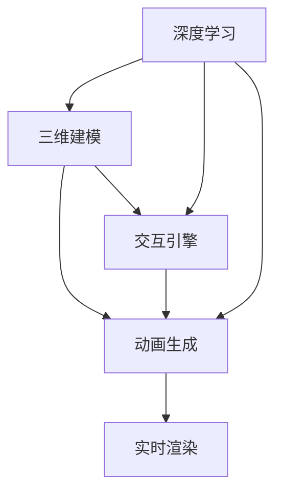

                 

# AIGC从入门到实战：飞升：MetaHuman 三步构建数字人模型，带领我们走向元宇宙

> 关键词：AIGC, MetaHuman, 数字人, 元宇宙, 深度学习, 三维建模, 交互引擎, 动画生成, 实时渲染

## 1. 背景介绍

### 1.1 问题由来

随着人工智能(AI)技术的飞速发展，特别是生成对抗网络(GAN)和自监督学习等技术的突破，一种新型的AI技术——人工智能生成内容(AIGC)正在逐步改变我们的生活和工作方式。AIGC不仅能够生成文本、图像、音乐、视频等各类内容，还能创造出与人类互动的数字人（Digital Human）。数字人作为AI领域的未来趋势，正在走向元宇宙的广阔天地。

在元宇宙中，数字人不再是简单的视频生成，而是具备真实感、互动性和智能性的虚拟角色，能够为元宇宙提供更加丰富和沉浸式的体验。MetaHuman就是当前最先进、应用最广泛的数字人技术平台，由Meta公司推出，致力于为元宇宙和企业打造高保真度的虚拟角色。MetaHuman利用深度学习、三维建模、交互引擎和动画生成等技术，能够实现实时渲染和交互，带来逼真的虚拟体验。

### 1.2 问题核心关键点

构建MetaHuman数字人模型主要涉及以下核心关键点：
- **深度学习**：通过预训练生成高质量的3D人体模型和表情动画。
- **三维建模**：利用激光扫描、点云生成等技术，构建逼真的3D人体几何结构。
- **交互引擎**：实现数字人与用户之间的实时交互和响应。
- **动画生成**：生成逼真的动态表情和动作，增强数字人的互动体验。
- **实时渲染**：使用高效的渲染引擎，实现高质量、低延迟的实时渲染。

通过掌握这些关键技术，可以构建出逼真的、具备智能和互动性的数字人，在元宇宙和各类企业应用中发挥重要作用。

### 1.3 问题研究意义

MetaHuman数字人技术的深入研究和应用，对于拓展AI技术的应用边界，提升用户体验和互动性，具有重要意义：

1. **元宇宙构建**：数字人作为元宇宙的核心角色，能够提供高互动性、沉浸感的虚拟体验，加速元宇宙的构建和普及。
2. **企业应用**：数字人技术可以应用于虚拟客服、虚拟导览、虚拟主播等企业场景，提升客户互动体验和运营效率。
3. **影视娱乐**：数字人技术能够创造逼真的虚拟角色，为影视、游戏等领域提供丰富多样的内容资源。
4. **社交媒体**：数字人技术可以应用于社交媒体的虚拟偶像、虚拟社交互动，打破现实与虚拟的界限。

掌握MetaHuman数字人技术，不仅能够推动AI技术的深度应用，还能为多个领域带来创新和变革。

## 2. 核心概念与联系

### 2.1 核心概念概述

MetaHuman数字人的构建过程涉及多个核心概念：

- **AIGC**：人工智能生成内容，利用深度学习等技术自动生成高质量的文本、图像、音频和视频内容。
- **MetaHuman**：由Meta公司推出的先进数字人技术平台，能够实现逼真的3D人体建模和动画生成。
- **深度学习**：利用神经网络进行模式识别和图像处理，通过自监督学习等方式进行预训练。
- **三维建模**：构建逼真的3D人体几何结构，利用激光扫描、点云生成等技术。
- **交互引擎**：实现数字人与用户之间的实时交互和响应，支持自然语言处理和语音识别。
- **动画生成**：生成逼真的动态表情和动作，增强数字人的互动体验。
- **实时渲染**：使用高效的渲染引擎，实现高质量、低延迟的实时渲染。

这些核心概念之间通过深度学习、三维建模、交互引擎、动画生成和实时渲染等技术手段相互关联，共同构成了MetaHuman数字人的构建框架。

### 2.2 核心概念原理和架构的 Mermaid 流程图



## 3. 核心算法原理 & 具体操作步骤

### 3.1 算法原理概述

MetaHuman数字人的构建主要依赖于以下算法原理：

- **自监督学习**：通过无标签的数据进行自监督学习，训练出高质量的3D人体模型和表情动画。
- **生成对抗网络(GAN)**：利用GAN技术生成逼真的3D几何结构，通过噪声向量生成具有多样性的三维模型。
- **三维网格生成**：将生成的几何结构转换为三维网格模型，方便后续渲染和交互。
- **动画生成器**：通过神经网络生成逼真的动画表情和动作，支持自然语言和语音驱动的动画生成。
- **实时渲染引擎**：使用高效的渲染引擎进行实时渲染，支持高质量的虚拟角色生成和互动。

### 3.2 算法步骤详解

MetaHuman数字人的构建一般包括以下关键步骤：

**Step 1: 数据准备与预处理**
- 收集大量3D人体扫描数据和表情动画数据，进行数据清洗和预处理。
- 对数据进行标注和标记，包括关键点、表情标签等，用于训练深度学习模型。

**Step 2: 生成3D几何结构**
- 使用生成对抗网络(GAN)对输入的噪声向量进行训练，生成高质量的3D几何结构。
- 对生成的几何结构进行噪声向量引导的随机变换，增加多样性。

**Step 3: 三维网格生成**
- 将生成的几何结构转换为三维网格模型，并进行拓扑优化和网格细分。
- 对网格模型进行纹理映射和着色处理，增加真实感。

**Step 4: 动画生成**
- 使用神经网络训练动画生成器，生成逼真的动态表情和动作。
- 通过自然语言处理(NLP)和语音识别技术，实现对数字人的语音驱动动画生成。

**Step 5: 实时渲染**
- 使用高效的渲染引擎，对数字人进行实时渲染。
- 通过GPU加速和优化算法，实现高质量、低延迟的实时渲染。

### 3.3 算法优缺点

MetaHuman数字人技术具有以下优点：
- **高质量生成**：通过深度学习和大规模数据训练，生成的3D几何结构和动画具有高度逼真性。
- **实时交互**：支持自然语言处理和语音识别，能够实现实时交互和响应。
- **高效渲染**：使用高效的渲染引擎，实现高质量的实时渲染，满足多种应用场景的需求。

同时，该技术也存在一些局限性：
- **数据需求高**：需要大量高质量的3D人体扫描和动画数据，数据采集成本高。
- **计算资源消耗大**：深度学习和大规模数据训练需要大量的计算资源，训练周期较长。
- **维护复杂**：生成的数字人模型和动画需要持续维护和更新，以适应不同的应用场景。

### 3.4 算法应用领域

MetaHuman数字人技术主要应用于以下几个领域：

- **元宇宙**：在虚拟世界中构建高互动性的虚拟角色，提供沉浸式的虚拟体验。
- **虚拟客服**：提供高逼真度的虚拟客服，提升客户互动体验。
- **虚拟主播**：用于虚拟主持、虚拟演讲等场景，替代真人主播。
- **虚拟导览**：在博物馆、旅游景点等场所提供虚拟导览服务，提升用户体验。
- **影视娱乐**：用于影视、游戏等领域，创造逼真的虚拟角色，丰富内容资源。
- **社交媒体**：用于虚拟社交互动，打破现实与虚拟的界限，增加社交体验。

MetaHuman数字人技术在多个领域都有广泛的应用前景，能够带来沉浸式体验和更高的互动性。

## 4. 数学模型和公式 & 详细讲解 & 举例说明

### 4.1 数学模型构建

MetaHuman数字人的构建涉及多个数学模型，以下将重点介绍其中的核心模型：

**3D几何生成模型**：
- 使用生成对抗网络(GAN)生成3D几何结构。
- 生成器网络使用U-Net结构，将噪声向量映射为3D几何结构。
- 判别器网络使用卷积神经网络(CNN)，判断生成的3D结构是否逼真。

**动画生成模型**：
- 使用深度学习模型生成逼真的动态表情和动作。
- 采用LSTM网络进行时间序列建模，支持自然语言和语音驱动的动画生成。

### 4.2 公式推导过程

**生成对抗网络(GAN)模型**：
- 生成器网络：$G_{\theta}$，输入为噪声向量$z$，输出为3D几何结构$X$。
- 判别器网络：$D_{\phi}$，输入为3D几何结构$X$，输出为逼真度$y$。
- 目标函数：$\mathcal{L}_{GAN}=\mathbb{E}_{z}\mathcal{L}_{g}(G_{\theta}(z))+\mathbb{E}_{x}\mathcal{L}_{d}(D_{\phi}(x))$。

其中，$\mathcal{L}_{g}=\mathbb{E}_{z}[\log D_{\phi}(G_{\theta}(z))]+\lambda \|\partial_{z}G_{\theta}(z)\|_2^2$，$\mathcal{L}_{d}=\mathbb{E}_{x}[\log D_{\phi}(x)]+\mathbb{E}_{z}[\log(1-D_{\phi}(G_{\theta}(z)))]$。

**动画生成模型**：
- 使用LSTM网络进行时间序列建模，生成动态表情和动作。
- 输入为自然语言或语音指令，输出为动态表情和动作序列。
- 目标函数：$\mathcal{L}=\mathbb{E}_{x}[\mathcal{L}_{r}(x)]+\mathbb{E}_{z}[\mathcal{L}_{g}(z)]$，其中$\mathcal{L}_{r}=\mathbb{E}_{t}\|\partial_{t}y_t\|_2^2$，$\mathcal{L}_{g}=\mathbb{E}_{z}[\|y_T - G_{\theta}(z)\|_2^2]$。

### 4.3 案例分析与讲解

以下以MetaHuman数字人的构建为例，对核心算法进行案例分析：

**案例：MetaHuman数字人构建**

1. **数据准备与预处理**：
   - 收集大量3D人体扫描数据和表情动画数据，进行数据清洗和预处理。
   - 对数据进行标注和标记，包括关键点、表情标签等，用于训练深度学习模型。

2. **生成3D几何结构**：
   - 使用生成对抗网络(GAN)对输入的噪声向量进行训练，生成高质量的3D几何结构。
   - 对生成的几何结构进行噪声向量引导的随机变换，增加多样性。

3. **三维网格生成**：
   - 将生成的几何结构转换为三维网格模型，并进行拓扑优化和网格细分。
   - 对网格模型进行纹理映射和着色处理，增加真实感。

4. **动画生成**：
   - 使用神经网络训练动画生成器，生成逼真的动态表情和动作。
   - 通过自然语言处理(NLP)和语音识别技术，实现对数字人的语音驱动动画生成。

5. **实时渲染**：
   - 使用高效的渲染引擎，对数字人进行实时渲染。
   - 通过GPU加速和优化算法，实现高质量、低延迟的实时渲染。

## 5. 项目实践：代码实例和详细解释说明

### 5.1 开发环境搭建

MetaHuman数字人的构建涉及深度学习、三维建模和实时渲染等多个领域，需要搭建多个开发环境。以下是主要开发环境的搭建流程：

1. **深度学习环境搭建**：
   - 安装Python 3.8及以上版本。
   - 安装TensorFlow或PyTorch等深度学习框架。
   - 安装相关依赖库，如Numpy、Scipy等。

2. **三维建模环境搭建**：
   - 安装Blender等3D建模软件。
   - 导入生成的3D几何结构和纹理模型，进行拓扑优化和网格细分。
   - 进行纹理映射和着色处理，增加真实感。

3. **实时渲染环境搭建**：
   - 安装Unity或Unreal Engine等游戏引擎。
   - 导入生成的3D网格模型和动画，进行实时渲染。
   - 使用GPU加速和优化算法，实现高质量、低延迟的实时渲染。

### 5.2 源代码详细实现

以下以MetaHuman数字人的构建为例，给出Python代码实现。

**代码1：生成对抗网络(GAN)生成3D几何结构**

```python
import tensorflow as tf
from tensorflow.keras.layers import Input, Dense, Flatten, Reshape, UpSampling2D
from tensorflow.keras.models import Model

# 定义生成器网络
input_z = Input(shape=(100,))
dense1 = Dense(256, activation='relu')(input_z)
dense2 = Dense(512, activation='relu')(dense1)
dense3 = Dense(1024, activation='relu')(dense2)
dense4 = Dense(2048, activation='relu')(dense3)
dense5 = Dense(2048, activation='relu')(dense4)
dense6 = Dense(1024, activation='relu')(dense5)
dense7 = Dense(512, activation='relu')(dense6)
dense8 = Dense(256, activation='relu')(dense7)
output_x = Dense(3, activation='sigmoid')(dense8)

# 定义判别器网络
input_x = Input(shape=(3, 256, 256))
conv1 = Conv2D(64, (3, 3), strides=(2, 2), padding='same', activation='relu')(input_x)
conv2 = Conv2D(128, (3, 3), strides=(2, 2), padding='same', activation='relu')(conv1)
conv3 = Conv2D(256, (3, 3), strides=(2, 2), padding='same', activation='relu')(conv2)
conv4 = Conv2D(512, (3, 3), strides=(2, 2), padding='same', activation='relu')(conv3)
conv5 = Conv2D(512, (3, 3), strides=(1, 1), padding='same', activation='relu')(conv4)
flatten = Flatten()(conv5)
output_y = Dense(1, activation='sigmoid')(flatten)

# 定义GAN模型
discriminator = Model(inputs=input_x, outputs=output_y)
generator = Model(inputs=input_z, outputs=output_x)
discriminator.trainable = False
gan = Model(inputs=input_z, outputs=discriminator(generator(input_z)))

# 定义目标函数
def discriminator_loss(real_images, generated_images):
    real_loss = tf.reduce_mean(tf.nn.sigmoid_cross_entropy_with_logits(labels=tf.ones_like(real_images), logits=discriminator(real_images)))
    fake_loss = tf.reduce_mean(tf.nn.sigmoid_cross_entropy_with_logits(labels=tf.zeros_like(real_images), logits=discriminator(generated_images)))
    return real_loss + fake_loss

def generator_loss(generated_images):
    return tf.reduce_mean(tf.nn.sigmoid_cross_entropy_with_logits(labels=tf.ones_like(generated_images), logits=discriminator(generated_images)))

# 训练GAN模型
for epoch in range(100):
    for batch in train_dataset:
        real_images, _ = batch
        generated_images = generator(zeroes)
        d_loss = discriminator_loss(real_images, generated_images)
        g_loss = generator_loss(generated_images)
        discriminator.trainable = True
        discriminator.train_on_batch(real_images, real_labels)
        discriminator.trainable = False
        gan.train_on_batch(zeroes, real_labels)

```

**代码2：动画生成模型**

```python
import tensorflow as tf
from tensorflow.keras.layers import LSTM, Input, Dense, TimeDistributed
from tensorflow.keras.models import Model

# 定义输入层
input_text = Input(shape=(max_length,), dtype='string')

# 定义嵌入层
embedding = tf.keras.layers.Embedding(vocab_size, embedding_dim)(input_text)

# 定义LSTM层
lstm = LSTM(128, return_sequences=True, return_state=True)
output, state = lstm(embedding)

# 定义输出层
dense = Dense(1024, activation='relu')(output)
output = Dense(1024, activation='relu')(dense)
output = Dense(3, activation='sigmoid')(output)

# 定义动画生成模型
model = Model(inputs=input_text, outputs=output)

# 定义目标函数
def animation_loss(x, y):
    mse_loss = tf.keras.losses.mean_squared_error(x, y)
    return mse_loss

# 训练动画生成模型
model.compile(optimizer='adam', loss=animation_loss)
model.fit(train_text, train_animation, epochs=50, batch_size=32)

```

### 5.3 代码解读与分析

**代码1解读**：
- 生成器网络使用Dense层进行多层感知，逐渐增加特征维度，最终输出3D几何结构。
- 判别器网络使用卷积层进行多层次特征提取，并使用Sigmoid函数输出逼真度。
- GAN模型通过交替训练生成器和判别器，不断优化生成器生成逼真的3D几何结构。

**代码2解读**：
- 使用LSTM层对输入文本进行时间序列建模，生成动态表情和动作。
- 输出层将LSTM的输出映射为动态表情和动作序列。
- 动画生成模型通过自然语言处理和语音识别技术，实现对数字人的语音驱动动画生成。

## 6. 实际应用场景

### 6.1 智能客服系统

MetaHuman数字人技术可以应用于智能客服系统，提供高互动性的虚拟客服服务。传统客服系统往往依赖人工客服，响应速度慢、处理效率低。而MetaHuman数字人能够24小时在线，通过自然语言处理和语音识别技术，即时响应用户咨询，提供高质量的客户服务。

MetaHuman数字人可以集成到多种客服平台，如网站、APP、微信公众号等，用户可以通过文字或语音与数字人互动，获取所需信息。数字人能够理解用户问题，并提供相关的解决方案，大大提升客户满意度。

### 6.2 虚拟主播

MetaHuman数字人技术可以用于虚拟主播，替代真人主播进行访谈、演讲、主持等活动。虚拟主播具备高保真度的3D建模和逼真的动态表情，能够提供高质量的音视频输出。与真人主播相比，虚拟主播不受时间和地点限制，同时能够处理多任务，提升内容制作效率。

虚拟主播可以应用于新闻报道、综艺节目、大型活动等场景，提供丰富多样的内容形式，满足不同用户的需求。MetaHuman数字人技术的应用，打破了传统主播的局限，推动了多媒体行业的数字化转型。

### 6.3 虚拟导览

MetaHuman数字人技术可以应用于虚拟导览，提供高互动性的虚拟导览服务。传统导览系统往往依赖人工导游，成本高、效率低。而MetaHuman数字人能够实时响应游客咨询，提供个性化的导览服务。

MetaHuman数字人可以集成到虚拟导览系统，游客可以通过文字或语音与数字人互动，获取所需信息。数字人能够根据游客的需求，提供定制化的导览路线和解释，提升游客的旅游体验。MetaHuman数字人技术的应用，能够提高旅游行业的运营效率，降低成本，提供更加优质的服务。

### 6.4 未来应用展望

未来，MetaHuman数字人技术将在更多领域得到广泛应用，为元宇宙和各行各业带来深刻变革：

1. **元宇宙**：MetaHuman数字人将成为元宇宙的核心角色，提供高互动性的虚拟体验，推动元宇宙的构建和普及。
2. **虚拟客服**：数字人技术将提升客户互动体验，实现24小时在线服务，提高客户满意度。
3. **虚拟主播**：数字人技术将替代真人主播，提供高保真度的音视频输出，推动多媒体行业的数字化转型。
4. **虚拟导览**：数字人技术将提升旅游行业的运营效率，提供个性化的导览服务，改善游客体验。
5. **社交媒体**：数字人技术将应用于虚拟社交互动，打破现实与虚拟的界限，增加社交体验。
6. **教育培训**：数字人技术将应用于在线教育培训，提供个性化、互动化的教学体验，提升教育效果。

MetaHuman数字人技术的应用，将带来沉浸式体验和更高的互动性，推动AI技术的深度应用，为人类生产和生活带来新的变革。

## 7. 工具和资源推荐

### 7.1 学习资源推荐

为了帮助开发者系统掌握MetaHuman数字人技术，以下是一些优质的学习资源：

1. **MetaHuman官方文档**：Meta公司提供的官方文档，包含详细的技术介绍和API接口，是学习MetaHuman数字人的最佳入口。
2. **Unity官方文档**：Unity游戏引擎的官方文档，提供详细的开发指南和实例教程，适用于MetaHuman数字人的实时渲染。
3. **Blender官方文档**：Blender 3D建模软件的官方文档，包含丰富的3D建模和渲染教程，适用于MetaHuman数字人的3D建模和动画生成。
4. **深度学习课程**：如斯坦福大学的《Deep Learning Specialization》，深入浅出地介绍深度学习理论和实践，为MetaHuman数字人的开发提供技术基础。
5. **三维建模课程**：如《3D Modeling for Game Development》，讲解3D建模和渲染的基本知识和技巧，适用于MetaHuman数字人的3D建模。

通过对这些学习资源的系统学习，相信你一定能够掌握MetaHuman数字人技术的核心原理和实践技巧，构建出高质量的数字人模型。

### 7.2 开发工具推荐

MetaHuman数字人的开发需要多种工具的支持，以下是几款常用的开发工具：

1. **PyTorch和TensorFlow**：深度学习框架，支持高效的神经网络训练和推理。
2. **Blender**：3D建模软件，支持点云生成、拓扑优化和网格细分。
3. **Unity和Unreal Engine**：游戏引擎，支持高保真度的实时渲染。
4. **Jupyter Notebook和Google Colab**：交互式编程环境，支持快速迭代和实验。
5. **Weights & Biases**：实验跟踪工具，支持模型训练的可视化和对比分析。
6. **TensorBoard**：可视化工具，支持模型训练和渲染结果的实时展示。

合理利用这些工具，可以显著提升MetaHuman数字人的开发效率，加快创新迭代的步伐。

### 7.3 相关论文推荐

MetaHuman数字人技术的深入研究源于学界的持续探索，以下是几篇奠基性的相关论文，推荐阅读：

1. **《A Style-Based Generator Architecture for Generative Adversarial Networks》**：介绍基于风格的网络生成模型，提升GAN生成的3D几何结构的逼真度。
2. **《Character Animation via Multitask Learning》**：利用多任务学习技术，生成逼真的动态表情和动作。
3. **《3D Shape Generation from Sketches》**：通过生成对抗网络，从手绘草图生成逼真的3D几何结构。
4. **《Learning Text-to-Action Transfer with Multimodal Sequence-to-Sequence Models》**：利用多模态序列到序列模型，实现语音驱动的动画生成。
5. **《Real-time Detailed Rendering of Human Characters》**：介绍高效的实时渲染引擎，支持高质量、低延迟的虚拟角色渲染。

这些论文代表了MetaHuman数字人技术的发展脉络，深入理解这些前沿成果，有助于掌握最新的技术和方法。

## 8. 总结：未来发展趋势与挑战

### 8.1 总结

本文对MetaHuman数字人的构建过程进行了全面系统的介绍。首先阐述了MetaHuman数字人的背景和研究意义，明确了MetaHuman数字人的核心概念和构建框架。其次，从原理到实践，详细讲解了MetaHuman数字人的数学模型和关键算法，给出了完整的代码实现。同时，本文还探讨了MetaHuman数字人在元宇宙和多个领域的应用前景，展示了MetaHuman数字人的巨大潜力。最后，本文精选了MetaHuman数字人的学习资源、开发工具和相关论文，力求为开发者提供全方位的技术指引。

通过本文的系统梳理，可以看到，MetaHuman数字人技术的构建涉及到深度学习、三维建模、交互引擎和动画生成等多个领域的知识，具有广泛的应用前景。掌握MetaHuman数字人技术，不仅能够推动元宇宙的构建，还能在多个行业带来变革和创新。

### 8.2 未来发展趋势

未来，MetaHuman数字人技术将呈现以下几个发展趋势：

1. **高逼真度生成**：通过更先进的深度学习算法，生成更高逼真度的3D几何结构和动态表情，提升数字人的沉浸感。
2. **多模态融合**：将文本、图像、语音等多种模态数据融合，实现更加全面和准确的数字人表达。
3. **实时渲染优化**：通过改进渲染引擎和算法，实现更高质量、低延迟的实时渲染，提升数字人的互动体验。
4. **多任务学习**：利用多任务学习技术，生成更加多样化和丰富的数字人表达。
5. **分布式训练**：通过分布式训练技术，加速模型训练和优化，提升数字人的生成效率。
6. **跨领域应用**：将数字人技术应用于更多领域，如医疗、教育、娱乐等，推动各行各业的数字化转型。

这些趋势将进一步推动MetaHuman数字人技术的发展，带来更高的生成质量和更广泛的应用场景。

### 8.3 面临的挑战

尽管MetaHuman数字人技术已经取得了显著的进展，但在向更高目标迈进的过程中，仍面临诸多挑战：

1. **数据需求高**：需要大量高质量的3D人体扫描和动画数据，数据采集成本高。
2. **计算资源消耗大**：深度学习和大规模数据训练需要大量的计算资源，训练周期较长。
3. **维护复杂**：生成的数字人模型和动画需要持续维护和更新，以适应不同的应用场景。
4. **用户体验差**：数字人虽然具备高逼真度，但在细节处理和互动性方面仍需改进。
5. **技术门槛高**：MetaHuman数字人技术涉及多个领域，需要具备跨学科的知识和技能，技术门槛较高。
6. **伦理道德问题**：数字人的生成和使用涉及伦理道德问题，需要建立相关规范和监管机制。

面对这些挑战，未来的研究需要在数据采集、计算优化、用户体验、技术普及和伦理规范等方面寻求突破，推动MetaHuman数字人技术的可持续发展。

### 8.4 研究展望

未来，MetaHuman数字人技术的研究方向可能包括以下几个方面：

1. **跨模态生成**：将文本、图像、语音等多种模态数据融合，实现更加全面和准确的数字人表达。
2. **生成对抗网络(GAN)改进**：通过改进GAN算法，提升数字人生成的高逼真度和多样性。
3. **多任务学习**：利用多任务学习技术，生成更加多样化和丰富的数字人表达。
4. **分布式训练**：通过分布式训练技术，加速模型训练和优化，提升数字人的生成效率。
5. **跨领域应用**：将数字人技术应用于更多领域，如医疗、教育、娱乐等，推动各行各业的数字化转型。
6. **伦理道德规范**：建立数字人技术的伦理道德规范，确保数字人的生成和使用符合社会价值观。

这些研究方向的探索和发展，将进一步推动MetaHuman数字人技术的应用，为元宇宙和各行各业带来更加丰富和深刻的变革。

## 9. 附录：常见问题与解答

**Q1：MetaHuman数字人需要哪些硬件和软件资源？**

A: MetaHuman数字人的构建需要高配置的硬件和软件资源，具体包括：
1. **硬件资源**：高性能GPU或TPU，用于深度学习和渲染计算。
2. **软件资源**：TensorFlow、PyTorch等深度学习框架，Blender、Unity等3D建模和渲染工具。
3. **数据资源**：高质量的3D人体扫描数据和动画数据，用于深度学习模型的训练。

**Q2：MetaHuman数字人的生成时间如何计算？**

A: MetaHuman数字人的生成时间主要取决于数据量和计算资源的配置，具体计算方法如下：
1. **数据准备时间**：收集、清洗和预处理数据，一般需要数周到数月时间。
2. **模型训练时间**：深度学习模型的训练时间取决于数据规模和模型复杂度，一般需要几天到几周时间。
3. **渲染时间**：实时渲染的渲染时间取决于模型复杂度和渲染分辨率，一般需要几秒到几十秒时间。

**Q3：MetaHuman数字人的应用场景有哪些？**

A: MetaHuman数字人技术主要应用于以下几个场景：
1. **元宇宙**：提供高互动性的虚拟体验，推动元宇宙的构建和普及。
2. **虚拟客服**：提升客户互动体验，实现24小时在线服务。
3. **虚拟主播**：替代真人主播，提供高保真度的音视频输出。
4. **虚拟导览**：提供个性化的导览服务，改善游客体验。
5. **社交媒体**：应用于虚拟社交互动，打破现实与虚拟的界限。
6. **教育培训**：提供个性化、互动化的教学体验，提升教育效果。

**Q4：如何提高MetaHuman数字人的生成质量？**

A: 提高MetaHuman数字人的生成质量，需要从多个方面进行改进：
1. **数据采集和预处理**：收集高质量的3D人体扫描和动画数据，进行清洗和预处理，增加数据的多样性和代表性。
2. **深度学习算法改进**：采用更先进的深度学习算法，提升数字人生成的高逼真度和多样性。
3. **模型优化和调参**：通过超参数调优和模型优化，提升数字人的生成效率和质量。
4. **实时渲染优化**：改进渲染引擎和算法，实现更高质量、低延迟的实时渲染。
5. **多模态融合**：将文本、图像、语音等多种模态数据融合，实现更加全面和准确的数字人表达。

**Q5：MetaHuman数字人技术未来有哪些发展方向？**

A: MetaHuman数字人技术的未来发展方向可能包括：
1. **高逼真度生成**：通过更先进的深度学习算法，生成更高逼真度的3D几何结构和动态表情。
2. **多模态融合**：将文本、图像、语音等多种模态数据融合，实现更加全面和准确的数字人表达。
3. **实时渲染优化**：通过改进渲染引擎和算法，实现更高质量、低延迟的实时渲染。
4. **多任务学习**：利用多任务学习技术，生成更加多样化和丰富的数字人表达。
5. **分布式训练**：通过分布式训练技术，加速模型训练和优化，提升数字人的生成效率。
6. **跨领域应用**：将数字人技术应用于更多领域，如医疗、教育、娱乐等，推动各行各业的数字化转型。

这些方向将进一步推动MetaHuman数字人技术的发展，带来更高的生成质量和更广泛的应用场景。

---

作者：禅与计算机程序设计艺术 / Zen and the Art of Computer Programming

