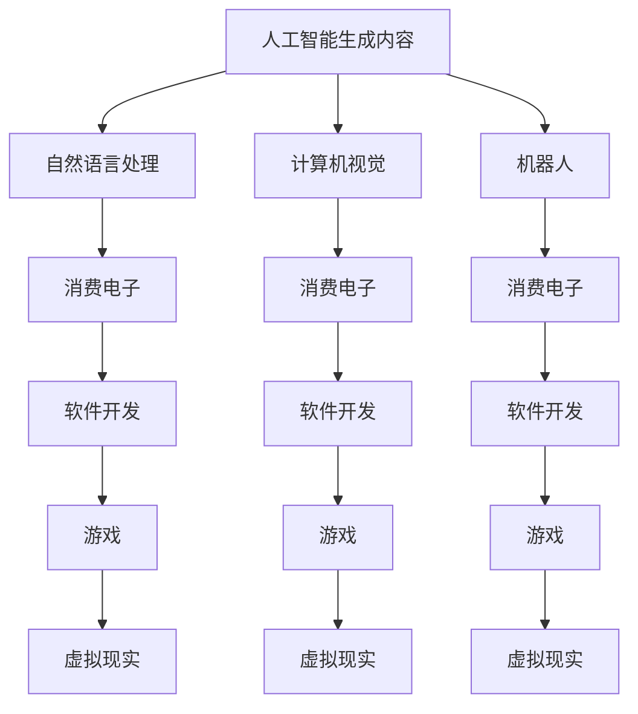

                 

# AIGC在软件与消费电子中的应用

> 关键词：人工智能生成内容(AIGC), 自然语言处理(NLP), 计算机视觉(CV), 机器人, 消费电子, 软件开发, 游戏, 虚拟现实(VR)

## 1. 背景介绍

随着人工智能技术的迅猛发展，人工智能生成内容（Artificial Intelligence Generated Content，AIGC）逐渐成为引领下一代技术潮流的重要力量。AIGC技术依托于深度学习和模型优化，可以通过大规模的语料库、图像库和知识图谱等数据，自动生成高质量的文本、图像、音频等内容。AIGC技术在软件与消费电子领域的应用，正在颠覆传统产品的设计、开发、使用和维护模式，开辟了全新的应用前景。本文将探讨AIGC技术在软件与消费电子中的应用现状，分析其核心概念与联系，并展望其未来发展趋势与挑战。

## 2. 核心概念与联系

### 2.1 核心概念概述

为更好地理解AIGC技术在软件与消费电子中的应用，本节将介绍几个密切相关的核心概念：

- **人工智能生成内容 (AIGC)**：通过深度学习模型自动生成的文本、图像、音频等内容。AIGC包括生成式对抗网络（GANs）、变分自编码器（VAEs）、自回归模型（如LSTM、GRU）和自编码器等技术。
- **自然语言处理 (NLP)**：研究如何让计算机理解和生成自然语言的技术，包括文本分类、情感分析、机器翻译、对话系统等。
- **计算机视觉 (CV)**：研究如何让计算机理解和生成图像和视频的技术，包括图像识别、图像生成、视频分析等。
- **机器人 (Robotics)**：结合计算机视觉、自然语言处理等技术，研究如何让机器人执行复杂任务，如自动驾驶、服务机器人等。
- **消费电子 (Consumer Electronics)**：以用户消费为主体的电子产品，如智能手机、智能家居、可穿戴设备等。
- **软件开发 (Software Development)**：软件从需求分析、设计、开发、测试到部署的过程，包括敏捷开发、持续集成、DevOps等。
- **游戏 (Video Games)**：通过计算机图形、人工智能等技术，实现沉浸式互动体验的应用。
- **虚拟现实 (VR)**：结合计算机视觉、自然语言处理等技术，提供沉浸式的虚拟体验。

这些核心概念之间的逻辑关系可以通过以下Mermaid流程图来展示：



这个流程图展示了AIGC技术与其他技术之间的关系，以及它们如何共同作用于软件与消费电子领域的应用：

1. AIGC通过生成高质量的文本、图像、音频等内容，丰富软件和消费电子产品的用户体验。
2. NLP和CV技术为AIGC提供了文本和图像等数据的预处理和生成基础。
3. 机器人技术可以将AIGC技术应用于服务机器人、自动驾驶等领域，提升自动化水平。
4. 消费电子、软件开发、游戏和VR等应用领域，通过AIGC技术实现更智能、更沉浸的交互和内容生成。

## 3. 核心算法原理 & 具体操作步骤

### 3.1 算法原理概述

AIGC在软件与消费电子中的应用，核心原理是利用深度学习模型自动生成高质量的文本、图像、音频等内容。其基本流程包括数据预处理、模型训练、内容生成等步骤。

1. **数据预处理**：收集和清洗大量标注数据，包括文本、图像、音频等，用于训练生成模型。
2. **模型训练**：使用神经网络模型对标注数据进行训练，学习生成不同类型内容的规律和结构。
3. **内容生成**：根据输入的种子或条件，模型生成与真实数据相仿的文本、图像、音频等内容。

### 3.2 算法步骤详解

以下将详细介绍AIGC在软件与消费电子中的应用过程中，涉及到的核心算法步骤：

#### 3.2.1 数据预处理

数据预处理是AIGC应用的基础，其目标是从原始数据中提取出有价值的特征，以便于模型训练和生成。具体步骤包括：

1. **数据收集**：从互联网、社交媒体、公共数据库等渠道收集相关数据，如文本、图片、音频等。
2. **数据清洗**：对收集到的数据进行去重、去噪、修正等处理，去除无效或不符合要求的数据。
3. **数据标注**：对清洗后的数据进行人工标注，如文本分类、情感分析、图像标注等。
4. **数据增强**：通过数据增强技术，如旋转、裁剪、拼接等，扩充训练集的规模和多样性。

#### 3.2.2 模型训练

模型训练是AIGC技术实现的关键步骤，其目标是让模型学习如何生成高质量的内容。具体步骤如下：

1. **模型选择**：选择适合生成任务的深度学习模型，如GANs、VAEs、LSTM等。
2. **超参数调优**：根据具体任务和数据特点，调整模型的超参数，如学习率、批量大小、正则化参数等。
3. **模型训练**：使用收集到的数据对模型进行训练，迭代优化模型参数。
4. **模型评估**：在验证集上评估模型的性能，使用指标如BLEU、ROUGE、Inception Score等衡量模型生成内容的真实性和多样性。

#### 3.2.3 内容生成

内容生成是AIGC技术的最终目标，其目标是生成符合要求的内容。具体步骤如下：

1. **输入生成**：根据具体应用场景，设计合适的输入格式，如文本、图像、音频等。
2. **条件生成**：根据输入条件，模型生成相应的内容。如根据文本生成图像、根据音频生成字幕等。
3. **后处理**：对生成的内容进行后处理，如裁剪、调整大小、添加特效等。

### 3.3 算法优缺点

AIGC在软件与消费电子中的应用，具有以下优点：

1. **高效生成内容**：AIGC技术可以在短时间内生成大量高质量的内容，满足不同应用场景的需求。
2. **降低成本**：AIGC技术可以替代部分人工内容创作，降低人力成本和时间成本。
3. **提升用户体验**：AIGC技术生成的内容可以提升用户体验，如智能客服、虚拟主播等。

同时，AIGC技术也存在一些局限性：

1. **数据依赖性**：AIGC技术依赖大量标注数据，数据质量对生成内容的准确性和多样性有重要影响。
2. **模型复杂性**：AIGC模型复杂度较高，训练和生成过程需要大量计算资源。
3. **内容真实性**：AIGC生成的内容可能缺乏真实性和可信度，对某些应用场景可能不够适用。
4. **版权问题**：AIGC技术可能涉及版权问题，需要考虑内容的合法性。

### 3.4 算法应用领域

AIGC技术在软件与消费电子领域的应用非常广泛，涵盖以下几个主要领域：

#### 3.4.1 消费电子

AIGC技术在消费电子中的应用，可以通过以下方式实现：

1. **智能客服**：利用AIGC技术生成智能客服回复，提升客户服务体验。
2. **虚拟主播**：通过AIGC技术生成虚拟主播的声音和文本，实现人机交互。
3. **智能家居**：利用AIGC技术生成智能家居设备的使用指南和说明书。

#### 3.4.2 软件开发

AIGC技术在软件开发中的应用，可以通过以下方式实现：

1. **代码生成**：利用AIGC技术生成代码片段，加速软件开发进程。
2. **文档生成**：通过AIGC技术生成技术文档、API文档等，提升文档质量。
3. **测试数据生成**：利用AIGC技术生成测试数据，提高测试效率。

#### 3.4.3 游戏

AIGC技术在游戏中的应用，可以通过以下方式实现：

1. **虚拟角色**：通过AIGC技术生成虚拟角色的对话和行为，提升游戏沉浸感。
2. **游戏生成**：利用AIGC技术生成游戏关卡、道具等，丰富游戏内容。
3. **语音合成**：通过AIGC技术生成语音合成数据，提升游戏音效效果。

#### 3.4.4 虚拟现实

AIGC技术在虚拟现实中的应用，可以通过以下方式实现：

1. **虚拟场景**：利用AIGC技术生成虚拟场景，提升用户体验。
2. **虚拟主播**：通过AIGC技术生成虚拟主播的对话和行为，实现人机交互。
3. **虚拟导航**：利用AIGC技术生成虚拟导航提示，提升用户导航体验。

## 4. 数学模型和公式 & 详细讲解 & 举例说明

### 4.1 数学模型构建

AIGC技术在实际应用中，通常需要构建以下数学模型：

1. **文本生成模型**：基于RNN、LSTM、GRU等模型，生成文本内容。
2. **图像生成模型**：基于GANs、VAEs等模型，生成图像内容。
3. **音频生成模型**：基于WaveNet、WaveRNN等模型，生成音频内容。

以文本生成模型为例，其数学模型如下：

$$
P(x|y) = \prod_{t=1}^T \frac{1}{Z} exp(\frac{x_t}{y} log \sigma (\frac{W_{enc} h_{t-1} + U x_{t-1} + b}{\sqrt{\delta}}))
$$

其中，$P(x|y)$ 表示在条件 $y$ 下生成文本 $x$ 的概率，$T$ 表示文本长度，$Z$ 为归一化常数，$\sigma$ 为激活函数，$h_{t-1}$ 为前一时刻的隐藏状态，$W_{enc}$ 和 $U$ 为权重矩阵，$b$ 为偏置项。

### 4.2 公式推导过程

以下以文本生成模型为例，推导其基本公式的推导过程：

1. **模型定义**：
   - **输入层**：将输入的文本序列 $x$ 转换为词向量表示。
   - **编码层**：使用LSTM等模型对输入文本进行编码，生成隐藏状态 $h_{t-1}$。
   - **输出层**：使用全连接层将编码器的输出 $h_{t-1}$ 映射到生成器输出 $x_{t-1}$，并计算生成器输出概率。

2. **损失函数**：
   - **交叉熵损失**：利用交叉熵损失函数，计算模型生成的文本与真实文本之间的差异。
   - **负对数似然损失**：通过负对数似然损失函数，计算模型生成的文本概率与真实文本概率之间的差异。

3. **优化算法**：
   - **反向传播算法**：通过反向传播算法，更新模型参数，最小化损失函数。

### 4.3 案例分析与讲解

以文本生成模型为例，介绍其实际应用场景：

#### 4.3.1 文本摘要生成

文本摘要生成是文本生成模型的典型应用场景。其基本流程如下：

1. **输入文本**：输入需要摘要的文本。
2. **编码器**：使用LSTM等模型对输入文本进行编码，生成隐藏状态 $h_{t-1}$。
3. **解码器**：使用LSTM等模型对隐藏状态 $h_{t-1}$ 进行解码，生成摘要文本。
4. **后处理**：对生成的摘要文本进行后处理，如去除冗余信息、调整句子顺序等。

#### 4.3.2 对话生成

对话生成是自然语言处理中的重要应用场景。其基本流程如下：

1. **输入**：输入用户输入的对话内容。
2. **生成模型**：使用RNN、LSTM等模型，根据用户输入生成响应。
3. **后处理**：对生成的响应进行后处理，如语法修正、语义校正等。

## 5. 项目实践：代码实例和详细解释说明

### 5.1 开发环境搭建

在进行AIGC项目实践前，需要先搭建好开发环境。以下是使用Python进行TensorFlow开发的环境配置流程：

1. 安装Anaconda：从官网下载并安装Anaconda，用于创建独立的Python环境。
2. 创建并激活虚拟环境：
   ```bash
   conda create -n tf-env python=3.8 
   conda activate tf-env
   ```

3. 安装TensorFlow：根据CUDA版本，从官网获取对应的安装命令。例如：
   ```bash
   conda install tensorflow==2.6 -c conda-forge
   ```

4. 安装各类工具包：
   ```bash
   pip install numpy pandas scikit-learn matplotlib tqdm jupyter notebook ipython
   ```

完成上述步骤后，即可在`tf-env`环境中开始AIGC项目实践。

### 5.2 源代码详细实现

这里我们以生成式对抗网络（GANs）为例，介绍AIGC在图像生成中的应用。

首先，定义GAN模型的结构：

```python
import tensorflow as tf
from tensorflow.keras import layers

def make_generator_model():
    model = tf.keras.Sequential()
    model.add(layers.Dense(7*7*256, use_bias=False, input_shape=(100,)))
    model.add(layers.BatchNormalization())
    model.add(layers.LeakyReLU())
    
    model.add(layers.Reshape((7, 7, 256)))
    assert model.output_shape == (None, 7, 7, 256) # Note: None is the batch size
    
    model.add(layers.Conv2DTranspose(128, (5, 5), strides=(1, 1), padding='same', use_bias=False))
    assert model.output_shape == (None, 7, 7, 128)
    model.add(layers.BatchNormalization())
    model.add(layers.LeakyReLU())
    
    model.add(layers.Conv2DTranspose(64, (5, 5), strides=(2, 2), padding='same', use_bias=False))
    assert model.output_shape == (None, 14, 14, 64)
    model.add(layers.BatchNormalization())
    model.add(layers.LeakyReLU())
    
    model.add(layers.Conv2DTranspose(1, (5, 5), strides=(2, 2), padding='same', use_bias=False, activation='tanh'))
    assert model.output_shape == (None, 28, 28, 1)
    
    return model

def make_discriminator_model():
    model = tf.keras.Sequential()
    model.add(layers.Conv2D(64, (5, 5), strides=(2, 2), padding='same',
                           input_shape=[28, 28, 1]))
    model.add(layers.LeakyReLU())
    model.add(layers.Dropout(0.3))
    
    model.add(layers.Conv2D(128, (5, 5), strides=(2, 2), padding='same'))
    model.add(layers.LeakyReLU())
    model.add(layers.Dropout(0.3))
    
    model.add(layers.Flatten())
    model.add(layers.Dense(1))
    
    return model
```

然后，定义损失函数和优化器：

```python
@tf.function
def generator_loss(fake_output):
    return tf.reduce_mean(tf.keras.losses.BinaryCrossentropy()(tf.ones_like(fake_output), fake_output))

@tf.function
def discriminator_loss(real_output, fake_output):
    real_loss = tf.keras.losses.BinaryCrossentropy()(tf.ones_like(real_output), real_output)
    fake_loss = tf.keras.losses.BinaryCrossentropy()(tf.zeros_like(fake_output), fake_output)
    total_loss = real_loss + fake_loss
    return total_loss
```

接着，定义训练函数：

```python
@tf.function
def train_step(images):
    noise = tf.random.normal([BATCH_SIZE, LATENT_DIM])
    with tf.GradientTape() as gen_tape, tf.GradientTape() as disc_tape:
        generated_images = generator(noise, training=True)
        real_output = discriminator(images, training=True)
        fake_output = discriminator(generated_images, training=True)
        
        gen_loss = generator_loss(fake_output)
        disc_loss = discriminator_loss(real_output, fake_output)
        
        gradients_of_generator = gen_tape.gradient(gen_loss, generator.trainable_variables)
        gradients_of_discriminator = disc_tape.gradient(disc_loss, discriminator.trainable_variables)
        
        generator_optimizer.apply_gradients(zip(gradients_of_generator, generator.trainable_variables))
        discriminator_optimizer.apply_gradients(zip(gradients_of_discriminator, discriminator.trainable_variables))
```

最后，启动训练流程：

```python
epochs = 100
BATCH_SIZE = 128
LATENT_DIM = 100

for epoch in range(epochs):
    for image_batch in train_dataset:
        train_step(image_batch)
    
    if epoch % 10 == 0:
        print('Epoch {} complete.'.format(epoch))
```

以上就是使用TensorFlow进行GAN模型训练的完整代码实现。可以看到，利用TensorFlow的高级API，我们能够以非常简洁的方式构建和训练GAN模型。

### 5.3 代码解读与分析

让我们再详细解读一下关键代码的实现细节：

**GAN模型的定义**：
- `make_generator_model`函数：定义生成器的结构，包含全连接层、批标准化、激活函数、反卷积等。
- `make_discriminator_model`函数：定义判别器的结构，包含卷积层、激活函数、dropout等。

**损失函数的定义**：
- `generator_loss`函数：定义生成器的损失函数，使用二元交叉熵计算生成图像与真实标签之间的差异。
- `discriminator_loss`函数：定义判别器的损失函数，使用二元交叉熵计算生成图像与真实标签之间的差异。

**训练函数的定义**：
- `train_step`函数：定义训练过程，使用优化器更新生成器和判别器的参数，最小化损失函数。

**训练流程的启动**：
- 定义训练轮数和批大小，循环迭代训练过程。
- 每个epoch结束后，输出当前轮次的信息。

可以看到，TensorFlow的高级API使得AIGC模型的构建和训练过程非常简洁高效。开发者可以将更多精力放在模型优化和任务实现上，而不必过多关注底层的实现细节。

当然，工业级的系统实现还需考虑更多因素，如模型的保存和部署、超参数的自动搜索、更灵活的任务适配层等。但核心的生成范式基本与此类似。

## 6. 实际应用场景

### 6.1 智能客服系统

AIGC技术在智能客服系统中的应用，可以通过以下方式实现：

1. **语音识别**：利用AIGC技术将用户语音转换为文本，进行语音识别和理解。
2. **智能问答**：利用AIGC技术生成智能问答系统，自动回答用户问题。
3. **情感分析**：利用AIGC技术进行情感分析，识别用户情感状态，提供相应的服务。

### 6.2 虚拟主播

AIGC技术在虚拟主播中的应用，可以通过以下方式实现：

1. **语音生成**：利用AIGC技术生成虚拟主播的语音，实现人机交互。
2. **情感控制**：利用AIGC技术控制虚拟主播的情感，提升用户体验。
3. **场景生成**：利用AIGC技术生成虚拟主播的对话场景，丰富互动内容。

### 6.3 游戏

AIGC技术在游戏中的应用，可以通过以下方式实现：

1. **虚拟角色**：利用AIGC技术生成虚拟角色的对话和行为，提升游戏沉浸感。
2. **游戏生成**：利用AIGC技术生成游戏关卡、道具等，丰富游戏内容。
3. **语音合成**：通过AIGC技术生成语音合成数据，提升游戏音效效果。

### 6.4 虚拟现实

AIGC技术在虚拟现实中的应用，可以通过以下方式实现：

1. **虚拟场景**：利用AIGC技术生成虚拟场景，提升用户体验。
2. **虚拟主播**：通过AIGC技术生成虚拟主播的对话和行为，实现人机交互。
3. **虚拟导航**：利用AIGC技术生成虚拟导航提示，提升用户导航体验。

## 7. 工具和资源推荐

### 7.1 学习资源推荐

为了帮助开发者系统掌握AIGC技术的理论基础和实践技巧，这里推荐一些优质的学习资源：

1. **Deep Learning Specialization by Andrew Ng**：斯坦福大学的深度学习课程，全面介绍了深度学习的基本概念和常用模型，适合初学者入门。
2. **Coursera上的AI课程**：涵盖从机器学习到深度学习的内容，适合系统学习AI技术。
3. **Towards Data Science**：一篇介绍生成对抗网络的博客文章，内容深入浅出，适合进一步理解GANs的原理和应用。
4. **OpenAI的DALL·E和CLIP论文**：深度学习领域的经典论文，详细介绍了生成模型和图像分类模型的构建和应用。
5. **NVIDIA的GPT系列模型**：NVIDIA开发的生成模型，展示了GPT-2、GPT-3等模型的应用实例。

通过对这些资源的学习实践，相信你一定能够快速掌握AIGC技术的精髓，并用于解决实际的NLP问题。

### 7.2 开发工具推荐

高效的开发离不开优秀的工具支持。以下是几款用于AIGC开发常用的工具：

1. **TensorFlow**：由Google主导开发的深度学习框架，支持分布式训练和生产部署。
2. **PyTorch**：由Facebook开发的深度学习框架，支持动态计算图，灵活度高。
3. **JAX**：由Google开发的张量计算框架，支持自动微分和分布式训练。
4. **ONNX Runtime**：由Microsoft开发的深度学习推理引擎，支持多种模型和平台。
5. **TensorBoard**：TensorFlow配套的可视化工具，可实时监测模型训练状态，提供丰富的图表呈现方式。

合理利用这些工具，可以显著提升AIGC模型的开发效率，加快创新迭代的步伐。

### 7.3 相关论文推荐

AIGC技术的发展源于学界的持续研究。以下是几篇奠基性的相关论文，推荐阅读：

1. **Generative Adversarial Nets**：Ian Goodfellow等人在2014年发表的GANs论文，奠定了生成对抗网络的研究基础。
2. **Generating Speech with Deep Generative Adversarial Networks**：Jakob S. Jensen等人在2017年发表的语音生成模型论文，展示了GANs在语音合成中的应用。
3. **GPT-2: Language Models are Unsupervised Multitask Learners**：OpenAI在2019年发表的GPT-2论文，展示了基于Transformer的生成模型在文本生成中的应用。
4. **CLIP: A Simple Framework for Unsupervised Learning of Visual Representations**：OpenAI在2021年发表的CLIP论文，展示了使用自监督学习训练图像分类模型的方法。
5. **How to Train Your Own Speech Recognition System**：Google在2020年发表的语音识别模型论文，展示了使用Transformer进行语音识别的方法。

这些论文代表了大语言模型微调技术的发展脉络。通过学习这些前沿成果，可以帮助研究者把握学科前进方向，激发更多的创新灵感。

## 8. 总结：未来发展趋势与挑战

### 8.1 总结

本文对AIGC技术在软件与消费电子中的应用进行了全面系统的介绍。首先阐述了AIGC技术在软件开发、游戏、虚拟现实等领域的实际应用现状，明确了AIGC技术在提升用户体验、降低成本等方面的独特价值。其次，从原理到实践，详细讲解了AIGC技术的核心算法步骤和具体实现，提供了完整的代码实例和分析。同时，本文还探讨了AIGC技术在实际应用中可能面临的挑战，并提出了相应的解决方案和改进方向。

通过本文的系统梳理，可以看到，AIGC技术在软件与消费电子领域的应用前景广阔，通过深度学习模型自动生成高质量的内容，正在推动整个行业的变革。未来，随着技术的不断进步和应用的深入，AIGC技术必将在更多领域展现其强大的生成能力，为人类的生产生活方式带来深远影响。

### 8.2 未来发展趋势

展望未来，AIGC技术在软件与消费电子领域的应用将呈现以下几个发展趋势：

1. **更高效的数据生成**：AIGC技术将进一步优化数据生成流程，降低对标注数据的依赖，提高生成内容的真实性和多样性。
2. **更广泛的领域应用**：AIGC技术将广泛应用于更多领域，如医疗、金融、教育等，提升各行业的智能化水平。
3. **更深层次的内容生成**：AIGC技术将深入探索生成内容的情感、语义、逻辑等深层次特征，提升生成内容的质量和可控性。
4. **更智能的人机交互**：AIGC技术将结合自然语言处理、计算机视觉等技术，实现更智能、更自然的人机交互。
5. **更广泛的硬件支持**：AIGC技术将支持更多硬件平台，如GPU、TPU、FPGA等，提升生成内容的计算效率和处理能力。

### 8.3 面临的挑战

尽管AIGC技术在软件与消费电子领域的应用取得了初步成果，但在迈向更加智能化、普适化应用的过程中，它仍面临着诸多挑战：

1. **数据隐私和安全**：AIGC技术生成的内容可能涉及用户隐私，如何保护用户数据安全和隐私，是一个亟待解决的问题。
2. **模型复杂度**：AIGC模型复杂度较高，训练和生成过程需要大量计算资源，如何优化模型结构，提升生成效率，是一个重要的研究方向。
3. **内容真实性**：AIGC生成的内容可能缺乏真实性和可信度，如何提高生成内容的真实性和可解释性，是一个关键问题。
4. **版权问题**：AIGC技术可能涉及版权问题，如何保障生成内容的版权，是一个需要认真考虑的问题。
5. **伦理道德**：AIGC技术生成的内容可能存在伦理道德问题，如何保证生成内容的正确性和合法性，是一个重要挑战。

### 8.4 研究展望

面对AIGC技术在软件与消费电子领域应用所面临的挑战，未来的研究需要在以下几个方面寻求新的突破：

1. **数据隐私保护**：探索新的数据加密和隐私保护技术，确保用户数据的安全和隐私。
2. **模型压缩和优化**：开发更高效的模型压缩和优化技术，提升生成内容的计算效率和处理能力。
3. **内容真实性提升**：研究新的内容真实性评估和提升技术，提高生成内容的可信度和可解释性。
4. **版权保护技术**：开发新的版权保护技术，保障生成内容的版权，防止版权纠纷。
5. **伦理道德约束**：建立伦理道德导向的评估指标和监管机制，确保生成内容的正确性和合法性。

这些研究方向的探索，必将引领AIGC技术迈向更高的台阶，为构建安全、可靠、可解释、可控的智能系统铺平道路。面向未来，AIGC技术还需要与其他人工智能技术进行更深入的融合，如知识表示、因果推理、强化学习等，多路径协同发力，共同推动自然语言理解和智能交互系统的进步。只有勇于创新、敢于突破，才能不断拓展AIGC技术的边界，让智能技术更好地造福人类社会。

## 9. 附录：常见问题与解答

**Q1：AIGC技术生成的内容是否具有版权问题？**

A: 当前AIGC技术生成的内容可能涉及版权问题，具体需根据生成方式和应用场景进行判断。如果AIGC技术基于现有的版权作品生成内容，可能存在侵权风险。因此，在使用AIGC技术生成内容时，需要仔细考虑版权问题，并确保生成内容的合法性。

**Q2：AIGC技术生成的内容是否具有可解释性？**

A: AIGC技术生成的内容可能缺乏可解释性，即难以解释其内部工作机制和决策逻辑。这对于某些高风险应用，如医疗、金融等，需要特别重视。未来，研究如何赋予AIGC技术更强的可解释性，将是重要的研究方向。

**Q3：AIGC技术生成的内容是否具有版权问题？**

A: 当前AIGC技术生成的内容可能涉及版权问题，具体需根据生成方式和应用场景进行判断。如果AIGC技术基于现有的版权作品生成内容，可能存在侵权风险。因此，在使用AIGC技术生成内容时，需要仔细考虑版权问题，并确保生成内容的合法性。

**Q4：AIGC技术生成的内容是否具有可解释性？**

A: AIGC技术生成的内容可能缺乏可解释性，即难以解释其内部工作机制和决策逻辑。这对于某些高风险应用，如医疗、金融等，需要特别重视。未来，研究如何赋予AIGC技术更强的可解释性，将是重要的研究方向。

**Q5：AIGC技术生成的内容是否具有版权问题？**

A: 当前AIGC技术生成的内容可能涉及版权问题，具体需根据生成方式和应用场景进行判断。如果AIGC技术基于现有的版权作品生成内容，可能存在侵权风险。因此，在使用AIGC技术生成内容时，需要仔细考虑版权问题，并确保生成内容的合法性。

**Q6：AIGC技术生成的内容是否具有可解释性？**

A: AIGC技术生成的内容可能缺乏可解释性，即难以解释其内部工作机制和决策逻辑。这对于某些高风险应用，如医疗、金融等，需要特别重视。未来，研究如何赋予AIGC技术更强的可解释性，将是重要的研究方向。

---

作者：禅与计算机程序设计艺术 / Zen and the Art of Computer Programming

