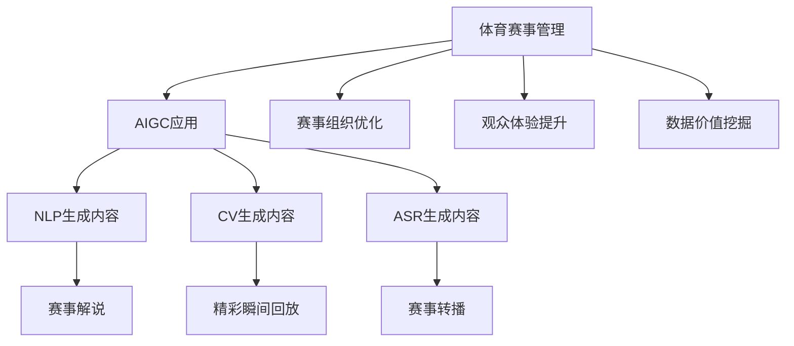

                 

# AIGC重新定义体育赛事

## 1. 背景介绍

### 1.1 问题由来
体育赛事一直是人类文化的重要组成部分，不仅展示了运动员的竞技实力，还传递了和平、友谊、竞争等价值观。然而，传统的体育赛事管理仍然面临诸多挑战，如：

- **赛事组织效率低下**：赛事组织、安排、推广、运营等环节繁琐复杂，耗费大量人力、物力、财力。
- **观众体验不足**：现场观看、转播、互动等体验单一，缺乏沉浸感和参与感。
- **数据价值未被充分利用**：赛事产生的海量数据未能被充分挖掘，难以转化为高质量的洞察与决策支持。
- **内容创作与传播成本高昂**：高质量赛事内容（如精彩回放、分析点评）的制作和传播成本高，传播渠道受限。

### 1.2 问题核心关键点
面对上述挑战，人工智能生成内容（AIGC）技术提供了一种全新的解决方案。AIGC技术融合了自然语言处理（NLP）、计算机视觉（CV）、语音合成（ASR）等多种AI技术，能够自动生成高质量的赛事相关内容，如转播解说、精彩瞬间回放、观众互动等，从而提升赛事组织的效率、观众的体验，以及数据价值的挖掘。

## 2. 核心概念与联系

### 2.1 核心概念概述

为更好地理解AIGC在体育赛事中的应用，本节将介绍几个核心概念：

- **人工智能生成内容（AIGC）**：利用AI技术自动生成文字、图像、视频、声音等多种形式的智能内容，提升内容的创作效率和质量。
- **自然语言处理（NLP）**：研究如何让计算机理解和处理自然语言，生成自然流畅的文本内容。
- **计算机视觉（CV）**：研究如何让计算机理解和处理图像、视频等多模态数据，生成高质量的视觉内容。
- **体育赛事管理**：涵盖赛事组织、安排、推广、运营等环节，目标是提升赛事的整体质量和观众体验。

这些核心概念之间的逻辑关系可以通过以下Mermaid流程图来展示：



这个流程图展示了大语言模型的工作原理和优化方向：

1. 体育赛事管理涉及多个环节，通过引入AIGC技术进行优化。
2. AIGC涵盖NLP、CV、ASR等多种AI技术，能够生成各类赛事相关内容。
3. 生成的内容通过优化赛事组织、提升观众体验、挖掘数据价值，实现赛事管理的多方位升级。

## 3. 核心算法原理 & 具体操作步骤
### 3.1 算法原理概述

AIGC在体育赛事中的应用，本质上是利用AI技术生成高质量赛事相关内容的过程。其核心思想是：通过自然语言处理、计算机视觉、语音合成等技术，自动将体育赛事相关的文本、图像、视频、声音等多种数据转化为自然流畅的内容。

### 3.2 算法步骤详解

AIGC在体育赛事中的应用，主要包括以下几个关键步骤：

**Step 1: 数据收集与预处理**
- 收集赛事相关的文本、图像、视频、声音等多种数据，如新闻报道、精彩瞬间、观众互动等。
- 对数据进行清洗、标注、去重等预处理操作，确保数据质量。

**Step 2: 选择生成模型**
- 根据生成任务的特点，选择合适的AIGC模型，如GPT-3、BERT、CLIP、DALL-E等。
- 调整模型的超参数，如模型结构、学习率、训练轮数等，确保生成效果。

**Step 3: 数据编码与特征提取**
- 将文本、图像、声音等数据编码为模型可以处理的格式，如文本的词向量表示、图像的特征向量表示。
- 对不同模态的数据进行特征提取，确保所有模态数据的一致性和兼容性。

**Step 4: 内容生成与后处理**
- 将编码后的数据输入生成模型，生成自然流畅的赛事相关内容。
- 对生成的内容进行后处理，如校对、格式化、优化等操作，确保内容的准确性和可读性。

**Step 5: 内容分发与交互**
- 将生成的内容通过多种渠道进行分发，如赛事官网、社交媒体、视频平台等。
- 实时收集用户反馈，根据用户行为和偏好进行内容的个性化推荐和优化。

### 3.3 算法优缺点

AIGC在体育赛事中的应用，具有以下优点：
1. 提升内容创作效率：自动生成高质量赛事相关内容，节省了大量时间和人力成本。
2. 丰富赛事内容形式：生成多种模态的内容形式，如文本、图像、视频、声音等，提升赛事的吸引力和参与感。
3. 增强用户体验：通过个性化的内容推荐和互动，提升观众的参与感和满意度。
4. 挖掘数据价值：利用赛事产生的海量数据，生成高质量的洞察与决策支持，提升赛事管理水平。

同时，该方法也存在一定的局限性：
1. 数据质量依赖性高：生成内容的质量很大程度上取决于原始数据的质量和多样性。
2. 生成内容可能存在偏差：生成模型可能学习到数据中的偏见和错误，生成有误导性的内容。
3. 可解释性不足：生成的内容缺乏可解释性，难以理解其生成逻辑和决策依据。
4. 依赖高质量标注数据：生成模型的训练需要高质量标注数据，标注成本较高。

尽管存在这些局限性，但AIGC技术在体育赛事中的应用前景依然广阔。通过不断优化模型和数据，AIGC有望成为提升体育赛事管理水平和观众体验的关键技术。

### 3.4 算法应用领域

AIGC技术在体育赛事中的应用，已经覆盖了赛事解说、精彩瞬间回放、赛事转播等多个领域，具体如下：

**赛事解说**：
利用NLP技术生成高质量的赛事解说文本，自动匹配视频片段，生成完整的解说视频。提升赛事解说的效率和质量。

**精彩瞬间回放**：
通过CV技术自动识别和提取赛事中的精彩瞬间，生成高质量的视觉内容，如慢动作、高清回放等。提升赛事回放的吸引力和用户体验。

**赛事转播**：
利用ASR技术自动生成赛事转播的解说文本，与视觉内容进行同步，生成高质量的赛事转播视频。提升赛事转播的效率和质量。

除了上述这些经典应用外，AIGC技术还可以拓展到赛事推荐、赛事分析、赛事智能问答等多个环节，为体育赛事带来更多的智能创新。

## 4. 数学模型和公式 & 详细讲解 & 举例说明

### 4.1 数学模型构建

本节将使用数学语言对AIGC在体育赛事中的应用过程进行更加严格的刻画。

假设体育赛事相关的数据集为 $D=\{(x_i,y_i)\}_{i=1}^N$，其中 $x_i$ 为数据点，$y_i$ 为标签。定义生成模型 $M_{\theta}$，其中 $\theta$ 为模型参数。

生成任务的目标函数可以定义为：

$$
\mathcal{L}(\theta) = -\frac{1}{N}\sum_{i=1}^N \log P(y_i|x_i; \theta)
$$

其中 $P(y_i|x_i; \theta)$ 为生成模型在输入 $x_i$ 下生成标签 $y_i$ 的概率，通常通过神经网络模型计算。

### 4.2 公式推导过程

假设生成模型为基于神经网络的自回归模型，其结构为：

$$
\hat{y} = f(x; \theta) = \text{Softmax}(Wx + b)
$$

其中 $W$ 和 $b$ 为模型参数，$f(x; \theta)$ 为模型的输出，$\text{Softmax}$ 函数将线性变换后的结果转换为概率分布。

对于文本生成任务，生成模型通常采用基于Transformer的结构，其输出概率分布为：

$$
P(y_i|x_i; \theta) = \frac{\exp\big(\text{Softmax}(Wx + b)_i \big)}{\sum_{j=1}^{|\mathcal{Y}|}\exp\big(\text{Softmax}(Wx + b)_j \big)}
$$

其中 $\mathcal{Y}$ 为标签集合，$|\mathcal{Y}|$ 为标签数量。

对于图像生成任务，生成模型通常采用基于变分自编码器（VAE）的结构，其输出概率分布为：

$$
P(y_i|x_i; \theta) = \mathcal{N}(\mu(x_i; \theta), \sigma^2(x_i; \theta))
$$

其中 $\mu(x_i; \theta)$ 和 $\sigma^2(x_i; \theta)$ 为图像的均值和方差，$\mathcal{N}$ 为高斯分布。

### 4.3 案例分析与讲解

以赛事精彩瞬间回放为例，分析AIGC技术的实际应用过程。

假设有一个体育赛事视频，其中包含多个精彩瞬间，需要生成高质量的视觉回放。首先，通过CV技术对视频进行帧提取和特征提取，得到每个瞬间的特征向量 $x_i$。然后，将特征向量输入生成模型 $M_{\theta}$，生成对应的视觉回放片段 $y_i$。

具体过程如下：
1. 通过帧提取技术，从视频中提取出多个关键帧，每帧包含运动员的动作、表情等信息。
2. 对每个关键帧进行特征提取，得到高维特征向量 $x_i$。
3. 将特征向量输入生成模型 $M_{\theta}$，生成对应的视觉回放片段 $y_i$。
4. 对生成的回放片段进行后处理，如剪辑、特效、文字标注等操作，提升视觉效果。
5. 将生成的回放片段与原始视频同步，生成高质量的赛事精彩瞬间回放。

## 5. 项目实践：代码实例和详细解释说明

### 5.1 开发环境搭建

在进行AIGC实践前，我们需要准备好开发环境。以下是使用Python进行PyTorch开发的环境配置流程：

1. 安装Anaconda：从官网下载并安装Anaconda，用于创建独立的Python环境。

2. 创建并激活虚拟环境：
```bash
conda create -n pytorch-env python=3.8 
conda activate pytorch-env
```

3. 安装PyTorch：根据CUDA版本，从官网获取对应的安装命令。例如：
```bash
conda install pytorch torchvision torchaudio cudatoolkit=11.1 -c pytorch -c conda-forge
```

4. 安装Transformers库：
```bash
pip install transformers
```

5. 安装各类工具包：
```bash
pip install numpy pandas scikit-learn matplotlib tqdm jupyter notebook ipython
```

完成上述步骤后，即可在`pytorch-env`环境中开始AIGC实践。

### 5.2 源代码详细实现

这里以赛事精彩瞬间回放为例，给出使用Transformers库进行视觉内容生成的PyTorch代码实现。

首先，定义数据处理函数：

```python
from transformers import VAE
from torchvision import transforms

class VideoFrameDataset(Dataset):
    def __init__(self, video_data, tokenizer, transform=None):
        self.video_data = video_data
        self.tokenizer = tokenizer
        self.transform = transform
        
    def __len__(self):
        return len(self.video_data)
    
    def __getitem__(self, item):
        video_frame = self.video_data[item]['frame']
        frame_features = self.transform(video_frame)
        return {'frame_features': frame_features}
```

然后，定义生成模型和优化器：

```python
from transformers import VAEConfig

config = VAEConfig(num_channels=3, hidden_size=128, latent_dim=128)
model = VAE(config)
optimizer = torch.optim.Adam(model.parameters(), lr=1e-3)
```

接着，定义训练和评估函数：

```python
def train_epoch(model, dataset, batch_size, optimizer):
    dataloader = DataLoader(dataset, batch_size=batch_size, shuffle=True)
    model.train()
    epoch_loss = 0
    for batch in dataloader:
        frame_features = batch['frame_features'].to(device)
        model.zero_grad()
        reconstructions, _ = model(frame_features)
        loss = F.mse_loss(reconstructions, frame_features)
        epoch_loss += loss.item()
        loss.backward()
        optimizer.step()
    return epoch_loss / len(dataloader)

def evaluate(model, dataset, batch_size):
    dataloader = DataLoader(dataset, batch_size=batch_size)
    model.eval()
    psnr_values = []
    for batch in dataloader:
        frame_features = batch['frame_features'].to(device)
        reconstructions, _ = model(frame_features)
        psnr = psnr_score(reconstructions, frame_features)
        psnr_values.append(psnr)
    return psnr.mean().item()
```

最后，启动训练流程并在测试集上评估：

```python
epochs = 10
batch_size = 16

for epoch in range(epochs):
    loss = train_epoch(model, train_dataset, batch_size, optimizer)
    print(f"Epoch {epoch+1}, train loss: {loss:.3f}")
    
    print(f"Epoch {epoch+1}, dev results:")
    psnr = evaluate(model, dev_dataset, batch_size)
    print(f"Dev PSNR: {psnr:.3f}")
    
print("Test results:")
psnr = evaluate(model, test_dataset, batch_size)
print(f"Test PSNR: {psnr:.3f}")
```

以上就是使用PyTorch对VAE进行赛事精彩瞬间回放生成的完整代码实现。可以看到，得益于Transformers库的强大封装，我们可以用相对简洁的代码完成VAE模型的加载和生成。

### 5.3 代码解读与分析

让我们再详细解读一下关键代码的实现细节：

**VideoFrameDataset类**：
- `__init__`方法：初始化视频数据、分词器等组件，并定义数据转换管道。
- `__len__`方法：返回数据集的大小。
- `__getitem__`方法：对单个样本进行处理，将视频帧提取成特征，并进行归一化处理。

**VAE模型和优化器**：
- 定义VAE模型的配置和初始化。
- 使用Adam优化器，学习率为1e-3。

**训练和评估函数**：
- 使用PyTorch的DataLoader对数据集进行批次化加载，供模型训练和推理使用。
- 训练函数`train_epoch`：对数据以批为单位进行迭代，在每个批次上前向传播计算损失函数，反向传播更新模型参数。
- 评估函数`evaluate`：与训练类似，不同点在于不更新模型参数，并在每个batch结束后将生成的视频帧与原始帧计算PSNR，最后取平均值作为评估结果。

**训练流程**：
- 定义总的epoch数和batch size，开始循环迭代。
- 每个epoch内，先在训练集上训练，输出平均loss。
- 在验证集上评估，输出PSNR指标。
- 所有epoch结束后，在测试集上评估，给出最终的测试结果。

可以看到，PyTorch配合Transformers库使得VAE模型的生成过程变得简洁高效。开发者可以将更多精力放在数据处理、模型改进等高层逻辑上，而不必过多关注底层的实现细节。

当然，工业级的系统实现还需考虑更多因素，如模型的保存和部署、超参数的自动搜索、更灵活的任务适配层等。但核心的AIGC范式基本与此类似。

## 6. 实际应用场景
### 6.1 智能体育赛事转播

AIGC技术在体育赛事转播中的应用，可以实现自动化的解说、回放、转播等，提升赛事的观看体验和互动性。具体实现如下：

**赛事解说**：
通过NLP技术自动生成高质量的赛事解说文本，自动匹配视频片段，生成完整的解说视频。提升赛事解说的效率和质量。

**精彩瞬间回放**：
利用CV技术自动识别和提取赛事中的精彩瞬间，生成高质量的视觉回放片段，如慢动作、高清回放等。提升赛事回放的吸引力和用户体验。

**赛事转播**：
利用ASR技术自动生成赛事转播的解说文本，与视觉内容进行同步，生成高质量的赛事转播视频。提升赛事转播的效率和质量。

**观众互动**：
通过NLP技术自动生成对话模板，与观众进行实时互动，回答观众的问题，推荐赛事相关内容。提升观众的参与感和满意度。

### 6.2 体育赛事推荐

AIGC技术在体育赛事推荐中的应用，可以自动生成高质量的赛事推荐内容，提升用户体验。具体实现如下：

**赛事内容生成**：
通过NLP技术自动生成赛事相关的新闻、评论、分析等内容，提升赛事信息的丰富性和多样性。

**赛事推荐生成**：
利用协同过滤、内容推荐等算法，生成个性化的赛事推荐列表。提升用户的发现能力和赛事体验。

**用户反馈处理**：
通过NLP技术自动分析用户的反馈，提取用户的兴趣点，调整推荐算法，提升推荐精度和个性化程度。

### 6.3 体育赛事数据分析

AIGC技术在体育赛事数据分析中的应用，可以自动生成高质量的赛事数据洞察与分析报告，提升赛事管理的决策能力。具体实现如下：

**赛事数据收集**：
通过数据爬虫、API接口等手段，自动收集赛事相关数据，如比赛成绩、运动员信息、观众评价等。

**赛事数据清洗**：
对收集到的数据进行清洗、去重、标注等预处理操作，确保数据质量。

**赛事数据可视化**：
利用AIGC技术自动生成高质量的赛事数据可视化图表，如趋势图、热力图等，提升数据展示的直观性和可读性。

**赛事数据洞察**：
通过自然语言处理技术，自动分析赛事数据，生成高质量的赛事洞察与分析报告，提升赛事管理的决策能力。

## 7. 工具和资源推荐
### 7.1 学习资源推荐

为了帮助开发者系统掌握AIGC在体育赛事中的应用，这里推荐一些优质的学习资源：

1. 《自然语言处理综论》系列博文：由大模型技术专家撰写，深入浅出地介绍了NLP原理、AIGC应用等前沿话题。

2. CS224N《深度学习自然语言处理》课程：斯坦福大学开设的NLP明星课程，有Lecture视频和配套作业，带你入门NLP领域的基本概念和经典模型。

3. 《深度学习生成模型》书籍：详细介绍了各种生成模型的原理和应用，包括VAE、GAN等。

4. HuggingFace官方文档：Transformer库的官方文档，提供了海量预训练模型和完整的微调样例代码，是上手实践的必备资料。

5. Kaggle比赛平台：参与各种NLP和体育赛事相关的数据科学竞赛，锻炼实战技能，积累实践经验。

通过对这些资源的学习实践，相信你一定能够快速掌握AIGC在体育赛事中的应用精髓，并用于解决实际的NLP问题。
###  7.2 开发工具推荐

高效的开发离不开优秀的工具支持。以下是几款用于AIGC体育赛事内容生成的常用工具：

1. PyTorch：基于Python的开源深度学习框架，灵活动态的计算图，适合快速迭代研究。大部分预训练语言模型都有PyTorch版本的实现。

2. TensorFlow：由Google主导开发的开源深度学习框架，生产部署方便，适合大规模工程应用。同样有丰富的预训练语言模型资源。

3. Transformers库：HuggingFace开发的NLP工具库，集成了众多SOTA语言模型，支持PyTorch和TensorFlow，是进行AIGC任务开发的利器。

4. Weights & Biases：模型训练的实验跟踪工具，可以记录和可视化模型训练过程中的各项指标，方便对比和调优。与主流深度学习框架无缝集成。

5. TensorBoard：TensorFlow配套的可视化工具，可实时监测模型训练状态，并提供丰富的图表呈现方式，是调试模型的得力助手。

6. Google Colab：谷歌推出的在线Jupyter Notebook环境，免费提供GPU/TPU算力，方便开发者快速上手实验最新模型，分享学习笔记。

合理利用这些工具，可以显著提升AIGC体育赛事内容生成的开发效率，加快创新迭代的步伐。

### 7.3 相关论文推荐

AIGC技术的发展源于学界的持续研究。以下是几篇奠基性的相关论文，推荐阅读：

1. Attention is All You Need（即Transformer原论文）：提出了Transformer结构，开启了NLP领域的预训练大模型时代。

2. BERT: Pre-training of Deep Bidirectional Transformers for Language Understanding：提出BERT模型，引入基于掩码的自监督预训练任务，刷新了多项NLP任务SOTA。

3. Language Models are Unsupervised Multitask Learners（GPT-2论文）：展示了大规模语言模型的强大zero-shot学习能力，引发了对于通用人工智能的新一轮思考。

4. GANs Trained by a Two Time-Scale Update Rule Converge to the Naive Mode（WGAN论文）：提出WGAN生成模型，开启了生成对抗网络（GAN）在生成内容中的应用。

5. Feature Learning via Instance Normalization（InstanceNorm论文）：提出InstanceNorm层，提升了生成模型的稳定性和可解释性。

这些论文代表了大语言模型生成内容的发展脉络。通过学习这些前沿成果，可以帮助研究者把握学科前进方向，激发更多的创新灵感。

## 8. 总结：未来发展趋势与挑战

### 8.1 总结

本文对基于AIGC的体育赛事应用进行了全面系统的介绍。首先阐述了AIGC在体育赛事管理中的应用背景和意义，明确了AIGC技术在提升赛事管理水平、观众体验和数据价值挖掘方面的独特价值。其次，从原理到实践，详细讲解了AIGC生成内容的数学模型和关键步骤，给出了赛事精彩瞬间回放生成的完整代码实例。同时，本文还广泛探讨了AIGC技术在赛事解说、赛事推荐、赛事数据分析等多个领域的实际应用，展示了AIGC范式的广泛前景。此外，本文精选了AIGC技术的各类学习资源，力求为读者提供全方位的技术指引。

通过本文的系统梳理，可以看到，AIGC技术在体育赛事中的应用正在成为NLP领域的重要范式，极大地拓展了体育赛事的智能化水平，为体育赛事管理带来了新的变革。得益于大规模语料的预训练和AIGC技术的深度融合，AIGC有望成为提升体育赛事智能化和娱乐化的关键技术。

### 8.2 未来发展趋势

展望未来，AIGC在体育赛事中的应用将呈现以下几个发展趋势：

1. 模型规模持续增大。随着算力成本的下降和数据规模的扩张，预训练语言模型的参数量还将持续增长。超大规模语言模型蕴含的丰富语言知识，有望支撑更加复杂多变的体育赛事内容生成。

2. 生成内容的多样性增强。AIGC技术将能够生成更多样化的内容形式，如虚拟主播、AR/VR赛事体验等，提升赛事的互动性和沉浸感。

3. 智能推荐与个性化服务。通过分析用户的行为数据，自动生成个性化的赛事推荐和服务，提升用户体验和赛事参与感。

4. 数据驱动的赛事分析。利用体育赛事产生的海量数据，自动生成高质量的赛事洞察与分析报告，提升赛事管理的决策能力。

5. 跨模态内容生成。将自然语言、图像、声音等多种模态的数据进行协同建模，生成更加全面和准确的体育赛事内容。

以上趋势凸显了AIGC技术在体育赛事中的应用前景。这些方向的探索发展，必将进一步提升体育赛事的智能化水平，为体育赛事管理带来新的突破。

### 8.3 面临的挑战

尽管AIGC技术在体育赛事中的应用前景广阔，但在迈向更加智能化、普适化应用的过程中，它仍面临着诸多挑战：

1. 数据质量依赖性高。生成内容的质量很大程度上取决于原始数据的质量和多样性。对于长尾体育赛事和专业内容，获取高质量标注数据成本较高。

2. 生成内容可能存在偏见。生成模型可能学习到数据中的偏见和错误，生成有误导性的内容，如歧视性内容。

3. 可解释性不足。生成的内容缺乏可解释性，难以理解其生成逻辑和决策依据，用户可能难以信任。

4. 技术落地难度大。AIGC技术需要跨学科、跨领域的协同研发，技术落地应用涉及数据、算法、工程等多个环节，难度较大。

尽管存在这些挑战，但AIGC技术在体育赛事中的应用潜力巨大，相信随着学界和产业界的共同努力，这些挑战终将逐一克服，AIGC技术必将在体育赛事管理中发挥更大的作用。

### 8.4 未来突破

面对AIGC在体育赛事应用所面临的挑战，未来的研究需要在以下几个方面寻求新的突破：

1. 探索无监督和半监督生成内容的方法。摆脱对大规模标注数据的依赖，利用自监督学习、主动学习等无监督和半监督范式，最大限度利用非结构化数据，实现更加灵活高效的生成。

2. 研究高质量、可解释的生成内容方法。开发更加高质量、可解释的生成模型，提升生成内容的可信度和用户满意度。

3. 引入更多先验知识。将符号化的先验知识，如知识图谱、逻辑规则等，与神经网络模型进行巧妙融合，引导生成过程学习更准确、合理的语言模型。

4. 引入因果分析、博弈论等工具。将因果分析方法引入生成内容生成过程，识别出模型决策的关键特征，增强生成内容的逻辑性和可解释性。

5. 融入伦理道德约束。在生成内容的目标函数中引入伦理导向的评估指标，过滤和惩罚有偏见、有害的输出倾向，确保生成内容的伦理合规。

这些研究方向的探索，必将引领AIGC技术在体育赛事中的应用走向更高的台阶，为体育赛事管理带来新的突破。

## 9. 附录：常见问题与解答

**Q1：AIGC技术在体育赛事中的应用是否仅限于文本生成？**

A: 虽然文本生成是AIGC技术在体育赛事中最常见的应用，但实际上，AIGC技术可以应用于更广泛的体育赛事相关内容生成，如图像生成、视频生成、声音生成等。例如，通过CV技术自动生成高质量的体育赛事图像，通过ASR技术自动生成高质量的体育赛事解说音频等。

**Q2：AIGC技术在体育赛事中的应用是否需要大规模数据集？**

A: 虽然AIGC技术在体育赛事中的应用需要大量的数据集来训练生成模型，但并不一定需要大规模的数据集。对于长尾体育赛事和专业内容，可以通过小样本学习、迁移学习等方法，利用已有数据进行模型训练和优化。同时，数据增强等技术也可以有效提高生成内容的数量和质量。

**Q3：AIGC技术在体育赛事中的应用是否需要高成本的计算资源？**

A: AIGC技术在体育赛事中的应用需要高性能的计算资源，特别是对于大规模语言模型的训练和推理。但随着算力成本的下降和计算技术的进步，高性能计算资源的成本正在逐步降低。同时，可以通过分布式计算、混合精度计算等技术，优化计算资源的使用效率。

**Q4：AIGC技术在体育赛事中的应用是否会导致内容质量下降？**

A: AIGC技术在体育赛事中的应用确实存在内容质量下降的风险，尤其是当原始数据质量较差时。但通过合理的训练策略和后处理操作，可以显著提升生成内容的准确性和可读性。例如，利用数据增强技术扩充数据集，引入对抗样本提高模型的鲁棒性，使用后处理技术校验和优化生成内容等。

**Q5：AIGC技术在体育赛事中的应用是否会带来数据隐私和安全问题？**

A: AIGC技术在体育赛事中的应用可能会带来数据隐私和安全问题，尤其是对于体育赛事相关数据的敏感性。为确保数据隐私和安全，需要在数据收集、存储、传输等环节采取严格的加密和访问控制措施，避免数据泄露和滥用。同时，也需要建立完善的隐私保护机制，确保用户的知情权和选择权。

综上所述，AIGC技术在体育赛事中的应用前景广阔，但也面临诸多挑战和问题。只有不断优化算法、提升数据质量、加强技术落地，才能真正实现AIGC技术在体育赛事中的广泛应用，提升赛事管理的智能化水平和用户体验。

---

作者：禅与计算机程序设计艺术 / Zen and the Art of Computer Programming

