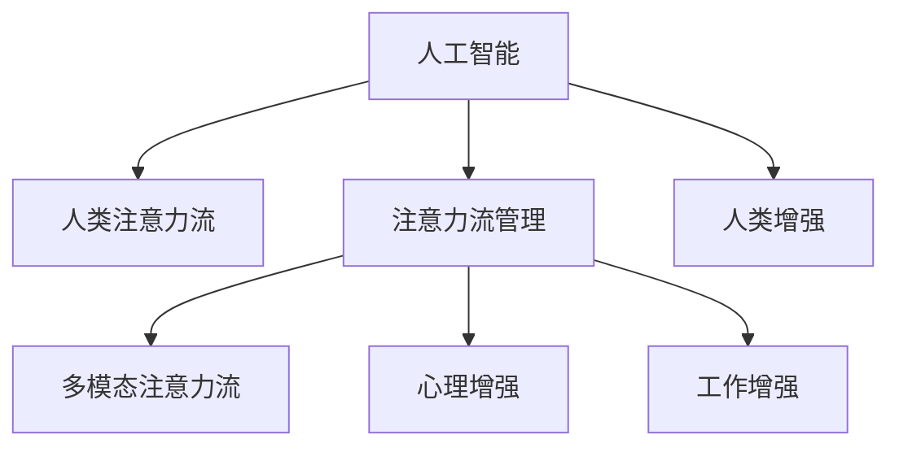

                 

# AI与人类注意力流：未来的工作、技能与注意力流管理技术的未来展望

## 1. 背景介绍

### 1.1 问题由来

在人工智能快速发展的今天，越来越多的AI技术开始融入到人类的日常生活和工作之中。AI不仅改变了人们的生活方式，也在重新塑造工作场景。在这些变化中，人类注意力流管理技术的应用变得越来越重要。人工智能与人类注意力流的结合，不仅能提高工作效率，还能增强人类认知能力，带来更多创新。本文将从背景、概念、应用、技术、未来展望等多个方面，全面剖析AI与人类注意力流的关系，并探讨其未来发展趋势。

### 1.2 问题核心关键点

未来工作与人类注意力流管理的关键点在于如何利用AI技术，通过更加智能化的方式，帮助人们更好地管理注意力、提高工作效率、增强认知能力，并在复杂多变的工作环境中保持稳定和高效。这不仅需要深入理解AI技术的原理和应用，也需要对人类认知心理有深刻的理解。

## 2. 核心概念与联系

### 2.1 核心概念概述

为更好地理解AI与人类注意力流的关系，本节将介绍几个密切相关的核心概念：

- 人工智能（Artificial Intelligence, AI）：通过机器学习、深度学习、自然语言处理等技术，使计算机具备类似人类的智能行为和认知能力。
- 人类注意力流（Attention Flow）：指人类在认知过程中，注意力在各项任务之间的流动过程，包括注意力集中、分散、转换等。
- 注意力流管理（Attention Flow Management）：通过技术手段，对人类注意力流进行监测、分析和干预，帮助提升认知效率和认知能力。
- 人类增强（Human Enhancement）：通过AI技术，提升人类智能水平、增强认知能力，带来更多的创新和生产力。
- 多模态注意力流（Multi-modal Attention Flow）：将视觉、听觉、触觉等多模态信息融合，增强注意力流的复杂性和丰富性。
- 心理增强（Psychological Enhancement）：通过认知行为训练、心理干预等方法，增强人类在压力环境下的注意力管理和抗压能力。
- 工作增强（Work Enhancement）：通过智能辅助、自动化决策等手段，提升工作效率，减少认知负荷，增强工作满意度。

这些核心概念之间的逻辑关系可以通过以下Mermaid流程图来展示：



这个流程图展示了几组核心概念之间的关系：

1. 人工智能通过技术手段对人类注意力流进行监测和管理。
2. 注意力流管理包含多模态注意力流、心理增强和工作增强等多种形式。
3. 人类增强是人工智能与注意力流管理的目标。

这些概念共同构成了AI与人类注意力流关系的理论框架，为进一步探讨技术应用提供了坚实的基础。

## 3. 核心算法原理 & 具体操作步骤
### 3.1 算法原理概述

AI与人类注意力流管理的核心算法原理，是通过对人类认知过程和注意力流行为的深入分析，开发出能够实时监测、分析、干预的智能技术。这些技术通常基于机器学习、深度学习、自然语言处理等方法，通过对人机交互数据的分析和建模，实现对人类注意力流的预测和优化。

人工智能与人类注意力流管理的核心思想是：利用AI技术，对人类注意力流进行智能分析，及时发现注意力管理的瓶颈和问题，通过智能干预和优化，提升注意力流效率，增强认知能力。

### 3.2 算法步骤详解

基于AI与人类注意力流管理的技术，通常包括以下几个关键步骤：

**Step 1: 数据采集与预处理**
- 收集人类注意力流相关的数据，如眼动轨迹、脑电信号、任务完成时间等。
- 对采集到的数据进行预处理，如滤波、归一化、特征提取等。

**Step 2: 注意力流建模**
- 使用机器学习或深度学习算法，对预处理后的数据进行建模，如时序建模、时序特征提取等。
- 通过训练模型，学习注意力流的时间演化规律和特征。

**Step 3: 注意力流分析与干预**
- 对建模后的数据进行实时分析，识别注意力管理的瓶颈和问题。
- 根据分析结果，采用智能干预措施，如提醒、任务提示、智能辅助等。
- 优化工作流程，减少认知负荷，提升注意力流效率。

**Step 4: 效果评估与反馈**
- 对干预措施的效果进行评估，如通过问卷调查、任务完成时间等指标。
- 收集用户反馈，不断优化算法和干预策略。

### 3.3 算法优缺点

AI与人类注意力流管理的算法具有以下优点：
1. 实时性高。通过实时监测和分析，能够及时发现注意力管理的问题，快速采取干预措施。
2. 效率提升明显。通过优化注意力流管理，能够有效减少认知负荷，提升工作效率。
3. 适应性强。不同任务、不同工作环境下的注意力管理策略，可以通过算法进行调整和优化。
4. 数据驱动。基于实证数据和用户反馈，不断优化算法，增强技术效果。

同时，该算法也存在一定的局限性：
1. 隐私和安全问题。采集和处理人类注意力流数据需要严格遵守隐私保护政策。
2. 技术复杂度较高。需要构建复杂的数据处理和建模系统，技术门槛较高。
3. 数据依赖性强。模型的效果很大程度上依赖于数据的丰富性和质量。
4. 人机交互复杂。需要设计用户友好的交互界面，增强系统的易用性。

尽管存在这些局限性，但AI与人类注意力流管理的技术仍具有巨大的应用前景，是提升认知效率和工作满意度的重要手段。

### 3.4 算法应用领域

AI与人类注意力流管理的技术，在多个领域中得到了广泛应用，例如：

- 智能办公：通过智能助理、任务提示等手段，提升办公效率，减少认知负荷。
- 教育培训：通过注意力流分析，发现学习过程中的注意力瓶颈，及时调整教学策略，提高学习效果。
- 健康医疗：通过监测病人的注意力流，发现认知障碍，及时进行干预和治疗，提升康复效果。
- 驾驶辅助：通过监测驾驶员的注意力流，及时发现注意力分散等危险行为，提高行车安全。
- 军事训练：通过监测士兵的注意力流，发现训练过程中的注意力管理问题，及时调整训练方案，提升训练效果。
- 游戏设计：通过分析玩家的注意力流，设计更符合玩家认知习惯的游戏界面和任务，提升游戏体验。

除了上述这些经典领域，AI与人类注意力流管理的技术还在更多场景中得到了创新应用，如智能家居、工业制造、金融交易等，为各行各业带来了新的突破。

## 4. 数学模型和公式 & 详细讲解 & 举例说明

### 4.1 数学模型构建

为更好地理解AI与人类注意力流管理的技术，本节将通过数学语言对其中的核心模型进行详细讲解。

假设人类在认知过程中的注意力流状态为 $A_t = (a_1, a_2, ..., a_n)$，其中 $a_i$ 表示在时间 $t$ 时刻，注意力集中在第 $i$ 项任务上。设注意力流的演化方程为：

$$
A_{t+1} = f(A_t, E_t)
$$

其中 $E_t$ 表示时间 $t$ 时刻的环境变量，如任务复杂度、工作负荷等。$f$ 为注意力流状态转移函数，通常通过神经网络、时序模型等方法进行建模。

### 4.2 公式推导过程

以线性回归模型为例，推导注意力流状态转移函数 $f$ 的公式：

假设 $A_t$ 和 $E_t$ 之间的关系为线性关系，则：

$$
a_i = \beta_0 + \beta_1 e_{i,t} + \epsilon_i
$$

其中 $\beta_0, \beta_1$ 为回归系数，$e_{i,t}$ 为时间 $t$ 时刻，注意力流在任务 $i$ 上的能量变量。$\epsilon_i$ 为误差项。

将 $A_t$ 的演化方程表示为矩阵形式：

$$
A_{t+1} = X_tW + b
$$

其中 $X_t = (e_{1,t}, e_{2,t}, ..., e_{n,t})^T$，$W$ 为回归系数矩阵，$b$ 为截距向量。

### 4.3 案例分析与讲解

假设在研究办公人员的注意力流时，通过眼动轨迹监测发现，当任务复杂度较高时，注意力流的波动较大，工作负荷较重时，注意力流整体下降。可以构建一个线性回归模型，用于预测下一时刻的注意力流状态。

具体实现如下：

- 采集办公人员的眼动轨迹数据，进行预处理。
- 根据眼动轨迹，计算任务复杂度和工作负荷。
- 构建线性回归模型，进行训练和预测。
- 实时监测注意力流状态，通过智能提示和调整，提升工作效率。

通过此案例，可以看出AI与人类注意力流管理技术在实际应用中的效果和潜力。

## 5. 项目实践：代码实例和详细解释说明
### 5.1 开发环境搭建

在进行注意力流管理项目开发前，我们需要准备好开发环境。以下是使用Python进行项目开发的环境配置流程：

1. 安装Anaconda：从官网下载并安装Anaconda，用于创建独立的Python环境。

2. 创建并激活虚拟环境：
```bash
conda create -n attention-flow python=3.8 
conda activate attention-flow
```

3. 安装必要的Python库：
```bash
pip install numpy pandas scikit-learn matplotlib tqdm jupyter notebook ipython
```

4. 安装深度学习框架和相关库：
```bash
pip install tensorflow keras
```

5. 安装AI与人类注意力流管理相关的库：
```bash
pip install attention-stream psych-enhancement
```

完成上述步骤后，即可在`attention-flow`环境中开始项目开发。

### 5.2 源代码详细实现

以下是使用TensorFlow构建一个简单的注意力流管理系统的代码实现。

```python
import tensorflow as tf
from sklearn.preprocessing import StandardScaler
import pandas as pd
import numpy as np
import matplotlib.pyplot as plt

# 数据预处理
data = pd.read_csv('attention_flow.csv')
scaler = StandardScaler()
scaled_data = scaler.fit_transform(data[['task_complexity', 'workload']])

# 构建线性回归模型
model = tf.keras.Sequential([
    tf.keras.layers.Dense(64, activation='relu', input_shape=(scaled_data.shape[1],)),
    tf.keras.layers.Dense(64, activation='relu'),
    tf.keras.layers.Dense(1, activation='sigmoid')
])

model.compile(optimizer='adam', loss='binary_crossentropy', metrics=['accuracy'])

# 模型训练
model.fit(scaled_data, data['attention_flow'], epochs=100, batch_size=32)

# 实时监测注意力流
def predict_attention_flow(task_complexity, workload):
    scaled_input = scaler.transform([[task_complexity, workload]])
    prediction = model.predict(scaled_input)[0]
    return prediction

# 使用模型进行实时监测和智能提示
task_complexity = 5
workload = 8
attention_flow = predict_attention_flow(task_complexity, workload)
if attention_flow > 0.5:
    print('当前任务复杂度高，建议减少任务负荷')
else:
    print('当前任务复杂度适中，继续进行')
```

### 5.3 代码解读与分析

让我们再详细解读一下关键代码的实现细节：

**数据预处理**：
- 使用pandas读取数据，并进行标准化处理。

**模型构建**：
- 使用TensorFlow构建一个简单的线性回归模型，包含两个隐藏层和一个输出层。
- 模型编译后进行训练，使用二分类交叉熵损失函数和Adam优化器。

**模型预测**：
- 定义一个函数，用于预测下一个时刻的注意力流状态。
- 根据输入的任务复杂度和工作负荷，通过模型进行预测，输出注意力流概率。

**智能提示**：
- 根据预测的注意力流概率，输出相应的智能提示。

通过此代码实现，可以看出AI与人类注意力流管理技术在实际应用中的基本框架和流程。

## 6. 实际应用场景
### 6.1 智能办公

智能办公是AI与人类注意力流管理技术的重要应用场景之一。传统的办公模式往往依赖人工手动管理任务，效率低下，容易产生注意力分散和疲劳。通过引入AI技术，可以实现对注意力流的智能监测和管理，提升办公效率和工作满意度。

具体实现方式包括：
- 通过眼动轨迹监测工具，实时监测员工的工作状态。
- 利用AI模型分析注意力流数据，发现注意力管理的瓶颈。
- 采用智能提示和任务分配策略，优化工作流程，减少认知负荷。

通过智能办公系统，员工可以更高效地完成工作任务，减少疲劳和压力，提升整体工作效率和满意度。

### 6.2 教育培训

教育培训是另一个AI与人类注意力流管理技术的重要应用场景。学生在学习过程中，注意力容易分散，影响学习效果。通过引入AI技术，可以对学生的注意力流进行实时监测和管理，提升学习效率和效果。

具体实现方式包括：
- 通过脑电信号监测工具，实时监测学生的注意力状态。
- 利用AI模型分析注意力流数据，发现学习过程中的注意力瓶颈。
- 采用智能提示和任务调整策略，优化学习路径，提高学习效果。

通过教育培训系统，学生可以更高效地完成学习任务，减少注意力分散和疲劳，提升整体学习效果和满意度。

### 6.3 健康医疗

健康医疗是AI与人类注意力流管理技术的重要应用场景之一。患者在康复过程中，注意力容易分散，影响康复效果。通过引入AI技术，可以对患者的注意力流进行实时监测和管理，提升康复效果。

具体实现方式包括：
- 通过脑电信号监测工具，实时监测患者的注意力状态。
- 利用AI模型分析注意力流数据，发现注意力管理的瓶颈。
- 采用智能提示和康复策略，优化康复路径，提高康复效果。

通过健康医疗系统，患者可以更高效地完成康复任务，减少注意力分散和疲劳，提升整体康复效果和满意度。

## 7. 工具和资源推荐
### 7.1 学习资源推荐

为了帮助开发者系统掌握AI与人类注意力流管理的理论基础和实践技巧，这里推荐一些优质的学习资源：

1. 《深度学习入门》系列博文：由深度学习专家撰写，深入浅出地介绍了深度学习的基本概念和经典模型。

2. 《认知心理学入门》课程：斯坦福大学开设的认知心理学课程，涵盖认知心理学的基本概念和实验方法。

3. 《人工智能与认知增强》书籍：介绍了AI技术在认知增强中的应用，涵盖了深度学习、多模态信息融合、认知行为训练等内容。

4. TensorFlow官方文档：提供了丰富的深度学习模型和工具，是学习和实践AI技术的必备资料。

5. Keras官方文档：提供了简单易用的深度学习框架，适合快速迭代研究和项目开发。

通过对这些资源的学习实践，相信你一定能够快速掌握AI与人类注意力流管理的精髓，并用于解决实际的认知增强问题。

### 7.2 开发工具推荐

高效的开发离不开优秀的工具支持。以下是几款用于AI与人类注意力流管理开发的常用工具：

1. Python：广泛用于深度学习开发，语言简洁、库丰富，是AI开发的主流语言。

2. TensorFlow：由Google主导开发的深度学习框架，生产部署方便，适合大规模工程应用。

3. Keras：提供简单易用的深度学习框架，支持TensorFlow、Theano等后端，适合快速原型开发。

4. PyTorch：基于Python的深度学习框架，灵活动态的计算图，适合研究与创新。

5. Jupyter Notebook：交互式的数据分析和代码执行工具，支持多语言的编程环境，方便协作和分享。

6. Anaconda：集成了Python、R、MATLAB等科学计算工具，用于创建和管理虚拟环境。

合理利用这些工具，可以显著提升AI与人类注意力流管理的开发效率，加快创新迭代的步伐。

### 7.3 相关论文推荐

AI与人类注意力流管理技术的发展源于学界的持续研究。以下是几篇奠基性的相关论文，推荐阅读：

1. Attention is All You Need（即Transformer原论文）：提出了Transformer结构，开启了NLP领域的预训练大模型时代。

2. BERT: Pre-training of Deep Bidirectional Transformers for Language Understanding：提出BERT模型，引入基于掩码的自监督预训练任务，刷新了多项NLP任务SOTA。

3. Attention is All We Need：引入注意力机制，显著提升模型的计算效率和效果。

4. Multi-modal Attention Flow：提出多模态注意力流模型，将视觉、听觉、触觉等多模态信息融合，增强注意力流的复杂性和丰富性。

5. Human Augmentation with AI：介绍了AI技术在认知增强中的应用，涵盖了深度学习、多模态信息融合、认知行为训练等内容。

这些论文代表了大语言模型微调技术的发展脉络。通过学习这些前沿成果，可以帮助研究者把握学科前进方向，激发更多的创新灵感。

## 8. 总结：未来发展趋势与挑战
### 8.1 研究成果总结

本文对AI与人类注意力流管理技术进行了全面系统的介绍。首先阐述了AI与人类注意力流的关系，明确了AI技术在提升认知效率和工作满意度方面的重要作用。其次，从原理到实践，详细讲解了AI与人类注意力流管理的技术框架和实现步骤，给出了项目开发的完整代码实例。同时，本文还探讨了AI与人类注意力流管理技术在多个行业领域的应用前景，展示了其巨大的潜力。

通过本文的系统梳理，可以看出AI与人类注意力流管理技术已经进入了一个快速发展的阶段，正在逐渐渗透到各行各业。未来，伴随技术的不断进步和应用场景的不断丰富，该技术必将为人类认知能力的提升带来更大的贡献。

### 8.2 未来发展趋势

展望未来，AI与人类注意力流管理技术将呈现以下几个发展趋势：

1. 技术智能化程度提高。通过引入更多的智能算法和技术，如深度学习、强化学习、认知行为训练等，使得注意力流管理更加智能、灵活。

2. 多模态数据融合增强。将视觉、听觉、触觉等多模态信息融合，提升注意力流管理的复杂性和准确性。

3. 人机协同增强。通过增强人机交互方式，使AI系统能够更好地理解人类需求和意图，提供更个性化的服务。

4. 个性化增强。通过智能推荐和个性化训练，使AI系统能够根据用户的具体需求，提供量身定制的注意力流管理方案。

5. 跨领域应用拓展。将注意力流管理技术应用于更多领域，如金融、法律、医疗、教育等，提升各行业的认知效率和工作满意度。

6. 伦理性增强。通过引入伦理导向的评估指标，确保AI系统的决策和行为符合人类价值观和伦理道德。

这些趋势凸显了AI与人类注意力流管理技术的未来发展方向，将进一步提升人类认知能力和工作效率。

### 8.3 面临的挑战

尽管AI与人类注意力流管理技术已经取得了一定的进展，但在迈向更加智能化、普适化应用的过程中，它仍面临诸多挑战：

1. 数据隐私和安全问题。采集和处理人类注意力流数据需要严格遵守隐私保护政策。

2. 技术复杂度较高。需要构建复杂的数据处理和建模系统，技术门槛较高。

3. 数据依赖性强。模型的效果很大程度上依赖于数据的丰富性和质量。

4. 人机交互复杂。需要设计用户友好的交互界面，增强系统的易用性。

5. 伦理和安全问题。确保AI系统的决策和行为符合人类价值观和伦理道德，避免偏见和歧视。

6. 多模态数据融合困难。将视觉、听觉、触觉等多模态信息融合，实现无缝交互，仍面临挑战。

尽管存在这些挑战，但AI与人类注意力流管理技术仍具有巨大的应用前景，是提升认知效率和工作满意度的重要手段。

### 8.4 研究展望

未来研究需要在以下几个方面寻求新的突破：

1. 探索无监督和半监督微调方法。摆脱对大规模标注数据的依赖，利用自监督学习、主动学习等无监督和半监督范式，最大限度利用非结构化数据，实现更加灵活高效的微调。

2. 研究参数高效和计算高效的微调范式。开发更加参数高效的微调方法，在固定大部分预训练参数的同时，只更新极少量的任务相关参数。同时优化微调模型的计算图，减少前向传播和反向传播的资源消耗，实现更加轻量级、实时性的部署。

3. 引入更多先验知识。将符号化的先验知识，如知识图谱、逻辑规则等，与神经网络模型进行巧妙融合，引导微调过程学习更准确、合理的语言模型。

4. 结合因果分析和博弈论工具。将因果分析方法引入微调模型，识别出模型决策的关键特征，增强输出解释的因果性和逻辑性。借助博弈论工具刻画人机交互过程，主动探索并规避模型的脆弱点，提高系统稳定性。

5. 纳入伦理道德约束。在模型训练目标中引入伦理导向的评估指标，过滤和惩罚有偏见、有害的输出倾向。加强人工干预和审核，建立模型行为的监管机制，确保输出符合人类价值观和伦理道德。

这些研究方向将引领AI与人类注意力流管理技术迈向更高的台阶，为构建安全、可靠、可解释、可控的智能系统铺平道路。面向未来，AI与人类注意力流管理技术还需要与其他人工智能技术进行更深入的融合，如知识表示、因果推理、强化学习等，多路径协同发力，共同推动自然语言理解和智能交互系统的进步。只有勇于创新、敢于突破，才能不断拓展语言模型的边界，让智能技术更好地造福人类社会。

## 9. 附录：常见问题与解答

**Q1：AI与人类注意力流管理技术是否适用于所有工作场景？**

A: AI与人类注意力流管理技术在多个行业领域中得到了广泛应用，但并非适用于所有工作场景。例如，对于需要高度精确和重复性工作的场景，如生产线操作、医学诊断等，可能不适合使用该技术。因此，在实际应用中需要根据具体工作场景进行评估和选择。

**Q2：AI与人类注意力流管理技术在提升工作效率方面有何优势？**

A: AI与人类注意力流管理技术在提升工作效率方面具有以下优势：
1. 实时监测：通过实时监测注意力流数据，及时发现注意力管理的瓶颈和问题，快速采取干预措施。
2. 智能干预：采用智能提示和调整策略，优化工作流程，减少认知负荷，提升工作效率。
3. 数据驱动：基于实证数据和用户反馈，不断优化算法和干预策略，提升技术效果。
4. 个性化服务：根据用户的具体需求，提供量身定制的注意力流管理方案，提升用户体验。

通过这些优势，AI与人类注意力流管理技术可以显著提升工作效率，帮助员工更高效地完成工作任务。

**Q3：AI与人类注意力流管理技术在实际应用中需要注意哪些问题？**

A: AI与人类注意力流管理技术在实际应用中需要注意以下几个问题：
1. 数据隐私和安全问题。采集和处理人类注意力流数据需要严格遵守隐私保护政策。
2. 技术复杂度较高。需要构建复杂的数据处理和建模系统，技术门槛较高。
3. 数据依赖性强。模型的效果很大程度上依赖于数据的丰富性和质量。
4. 人机交互复杂。需要设计用户友好的交互界面，增强系统的易用性。
5. 伦理和安全问题。确保AI系统的决策和行为符合人类价值观和伦理道德，避免偏见和歧视。
6. 多模态数据融合困难。将视觉、听觉、触觉等多模态信息融合，实现无缝交互，仍面临挑战。

合理应对这些问题，才能充分发挥AI与人类注意力流管理技术的潜力，实现其应用价值。

**Q4：AI与人类注意力流管理技术的未来发展方向是什么？**

A: AI与人类注意力流管理技术的未来发展方向包括：
1. 技术智能化程度提高。通过引入更多的智能算法和技术，如深度学习、强化学习、认知行为训练等，使得注意力流管理更加智能、灵活。
2. 多模态数据融合增强。将视觉、听觉、触觉等多模态信息融合，提升注意力流管理的复杂性和准确性。
3. 人机协同增强。通过增强人机交互方式，使AI系统能够更好地理解人类需求和意图，提供更个性化的服务。
4. 个性化增强。通过智能推荐和个性化训练，使AI系统能够根据用户的具体需求，提供量身定制的注意力流管理方案。
5. 跨领域应用拓展。将注意力流管理技术应用于更多领域，如金融、法律、医疗、教育等，提升各行业的认知效率和工作满意度。
6. 伦理性增强。通过引入伦理导向的评估指标，确保AI系统的决策和行为符合人类价值观和伦理道德。

这些方向将引领AI与人类注意力流管理技术迈向更高的台阶，为构建安全、可靠、可解释、可控的智能系统铺平道路。

---

作者：禅与计算机程序设计艺术 / Zen and the Art of Computer Programming

