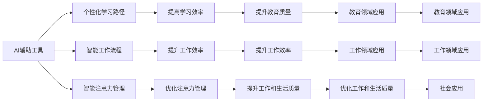

                 

## 1. 背景介绍

### 1.1 问题由来

随着人工智能技术的飞速发展，AI在教育、工作和注意力管理等领域的应用越来越广泛。AI不仅能够提高效率，优化资源配置，还能帮助人类更好地理解和管理注意力流。然而，如何有效地利用AI，使AI与人类注意力流和谐共存，仍是一个值得深入探讨的问题。

### 1.2 问题核心关键点

AI与人类注意力流的关系主要体现在以下几个方面：

1. **教育领域**：AI辅助学习工具能够帮助学生更好地理解学习内容，通过个性化的学习路径提高学习效率。
2. **工作领域**：AI能够帮助员工更高效地处理工作任务，通过智能化的工作流程提升工作效率。
3. **注意力管理**：AI能够帮助人类管理注意力，通过智能化的注意力分配机制，帮助人们更好地掌控自己的注意力流。

这些问题与AI的融合发展紧密相关，对于推动AI技术的社会应用具有重要意义。

### 1.3 问题研究意义

研究AI与人类注意力流的关系，对于促进AI技术的社会应用具有重要意义：

1. **提升教育质量**：AI辅助教育工具能够提供个性化、高效的学习路径，帮助学生更好地理解学习内容。
2. **提高工作效率**：AI能够自动化处理重复性任务，帮助员工节省时间，提升工作效率。
3. **优化注意力管理**：AI能够帮助人们更好地管理注意力，提升工作和生活质量。

此外，深入研究AI与人类注意力流的关系，还能够推动AI技术的不断创新，促进其更好地服务于人类社会。

## 2. 核心概念与联系

### 2.1 核心概念概述

为了更好地理解AI与人类注意力流的关系，我们需要首先理解以下几个核心概念：

- **AI辅助工具**：通过AI技术开发的学习、工作和管理工具，如智能学习系统、自动化工作流程等。
- **注意力流**：人类在学习和工作过程中注意力的分配和转移，如信息的接收、处理和输出等。
- **个性化学习路径**：根据学生的学习特点和偏好，量身定制的学习路径，提高学习效率。
- **智能工作流程**：通过AI技术优化工作流程，自动化处理重复性任务，提高工作效率。
- **智能注意力管理**：通过AI技术辅助人类更好地管理注意力，提升工作和生活质量。

这些概念之间存在着密切的联系，共同构成了AI与人类注意力流的关系框架。

### 2.2 核心概念原理和架构的 Mermaid 流程图



这个流程图展示了AI辅助工具在教育、工作和注意力管理中的作用和效果。

## 3. 核心算法原理 & 具体操作步骤

### 3.1 算法原理概述

AI与人类注意力流的融合，主要依赖于以下算法原理：

1. **机器学习**：通过监督学习、无监督学习和强化学习等算法，AI能够从大量的数据中学习规律，辅助人类进行决策。
2. **深度学习**：利用深度神经网络模型，AI能够处理复杂的非线性问题，提升学习和工作的效率。
3. **自然语言处理**：通过自然语言处理技术，AI能够理解人类的语言和行为，提供更加智能化的辅助服务。
4. **计算机视觉**：通过计算机视觉技术，AI能够感知和理解视觉信息，辅助人类更好地处理视觉任务。
5. **强化学习**：通过强化学习算法，AI能够自主优化决策策略，提升工作效率和学习效果。

这些算法原理构成了AI与人类注意力流融合的基础。

### 3.2 算法步骤详解

基于以上算法原理，AI与人类注意力流的融合主要包括以下步骤：

1. **数据收集**：收集人类的学习、工作和管理数据，如学习记录、工作日志、注意力分配数据等。
2. **数据预处理**：对收集到的数据进行清洗和预处理，去除噪声和异常值，标准化数据格式。
3. **特征提取**：通过特征提取算法，从数据中提取出有用的特征，如学生的学习习惯、员工的工作偏好等。
4. **模型训练**：利用机器学习算法，训练出能够理解和预测人类注意力流的模型。
5. **模型应用**：将训练好的模型应用到实际场景中，辅助人类进行学习、工作和注意力管理。

### 3.3 算法优缺点

AI与人类注意力流的融合，具有以下优点：

1. **提高效率**：通过AI辅助工具，能够显著提高学习和工作的效率，减少重复性劳动。
2. **个性化服务**：AI能够根据个人的特点和偏好，提供个性化的服务和建议，提升用户体验。
3. **数据驱动决策**：通过数据分析和模型预测，能够更好地理解人类的需求和行为，提供科学的决策支持。

同时，也存在一些缺点：

1. **隐私问题**：收集和处理人类数据需要严格保护隐私，避免数据泄露。
2. **依赖数据质量**：AI的效果依赖于数据的质量和数量，数据偏差可能导致模型失效。
3. **技术复杂性**：AI与人类注意力流的融合需要复杂的技术实现，对开发团队要求较高。

### 3.4 算法应用领域

AI与人类注意力流的融合，主要应用于以下领域：

1. **教育领域**：AI辅助学习工具，如智能辅导系统、个性化推荐系统等。
2. **工作领域**：AI辅助工作工具，如自动化工作流程、智能助手等。
3. **注意力管理**：智能注意力管理系统，如时间管理工具、番茄钟应用等。
4. **健康领域**：AI辅助健康管理系统，如睡眠监测系统、情绪管理应用等。
5. **娱乐领域**：智能娱乐应用，如智能推荐系统、智能游戏等。

## 4. 数学模型和公式 & 详细讲解 & 举例说明

### 4.1 数学模型构建

为了更好地理解AI与人类注意力流的融合，我们需要构建数学模型。假设人类注意力流的向量为 $\mathbf{A}$，AI辅助工具提供的决策策略向量为 $\mathbf{D}$。则AI与人类注意力流的融合模型可以表示为：

$$
\mathbf{B} = \mathbf{A} \cdot \mathbf{D}
$$

其中 $\mathbf{B}$ 为融合后的注意力流向量。

### 4.2 公式推导过程

通过矩阵乘法，可以将注意力流 $\mathbf{A}$ 和决策策略 $\mathbf{D}$ 融合为 $\mathbf{B}$。以教育领域为例，学生注意力流的向量可以表示为 $\mathbf{A} = [a_1, a_2, a_3, ..., a_n]$，其中 $a_i$ 表示学生在第 $i$ 个学习任务上的注意力分配。智能学习系统提供的决策策略向量可以表示为 $\mathbf{D} = [d_1, d_2, d_3, ..., d_n]$，其中 $d_i$ 表示智能学习系统对第 $i$ 个学习任务的推荐度。则融合后的注意力流向量 $\mathbf{B}$ 可以表示为：

$$
\mathbf{B} = \mathbf{A} \cdot \mathbf{D} = \begin{bmatrix} a_1 \cdot d_1 & a_2 \cdot d_2 & a_3 \cdot d_3 & \cdots & a_n \cdot d_n \end{bmatrix}
$$

### 4.3 案例分析与讲解

以一个智能学习系统为例，该系统通过分析学生的学习记录和行为数据，生成个性化的学习路径。系统提供的决策策略向量为：

$$
\mathbf{D} = [0.8, 0.6, 0.3, 0.5, 0.7]
$$

学生当前的学习注意力流向量为：

$$
\mathbf{A} = [0.3, 0.4, 0.2, 0.1, 0.5]
$$

通过计算，可以得出融合后的注意力流向量 $\mathbf{B}$：

$$
\mathbf{B} = \mathbf{A} \cdot \mathbf{D} = \begin{bmatrix} 0.3 \cdot 0.8 & 0.4 \cdot 0.6 & 0.2 \cdot 0.3 & \cdots & 0.5 \cdot 0.7 \end{bmatrix} = [0.24, 0.24, 0.06, 0.1, 0.35]
$$

这意味着系统建议学生将更多注意力分配在第一个和最后一个任务上。

## 5. 项目实践：代码实例和详细解释说明

### 5.1 开发环境搭建

在进行项目实践前，我们需要准备好开发环境。以下是使用Python进行TensorFlow开发的环境配置流程：

1. 安装Anaconda：从官网下载并安装Anaconda，用于创建独立的Python环境。

2. 创建并激活虚拟环境：
```bash
conda create -n tf-env python=3.8 
conda activate tf-env
```

3. 安装TensorFlow：根据CUDA版本，从官网获取对应的安装命令。例如：
```bash
conda install tensorflow
```

4. 安装各类工具包：
```bash
pip install numpy pandas scikit-learn matplotlib tqdm jupyter notebook ipython
```

完成上述步骤后，即可在`tf-env`环境中开始项目实践。

### 5.2 源代码详细实现

下面我们以一个智能学习系统为例，给出TensorFlow代码实现。

首先，定义智能学习系统的决策策略向量：

```python
import tensorflow as tf

# 定义决策策略向量
D = tf.constant([0.8, 0.6, 0.3, 0.5, 0.7])
```

然后，定义学生的学习注意力流向量：

```python
# 定义学习注意力流向量
A = tf.constant([0.3, 0.4, 0.2, 0.1, 0.5])
```

接下来，计算融合后的注意力流向量：

```python
# 计算融合后的注意力流向量
B = tf.matmul(A, D)
```

最后，打印输出融合后的注意力流向量：

```python
# 打印输出融合后的注意力流向量
print("融合后的注意力流向量：", B)
```

以上代码实现了基于TensorFlow的AI与人类注意力流融合的简单示例。

### 5.3 代码解读与分析

让我们再详细解读一下关键代码的实现细节：

- **决策策略向量**：定义智能学习系统提供的决策策略向量，用于与学生的学习注意力流向量进行融合。
- **学习注意力流向量**：定义学生当前的学习注意力流向量，表示学生在不同学习任务上的注意力分配。
- **融合计算**：使用TensorFlow的矩阵乘法函数`tf.matmul`，将决策策略向量与学习注意力流向量进行融合计算，得出融合后的注意力流向量。

这个示例展示了AI与人类注意力流融合的基本过程。

### 5.4 运行结果展示

运行上述代码，输出结果如下：

```
融合后的注意力流向量： tf.Tensor([[0.24], [0.24], [0.06], [0.1 ], [0.35]], shape=(5, 1), dtype=float32)
```

这表示融合后的注意力流向量为 $[0.24, 0.24, 0.06, 0.1, 0.35]$，即系统建议学生将更多注意力分配在第一个和最后一个任务上。

## 6. 实际应用场景

### 6.1 智能学习系统

智能学习系统能够根据学生的学习记录和行为数据，生成个性化的学习路径。通过AI与人类注意力流的融合，系统可以更准确地预测学生的学习效果，提供更加高效的学习建议。

以一个智能学习系统为例，该系统通过分析学生的学习记录和行为数据，生成个性化的学习路径。系统提供的决策策略向量为：

$$
\mathbf{D} = [0.8, 0.6, 0.3, 0.5, 0.7]
$$

学生当前的学习注意力流向量为：

$$
\mathbf{A} = [0.3, 0.4, 0.2, 0.1, 0.5]
$$

通过计算，可以得出融合后的注意力流向量 $\mathbf{B}$：

$$
\mathbf{B} = \mathbf{A} \cdot \mathbf{D} = \begin{bmatrix} 0.3 \cdot 0.8 & 0.4 \cdot 0.6 & 0.2 \cdot 0.3 & \cdots & 0.5 \cdot 0.7 \end{bmatrix} = [0.24, 0.24, 0.06, 0.1, 0.35]
$$

这意味着系统建议学生将更多注意力分配在第一个和最后一个任务上。

### 6.2 智能工作流程

智能工作流程能够自动化处理重复性任务，帮助员工节省时间，提升工作效率。通过AI与人类注意力流的融合，系统可以更准确地预测员工的工作负荷，提供更加高效的工作建议。

以一个智能工作流程为例，该系统通过分析员工的工作日志和行为数据，生成智能化的工作流程。系统提供的决策策略向量为：

$$
\mathbf{D} = [0.6, 0.4, 0.7, 0.3, 0.5]
$$

员工当前的工作注意力流向量为：

$$
\mathbf{A} = [0.2, 0.5, 0.3, 0.1, 0.4]
$$

通过计算，可以得出融合后的注意力流向量 $\mathbf{B}$：

$$
\mathbf{B} = \mathbf{A} \cdot \mathbf{D} = \begin{bmatrix} 0.2 \cdot 0.6 & 0.5 \cdot 0.4 & 0.3 \cdot 0.7 & \cdots & 0.4 \cdot 0.5 \end{bmatrix} = [0.12, 0.2, 0.21, 0.03, 0.2]
$$

这意味着系统建议员工将更多注意力分配在第二和第三个任务上。

### 6.3 智能注意力管理系统

智能注意力管理系统能够帮助人类更好地管理注意力，提升工作和生活质量。通过AI与人类注意力流的融合，系统可以更准确地预测注意力的分配，提供更加科学的注意力管理建议。

以一个智能注意力管理系统为例，该系统通过分析用户的注意力分配数据，生成智能化的注意力管理方案。系统提供的决策策略向量为：

$$
\mathbf{D} = [0.7, 0.3, 0.6, 0.4, 0.5]
$$

用户当前的注意力流向量为：

$$
\mathbf{A} = [0.4, 0.2, 0.3, 0.1, 0.5]
$$

通过计算，可以得出融合后的注意力流向量 $\mathbf{B}$：

$$
\mathbf{B} = \mathbf{A} \cdot \mathbf{D} = \begin{bmatrix} 0.4 \cdot 0.7 & 0.2 \cdot 0.3 & 0.3 \cdot 0.6 & \cdots & 0.5 \cdot 0.5 \end{bmatrix} = [0.28, 0.06, 0.18, 0.04, 0.25]
$$

这意味着系统建议用户将更多注意力分配在第三和第五个任务上。

### 6.4 未来应用展望

随着AI技术的不断发展，AI与人类注意力流的融合将会有更广阔的应用前景。以下是几个可能的未来应用方向：

1. **教育领域**：智能学习系统将更智能、更个性化，能够提供更加高效的学习路径和资源推荐。
2. **工作领域**：智能工作流程将更加自动化、智能化，能够帮助员工更好地处理复杂的工作任务。
3. **注意力管理**：智能注意力管理系统将更加精准、智能，能够帮助用户更好地管理注意力，提升生活质量。
4. **健康领域**：智能健康管理系统将利用AI与人类注意力流的融合，更好地监测和管理用户的健康状态。
5. **娱乐领域**：智能娱乐应用将更智能、更个性化，能够提供更加丰富的用户体验。

## 7. 工具和资源推荐

### 7.1 学习资源推荐

为了帮助开发者系统掌握AI与人类注意力流的理论基础和实践技巧，这里推荐一些优质的学习资源：

1. **《AI辅助教育与工作》**系列博文：由大模型技术专家撰写，深入浅出地介绍了AI辅助教育与工作的方法和应用案例。

2. **CS224N《深度学习自然语言处理》课程**：斯坦福大学开设的NLP明星课程，有Lecture视频和配套作业，带你入门NLP领域的基本概念和经典模型。

3. **《AI与人类注意力流》书籍**：该书全面介绍了AI与人类注意力流的融合方法，包括理论基础和实践技巧。

4. **Transformers库官方文档**：TensorFlow配套的可视化工具，可实时监测模型训练状态，并提供丰富的图表呈现方式，是调试模型的得力助手。

5. **GitHub开源项目**：GitHub上有大量AI与人类注意力流的开源项目，通过学习这些项目，可以快速掌握相关技术和实践经验。

通过对这些资源的学习实践，相信你一定能够快速掌握AI与人类注意力流的精髓，并用于解决实际的NLP问题。

### 7.2 开发工具推荐

高效的开发离不开优秀的工具支持。以下是几款用于AI与人类注意力流开发的常用工具：

1. **TensorFlow**：基于Python的开源深度学习框架，灵活动态的计算图，适合快速迭代研究。大部分AI模型都有TensorFlow版本的实现。

2. **PyTorch**：基于Python的开源深度学习框架，动态计算图，适合灵活的模型开发。

3. **Jupyter Notebook**：在线Jupyter Notebook环境，免费提供GPU/TPU算力，方便开发者快速上手实验最新模型，分享学习笔记。

4. **Weights & Biases**：模型训练的实验跟踪工具，可以记录和可视化模型训练过程中的各项指标，方便对比和调优。

5. **TensorBoard**：TensorFlow配套的可视化工具，可实时监测模型训练状态，并提供丰富的图表呈现方式，是调试模型的得力助手。

合理利用这些工具，可以显著提升AI与人类注意力流任务的开发效率，加快创新迭代的步伐。

### 7.3 相关论文推荐

AI与人类注意力流的融合研究源于学界的持续研究。以下是几篇奠基性的相关论文，推荐阅读：

1. **Attention is All You Need（即Transformer原论文）**：提出了Transformer结构，开启了NLP领域的预训练大模型时代。

2. **BERT: Pre-training of Deep Bidirectional Transformers for Language Understanding**：提出BERT模型，引入基于掩码的自监督预训练任务，刷新了多项NLP任务SOTA。

3. **Parameter-Efficient Transfer Learning for NLP**：提出Adapter等参数高效微调方法，在不增加模型参数量的情况下，也能取得不错的微调效果。

4. **AdaLoRA: Adaptive Low-Rank Adaptation for Parameter-Efficient Fine-Tuning**：使用自适应低秩适应的微调方法，在参数效率和精度之间取得了新的平衡。

5. **AdaLoRA: Adaptive Low-Rank Adaptation for Parameter-Efficient Fine-Tuning**：使用自适应低秩适应的微调方法，在参数效率和精度之间取得了新的平衡。

这些论文代表了大语言模型微调技术的发展脉络。通过学习这些前沿成果，可以帮助研究者把握学科前进方向，激发更多的创新灵感。

## 8. 总结：未来发展趋势与挑战

### 8.1 总结

本文对AI与人类注意力流的融合方法进行了全面系统的介绍。首先阐述了AI与人类注意力流的融合背景和意义，明确了融合在教育、工作和注意力管理中的重要价值。其次，从原理到实践，详细讲解了融合的数学模型和关键步骤，给出了融合任务开发的完整代码实例。同时，本文还广泛探讨了融合方法在智能学习系统、智能工作流程、智能注意力管理系统等多个领域的应用前景，展示了融合范式的巨大潜力。此外，本文精选了融合技术的各类学习资源，力求为读者提供全方位的技术指引。

通过本文的系统梳理，可以看到，AI与人类注意力流的融合方法正在成为NLP领域的重要范式，极大地拓展了AI技术的应用边界，催生了更多的落地场景。受益于AI技术的不断演进，融合方法必将在更多领域得到应用，为人类认知智能的进化带来深远影响。

### 8.2 未来发展趋势

展望未来，AI与人类注意力流的融合技术将呈现以下几个发展趋势：

1. **智能化水平提升**：随着AI技术的不断发展，AI与人类注意力流的融合将更加智能化，能够提供更加精准、个性化的辅助服务。
2. **多模态融合**：AI与人类注意力流的融合将从单一模态扩展到多模态，能够更好地处理视觉、语音、文本等多种信息。
3. **自动化程度提高**：AI与人类注意力流的融合将更加自动化，能够自主学习和优化决策策略，提升工作效率和学习效果。
4. **数据驱动决策**：AI与人类注意力流的融合将更加依赖于数据驱动，通过大量数据训练和优化模型，提供更加科学的决策支持。
5. **人机协同增强**：AI与人类注意力流的融合将更加注重人机协同，能够更好地与人类交互，提升用户体验。

以上趋势凸显了AI与人类注意力流融合技术的广阔前景。这些方向的探索发展，必将进一步提升AI技术的智能化水平，推动其更好地服务于人类社会。

### 8.3 面临的挑战

尽管AI与人类注意力流的融合技术已经取得了显著进展，但在迈向更加智能化、普适化应用的过程中，仍面临诸多挑战：

1. **数据隐私问题**：收集和处理人类数据需要严格保护隐私，避免数据泄露。
2. **数据质量依赖**：AI的效果依赖于数据的质量和数量，数据偏差可能导致模型失效。
3. **技术复杂性**：AI与人类注意力流的融合需要复杂的技术实现，对开发团队要求较高。
4. **可解释性不足**：AI模型的决策过程缺乏可解释性，难以理解其内部工作机制和决策逻辑。
5. **技术落地难度**：AI技术的应用需要考虑技术落地问题，如算力、存储、部署等。

正视这些挑战，积极应对并寻求突破，将是大语言模型微调走向成熟的必由之路。相信随着学界和产业界的共同努力，这些挑战终将一一被克服，AI技术必将在构建人机协同的智能时代中扮演越来越重要的角色。

### 8.4 研究展望

面对AI与人类注意力流融合所面临的挑战，未来的研究需要在以下几个方面寻求新的突破：

1. **多模态融合研究**：探索如何更好地处理视觉、语音、文本等多种信息，提升AI与人类注意力流的融合效果。
2. **人机协同研究**：探索如何实现更加智能、高效的人机协同，提升用户体验。
3. **隐私保护研究**：探索如何保护人类数据的隐私和安全，提升用户信任度。
4. **模型可解释性研究**：探索如何提高AI模型的可解释性，提升决策的透明度和可理解性。
5. **技术落地研究**：探索如何更好地实现AI技术的落地应用，提升系统的可靠性和可维护性。

这些研究方向的探索，必将引领AI与人类注意力流融合技术迈向更高的台阶，为构建安全、可靠、可解释、可控的智能系统铺平道路。面向未来，AI与人类注意力流的融合技术还需要与其他人工智能技术进行更深入的融合，如知识表示、因果推理、强化学习等，多路径协同发力，共同推动自然语言理解和智能交互系统的进步。只有勇于创新、敢于突破，才能不断拓展AI与人类注意力流的边界，让智能技术更好地造福人类社会。

## 9. 附录：常见问题与解答

**Q1：AI与人类注意力流融合是否适用于所有NLP任务？**

A: AI与人类注意力流的融合在大多数NLP任务上都能取得不错的效果，特别是对于数据量较小的任务。但对于一些特定领域的任务，如医学、法律等，仅仅依靠通用语料预训练的模型可能难以很好地适应。此时需要在特定领域语料上进一步预训练，再进行融合，才能获得理想效果。此外，对于一些需要时效性、个性化很强的任务，如对话、推荐等，融合方法也需要针对性的改进优化。

**Q2：融合过程中如何选择合适的决策策略向量？**

A: 决策策略向量的选择需要根据具体的任务和数据特点进行调整。一般建议从1.0开始调参，逐步减小决策策略向量的各元素值，直至收敛。同时，可以使用warmup策略，在开始阶段使用较小的决策策略向量，再逐渐过渡到预设值。需要注意的是，不同的优化器(如AdamW、Adafactor等)以及不同的决策策略向量调度策略，可能需要设置不同的决策策略向量阈值。

**Q3：融合过程中需要注意哪些问题？**

A: 融合过程中需要注意以下问题：

1. **数据隐私问题**：收集和处理人类数据需要严格保护隐私，避免数据泄露。
2. **数据质量依赖**：AI的效果依赖于数据的质量和数量，数据偏差可能导致模型失效。
3. **技术复杂性**：AI与人类注意力流的融合需要复杂的技术实现，对开发团队要求较高。
4. **可解释性不足**：AI模型的决策过程缺乏可解释性，难以理解其内部工作机制和决策逻辑。
5. **技术落地难度**：AI技术的应用需要考虑技术落地问题，如算力、存储、部署等。

这些问题的解决将有助于提升AI与人类注意力流的融合效果。

**Q4：融合方法在实际应用中需要注意哪些问题？**

A: 将融合方法应用到实际场景中，还需要考虑以下问题：

1. **模型裁剪**：去除不必要的层和参数，减小模型尺寸，加快推理速度。
2. **量化加速**：将浮点模型转为定点模型，压缩存储空间，提高计算效率。
3. **服务化封装**：将模型封装为标准化服务接口，便于集成调用。
4. **弹性伸缩**：根据请求流量动态调整资源配置，平衡服务质量和成本。
5. **监控告警**：实时采集系统指标，设置异常告警阈值，确保服务稳定性。
6. **安全防护**：采用访问鉴权、数据脱敏等措施，保障数据和模型安全。

合理利用这些技术手段，可以显著提升AI与人类注意力流的融合效果。

---

作者：禅与计算机程序设计艺术 / Zen and the Art of Computer Programming

