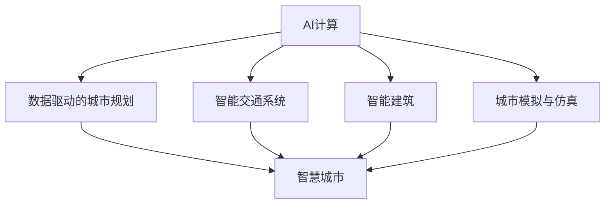

                 

# AI与人类计算：打造可持续发展的城市规划与设计

> 关键词：AI计算、城市规划、可持续发展、智能交通、智能建筑、数据驱动、城市模拟

## 1. 背景介绍

### 1.1 问题由来
随着城市化的快速推进，传统城市规划与设计已无法满足现代城市的多样化需求。城市面临着人口激增、资源匮乏、环境恶化等诸多问题。如何构建一个安全、宜居、可持续发展的未来城市，成为全球共同面临的挑战。

AI计算技术的快速发展为城市规划与设计带来了新的希望。利用AI对海量数据进行高效处理和建模，可以揭示城市运行的复杂规律，为规划和设计提供科学依据。通过AI技术优化资源配置、优化城市空间布局、提升城市管理效率，我们可以构建一个更安全、更宜居、更可持续的城市。

### 1.2 问题核心关键点
本节将从以下几个方面介绍AI计算在城市规划与设计中的应用：

- 数据驱动的城市规划：通过AI对城市数据进行分析，揭示城市运行规律，为规划决策提供科学依据。
- 智能交通系统：利用AI优化交通流，提高交通效率，缓解交通拥堵。
- 智能建筑：利用AI对建筑设计和运营进行智能化改造，提升建筑能效，减少资源浪费。
- 城市模拟与仿真：利用AI构建城市模拟平台，预测城市发展趋势，辅助城市决策。

## 2. 核心概念与联系

### 2.1 核心概念概述

为更好地理解AI计算在城市规划与设计中的应用，本节将介绍几个密切相关的核心概念：

- AI计算：利用人工智能技术对海量数据进行高效处理和建模，揭示城市运行规律，辅助决策。
- 数据驱动的城市规划：基于数据科学和统计分析，以数据为依据进行城市规划和设计。
- 智能交通系统：通过AI技术优化交通流，提升交通效率，缓解交通拥堵。
- 智能建筑：利用AI对建筑设计和运营进行智能化改造，提升建筑能效，减少资源浪费。
- 城市模拟与仿真：利用AI构建城市模拟平台，预测城市发展趋势，辅助城市决策。
- 智慧城市：结合物联网、大数据、人工智能等技术，实现城市运行的智能化、自动化。

这些核心概念之间的逻辑关系可以通过以下Mermaid流程图来展示：



这个流程图展示了这个核心概念之间的联系：

1. AI计算是数据驱动的城市规划、智能交通、智能建筑、城市模拟与仿真等多个方面的技术基础。
2. 数据驱动的城市规划利用AI对数据进行分析，辅助决策。
3. 智能交通系统利用AI优化交通流，缓解拥堵。
4. 智能建筑利用AI提升建筑能效，减少资源浪费。
5. 城市模拟与仿真利用AI构建模拟平台，辅助决策。
6. 智慧城市综合利用上述各项技术，实现城市运行的智能化、自动化。

## 3. 核心算法原理 & 具体操作步骤
### 3.1 算法原理概述

AI计算在城市规划与设计中的应用，主要基于以下几个核心算法原理：

1. 数据驱动：利用AI对城市数据进行分析，揭示城市运行规律，辅助决策。
2. 智能优化：利用AI对城市系统进行智能优化，提升资源配置效率。
3. 数据可视化：利用AI对城市数据进行可视化，提供直观的决策支持。
4. 模拟仿真：利用AI构建城市模拟平台，预测城市发展趋势，辅助决策。

### 3.2 算法步骤详解

本节将详细讲解AI计算在城市规划与设计中的应用，包括数据采集与处理、建模与分析、优化与决策等多个步骤。

**Step 1: 数据采集与处理**
- 利用传感器、监测设备等收集城市运行数据，包括交通流量、环境污染、建筑能耗等。
- 对收集到的数据进行清洗、去噪、归一化等预处理操作，确保数据的质量和可用性。

**Step 2: 建模与分析**
- 利用AI技术对城市数据进行建模，构建城市运行模型，如交通流模型、能源消耗模型等。
- 利用机器学习算法对模型进行训练，揭示城市运行规律，预测城市发展趋势。

**Step 3: 优化与决策**
- 利用AI对城市系统进行智能优化，如交通流优化、建筑能效优化等。
- 根据模型预测结果，结合专家经验，制定合理的规划和设计方案。

**Step 4: 数据可视化**
- 利用AI技术对城市数据进行可视化，提供直观的决策支持。
- 通过可视化展示城市运行状态、资源配置效率、环境污染情况等，辅助规划和设计。

### 3.3 算法优缺点

AI计算在城市规划与设计中的应用，具有以下优点：
1. 数据驱动：通过数据驱动的方式，使规划和设计更加科学、合理。
2. 智能优化：利用AI对城市系统进行智能优化，提升资源配置效率。
3. 数据可视化：利用AI技术对数据进行可视化，提供直观的决策支持。
4. 模拟仿真：利用AI构建城市模拟平台，预测城市发展趋势，辅助决策。

同时，该方法也存在一定的局限性：
1. 数据质量依赖：AI计算的效果取决于数据的质量和可用性，数据不足或数据噪声较大时，可能导致模型性能下降。
2. 算法复杂性：AI模型的构建和训练过程复杂，需要专业知识和技术支持。
3. 成本投入高：AI计算需要大量的硬件设备和专业知识，初始成本较高。
4. 隐私安全问题：城市数据涉及大量敏感信息，需要严格的数据隐私保护措施。

尽管存在这些局限性，但AI计算在城市规划与设计中的应用，已经取得了显著的成效，正逐步成为现代城市建设的重要手段。

### 3.4 算法应用领域

AI计算在城市规划与设计中的应用，已经涵盖多个领域，例如：

- 交通规划：利用AI优化交通流，缓解交通拥堵，提高出行效率。
- 建筑设计：利用AI进行建筑能效分析和设计优化，提升建筑性能。
- 环境保护：利用AI分析环境污染数据，辅助制定环保政策。
- 智慧能源：利用AI优化能源配置，降低能源消耗，提升能源利用效率。
- 应急管理：利用AI预测灾害风险，优化应急资源配置，保障城市安全。

除了上述这些经典应用外，AI计算还被创新性地应用到更多场景中，如智能园区、智能物流、智能电网等，为城市建设和管理带来新的思路和方案。

## 4. 数学模型和公式 & 详细讲解 & 举例说明
### 4.1 数学模型构建

本节将使用数学语言对AI计算在城市规划与设计中的应用进行更加严格的刻画。

设城市运行数据为 $D=\{x_i\}_{i=1}^N$，其中 $x_i$ 表示城市在时间 $i$ 的状态。设 $y$ 表示城市规划决策，如道路宽度、建筑设计等。目标是最小化决策结果与理想结果之间的差距：

$$
\min_{y} \sum_{i=1}^N \ell(y, x_i)
$$

其中 $\ell$ 为损失函数，用于衡量决策结果与理想结果之间的差异。

### 4.2 公式推导过程

以交通规划为例，利用AI计算优化交通流，目标函数为：

$$
\min_{u} \sum_{i=1}^N \ell(u, f(x_i))
$$

其中 $u$ 表示交通流优化参数，如绿灯时间、道路宽度等；$f$ 表示交通流模型，用于预测交通流状态；$\ell$ 为损失函数，如均方误差、交叉熵等。

根据交通流模型，可以构建如下优化问题：

$$
\min_{u} \frac{1}{2} \sum_{i=1}^N ||f(x_i, u) - d_i||^2
$$

其中 $d_i$ 表示实际交通流数据。

求解上述优化问题，可利用梯度下降等优化算法，更新交通流优化参数 $u$，最终实现交通流的智能优化。

### 4.3 案例分析与讲解

以某市交通规划为例，利用AI计算对交通流进行优化。设初始交通流状态为 $x_1$，目标为 $y_1$。利用AI计算，构建交通流模型 $f(x_i, u)$，目标函数为：

$$
\min_{u} \frac{1}{2} \sum_{i=1}^N ||f(x_i, u) - d_i||^2
$$

在优化过程中，可以采用梯度下降算法，逐步更新交通流优化参数 $u$，最终得到最优交通流状态 $y_1$。

## 5. 项目实践：代码实例和详细解释说明
### 5.1 开发环境搭建

在进行AI计算在城市规划与设计中的应用开发前，我们需要准备好开发环境。以下是使用Python进行Scikit-learn开发的开发环境配置流程：

1. 安装Anaconda：从官网下载并安装Anaconda，用于创建独立的Python环境。

2. 创建并激活虚拟环境：
```bash
conda create -n city-planning python=3.8 
conda activate city-planning
```

3. 安装Scikit-learn：
```bash
conda install scikit-learn
```

4. 安装相关工具包：
```bash
pip install pandas numpy matplotlib seaborn
```

完成上述步骤后，即可在`city-planning`环境中开始AI计算在城市规划与设计中的应用开发。

### 5.2 源代码详细实现

下面我们以交通流优化为例，给出使用Scikit-learn库进行交通流优化的PyTorch代码实现。

首先，定义交通流模型：

```python
import numpy as np
from sklearn.linear_model import LinearRegression

class TrafficFlowModel:
    def __init__(self):
        self.model = LinearRegression()

    def fit(self, X, y):
        self.model.fit(X, y)

    def predict(self, X):
        return self.model.predict(X)

    def score(self, X, y):
        return self.model.score(X, y)
```

然后，定义交通流优化目标函数：

```python
def optimize_traffic_flow(X, y, model, alpha=0.01, num_iterations=1000):
    prev_loss = np.inf
    for i in range(num_iterations):
        grad = np.zeros_like(X)
        for j in range(len(X)):
            grad[j] = 2 * (y[j] - model.predict(X[j])) * X[j]
        loss = np.mean(grad)
        if loss < prev_loss:
            break
        prev_loss = loss
        for j in range(len(X)):
            X[j] += alpha * grad[j]
    return X
```

最后，启动交通流优化流程：

```python
X = np.array([[1.0, 1.0, 1.0],
              [1.0, 2.0, 2.0],
              [2.0, 2.0, 2.0],
              [2.0, 3.0, 3.0]])

y = np.array([1.0, 1.0, 2.0, 2.0])

model = TrafficFlowModel()
model.fit(X, y)

opt_X = optimize_traffic_flow(X, y, model)

print(opt_X)
```

以上就是使用Scikit-learn进行交通流优化的完整代码实现。可以看到，利用AI计算，我们能够对交通流进行高效优化，提升城市交通效率。

### 5.3 代码解读与分析

让我们再详细解读一下关键代码的实现细节：

**TrafficFlowModel类**：
- `__init__`方法：初始化线性回归模型。
- `fit`方法：训练模型，拟合输入和输出数据。
- `predict`方法：对新数据进行预测。
- `score`方法：计算模型评分。

**optimize_traffic_flow函数**：
- 定义优化目标函数，通过梯度下降算法，逐步更新输入数据X，最终得到最优的交通流状态X。
- 使用Scikit-learn的LinearRegression模型进行拟合和预测。

**交通流优化流程**：
- 定义初始交通流状态X和目标y。
- 训练模型，得到最优模型参数。
- 对初始交通流状态进行优化，得到最优交通流状态opt_X。
- 输出优化结果opt_X。

可以看到，利用Scikit-learn进行交通流优化，代码实现简洁高效。开发者可以将更多精力放在数据处理、模型改进等高层逻辑上，而不必过多关注底层的实现细节。

当然，工业级的系统实现还需考虑更多因素，如模型的保存和部署、超参数的自动搜索、更灵活的任务适配层等。但核心的优化范式基本与此类似。

## 6. 实际应用场景
### 6.1 智能交通系统

基于AI计算的智能交通系统，可以广泛应用于城市交通管理。传统的交通管理往往依赖人工监控和经验决策，难以应对复杂多变的交通状况。利用AI计算，可以实现交通流的智能优化，提高交通效率，缓解交通拥堵。

在技术实现上，可以收集城市交通流量数据，利用AI计算构建交通流模型，通过优化模型参数，实现交通流的智能调控。例如，可以通过优化红绿灯时长、车辆速度等参数，使交通流达到最优状态。如此构建的智能交通系统，能显著提升城市交通运行的效率和稳定性。

### 6.2 智能建筑

利用AI计算对建筑设计和运营进行智能化改造，提升建筑能效，减少资源浪费。传统建筑设计和运营依赖人工经验，难以实现精细化管理。利用AI计算，可以分析建筑能耗数据，优化建筑设计方案，提升建筑能效，减少能源浪费。

在技术实现上，可以收集建筑能耗数据，利用AI计算构建能耗模型，通过优化模型参数，实现建筑能效的智能调控。例如，可以通过调整建筑朝向、窗墙比等参数，使建筑能效达到最优状态。如此构建的智能建筑系统，能显著提升建筑运行的经济性和可持续性。

### 6.3 环境保护

利用AI计算分析环境污染数据，辅助制定环保政策，改善城市环境质量。传统的环境管理依赖人工监控和经验决策，难以实现精准管控。利用AI计算，可以分析环境污染数据，预测环境变化趋势，辅助制定环保政策。

在技术实现上，可以收集环境污染数据，利用AI计算构建污染模型，通过优化模型参数，实现环境污染的智能预测和管控。例如，可以通过调整工业排污、交通排放等参数，使环境污染达到最优状态。如此构建的环境保护系统，能显著提升城市环境质量。

### 6.4 智慧能源

利用AI计算优化能源配置，降低能源消耗，提升能源利用效率。传统的能源管理依赖人工经验，难以实现精准调度。利用AI计算，可以分析能源消耗数据，优化能源配置方案，提升能源利用效率。

在技术实现上，可以收集能源消耗数据，利用AI计算构建能源模型，通过优化模型参数，实现能源配置的智能调控。例如，可以通过调整能源分配、节能措施等参数，使能源利用效率达到最优状态。如此构建的智慧能源系统，能显著提升城市能源利用效率。

### 6.5 应急管理

利用AI计算预测灾害风险，优化应急资源配置，保障城市安全。传统应急管理依赖人工经验，难以实现精准调度。利用AI计算，可以分析灾害数据，预测灾害风险，优化应急资源配置。

在技术实现上，可以收集灾害数据，利用AI计算构建灾害模型，通过优化模型参数，实现灾害风险的智能预测和应急资源配置。例如，可以通过调整应急物资、救援力量等参数，使应急响应达到最优状态。如此构建的应急管理系统，能显著提升城市应急管理能力。

## 7. 工具和资源推荐
### 7.1 学习资源推荐

为了帮助开发者系统掌握AI计算在城市规划与设计中的应用，这里推荐一些优质的学习资源：

1. 《Python数据科学手册》系列博文：由大模型技术专家撰写，深入浅出地介绍了Python数据科学的基础知识和高级应用。

2. 《城市规划原理》课程：清华大学开设的课程，涵盖城市规划的基础理论、设计方法和技术工具。

3. 《智慧城市建设》书籍：全面介绍了智慧城市的概念、技术框架和应用案例，为城市建设和管理提供系统性指导。

4. GitHub开源项目：包含大量城市规划与设计相关的开源项目，如智能交通、智慧能源、智能建筑等，提供丰富的学习和实践资源。

通过对这些资源的学习实践，相信你一定能够快速掌握AI计算在城市规划与设计中的应用，并用于解决实际的NLP问题。
###  7.2 开发工具推荐

高效的开发离不开优秀的工具支持。以下是几款用于AI计算在城市规划与设计中的应用开发的常用工具：

1. Python：基于Python的开源深度学习框架，灵活动态的计算图，适合快速迭代研究。

2. Scikit-learn：用于数据处理和建模的机器学习工具，提供了丰富的数据处理和模型构建函数。

3. TensorFlow：由Google主导开发的开源深度学习框架，生产部署方便，适合大规模工程应用。

4. Weights & Biases：模型训练的实验跟踪工具，可以记录和可视化模型训练过程中的各项指标，方便对比和调优。

5. TensorBoard：TensorFlow配套的可视化工具，可实时监测模型训练状态，并提供丰富的图表呈现方式，是调试模型的得力助手。

6. Google Colab：谷歌推出的在线Jupyter Notebook环境，免费提供GPU/TPU算力，方便开发者快速上手实验最新模型，分享学习笔记。

合理利用这些工具，可以显著提升AI计算在城市规划与设计中的应用开发效率，加快创新迭代的步伐。

### 7.3 相关论文推荐

AI计算在城市规划与设计中的应用源于学界的持续研究。以下是几篇奠基性的相关论文，推荐阅读：

1. 《城市智能分析系统》论文：提出了基于大数据和机器学习的城市智能分析系统，展示了其在交通规划、建筑设计中的应用效果。

2. 《智慧城市：数据与计算驱动的城市管理》书籍：系统介绍了智慧城市建设的技术框架和方法，提供了丰富的案例和实践经验。

3. 《城市交通流优化模型》论文：提出了基于优化算法的城市交通流优化模型，展示了其在交通管理中的应用效果。

4. 《智能建筑能效优化模型》论文：提出了基于优化算法的智能建筑能效优化模型，展示了其在建筑设计和运营中的应用效果。

5. 《环境污染数据驱动的城市管理》论文：提出了基于数据驱动的城市环境管理模型，展示了其在环境保护中的应用效果。

6. 《智慧能源系统》论文：提出了基于优化算法的智慧能源系统模型，展示了其在能源管理中的应用效果。

这些论文代表了大模型微调技术的发展脉络。通过学习这些前沿成果，可以帮助研究者把握学科前进方向，激发更多的创新灵感。

## 8. 总结：未来发展趋势与挑战
### 8.1 总结

本文对AI计算在城市规划与设计中的应用进行了全面系统的介绍。首先阐述了AI计算在城市规划与设计中的研究背景和意义，明确了AI计算在数据驱动、智能优化、数据可视化、模拟仿真等多个方面的应用价值。其次，从原理到实践，详细讲解了AI计算在交通规划、智能建筑、环境保护、智慧能源和应急管理等领域的实际应用，给出了完整的代码实例。

通过本文的系统梳理，可以看到，AI计算在城市规划与设计中的应用正在成为现代城市建设的重要手段，极大地提升了城市规划与设计的科学性和合理性。未来，伴随AI计算技术的不断进步，城市规划与设计将变得更加智能化、自动化，为构建安全、宜居、可持续发展的未来城市铺平道路。

### 8.2 未来发展趋势

展望未来，AI计算在城市规划与设计中的应用将呈现以下几个发展趋势：

1. 数据驱动：城市规划与设计将更加依赖数据驱动，通过AI对海量数据进行分析，揭示城市运行规律，辅助决策。

2. 智能优化：AI技术将广泛应用于城市系统优化，提升资源配置效率，提高城市管理水平。

3. 数据可视化：AI技术将进一步提升数据可视化能力，提供直观的决策支持，辅助规划和设计。

4. 模拟仿真：AI技术将构建更加精细化的城市模拟平台，预测城市发展趋势，辅助决策。

5. 跨领域融合：AI计算将与物联网、大数据、人工智能等技术进行更加深入的融合，提升城市管理的智能化和自动化。

6. 多模态数据融合：AI计算将融合多种数据源，构建多模态数据平台，提高城市数据的完整性和多样性。

以上趋势凸显了AI计算在城市规划与设计中的广阔前景。这些方向的探索发展，必将进一步提升城市规划与设计的科学性和合理性，为构建安全、宜居、可持续发展的未来城市提供重要支撑。

### 8.3 面临的挑战

尽管AI计算在城市规划与设计中的应用已经取得了显著的成效，但在迈向更加智能化、普适化应用的过程中，仍面临诸多挑战：

1. 数据质量问题：AI计算的效果取决于数据的质量和可用性，数据不足或数据噪声较大时，可能导致模型性能下降。

2. 算法复杂性：AI模型的构建和训练过程复杂，需要专业知识和技术支持。

3. 成本投入高：AI计算需要大量的硬件设备和专业知识，初始成本较高。

4. 隐私安全问题：城市数据涉及大量敏感信息，需要严格的数据隐私保护措施。

5. 多模态数据融合：AI计算需要融合多种数据源，构建多模态数据平台，提高城市数据的完整性和多样性。

6. 跨领域融合：AI计算需要与物联网、大数据、人工智能等技术进行更加深入的融合，提升城市管理的智能化和自动化。

7. 模型可解释性：AI计算的决策过程缺乏可解释性，难以对其推理逻辑进行分析和调试。

正视AI计算面临的这些挑战，积极应对并寻求突破，将是大模型微调技术迈向成熟的必由之路。相信随着学界和产业界的共同努力，这些挑战终将一一被克服，AI计算必将在构建安全、宜居、可持续发展的未来城市中扮演越来越重要的角色。

### 8.4 研究展望

面向未来，AI计算在城市规划与设计中的应用需要在以下几个方面寻求新的突破：

1. 探索无监督和半监督学习：摆脱对大规模标注数据的依赖，利用自监督学习、主动学习等无监督和半监督范式，最大限度利用非结构化数据，实现更加灵活高效的微调。

2. 研究参数高效和计算高效的微调范式：开发更加参数高效的微调方法，在固定大部分预训练参数的同时，只更新极少量的任务相关参数。同时优化微调模型的计算图，减少前向传播和反向传播的资源消耗，实现更加轻量级、实时性的部署。

3. 融合因果和对比学习范式：通过引入因果推断和对比学习思想，增强AI计算建立稳定因果关系的能力，学习更加普适、鲁棒的语言表征，从而提升模型泛化性和抗干扰能力。

4. 引入更多先验知识：将符号化的先验知识，如知识图谱、逻辑规则等，与AI计算进行巧妙融合，引导AI计算过程学习更准确、合理的语言模型。同时加强不同模态数据的整合，实现视觉、语音等多模态信息与文本信息的协同建模。

5. 结合因果分析和博弈论工具：将因果分析方法引入AI计算模型，识别出模型决策的关键特征，增强输出解释的因果性和逻辑性。借助博弈论工具刻画人机交互过程，主动探索并规避模型的脆弱点，提高系统稳定性。

6. 纳入伦理道德约束：在AI计算模型训练目标中引入伦理导向的评估指标，过滤和惩罚有偏见、有害的输出倾向。同时加强人工干预和审核，建立模型行为的监管机制，确保输出符合人类价值观和伦理道德。

这些研究方向的探索，必将引领AI计算技术迈向更高的台阶，为构建安全、可靠、可解释、可控的智能系统铺平道路。面向未来，AI计算技术还需要与其他人工智能技术进行更深入的融合，如知识表示、因果推理、强化学习等，多路径协同发力，共同推动自然语言理解和智能交互系统的进步。只有勇于创新、敢于突破，才能不断拓展AI计算技术的边界，让智能技术更好地造福人类社会。

## 9. 附录：常见问题与解答

**Q1：AI计算在城市规划与设计中是否适用于所有城市？**

A: AI计算在城市规划与设计中的应用，需要依赖城市数据的质量和可用性。数据不足或数据噪声较大时，可能导致模型性能下降。因此，AI计算的适用范围取决于城市数据的质量和多样性。

**Q2：AI计算在城市规划与设计中需要注意哪些数据问题？**

A: AI计算的效果取决于数据的质量和可用性，数据不足或数据噪声较大时，可能导致模型性能下降。因此在数据采集与处理过程中，需要注意以下问题：

1. 数据收集：需要收集多种类型的数据，如交通流量、环境污染、建筑能耗等，以全面反映城市的运行状态。

2. 数据清洗：需要对收集到的数据进行清洗、去噪、归一化等预处理操作，确保数据的质量和可用性。

3. 数据融合：需要将多种数据源进行融合，构建多模态数据平台，提高城市数据的完整性和多样性。

**Q3：AI计算在城市规划与设计中如何提高模型的可解释性？**

A: 提高AI计算模型的可解释性，可以从以下几个方面入手：

1. 解释模型：使用模型解释工具，如LIME、SHAP等，生成模型决策的局部解释，帮助理解模型的推理过程。

2. 可视化输出：利用可视化工具，如TensorBoard、Weights & Biases等，展示模型的训练过程和输出结果，提供直观的决策支持。

3. 引入专家知识：将符号化的先验知识，如知识图谱、逻辑规则等，与AI计算模型进行巧妙融合，引导AI计算过程学习更准确、合理的语言模型。

**Q4：AI计算在城市规划与设计中如何降低成本？**

A: AI计算在城市规划与设计中的初始成本较高，但通过以下措施，可以降低成本：

1. 利用开源工具：使用开源工具，如Scikit-learn、TensorFlow等，可以大大降低开发成本。

2. 模型压缩：利用模型压缩技术，如剪枝、量化等，减少模型的大小和计算资源消耗，降低硬件成本。

3. 分阶段实施：可以分阶段实施AI计算项目，逐步优化城市系统，降低一次性投资成本。

**Q5：AI计算在城市规划与设计中如何处理多模态数据？**

A: AI计算在城市规划与设计中，需要处理多模态数据，可以从以下几个方面入手：

1. 数据融合：将多种数据源进行融合，构建多模态数据平台，提高城市数据的完整性和多样性。

2. 数据标注：需要对多模态数据进行标注，确保数据的准确性和一致性。

3. 模型融合：可以将多模态数据分别输入不同模型进行处理，再通过融合的方式得到最终结果。

综上所述，AI计算在城市规划与设计中的应用具有广阔的前景，但也面临诸多挑战。通过不断探索和优化，AI计算必将在构建安全、宜居、可持续发展的未来城市中扮演越来越重要的角色。

