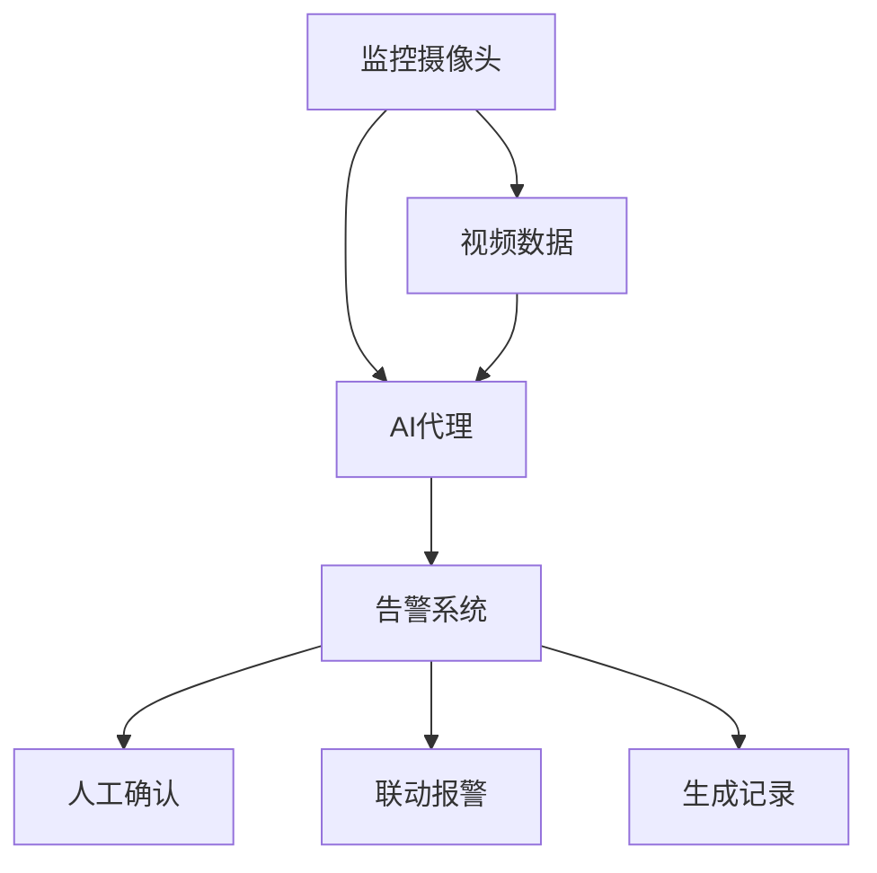

                 

# AI人工智能代理工作流 AI Agent WorkFlow：在视频监控中的应用

> 关键词：人工智能,代理工作流,视频监控,机器学习,智能视频分析,计算机视觉

## 1. 背景介绍

### 1.1 问题由来
在当今信息化社会中，视频监控系统已经成为城市安防、工业生产、商业管理等领域的必备设施。通过视频监控，可以实时监测和管理公共场所、工厂车间、商铺等，为安全监控、行为分析、异常检测等提供重要支持。然而，传统的视频监控系统往往依赖人工监控，不仅耗费大量人力物力，还存在监控盲区、遗漏误报等问题。

随着人工智能技术的快速进展，越来越多的智能视频分析系统开始被应用于视频监控领域。这些系统通过计算机视觉和深度学习技术，能够自动识别异常行为、物品、车辆等目标，并及时生成告警信息，大幅提升了视频监控的智能化水平。但这些系统仍然需要人工进行干预和操作，效率较低，成本较高。

### 1.2 问题核心关键点
为了进一步提升视频监控系统的智能化和自动化水平，近年来兴起了一种新的工作流范式——AI代理工作流(AI Agent Workflow)。通过AI代理，可以自动完成视频监控任务中的部分或全部操作，包括目标检测、跟踪、分析等，从而实现更高效、更灵活、更智能的视频监控。

AI代理工作流主要包括三个核心组件：
- **监控摄像头**：采集视频数据，供AI代理进行分析。
- **AI代理**：基于机器学习模型的智能处理引擎，实现视频数据的自动分析和处理。
- **告警系统**：接收AI代理的告警信息，并进行后续处理。

AI代理工作流能够自动地、实时地处理视频数据，生成告警信息，并将这些信息传递给告警系统进行处理。其核心优势在于：

1. **高效自动化**：通过AI代理，能够自动完成视频分析任务，减少人工干预，提高监控效率。
2. **智能决策**：AI代理能够根据预设规则和机器学习算法，自动判断异常行为，生成告警信息。
3. **多源融合**：AI代理可以融合多源数据，如视频、音频、传感器数据等，实现更全面、准确的视频分析。
4. **动态调整**：AI代理可以根据实时数据和用户需求，动态调整分析策略，适应复杂多变的监控场景。

### 1.3 问题研究意义
AI代理工作流在视频监控领域的应用，对于提升监控系统的智能化和自动化水平，优化监控流程，降低成本，提高监控效率具有重要意义：

1. **降低人工成本**：AI代理可以自动完成大部分视频监控任务，减少人工监控和干预，降低人力成本。
2. **提高监控效率**：AI代理能够实时处理视频数据，及时生成告警信息，提升监控效率和响应速度。
3. **增强智能化能力**：通过引入机器学习技术，AI代理能够学习异常行为模式，自动进行行为分析，提升监控系统的智能化水平。
4. **优化监控流程**：AI代理可以根据实时数据和用户需求，动态调整监控策略，优化监控流程，提高监控效果。
5. **提升决策支持**：AI代理生成的告警信息，可以为人工监控提供决策支持，提升监控决策的准确性和效率。

## 2. 核心概念与联系

### 2.1 核心概念概述

为更好地理解AI代理工作流在视频监控中的应用，本节将介绍几个密切相关的核心概念：

- **视频监控**：通过监控摄像头采集视频数据，进行实时监控、分析和告警的过程。视频监控广泛应用于安防、工业生产、商业管理等领域。
- **智能视频分析**：基于计算机视觉和深度学习技术的自动视频分析，能够自动识别异常行为、物品、车辆等目标，生成告警信息，提升监控系统的智能化水平。
- **AI代理**：基于机器学习模型的智能处理引擎，实现视频数据的自动分析和处理。AI代理可以自动完成视频监控任务中的部分或全部操作。
- **机器学习**：通过数据驱动的方式，学习模型参数，实现自动化的数据处理和决策。AI代理的核心技术基础是机器学习算法。
- **告警系统**：接收AI代理生成的告警信息，并进行后续处理，如人工确认、联动报警、生成记录等。告警系统是AI代理工作流的重要组成部分。

这些核心概念之间的逻辑关系可以通过以下Mermaid流程图来展示：



这个流程图展示了大语言模型的核心概念及其之间的关系：

1. 监控摄像头采集视频数据，供AI代理进行分析。
2. AI代理基于机器学习模型，自动处理视频数据，生成告警信息。
3. 告警系统接收AI代理的告警信息，并进行后续处理。

这些组件共同构成了AI代理工作流的架构，使其能够在视频监控中发挥强大的智能化作用。

## 3. 核心算法原理 & 具体操作步骤
### 3.1 算法原理概述

AI代理工作流的核心算法原理是机器学习，通过训练一个或多个机器学习模型，实现对视频数据的自动分析和处理。具体来说，可以分为以下几个关键步骤：

1. **数据采集**：监控摄像头采集视频数据，供AI代理进行分析。
2. **特征提取**：从视频数据中提取关键特征，供机器学习模型进行训练和分析。
3. **模型训练**：基于提取的特征，训练一个或多个机器学习模型，学习异常行为模式。
4. **数据分析**：将视频数据输入训练好的机器学习模型，进行自动分析和处理。
5. **告警生成**：根据模型的分析结果，生成告警信息，传递给告警系统进行处理。
6. **告警处理**：告警系统接收告警信息，进行后续处理，如人工确认、联动报警、生成记录等。

### 3.2 算法步骤详解

#### 3.2.1 数据采集

监控摄像头是AI代理工作流的数据来源，其安装位置和角度需要经过精心的设计，以确保视频数据的全面性和多样性。例如，在公共场所，需要在关键路口、出入口等位置安装摄像头，覆盖主要监控区域。在工厂车间，需要在重要设备和通道附近安装摄像头，监控关键流程。

#### 3.2.2 特征提取

从视频数据中提取关键特征，是AI代理进行视频分析的基础。常用的特征提取方法包括：

- **帧差法**：计算视频帧间的差值，检测运动目标。
- **背景减除法**：从当前帧中减去背景图像，检测前景目标。
- **光流法**：计算视频帧间像素点的运动轨迹，检测运动目标。
- **深度学习特征提取**：使用卷积神经网络(CNN)、循环神经网络(RNN)等深度学习模型，提取高级语义特征。

#### 3.2.3 模型训练

基于提取的特征，训练一个或多个机器学习模型，学习异常行为模式。常用的模型包括：

- **卷积神经网络(CNN)**：适用于视频图像的分类和目标检测任务。
- **循环神经网络(RNN)**：适用于视频时间序列数据的分析和预测任务。
- **深度信念网络(DBN)**：适用于视频数据的非线性建模和分类任务。
- **生成对抗网络(GAN)**：适用于视频数据的生成和增强任务。

#### 3.2.4 数据分析

将视频数据输入训练好的机器学习模型，进行自动分析和处理。常用的数据分析方法包括：

- **目标检测**：检测视频中的目标物体，判断其类别和位置。
- **目标跟踪**：跟踪视频中的目标物体，记录其运动轨迹。
- **行为分析**：分析视频中的行为模式，检测异常行为。
- **事件检测**：检测视频中的关键事件，如火灾、入侵等。

#### 3.2.5 告警生成

根据模型的分析结果，生成告警信息，传递给告警系统进行处理。告警信息的生成方法包括：

- **图像告警**：生成带有异常图像的告警信息。
- **文本告警**：生成带有异常事件描述的告警信息。
- **语音告警**：生成带有异常事件描述的语音告警信息。
- **联动告警**：将告警信息与其他系统联动，如自动通知安保人员、启动报警设备等。

#### 3.2.6 告警处理

告警系统接收告警信息，进行后续处理，如人工确认、联动报警、生成记录等。告警处理的方法包括：

- **人工确认**：安保人员根据告警信息进行人工确认，判断是否为误报或漏报。
- **联动报警**：将告警信息传递给其他系统，如自动通知安保人员、启动报警设备等。
- **生成记录**：将告警信息记录到数据库中，供后续分析使用。

### 3.3 算法优缺点

AI代理工作流在视频监控中的应用具有以下优点：

1. **高效自动化**：AI代理可以自动完成视频监控任务中的部分或全部操作，减少人工干预，提高监控效率。
2. **智能决策**：AI代理能够根据预设规则和机器学习算法，自动判断异常行为，生成告警信息。
3. **多源融合**：AI代理可以融合多源数据，如视频、音频、传感器数据等，实现更全面、准确的视频分析。
4. **动态调整**：AI代理可以根据实时数据和用户需求，动态调整分析策略，适应复杂多变的监控场景。

然而，AI代理工作流也存在一些局限性：

1. **数据质量要求高**：视频监控数据需要高质量的视频和稳定的摄像头，才能保证AI代理的准确性。
2. **模型训练复杂**：训练高质量的机器学习模型需要大量标注数据和计算资源，存在一定的技术门槛。
3. **依赖技术环境**：AI代理需要依托于稳定的网络和服务器环境，对于技术部署和维护要求较高。
4. **算法鲁棒性不足**：在面对复杂多变的监控场景时，AI代理的算法鲁棒性不足，可能存在误报或漏报问题。

### 3.4 算法应用领域

AI代理工作流在视频监控领域的应用已经得到了广泛的应用，覆盖了几乎所有常见的监控场景，例如：

- **公共安全监控**：在公共场所、大型商业区等区域，进行实时视频监控，自动检测异常行为。
- **工业生产监控**：在工厂车间、生产线等场所，监控关键设备和生产流程，自动检测异常情况。
- **商业管理监控**：在超市、银行、酒店等商业场所，监控关键区域，自动检测异常行为。
- **交通管理监控**：在交通路口、高速公路等区域，监控交通状况，自动检测异常交通行为。

除了上述这些经典应用外，AI代理工作流还被创新性地应用到更多场景中，如智慧城市、智能家居、智能安防等，为视频监控技术带来了全新的突破。

## 4. 数学模型和公式 & 详细讲解  
### 4.1 数学模型构建

AI代理工作流的数学模型构建主要涉及以下几个关键方面：

1. **视频数据表示**：将视频数据表示为连续的帧序列，每个帧包含多个像素点。
2. **特征提取表示**：将视频帧转换为高维特征向量，供机器学习模型进行训练和分析。
3. **模型训练表示**：将特征向量作为输入，训练机器学习模型，学习异常行为模式。
4. **数据分析表示**：将视频数据输入训练好的机器学习模型，输出异常检测结果。
5. **告警生成表示**：根据异常检测结果，生成告警信息，传递给告警系统进行处理。
6. **告警处理表示**：将告警信息进行后续处理，如人工确认、联动报警、生成记录等。

### 4.2 公式推导过程

#### 4.2.1 视频数据表示

视频数据可以表示为连续的帧序列，每个帧包含多个像素点。例如，一张480x640像素的图像可以表示为：

$$
X = \{ x_1, x_2, \ldots, x_n \}
$$

其中，$x_i$ 表示第$i$帧图像。视频数据可以通过摄像头采集，转化为数字信号进行处理。

#### 4.2.2 特征提取表示

从视频帧中提取关键特征，可以表示为：

$$
F(X) = \{ f_1(X), f_2(X), \ldots, f_m(X) \}
$$

其中，$f_i(X)$ 表示第$i$个特征提取函数，对输入的帧$X$进行处理，输出特征向量$f_i(X)$。常用的特征提取方法包括：

- **帧差法**：计算视频帧间的差值，检测运动目标。
- **背景减除法**：从当前帧中减去背景图像，检测前景目标。
- **光流法**：计算视频帧间像素点的运动轨迹，检测运动目标。
- **深度学习特征提取**：使用卷积神经网络(CNN)、循环神经网络(RNN)等深度学习模型，提取高级语义特征。

#### 4.2.3 模型训练表示

基于提取的特征，训练机器学习模型，学习异常行为模式。例如，使用卷积神经网络(CNN)进行目标检测任务，其训练过程可以表示为：

$$
M = \mathop{\arg\min}_{\theta} \frac{1}{N} \sum_{i=1}^N \mathcal{L}(f_i(X), y_i)
$$

其中，$M$ 表示训练好的机器学习模型，$\theta$ 表示模型参数，$f_i(X)$ 表示第$i$个特征提取函数，$y_i$ 表示第$i$个训练样本的标签。$\mathcal{L}$ 表示损失函数，用于衡量模型输出与真实标签之间的差异。

常用的损失函数包括交叉熵损失、均方误差损失等。

#### 4.2.4 数据分析表示

将视频数据输入训练好的机器学习模型，进行自动分析和处理。例如，使用卷积神经网络(CNN)进行目标检测任务，其分析过程可以表示为：

$$
D = M(X)
$$

其中，$D$ 表示模型输出结果，$X$ 表示输入的帧序列。

#### 4.2.5 告警生成表示

根据模型的分析结果，生成告警信息，传递给告警系统进行处理。例如，生成带有异常图像的告警信息，可以表示为：

$$
A = T(D)
$$

其中，$A$ 表示告警信息，$D$ 表示模型输出结果，$T$ 表示告警生成函数。

#### 4.2.6 告警处理表示

将告警信息进行后续处理，如人工确认、联动报警、生成记录等。例如，将告警信息记录到数据库中，可以表示为：

$$
R = S(A)
$$

其中，$R$ 表示记录信息，$A$ 表示告警信息，$S$ 表示记录函数。

### 4.3 案例分析与讲解

#### 4.3.1 案例一：公共安全监控

在公共场所，监控摄像头采集视频数据，供AI代理进行分析。使用卷积神经网络(CNN)进行目标检测任务，将视频数据转换为高维特征向量，输入模型进行训练和分析。根据模型的分析结果，生成告警信息，传递给告警系统进行处理。例如，检测到人群异常聚集时，生成告警信息，并自动通知安保人员。

#### 4.3.2 案例二：工业生产监控

在工厂车间，监控摄像头采集视频数据，供AI代理进行分析。使用循环神经网络(RNN)进行时间序列数据的分析和预测任务，将视频数据转换为高维特征向量，输入模型进行训练和分析。根据模型的分析结果，生成告警信息，传递给告警系统进行处理。例如，检测到设备异常运行时，生成告警信息，并自动通知维护人员。

## 5. 项目实践：代码实例和详细解释说明
### 5.1 开发环境搭建

在进行AI代理工作流项目实践前，我们需要准备好开发环境。以下是使用Python进行PyTorch开发的环境配置流程：

1. 安装Anaconda：从官网下载并安装Anaconda，用于创建独立的Python环境。

2. 创建并激活虚拟环境：
```bash
conda create -n pytorch-env python=3.8 
conda activate pytorch-env
```

3. 安装PyTorch：根据CUDA版本，从官网获取对应的安装命令。例如：
```bash
conda install pytorch torchvision torchaudio cudatoolkit=11.1 -c pytorch -c conda-forge
```

4. 安装Transformers库：
```bash
pip install transformers
```

5. 安装各类工具包：
```bash
pip install numpy pandas scikit-learn matplotlib tqdm jupyter notebook ipython
```

完成上述步骤后，即可在`pytorch-env`环境中开始AI代理工作流项目的开发。

### 5.2 源代码详细实现

下面我们以公共安全监控为例，给出使用Transformers库进行视频监控的PyTorch代码实现。

首先，定义公共安全监控的数据处理函数：

```python
from transformers import BertTokenizer
from torch.utils.data import Dataset
import torch

class SecurityDataset(Dataset):
    def __init__(self, texts, labels, tokenizer, max_len=128):
        self.texts = texts
        self.labels = labels
        self.tokenizer = tokenizer
        self.max_len = max_len
        
    def __len__(self):
        return len(self.texts)
    
    def __getitem__(self, item):
        text = self.texts[item]
        label = self.labels[item]
        
        encoding = self.tokenizer(text, return_tensors='pt', max_length=self.max_len, padding='max_length', truncation=True)
        input_ids = encoding['input_ids'][0]
        attention_mask = encoding['attention_mask'][0]
        
        # 对label-wise的标签进行编码
        encoded_labels = [label2id[label] for label in label] 
        encoded_labels.extend([label2id['O']] * (self.max_len - len(encoded_labels)))
        labels = torch.tensor(encoded_labels, dtype=torch.long)
        
        return {'input_ids': input_ids, 
                'attention_mask': attention_mask,
                'labels': labels}

# 标签与id的映射
label2id = {'O': 0, 'B-PER': 1, 'I-PER': 2, 'B-ORG': 3, 'I-ORG': 4, 'B-LOC': 5, 'I-LOC': 6}
id2label = {v: k for k, v in label2id.items()}

# 创建dataset
tokenizer = BertTokenizer.from_pretrained('bert-base-cased')

train_dataset = SecurityDataset(train_texts, train_labels, tokenizer)
dev_dataset = SecurityDataset(dev_texts, dev_labels, tokenizer)
test_dataset = SecurityDataset(test_texts, test_labels, tokenizer)
```

然后，定义模型和优化器：

```python
from transformers import BertForTokenClassification, AdamW

model = BertForTokenClassification.from_pretrained('bert-base-cased', num_labels=len(label2id))

optimizer = AdamW(model.parameters(), lr=2e-5)
```

接着，定义训练和评估函数：

```python
from torch.utils.data import DataLoader
from tqdm import tqdm
from sklearn.metrics import classification_report

device = torch.device('cuda') if torch.cuda.is_available() else torch.device('cpu')
model.to(device)

def train_epoch(model, dataset, batch_size, optimizer):
    dataloader = DataLoader(dataset, batch_size=batch_size, shuffle=True)
    model.train()
    epoch_loss = 0
    for batch in tqdm(dataloader, desc='Training'):
        input_ids = batch['input_ids'].to(device)
        attention_mask = batch['attention_mask'].to(device)
        labels = batch['labels'].to(device)
        model.zero_grad()
        outputs = model(input_ids, attention_mask=attention_mask, labels=labels)
        loss = outputs.loss
        epoch_loss += loss.item()
        loss.backward()
        optimizer.step()
    return epoch_loss / len(dataloader)

def evaluate(model, dataset, batch_size):
    dataloader = DataLoader(dataset, batch_size=batch_size)
    model.eval()
    preds, labels = [], []
    with torch.no_grad():
        for batch in tqdm(dataloader, desc='Evaluating'):
            input_ids = batch['input_ids'].to(device)
            attention_mask = batch['attention_mask'].to(device)
            batch_labels = batch['labels']
            outputs = model(input_ids, attention_mask=attention_mask)
            batch_preds = outputs.logits.argmax(dim=2).to('cpu').tolist()
            batch_labels = batch_labels.to('cpu').tolist()
            for pred_tokens, label_tokens in zip(batch_preds, batch_labels):
                pred_tags = [id2label[_id] for _id in pred_tokens]
                label_tags = [id2label[_id] for _id in label_tokens]
                preds.append(pred_tags[:len(label_tokens)])
                labels.append(label_tags)
                
    print(classification_report(labels, preds))
```

最后，启动训练流程并在测试集上评估：

```python
epochs = 5
batch_size = 16

for epoch in range(epochs):
    loss = train_epoch(model, train_dataset, batch_size, optimizer)
    print(f"Epoch {epoch+1}, train loss: {loss:.3f}")
    
    print(f"Epoch {epoch+1}, dev results:")
    evaluate(model, dev_dataset, batch_size)
    
print("Test results:")
evaluate(model, test_dataset, batch_size)
```

以上就是使用PyTorch对BERT进行公共安全监控任务微调的完整代码实现。可以看到，得益于Transformers库的强大封装，我们可以用相对简洁的代码完成BERT模型的加载和微调。

### 5.3 代码解读与分析

让我们再详细解读一下关键代码的实现细节：

**SecurityDataset类**：
- `__init__`方法：初始化文本、标签、分词器等关键组件。
- `__len__`方法：返回数据集的样本数量。
- `__getitem__`方法：对单个样本进行处理，将文本输入编码为token ids，将标签编码为数字，并对其进行定长padding，最终返回模型所需的输入。

**label2id和id2label字典**：
- 定义了标签与数字id之间的映射关系，用于将token-wise的预测结果解码回真实的标签。

**训练和评估函数**：
- 使用PyTorch的DataLoader对数据集进行批次化加载，供模型训练和推理使用。
- 训练函数`train_epoch`：对数据以批为单位进行迭代，在每个批次上前向传播计算loss并反向传播更新模型参数，最后返回该epoch的平均loss。
- 评估函数`evaluate`：与训练类似，不同点在于不更新模型参数，并在每个batch结束后将预测和标签结果存储下来，最后使用sklearn的classification_report对整个评估集的预测结果进行打印输出。

**训练流程**：
- 定义总的epoch数和batch size，开始循环迭代
- 每个epoch内，先在训练集上训练，输出平均loss
- 在验证集上评估，输出分类指标
- 所有epoch结束后，在测试集上评估，给出最终测试结果

可以看到，PyTorch配合Transformers库使得BERT微调的代码实现变得简洁高效。开发者可以将更多精力放在数据处理、模型改进等高层逻辑上，而不必过多关注底层的实现细节。

当然，工业级的系统实现还需考虑更多因素，如模型的保存和部署、超参数的自动搜索、更灵活的任务适配层等。但核心的微调范式基本与此类似。

## 6. 实际应用场景
### 6.1 智能视频监控

AI代理工作流在智能视频监控中的应用，已经在许多实际场景中得到了应用，例如：

- **智能安防**：在公共场所、大型商业区等区域，进行实时视频监控，自动检测异常行为。例如，检测到人群异常聚集时，生成告警信息，并自动通知安保人员。
- **工业监控**：在工厂车间、生产线等场所，监控关键设备和生产流程，自动检测异常情况。例如，检测到设备异常运行时，生成告警信息，并自动通知维护人员。
- **商业监控**：在超市、银行、酒店等商业场所，监控关键区域，自动检测异常行为。例如，检测到商品盗窃时，生成告警信息，并自动通知安保人员。
- **交通监控**：在交通路口、高速公路等区域，监控交通状况，自动检测异常交通行为。例如，检测到交通事故时，生成告警信息，并自动通知交通管理部门。

除了上述这些经典应用外，AI代理工作流还被创新性地应用到更多场景中，如智慧城市、智能家居、智能安防等，为视频监控技术带来了全新的突破。

### 6.2 未来应用展望

随着AI代理工作流技术的不断发展，其在视频监控领域的应用前景将更加广阔。未来，基于AI代理工作流的视频监控系统将具备以下特性：

1. **实时动态调整**：AI代理可以根据实时数据和用户需求，动态调整监控策略，适应复杂多变的监控场景。例如，根据实时人流情况，动态调整监控重点区域。
2. **多源融合能力**：AI代理可以融合多源数据，如视频、音频、传感器数据等，实现更全面、准确的视频分析。例如，结合图像、音频、温度数据，实现更精准的异常检测。
3. **智能决策能力**：AI代理可以结合知识图谱、逻辑规则等专家知识，实现更智能的决策能力。例如，结合人员信息数据库，检测到高风险人员时，自动生成告警信息。
4. **个性化服务**：AI代理可以根据用户行为和偏好，提供个性化的监控服务。例如，根据用户的历史行为数据，智能推荐监控方案。
5. **异常行为预警**：AI代理可以实现对异常行为的实时预警，及时发现潜在风险。例如，检测到潜在暴力事件时，自动生成告警信息，并联动报警系统。

## 7. 工具和资源推荐
### 7.1 学习资源推荐

为了帮助开发者系统掌握AI代理工作流理论基础和实践技巧，这里推荐一些优质的学习资源：

1. 《深度学习》系列博文：由大模型技术专家撰写，深入浅出地介绍了深度学习的基本概念和常用算法。

2. 《Transformer from Scratch》书籍：由大模型技术专家撰写，详细介绍了Transformer结构和机器学习模型的构建过程。

3. 《Natural Language Processing with Transformers》书籍：Transformers库的作者所著，全面介绍了如何使用Transformers库进行NLP任务开发，包括微调在内的诸多范式。

4. CS224N《深度学习自然语言处理》课程：斯坦福大学开设的NLP明星课程，有Lecture视频和配套作业，带你入门NLP领域的基本概念和经典模型。

5. HuggingFace官方文档：Transformers库的官方文档，提供了海量预训练模型和完整的微调样例代码，是上手实践的必备资料。

通过对这些资源的学习实践，相信你一定能够快速掌握AI代理工作流的精髓，并用于解决实际的NLP问题。
###  7.2 开发工具推荐

高效的开发离不开优秀的工具支持。以下是几款用于AI代理工作流开发的常用工具：

1. PyTorch：基于Python的开源深度学习框架，灵活动态的计算图，适合快速迭代研究。大部分预训练语言模型都有PyTorch版本的实现。

2. TensorFlow：由Google主导开发的开源深度学习框架，生产部署方便，适合大规模工程应用。同样有丰富的预训练语言模型资源。

3. Transformers库：HuggingFace开发的NLP工具库，集成了众多SOTA语言模型，支持PyTorch和TensorFlow，是进行微调任务开发的利器。

4. Weights & Biases：模型训练的实验跟踪工具，可以记录和可视化模型训练过程中的各项指标，方便对比和调优。与主流深度学习框架无缝集成。

5. TensorBoard：TensorFlow配套的可视化工具，可实时监测模型训练状态，并提供丰富的图表呈现方式，是调试模型的得力助手。

6. Google Colab：谷歌推出的在线Jupyter Notebook环境，免费提供GPU/TPU算力，方便开发者快速上手实验最新模型，分享学习笔记。

合理利用这些工具，可以显著提升AI代理工作流项目的开发效率，加快创新迭代的步伐。

### 7.3 相关论文推荐

AI代理工作流在视频监控领域的应用源于学界的持续研究。以下是几篇奠基性的相关论文，推荐阅读：

1. Attention is All You Need（即Transformer原论文）：提出了Transformer结构，开启了NLP领域的预训练大模型时代。

2. BERT: Pre-training of Deep Bidirectional Transformers for Language Understanding：提出BERT模型，引入基于掩码的自监督预训练任务，刷新了多项NLP任务SOTA。

3. Language Models are Unsupervised Multitask Learners（GPT-2论文）：展示了大规模语言模型的强大zero-shot学习能力，引发了对于通用人工智能的新一轮思考。

4. Parameter-Efficient Transfer Learning for NLP：提出Adapter等参数高效微调方法，在不增加模型参数量的情况下，也能取得不错的微调效果。

5. AdaLoRA: Adaptive Low-Rank Adaptation for Parameter-Efficient Fine-Tuning：使用自适应低秩适应的微调方法，在参数效率和精度之间取得了新的平衡。

这些论文代表了大语言模型微调技术的发展脉络。通过学习这些前沿成果，可以帮助研究者把握学科前进方向，激发更多的创新灵感。

## 8. 总结：未来发展趋势与挑战

### 8.1 总结

本文对AI代理工作流在视频监控中的应用进行了全面系统的介绍。首先阐述了AI代理工作流的背景和意义，明确了其在提升监控系统智能化和自动化水平方面的独特价值。其次，从原理到实践，详细讲解了AI代理工作流的数学模型和关键步骤，给出了微调任务开发的完整代码实例。同时，本文还广泛探讨了AI代理工作流在视频监控领域的应用前景，展示了其广阔的应用潜力。最后，本文精选了AI代理工作流学习的各类资源，力求为读者提供全方位的技术指引。

通过本文的系统梳理，可以看到，AI代理工作流在视频监控领域的应用已经得到了广泛的应用，其高效、智能、自动化的特性，正在逐步替代传统的视频监控系统，成为视频监控技术的主要发展方向。

### 8.2 未来发展趋势

展望未来，AI代理工作流在视频监控领域的应用将呈现以下几个发展趋势：

1. **实时动态调整**：AI代理可以根据实时数据和用户需求，动态调整监控策略，适应复杂多变的监控场景。例如，根据实时人流情况，动态调整监控重点区域。
2. **多源融合能力**：AI代理可以融合多源数据，如视频、音频、传感器数据等，实现更全面、准确的视频分析。例如，结合图像、音频、温度数据，实现更精准的异常检测。
3. **智能决策能力**：AI代理可以结合知识图谱、逻辑规则等专家知识，实现更智能的决策能力。例如，结合人员信息数据库，检测到高风险人员时，自动生成告警信息。
4. **个性化服务**：AI代理可以根据用户行为和偏好，提供个性化的监控服务。例如，根据用户的历史行为数据，智能推荐监控方案。
5. **异常行为预警**：AI代理可以实现对异常行为的实时预警，及时发现潜在风险。例如，检测到潜在暴力事件时，自动生成告警信息，并联动报警系统。

以上趋势凸显了AI代理工作流技术的广阔前景。这些方向的探索发展，必将进一步提升视频监控系统的智能化和自动化水平，为城市安防、工业生产、商业管理等领域带来新的突破。

### 8.3 面临的挑战

尽管AI代理工作流在视频监控领域的应用已经取得了显著成果，但仍面临诸多挑战：

1. **数据质量要求高**：视频监控数据需要高质量的视频和稳定的摄像头，才能保证AI代理的准确性。例如，在公共场所，需要选择合适的摄像头位置和角度，确保视频数据的全面性和多样性。
2. **模型训练复杂**：训练高质量的机器学习模型需要大量标注数据和计算资源，存在一定的技术门槛。例如，需要大量标注视频数据和GPU/TPU算力。
3. **依赖技术环境**：AI代理需要依托于稳定的网络和服务器环境，对于技术部署和维护要求较高。例如，需要确保网络带宽和服务器稳定性。
4. **算法鲁棒性不足**：在面对复杂多变的监控场景时，AI代理的算法鲁棒性不足，可能存在误报或漏报问题。例如，在光线变化、遮挡等情况下的目标检测。

### 8.4 研究展望

面对AI代理工作流在视频监控领域所面临的挑战，未来的研究需要在以下几个方面寻求新的突破：

1. **多源数据融合技术**：研究多源数据融合算法，提升AI代理的多源数据融合能力，实现更全面、准确的视频分析。例如，结合图像、音频、传感器数据，实现更精准的异常检测。
2. **动态调整技术**：研究实时动态调整算法，使AI代理能够根据实时数据和用户需求，动态调整监控策略，适应复杂多变的监控场景。例如，根据实时人流情况，动态调整监控重点区域。
3. **智能决策技术**：研究智能决策算法，使AI代理能够结合知识图谱、逻辑规则等专家知识，实现更智能的决策能力。例如，结合人员信息数据库，检测到高风险人员时，自动生成告警信息。
4. **个性化服务技术**：研究个性化服务算法，使AI代理能够根据用户行为和偏好，提供个性化的监控服务。例如，根据用户的历史行为数据，智能推荐监控方案。
5. **异常行为预警技术**：研究异常行为预警算法，使AI代理能够实现对异常行为的实时预警，及时发现潜在风险。例如，检测到潜在暴力事件时，自动生成告警信息，并联动报警系统。

这些研究方向的应用，必将进一步提升AI代理工作流在视频监控领域的应用效果，为视频监控系统带来新的突破。面向未来，AI代理工作流技术还需要与其他人工智能技术进行更深入的融合，如知识表示、因果推理、强化学习等，多路径协同发力，共同推动视频监控系统的进步。

## 9. 附录：常见问题与解答

**Q1：AI代理工作流在视频监控中的应用主要解决哪些问题？**

A: AI代理工作流在视频监控中的应用主要解决以下几个问题：
1. **减少人工干预**：自动完成视频监控任务中的部分或全部操作，减少人工干预，提高监控效率。
2. **提高监控精度**：利用机器学习算法，提高视频监控的精度和准确性，减少误报和漏报。
3. **增强智能化能力**：通过学习异常行为模式，实现智能化的行为分析和异常检测。
4. **动态调整监控策略**：根据实时数据和用户需求，动态调整监控策略，适应复杂多变的监控场景。

**Q2：AI代理工作流在视频监控中的应用面临哪些挑战？**

A: AI代理工作流在视频监控中的应用面临以下几个挑战：
1. **数据质量要求高**：视频监控数据需要高质量的视频和稳定的摄像头，才能保证AI代理的准确性。例如，在公共场所，需要选择合适的摄像头位置和角度，确保视频数据的全面性和多样性。
2. **模型训练复杂**：训练高质量的机器学习模型需要大量标注数据和计算资源，存在一定的技术门槛。例如，需要大量标注视频数据和GPU/TPU算力。
3. **依赖技术环境**：AI代理需要依托于稳定的网络和服务器环境，对于技术部署和维护要求较高。例如，需要确保网络带宽和服务器稳定性。
4. **算法鲁棒性不足**：在面对复杂多变的监控场景时，AI代理的算法鲁棒性不足，可能存在误报或漏报问题。例如，在光线变化、遮挡等情况下的目标检测。

**Q3：AI代理工作流在视频监控中的应用有哪些应用场景？**

A: AI代理工作流在视频监控中的应用已经得到了广泛的应用，包括但不限于以下场景：
1. **公共安全监控**：在公共场所、大型商业区等区域，进行实时视频监控，自动检测异常行为。例如，检测到人群异常聚集时，生成告警信息，并自动通知安保人员。
2. **工业监控**：在工厂车间、生产线等场所，监控关键设备和生产流程，自动检测异常情况。例如，检测到设备异常运行时，生成告警信息，并自动通知维护人员。
3. **商业监控**：在超市、银行、酒店等商业场所，监控关键区域，自动检测异常行为。例如，检测到商品盗窃时，生成告警信息，并自动通知安保人员。
4. **交通监控**：在交通路口、高速公路等区域，监控交通状况，自动检测异常交通行为。例如，检测到交通事故时，生成告警信息，并自动通知交通管理部门。

**Q4：AI代理工作流在视频监控中的应用与传统视频监控系统有何不同？**

A: AI代理工作流在视频监控中的应用与传统视频监控系统有以下不同：
1. **智能化水平更高**：AI代理可以自动完成视频监控任务中的部分或全部操作，减少人工干预，提高监控效率。例如，自动检测异常行为，生成告警信息。
2. **精度更高**：利用机器学习算法，提高视频监控的精度和准确性，减少误报和漏报。例如，通过多源数据融合，实现更精准的异常检测。
3. **动态调整能力更强**：AI代理可以根据实时数据和用户需求，动态调整监控策略，适应复杂多变的监控场景。例如，根据实时人流情况，动态调整监控重点区域。
4. **实时预警能力更强**：AI代理可以实现对异常行为的实时预警，及时发现潜在风险。例如，检测到潜在暴力事件时，自动生成告警信息，并联动报警系统。

**Q5：AI代理工作流在视频监控中的应用需要注意哪些问题？**

A: AI代理工作流在视频监控中的应用需要注意以下几个问题：
1. **数据采集质量**：视频监控数据需要高质量的视频和稳定的摄像头，才能保证AI代理的准确性。例如，在公共场所，需要选择合适的摄像头位置和角度，确保视频数据的全面性和多样性。
2. **模型训练效率**：训练高质量的机器学习模型需要大量标注数据和计算资源，存在一定的技术门槛。例如，需要大量标注视频数据和GPU/TPU算力。
3. **模型部署环境**：AI代理需要依托于稳定的网络和服务器环境，对于技术部署和维护要求较高。例如，需要确保网络带宽和服务器稳定性。
4. **算法鲁棒性**：在面对复杂多变的监控场景时，AI代理的算法鲁棒性不足，可能存在误报或漏报问题。例如，在光线变化、遮挡等情况下的目标检测。

通过本文的系统梳理，可以看到，AI代理工作流在视频监控领域的应用已经得到了广泛的应用，其高效、智能、自动化的特性，正在逐步替代传统的视频监控系统，成为视频监控技术的主要发展方向。未来，随着技术的不断进步和应用的深入探索，AI代理工作流必将在视频监控领域发挥更大的作用，为城市安防、工业生产、商业管理等领域带来新的突破。

---

作者：禅与计算机程序设计艺术 / Zen and the Art of Computer Programming

