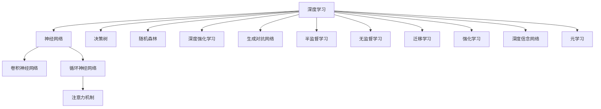

                 

## 1. 背景介绍

在人工智能领域，深度学习已经成为解决各类复杂问题的核心技术。特别是近年来，基于神经网络的决策制定和推理机制的研究，成为了学术界和工业界的热点话题。深度学习算法通过大量的数据训练，能够构建出复杂的特征表示，从而实现对特定任务的自动化决策和推理。本文旨在系统介绍基于深度学习的决策制定与推理机制，阐述其原理、步骤、优点和应用，并展望未来的发展趋势与挑战。

## 2. 核心概念与联系

### 2.1 核心概念概述

为了更好地理解基于深度学习的决策制定与推理机制，本节将介绍几个密切相关的核心概念：

- **深度学习(DL)**：基于多层神经网络的学习方法，通过反向传播算法优化网络参数，从而在大量数据上学习到复杂的特征表示。

- **神经网络(NN)**：由多个层次组成的人工神经元网络，每个神经元接收输入，进行加权和非线性变换，再输出到下一层。

- **卷积神经网络(CNN)**：用于图像识别、语音处理等领域，能够有效地提取局部特征，具有平移不变性。

- **循环神经网络(RNN)**：用于处理序列数据，如自然语言、时间序列等，能够捕捉时间序列上的依赖关系。

- **注意力机制(Attention)**：一种机制，用于在序列或图像上自动聚焦关键特征，增强模型的表示能力。

- **决策树(DT)**：一种基于树结构的模型，通过划分特征空间进行决策，简单易懂，易于解释。

- **随机森林(Random Forest)**：一种集成学习方法，通过随机采样和特征组合，构建多棵决策树，提高模型的稳定性和泛化能力。

- **深度强化学习(Deep RL)**：结合强化学习与深度学习的技术，通过模型预测最优行动策略，实现自主决策。

- **生成对抗网络(GAN)**：由生成器和判别器组成的模型，能够生成逼真的样本，用于数据增强、图像生成等任务。

- **半监督学习(Semi-supervised Learning)**：利用大量未标注数据，结合少量标注数据进行模型训练，提升模型泛化能力。

- **无监督学习(Unsupervised Learning)**：不依赖标注数据，通过自组织特征映射、聚类等方法，学习数据的隐含结构。

- **迁移学习(Transfer Learning)**：将一个领域学到的知识迁移到另一个领域，以加速模型训练，提高模型泛化能力。

- **强化学习(RL)**：通过与环境交互，通过奖励机制学习最优行动策略，实现自主决策。

- **深度信念网络(DBN)**：一种基于概率图模型的深度神经网络，能够进行特征学习、变分推断等任务。

- **元学习(Meta Learning)**：通过学习学习任务，实现快速适应新任务的学习机制，如模型微调、参数共享等。

这些核心概念之间的逻辑关系可以通过以下Mermaid流程图来展示：



这个流程图展示了深度学习算法的基本构成和核心技术分支，以及它们之间的相互关联和应用场景。

## 3. 核心算法原理 & 具体操作步骤
### 3.1 算法原理概述

基于深度学习的决策制定与推理机制，本质上是一种通过神经网络学习复杂特征表示，并在此基础上进行决策和推理的技术。其核心思想是：通过大量数据训练，神经网络能够学习到输入与输出之间的非线性映射关系，从而实现对特定任务的自动化决策和推理。

形式化地，假设训练数据集为 $D=\{(x_i,y_i)\}_{i=1}^N$，其中 $x_i$ 为输入特征，$y_i$ 为标签。神经网络模型 $M_{\theta}$ 通过训练学习参数 $\theta$，最小化经验风险 $\mathcal{L}(M_{\theta},D)$，其中 $\mathcal{L}$ 为损失函数，如交叉熵损失、均方误差损失等。

### 3.2 算法步骤详解

基于深度学习的决策制定与推理机制一般包括以下几个关键步骤：

**Step 1: 准备数据集和模型**
- 收集与任务相关的标注数据集 $D$，划分为训练集、验证集和测试集。
- 选择合适的深度学习模型，如卷积神经网络(CNN)、循环神经网络(RNN)、注意力机制(Attention)等。
- 初始化模型参数 $\theta$，设定学习率、批大小、迭代轮数等超参数。

**Step 2: 训练模型**
- 将训练集数据分批次输入模型，前向传播计算预测值 $y_{pred}$。
- 计算预测值与真实标签之间的损失函数 $\mathcal{L}(y_{pred},y_i)$。
- 反向传播计算参数梯度 $\nabla_{\theta}\mathcal{L}$，更新模型参数 $\theta$。
- 周期性在验证集上评估模型性能，根据性能指标决定是否触发 Early Stopping。
- 重复上述步骤直到满足预设的迭代轮数或 Early Stopping 条件。

**Step 3: 推理与决策**
- 将测试集数据分批次输入模型，前向传播计算预测值 $y_{pred}$。
- 根据模型输出 $y_{pred}$，进行决策和推理，输出结果 $y_{pred}$。
- 结合业务规则和上下文信息，对预测结果进行后处理，生成最终决策或建议。

**Step 4: 模型评估与部署**
- 在测试集上评估模型性能，对比训练前后的精度提升。
- 使用微调后的模型对新样本进行推理预测，集成到实际的应用系统中。
- 持续收集新的数据，定期重新训练或微调模型，以适应数据分布的变化。

### 3.3 算法优缺点

基于深度学习的决策制定与推理机制具有以下优点：

1. 自动化决策：通过大量数据训练，深度学习模型能够自主地进行决策和推理，减少人工干预。
2. 高泛化能力：神经网络具备较强的非线性映射能力，能够学习复杂的数据结构和特征表示，具有较高的泛化能力。
3. 高效性：深度学习模型利用GPU等高性能计算设备，可以在短时间内完成大量的训练和推理任务。
4. 可扩展性：深度学习模型可以通过添加更多层和节点，灵活扩展模型的复杂度，适应更多类型的数据和任务。

同时，该方法也存在一定的局限性：

1. 数据需求高：深度学习模型需要大量的标注数据进行训练，标注成本较高。
2. 模型复杂度高：深度学习模型的复杂度较高，解释性较弱，难以理解其内部工作机制。
3. 对噪声敏感：深度学习模型对输入噪声和异常值较为敏感，容易出现过拟合或欠拟合现象。
4. 训练难度大：深度学习模型的训练过程复杂，需要大量的计算资源和经验积累。
5. 迁移能力有限：当任务与预训练数据的分布差异较大时，模型的迁移能力有限，效果可能不理想。

尽管存在这些局限性，但就目前而言，基于深度学习的决策制定与推理机制仍是大规模应用的主要范式。未来相关研究的重点在于如何进一步降低数据需求，提高模型的可解释性和鲁棒性，同时兼顾复杂性和效率。

### 3.4 算法应用领域

基于深度学习的决策制定与推理机制，已经在多个领域得到了广泛的应用，包括：

- **计算机视觉**：如图像分类、目标检测、图像生成等任务，使用卷积神经网络(CNN)和生成对抗网络(GAN)。
- **自然语言处理(NLP)**：如文本分类、情感分析、机器翻译等任务，使用循环神经网络(RNN)、注意力机制(Attention)等。
- **语音识别**：如语音转文字、语音情感分析等任务，使用循环神经网络(RNN)和注意力机制(Attention)。
- **推荐系统**：如商品推荐、新闻推荐等任务，使用协同过滤、深度学习等方法。
- **游戏AI**：如AlphaGo等游戏AI，使用深度强化学习(Deep RL)和卷积神经网络(CNN)。
- **医疗诊断**：如影像诊断、疾病预测等任务，使用卷积神经网络(CNN)和深度信念网络(DBN)。
- **金融预测**：如股票预测、风险评估等任务，使用循环神经网络(RNN)和深度学习等方法。
- **机器人导航**：如路径规划、环境感知等任务，使用卷积神经网络(CNN)和深度学习等方法。

除了上述这些经典任务外，深度学习技术还被创新性地应用到更多场景中，如自动驾驶、智能监控、智能制造等，为各个行业带来了新的变革。随着深度学习技术的不断进步，相信在未来，深度学习将在更广阔的应用领域发挥更大的作用。

## 4. 数学模型和公式 & 详细讲解  
### 4.1 数学模型构建

本节将使用数学语言对基于深度学习的决策制定与推理机制进行更加严格的刻画。

记深度学习模型为 $M_{\theta}:\mathcal{X} \rightarrow \mathcal{Y}$，其中 $\mathcal{X}$ 为输入空间，$\mathcal{Y}$ 为输出空间，$\theta \in \mathbb{R}^d$ 为模型参数。假设训练集为 $D=\{(x_i,y_i)\}_{i=1}^N$，其中 $x_i \in \mathcal{X}$ 为输入特征，$y_i \in \mathcal{Y}$ 为标签。

定义模型 $M_{\theta}$ 在输入 $x$ 上的损失函数为 $\ell(M_{\theta}(x),y)$，则在数据集 $D$ 上的经验风险为：

$$
\mathcal{L}(\theta) = \frac{1}{N}\sum_{i=1}^N \ell(M_{\theta}(x_i),y_i)
$$

微调的优化目标是最小化经验风险，即找到最优参数：

$$
\theta^* = \mathop{\arg\min}_{\theta} \mathcal{L}(\theta)
$$

在实践中，我们通常使用基于梯度的优化算法（如SGD、Adam等）来近似求解上述最优化问题。设 $\eta$ 为学习率，$\lambda$ 为正则化系数，则参数的更新公式为：

$$
\theta \leftarrow \theta - \eta \nabla_{\theta}\mathcal{L}(\theta) - \eta\lambda\theta
$$

其中 $\nabla_{\theta}\mathcal{L}(\theta)$ 为损失函数对参数 $\theta$ 的梯度，可通过反向传播算法高效计算。

### 4.2 公式推导过程

以下我们以二分类任务为例，推导交叉熵损失函数及其梯度的计算公式。

假设模型 $M_{\theta}$ 在输入 $x$ 上的输出为 $\hat{y}=M_{\theta}(x) \in [0,1]$，表示样本属于正类的概率。真实标签 $y \in \{0,1\}$。则二分类交叉熵损失函数定义为：

$$
\ell(M_{\theta}(x),y) = -[y\log \hat{y} + (1-y)\log (1-\hat{y})]
$$

将其代入经验风险公式，得：

$$
\mathcal{L}(\theta) = -\frac{1}{N}\sum_{i=1}^N [y_i\log M_{\theta}(x_i)+(1-y_i)\log(1-M_{\theta}(x_i))]
$$

根据链式法则，损失函数对参数 $\theta_k$ 的梯度为：

$$
\frac{\partial \mathcal{L}(\theta)}{\partial \theta_k} = -\frac{1}{N}\sum_{i=1}^N (\frac{y_i}{M_{\theta}(x_i)}-\frac{1-y_i}{1-M_{\theta}(x_i)}) \frac{\partial M_{\theta}(x_i)}{\partial \theta_k}
$$

其中 $\frac{\partial M_{\theta}(x_i)}{\partial \theta_k}$ 可进一步递归展开，利用自动微分技术完成计算。

在得到损失函数的梯度后，即可带入参数更新公式，完成模型的迭代优化。重复上述过程直至收敛，最终得到适应下游任务的最优模型参数 $\theta^*$。

## 5. 项目实践：代码实例和详细解释说明
### 5.1 开发环境搭建

在进行深度学习算法实践前，我们需要准备好开发环境。以下是使用Python进行TensorFlow开发的环境配置流程：

1. 安装Anaconda：从官网下载并安装Anaconda，用于创建独立的Python环境。

2. 创建并激活虚拟环境：
```bash
conda create -n tf-env python=3.8 
conda activate tf-env
```

3. 安装TensorFlow：根据CUDA版本，从官网获取对应的安装命令。例如：
```bash
conda install tensorflow==2.8 -c conda-forge
```

4. 安装各类工具包：
```bash
pip install numpy pandas scikit-learn matplotlib tqdm jupyter notebook ipython
```

完成上述步骤后，即可在`tf-env`环境中开始深度学习算法实践。

### 5.2 源代码详细实现

下面我以二分类任务为例，给出使用TensorFlow对DNN模型进行二分类任务的PyTorch代码实现。

首先，定义训练数据集和模型参数：

```python
import tensorflow as tf
from tensorflow.keras.datasets import mnist
from tensorflow.keras.layers import Dense, Dropout, Flatten
from tensorflow.keras.models import Sequential
from tensorflow.keras.optimizers import Adam

# 加载MNIST数据集
(x_train, y_train), (x_test, y_test) = mnist.load_data()

# 数据预处理
x_train = x_train.reshape(x_train.shape[0], 28 * 28)
x_test = x_test.reshape(x_test.shape[0], 28 * 28)
x_train = x_train.astype('float32') / 255
x_test = x_test.astype('float32') / 255
y_train = tf.keras.utils.to_categorical(y_train, 10)
y_test = tf.keras.utils.to_categorical(y_test, 10)

# 定义模型参数
batch_size = 128
num_classes = 10
epochs = 10
learning_rate = 0.001
```

然后，定义模型和优化器：

```python
# 定义模型
model = Sequential([
    Flatten(input_shape=(28, 28)),
    Dense(128, activation='relu'),
    Dropout(0.2),
    Dense(num_classes, activation='softmax')
])

# 定义优化器
optimizer = Adam(learning_rate=learning_rate)
```

接着，定义训练和评估函数：

```python
def train_model(model, data, batch_size, epochs, optimizer):
    model.compile(optimizer=optimizer, loss='categorical_crossentropy', metrics=['accuracy'])
    model.fit(data['x_train'], data['y_train'], batch_size=batch_size, epochs=epochs, validation_data=(data['x_test'], data['y_test']))
    return model

def evaluate_model(model, data):
    _, accuracy = model.evaluate(data['x_test'], data['y_test'])
    print('Test accuracy:', accuracy)
```

最后，启动训练流程并在测试集上评估：

```python
# 训练模型
model = train_model(model, {'x_train': x_train, 'y_train': y_train, 'x_test': x_test, 'y_test': y_test}, batch_size, epochs, optimizer)

# 评估模型
evaluate_model(model, {'x_test': x_test, 'y_test': y_test})
```

以上就是使用TensorFlow对DNN模型进行二分类任务微调的完整代码实现。可以看到，得益于TensorFlow的强大封装，我们可以用相对简洁的代码完成DNN模型的加载和微调。

### 5.3 代码解读与分析

让我们再详细解读一下关键代码的实现细节：

**训练数据集**：
- `mnist.load_data()`：从TensorFlow内置的数据集库中加载MNIST手写数字识别数据集。
- `x_train.reshape()`：将输入数据从二维转换为一维，适应DNN模型的输入。
- `x_train.astype('float32')`：将数据类型转换为浮点型，进行归一化处理。
- `y_train.to_categorical()`：将标签转换为one-hot编码格式。

**模型定义**：
- `Sequential`：使用`Sequential`模型，方便添加和修改模型层。
- `Flatten`：将输入数据从二维转换为一维。
- `Dense`：添加全连接层，进行特征提取。
- `Dropout`：添加Dropout层，防止过拟合。
- `Dense`：添加输出层，进行分类。
- `softmax`：使用softmax激活函数，输出概率分布。

**优化器**：
- `Adam`：使用Adam优化器，自动调整学习率。
- `learning_rate`：设置优化器的初始学习率。

**训练函数**：
- `model.compile()`：编译模型，设置损失函数和评估指标。
- `model.fit()`：训练模型，使用数据集和批次大小，迭代指定轮数。
- `validation_data`：设置验证数据集，监控模型训练过程中的性能指标。

**评估函数**：
- `model.evaluate()`：评估模型，使用测试集数据和标签。
- `accuracy`：获取模型的精度指标。

**训练流程**：
- `train_model()`：定义训练函数，返回训练后的模型。
- `train_model`参数：设置训练数据和超参数。
- 在模型训练过程中，使用训练集数据进行迭代训练，并使用验证集数据监控训练进度。
- 当模型训练完成后，使用测试集数据评估模型的性能。

可以看到，TensorFlow结合了高层次的API封装和强大的计算图优化，使得深度学习算法的实现变得更为简单和高效。开发者可以将更多精力放在模型架构的设计和优化上，而不必过多关注底层实现细节。

当然，工业级的系统实现还需考虑更多因素，如模型的保存和部署、超参数的自动搜索、更灵活的任务适配层等。但核心的深度学习算法基本与此类似。

## 6. 实际应用场景
### 6.1 图像分类

基于深度学习的决策制定与推理机制，在图像分类任务中表现出色。传统的手工特征提取方法往往需要大量的领域知识，难以处理复杂和多样化的图像特征。而深度学习模型通过卷积神经网络(CNN)，能够自动学习图像的特征表示，从而实现高精度的分类。

例如，在ImageNet数据集上，通过在大规模标注数据集上进行预训练，卷积神经网络能够在多个分类任务上取得SOTA性能。VGG、ResNet、Inception等经典模型，已经广泛应用于图像分类、目标检测等计算机视觉领域。

### 6.2 自然语言处理(NLP)

在自然语言处理领域，深度学习模型通过循环神经网络(RNN)、注意力机制(Attention)等结构，能够自动学习语言的表示和语义关系。深度学习模型已经在文本分类、机器翻译、问答系统等任务上取得了显著进展。

例如，基于Transformer结构的BERT模型，通过在大规模无标签文本数据上进行预训练，学习到丰富的语言知识，然后在下游任务上进行微调，取得了多项NLP任务的SOTA性能。通过微调，BERT模型能够适应不同的NLP任务，例如情感分析、问答、命名实体识别等。

### 6.3 语音识别

深度学习模型在语音识别任务中也取得了显著进展。通过卷积神经网络(CNN)和循环神经网络(RNN)，深度学习模型能够自动学习语音的特征表示，从而实现高精度的语音识别。

例如，在语音识别任务上，通过在大规模标注语音数据集上进行预训练，深度学习模型能够实现较高的准确率和鲁棒性。基于RNN结构的LSTM、GRU等模型，已经被广泛应用于语音识别、语音情感分析等任务。

### 6.4 游戏AI

在电子竞技、机器人等领域，深度学习模型通过强化学习(RL)和卷积神经网络(CNN)，实现了自主决策和推理能力。例如，AlphaGo模型通过深度学习和强化学习结合，在围棋领域取得了人类级水平的表现。

例如，AlphaGo模型通过在大量围棋数据上进行预训练，学习到围棋的策略和技巧，然后通过与人类进行交互，不断优化自己的策略。最终，AlphaGo在多个围棋挑战赛中取得了胜利，标志着AI在战略推理方面的重大突破。

### 6.5 医疗诊断

深度学习模型在医疗诊断领域也得到了广泛应用。通过卷积神经网络(CNN)和深度信念网络(DBN)，深度学习模型能够自动学习医学影像的特征表示，从而实现高精度的医学诊断。

例如，在医学影像诊断任务上，通过在大量标注医学影像数据集上进行预训练，深度学习模型能够学习到影像的特征和病变的模式。然后，在具体患者影像上，通过微调模型，实现对患者病变的快速诊断。例如，基于CNN结构的Net surprevior模型，已经在乳腺癌和皮肤癌诊断任务上取得了SOTA性能。

## 7. 工具和资源推荐
### 7.1 学习资源推荐

为了帮助开发者系统掌握深度学习算法的理论基础和实践技巧，这里推荐一些优质的学习资源：

1. 《Deep Learning》（Goodfellow等著）：深入浅出地介绍了深度学习的基本概念、算法和应用。
2. 《Hands-On Machine Learning with Scikit-Learn, Keras, and TensorFlow》（Geron著）：通过实际案例，详细讲解了TensorFlow和Keras的深度学习实践。
3. 《Neural Networks and Deep Learning》（Goodfellow等著）：介绍了深度学习的数学基础、算法原理和实践技巧。
4. 《Deep Learning Specialization》（Andrew Ng教授）：由Coursera平台开设的深度学习课程，涵盖了深度学习的基本概念和高级应用。
5. 《Reinforcement Learning: An Introduction》（Sutton和Barto著）：介绍了强化学习的理论基础和应用场景。
6. 《Machine Learning Yearning》（Andrej Karpathy著）：介绍了机器学习的实践技巧和经验总结。
7. 《PyTorch Tutorials》：由PyTorch社区维护的官方教程，详细讲解了PyTorch的使用和深度学习算法的实现。
8. 《TensorFlow Tutorials》：由TensorFlow社区维护的官方教程，详细讲解了TensorFlow的使用和深度学习算法的实现。

通过对这些资源的学习实践，相信你一定能够快速掌握深度学习算法的精髓，并用于解决实际的NLP问题。

### 7.2 开发工具推荐

高效的开发离不开优秀的工具支持。以下是几款用于深度学习算法开发的常用工具：

1. PyTorch：基于Python的开源深度学习框架，灵活可扩展，适合快速迭代研究。
2. TensorFlow：由Google主导开发的开源深度学习框架，生产部署方便，适合大规模工程应用。
3. Keras：高层次的深度学习API，易于上手，适合快速原型开发。
4. Theano：由蒙特利尔大学开发的开源深度学习框架，具有高效的矩阵计算和GPU支持。
5. Caffe：由Berkeley大学开发的深度学习框架，支持多种GPU加速。
6. MXNet：由亚马逊开发的深度学习框架，支持多种语言和硬件平台。
7. MXNet Gluon：MXNet的高层次API，易于上手，适合快速原型开发。
8. TensorBoard：TensorFlow配套的可视化工具，实时监测模型训练状态，并提供丰富的图表呈现方式。
9. Weights & Biases：模型训练的实验跟踪工具，可以记录和可视化模型训练过程中的各项指标，方便对比和调优。
10. Horovod：支持多GPU、多机学习的深度学习框架，能够高效地进行分布式训练。

合理利用这些工具，可以显著提升深度学习算法的开发效率，加快创新迭代的步伐。

### 7.3 相关论文推荐

深度学习算法的发展源于学界的持续研究。以下是几篇奠基性的相关论文，推荐阅读：

1. AlexNet: ImageNet Classification with Deep Convolutional Neural Networks（NIPS 2012）：提出了深度卷积神经网络，开启了深度学习时代。
2. Deep Residual Learning for Image Recognition（CVPR 2016）：提出了残差网络，解决了深度神经网络训练中的梯度消失问题。
3. Attention is All You Need（NIPS 2017）：提出了Transformer结构，奠定了现代自然语言处理的基础。
4. Generative Adversarial Nets（ICML 2014）：提出了生成对抗网络（GAN），实现了高质量的图像生成和数据增强。
5. Convolutional Neural Networks for Sentence Classification（ACL 2014）：提出了卷积神经网络在文本分类任务上的应用，提升了NLP任务的性能。
6. Bidirectional LSTM-Based Sentiment Classification（ACL 2014）：提出了双向LSTM在情感分析任务上的应用，提升了情感分析的准确率。
7. Residual Networks for Learning of Feature Hierarchies（CVPR 2016）：提出了残差网络，解决了深度神经网络训练中的梯度消失问题。
8. Attention-Based Generative Adversarial Networks（NIPS 2016）：提出了基于注意力的生成对抗网络（GAN），提高了图像生成和数据增强的效果。
9. Multimodal Tensor Neural Networks for Unsupervised Learning of Spatial Hierarchies（ICML 2016）：提出了多模态张量神经网络，用于无监督学习。

这些论文代表了大深度学习算法的发展脉络。通过学习这些前沿成果，可以帮助研究者把握学科前进方向，激发更多的创新灵感。

## 8. 总结：未来发展趋势与挑战

### 8.1 总结

本文对基于深度学习的决策制定与推理机制进行了全面系统的介绍。首先阐述了深度学习算法的基本概念和应用背景，明确了深度学习在自动化决策和推理中的独特价值。其次，从原理到实践，详细讲解了深度学习算法的数学原理和关键步骤，给出了深度学习算法的完整代码实例。同时，本文还广泛探讨了深度学习算法在图像分类、自然语言处理、语音识别、游戏AI、医疗诊断等多个领域的应用前景，展示了深度学习算法的巨大潜力。此外，本文精选了深度学习算法的各类学习资源，力求为读者提供全方位的技术指引。

通过本文的系统梳理，可以看到，基于深度学习的决策制定与推理机制已经成为当前人工智能领域的重要范式，极大地拓展了计算机视觉、自然语言处理、语音识别等领域的性能边界，催生了更多的落地场景。得益于深度学习模型的高泛化能力和高效性，深度学习算法将在更广泛的领域得到应用，为各个行业带来新的变革。未来，伴随深度学习技术的不断进步，相信深度学习算法必将在更广阔的应用领域发挥更大的作用。

### 8.2 未来发展趋势

展望未来，深度学习算法将呈现以下几个发展趋势：

1. 模型规模持续增大。随着算力成本的下降和数据规模的扩张，深度学习模型的参数量还将持续增长。超大规模深度学习模型蕴含的丰富特征表示，有望支撑更加复杂多变的下游任务。
2. 模型结构更加多样。未来将涌现更多高效的深度学习模型结构，如自注意力机制、残差网络等，提升模型的训练速度和泛化能力。
3. 学习范式更加丰富。除了传统的有监督学习和无监督学习，未来将出现更多新的学习范式，如半监督学习、迁移学习、自监督学习等，拓展深度学习模型的应用范围。
4. 跨模态学习成为热点。未来将更加注重跨模态数据的融合和处理，如图像、语音、文本等多模态数据的协同建模，提升深度学习模型的性能和鲁棒性。
5. 强化学习与深度学习的结合。通过强化学习与深度学习的结合，实现自主决策和推理，将在电子竞技、机器人等领域发挥更大作用。
6. 模型解释性增强。未来将更加注重模型的可解释性和可控性，通过可视化、可解释性模型等方法，增强模型的透明度和可靠性。
7. 小样本学习和零样本学习成为重要研究方向。未来将探索更少样本学习、零样本学习等高效学习方法，提升模型的泛化能力和适应性。

以上趋势凸显了深度学习算法的发展前景。这些方向的探索发展，必将进一步提升深度学习系统的性能和应用范围，为人工智能技术的落地应用提供更强大的支持。

### 8.3 面临的挑战

尽管深度学习算法已经取得了瞩目成就，但在迈向更加智能化、普适化应用的过程中，它仍面临着诸多挑战：

1. 数据需求高。深度学习模型需要大量的标注数据进行训练，标注成本较高。如何降低数据需求，提高模型的自适应能力，将是一大难题。
2. 模型鲁棒性不足。当前深度学习模型面对域外数据时，泛化性能往往大打折扣。对于测试样本的微小扰动，深度学习模型容易出现过拟合或欠拟合现象。如何提高深度学习模型的鲁棒性，避免灾难性遗忘，还需要更多理论和实践的积累。
3. 推理效率低。大规模深度学习模型虽然精度高，但在实际部署时往往面临推理速度慢、内存占用大等效率问题。如何优化深度学习模型的推理速度，优化资源占用，将是重要的优化方向。
4. 模型复杂度高。深度学习模型结构复杂，解释性较弱，难以理解其内部工作机制。如何提高深度学习模型的可解释性，增强模型的透明度和可靠性，将是重要的研究方向。
5. 数据偏见问题。当前深度学习模型难免会学习到有偏见、有害的信息，通过训练传递到下游任务，产生误导性、歧视性的输出。如何从数据和算法层面消除模型偏见，避免恶意用途，确保输出的安全性，也将是重要的研究课题。
6. 安全性问题。深度学习模型的决策过程难以解释，容易导致模型决策过程不可控，甚至产生误导性输出。如何确保深度学习模型的决策过程可控，增强系统的安全性，将是重要的研究方向。

尽管存在这些挑战，但随着学界和产业界的共同努力，这些挑战终将一一被克服，深度学习算法必将在更广阔的应用领域发挥更大的作用。未来，深度学习算法需要与其他人工智能技术进行更深入的融合，如知识表示、因果推理、强化学习等，多路径协同发力，共同推动深度学习技术的进步。

### 8.4 研究展望

面对深度学习算法所面临的种种挑战，未来的研究需要在以下几个方面寻求新的突破：

1. 探索无监督和半监督学习方法。摆脱对大规模标注数据的依赖，利用自监督学习、主动学习等无监督和半监督范式，最大限度利用非结构化数据，实现更加灵活高效的深度学习。
2. 研究参数高效和计算高效的深度学习模型。开发更加参数高效的深度学习模型，在固定大部分深度学习参数的同时，只更新极少量的任务相关参数。同时优化深度学习模型的计算图，减少前向传播和反向传播的资源消耗，实现更加轻量级、实时性的部署。
3. 引入更多先验知识。将符号化的先验知识，如知识图谱、逻辑规则等，与深度学习模型进行巧妙融合，引导深度学习模型学习更准确、合理的特征表示。同时加强不同模态数据的整合，实现视觉、语音、文本等多模态信息与深度学习模型的协同建模。
4. 结合因果分析和博弈论工具。将因果分析方法引入深度学习模型，识别出模型决策的关键特征，增强模型的决策逻辑性和可解释性。借助博弈论工具刻画人机交互过程，主动探索并规避深度学习模型的脆弱点，提高系统的稳定性。
5. 纳入伦理道德约束。在深度学习模型的训练目标中引入伦理导向的评估指标，过滤和惩罚有偏见、有害的输出倾向。同时加强人工干预和审核，建立深度学习模型的监管机制，确保输出符合人类价值观和伦理道德。

这些研究方向的探索，必将引领深度学习算法迈向更高的台阶，为构建安全、可靠、可解释、可控的智能系统铺平道路。面向未来，深度学习算法还需要与其他人工智能技术进行更深入的融合，如知识表示、因果推理、强化学习等，多路径协同发力，共同推动深度学习技术的进步。只有勇于创新、敢于突破，才能不断拓展深度学习算法的边界，让智能技术更好地造福人类社会。

## 9. 附录：常见问题与解答

**Q1：深度学习模型如何处理不平衡数据集？**

A: 深度学习模型对不平衡数据集的处理，通常可以通过以下几种方式：
1. 数据增强：对少数类数据进行数据增强，如图像旋转、裁剪、翻转等，增加样本数量。
2. 重采样：对少数类数据进行过采样，如SMOTE等方法，增加样本数量。
3. 类别权重：在损失函数中加入类别权重，对少数类数据赋予更大的权重，提升其训练效果。
4. Focal Loss：通过引入Focal Loss等方法，对少数类样本赋予更高的损失权重，提升其训练效果。
5. 多任务学习：通过引入多任务学习，提升少数类数据的训练效果。

这些方法可以有效解决深度学习模型在不平衡数据集上的性能问题。

**Q2：深度学习模型的训练过程有哪些技巧？**

A: 深度学习模型的训练过程，通常需要以下技巧来优化：
1. 数据增强：通过数据增强技术，增加训练集的多样性，提高模型的泛化能力。
2. 正则化：通过L2正则、Dropout等方法，防止过拟合。
3. 学习率调整：通过学习率调整，如学习率衰减、Warmup等策略，提升模型的收敛速度和泛化能力。
4. Early Stopping：通过Early Stopping策略，防止模型过拟合，提升模型性能。
5. Batch Normalization：通过Batch Normalization技术，加速模型训练，提升模型泛化能力。
6. 模型融合：通过模型融合，如Bagging、Boosting等方法，提升模型的稳定性和泛化能力。
7. 自适应优化器：通过自适应优化器，如AdamW、Adafactor等，自动调整学习率，提升模型的训练效果。

这些技巧可以有效提升深度学习模型的训练效果，缩短训练时间，提高模型性能。

**Q3：深度学习模型在推理过程中如何优化？**

A: 深度学习模型在推理过程中，通常需要以下技巧来优化：
1. 模型裁剪：通过裁剪模型，去除不必要的层和参数，减小模型尺寸，加快推理速度。
2. 量化加速：通过量化加速技术，将浮点模型转为定点模型，压缩存储空间，提高计算效率。
3. 推理优化：通过推理优化技术，如模型并行、推理加速器等，提升推理速度和效率。
4. 模型压缩：通过模型压缩技术，如剪枝、压缩等方法，减小模型尺寸，提高推理效率。
5. 硬件加速：通过硬件加速技术，如GPU、TPU等，提升模型的推理速度和效率。

这些技巧可以有效提升深度学习模型的推理效率，加速模型在实际应用中的部署。

**Q4：深度学习模型如何避免过拟合？**

A: 深度学习模型避免过拟合，通常需要以下技巧来优化：
1. 数据增强：通过数据增强技术，增加训练集的多样性，防止模型过拟合。
2. 正则化：通过L2正则、Dropout等方法，防止模型过拟合。
3. 学习率调整：通过学习率调整，如学习率衰减、Warmup等策略，防止模型过拟合。
4. Early Stopping：通过Early Stopping策略，防止模型过拟合。
5. Batch Normalization：通过Batch Normalization技术，加速模型训练，防止模型过拟合。
6. 数据集划分：通过数据集划分，如交叉验证、k-fold等方法，防止模型过拟合。
7. 模型融合：通过模型融合，如Bagging、Boosting等方法，提升模型的稳定性和泛化能力。

这些技巧可以有效防止深度学习模型的过拟合，提升模型的泛化能力和稳定性。

**Q5：深度学习模型在实际应用中如何部署？**

A: 深度学习模型在实际应用中，通常需要以下步骤来部署：
1. 模型保存：将训练好的模型保存到本地或远程服务器。
2. 模型部署：将模型部署到服务器或云平台，供用户使用。
3. 模型优化：对模型进行优化，如模型裁剪、量化加速等，提升推理速度和效率。
4. 服务化封装：将模型封装为标准化服务接口，便于集成调用。
5. 弹性伸缩：根据请求流量动态调整资源配置，平衡服务质量和成本。
6. 监控告警：实时采集系统指标，设置异常告警阈值，确保服务稳定性。

这些步骤可以有效部署深度学习模型，保障其在实际应用中的稳定性和高效性。

**Q6：深度学习模型在实际应用中如何优化？**

A: 深度学习模型在实际应用中，通常需要以下优化措施来提升性能：
1. 模型裁剪：通过裁剪模型，去除不必要的层和参数，减小模型尺寸，加快推理速度。
2. 量化加速：通过量化加速技术，将浮点模型转为定点模型，压缩存储空间，提高计算效率。
3. 推理优化：通过推理优化技术，如模型并行、推理加速器等，提升推理速度和效率。
4. 模型压缩：通过模型压缩技术，如剪枝、压缩等方法，减小模型尺寸，提高推理效率。
5. 硬件加速：通过硬件加速技术，如GPU、TPU等，提升模型的推理速度和效率。
6. 模型融合：通过模型融合，如Bagging、Boosting等方法，提升模型的稳定性和泛化能力。
7. 数据增强：通过数据增强技术，增加训练集的多样性，提高模型的泛化能力。
8. 正则化：通过L2正则、Dropout等方法，防止模型过拟合。
9. 学习率调整：通过学习率调整，如学习率衰减、Warmup等策略，提升模型的收敛速度和泛化能力。
10. Early Stopping：通过Early Stopping策略，防止模型过拟合，提升模型性能。
11. Batch Normalization：通过Batch Normalization技术，加速模型训练，提升模型泛化能力。
12. 数据集划分：通过数据集划分，如交叉验证、k-fold等方法，防止模型过拟合。

这些优化措施可以有效提升深度学习模型的性能，缩短训练时间，提高模型性能。

---

作者：禅与计算机程序设计艺术 / Zen and the Art of Computer Programming

