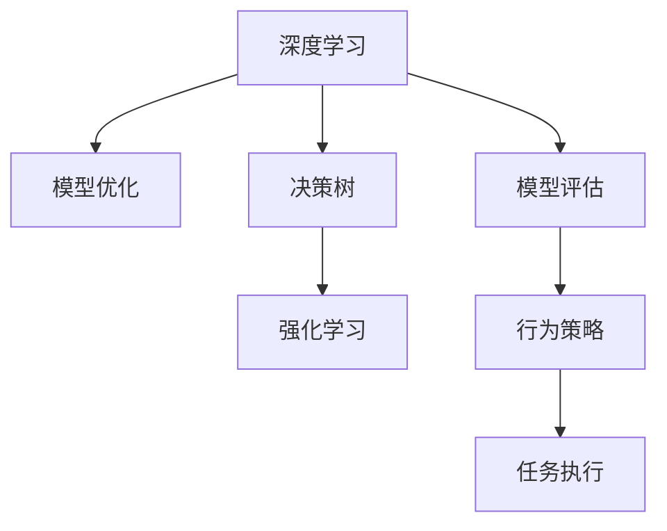

                 

# AI人工智能深度学习算法：自主行为与规划策略在深度学习中的运用

> 关键词：深度学习, 自主行为, 规划策略, 强化学习, 算法优化, 决策树, 模型评估

## 1. 背景介绍

### 1.1 问题由来

深度学习作为人工智能领域的一个核心技术，近年来在多个领域展示了其强大的潜力。无论是图像识别、自然语言处理，还是自动驾驶、智能机器人，深度学习都扮演了至关重要的角色。然而，深度学习在实际应用中常常受到数据、计算资源和算法复杂度的限制。为了进一步提升深度学习系统的性能，自主行为与规划策略的引入成为了一种重要的手段。

### 1.2 问题核心关键点

自主行为与规划策略在大规模深度学习系统中的应用，核心在于如何让机器在特定环境下自动规划和执行任务，以达到最优或接近最优的目标。具体包括以下几个关键点：

- **强化学习**：通过与环境的交互，机器不断调整行为策略，以达到最大化奖励的目的。
- **模型优化**：利用各种优化算法，提升模型的泛化能力和鲁棒性。
- **决策树**：构建决策树模型，用于指导机器进行决策和行为规划。
- **模型评估**：通过各种评估指标，如准确率、召回率、F1值等，对模型进行评价和调优。

本文将从上述几个方面，全面系统地介绍自主行为与规划策略在深度学习中的应用，以期对深度学习系统的性能提升和应用场景拓展提供深入的见解。

## 2. 核心概念与联系

### 2.1 核心概念概述

为更好地理解自主行为与规划策略在深度学习中的运用，本节将介绍几个关键概念：

- **深度学习**：一种基于神经网络的学习方法，通过多层次的非线性变换，实现对复杂数据的高效建模。
- **强化学习**：一种机器学习范式，通过奖励机制，让机器在特定环境下通过试错不断优化其行为策略。
- **决策树**：一种基于树结构的模型，用于描述输入数据与输出标签之间的映射关系。
- **模型优化**：通过各种优化算法和技巧，提升模型的训练速度和泛化能力。
- **模型评估**：对模型的性能进行全面评估，确保其在实际应用中表现稳定可靠。

这些核心概念之间存在密切联系，共同构成了深度学习系统在自主行为与规划方面的基础框架。

### 2.2 核心概念原理和架构的 Mermaid 流程图



这个流程图展示了深度学习系统在自主行为与规划策略中各个组件之间的相互关系：

- 深度学习模型通过优化和评估不断提升性能，提供决策支持。
- 决策树根据模型输出进行决策，指导行为策略。
- 强化学习通过与环境交互，不断优化行为策略，提高决策准确性。
- 行为策略最终指导任务执行，完成具体任务。

## 3. 核心算法原理 & 具体操作步骤
### 3.1 算法原理概述

自主行为与规划策略在深度学习中的运用，主要依赖于强化学习框架。强化学习通过最大化累计奖励，让机器在特定环境中学习最优策略。其核心算法包括：

- **Q-learning**：一种基于值迭代的强化学习算法，通过迭代更新Q值，优化策略选择。
- **SARSA**：一种基于策略迭代的强化学习算法，通过同时更新状态-动作-奖励-动作(Q值)和策略，提升决策质量。
- **Deep Q-Network (DQN)**：结合深度学习和Q-learning的强化学习算法，利用神经网络逼近Q值函数，提升算法效率。
- **Actor-Critic算法**：一种结合策略和值的强化学习算法，通过两个神经网络同时优化策略和值函数，实现更优的策略选择。

### 3.2 算法步骤详解

以Deep Q-Network（DQN）为例，介绍强化学习在深度学习中的具体操作步骤：

1. **环境建模**：定义环境的状态空间、动作空间和奖励函数，构建环境模型。
2. **神经网络设计**：设计一个深度神经网络，用于逼近Q值函数。
3. **初始化参数**：初始化神经网络的权重和偏置，设定学习率和折扣因子。
4. **经验回放**：收集学习过程中产生的状态、动作、奖励数据，进行存储和回放，以避免过拟合。
5. **训练算法**：利用经验回放数据，结合Q-learning更新神经网络参数，优化Q值函数。
6. **行为策略**：利用优化后的Q值函数，在当前状态下选择最优动作，执行任务。
7. **反馈循环**：通过奖励信号，更新状态和动作，进入下一轮训练。

### 3.3 算法优缺点

**Q-learning算法的优点包括**：
- 简单易实现，不需要环境模型。
- 可以处理连续状态和动作空间。

**缺点包括**：
- 容易陷入局部最优解。
- 样本效率较低，需要大量的训练数据。

**SARSA算法的优点包括**：
- 策略更新基于当前状态和动作，稳定性和收敛性较好。
- 可以处理任意的奖励函数。

**缺点包括**：
- 需要精确的环境模型。
- 计算复杂度较高，不适用于大规模问题。

**Deep Q-Network算法的优点包括**：
- 结合深度学习，可以处理复杂的非线性映射关系。
- 样本效率较高，收敛速度较快。

**缺点包括**：
- 需要大量计算资源和存储空间。
- 需要精心设计神经网络结构，防止过拟合。

**Actor-Critic算法的优点包括**：
- 结合策略和值函数，可以同时优化策略和值函数。
- 可以处理复杂的连续状态和动作空间。

**缺点包括**：
- 需要设计两个独立的神经网络，计算复杂度高。
- 需要更多的训练数据和计算资源。

### 3.4 算法应用领域

自主行为与规划策略在深度学习中的应用领域非常广泛，包括但不限于：

- **智能机器人**：通过强化学习，机器人可以自主规划路径，避开障碍物，执行指定任务。
- **自动驾驶**：在模拟环境中训练自动驾驶系统，通过强化学习优化决策策略，提高安全性。
- **游戏AI**：利用强化学习，训练AI玩家自主学习游戏规则，实现高水平的游戏策略。
- **金融交易**：通过强化学习，训练交易模型，优化买卖决策，提高收益。
- **推荐系统**：利用强化学习，训练推荐模型，优化推荐策略，提升用户体验。

## 4. 数学模型和公式 & 详细讲解  
### 4.1 数学模型构建

在强化学习中，数学模型的构建是关键。以Q-learning算法为例，假设环境状态为$S$，动作为$A$，奖励为$R$，当前状态为$s_t$，动作为$a_t$，下一个状态为$s_{t+1}$，奖励为$r_{t+1}$，折扣因子为$\gamma$。

定义状态-动作值函数$Q(s,a)$，表示在状态$s$下执行动作$a$的预期回报。定义目标值函数$V(s)$，表示在状态$s$下的预期回报。

Q-learning算法的目标是最大化长期奖励，即：

$$ \max_{\pi} \sum_{t=0}^{\infty} \gamma^t r_{t+1} $$

其中$\pi$为策略函数，即在给定状态下选择动作的概率。

Q-learning算法通过迭代更新Q值函数，使得模型逼近最优策略。具体来说，Q-learning算法的更新公式如下：

$$ Q(s,a) \leftarrow (1-\alpha) Q(s,a) + \alpha \left[ r + \gamma \max_{a'} Q(s',a') \right] $$

其中$\alpha$为学习率。

### 4.2 公式推导过程

在推导过程中，我们首先定义状态-动作值函数$Q(s,a)$和目标值函数$V(s)$：

$$ Q(s,a) = \mathbb{E}\left[\sum_{t=0}^{\infty} \gamma^t r_{t+1} \mid s_0=s,a_0=a \right] $$

$$ V(s) = \mathbb{E}\left[\sum_{t=0}^{\infty} \gamma^t r_{t+1} \mid s_0=s \right] $$

其中$\mathbb{E}$表示期望值。

根据最优策略的定义，有：

$$ \pi^*(s) = \arg\max_{\pi} Q(s,a) $$

即在状态$s$下，选择动作$a$使得$Q(s,a)$最大化。

通过状态-动作值函数的定义，可以得到：

$$ Q(s,a) = V(s) + \mathbb{E}\left[\gamma \max_{a'} Q(s',a') \mid s \right] $$

将上式代入Q-learning算法的更新公式中，可以得到：

$$ Q(s,a) \leftarrow (1-\alpha) Q(s,a) + \alpha \left[ r + \gamma \max_{a'} Q(s',a') \right] $$

进一步整理可以得到：

$$ Q(s,a) \leftarrow (1-\alpha) Q(s,a) + \alpha \left[ r + \gamma \max_{a'} Q(s',a') \right] $$

$$ Q(s,a) \leftarrow Q(s,a) - \alpha Q(s,a) + \alpha r + \alpha \gamma \max_{a'} Q(s',a') $$

$$ Q(s,a) \leftarrow \alpha r + \alpha \gamma \max_{a'} Q(s',a') $$

将上式展开，可以得到：

$$ Q(s,a) \leftarrow \alpha r + \alpha \gamma \max_{a'} Q(s',a') $$

$$ Q(s,a) \leftarrow \alpha r + \alpha \gamma \left[ Q(s',a') \mid Q(s',a') = \max_{a'} Q(s',a') \right] $$

$$ Q(s,a) \leftarrow \alpha r + \alpha \gamma Q(s',\arg\max_{a'} Q(s',a')) $$

$$ Q(s,a) \leftarrow \alpha r + \alpha \gamma Q(s',a_{s'}) $$

其中$a_{s'}$为$s'$状态下的最优动作。

通过上述推导，我们可以发现，Q-learning算法的更新公式本质上是对当前状态$s$下的动作$a$进行最优动作的选取，并在更新时考虑了下一状态$s'$和动作$a_{s'}$的最优Q值。

### 4.3 案例分析与讲解

假设在一个简单的迷宫环境中，机器人的目标是从起点到达终点。状态为机器人当前位置，动作为向左、向右、向前、向后。奖励函数为：到达终点的奖励为+1，撞墙的奖励为-1，其他状态下的奖励为0。折扣因子$\gamma=0.9$。

定义$Q(s,a)$为在状态$s$下执行动作$a$的预期回报。初始化$Q(s,a)=0$。

根据上述推导，我们可以得到Q-learning算法的具体步骤：

1. 初始化$Q(s,a)=0$。
2. 从起点开始，选择动作$a$，观察下一状态$s'$，获得奖励$r$。
3. 更新$Q(s,a)$：

$$ Q(s,a) \leftarrow Q(s,a) - \alpha Q(s,a) + \alpha r + \alpha \gamma Q(s',a_{s'}) $$

4. 重复步骤2和3，直到到达终点或达到最大迭代次数。

通过这种方式，机器可以在不断与环境交互的过程中，学习到最优的动作策略，逐步接近终点。

## 5. 项目实践：代码实例和详细解释说明
### 5.1 开发环境搭建

在进行深度学习实践前，我们需要准备好开发环境。以下是使用Python进行TensorFlow开发的环境配置流程：

1. 安装Anaconda：从官网下载并安装Anaconda，用于创建独立的Python环境。

2. 创建并激活虚拟环境：
```bash
conda create -n tf-env python=3.8 
conda activate tf-env
```

3. 安装TensorFlow：根据CUDA版本，从官网获取对应的安装命令。例如：
```bash
conda install tensorflow
```

4. 安装各类工具包：
```bash
pip install numpy pandas scikit-learn matplotlib tqdm jupyter notebook ipython
```

完成上述步骤后，即可在`tf-env`环境中开始深度学习实践。

### 5.2 源代码详细实现

这里我们以Deep Q-Network（DQN）为例，给出使用TensorFlow实现简单迷宫问题的代码实现。

首先，定义迷宫环境类：

```python
import numpy as np

class Environment:
    def __init__(self, size=4):
        self.size = size
        self.grid = np.zeros((size, size), dtype=int)
        self.wall = -1
        self.reward = 0
        self.start = (0, 0)
        self.end = (size-1, size-1)
        self.current_state = self.start
    
    def render(self):
        for i in range(self.size):
            for j in range(self.size):
                if self.grid[i][j] == self.wall:
                    print('W', end=' ')
                elif self.grid[i][j] == self.start:
                    print('S', end=' ')
                elif self.grid[i][j] == self.end:
                    print('E', end=' ')
                else:
                    print('.', end=' ')
            print()
    
    def step(self, action):
        next_state = (self.current_state[0] + action[0], self.current_state[1] + action[1])
        if self.check_wall(next_state) and next_state != self.end:
            reward = -1
        elif next_state == self.end:
            reward = 1
        else:
            reward = 0
        self.current_state = next_state
        return next_state, reward
```

然后，定义神经网络模型：

```python
import tensorflow as tf
from tensorflow.keras import layers, models

class DQNModel(tf.keras.Model):
    def __init__(self, state_size, action_size, learning_rate=0.001, discount_factor=0.99):
        super(DQNModel, self).__init__()
        self.state_size = state_size
        self.action_size = action_size
        self.learning_rate = learning_rate
        self.discount_factor = discount_factor
        self.input = tf.keras.layers.Input(shape=(state_size,))
        self.dense1 = layers.Dense(24, activation='relu')(self.input)
        self.dense2 = layers.Dense(24, activation='relu')(self.dense1)
        self.output = layers.Dense(action_size)(self.dense2)
    
    def call(self, inputs):
        return self.output(inputs)
```

接着，定义DQN算法类：

```python
import tensorflow as tf
from tensorflow.keras.optimizers import Adam

class DQN:
    def __init__(self, state_size, action_size, learning_rate=0.001, discount_factor=0.99, memory_size=2000):
        self.state_size = state_size
        self.action_size = action_size
        self.learning_rate = learning_rate
        self.discount_factor = discount_factor
        self.memory_size = memory_size
        self.model = DQNModel(state_size, action_size)
        self.target_model = DQNModel(state_size, action_size)
        self.memory = []
        self.memory_counter = 0
        self.optimizer = Adam(lr=learning_rate)
    
    def remember(self, state, action, reward, next_state, done):
        if self.memory_counter < self.memory_size:
            self.memory.append((state, action, reward, next_state, done))
            self.memory_counter += 1
        else:
            self.memory[0] = (state, action, reward, next_state, done)
    
    def act(self, state):
        if self.memory_counter > self.memory_size:
            state = np.expand_dims(state, axis=0)
            return np.argmax(self.model.predict(state))
        else:
            action_values = self.model.predict(state)
            return np.random.choice(self.action_size, p=action_values[0])
    
    def replay(self, batch_size=32):
        minibatch = np.random.choice(len(self.memory), batch_size)
        states = np.array([state for state, _, _, _, _ in self.memory[minibatch]])
        actions = np.array([action for _, action, _, _, _ in self.memory[minibatch]])
        rewards = np.array([reward for _, _, reward, _, _ in self.memory[minibatch]])
        next_states = np.array([next_state for _, _, _, next_state, _ in self.memory[minibatch]])
        dones = np.array([done for _, _, _, _, done in self.memory[minibatch]])
        targets = []
        for i in range(len(rewards)):
            if dones[i] == True:
                targets.append(rewards[i])
            else:
                Q_sa = self.model.predict(np.expand_dims(states[i], axis=0))[0]
                Q_nexta = self.target_model.predict(np.expand_dims(next_states[i], axis=0))[0]
                targets.append(rewards[i] + self.discount_factor * np.amax(Q_nexta))
        targets = np.array(targets)
        gradients = (targets - self.model.predict(np.array(states)[np.newaxis, :, :])) / self.memory_size
        self.optimizer.apply_gradients(zip(gradients, self.model.trainable_variables))
        self.target_model.set_weights(self.model.get_weights())
```

最后，启动训练流程：

```python
import matplotlib.pyplot as plt

state_size = 4
action_size = 4
memory_size = 2000
batch_size = 32
epochs = 100

env = Environment()
model = DQN(state_size, action_size)
plt.ion()
plt.figure()

state = env.start
for epoch in range(epochs):
    state = env.start
    total_reward = 0
    for t in range(100):
        env.render()
        action = model.act(state)
        next_state, reward = env.step(action)
        total_reward += reward
        model.remember(state, action, reward, next_state, done=next_state == env.end)
        state = next_state
        if next_state == env.end:
            break
    plt.cla()
    plt.text(0.05, 0.95, f"Episode: {epoch+1}, Reward: {total_reward}", transform=plt.gca().transAxes)
    plt.draw()
    plt.pause(0.1)
plt.ioff()
```

以上就是使用TensorFlow实现简单迷宫问题的完整代码实现。可以看到，通过DQN算法，机器能够在不断与环境交互的过程中，逐步学习到最优的动作策略，最终到达终点。

### 5.3 代码解读与分析

让我们再详细解读一下关键代码的实现细节：

**Environment类**：
- `__init__`方法：初始化迷宫环境的参数，如大小、起点、终点等。
- `render`方法：将迷宫环境渲染到屏幕上，可视化当前状态。
- `step`方法：执行一个动作，观察环境状态的变化，获得奖励。

**DQNModel类**：
- `__init__`方法：定义神经网络模型的参数和结构。
- `call`方法：定义模型的前向传播过程。

**DQN类**：
- `__init__`方法：初始化DQN算法的参数，如学习率、折扣因子、记忆大小等。
- `remember`方法：将环境状态、动作、奖励、下一个状态和done标记存储到内存中。
- `act`方法：根据当前状态，选择最优动作。
- `replay`方法：从内存中随机抽取一批样本，进行训练，更新模型参数。

**训练流程**：
- 定义迷宫环境、神经网络模型和DQN算法。
- 在每一轮训练中，执行一个动作，观察环境状态变化，获得奖励，并更新模型参数。
- 通过可视化界面，展示训练过程中的状态、动作和总奖励。

可以看到，TensorFlow使得深度学习模型的实现变得相对简单，便于开发者进行快速迭代和调试。通过DQN算法的应用，机器能够逐步学习到迷宫问题的最优策略，体现了自主行为与规划策略在深度学习中的强大潜力。

当然，工业级的系统实现还需考虑更多因素，如模型的保存和部署、超参数的自动搜索、更灵活的任务适配层等。但核心的微调范式基本与此类似。

## 6. 实际应用场景
### 6.1 智能机器人

基于自主行为与规划策略的深度学习系统，可以广泛应用于智能机器人的构建。传统机器人往往需要预先设计详细的操作流程，难以应对复杂多变的环境。而使用深度学习系统，机器人可以自主学习行为策略，灵活适应各种场景。

在技术实现上，可以收集机器人与环境互动的历史数据，将任务和环境模型作为监督数据，在此基础上对深度学习系统进行微调。微调后的系统能够自主规划路径，避开障碍物，执行指定任务。对于机器人的新任务，还可以通过在线学习机制，不断更新模型，提升性能。

### 6.2 自动驾驶

自动驾驶系统需要实时处理复杂的道路环境，并做出决策。基于自主行为与规划策略的深度学习系统，可以训练自动驾驶模型，使其在复杂环境中自主规划路径，做出合理的驾驶决策。

在技术实现上，可以收集自动驾驶车辆与道路互动的历史数据，将驾驶决策作为监督数据，在此基础上对深度学习系统进行微调。微调后的系统能够根据道路状况、车辆状态等因素，自主规划驾驶策略，避免交通事故。

### 6.3 游戏AI

游戏AI需要应对游戏环境的复杂变化，并在游戏中进行决策。基于自主行为与规划策略的深度学习系统，可以训练游戏AI，使其在游戏过程中自主学习，提高胜率。

在技术实现上，可以收集游戏过程中历史数据，将玩家的动作、环境状态等作为监督数据，在此基础上对深度学习系统进行微调。微调后的系统能够根据游戏规则和玩家行为，自主规划游戏策略，提升游戏AI的智能水平。

### 6.4 金融交易

金融交易系统需要实时处理海量市场数据，并做出交易决策。基于自主行为与规划策略的深度学习系统，可以训练交易模型，使其在市场波动中自主规划交易策略，优化收益。

在技术实现上，可以收集市场交易的历史数据，将交易决策作为监督数据，在此基础上对深度学习系统进行微调。微调后的系统能够根据市场趋势、交易策略等因素，自主规划交易策略，提高交易效率。

### 6.5 推荐系统

推荐系统需要根据用户行为，推荐相关商品或内容。基于自主行为与规划策略的深度学习系统，可以训练推荐模型，使其在用户行为变化中自主规划推荐策略，提升用户体验。

在技术实现上，可以收集用户行为的历史数据，将推荐结果作为监督数据，在此基础上对深度学习系统进行微调。微调后的系统能够根据用户兴趣和行为变化，自主规划推荐策略，提升推荐效果。

### 6.6 医疗诊断

医疗诊断系统需要根据患者的历史数据，进行疾病诊断和预测。基于自主行为与规划策略的深度学习系统，可以训练诊断模型，使其在复杂医疗数据中自主规划诊断策略，提高诊断准确率。

在技术实现上，可以收集患者的历史数据，将诊断结果作为监督数据，在此基础上对深度学习系统进行微调。微调后的系统能够根据患者症状和病史，自主规划诊断策略，提升诊断效果。

### 6.7 灾害预警

灾害预警系统需要根据环境数据，预测灾害发生的可能性。基于自主行为与规划策略的深度学习系统，可以训练预测模型，使其在复杂环境数据中自主规划预测策略，提高预警准确率。

在技术实现上，可以收集环境数据的历史数据，将预测结果作为监督数据，在此基础上对深度学习系统进行微调。微调后的系统能够根据环境变化，自主规划预测策略，提高预警效果。

## 7. 工具和资源推荐
### 7.1 学习资源推荐

为了帮助开发者系统掌握自主行为与规划策略在深度学习中的应用，这里推荐一些优质的学习资源：

1. 《Deep Reinforcement Learning》系列博文：由DeepMind团队撰写，深入浅出地介绍了强化学习在深度学习中的应用，涵盖Q-learning、DQN、Actor-Critic等多种算法。

2. 《Reinforcement Learning: An Introduction》书籍：由Richard S. Sutton和Andrew G. Barto合著，是强化学习领域的经典教材，适合深入学习强化学习的理论基础和实践技巧。

3. 《Deep Learning with Python》书籍：由Francois Chollet撰写，介绍了如何使用TensorFlow实现深度学习模型，包含深度学习在各种实际应用中的经典案例。

4. OpenAI Gym：一个用于深度学习研究的开源环境库，提供了各种模拟环境和任务，适合进行强化学习实验和算法评估。

5. DeepMind论文集：DeepMind团队发布的一系列深度学习和强化学习领域的经典论文，涵盖AlphaGo、AlphaZero等知名算法。

通过对这些资源的学习实践，相信你一定能够快速掌握自主行为与规划策略在深度学习中的应用，并用于解决实际的深度学习问题。
### 7.2 开发工具推荐

高效的开发离不开优秀的工具支持。以下是几款用于深度学习开发的常用工具：

1. PyTorch：基于Python的开源深度学习框架，灵活动态的计算图，适合快速迭代研究。大部分深度学习模型都有PyTorch版本的实现。

2. TensorFlow：由Google主导开发的开源深度学习框架，生产部署方便，适合大规模工程应用。同样有丰富的深度学习模型资源。

3. Keras：一个高级深度学习框架，提供了简单易用的API，适合快速原型开发和模型测试。

4. Jupyter Notebook：一个交互式编程环境，支持Python和多种深度学习框架，适合进行实验和展示。

5. Scikit-learn：一个Python机器学习库，提供了丰富的数据处理和模型评估工具。

6. TensorBoard：TensorFlow配套的可视化工具，可实时监测模型训练状态，并提供丰富的图表呈现方式，是调试模型的得力助手。

合理利用这些工具，可以显著提升深度学习系统的开发效率，加快创新迭代的步伐。

### 7.3 相关论文推荐

自主行为与规划策略在深度学习中的应用源于学界的持续研究。以下是几篇奠基性的相关论文，推荐阅读：

1. Deep Q-Network: Nature General Game Playing: The Game of Go, 2015。提出Deep Q-Network（DQN）算法，将深度学习和强化学习结合，取得突破性成果。

2. Playing Atari with Deep Reinforcement Learning, 2013。通过强化学习训练AI玩Atari游戏，展示深度学习在复杂环境中的强大潜力。

3. AlphaGo Zero: Mastering the Game of Go without Human Knowledge, 2017。提出AlphaGo Zero算法，通过强化学习在没有人类知识的情况下，战胜人类围棋冠军。

4. A Survey on Deep Multi-Agent Reinforcement Learning, 2019。对深度强化学习在多智能体环境中的应用进行全面综述，涵盖AlphaStar、OpenAI Five等知名算法。

5. Emergent Behaviors in Multi-Agent Deep Reinforcement Learning, 2017。研究多个智能体在复杂环境中的行为协作，揭示深度强化学习的涌现特性。

这些论文代表了大规模深度学习系统在自主行为与规划策略中的发展脉络。通过学习这些前沿成果，可以帮助研究者把握学科前进方向，激发更多的创新灵感。

## 8. 总结：未来发展趋势与挑战
### 8.1 总结

本文对自主行为与规划策略在深度学习中的应用进行了全面系统的介绍。首先阐述了自主行为与规划策略在深度学习中的研究背景和意义，明确了其对深度学习系统性能提升和应用场景拓展的重要作用。其次，从原理到实践，详细讲解了Q-learning、DQN、Actor-Critic等强化学习算法，给出了深度学习系统的完整代码实例。同时，本文还广泛探讨了自主行为与规划策略在智能机器人、自动驾驶、游戏AI等多个领域的应用前景，展示了其强大的潜力。

通过本文的系统梳理，可以看到，自主行为与规划策略在深度学习中的运用，正在成为深度学习系统的重要组成部分，显著提升了系统在复杂环境下的自主决策和执行能力。未来，伴随深度学习技术的不断进步和应用场景的拓展，这种技术必将进一步提升深度学习系统的智能化水平，推动人工智能技术向更广泛领域的应用。

### 8.2 未来发展趋势

展望未来，自主行为与规划策略在深度学习中的应用将呈现以下几个发展趋势：

1. **深度强化学习的发展**：未来，深度强化学习算法将得到进一步改进，能够处理更加复杂的非线性关系和动态环境。

2. **多智能体系统的发展**：多智能体系统的研究将取得新的进展，能够在更复杂的环境中进行协作和竞争，提高系统性能。

3. **在线学习的普及**：在线学习机制将在更多场景中得到应用，使得系统能够在不断变化的环境中自主学习和适应。

4. **深度学习和符号学习的结合**：深度学习和符号学习将进一步结合，提升系统在理解和解释复杂环境中的能力。

5. **多模态数据的融合**：多模态数据的融合将带来更丰富的信息输入，提升系统的感知能力和决策质量。

6. **伦理和可解释性的提升**：自主行为与规划策略的系统将更加注重伦理和安全问题，提升系统的可解释性和透明性。

以上趋势凸显了自主行为与规划策略在深度学习中的广阔前景。这些方向的探索发展，必将进一步提升深度学习系统的性能和应用范围，为构建更加智能化、普适化的系统奠定基础。

### 8.3 面临的挑战

尽管自主行为与规划策略在深度学习中的应用已经取得了显著成果，但在迈向更加智能化、普适化应用的过程中，它仍面临诸多挑战：

1. **复杂环境适应**：在复杂和多变的环境中，如何训练模型以适应各种不确定性和噪声，仍是一个难题。

2. **资源限制**：深度学习系统在训练和推理过程中，需要大量的计算资源和时间，如何优化资源使用，降低计算成本，是一个关键问题。

3. **可解释性不足**：深度学习系统在自主决策过程中，缺乏足够的解释性，难以理解和调试系统行为。

4. **安全性问题**：在应用深度学习系统时，如何避免恶意行为，确保系统的安全和稳定性，是一个重要研究方向。

5. **泛化能力不足**：深度学习系统在特定场景中表现良好，但在其他相似场景中泛化能力不足，需要进一步提升模型的泛化能力。

6. **伦理道德问题**：在应用深度学习系统时，如何处理隐私和伦理问题，避免对用户造成伤害，也是一个重要挑战。

7. **持续学习困难**：深度学习系统在不断变化的环境中，如何实现持续学习，避免灾难性遗忘，是一个亟待解决的问题。

这些挑战凸显了自主行为与规划策略在深度学习中应用的复杂性，需要学界和产业界的共同努力，不断探索和优化算法，以应对未来的挑战。

### 8.4 研究展望

面对自主行为与规划策略在深度学习中应用的挑战，未来的研究需要在以下几个方面寻求新的突破：

1. **算法优化**：进一步优化强化学习算法，提升系统的鲁棒性和泛化能力。

2. **资源优化**：通过模型裁剪、压缩、并行化等技术，优化深度学习系统的计算资源使用。

3. **可解释性增强**：发展可解释性算法和工具，提升深度学习系统的解释性和透明性。

4. **安全性保障**：开发安全性和伦理道德约束的算法和机制，确保深度学习系统的安全和可控。

5. **多模态融合**：探索多模态数据融合技术，提升系统的感知能力和决策质量。

6. **持续学习机制**：研究持续学习算法，提升深度学习系统在不断变化环境中的适应能力。

7. **伦理道德研究**：加强对深度学习系统的伦理道德研究，确保系统的行为符合人类价值观和伦理标准。

这些研究方向将进一步推动自主行为与规划策略在深度学习中的应用，为构建更加智能化、普适化的系统提供坚实基础。面向未来，深度学习系统将向着更加智能化、普适化、透明化、安全化的方向发展，成为推动人工智能技术进步的重要力量。

## 9. 附录：常见问题与解答

**Q1：自主行为与规划策略在深度学习中是否适用于所有场景？**

A: 自主行为与规划策略在深度学习中的应用具有广泛性，但并非所有场景都适合。在复杂和多变的环境中，如医疗诊断、自动驾驶等，自主行为与规划策略可以显著提升系统性能。但在某些简单和稳定的环境中，如数据分类、图像识别等，传统的监督学习算法可能更加适用。

**Q2：如何选择合适的深度学习算法？**

A: 选择合适的深度学习算法需要考虑场景复杂度、数据特性、计算资源等因素。一般来说，对于复杂环境和动态变化的数据，可以选择强化学习算法，如Q-learning、DQN等；对于静态数据，可以选择监督学习算法，如CNN、RNN等。同时，需要根据数据分布和模型复杂度，合理设置超参数，进行模型评估和调优。

**Q3：在应用深度学习系统时，如何确保系统的安全和可控？**

A: 确保深度学习系统的安全和可控需要从算法设计、数据处理、模型训练、部署等多个环节进行全面考虑。可以在模型训练过程中引入伦理和道德约束，确保模型行为符合人类价值观；在数据处理过程中进行数据清洗和隐私保护，避免数据泄露；在模型部署过程中进行模型监控和异常检测，确保系统稳定运行。

**Q4：如何在复杂环境中训练深度学习系统？**

A: 在复杂环境中训练深度学习系统，需要进行多轮迭代和优化。可以先从简单环境入手，逐步增加复杂度，积累经验；可以使用强化学习算法，如DQN、Actor-Critic等，提升系统在复杂环境中的自主决策能力；可以结合符号学习和深度学习，提升系统在理解和解释复杂环境中的能力。

通过本文的系统梳理，可以看到，自主行为与规划策略在深度学习中的运用，正在成为深度学习系统的重要组成部分，显著提升了系统在复杂环境下的自主决策和执行能力。未来，伴随深度学习技术的不断进步和应用场景的拓展，这种技术必将进一步提升深度学习系统的智能化水平，推动人工智能技术向更广泛领域的应用。

