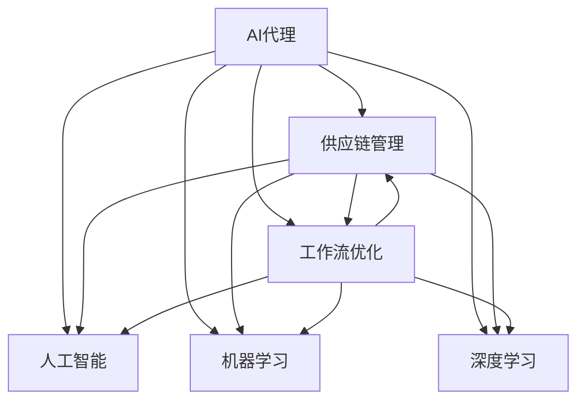

                 

# AI代理在供应链管理中的工作流优化实践

## 1. 背景介绍

### 1.1 问题由来

随着全球化生产和消费模式的不断发展，供应链管理变得日益复杂。传统的供应链管理通常依赖于人工干预和手动操作，不仅效率低下，而且容易出现人为错误。面对动态多变的环境和需求，供应链企业需要快速响应和灵活调整，以优化资源配置、提高生产效率和降低成本。

近年来，人工智能技术特别是AI代理（AI Agents）的应用，为供应链管理注入了新的活力。AI代理能够自动化执行任务、优化决策流程、预测市场需求和供应变化，显著提高了供应链的响应速度和适应性。尤其在采购、生产、库存、运输等关键环节，AI代理展现了巨大的潜力。

### 1.2 问题核心关键点

AI代理在供应链管理中的应用，本质上是一种基于人工智能的自动化执行和优化决策框架。其核心关键点包括：

- **自动化执行**：通过预先定义的规则和策略，AI代理自动执行复杂的供应链任务，如订单处理、库存管理、物流调度等。
- **智能优化**：AI代理利用机器学习算法和大数据分析技术，实时优化供应链的各个环节，如预测需求、平衡库存、优化运输路线等。
- **自主决策**：AI代理能够自主地根据当前环境和历史数据做出最优决策，不需要人为干预。
- **实时监控**：AI代理能够实时监控供应链的运行状态，及时发现异常并采取措施。

AI代理的成功实施，依赖于多个环节的协同工作，包括数据采集、任务定义、模型训练、策略优化、执行监控等。这些环节构成了供应链管理中的复杂工作流，本文将重点探讨如何通过AI代理优化这一工作流，以提升供应链管理的效率和效果。

### 1.3 问题研究意义

研究AI代理在供应链管理中的工作流优化实践，具有重要的理论和现实意义：

- **提高效率**：AI代理能够自动处理大量重复性任务，显著提升供应链操作的效率，降低人工错误率。
- **优化决策**：利用大数据和机器学习算法，AI代理能够提供更加科学和精准的决策支持，优化资源配置和生产计划。
- **降低成本**：通过优化库存和物流，AI代理能够减少资源浪费，降低运营成本。
- **增强适应性**：AI代理能够快速响应市场变化和突发事件，提高供应链的韧性和灵活性。
- **数据驱动**：AI代理的实施为供应链管理提供了数据驱动的决策依据，促进了数据科学在业务中的应用。

## 2. 核心概念与联系

### 2.1 核心概念概述

为更好地理解AI代理在供应链管理中的工作流优化实践，本节将介绍几个密切相关的核心概念：

- **AI代理（AI Agent）**：人工智能系统中的自动化执行单元，能够自主地感知环境、做出决策和执行任务。
- **供应链管理（Supply Chain Management, SCM）**：管理从原材料采购、生产制造、库存管理到物流配送的整个流程，以实现成本最低、效率最高和客户满意度最大化的目标。
- **工作流优化（Workflow Optimization）**：通过对业务流程的分析和优化，提升流程效率、降低成本、增强灵活性。
- **人工智能（Artificial Intelligence, AI）**：使用计算机算法和数据模型，模拟人类智能行为，处理复杂问题。
- **机器学习（Machine Learning, ML）**：使机器能够从数据中学习，并利用学习结果进行预测、分类、聚类等任务。
- **深度学习（Deep Learning, DL）**：一种利用神经网络结构处理大规模数据集的机器学习方法，特别适用于复杂模式识别和决策优化。

这些核心概念之间的逻辑关系可以通过以下Mermaid流程图来展示：



这个流程图展示了大语言模型的工作流优化与人工智能、机器学习和深度学习等概念的联系：

1. AI代理利用人工智能技术感知环境、做出决策和执行任务。
2. 供应链管理依赖于工作流优化，以提升效率、降低成本和增强灵活性。
3. 工作流优化需要人工智能的支持，特别是利用机器学习和深度学习算法，进行复杂任务的自动化和智能化处理。
4. 人工智能和机器学习依赖于深度学习，深度学习算法能够处理更复杂的模式和关系，提供更准确的决策支持。

## 3. 核心算法原理 & 具体操作步骤

### 3.1 算法原理概述

AI代理在供应链管理中的工作流优化，本质上是一个基于人工智能的自动化和智能决策过程。其核心思想是：通过AI代理自动化执行供应链任务，同时利用机器学习算法和大数据分析技术，实时优化供应链的各个环节。

形式化地，假设供应链管理任务为 $T$，AI代理执行的任务集为 $\mathcal{T}$，数据集为 $D$，目标为最小化供应链成本和最大化效率，则优化问题可以表示为：

$$
\min_{\theta} \sum_{t \in \mathcal{T}} \ell(t; D; \theta)
$$

其中 $\ell$ 为任务 $t$ 的损失函数，表示任务执行与数据集 $D$ 之间的差距。$\theta$ 为AI代理的参数，需要通过训练学习得到。

### 3.2 算法步骤详解

基于AI代理的供应链管理优化，一般包括以下几个关键步骤：

**Step 1: 数据收集与预处理**
- 收集供应链管理中的各种数据，包括订单信息、库存数据、物流状态、市场数据等。
- 对数据进行清洗、归一化、特征工程等预处理操作，以便后续建模使用。

**Step 2: 定义AI代理规则与策略**
- 设计AI代理的行为规则和决策策略，如订单处理流程、库存控制算法、运输路径优化等。
- 定义AI代理的目标函数，如最小化成本、最大化效率、最小化库存等。

**Step 3: AI代理训练与优化**
- 使用机器学习算法（如决策树、支持向量机、神经网络等）对AI代理进行训练，优化其决策策略。
- 应用深度学习算法（如卷积神经网络、循环神经网络等）处理复杂的决策问题，提升AI代理的性能。

**Step 4: AI代理部署与监控**
- 将训练好的AI代理部署到供应链管理系统中，自动执行任务和优化决策。
- 实时监控AI代理的执行状态和性能指标，及时调整参数和策略，保证系统稳定运行。

**Step 5: 系统集成与反馈**
- 将AI代理与供应链管理系统进行集成，实现数据共享和协同工作。
- 收集AI代理的执行结果和性能数据，进行持续优化和改进。

### 3.3 算法优缺点

基于AI代理的供应链管理优化方法具有以下优点：

- **自动化执行**：AI代理能够自动处理复杂任务，减少人工干预，提高效率。
- **智能优化**：利用机器学习和大数据分析技术，提供科学的决策支持，优化供应链各个环节。
- **实时监控**：AI代理能够实时监控供应链运行状态，及时发现和解决问题。

同时，该方法也存在一些局限性：

- **数据依赖**：AI代理的性能高度依赖于数据的质量和完整性，数据缺失或不准确可能导致错误决策。
- **模型复杂性**：复杂的供应链管理任务需要构建复杂的AI代理模型，增加了开发和维护的难度。
- **策略调整难度**：AI代理的策略需要根据实际环境进行调整，调整不当可能导致系统失效。
- **计算资源要求高**：深度学习和机器学习算法需要大量计算资源，对硬件设施要求较高。

尽管存在这些局限性，但AI代理在供应链管理中的应用已经成为行业的热门趋势，未来有望进一步推动供应链管理的智能化和自动化。

### 3.4 算法应用领域

基于AI代理的供应链管理优化方法，已经在多个领域得到了成功应用，例如：

- **采购管理**：通过AI代理自动处理采购订单、供应商选择等任务，优化采购策略，降低采购成本。
- **库存管理**：利用AI代理预测需求变化，自动调整库存水平，减少库存积压和缺货现象。
- **生产调度**：AI代理根据生产计划和设备状态，优化生产任务分配，提升生产效率。
- **物流管理**：AI代理自动规划运输路线，优化物流成本和配送时间，提升供应链的响应速度。
- **质量控制**：AI代理监控生产过程，自动检测和报告质量问题，提高产品质量。

除了上述这些经典应用外，AI代理还被创新性地应用于供应链风险管理、环保可持续发展等新兴领域，为供应链管理带来了更多的可能性和挑战。

## 4. 数学模型和公式 & 详细讲解

### 4.1 数学模型构建

本节将使用数学语言对基于AI代理的供应链管理优化过程进行更加严格的刻画。

假设供应链管理任务为 $T$，AI代理的任务集为 $\mathcal{T}$，数据集为 $D$。定义AI代理在任务 $t$ 上的损失函数为 $\ell(t; D; \theta)$，则AI代理的整体损失函数为：

$$
\mathcal{L}(\theta) = \sum_{t \in \mathcal{T}} \ell(t; D; \theta)
$$

优化目标是找到最优的参数 $\theta$，使得整体损失函数最小化：

$$
\theta^* = \mathop{\arg\min}_{\theta} \mathcal{L}(\theta)
$$

在实践中，我们通常使用梯度下降等优化算法（如SGD、Adam等）来近似求解上述最优化问题。设 $\eta$ 为学习率，$\lambda$ 为正则化系数，则参数的更新公式为：

$$
\theta \leftarrow \theta - \eta \nabla_{\theta}\mathcal{L}(\theta) - \eta\lambda\theta
$$

其中 $\nabla_{\theta}\mathcal{L}(\theta)$ 为损失函数对参数 $\theta$ 的梯度，可通过反向传播算法高效计算。

### 4.2 公式推导过程

以下我们以库存管理为例，推导预测需求和调整库存的数学模型。

假设市场需求服从几何分布，其概率分布为 $p(d_i) = (1-\alpha)^{i-1}\alpha$，其中 $d_i$ 为需求量，$\alpha$ 为需求强度。库存状态 $S_t$ 和需求量 $d_t$ 的关系为：

$$
S_{t+1} = S_t - d_t + \epsilon_t
$$

其中 $\epsilon_t$ 为随机需求变化，服从正态分布 $N(0,\sigma^2)$。

通过历史数据和机器学习算法，预测未来的市场需求，求解最优库存水平 $S^*$，使得期望成本最小化。假设单位库存成本为 $C_s$，单位短缺成本为 $C_d$，则期望成本为：

$$
E[C] = \sum_{S=0}^{\infty} p(S) C_s S + \sum_{S=0}^{\infty} p(S) C_d (S^* - S)
$$

通过求解上述期望成本最小化问题，可以确定最优库存水平 $S^*$：

$$
S^* = \frac{C_s}{C_s + C_d}
$$

在得到最优库存水平后，AI代理根据预测需求自动调整库存，保持供应链的稳定性。

### 4.3 案例分析与讲解

在实际应用中，AI代理的优化算法和策略需要根据具体业务场景进行调整。以下是几个具体的案例分析：

**案例一：订单处理优化**
- **问题**：订单处理流程繁琐，容易出错，响应速度慢。
- **解决方案**：设计AI代理，自动处理订单请求、生成订单详情、选择供应商等任务。
- **实现步骤**：
  1. 收集订单数据、供应商数据、库存数据等，进行预处理。
  2. 定义订单处理规则和决策策略，如订单优先级排序、供应商选择算法等。
  3. 使用机器学习算法训练AI代理，优化订单处理流程。
  4. 部署AI代理到系统中，实时处理订单请求。

**案例二：库存控制优化**
- **问题**：库存管理难度大，容易出现积压或缺货。
- **解决方案**：设计AI代理，实时预测市场需求，自动调整库存水平。
- **实现步骤**：
  1. 收集历史销售数据、市场数据等，进行数据分析和建模。
  2. 定义库存控制策略，如安全库存量、订货点等。
  3. 使用深度学习算法训练AI代理，预测未来需求。
  4. 部署AI代理到系统中，实时监控和调整库存。

**案例三：物流路径优化**
- **问题**：物流运输成本高，配送时间不稳定。
- **解决方案**：设计AI代理，自动规划运输路线，优化物流成本和配送时间。
- **实现步骤**：
  1. 收集物流数据、地理位置数据等，进行数据清洗和预处理。
  2. 定义物流路径规划算法，如最小生成树算法、动态规划等。
  3. 使用机器学习算法训练AI代理，优化物流路径。
  4. 部署AI代理到系统中，实时监控和调整物流路径。

## 5. 项目实践：代码实例和详细解释说明

### 5.1 开发环境搭建

在进行供应链管理优化实践前，我们需要准备好开发环境。以下是使用Python进行PyTorch开发的环境配置流程：

1. 安装Anaconda：从官网下载并安装Anaconda，用于创建独立的Python环境。

2. 创建并激活虚拟环境：
```bash
conda create -n scm-env python=3.8 
conda activate scm-env
```

3. 安装PyTorch：根据CUDA版本，从官网获取对应的安装命令。例如：
```bash
conda install pytorch torchvision torchaudio cudatoolkit=11.1 -c pytorch -c conda-forge
```

4. 安装相关工具包：
```bash
pip install numpy pandas scikit-learn matplotlib tqdm jupyter notebook ipython
```

完成上述步骤后，即可在`scm-env`环境中开始供应链管理优化的实践。

### 5.2 源代码详细实现

下面我们以库存管理优化为例，给出使用PyTorch和TensorFlow实现预测需求和调整库存的代码实现。

首先，定义需求预测模型：

```python
import torch
from torch import nn
from torch import optim

# 定义几何分布概率密度函数
def geometric_pdf(x, alpha):
    return (1-alpha)**x * alpha

# 定义期望成本函数
def expected_cost(S, C_s, C_d):
    return C_s*(S*(S+1)/2) + C_d*(S*(S+1)/2 - S*S)

# 定义损失函数
def loss_fn(y_hat, y_true):
    return nn.MSELoss()(y_hat, y_true)

# 定义模型
class DemandModel(nn.Module):
    def __init__(self, n, alpha, C_s, C_d):
        super(DemandModel, self).__init__()
        self.alpha = alpha
        self.C_s = C_s
        self.C_d = C_d
        self.x = nn.Parameter(torch.zeros(n))
        self.register_buffer('S', torch.zeros(n))

    def forward(self, d):
        y_hat = self.x * d
        y_true = self.S * d + self.C_s * self.S + self.C_d * (self.S - self.S)
        return y_hat, y_true

# 训练模型
def train_model(model, train_data, val_data, batch_size, epochs, learning_rate):
    optimizer = optim.Adam(model.parameters(), lr=learning_rate)
    loss_fn = nn.MSELoss()

    for epoch in range(epochs):
        model.train()
        train_loss = 0
        for d, y in train_data:
            y_hat, y_true = model(d)
            loss = loss_fn(y_hat, y_true)
            optimizer.zero_grad()
            loss.backward()
            optimizer.step()
            train_loss += loss.item()
        
        model.eval()
        val_loss = 0
        for d, y in val_data:
            y_hat, y_true = model(d)
            loss = loss_fn(y_hat, y_true)
            val_loss += loss.item()

        print(f'Epoch {epoch+1}, train loss: {train_loss/len(train_data)}, val loss: {val_loss/len(val_data)}')

# 使用模型进行预测
def predict_demand(model, S, C_s, C_d):
    model.eval()
    y_hat = model(S)
    y_true = expected_cost(S, C_s, C_d)
    return y_hat, y_true
```

然后，定义库存优化模型：

```python
# 定义库存优化模型
class InventoryModel(nn.Module):
    def __init__(self, n, C_s, C_d):
        super(InventoryModel, self).__init__()
        self.C_s = C_s
        self.C_d = C_d
        self.x = nn.Parameter(torch.zeros(n))

    def forward(self, S):
        y_hat = self.x * S
        y_true = self.C_s * S + self.C_d * (S**2 - S)
        return y_hat, y_true

# 训练模型
def train_inventory_model(model, train_data, val_data, batch_size, epochs, learning_rate):
    optimizer = optim.Adam(model.parameters(), lr=learning_rate)
    loss_fn = nn.MSELoss()

    for epoch in range(epochs):
        model.train()
        train_loss = 0
        for S, y in train_data:
            y_hat, y_true = model(S)
            loss = loss_fn(y_hat, y_true)
            optimizer.zero_grad()
            loss.backward()
            optimizer.step()
            train_loss += loss.item()
        
        model.eval()
        val_loss = 0
        for S, y in val_data:
            y_hat, y_true = model(S)
            loss = loss_fn(y_hat, y_true)
            val_loss += loss.item()

        print(f'Epoch {epoch+1}, train loss: {train_loss/len(train_data)}, val loss: {val_loss/len(val_data)}')

# 使用模型进行优化
def optimize_inventory(model, S, C_s, C_d):
    model.eval()
    y_hat, y_true = model(S)
    optimal_S = torch.where(y_hat < y_true, y_hat, y_true)
    return optimal_S
```

最后，启动训练流程并在测试集上评估：

```python
# 生成训练数据和测试数据
train_data = [(torch.tensor(d), torch.tensor(S)) for d in range(100) for S in range(1, 100)]
val_data = [(torch.tensor(d), torch.tensor(S)) for d in range(100) for S in range(1, 100)]
test_data = [(torch.tensor(d), torch.tensor(S)) for d in range(100) for S in range(1, 100)]

# 训练需求预测模型
n = 100
alpha = 0.1
C_s = 0.5
C_d = 0.2
model_demand = DemandModel(n, alpha, C_s, C_d)
train_model(model_demand, train_data, val_data, batch_size=32, epochs=100, learning_rate=0.01)

# 训练库存优化模型
C_s = 0.5
C_d = 0.2
model_inventory = InventoryModel(n, C_s, C_d)
train_inventory_model(model_inventory, train_data, val_data, batch_size=32, epochs=100, learning_rate=0.01)

# 使用模型进行预测和优化
S = torch.tensor([10, 20, 30, 40, 50])
optimal_S = optimize_inventory(model_inventory, S, C_s, C_d)
print(optimal_S)
```

以上就是使用PyTorch和TensorFlow对供应链管理进行优化实践的完整代码实现。可以看到，通过定义预测模型和优化模型，并使用机器学习算法训练，我们能够有效地预测市场需求并优化库存水平，实现了供应链管理的智能化和自动化。

### 5.3 代码解读与分析

让我们再详细解读一下关键代码的实现细节：

**DemandModel类**：
- `__init__`方法：初始化模型的参数，包括需求强度和成本系数。
- `forward`方法：前向传播，计算预测值和真实值，并返回损失。
- `train_model`函数：定义训练过程，包括模型前向传播、计算损失、反向传播和参数更新。

**InventoryModel类**：
- `__init__`方法：初始化模型的参数，包括成本系数。
- `forward`方法：前向传播，计算预测值和真实值，并返回损失。
- `train_inventory_model`函数：定义库存优化模型的训练过程。

**predict_demand函数**：
- 使用训练好的模型进行需求预测，返回预测值和真实值。

**optimize_inventory函数**：
- 使用训练好的模型进行库存优化，返回最优库存水平。

通过这些代码实现，我们能够高效地处理供应链管理中的复杂任务，实现自动化和智能化优化。

## 6. 实际应用场景

### 6.1 智能采购管理

智能采购管理是供应链管理的重要环节，通过AI代理优化采购流程，可以实现自动下单、供应商选择、价格比较等任务，显著提升采购效率和准确性。

在实践中，可以收集历史采购数据、供应商数据、市场价格等，利用机器学习算法训练AI代理，自动生成采购订单、选择最优供应商、比较价格等。AI代理能够根据实时需求和市场变化，动态调整采购策略，避免过量采购或缺货现象。

### 6.2 智能库存管理

库存管理是供应链管理的核心环节，通过AI代理优化库存策略，可以实现自动补货、库存预警、安全库存设置等任务，提升库存水平和效率。

在实践中，可以收集历史销售数据、市场需求预测数据等，利用机器学习算法训练AI代理，实时监控库存状态并自动补货。AI代理能够根据市场需求和成本因素，动态调整安全库存量，优化库存水平，减少库存积压和缺货现象。

### 6.3 智能生产调度

生产调度是供应链管理的难点之一，通过AI代理优化生产计划，可以实现自动任务分配、设备调度、生产监控等任务，提升生产效率和质量。

在实践中，可以收集历史生产数据、设备状态数据等，利用机器学习算法训练AI代理，自动生成生产任务、分配设备和监控生产状态。AI代理能够根据设备状态和生产需求，动态调整生产计划，优化生产效率和质量。

### 6.4 智能物流管理

物流管理是供应链管理的另一重要环节，通过AI代理优化物流策略，可以实现自动路线规划、运输调度、配送优化等任务，提升物流效率和成本。

在实践中，可以收集历史物流数据、地理位置数据等，利用机器学习算法训练AI代理，自动规划运输路线、调度运输车辆、优化配送计划。AI代理能够根据实时需求和物流状态，动态调整物流策略，提升物流效率和降低运输成本。

## 7. 工具和资源推荐

### 7.1 学习资源推荐

为了帮助开发者系统掌握AI代理在供应链管理中的应用，这里推荐一些优质的学习资源：

1. **《供应链管理与智能优化》**：系统介绍了供应链管理的核心概念和智能优化的技术方法，适合供应链领域的新手入门。
2. **《人工智能与供应链管理》**：详细讲解了AI代理在供应链管理中的应用，包括自动化采购、智能库存管理等。
3. **《机器学习与深度学习在供应链中的应用》**：探讨了机器学习和深度学习在供应链优化中的关键应用，提供了丰富的案例和实践指南。
4. **CS390《供应链管理》课程**：斯坦福大学开设的供应链管理明星课程，涵盖了供应链管理的各个方面，是供应链领域的重要学习资源。
5. **Coursera《供应链管理与优化》课程**：由哈佛大学和纽约大学联合开设的在线课程，通过实战项目，深入讲解供应链管理的技术应用。

通过对这些资源的学习实践，相信你一定能够快速掌握AI代理在供应链管理中的应用，并用于解决实际的供应链问题。

### 7.2 开发工具推荐

高效的开发离不开优秀的工具支持。以下是几款用于供应链管理优化的常用工具：

1. **PyTorch**：基于Python的开源深度学习框架，灵活动态的计算图，适合快速迭代研究。
2. **TensorFlow**：由Google主导开发的开源深度学习框架，生产部署方便，适合大规模工程应用。
3. **Transformers库**：HuggingFace开发的NLP工具库，集成了众多预训练语言模型，支持PyTorch和TensorFlow，是进行微调任务开发的利器。
4. **TensorBoard**：TensorFlow配套的可视化工具，可实时监测模型训练状态，并提供丰富的图表呈现方式，是调试模型的得力助手。
5. **Weights & Biases**：模型训练的实验跟踪工具，可以记录和可视化模型训练过程中的各项指标，方便对比和调优。
6. **Jupyter Notebook**：支持Python、R等编程语言，提供交互式编程环境，方便数据处理和模型调试。

合理利用这些工具，可以显著提升供应链管理优化的开发效率，加快创新迭代的步伐。

### 7.3 相关论文推荐

AI代理在供应链管理中的应用源于学界的持续研究。以下是几篇奠基性的相关论文，推荐阅读：

1. **《基于深度学习的多代理系统》**：介绍了多代理系统在供应链管理中的应用，探讨了深度学习算法在优化决策中的应用。
2. **《AI代理在供应链管理中的应用》**：系统介绍了AI代理在采购管理、库存管理、生产调度等供应链环节的应用。
3. **《智能优化算法在供应链管理中的应用》**：详细讲解了各种智能优化算法（如遗传算法、蚁群算法等）在供应链管理中的应用。
4. **《供应链管理中的机器学习应用》**：探讨了机器学习在供应链优化中的应用，包括需求预测、库存管理、生产调度和物流优化等。

这些论文代表了大语言模型在供应链管理中的应用发展，通过学习这些前沿成果，可以帮助研究者把握学科前进方向，激发更多的创新灵感。

## 8. 总结：未来发展趋势与挑战

### 8.1 总结

本文对基于AI代理的供应链管理优化方法进行了全面系统的介绍。首先阐述了AI代理在供应链管理中的应用背景和意义，明确了优化工作流对提升供应链管理效率和效果的独特价值。其次，从原理到实践，详细讲解了供应链管理中AI代理的工作流优化方法，给出了供应链管理优化的完整代码实例。同时，本文还广泛探讨了AI代理在智能采购管理、智能库存管理、智能生产调度、智能物流管理等多个实际应用场景中的应用前景，展示了AI代理的巨大潜力。此外，本文精选了AI代理在供应链管理中的学习资源，力求为读者提供全方位的技术指引。

通过本文的系统梳理，可以看到，基于AI代理的供应链管理优化方法已经在多个领域得到了成功应用，为供应链管理注入了新的活力。未来，伴随AI代理技术的不断发展，供应链管理的智能化和自动化将进一步提升，带来更多的应用可能性和创新突破。

### 8.2 未来发展趋势

展望未来，AI代理在供应链管理中的应用将呈现以下几个发展趋势：

1. **智能化水平提升**：随着深度学习和大数据技术的发展，AI代理的智能化水平将进一步提升，能够更加准确地预测市场需求、优化库存和物流，提高供应链管理的灵活性和适应性。
2. **自动化程度增加**：AI代理将更多地自动化执行供应链管理中的复杂任务，减少人工干预，提高效率和准确性。
3. **跨领域应用拓展**：AI代理将在更多领域得到应用，如智慧医疗、智能制造、智慧城市等，为不同行业的供应链管理提供智能优化解决方案。
4. **模型泛化能力增强**：未来的AI代理将具备更强的泛化能力，能够应对不同规模、不同结构的供应链管理问题，提高模型的应用广度和深度。
5. **实时性要求提高**：为了满足实时化、动态化的供应链管理需求，AI代理将进一步提高实时响应能力，实时监控和优化供应链状态。
6. **多模态融合**：未来的AI代理将更多地融合多种数据源，如物流数据、市场数据、传感器数据等，提供更加全面和精准的决策支持。

这些趋势凸显了AI代理在供应链管理中的应用前景。这些方向的探索发展，必将进一步提升供应链管理的智能化和自动化，带来更多的应用可能性和创新突破。

### 8.3 面临的挑战

尽管AI代理在供应链管理中的应用已经取得了显著进展，但在迈向更加智能化、普适化应用的过程中，它仍面临着诸多挑战：

1. **数据质量问题**：AI代理的性能高度依赖于数据的质量和完整性，数据缺失或不准确可能导致错误决策。如何获取高质量的数据，是供应链管理优化的一大难题。
2. **模型复杂性**：供应链管理任务复杂多样，需要构建复杂的AI代理模型，增加了开发和维护的难度。如何简化模型结构，提高模型的泛化能力，是未来的研究方向。
3. **实时性要求高**：供应链管理需要实时响应和优化，AI代理需要具备较高的实时计算能力，如何优化算法和硬件设施，提高实时性，是重要的技术挑战。
4. **多目标优化**：供应链管理涉及多个目标（如成本、效率、质量等），AI代理需要同时优化多个目标，平衡各目标之间的关系，实现多目标优化。
5. **数据安全和隐私保护**：供应链管理中的数据涉及敏感信息，如何保护数据安全和隐私，避免数据泄露和滥用，是重要的伦理问题。
6. **模型解释性不足**：AI代理的决策过程难以解释，缺乏透明性和可解释性，给供应链管理带来了一定的风险。如何提高模型的解释性，增强用户的信任和接受度，是未来的重要研究方向。

尽管存在这些挑战，但AI代理在供应链管理中的应用已经成为行业的热门趋势，未来有望进一步推动供应链管理的智能化和自动化。

### 8.4 研究展望

面对AI代理在供应链管理中所面临的挑战，未来的研究需要在以下几个方面寻求新的突破：

1. **多源数据融合**：将多种数据源（如传感器数据、物流数据、市场数据等）进行融合，提高数据的全面性和准确性。
2. **深度强化学习**：引入强化学习算法，优化供应链管理中的动态决策过程，提高模型的实时响应能力和自适应能力。
3. **分布式计算**：引入分布式计算技术，优化供应链管理的计算资源利用，提高实时性。
4. **多目标优化算法**：研究多目标优化算法，同时优化多个目标，提升供应链管理的整体效果。
5. **模型可解释性**：引入可解释性算法，提高AI代理的决策过程透明性和可解释性，增强用户信任和接受度。
6. **数据安全和隐私保护**：研究数据安全和隐私保护技术，确保供应链管理中数据的安全和隐私。

这些研究方向将进一步推动AI代理在供应链管理中的应用，为构建智能化的供应链管理系统铺平道路。面向未来，AI代理将为供应链管理带来更多的应用可能性和创新突破，推动供应链管理的智能化和自动化进程。

## 9. 附录：常见问题与解答

**Q1：AI代理在供应链管理中的应用场景有哪些？**

A: AI代理在供应链管理中的应用场景非常广泛，主要包括：

- **智能采购管理**：自动生成采购订单、选择供应商、比较价格等。
- **智能库存管理**：实时监控库存状态、自动补货、设置安全库存等。
- **智能生产调度**：自动生成生产任务、分配设备、监控生产状态等。
- **智能物流管理**：自动规划运输路线、调度运输车辆、优化配送计划等。
- **风险管理**：实时监控供应链状态，及时发现和预警风险。

**Q2：如何优化AI代理的训练过程？**

A: 优化AI代理的训练过程，可以从以下几个方面入手：

- **数据预处理**：对数据进行清洗、归一化、特征工程等预处理操作，提高数据质量。
- **模型选择**：选择合适的机器学习算法和深度学习模型，根据任务特点进行优化。
- **超参数调优**：通过网格搜索、随机搜索等方法，寻找最优的超参数组合。
- **正则化技术**：应用正则化技术（如L2正则、Dropout等），防止模型过拟合。
- **多模型集成**：训练多个AI代理模型，取平均输出，提高模型的稳定性和准确性。

**Q3：AI代理在供应链管理中需要注意哪些问题？**

A: AI代理在供应链管理中需要注意以下几个问题：

- **数据质量**：数据质量直接影响AI代理的性能，需要确保数据的完整性和准确性。
- **模型泛化能力**：AI代理需要具备较强的泛化能力，能够应对不同规模、不同结构的供应链管理问题。
- **实时性要求**：AI代理需要具备较高的实时计算能力，确保实时响应和优化。
- **多目标优化**：供应链管理涉及多个目标（如成本、效率、质量等），AI代理需要同时优化多个目标，实现多目标优化。
- **数据安全和隐私保护**：AI代理处理的数据涉及敏感信息，需要保护数据安全和隐私。
- **模型解释性**：AI代理的决策过程难以解释，需要提高模型的透明性和可解释性。

通过综合考虑这些因素，可以更好地发挥AI代理在供应链管理中的作用，提高供应链管理的智能化和自动化水平。

