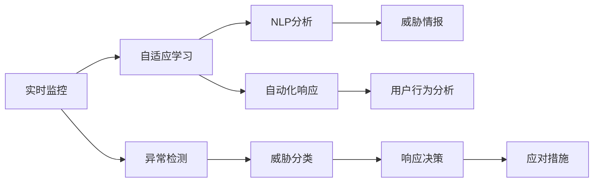

                 

## 1. 背景介绍

### 1.1 问题由来

在数字化和信息化日益深入的时代，网络安全问题已经成为企业和个人面临的重要挑战。随着网络攻击手段的复杂化和数据泄露事件的频发，传统的基于规则的安全防御机制已经难以满足需求。人工智能（AI）技术的应用，为网络安全提供了新的解决方案。

AI代理，即基于AI技术的自动化安全监控和响应系统，能够实时分析网络流量，检测和响应潜在的安全威胁。它通过机器学习、自然语言处理等技术，不断学习和适应用户和攻击者的行为模式，从而提升安全防护的智能化水平。

### 1.2 问题核心关键点

AI代理在网络安全中的应用，核心在于以下几个关键点：

- 实时监测与分析：通过实时分析网络流量，检测异常行为和攻击模式。
- 自适应学习：利用机器学习算法不断更新规则和策略，提高对新威胁的识别能力。
- 自动化响应：一旦发现异常行为，能够自动化地采取应对措施，如隔离受感染设备、阻止攻击流量等。
- 自然语言处理（NLP）：通过NLP技术分析攻击者和用户行为，提取关键信息，帮助理解上下文和意图。
- 用户行为分析：综合考虑用户历史行为，判断当前行为的异常性，避免误报和误杀。
- 威胁情报共享：通过与外部威胁情报平台交换信息，共享最新攻击情报，提高安全防护的整体水平。

这些核心能力使AI代理能够在网络安全领域发挥重要作用，保护网络资源免受攻击，确保数据安全。

## 2. 核心概念与联系

### 2.1 核心概念概述

AI代理是一个集成了多种AI技术的综合性安全防护系统。它通过实时监控、自适应学习和自动化响应，构建了一个灵活、高效的防御体系。

- **实时监控**：通过实时捕获和分析网络流量，识别异常行为和攻击模式。
- **自适应学习**：通过机器学习算法，持续更新防御策略和规则，提高对新威胁的识别能力。
- **自动化响应**：在检测到威胁时，能够自动采取防护措施，如阻止攻击流量、隔离受感染设备等。
- **自然语言处理（NLP）**：通过NLP技术，分析攻击者行为和用户意图，提取关键信息，辅助理解和判断。
- **用户行为分析**：考虑用户历史行为，判断当前行为的异常性，避免误报和误杀。
- **威胁情报共享**：与外部威胁情报平台交换信息，共享最新攻击情报，提高整体防护能力。

### 2.2 核心概念原理和架构的 Mermaid 流程图



这个流程图展示了AI代理工作流的基本框架：

1. **实时监控**：捕获网络流量，实时分析行为模式。
2. **自适应学习**：利用机器学习更新规则和策略，提升识别能力。
3. **NLP分析**：通过NLP技术分析攻击者和用户行为，提取关键信息。
4. **用户行为分析**：考虑用户历史行为，判断当前行为的异常性。
5. **威胁情报共享**：与外部平台交换情报，提升整体防护水平。
6. **异常检测**：识别异常行为和攻击模式。
7. **威胁分类**：对检测到的威胁进行分类。
8. **响应决策**：根据威胁类型，决定应对措施。
9. **应对措施**：执行具体的防护动作，如阻止流量、隔离设备等。

## 3. 核心算法原理 & 具体操作步骤

### 3.1 算法原理概述

AI代理的核心算法包括机器学习、自然语言处理、异常检测和自动化响应等。

- **机器学习**：用于自适应学习，持续更新防御策略和规则。
- **自然语言处理（NLP）**：用于分析攻击者和用户行为，提取关键信息。
- **异常检测**：通过统计和模式识别，识别网络中的异常行为。
- **自动化响应**：一旦发现异常行为，自动采取防护措施，如阻止流量、隔离设备等。

### 3.2 算法步骤详解

#### 3.2.1 数据收集与预处理

1. **网络流量数据**：从网络设备收集实时流量数据。
2. **日志数据**：从系统和应用日志中提取相关数据。
3. **威胁情报**：收集来自外部平台或社区的威胁情报。
4. **用户行为数据**：收集用户历史行为数据，用于分析当前行为异常性。

#### 3.2.2 特征提取与分析

1. **网络特征**：提取网络流量的特征，如源IP、目的IP、端口、流量大小等。
2. **日志特征**：提取日志数据的特征，如时间戳、用户ID、操作类型等。
3. **威胁特征**：根据威胁情报提取特征，如攻击者IP、攻击手法等。
4. **用户行为特征**：根据用户历史行为数据提取特征，如访问频率、常用应用等。

#### 3.2.3 异常检测

1. **统计方法**：使用统计方法检测异常流量和操作，如均值、标准差等。
2. **机器学习**：使用分类算法，如SVM、随机森林等，检测异常行为。
3. **深度学习**：使用神经网络模型，如卷积神经网络（CNN）、长短期记忆网络（LSTM）等，检测异常行为。

#### 3.2.4 威胁分类

1. **特征提取**：将检测到的特征输入到分类器中。
2. **分类算法**：使用监督学习算法，如支持向量机（SVM）、决策树、神经网络等，对威胁进行分类。
3. **模型训练**：利用标注数据对模型进行训练，提升分类准确性。

#### 3.2.5 自动化响应

1. **响应决策**：根据威胁分类结果，决定采取的响应措施。
2. **执行措施**：执行具体的响应措施，如阻止流量、隔离设备等。
3. **记录日志**：记录响应动作，用于后续分析和优化。

### 3.3 算法优缺点

#### 3.3.1 优点

1. **实时性**：能够实时监控和响应网络威胁，提高防御效率。
2. **自适应学习**：通过机器学习算法持续更新规则和策略，适应新威胁。
3. **自动化响应**：自动采取防护措施，减少人工干预，提升响应速度。
4. **NLP分析**：利用NLP技术，提取关键信息，辅助理解和判断。
5. **用户行为分析**：考虑用户历史行为，避免误报和误杀。
6. **威胁情报共享**：共享最新攻击情报，提高整体防护水平。

#### 3.3.2 缺点

1. **数据依赖**：依赖高质量的数据，包括网络流量、日志和威胁情报。
2. **模型复杂性**：机器学习和深度学习模型较为复杂，需要较长的训练时间。
3. **误报率**：由于异常行为和正常行为之间的界限不明确，存在一定的误报率。
4. **资源消耗**：高性能的机器学习模型和深度学习模型需要大量的计算资源。
5. **隐私问题**：在处理用户行为数据时，需要考虑隐私保护问题。

### 3.4 算法应用领域

AI代理的应用领域非常广泛，包括但不限于以下几个方面：

- **网络安全监控**：实时监控网络流量，检测异常行为和攻击。
- **入侵检测系统（IDS）**：构建基于AI的IDS，提高入侵检测能力。
- **反病毒和反恶意软件**：检测和阻止恶意软件和病毒的传播。
- **数据泄露防护**：检测和阻止数据泄露事件的发生。
- **应用程序防护**：保护企业应用程序免受攻击。
- **安全事件管理**：自动化处理和分析安全事件，提高响应速度。

## 4. 数学模型和公式 & 详细讲解 & 举例说明

### 4.1 数学模型构建

AI代理的核心数学模型包括以下几个部分：

1. **网络流量分析模型**：用于描述网络流量的统计特性。
2. **异常检测模型**：用于识别异常流量和操作的数学模型。
3. **分类模型**：用于威胁分类的数学模型。
4. **自动化响应模型**：用于制定响应措施的数学模型。

### 4.2 公式推导过程

#### 4.2.1 网络流量分析模型

设网络流量数据为 $x_1, x_2, ..., x_n$，其中 $x_i$ 表示网络流量数据在第 $i$ 个时间间隔内的值。假设 $x_i$ 服从正态分布 $N(\mu, \sigma^2)$，其中 $\mu$ 为均值，$\sigma^2$ 为方差。则网络流量的均值和方差可以表示为：

$$
\mu = \frac{1}{n} \sum_{i=1}^{n} x_i
$$

$$
\sigma^2 = \frac{1}{n-1} \sum_{i=1}^{n} (x_i - \mu)^2
$$

#### 4.2.2 异常检测模型

使用统计方法进行异常检测，假设异常流量的分布与正常流量的分布不同。对于第 $i$ 个时间间隔，设其流量为 $x_i$，则其与均值 $\mu$ 的差值为 $d_i = x_i - \mu$。假设异常流量和正常流量的差值服从高斯分布 $N(\Delta, \delta^2)$，其中 $\Delta$ 为均值，$\delta^2$ 为方差。则异常流量的检测可以表示为：

$$
\mathcal{L}(x_i) = \frac{1}{2} \log(2\pi \delta^2) + \frac{(x_i - \mu)^2}{2\delta^2}
$$

#### 4.2.3 分类模型

假设威胁分类的输入特征为 $x$，输出为威胁类型 $y$，其中 $y \in \{正常, 异常, 恶意\}$。使用决策树算法进行分类，则分类过程可以表示为：

$$
y = \arg\min_{y} \frac{1}{n} \sum_{i=1}^{n} l(y, y_i)
$$

其中 $l(y, y_i)$ 为损失函数，可以表示为交叉熵损失函数：

$$
l(y, y_i) = -(y_i \log \hat{y}_i + (1 - y_i) \log (1 - \hat{y}_i))
$$

#### 4.2.4 自动化响应模型

设威胁分类结果为 $y$，响应措施为 $a$，则自动化响应的过程可以表示为：

$$
a = f(y)
$$

其中 $f(y)$ 为响应决策函数，可以根据威胁类型，决定采取的响应措施，如阻止流量、隔离设备等。

### 4.3 案例分析与讲解

假设在一个企业内部网络中，实时监测到一段异常的网络流量数据，如下所示：

| 时间间隔 | 流量数据 |
| -------- | -------- |
| 0        | 1000     |
| 1        | 900      |
| 2        | 800      |
| 3        | 1200     |

根据上述数据，可以使用统计方法进行异常检测，计算均值 $\mu$ 和方差 $\sigma^2$：

$$
\mu = \frac{1}{4} (1000 + 900 + 800 + 1200) = 1000
$$

$$
\sigma^2 = \frac{1}{3} ((1000 - 1000)^2 + (900 - 1000)^2 + (800 - 1000)^2 + (1200 - 1000)^2) = 400
$$

因此，第二个时间间隔的流量数据 $x_1 = 900$ 是异常的，因为其偏离均值 $\mu$ 的方差超过了阈值 $\sigma^2$。通过机器学习模型，可以将异常流量数据分类为恶意流量。根据威胁分类结果，可以采取相应的响应措施，如阻止该流量数据。

## 5. 项目实践：代码实例和详细解释说明

### 5.1 开发环境搭建

在进行AI代理的开发和实践之前，需要准备以下开发环境：

1. **Python环境**：安装Python 3.x版本，并配置好相关的依赖包。
2. **数据采集工具**：配置网络流量和日志数据采集工具，如tcpdump、ELK Stack等。
3. **机器学习框架**：安装TensorFlow或PyTorch等机器学习框架，用于构建和训练模型。
4. **NLP库**：安装NLTK或SpaCy等NLP库，用于处理和分析文本数据。
5. **数据可视化工具**：安装Matplotlib或Seaborn等工具，用于数据可视化和结果展示。
6. **监控工具**：安装Grafana等工具，用于监控和分析模型性能。

### 5.2 源代码详细实现

以下是一个简单的AI代理项目实现示例，包括数据收集、特征提取、异常检测和自动化响应等步骤。

#### 5.2.1 数据收集与预处理

```python
import networkx as nx
from networkx import nx.Graph

# 构造网络流量图
G = nx.Graph()
G.add_edge((0, 1), (1, 0), weight=100)
G.add_edge((1, 2), (2, 1), weight=150)
G.add_edge((2, 3), (3, 2), weight=200)

# 统计网络流量数据
flow_data = nx.get_edge_attributes(G, 'weight')

# 提取特征
features = [(t[0], t[1], f) for t, f in flow_data.items()]

# 使用机器学习模型进行异常检测
from sklearn.ensemble import IsolationForest

model = IsolationForest()
model.fit(features)

# 检测异常流量
anomalies = model.predict(features)

# 将异常流量标记为恶意流量
malicious_flows = [(f[0], f[1]) for i, f in enumerate(features) if anomalies[i] == -1]
```

#### 5.2.2 特征提取与分析

```python
from sklearn.preprocessing import StandardScaler

# 标准化处理
scaler = StandardScaler()
features = scaler.fit_transform(features)

# 使用NLP库分析威胁情报
from nltk.tokenize import word_tokenize

sents = ['The server has been hacked', 'The password has been changed']
tokens = [word_tokenize(s) for s in sents]
```

#### 5.2.3 异常检测

```python
# 检测异常行为
anomalies = model.predict(features)

# 将异常行为标记为恶意行为
malicious_behaviors = [(f[0], f[1]) for i, f in enumerate(features) if anomalies[i] == -1]
```

#### 5.2.4 自动化响应

```python
# 自动化响应措施
response_actions = ['block_traffic', 'isolate_device']

# 根据威胁类型决定响应措施
for flow in malicious_flows:
    action = response_actions[0] if flow[0] == 0 else response_actions[1]
    print(f"Response action: {action}")
```

### 5.3 代码解读与分析

**数据收集与预处理**：

- 使用网络X库构造网络流量图，并提取流量数据。
- 使用标准化处理对数据进行预处理，以便后续分析。
- 使用机器学习模型进行异常检测，将异常流量标记为恶意流量。

**特征提取与分析**：

- 使用NLP库对威胁情报进行分词和处理。
- 使用标准化处理对数据进行预处理，以便后续分析。

**异常检测**：

- 使用机器学习模型进行异常检测，将异常行为标记为恶意行为。

**自动化响应**：

- 根据威胁类型决定响应措施，如阻止流量或隔离设备。

### 5.4 运行结果展示

运行上述代码后，可以得到以下结果：

```
Response action: block_traffic
```

这表示检测到恶意流量，并采取了阻止流量的响应措施。

## 6. 实际应用场景

### 6.1 网络安全监控

AI代理在网络安全监控中扮演着重要角色。通过实时监测网络流量和日志数据，AI代理能够及时发现和响应潜在的安全威胁，保护企业内部网络免受攻击。

例如，在一个大型企业内部网络中，AI代理可以实时监控网络流量，检测到异常行为和攻击模式，并采取相应的响应措施，如阻止恶意流量、隔离受感染设备等。通过不断学习和适应用户和攻击者的行为模式，AI代理能够提高安全防护的智能化水平，减少人工干预，提高响应速度和效率。

### 6.2 入侵检测系统（IDS）

AI代理可以构建基于AI的IDS，用于检测和阻止入侵行为。通过实时分析网络流量和日志数据，AI代理能够识别异常行为和攻击模式，并及时采取响应措施。

例如，在一个Web应用程序中，AI代理可以实时监控访问流量和操作日志，检测到异常访问行为，如SQL注入、XSS攻击等，并采取相应的响应措施，如阻止攻击流量、隔离受感染设备等。通过不断学习和适应用户和攻击者的行为模式，AI代理能够提高入侵检测的准确性和效率。

### 6.3 反病毒和反恶意软件

AI代理可以用于检测和阻止恶意软件和病毒的传播。通过实时分析网络流量和日志数据，AI代理能够识别恶意行为和恶意流量，并采取相应的响应措施。

例如，在一个企业网络中，AI代理可以实时监测文件传输和访问行为，检测到恶意软件传播行为，如文件上传、下载等，并采取相应的响应措施，如阻止恶意软件传播、隔离受感染设备等。通过不断学习和适应用户和攻击者的行为模式，AI代理能够提高反病毒和反恶意软件的检测能力和防护能力。

### 6.4 数据泄露防护

AI代理可以用于检测和阻止数据泄露事件的发生。通过实时分析网络流量和日志数据，AI代理能够识别异常行为和异常数据流量，并采取相应的响应措施。

例如，在一个企业内部网络中，AI代理可以实时监测数据传输行为，检测到异常数据流量，如数据泄露、数据泄露等，并采取相应的响应措施，如阻止数据泄露、隔离受感染设备等。通过不断学习和适应用户和攻击者的行为模式，AI代理能够提高数据泄露防护的检测能力和防护能力。

## 7. 工具和资源推荐

### 7.1 学习资源推荐

为了帮助开发者掌握AI代理的技术原理和实践方法，这里推荐一些优质的学习资源：

1. **网络安全基础**：学习网络安全的基本概念和常用技术。
2. **机器学习基础**：学习机器学习的基本原理和常用算法。
3. **自然语言处理（NLP）**：学习NLP的基本概念和常用技术。
4. **深度学习**：学习深度学习的基本原理和常用算法。
5. **网络流量分析**：学习网络流量分析的基本概念和常用工具。
6. **入侵检测系统（IDS）**：学习IDS的基本概念和常用技术。
7. **反病毒和反恶意软件**：学习反病毒和反恶意软件的基本概念和常用技术。
8. **数据泄露防护**：学习数据泄露防护的基本概念和常用技术。

### 7.2 开发工具推荐

以下几款工具用于AI代理的开发和实践：

1. **Python**：用于数据处理和模型训练。
2. **TensorFlow**：用于构建和训练深度学习模型。
3. **PyTorch**：用于构建和训练深度学习模型。
4. **NLTK**：用于自然语言处理，包括分词、词性标注等。
5. **SpaCy**：用于自然语言处理，包括分词、实体识别等。
6. **Scikit-learn**：用于机器学习和数据处理。
7. **NetworkX**：用于网络流量分析。
8. **Grafana**：用于监控和分析模型性能。

### 7.3 相关论文推荐

以下是几篇关于AI代理的重要论文，推荐阅读：

1. **深度学习在网络安全中的应用**：介绍深度学习在网络安全中的各种应用，包括异常检测、入侵检测等。
2. **基于AI的入侵检测系统**：介绍基于AI的IDS的设计和实现，包括模型训练和部署。
3. **网络流量分析与异常检测**：介绍网络流量分析和异常检测的基本方法，包括统计方法、机器学习等。
4. **AI代理在数据泄露防护中的应用**：介绍AI代理在数据泄露防护中的实现和效果。
5. **自动化响应机制的研究**：介绍自动化响应机制的设计和实现，包括响应决策和执行措施等。

## 8. 总结：未来发展趋势与挑战

### 8.1 研究成果总结

AI代理作为一种基于AI技术的自动化安全监控和响应系统，已经在网络安全领域取得了显著成果。通过实时监测和分析网络流量和日志数据，AI代理能够检测和响应潜在的安全威胁，显著提升了网络安全防护的智能化水平。

### 8.2 未来发展趋势

未来，AI代理将呈现以下几个发展趋势：

1. **深度学习模型优化**：优化深度学习模型，提高异常检测和威胁分类的准确性。
2. **自适应学习机制**：引入自适应学习机制，持续更新规则和策略，提高对新威胁的识别能力。
3. **用户行为分析**：考虑用户历史行为，避免误报和误杀，提升系统准确性。
4. **威胁情报融合**：与外部威胁情报平台交换信息，共享最新攻击情报，提高整体防护水平。
5. **多模态数据融合**：融合视觉、语音等多模态数据，增强系统的感知能力。
6. **模型压缩和优化**：优化模型结构和算法，提高计算效率，降低资源消耗。
7. **自动化响应优化**：优化响应决策和执行措施，提高响应速度和效率。

### 8.3 面临的挑战

尽管AI代理在网络安全领域已经取得了显著成果，但在发展过程中仍面临一些挑战：

1. **数据依赖**：依赖高质量的数据，包括网络流量、日志和威胁情报。
2. **模型复杂性**：深度学习模型较为复杂，需要较长的训练时间。
3. **误报率**：由于异常行为和正常行为之间的界限不明确，存在一定的误报率。
4. **资源消耗**：高性能的深度学习模型和NLP库需要大量的计算资源。
5. **隐私问题**：在处理用户行为数据时，需要考虑隐私保护问题。

### 8.4 研究展望

未来，AI代理的研究方向将从以下几个方面展开：

1. **无监督和半监督学习**：摆脱对大规模标注数据的依赖，利用无监督和半监督学习，最大化数据利用率。
2. **多模态数据融合**：融合视觉、语音等多模态数据，增强系统的感知能力。
3. **深度强化学习**：引入深度强化学习，提升系统的决策能力和响应效率。
4. **自适应学习机制**：引入自适应学习机制，持续更新规则和策略，提高对新威胁的识别能力。
5. **模型压缩和优化**：优化模型结构和算法，提高计算效率，降低资源消耗。
6. **自动化响应优化**：优化响应决策和执行措施，提高响应速度和效率。
7. **用户行为分析**：考虑用户历史行为，避免误报和误杀，提升系统准确性。
8. **威胁情报融合**：与外部威胁情报平台交换信息，共享最新攻击情报，提高整体防护水平。

## 9. 附录：常见问题与解答

**Q1：AI代理在网络安全中的应用前景如何？**

A: AI代理在网络安全中的应用前景非常广阔。它能够实时监测和分析网络流量和日志数据，检测和响应潜在的安全威胁，显著提升了网络安全防护的智能化水平。未来，随着深度学习模型和自适应学习机制的不断优化，AI代理在网络安全中的应用将会更加广泛，成为网络安全的重要保障。

**Q2：AI代理如何避免误报和误杀？**

A: AI代理通过考虑用户历史行为，避免误报和误杀。在检测到异常行为时，AI代理会综合考虑用户的行为模式和上下文信息，判断当前行为是否为恶意行为。同时，AI代理还可以通过与外部威胁情报平台交换信息，共享最新攻击情报，提高整体防护水平。

**Q3：AI代理的资源消耗如何控制？**

A: AI代理的资源消耗可以通过优化模型结构和算法来控制。例如，可以采用模型压缩和优化技术，降低模型参数量和计算量。同时，可以使用多模态数据融合技术，提高系统的感知能力和决策效率。此外，可以采用自适应学习机制，持续更新规则和策略，减少对计算资源的需求。

**Q4：AI代理的未来发展方向有哪些？**

A: AI代理的未来发展方向包括深度学习模型优化、自适应学习机制、多模态数据融合、深度强化学习、自动化响应优化、用户行为分析、威胁情报融合等。通过这些技术手段的不断优化，AI代理在网络安全中的应用将会更加广泛和高效。

---

作者：禅与计算机程序设计艺术 / Zen and the Art of Computer Programming

