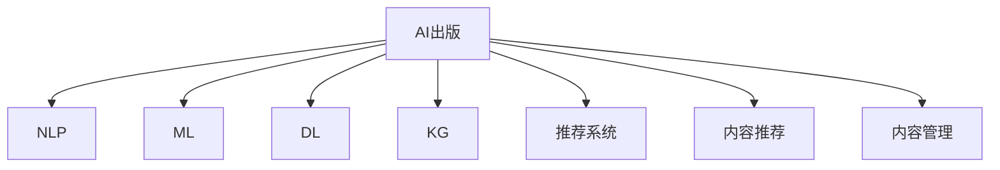
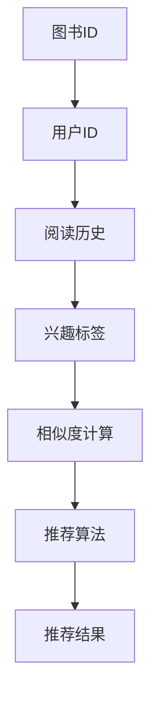
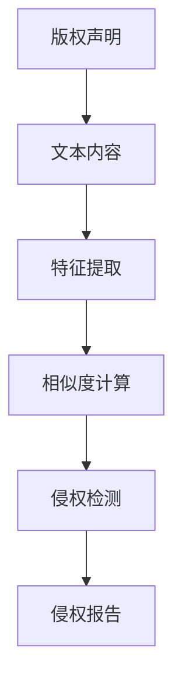

                 

# AI出版业前景：技术创新，场景应用无限

> 关键词：AI出版, 自然语言处理(NLP), 机器学习(ML), 深度学习(DL), 知识图谱(KG), 推荐系统, 内容推荐, 内容管理

## 1. 背景介绍

### 1.1 问题由来
出版业作为知识传播与创新的重要载体，正面临着数字化转型的巨大挑战。传统出版流程繁琐、效率低下，难以适应快速变化的市场需求和读者口味。数字化转型需要技术赋能，以提高出版的灵活性和效率，同时提升内容质量。

在此背景下，AI技术尤其是自然语言处理（NLP）和机器学习（ML）在出版业的应用成为关注的焦点。借助AI技术，出版业可以实现在线内容生产、个性化推荐、自动化编辑校对、版权保护等众多创新应用，为出版业带来无限的可能性。

### 1.2 问题核心关键点
AI出版技术主要围绕以下几个核心关键点展开：

1. **内容生成**：利用AI自动生成文章、书评、新闻报道等内容，减少人工撰写工作量。
2. **内容推荐**：根据用户兴趣和阅读历史推荐个性化内容，提升用户体验。
3. **内容管理**：自动处理版权、版权保护、版本控制等问题，提升出版流程的自动化和标准化。
4. **自动化编辑与校对**：通过AI技术实现文章的自动编辑和校对，提高出版效率。
5. **知识图谱**：构建出版领域的知识图谱，提升内容检索和关联的精准性。

这些关键技术点共同构成了AI在出版业的全面应用，推动了出版业从传统纸质出版向数字化、智能化方向转型。

### 1.3 问题研究意义
研究AI出版技术，对于出版业的数字化转型和智能化升级，具有重要的现实意义：

1. **提升出版效率**：AI技术可以自动化处理大量重复性工作，节省人力和时间成本。
2. **个性化推荐**：AI可以根据用户行为数据，精准推荐用户感兴趣的内容，提升用户满意度和留存率。
3. **内容质量提升**：通过AI辅助编辑和校对，可以大幅提升内容的准确性和可读性。
4. **版权保护**：AI技术可以自动检测和保护版权，减少侵权风险。
5. **知识管理**：知识图谱技术可以将海量知识资源高效管理，提升内容的检索和关联能力。

## 2. 核心概念与联系

### 2.1 核心概念概述

为更好地理解AI出版技术的应用，本节将介绍几个核心概念：

- **AI出版**：利用人工智能技术，实现出版内容自动化生成、个性化推荐、版权保护等，提升出版效率和内容质量。
- **自然语言处理(NLP)**：处理和分析人类语言的技术，包括文本分类、情感分析、命名实体识别等。
- **机器学习(ML)**：一种数据驱动的学习方法，通过数据训练模型，自动识别模式并做出预测。
- **深度学习(DL)**：一种特殊类型的机器学习，通过多层次神经网络实现复杂数据的表示和分析。
- **知识图谱(KG)**：由节点和边组成的知识网络，用于描述和表示知识，支持内容检索和关联。
- **推荐系统**：根据用户的历史行为和兴趣，推荐相关内容或产品，提升用户体验。
- **内容推荐**：通过推荐系统，将个性化内容推荐给用户，提升用户粘性和满意度。
- **内容管理**：通过AI技术实现内容的自动化管理，包括版权保护、版本控制等。

这些核心概念之间的逻辑关系可以通过以下Mermaid流程图来展示：



这个流程图展示了AI出版技术的应用框架，各概念之间的联系：

1. 人工智能出版应用涵盖NLP、ML、DL和KG等技术。
2. NLP技术用于文本处理和内容生成。
3. ML和DL技术用于模型训练和预测。
4. KG技术用于知识管理和内容关联。
5. 推荐系统实现个性化内容推荐。
6. 内容管理包括版权保护、版本控制等。

这些概念共同构成了AI出版技术的核心框架，使其能够在各种场景下发挥作用。

## 3. 核心算法原理 & 具体操作步骤
### 3.1 算法原理概述

AI出版技术主要包括基于NLP和ML的多个子算法，核心算法原理可归纳如下：

1. **文本分类与情感分析**：利用NLP技术，对文本进行分类和情感分析，提取文章主题和情感倾向，用于内容推荐和自动化编辑。
2. **命名实体识别**：识别文本中的实体（如人名、地名、组织名等），用于内容关联和知识管理。
3. **机器翻译**：利用DL技术，实现多语言翻译，拓展内容覆盖范围。
4. **知识图谱构建**：利用KG技术，构建出版领域的知识图谱，实现内容的精准检索和关联。
5. **推荐系统**：利用ML技术，对用户行为数据进行分析，推荐个性化内容。

### 3.2 算法步骤详解

基于AI出版技术的算法步骤可概括为以下几个关键步骤：

**Step 1: 数据预处理**
- 收集出版内容相关的文本数据，包括书籍摘要、新闻报道、用户评论等。
- 清洗文本数据，去除噪声和无关信息。
- 分词、去除停用词、词形还原等预处理操作。

**Step 2: 特征提取**
- 使用NLP技术，提取文本的语义、情感、实体等特征。
- 构建文本特征向量，用于后续的分类、情感分析等任务。
- 使用ML技术，从用户行为数据中提取兴趣特征，用于内容推荐。

**Step 3: 模型训练**
- 使用DL技术，训练文本分类、情感分析、机器翻译等模型。
- 使用KG技术，构建出版领域的知识图谱。
- 使用ML技术，训练推荐系统，根据用户行为数据预测兴趣。

**Step 4: 内容生成与推荐**
- 使用训练好的模型，自动生成文章、新闻报道等内容。
- 根据用户历史行为和兴趣，使用推荐系统推荐个性化内容。
- 使用知识图谱技术，关联内容并提升检索效果。

**Step 5: 自动化编辑与校对**
- 使用训练好的模型，进行文章的自动化编辑和校对。
- 使用KG技术，自动标注文本中的实体和关键词。

**Step 6: 版权保护与内容管理**
- 使用DL技术，检测内容是否侵权，保护版权。
- 使用ML技术，管理内容的版本控制，记录修改历史。

### 3.3 算法优缺点

AI出版技术具有以下优点：
1. 自动化程度高，能大幅提升出版效率。
2. 个性化推荐提升用户满意度和留存率。
3. 内容质量提升，减少人工校对工作。
4. 版权保护和内容管理标准化，减少侵权风险。

同时，该技术也存在一些局限性：
1. 依赖高质量数据，数据获取成本较高。
2. 模型训练和优化复杂，需要大量计算资源。
3. 推荐系统的准确性受限于用户数据的完备性。
4. 版权保护的准确性和及时性仍需提升。
5. 自动化编辑和校对的准确性受限于模型性能。

尽管存在这些局限性，但AI出版技术的应用前景依然广阔，尤其是在提升出版效率和用户体验方面具有巨大潜力。

### 3.4 算法应用领域

AI出版技术已经在多个领域得到广泛应用，例如：

- **图书出版**：自动生成书籍摘要、推荐书籍，提升读者体验。
- **新闻出版**：自动翻译、内容推荐，提升新闻时效性和个性化。
- **学术出版**：文献自动分类、引用关联，提升研究效率。
- **教育出版**：智能推荐教材、作业批改，提升教学质量。
- **版权保护**：自动检测和保护版权，减少侵权风险。
- **内容管理**：自动化内容管理，提升运营效率。

除了上述这些经典应用外，AI出版技术还将拓展到更多领域，如音乐出版、视频出版等，为内容创作和出版行业带来新的发展机遇。

## 4. 数学模型和公式 & 详细讲解 & 举例说明
### 4.1 数学模型构建

本节将使用数学语言对AI出版技术的应用进行严格刻画。

假设输入文本为 $x$，用户行为数据为 $y$，输出为 $z$（如推荐内容、版权保护结果等）。则AI出版技术的应用模型可以表示为：

$$
z = f(x, y)
$$

其中 $f$ 为模型映射函数，通过训练数据 $D=\{(x_i, y_i, z_i)\}_{i=1}^N$ 进行学习，目标是最小化预测误差：

$$
\min_{f} \sum_{i=1}^N ||f(x_i, y_i) - z_i||^2
$$

### 4.2 公式推导过程

以下我们以文本分类和情感分析为例，推导模型的公式及其参数优化方法。

**文本分类**
假设输入文本 $x$ 被分为 $k$ 类，模型预测结果为 $z_i$。则分类问题可以表示为：

$$
z_i = \max_{j=1}^k (w_j^T\phi(x) + b_j)
$$

其中 $w_j$ 为第 $j$ 类权重向量，$\phi(x)$ 为输入文本的特征向量表示，$b_j$ 为偏置项。

分类问题可以转化为最大熵分类问题，目标函数为：

$$
\min_{w,b} -\sum_{i=1}^N \sum_{j=1}^k y_{ij}\log(w_j^T\phi(x_i) + b_j)
$$

使用梯度下降等优化算法，求解上述目标函数，即可得到最优权重 $w$ 和偏置 $b$。

**情感分析**
情感分析可以表示为回归问题，假设输入文本 $x$ 的情感得分 $z_i$ 为 $y_i$ 的线性函数：

$$
z_i = w^T\phi(x_i) + b
$$

其中 $w$ 为模型权重，$b$ 为偏置项。目标函数为：

$$
\min_{w,b} \sum_{i=1}^N ||z_i - y_i||^2
$$

使用梯度下降等优化算法，求解上述目标函数，即可得到最优权重 $w$ 和偏置 $b$。

### 4.3 案例分析与讲解

以新闻推荐系统为例，介绍AI出版技术的应用。

**数据收集与处理**
- 收集用户阅读新闻的历史数据，包括新闻ID、阅读时间、兴趣标签等。
- 从新闻数据库中提取新闻的标题、摘要、关键词等特征。

**特征提取与选择**
- 使用TF-IDF等方法，提取新闻的关键词和摘要。
- 使用NLP技术，提取新闻的情感倾向和主题。
- 选择影响用户阅读行为的重要特征，用于模型训练。

**模型训练**
- 构建用户-新闻的推荐矩阵，表示用户对新闻的评分。
- 使用协同过滤等ML技术，训练推荐模型。
- 使用DL技术，训练文本分类和情感分析模型，提取新闻特征。

**内容推荐**
- 根据用户历史行为数据，预测用户对新闻的评分。
- 根据推荐模型，预测用户对新闻的兴趣度。
- 根据新闻的分类和情感分析结果，提升推荐准确性。

**案例分析**
假设某用户阅读了多篇关于科技的新闻，系统通过NLP技术提取这些新闻的情感倾向和主题，发现该用户对科技话题非常感兴趣。根据协同过滤等ML技术，系统预测该用户对其他科技新闻的评分，并使用推荐模型生成个性化推荐列表。最终，系统推荐了多篇科技领域的深度文章，提升了用户的阅读体验。

## 5. 项目实践：代码实例和详细解释说明
### 5.1 开发环境搭建

在进行AI出版技术开发前，需要先搭建好开发环境。以下是使用Python和TensorFlow进行开发的流程：

1. 安装Anaconda：从官网下载并安装Anaconda，用于创建独立的Python环境。

2. 创建并激活虚拟环境：
```bash
conda create -n tf-env python=3.8
conda activate tf-env
```

3. 安装TensorFlow：根据CUDA版本，从官网获取对应的安装命令。例如：
```bash
conda install tensorflow -c tf
```

4. 安装其他依赖库：
```bash
pip install numpy pandas scikit-learn jupyter notebook ipython
```

完成上述步骤后，即可在`tf-env`环境中开始开发。

### 5.2 源代码详细实现

下面以文本分类和情感分析为例，给出使用TensorFlow进行模型开发的代码实现。

**文本分类**

```python
import tensorflow as tf
from tensorflow.keras.preprocessing.text import Tokenizer
from tensorflow.keras.preprocessing.sequence import pad_sequences
from tensorflow.keras.layers import Embedding, Dense, Dropout, LSTM, Bidirectional
from tensorflow.keras.models import Sequential

# 构建模型
model = Sequential([
    Embedding(input_dim=vocab_size, output_dim=embedding_dim, input_length=max_length),
    Dropout(0.2),
    LSTM(units=128, dropout=0.2, recurrent_dropout=0.2),
    Dense(units=num_classes, activation='softmax')
])

# 编译模型
model.compile(optimizer='adam', loss='categorical_crossentropy', metrics=['accuracy'])

# 训练模型
model.fit(X_train, y_train, epochs=10, batch_size=32, validation_data=(X_test, y_test))
```

**情感分析**

```python
import tensorflow as tf
from tensorflow.keras.preprocessing.text import Tokenizer
from tensorflow.keras.preprocessing.sequence import pad_sequences
from tensorflow.keras.layers import Embedding, Dense, Dropout, LSTM, Bidirectional
from tensorflow.keras.models import Sequential

# 构建模型
model = Sequential([
    Embedding(input_dim=vocab_size, output_dim=embedding_dim, input_length=max_length),
    Dropout(0.2),
    LSTM(units=128, dropout=0.2, recurrent_dropout=0.2),
    Dense(units=1, activation='sigmoid')
])

# 编译模型
model.compile(optimizer='adam', loss='binary_crossentropy', metrics=['accuracy'])

# 训练模型
model.fit(X_train, y_train, epochs=10, batch_size=32, validation_data=(X_test, y_test))
```

### 5.3 代码解读与分析

**文本分类**

- 使用`Tokenizer`将文本转换为数字序列。
- 使用`pad_sequences`将序列填充到相同长度。
- 使用`Embedding`层将数字序列转换为向量表示。
- 使用`LSTM`层进行特征提取。
- 使用`Dense`层进行分类。
- 使用`Adam`优化器和`categorical_crossentropy`损失函数进行训练。

**情感分析**

- 使用`Tokenizer`将文本转换为数字序列。
- 使用`pad_sequences`将序列填充到相同长度。
- 使用`Embedding`层将数字序列转换为向量表示。
- 使用`LSTM`层进行特征提取。
- 使用`Dense`层进行情感分类。
- 使用`Adam`优化器和`binary_crossentropy`损失函数进行训练。

以上代码展示了使用TensorFlow进行文本分类和情感分析的基本流程。开发者可以依据具体需求，对模型架构和超参数进行进一步优化。

### 5.4 运行结果展示

通过训练和测试，模型的性能可以量化为损失函数和准确率等指标。例如，对于文本分类任务，可以使用以下代码进行测试：

```python
# 测试模型
test_loss, test_acc = model.evaluate(X_test, y_test)
print(f'Test loss: {test_loss:.4f}, Test accuracy: {test_acc:.4f}')
```

## 6. 实际应用场景
### 6.1 智能图书推荐系统

智能图书推荐系统是AI出版技术的典型应用之一。传统图书推荐依赖人工分析和用户反馈，难以满足用户的多样化和个性化需求。而智能图书推荐系统通过AI技术，可以自动分析用户的阅读历史和兴趣，实时推荐符合用户口味的图书，提升用户体验。

**系统架构**



**应用场景**

- **个性化推荐**：系统根据用户历史阅读行为，自动推荐感兴趣的图书。
- **新书推荐**：系统根据图书内容特征，自动推荐新出版图书。
- **热门推荐**：系统根据图书销量和评价，推荐热门图书。

### 6.2 智能新闻推荐

智能新闻推荐系统利用AI技术，对新闻内容进行自动分类、情感分析和相关性计算，实时推荐用户感兴趣的新闻。

**系统架构**


**应用场景**

- **个性化推荐**：根据用户阅读历史，自动推荐感兴趣的新闻。
- **趋势推荐**：根据新闻内容特征，自动推荐热门话题和趋势。
- **实时推荐**：实时监测新闻动态，动态更新推荐结果。

### 6.3 版权保护系统

版权保护系统通过AI技术，自动检测和保护版权，减少侵权风险。

**系统架构**



**应用场景**

- **版权检测**：自动检测文章是否侵权。
- **版权证明**：自动生成版权声明和证明。
- **侵权预警**：实时监测版权状态，发出预警。

### 6.4 未来应用展望

随着AI技术的不断进步，AI出版技术将在更多领域得到应用，推动出版业数字化转型的进一步深入。未来，AI出版技术的发展趋势包括：

1. **多模态内容生成**：结合文本、图片、视频等多模态数据，生成更加丰富和互动的内容。
2. **内容个性化推荐**：通过更精准的用户画像和兴趣模型，实现更加个性化的内容推荐。
3. **智能编辑与校对**：通过AI技术自动完成文章的编辑和校对，提升内容质量。
4. **知识图谱整合**：构建更全面和精确的知识图谱，提升内容检索和关联的效率。
5. **自动化版权管理**：实现版权的自动化检测和管理，减少侵权风险。

AI出版技术的应用前景广阔，随着技术进步和市场需求的增长，将在出版业的数字化转型中发挥越来越重要的作用。

## 7. 工具和资源推荐
### 7.1 学习资源推荐

为帮助开发者系统掌握AI出版技术，推荐以下学习资源：

1. 《深度学习》课程：吴恩达教授在Coursera上的深度学习课程，涵盖深度学习的基本原理和应用。
2. 《TensorFlow实战》书籍：Google官方出版的TensorFlow实战书籍，提供从基础到进阶的TensorFlow学习路径。
3. 《自然语言处理综论》书籍：斯坦福大学提供的自然语言处理综论课程，涵盖NLP技术的基础和应用。
4. 《知识图谱理论与应用》书籍：清华大学出版社出版的知识图谱理论与应用书籍，提供知识图谱技术的基本理论和应用方法。
5. 《Python数据科学手册》书籍：由Jake VanderPlas撰写的Python数据科学手册，涵盖Python编程技巧和数据科学方法。

### 7.2 开发工具推荐

开发AI出版技术，可以使用以下工具：

1. PyTorch：Python深度学习框架，支持动态计算图，灵活度高。
2. TensorFlow：由Google开发的深度学习框架，生产部署方便，支持大规模分布式训练。
3. TensorBoard：TensorFlow配套的可视化工具，支持模型训练的实时监控和调试。
4. Weights & Biases：模型训练的实验跟踪工具，可以记录和可视化模型训练过程中的各项指标，方便对比和调优。
5. Keras：高级神经网络API，适合快速搭建和训练深度学习模型。
6. Jupyter Notebook：支持Python和其他编程语言的交互式编程环境，方便开发者进行实验和分享。

### 7.3 相关论文推荐

AI出版技术的发展离不开学界的持续研究，以下是几篇奠基性的相关论文，推荐阅读：

1. "Convolutional Neural Networks for Sentence Classification"（卷积神经网络用于文本分类）：ACL 2014，Yoon Kim。
2. "Bidirectional LSTM-Based Sentiment Analysis"（双向LSTM用于情感分析）：ACL 2014，Peng Bo, Hwee-Pink Tan, Jing Dai。
3. "Distributed Deep Learning with TensorFlow"（TensorFlow的分布式训练）：OSDI 2015，Alex Krizhevsky。
4. "Knowledge-Graph-Based Recommender System"（基于知识图谱的推荐系统）：KDD 2015，Jiawei Han。
5. "A Survey on Knowledge Graphs and Their Applications"（知识图谱综述）：ACL 2017，Dong-Jing Wang, Hong Xu。

这些论文代表了大数据技术在出版业应用的研究方向，为进一步的深入研究和开发提供了理论支持。

## 8. 总结：未来发展趋势与挑战
### 8.1 总结

本文对AI出版技术的应用进行了全面系统的介绍。首先阐述了AI出版技术在出版业数字化转型中的重要性，明确了内容生成、个性化推荐、版权保护等核心技术点。其次，从原理到实践，详细讲解了文本分类、情感分析、推荐系统等关键算法的数学模型和实现方法。同时，本文还介绍了基于AI出版技术的多个实际应用场景，展示了其在图书推荐、新闻推荐、版权保护等方面的强大能力。

通过对这些内容的系统梳理，可以看到，AI出版技术正在成为出版业数字化转型的重要驱动力，极大地提升了出版效率和内容质量。未来，伴随技术的不断进步，AI出版技术将在更多领域得到应用，为出版业带来全新的变革和机遇。

### 8.2 未来发展趋势

展望未来，AI出版技术将呈现以下几个发展趋势：

1. **技术融合**：AI出版技术将与物联网、区块链等新兴技术融合，推动出版业的全面智能化。
2. **数据驱动**：利用大数据和人工智能技术，实现内容的精准推荐和个性化定制。
3. **知识整合**：构建更全面、精确的知识图谱，提升内容检索和关联的效率。
4. **版权保护**：通过AI技术自动检测和保护版权，减少侵权风险。
5. **多模态内容**：结合文本、图片、视频等多模态数据，生成更加丰富和互动的内容。
6. **智能编辑与校对**：通过AI技术自动完成文章的编辑和校对，提升内容质量。

以上趋势凸显了AI出版技术的广阔前景，这些方向的探索发展，必将进一步推动出版业的数字化和智能化转型，提升内容创作和出版的效率和质量。

### 8.3 面临的挑战

尽管AI出版技术已经取得了瞩目成就，但在迈向更加智能化、普适化应用的过程中，仍面临诸多挑战：

1. **数据隐私**：用户数据的隐私保护和合规性是AI出版技术应用中的重要问题，需要严格的法律法规和数据治理机制。
2. **版权归属**：版权的归属和保护问题复杂，需要与法律专家合作，建立完善的版权保护体系。
3. **模型鲁棒性**：AI模型的鲁棒性和泛化性需要进一步提升，以应对复杂的出版环境和多变的用户需求。
4. **计算资源**：AI出版技术需要大量的计算资源和存储资源，如何在资源有限的情况下，提升模型的性能和效率，是技术应用中的一大挑战。
5. **内容审核**：AI模型的内容审核机制需要进一步完善，以确保输出的内容符合伦理道德和法律法规的要求。
6. **用户交互**：AI出版技术需要更自然、更智能的用户交互方式，提升用户的满意度和体验。

### 8.4 研究展望

面对AI出版技术所面临的挑战，未来的研究需要在以下几个方面寻求新的突破：

1. **隐私保护技术**：研究和开发隐私保护技术，确保用户数据的隐私和合规性。
2. **版权保护机制**：建立完善的版权保护机制，确保内容的原创性和合法性。
3. **鲁棒性提升**：研究和开发鲁棒性强的AI模型，提升模型的泛化性和鲁棒性。
4. **资源优化**：研究和开发资源优化技术，提升模型的计算效率和存储效率。
5. **内容审核机制**：研究和开发内容审核机制，确保内容的合法性和伦理道德性。
6. **交互设计**：研究和开发自然、智能的用户交互方式，提升用户体验。

这些研究方向的探索，必将引领AI出版技术迈向更高的台阶，为出版业带来更加智能化、普适化的发展。

## 9. 附录：常见问题与解答

**Q1：AI出版技术是否可以完全取代人类编辑？**

A: AI出版技术可以大幅提升出版效率和内容质量，但在某些领域，如深度内容创作、人文艺术等领域，人类编辑的重要性仍然不可替代。AI出版技术更多地是辅助和辅助人类的创作和编辑工作，提升整体的出版水平。

**Q2：AI出版技术是否适用于所有类型的出版物？**

A: AI出版技术适用于新闻、图书、学术文章等多种类型的出版物。但对于一些高深复杂的出版物，如哲学、艺术作品等，AI技术仍需结合人类专家的知识和理解，才能更好地理解和创作。

**Q3：AI出版技术的算法实现是否具有通用性？**

A: AI出版技术的算法实现具有一定程度的通用性，可以在多种出版物类型和应用场景中通用。但具体的应用场景和算法模型仍需根据实际情况进行调优和优化。

**Q4：AI出版技术在实际应用中是否存在误判风险？**

A: AI出版技术在实际应用中存在误判风险，需要通过算法优化和模型训练进行提升。同时，需要结合人工审核和验证，确保输出的内容符合伦理道德和法律法规的要求。

**Q5：AI出版技术的开发和部署是否需要专业技能？**

A: AI出版技术的开发和部署需要一定的专业技能，包括数据处理、模型训练、系统集成等。但对于熟悉Python、TensorFlow等工具的开发者，也可以通过学习和实践逐步掌握相关技能。

**Q6：AI出版技术在实际应用中是否需要持续更新和维护？**

A: AI出版技术需要持续更新和维护，以适应数据分布的变化和算法模型的进步。同时，需要根据具体的应用场景和需求进行优化和调整，保持系统的稳定性和高效性。

---

作者：禅与计算机程序设计艺术 / Zen and the Art of Computer Programming

