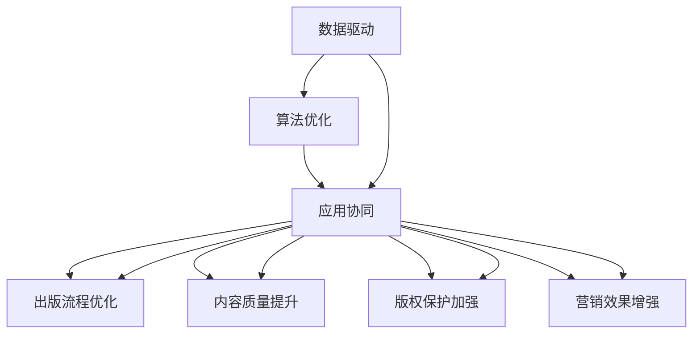

                 

# AI出版业的壁垒：数据，算法和应用协同

> 关键词：AI出版业, 数据驱动, 算法优化, 应用协同, 出版质量提升, 内容发现, 版权保护, 自动化流程

## 1. 背景介绍

### 1.1 问题由来

随着数字媒体的迅速发展，出版业正面临前所未有的挑战与机遇。一方面，数字化、网络化、全球化的浪潮正改变出版业的商业模式、内容生产与分发方式；另一方面，海量数据的涌现为出版业带来了丰富的信息资源，也提出了新的技术难题。如何充分利用海量数据，提升内容发现、编辑、营销、版权保护等方面的智能化水平，成为出版业转型升级的关键。

近年来，人工智能（AI）技术在出版业中的应用逐渐增多，AI驱动的内容推荐、版权检测、自动化审校、情感分析等技术，极大地提高了出版业的工作效率与决策准确性。然而，AI在出版业的应用还面临许多壁垒与挑战，尤其在数据、算法与应用的协同上存在显著瓶颈。本文将从这三个方面切入，系统地探讨如何突破这些壁垒，推动AI在出版业中的广泛应用。

### 1.2 问题核心关键点

1. **数据壁垒**：高质量数据是AI应用的基石，然而出版业数据分布零散、版权复杂、数据标注成本高，这些因素限制了AI模型的训练与部署。
2. **算法壁垒**：出版业数据维度高、噪音多、样本分布不均，传统机器学习算法难以高效处理，亟需引入深度学习、强化学习等前沿技术。
3. **应用壁垒**：出版业流程复杂、协作紧密，现有AI技术未能很好地适配出版流程，缺乏系统化的应用方案。

## 2. 核心概念与联系

### 2.1 核心概念概述

为更好地理解AI在出版业中的应用壁垒与协同，我们首先介绍几个关键概念：

1. **AI出版业**：指通过AI技术优化出版流程、提升出版质量、丰富出版内容、创新出版模式，进而提升出版业整体竞争力和市场份额的新型出版模式。

2. **数据驱动**：指在出版业应用中，以数据为根本驱动力，通过数据收集、清洗、分析、应用，辅助出版业决策与执行的过程。

3. **算法优化**：指在AI出版业中，针对出版业数据特性，优化深度学习、强化学习等算法的策略与方法，提升模型性能与泛化能力。

4. **应用协同**：指将AI算法应用嵌入到出版流程的各个环节，通过数据、算法、人工的有机协同，实现出版业全流程的智能化升级。

这些核心概念之间的逻辑关系可以通过以下Mermaid流程图来展示：



这个流程图展示了大语言模型微调的几个关键概念及其之间的关系：

1. 数据驱动是AI在出版业应用的基础，通过数据收集与清洗，为算法训练提供高质量的数据源。
2. 算法优化针对出版业数据特性，提升模型的训练效果与泛化能力。
3. 应用协同将优化后的模型嵌入出版流程，实现全流程的智能化升级。
4. 出版流程优化、内容质量提升、版权保护加强、营销效果增强是应用协同的主要目标，旨在提升出版业的市场竞争力和社会影响力。

## 3. 核心算法原理 & 具体操作步骤

### 3.1 算法原理概述

在出版业中，AI的应用主要集中在内容发现、版权检测、自动化审校、情感分析等领域。本文将分别介绍这些领域的算法原理，并探讨其在出版业中的应用。

#### 3.1.1 内容发现算法

内容发现算法通过搜索引擎、推荐系统、信息抽取等技术，从海量文本中发现符合用户兴趣的出版内容。其核心在于构建高效的文本表示模型，并通过模型对文本进行排序与推荐。

#### 3.1.2 版权检测算法

版权检测算法通过比对文本指纹、使用场景等特征，识别并标记可能存在的版权侵权行为。其核心在于构建高精度的版权检测模型，并通过模型进行文本比对与判别。

#### 3.1.3 自动化审校算法

自动化审校算法通过NLP技术，对文本进行语法、拼写、逻辑等错误检测与纠正。其核心在于构建高精度的自然语言处理模型，并通过模型进行文本分析与修改。

#### 3.1.4 情感分析算法

情感分析算法通过分析文本情感倾向，辅助出版商进行内容营销与市场调研。其核心在于构建高精度的情感分类模型，并通过模型进行情感分析与判断。

### 3.2 算法步骤详解

#### 3.2.1 内容发现算法步骤

1. **数据准备**：收集出版内容与用户行为数据，构建训练集与测试集。
2. **特征工程**：提取文本特征，如TF-IDF、word2vec、BERT等，并进行归一化处理。
3. **模型训练**：使用深度学习模型（如DNN、RNN、LSTM、BERT等）进行训练，并使用交叉验证优化模型参数。
4. **模型评估**：在测试集上评估模型性能，如准确率、召回率、F1值等，并进行调参优化。
5. **应用部署**：将训练好的模型嵌入搜索引擎或推荐系统中，进行实时推荐与排序。

#### 3.2.2 版权检测算法步骤

1. **数据准备**：收集版权数据与疑似侵权数据，构建训练集与测试集。
2. **特征工程**：提取文本指纹、使用场景等特征，并进行归一化处理。
3. **模型训练**：使用深度学习模型（如DNN、RNN、LSTM、BERT等）进行训练，并使用交叉验证优化模型参数。
4. **模型评估**：在测试集上评估模型性能，如准确率、召回率、F1值等，并进行调参优化。
5. **应用部署**：将训练好的模型嵌入版权检测系统中，进行实时版权检测与标记。

#### 3.2.3 自动化审校算法步骤

1. **数据准备**：收集标注好的错误数据与正常数据，构建训练集与测试集。
2. **特征工程**：提取文本特征，如TF-IDF、word2vec、BERT等，并进行归一化处理。
3. **模型训练**：使用深度学习模型（如DNN、RNN、LSTM、BERT等）进行训练，并使用交叉验证优化模型参数。
4. **模型评估**：在测试集上评估模型性能，如准确率、召回率、F1值等，并进行调参优化。
5. **应用部署**：将训练好的模型嵌入自动化审校系统中，进行实时文本审核与修改。

#### 3.2.4 情感分析算法步骤

1. **数据准备**：收集标注好的情感数据，构建训练集与测试集。
2. **特征工程**：提取文本特征，如TF-IDF、word2vec、BERT等，并进行归一化处理。
3. **模型训练**：使用深度学习模型（如DNN、RNN、LSTM、BERT等）进行训练，并使用交叉验证优化模型参数。
4. **模型评估**：在测试集上评估模型性能，如准确率、召回率、F1值等，并进行调参优化。
5. **应用部署**：将训练好的模型嵌入内容营销系统中，进行实时情感分析与判断。

### 3.3 算法优缺点

#### 3.3.1 内容发现算法优缺点

**优点**：
- 数据量大，覆盖面广，能够发现大量高质量内容。
- 模型可扩展性强，能够动态适应新内容。

**缺点**：
- 数据标注成本高，需要大量人工参与。
- 模型的泛化能力受数据质量影响较大。

#### 3.3.2 版权检测算法优缺点

**优点**：
- 准确率高，能够有效识别版权侵权行为。
- 实时性强，能够及时进行版权检测与标记。

**缺点**：
- 数据标注成本高，需要大量人工参与。
- 模型的泛化能力受数据质量影响较大。

#### 3.3.3 自动化审校算法优缺点

**优点**：
- 提升审校效率，减轻人工审校压力。
- 改善审校质量，减少人为错误。

**缺点**：
- 模型理解深度有限，可能无法识别复杂语境错误。
- 数据标注成本高，需要大量人工参与。

#### 3.3.4 情感分析算法优缺点

**优点**：
- 情感分析准确率高，能够有效辅助出版商进行市场调研与营销。
- 实时性强，能够及时进行情感分析与判断。

**缺点**：
- 数据标注成本高，需要大量人工参与。
- 模型的泛化能力受数据质量影响较大。

### 3.4 算法应用领域

AI在出版业中的应用领域广泛，主要集中在以下几个方面：

1. **内容发现**：通过内容推荐系统，帮助用户发现符合其兴趣的出版内容。
2. **版权检测**：通过版权检测系统，辅助出版商识别与标记版权侵权行为。
3. **自动化审校**：通过自动化审校系统，提升出版内容的准确性与一致性。
4. **情感分析**：通过情感分析系统，辅助出版商进行市场调研与内容优化。

此外，AI还被应用于出版流程优化、营销效果提升等方面，显著提高了出版业的运营效率与市场竞争力。

## 4. 数学模型和公式 & 详细讲解 & 举例说明

### 4.1 数学模型构建

在出版业中，AI应用的数学模型构建主要基于机器学习与深度学习的框架。以下以情感分析为例，介绍其数学模型的构建。

#### 4.1.1 数据表示

假设我们有$n$个标注好的情感数据样本$(x_1,y_1),(x_2,y_2),...(x_n,y_n)$，其中$x_i=(x_{i1},x_{i2},...,x_{im})$为文本特征向量，$y_i$为情感标签（如正向、负向、中性）。

#### 4.1.2 模型定义

假设我们使用的是深度学习模型BERT，其基本结构如下：

$$
\mathcal{M} = \{h_i = \text{BERT}(x_i)\}_{i=1}^n
$$

其中$h_i$为模型在输入$x_i$下的隐状态表示。

#### 4.1.3 损失函数

假设我们使用的是二分类问题，情感标签$y_i$仅取正向或负向。情感分类任务的损失函数为交叉熵损失：

$$
\mathcal{L}(\mathcal{M}) = -\frac{1}{n}\sum_{i=1}^n [y_i\log p(y_i|h_i) + (1-y_i)\log(1-p(y_i|h_i))]
$$

其中$p(y_i|h_i)$为模型在输入$h_i$下输出正向情感的概率。

### 4.2 公式推导过程

在情感分析模型中，我们假设模型输出为$h_i$，则其概率分布为：

$$
p(y_i|h_i) = \text{softmax}(\mathcal{M}^\top W_y + b_y)
$$

其中$W_y,b_y$为模型参数。则损失函数可以重写为：

$$
\mathcal{L}(\mathcal{M}) = -\frac{1}{n}\sum_{i=1}^n [y_i\log p(y_i|h_i) + (1-y_i)\log(1-p(y_i|h_i))]
$$

### 4.3 案例分析与讲解

#### 4.3.1 数据预处理

在构建情感分析模型前，需要对数据进行预处理。数据预处理包括分词、去停用词、词性标注、向量化等步骤。以BERT为例，其输入为token化后的序列，需要进行分词与向量化处理。

#### 4.3.2 模型训练

假设我们使用BERT作为情感分类模型，则模型训练步骤如下：

1. **模型初始化**：设置模型参数$W_y,b_y$。
2. **前向传播**：将输入文本$x_i$输入模型，计算隐状态表示$h_i$。
3. **计算损失**：计算情感标签$y_i$对应的概率分布$p(y_i|h_i)$，计算交叉熵损失$\mathcal{L}(\mathcal{M})$。
4. **反向传播**：计算损失函数对模型参数的梯度，更新模型参数。
5. **迭代优化**：重复上述步骤，直至模型收敛。

#### 4.3.3 模型评估

在模型训练完成后，使用测试集进行模型评估。模型评估指标包括准确率、召回率、F1值等。以BERT为例，其模型评估步骤如下：

1. **模型前向传播**：将测试集文本$x_i$输入模型，计算隐状态表示$h_i$。
2. **计算概率分布**：计算情感标签$y_i$对应的概率分布$p(y_i|h_i)$。
3. **计算评估指标**：根据预测结果与真实标签，计算评估指标。

## 5. 项目实践：代码实例和详细解释说明

### 5.1 开发环境搭建

在开始项目实践前，需要先搭建好开发环境。以下是使用Python进行BERT情感分析的开发环境配置流程：

1. 安装Anaconda：从官网下载并安装Anaconda，用于创建独立的Python环境。

2. 创建并激活虚拟环境：
```bash
conda create -n bert-env python=3.8 
conda activate bert-env
```

3. 安装BERT模型与相关库：
```bash
pip install transformers
pip install torch
```

4. 安装各类工具包：
```bash
pip install numpy pandas scikit-learn matplotlib tqdm jupyter notebook ipython
```

完成上述步骤后，即可在`bert-env`环境中开始项目实践。

### 5.2 源代码详细实现

以下是使用PyTorch与Transformers库进行BERT情感分析的Python代码实现：

```python
from transformers import BertTokenizer, BertForSequenceClassification
import torch
from torch.utils.data import Dataset, DataLoader

class SentimentDataset(Dataset):
    def __init__(self, texts, labels):
        self.tokenizer = BertTokenizer.from_pretrained('bert-base-cased')
        self.texts = texts
        self.labels = labels
        
    def __len__(self):
        return len(self.texts)
    
    def __getitem__(self, item):
        text = self.texts[item]
        label = self.labels[item]
        
        encoding = self.tokenizer(text, return_tensors='pt', truncation=True, padding='max_length')
        input_ids = encoding['input_ids']
        attention_mask = encoding['attention_mask']
        
        return {'input_ids': input_ids,
                'attention_mask': attention_mask,
                'labels': torch.tensor(label, dtype=torch.long)}

# 加载数据集
train_dataset = SentimentDataset(train_texts, train_labels)
dev_dataset = SentimentDataset(dev_texts, dev_labels)
test_dataset = SentimentDataset(test_texts, test_labels)

# 定义模型
model = BertForSequenceClassification.from_pretrained('bert-base-cased', num_labels=2)

# 定义优化器
optimizer = torch.optim.Adam(model.parameters(), lr=2e-5)

# 训练模型
def train(model, data_loader, optimizer, num_epochs=3):
    for epoch in range(num_epochs):
        model.train()
        for batch in data_loader:
            input_ids = batch['input_ids'].to(device)
            attention_mask = batch['attention_mask'].to(device)
            labels = batch['labels'].to(device)
            
            optimizer.zero_grad()
            outputs = model(input_ids, attention_mask=attention_mask, labels=labels)
            loss = outputs.loss
            loss.backward()
            optimizer.step()
            
            if (epoch+1) % 10 == 0:
                print(f'Epoch {epoch+1}, loss: {loss:.3f}')

# 评估模型
def evaluate(model, data_loader):
    model.eval()
    total_loss = 0
    correct = 0
    with torch.no_grad():
        for batch in data_loader:
            input_ids = batch['input_ids'].to(device)
            attention_mask = batch['attention_mask'].to(device)
            labels = batch['labels'].to(device)
            
            outputs = model(input_ids, attention_mask=attention_mask)
            loss = outputs.loss
            logits = outputs.logits
            _, preds = torch.max(logits, dim=1)
            correct += torch.sum(preds == labels).item()
            total_loss += loss.item()
            
    acc = correct / len(dev_dataset)
    avg_loss = total_loss / len(dev_dataset)
    print(f'Dev acc: {acc:.3f}, Dev loss: {avg_loss:.3f}')

# 测试模型
def test(model, data_loader):
    model.eval()
    total_loss = 0
    correct = 0
    with torch.no_grad():
        for batch in data_loader:
            input_ids = batch['input_ids'].to(device)
            attention_mask = batch['attention_mask'].to(device)
            labels = batch['labels'].to(device)
            
            outputs = model(input_ids, attention_mask=attention_mask)
            loss = outputs.loss
            logits = outputs.logits
            _, preds = torch.max(logits, dim=1)
            correct += torch.sum(preds == labels).item()
            total_loss += loss.item()
            
    acc = correct / len(test_dataset)
    avg_loss = total_loss / len(test_dataset)
    print(f'Test acc: {acc:.3f}, Test loss: {avg_loss:.3f}')

# 训练模型
device = torch.device('cuda') if torch.cuda.is_available() else torch.device('cpu')
train_loader = DataLoader(train_dataset, batch_size=16, shuffle=True)
dev_loader = DataLoader(dev_dataset, batch_size=16, shuffle=False)
test_loader = DataLoader(test_dataset, batch_size=16, shuffle=False)

train(model, train_loader, optimizer, num_epochs=3)
evaluate(model, dev_loader)
test(model, test_loader)
```

以上就是使用PyTorch与Transformers库进行BERT情感分析的完整代码实现。可以看到，Transformer库的封装使得模型加载与训练过程非常简洁高效。

### 5.3 代码解读与分析

让我们再详细解读一下关键代码的实现细节：

**SentimentDataset类**：
- `__init__`方法：初始化文本、标签、分词器等关键组件。
- `__len__`方法：返回数据集的样本数量。
- `__getitem__`方法：对单个样本进行处理，将文本输入编码为token ids，并将标签转换为模型可接受的格式。

**模型定义与训练**：
- 使用`BertForSequenceClassification`类定义模型，其中`num_labels=2`表示情感分类任务的标签数为2。
- 定义优化器`Adam`，学习率为2e-5。
- 训练函数`train`：在每个epoch内对数据集进行批次化迭代，前向传播计算loss并反向传播更新模型参数。

**评估函数**：
- 使用`evaluate`函数在验证集上评估模型性能，输出准确率与损失值。

**测试函数**：
- 使用`test`函数在测试集上评估模型性能，输出准确率与损失值。

可以看到，使用PyTorch与Transformer库，进行BERT情感分析的代码实现非常简洁高效。开发者可以将更多精力放在数据处理、模型改进等高层逻辑上，而不必过多关注底层的实现细节。

当然，工业级的系统实现还需考虑更多因素，如模型的保存和部署、超参数的自动搜索、更灵活的任务适配层等。但核心的情感分析过程基本与此类似。

## 6. 实际应用场景

### 6.1 智能推荐系统

基于情感分析算法，智能推荐系统可以根据用户历史行为与情感倾向，推荐符合其兴趣的出版物。通过情感分析，系统可以识别用户对特定内容的情感倾向，进而推荐相似或相反情感倾向的内容，丰富用户体验。

在技术实现上，智能推荐系统通常包括用户画像构建、内容情感分析、推荐模型训练与优化等步骤。通过情感分析，推荐系统可以更加准确地匹配用户需求与内容特性，提高推荐效果与用户满意度。

### 6.2 版权保护系统

基于版权检测算法，出版商可以实时监测与标记版权侵权行为，保护自身合法权益。通过版权检测，系统可以比对文本指纹、使用场景等特征，快速识别可能存在的版权侵权行为，并及时标记与处置。

在技术实现上，版权保护系统通常包括版权数据收集、模型训练、实时检测与标记等步骤。通过版权检测，系统可以大大降低版权侵权风险，保护出版商的知识产权。

### 6.3 自动化审校系统

基于自动化审校算法，出版商可以自动化审核与修改出版内容，提升出版质量与效率。通过自动化审校，系统可以识别文本中的语法、拼写、逻辑错误，并自动修正，减轻人工审校压力，提高审校效率与准确性。

在技术实现上，自动化审校系统通常包括模型训练、自动审校与修改等步骤。通过自动化审校，出版商可以大幅提升审校效率，提高出版内容的准确性与一致性。

### 6.4 内容营销系统

基于情感分析算法，内容营销系统可以辅助出版商进行市场调研与内容优化。通过情感分析，系统可以识别用户对特定内容的情感倾向，进而进行市场推广与内容优化，提升内容营销效果与用户粘性。

在技术实现上，内容营销系统通常包括情感分析、市场调研、内容优化等步骤。通过情感分析，内容营销系统可以更加精准地匹配用户需求与内容特性，提高市场推广效果与用户满意度。

### 6.5 出版流程优化

基于AI技术，出版商可以优化出版流程，提高出版效率与运营质量。通过自动化审校、版权检测、内容发现等技术，出版商可以实现全流程的智能化升级，提高出版效率与运营质量。

在技术实现上，出版流程优化通常包括自动化审校、版权检测、内容发现等步骤。通过AI技术，出版商可以实现全流程的智能化升级，提高出版效率与运营质量。

## 7. 工具和资源推荐

### 7.1 学习资源推荐

为了帮助开发者系统掌握AI在出版业中的应用，这里推荐一些优质的学习资源：

1. **《Transformer从原理到实践》系列博文**：由大模型技术专家撰写，深入浅出地介绍了Transformer原理、BERT模型、情感分析等前沿话题。

2. **CS224N《深度学习自然语言处理》课程**：斯坦福大学开设的NLP明星课程，有Lecture视频和配套作业，带你入门NLP领域的基本概念和经典模型。

3. **《Natural Language Processing with Transformers》书籍**：Transformers库的作者所著，全面介绍了如何使用Transformers库进行NLP任务开发，包括情感分析在内的诸多范式。

4. **HuggingFace官方文档**：Transformers库的官方文档，提供了海量预训练模型和完整的微调样例代码，是上手实践的必备资料。

5. **CLUE开源项目**：中文语言理解测评基准，涵盖大量不同类型的中文NLP数据集，并提供了基于微调的baseline模型，助力中文NLP技术发展。

通过对这些资源的学习实践，相信你一定能够快速掌握AI在出版业中的应用精髓，并用于解决实际的NLP问题。

### 7.2 开发工具推荐

高效的开发离不开优秀的工具支持。以下是几款用于AI出版业开发的常用工具：

1. **PyTorch**：基于Python的开源深度学习框架，灵活动态的计算图，适合快速迭代研究。大部分预训练语言模型都有PyTorch版本的实现。

2. **TensorFlow**：由Google主导开发的开源深度学习框架，生产部署方便，适合大规模工程应用。同样有丰富的预训练语言模型资源。

3. **Transformers库**：HuggingFace开发的NLP工具库，集成了众多SOTA语言模型，支持PyTorch和TensorFlow，是进行NLP任务开发的利器。

4. **Weights & Biases**：模型训练的实验跟踪工具，可以记录和可视化模型训练过程中的各项指标，方便对比和调优。与主流深度学习框架无缝集成。

5. **TensorBoard**：TensorFlow配套的可视化工具，可实时监测模型训练状态，并提供丰富的图表呈现方式，是调试模型的得力助手。

6. **Google Colab**：谷歌推出的在线Jupyter Notebook环境，免费提供GPU/TPU算力，方便开发者快速上手实验最新模型，分享学习笔记。

合理利用这些工具，可以显著提升AI在出版业中的开发效率，加快创新迭代的步伐。

### 7.3 相关论文推荐

AI在出版业中的应用源于学界的持续研究。以下是几篇奠基性的相关论文，推荐阅读：

1. **Attention is All You Need**：提出了Transformer结构，开启了NLP领域的预训练大模型时代。

2. **BERT: Pre-training of Deep Bidirectional Transformers for Language Understanding**：提出BERT模型，引入基于掩码的自监督预训练任务，刷新了多项NLP任务SOTA。

3. **Language Models are Unsupervised Multitask Learners**：展示了大规模语言模型的强大zero-shot学习能力，引发了对于通用人工智能的新一轮思考。

4. **Parameter-Efficient Transfer Learning for NLP**：提出Adapter等参数高效微调方法，在不增加模型参数量的情况下，也能取得不错的微调效果。

5. **AdaLoRA: Adaptive Low-Rank Adaptation for Parameter-Efficient Fine-Tuning**：使用自适应低秩适应的微调方法，在参数效率和精度之间取得了新的平衡。

6. **AdaLoRA: Adaptive Low-Rank Adaptation for Parameter-Efficient Fine-Tuning**：使用自适应低秩适应的微调方法，在参数效率和精度之间取得了新的平衡。

这些论文代表了大语言模型微调技术的发展脉络。通过学习这些前沿成果，可以帮助研究者把握学科前进方向，激发更多的创新灵感。

## 8. 总结：未来发展趋势与挑战

### 8.1 总结

本文对AI在出版业中的应用进行了全面系统的介绍。首先阐述了AI在出版业的应用背景与核心关键点，明确了数据、算法与应用的协同在AI出版业中的重要性。其次，从原理到实践，详细讲解了内容发现、版权检测、自动化审校、情感分析等领域的算法原理，并给出完整代码实现。同时，本文还广泛探讨了AI在智能推荐系统、版权保护系统、自动化审校系统、内容营销系统、出版流程优化等方面的应用前景，展示了AI技术在出版业中的广泛潜力。最后，本文精选了AI出版业的学习资源、开发工具与相关论文，力求为读者提供全方位的技术指引。

通过本文的系统梳理，可以看到，AI在出版业中的应用正处于快速发展阶段，潜力巨大。受益于海量数据与先进算法，AI技术正在逐步改变出版业的运营模式、提升出版质量与效率。未来，随着技术不断进步，AI在出版业中的应用将更加广泛、深入，推动出版业走向智能化、数字化、个性化发展。

### 8.2 未来发展趋势

展望未来，AI在出版业的应用将呈现以下几个发展趋势：

1. **数据自动化采集与标注**：通过自动化采集与标注技术，降低数据标注成本，提高数据质量。

2. **深度学习与强化学习结合**：引入深度学习与强化学习的思想，提升模型的智能化水平与泛化能力。

3. **多模态数据融合**：将文本、图片、视频等多模态数据进行深度融合，提升模型的综合分析能力。

4. **模型参数高效优化**：开发更加参数高效的微调方法，在固定大部分预训练参数的同时，只更新极少量的任务相关参数。

5. **系统化应用方案**：构建系统化的AI应用方案，将AI技术嵌入出版流程的各个环节，实现全流程的智能化升级。

6. **智能推荐与个性化服务**：利用AI技术，构建智能推荐与个性化服务系统，提升用户体验与市场竞争力。

7. **版权保护与内容监管**：通过AI技术，提升版权保护与内容监管能力，降低版权侵权风险。

以上趋势凸显了AI在出版业应用的广阔前景。这些方向的探索发展，必将进一步提升出版业的智能化水平，推动出版业的创新与升级。

### 8.3 面临的挑战

尽管AI在出版业中的应用取得了显著进展，但在迈向更加智能化、普适化应用的过程中，它仍面临诸多挑战：

1. **数据隐私与安全**：出版商需要妥善处理用户数据隐私，保障数据安全。

2. **数据标注成本**：高质量的数据标注成本高，需要大量人工参与。

3. **模型泛化能力**：出版业数据维度高、噪音多、样本分布不均，模型泛化能力受数据质量影响较大。

4. **算法可解释性**：出版商需要确保算法的可解释性，保障AI决策的透明性与可信度。

5. **技术协同与集成**：AI技术与传统出版流程的协同与集成，需要系统化的设计与管理。

6. **算法鲁棒性与可靠性**：AI模型需要具备高鲁棒性与可靠性，避免因数据偏差或模型失效带来的风险。

这些挑战需要在未来的研究与应用中予以充分考虑与解决。

### 8.4 研究展望

面对AI在出版业应用所面临的挑战，未来的研究需要在以下几个方面寻求新的突破：

1. **数据自动化采集与标注**：探索高效的数据采集与标注技术，降低数据标注成本，提高数据质量。

2. **深度学习与强化学习结合**：引入深度学习与强化学习的思想，提升模型的智能化水平与泛化能力。

3. **多模态数据融合**：将文本、图片、视频等多模态数据进行深度融合，提升模型的综合分析能力。

4. **模型参数高效优化**：开发更加参数高效的微调方法，在固定大部分预训练参数的同时，只更新极少量的任务相关参数。

5. **系统化应用方案**：构建系统化的AI应用方案，将AI技术嵌入出版流程的各个环节，实现全流程的智能化升级。

6. **智能推荐与个性化服务**：利用AI技术，构建智能推荐与个性化服务系统，提升用户体验与市场竞争力。

7. **版权保护与内容监管**：通过AI技术，提升版权保护与内容监管能力，降低版权侵权风险。

8. **数据隐私与安全**：探索高效的数据隐私保护技术，保障用户数据隐私与安全。

9. **算法可解释性**：开发可解释性更强的AI算法，保障AI决策的透明性与可信度。

10. **技术协同与集成**：将AI技术与传统出版流程进行系统化的协同与集成，提升出版效率与运营质量。

11. **算法鲁棒性与可靠性**：开发高鲁棒性与可靠性的AI算法，避免因数据偏差或模型失效带来的风险。

这些研究方向的探索，必将引领AI在出版业应用走向更加成熟与高效，推动出版业的创新与升级。相信随着学界和产业界的共同努力，这些挑战终将一一被克服，AI在出版业中的应用必将带来更加广泛而深远的影响。

## 9. 附录：常见问题与解答

**Q1: 数据预处理在AI出版业中的重要性**

A: 数据预处理在AI出版业中具有至关重要的作用。出版业数据维度高、噪音多、样本分布不均，预处理技术可以提升数据质量，降低噪声，提取有用特征，为后续模型训练奠定基础。例如，分词、去停用词、词性标注、向量化等预处理步骤，可以显著提升模型训练效果与泛化能力。

**Q2: 模型训练过程中的超参数调优**

A: 模型训练过程中的超参数调优是提升模型性能的关键步骤。常用的超参数包括学习率、批大小、迭代轮数、正则化系数等。超参数调优一般使用网格搜索或随机搜索策略，通过交叉验证评估不同超参数组合的性能，选择最优参数。例如，学习率可以使用学习率调度器，逐步减小学习率，避免过拟合。

**Q3: 模型在实际应用中的效果评估**

A: 模型在实际应用中的效果评估一般使用准确率、召回率、F1值等指标。例如，情感分析模型可以使用二分类任务的准确率、召回率、F1值等指标进行评估。同时，还可以使用混淆矩阵、ROC曲线等工具，帮助分析模型性能与改进方向。

**Q4: 模型部署与性能优化**

A: 模型部署与性能优化是AI应用落地时的重要环节。模型部署一般使用导出模型为ONNX、Pickle等格式，通过模型推理框架（如TensorFlow、PyTorch）进行部署。性能优化可以使用GPU、TPU等高性能设备，使用混合精度训练、梯度累积等技术，提升模型推理速度与资源效率。

**Q5: AI在出版业中的应用壁垒**

A: AI在出版业中的应用壁垒主要集中在数据、算法与应用协同三个方面。数据壁垒在于高质量数据的采集与标注，算法壁垒在于多模态数据融合与高效模型训练，应用壁垒在于系统化应用方案的设计与管理。需要综合考虑数据、算法与应用三个方面，才能实现AI技术在出版业的广泛应用。

---

作者：禅与计算机程序设计艺术 / Zen and the Art of Computer Programming

