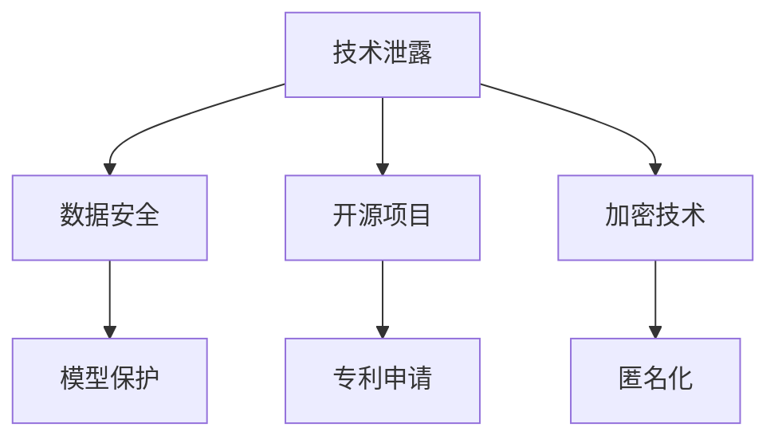

                 

# AI创业公司如何应对技术泄露?

> 关键词：技术泄露, AI创业, 数据安全, 模型保护, 开源项目, 专利申请, 加密技术, 匿名化

## 1. 背景介绍

在AI创业公司蓬勃发展的今天，技术泄露已经成为不可忽视的风险。特别是在深度学习、自然语言处理等领域，新技术的快速迭代和应用不断扩展，导致商业秘密和技术优势极易被泄露。这不仅损害了公司的核心竞争力，更可能导致业务停滞、市场份额减少，甚至是法律纠纷。因此，AI创业公司必须高度重视技术保护，采取多种手段应对技术泄露风险，以确保企业的持续健康发展。

## 2. 核心概念与联系

### 2.1 核心概念概述

为了更好地理解如何应对技术泄露，我们需要首先理解一些核心概念及其相互关系：

- **技术泄露**：指公司的商业秘密或技术优势被未经授权的人获得或公开，导致公司失去竞争优势。
- **数据安全**：涉及保护公司所拥有的数据免遭未经授权的访问、使用、修改或泄露，包括数据加密、匿名化、访问控制等。
- **模型保护**：针对AI模型的保护，防止模型被非法获取、逆向工程或对抗攻击。
- **开源项目**：通过在GitHub等平台公开源代码，加速技术传播和交流，但也带来了技术泄露的风险。
- **专利申请**：通过申请专利保护公司核心技术的知识产权，防止他人非法使用。
- **加密技术**：包括数据加密、模型加密等，保护数据的机密性和完整性。
- **匿名化**：将数据中的个人信息去除，以保护用户隐私和数据安全。

这些概念共同构成了应对技术泄露的技术框架。理解这些概念及其内在联系，有助于构建全面的技术保护策略。

### 2.2 核心概念原理和架构的 Mermaid 流程图



这个流程图展示了技术泄露与数据安全、模型保护、开源项目、专利申请、加密技术、匿名化之间的相互关系。

## 3. 核心算法原理 & 具体操作步骤
### 3.1 算法原理概述

应对技术泄露的核心算法原理主要基于以下几个方面：

1. **数据保护**：通过数据加密、匿名化等技术，保护公司数据不受未经授权的访问。
2. **模型保护**：利用模型加密、微调等手段，保护模型免遭非法获取和逆向工程。
3. **开源与专利**：在开源项目中采用适当的许可协议，同时积极申请专利保护，维护公司的技术优势。

### 3.2 算法步骤详解

应对技术泄露的具体操作步骤可以概括为以下几个关键步骤：

1. **数据管理与访问控制**：
   - 对公司数据进行分类分级，确保敏感数据受到严格的保护。
   - 实施访问控制策略，限制对敏感数据的访问权限。
   - 使用数据加密技术，保护数据在传输和存储过程中的机密性和完整性。

2. **模型训练与保护**：
   - 在模型训练过程中，采用差分隐私等技术，防止训练数据泄露。
   - 对训练好的模型进行加密，保护模型的结构、参数和推理过程。
   - 定期更新模型，防止攻击者通过逆向工程获取模型信息。

3. **开源与专利策略**：
   - 在开源项目中，选择合适的开源许可协议（如GPL、Apache等），确保代码在合理使用范围内，同时保护公司核心代码不被滥用。
   - 对于核心技术，积极申请专利保护，确保技术优势。

4. **定期审计与监控**：
   - 定期进行安全审计，识别和修复潜在的安全漏洞。
   - 部署监控系统，实时检测和响应潜在的安全威胁。

### 3.3 算法优缺点

应对技术泄露的算法具有以下优点：

- **预防性强**：通过数据保护和模型保护，可以提前防止数据泄露和模型盗用，避免潜在损失。
- **灵活性强**：开源与专利策略可以根据不同的技术特点，灵活选择保护方式，最大化公司利益。
- **透明度高**：开源项目可以增加技术的透明度，提升公司声誉，同时避免信息孤岛。

但这些算法也存在一些缺点：

- **成本高**：数据加密、模型保护、专利申请等都需要投入大量资源。
- **技术复杂**：特别是模型加密和差分隐私等技术，需要较高的技术水平和专业人才。
- **限制大**：严格的访问控制和加密措施，可能限制数据和模型的灵活使用。

### 3.4 算法应用领域

应对技术泄露的算法应用广泛，可以应用于各个领域的AI创业公司，包括但不限于：

- **金融科技**：保护用户数据和交易模型，防止金融诈骗和内部风险。
- **医疗健康**：保护患者隐私和医疗数据，防止数据滥用和隐私泄露。
- **智能制造**：保护工业数据和生产模型，防止工业间谍和技术盗用。
- **自动驾驶**：保护自动驾驶算法和传感器数据，防止技术泄露和模型盗用。

## 4. 数学模型和公式 & 详细讲解 & 举例说明

### 4.1 数学模型构建

在数学模型构建方面，主要涉及以下几个关键概念：

- **差分隐私**：通过在数据中添加噪声，确保单个数据点的隐私不会泄露，同时保证数据分析的准确性。
- **模型加密**：将模型参数和结构进行加密，确保模型在传输和存储过程中不被非法获取。

### 4.2 公式推导过程

以差分隐私为例，其基本思路是在原始数据上添加噪声，使得单个数据点的变化无法影响整体分析结果。具体的数学公式如下：

$$
\hat{f}(x) = f(x) + \epsilon \cdot N(\mu, \sigma^2)
$$

其中，$f(x)$ 表示原始的函数，$\hat{f}(x)$ 表示添加噪声后的函数，$N(\mu, \sigma^2)$ 表示高斯噪声分布，$\epsilon$ 和 $\sigma$ 是调节参数。

### 4.3 案例分析与讲解

假设我们有一个AI创业公司，核心产品是一个基于深度学习的医疗影像诊断系统。为了保护用户的医疗影像数据，我们采用差分隐私技术来保护数据隐私。具体来说，我们在训练过程中对医疗影像数据进行噪声注入，确保单个影像数据对模型训练的影响微乎其微。同时，我们在模型部署时，对模型进行加密，确保模型无法被非法获取和逆向工程。

## 5. 项目实践：代码实例和详细解释说明

### 5.1 开发环境搭建

为便于理解和实现技术保护策略，本节将介绍一个简单的开发环境搭建流程。

1. **安装Python和相关库**：
   ```bash
   pip install numpy pandas scikit-learn cryptography
   ```

2. **部署模型加密库**：
   ```bash
   pip install keras-encryption tensorflow-encrypted
   ```

3. **搭建数据安全系统**：
   ```bash
   sudo apt-get install openssl
   ```

### 5.2 源代码详细实现

以下是一个简单的Python代码示例，演示如何在训练过程中对数据进行差分隐私保护：

```python
from sklearn.datasets import load_boston
from sklearn.model_selection import train_test_split
from sklearn.linear_model import LinearRegression
from sklearn.metrics import mean_squared_error
import numpy as np
from sklearn.utils import resample

# 加载波士顿房价数据集
data = load_boston()

# 定义差分隐私参数
epsilon = 0.1
sigma = 0.1

# 对数据进行差分隐私处理
def private_data(data, epsilon, sigma):
    data = np.array(data)
    for i in range(data.shape[0]):
        noise = np.random.normal(0, sigma, data.shape[1])
        data[i] = data[i] + epsilon * noise
    return data

# 训练模型并计算MSE
def train_model(data, target):
    X_train, X_test, y_train, y_test = train_test_split(data, target, test_size=0.2, random_state=42)
    model = LinearRegression()
    model.fit(X_train, y_train)
    y_pred = model.predict(X_test)
    mse = mean_squared_error(y_test, y_pred)
    return mse

# 对数据进行差分隐私处理
data = private_data(data.data, epsilon, sigma)

# 训练模型并计算MSE
mse = train_model(data, data.target)

print("MSE after privacy preservation:", mse)
```

### 5.3 代码解读与分析

通过上述代码，我们可以看到差分隐私的实现过程：

- 首先，我们加载波士顿房价数据集。
- 然后，我们定义了差分隐私参数，包括噪声的方差 $\sigma$ 和隐私参数 $\epsilon$。
- 接下来，我们对数据进行差分隐私处理，为每个数据点添加高斯噪声。
- 最后，我们训练线性回归模型，并计算模型在测试集上的均方误差（MSE）。

需要注意的是，差分隐私的参数设置需要根据具体的应用场景进行调整。在实际应用中，我们可能需要多次尝试不同的参数组合，以找到最优的隐私保护水平。

## 6. 实际应用场景

### 6.1 金融科技

在金融科技领域，技术泄露风险尤为严重。公司需要保护用户的交易记录、信用评分等敏感数据，防止数据被非法获取和滥用。具体措施包括：

- 对交易记录进行差分隐私处理，防止单笔交易对整体数据分析的影响。
- 对用户信用评分模型进行加密，防止模型被非法获取和逆向工程。
- 采用多层次的安全机制，包括访问控制、数据加密、模型保护等。

### 6.2 医疗健康

医疗健康领域的数据高度敏感，涉及用户的健康信息、病历记录等。为保护用户隐私，公司可以采取以下措施：

- 对病历记录进行差分隐私处理，确保单个病历对整体数据分析的影响微乎其微。
- 对诊断模型进行加密，防止模型被非法获取和逆向工程。
- 采用严格的访问控制，确保只有授权人员才能访问敏感数据。

### 6.3 智能制造

智能制造领域的数据包括生产设备、生产过程、产品质量等，涉及企业的商业机密和核心技术。为防止技术泄露，公司可以采取以下措施：

- 对生产数据进行差分隐私处理，防止数据泄露和内部风险。
- 对生产模型进行加密，防止模型被非法获取和逆向工程。
- 采用多层次的安全机制，包括访问控制、数据加密、模型保护等。

### 6.4 自动驾驶

自动驾驶领域涉及大量的传感器数据和模型参数，涉及公司的核心技术。为防止技术泄露，公司可以采取以下措施：

- 对传感器数据进行差分隐私处理，防止数据泄露和内部风险。
- 对自动驾驶模型进行加密，防止模型被非法获取和逆向工程。
- 采用多层次的安全机制，包括访问控制、数据加密、模型保护等。

## 7. 工具和资源推荐

### 7.1 学习资源推荐

为了帮助开发者更好地掌握技术保护策略，这里推荐一些优质的学习资源：

1. **《深度学习与数据安全》课程**：由深度学习与数据安全领域的知名专家讲授，详细讲解了深度学习模型的数据安全保护技术。

2. **《模型加密技术》书籍**：介绍模型加密的基本概念、算法和应用场景，适合想要深入了解模型保护技术的读者。

3. **Keras-Encryption库**：一个用于TensorFlow和Keras模型的加密工具库，支持模型的端到端加密，适合快速部署加密保护技术。

4. **Python加密库**：提供了多种加密算法和加密模式，适合需要实现数据和模型加密的开发者。

5. **差分隐私库**：提供了差分隐私保护的实现工具，适合需要实现差分隐私保护策略的开发者。

通过学习这些资源，开发者可以掌握技术保护的关键技术和工具，确保公司的数据和模型安全。

### 7.2 开发工具推荐

以下是几款用于技术保护开发的常用工具：

1. **TensorFlow-Encrypted**：由Google开发的模型加密工具，支持TensorFlow模型加密和解密，适合需要保护模型隐私的开发者。

2. **PySyft**：一个开源的差分隐私和联邦学习库，支持Python和R语言的差分隐私实现，适合需要进行差分隐私保护和联邦学习的开发者。

3. **OpenSSL**：一个开源的加密库，提供了多种加密算法和加密模式，适合需要进行数据加密的开发者。

4. **Cryptography**：一个Python库，提供了多种加密算法和密钥管理功能，适合需要进行数据加密和密钥管理的开发者。

5. **Elastisys**：一个分布式计算平台，支持数据加密和模型保护，适合需要进行大规模数据和模型保护的企业。

合理利用这些工具，可以显著提升技术保护任务的开发效率，加快创新迭代的步伐。

### 7.3 相关论文推荐

技术保护领域的研究处于快速发展中，以下是几篇奠基性的相关论文，推荐阅读：

1. **《保护隐私的差分隐私算法》**：提出了差分隐私的基本概念和算法，奠定了差分隐私的理论基础。

2. **《模型加密技术》**：介绍模型加密的基本概念、算法和应用场景，适合想要深入了解模型保护技术的读者。

3. **《数据安全与隐私保护》**：介绍了数据安全的基本概念、威胁模型和保护策略，适合需要掌握数据保护技术的开发者。

4. **《自动驾驶模型的安全保护》**：介绍了自动驾驶模型保护的基本概念和算法，适合需要保护自动驾驶模型的开发者。

通过学习这些前沿成果，可以帮助研究者把握学科前进方向，激发更多的创新灵感。

## 8. 总结：未来发展趋势与挑战

### 8.1 研究成果总结

本文对技术泄露与应对措施进行了全面系统的介绍。首先，阐述了技术泄露对AI创业公司的危害，明确了技术保护的必要性和紧迫性。其次，从原理到实践，详细讲解了技术保护的核心算法和具体操作步骤，给出了技术保护任务开发的完整代码实例。同时，本文还广泛探讨了技术保护在多个行业领域的应用前景，展示了技术保护的巨大潜力。此外，本文精选了技术保护技术的各类学习资源，力求为读者提供全方位的技术指引。

通过本文的系统梳理，可以看到，技术保护已成为AI创业公司不可或缺的安全屏障，极大地保障了企业的核心竞争力。未来，伴随技术的持续演进，技术保护将进一步成熟完善，成为AI技术落地的重要保障。

### 8.2 未来发展趋势

展望未来，技术保护领域将呈现以下几个发展趋势：

1. **自动化保护技术**：通过引入人工智能技术，自动化识别和修复安全漏洞，提升技术保护效率和效果。

2. **零信任架构**：采用零信任架构，最小化对内部和外部系统的信任，确保数据和模型的安全。

3. **多层次保护机制**：结合数据加密、模型保护、访问控制等多种保护机制，构建多层次的技术保护体系。

4. **动态隐私保护**：根据数据和模型的使用情况，动态调整隐私保护策略，确保在隐私保护和数据可用性之间取得平衡。

5. **开源与专利结合**：在开源项目中灵活应用专利保护策略，既保护技术优势，又促进技术传播和交流。

6. **跨领域应用拓展**：技术保护技术将进一步拓展到更多领域，如医疗、金融、自动驾驶等，助力这些领域的技术发展。

以上趋势凸显了技术保护技术的广阔前景。这些方向的探索发展，必将进一步提升技术保护的精度和效率，保障企业的技术优势和安全。

### 8.3 面临的挑战

尽管技术保护技术已经取得了显著进展，但在迈向更加智能化、普适化应用的过程中，仍面临诸多挑战：

1. **资源消耗**：数据加密、模型保护等保护措施需要大量计算资源，可能带来较高的运行成本。

2. **技术复杂**：差分隐私、模型加密等保护技术需要较高的技术水平和专业人才，实施难度较大。

3. **策略灵活性**：严格的访问控制和加密措施，可能限制数据和模型的灵活使用。

4. **法律风险**：技术保护措施需要合法合规，否则可能面临法律风险和责任。

5. **社会信任**：技术保护措施需要公众信任，否则可能带来品牌信誉和市场反应。

6. **技术更新**：需要不断更新技术保护策略，以应对新兴的安全威胁和攻击手段。

正视技术保护面临的这些挑战，积极应对并寻求突破，将是大规模AI技术应用的重要保障。相信随着学界和产业界的共同努力，这些挑战终将一一被克服，技术保护必将在构建安全可靠的技术生态中扮演越来越重要的角色。

### 8.4 研究展望

面对技术保护面临的挑战，未来的研究需要在以下几个方面寻求新的突破：

1. **自动化技术**：引入人工智能技术，自动化识别和修复安全漏洞，提升技术保护效率和效果。

2. **零信任架构**：采用零信任架构，最小化对内部和外部系统的信任，确保数据和模型的安全。

3. **跨领域应用**：拓展技术保护技术在更多领域的应用，如医疗、金融、自动驾驶等，助力这些领域的技术发展。

4. **多层次保护**：结合数据加密、模型保护、访问控制等多种保护机制，构建多层次的技术保护体系。

5. **动态隐私保护**：根据数据和模型的使用情况，动态调整隐私保护策略，确保在隐私保护和数据可用性之间取得平衡。

6. **开源与专利结合**：在开源项目中灵活应用专利保护策略，既保护技术优势，又促进技术传播和交流。

这些研究方向的探索，必将引领技术保护技术迈向更高的台阶，为构建安全可靠的技术生态提供保障。面向未来，技术保护技术还需要与其他人工智能技术进行更深入的融合，共同推动技术保护和AI技术的发展。

## 9. 附录：常见问题与解答

**Q1：如何选择合适的数据加密算法？**

A: 选择合适的数据加密算法需要考虑以下几个方面：
1. 加密强度：选择具有足够加密强度的算法，确保数据难以被破解。
2. 算法速度：选择计算速度较快的算法，确保加密和解密过程的效率。
3. 兼容性：选择与现有系统和协议兼容的算法，确保数据能够在系统中正常传输和存储。

**Q2：如何在开源项目中保护核心技术？**

A: 在开源项目中保护核心技术可以采用以下几种方式：
1. 选择适当的开源许可协议，如GPL、Apache等，确保代码在合理使用范围内。
2. 对核心代码进行保护，确保关键代码不公开。
3. 定期更新代码，确保技术优势。

**Q3：差分隐私的参数设置如何优化？**

A: 差分隐私的参数设置需要根据具体的应用场景进行调整，常见的优化方式包括：
1. 调整噪声方差：根据数据分布的方差，调整噪声的方差，确保隐私保护效果。
2. 优化隐私参数：根据数据集大小，优化隐私参数，确保隐私保护和数据分析之间的平衡。

通过以上优化方式，可以提升差分隐私保护的效果，确保数据隐私的保护。

**Q4：模型加密有哪些实现方式？**

A: 模型加密的实现方式主要有以下几种：
1. 静态加密：在模型训练过程中，对模型参数进行加密，防止模型被非法获取。
2. 动态加密：在模型推理过程中，对模型参数进行加密，防止模型在推理过程中被非法获取。
3. 端到端加密：在模型训练和推理过程中，对数据和模型进行加密，确保整个过程的安全。

**Q5：如何应对技术泄露风险？**

A: 应对技术泄露风险可以采取以下几种方式：
1. 加强数据保护：采用数据加密、匿名化等技术，保护数据不受未经授权的访问。
2. 加强模型保护：利用模型加密、微调等手段，保护模型免遭非法获取和逆向工程。
3. 灵活应用开源与专利策略：在开源项目中灵活应用专利保护策略，确保技术优势。

通过以上措施，可以最大限度地保护公司的核心技术和商业机密，确保公司的持续健康发展。

---

作者：禅与计算机程序设计艺术 / Zen and the Art of Computer Programming

