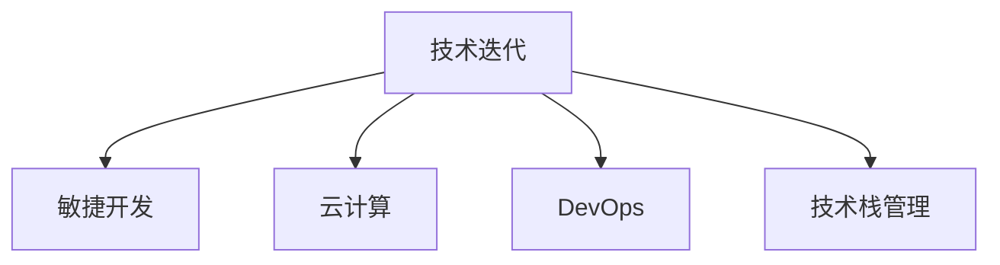

                 

## 1. 背景介绍

### 1.1 问题由来
AI创业公司面临的最大挑战之一是技术迭代的速度。在过去的几年里，人工智能技术飞速发展，新的算法、模型、工具层出不穷。技术迭代不仅改变了创业公司的产品线，也改变了他们的市场地位和竞争力。许多创业公司发现，他们必须不断更新技术栈以保持领先。

### 1.2 问题核心关键点
在技术迭代中，AI创业公司需要关注的核心点包括：

- **快速响应**：如何迅速识别并应用最新的技术，以保持竞争优势。
- **成本控制**：技术迭代往往需要大量的资源投入，如何在成本和效果之间找到平衡。
- **团队适应**：如何培训和发展团队，以适应新旧技术的交替。
- **技术选型**：在众多技术中选择最适合的，以满足业务需求。
- **可扩展性**：系统架构和数据处理流程需要支持未来的技术发展。

本文将深入探讨这些核心问题，并提供一些实践中的建议和策略。

## 2. 核心概念与联系

### 2.1 核心概念概述

为了更好地理解AI创业公司在技术迭代中面临的问题，我们需要先介绍一些核心概念：

- **技术迭代**：指技术在不断发展和演进的过程中，新的技术、算法和工具被引入，原有的技术被淘汰或更新。
- **敏捷开发**：一种快速响应变化的方法，通过快速构建、测试、迭代和发布，以适应技术迭代的需求。
- **云计算**：一种提供按需资源和服务的模型，可以迅速扩展和缩小资源，支持灵活的技术迭代。
- **DevOps**：一种结合软件开发和运维的方法，通过自动化、持续集成和持续部署，提高技术迭代的效率和质量。
- **技术栈管理**：管理和优化技术栈，确保系统架构的合理性和可维护性，以支持未来的技术发展。

这些概念之间的联系可以通过以下Mermaid流程图来展示：



这个流程图展示技术迭代与其他关键概念的关系：

- 技术迭代需要敏捷开发来快速响应变化。
- 云计算提供了快速扩展和缩减资源的能力，支持敏捷开发。
- DevOps通过自动化和持续集成来提高技术迭代的效率和质量。
- 技术栈管理确保系统架构的合理性和可维护性，为未来的技术发展提供支持。

## 3. 核心算法原理 & 具体操作步骤
### 3.1 算法原理概述

AI创业公司在技术迭代中，通常需要遵循以下算法原理：

1. **识别技术趋势**：通过监控学术会议、技术博客和开源社区，识别新兴技术。
2. **评估技术影响**：分析新技术对现有系统的影响，包括性能、成本和安全性。
3. **制定迭代计划**：根据技术评估结果，制定迭代计划，包括新技术的引入、旧技术的淘汰和过渡期的管理。
4. **实施和监控**：执行技术迭代计划，监控新技术的表现，及时调整和优化。

### 3.2 算法步骤详解

基于上述算法原理，AI创业公司进行技术迭代的一般步骤包括：

1. **技术监测和评估**：
   - 建立技术监测机制，定期扫描最新的研究论文、开源项目和技术博客。
   - 对新兴技术进行评估，包括技术成熟度、适用场景和潜在风险。
   - 对现有技术进行评估，包括性能、成本和稳定性。

2. **制定迭代计划**：
   - 根据技术评估结果，制定详细的技术迭代计划。
   - 确定引入新技术的时间表和优先级，考虑技术过渡期的管理。
   - 定义评估指标和标准，以衡量新技术的效果。

3. **实施和监控**：
   - 实施技术迭代计划，引入新技术并逐步淘汰旧技术。
   - 监控新技术的表现，包括性能、稳定性和用户反馈。
   - 根据监控结果，及时调整和优化技术栈。

4. **团队培训和发展**：
   - 对团队进行新旧技术对比培训，确保团队成员理解技术迭代的内容和目的。
   - 提供必要的学习资源和工具，支持团队成员掌握新技术。

5. **反馈和改进**：
   - 收集用户和团队的反馈，评估技术迭代的成效。
   - 根据反馈，持续改进技术迭代过程，优化技术栈管理。

### 3.3 算法优缺点

技术迭代的优点包括：

- **提高竞争力**：通过引入最新技术，创业公司能够提供更先进的产品和服务。
- **优化资源利用**：新技术通常更高效，能够优化资源利用，降低成本。
- **增强适应性**：通过不断更新技术栈，创业公司能够适应快速变化的市场需求。

技术迭代的主要缺点包括：

- **成本高昂**：引入新技术可能需要大量的资源投入，包括人力、时间和金钱。
- **风险存在**：新技术可能存在未知风险，影响系统的稳定性和安全性。
- **学习曲线陡峭**：团队需要时间来适应新技术，可能面临技能提升的挑战。

### 3.4 算法应用领域

技术迭代的应用领域广泛，涵盖多个行业和领域，包括：

- **金融科技**：引入机器学习和深度学习技术，优化风险管理和客户服务。
- **医疗健康**：采用自然语言处理和计算机视觉技术，提升医疗诊断和治疗效率。
- **零售电商**：引入推荐系统和供应链优化技术，改善用户体验和运营效率。
- **物流运输**：应用物联网和机器学习技术，优化物流配送和供应链管理。
- **智能制造**：采用自动化和机器学习技术，提高生产效率和产品质量。

## 4. 数学模型和公式 & 详细讲解 & 举例说明

### 4.1 数学模型构建

为了更好地理解技术迭代过程中的一些关键决策，我们可以构建一个数学模型。这里假设创业公司需要评估两种新技术 $A$ 和 $B$，每种技术需要投入的资源成本分别为 $C_A$ 和 $C_B$，新技术 $A$ 和 $B$ 分别带来的性能提升为 $P_A$ 和 $P_B$。

我们定义一个性能提升比 $R$ 来衡量两种技术的相对优势：

$$ R = \frac{P_A}{C_A} \div \frac{P_B}{C_B} $$

这个比值越大，说明新技术 $A$ 相对于新技术 $B$ 的优势越明显。

### 4.2 公式推导过程

为了更好地理解 $R$ 的定义和计算，我们可以通过一些具体的例子来推导。

假设新技术 $A$ 和 $B$ 分别需要投入 $10,000 和 20,000 的资源成本，分别带来 $20%$ 和 $30%$ 的性能提升。则：

$$ P_A = 0.2 \times 10,000 = 2,000 $$
$$ P_B = 0.3 \times 20,000 = 6,000 $$

代入 $R$ 的定义，我们得到：

$$ R = \frac{2,000}{10,000} \div \frac{6,000}{20,000} = \frac{1}{5} \div \frac{3}{10} = \frac{2}{3} $$

这个结果表明，新技术 $A$ 相对于新技术 $B$ 的优势相对较小。

### 4.3 案例分析与讲解

在实际案例中，企业可以通过类似的方法评估不同技术的优势。例如，Google在引入TensorFlow之前，评估了不同的机器学习框架，包括Caffe、Theano和PyTorch。通过计算性能提升比 $R$，Google最终选择了TensorFlow，因为其性能提升比最大。

## 5. 项目实践：代码实例和详细解释说明

### 5.1 开发环境搭建

要进行技术迭代，首先需要搭建一个开发环境。这里以云计算平台AWS为例，介绍如何搭建一个高性能的开发环境。

1. **创建EC2实例**：
   - 登录AWS管理控制台。
   - 选择“EC2”服务，创建新的EC2实例。
   - 选择合适的实例类型（如 t2.micro、c5.4xlarge 等），确保有足够的计算资源。

2. **安装依赖**：
   - 安装必要的软件和库，如Python、Anaconda、Jupyter Notebook、Git等。
   - 安装依赖库，如TensorFlow、PyTorch、Scikit-learn等。

3. **设置持续集成**：
   - 配置Git仓库，设置持续集成工具如Jenkins、Travis CI等。
   - 编写持续集成脚本，自动构建和测试代码。

### 5.2 源代码详细实现

这里我们以TensorFlow为例，介绍如何实现一个简单的机器学习模型。

1. **数据准备**：
   - 准备训练集和测试集，确保数据的质量和多样性。
   - 将数据转换为TensorFlow可接受的格式。

2. **模型实现**：
   - 定义模型结构，包括输入层、隐藏层和输出层。
   - 编写训练函数，定义优化器、损失函数和学习率。

3. **训练和评估**：
   - 在EC2实例上运行训练脚本，进行模型训练。
   - 在测试集上评估模型性能，计算准确率、召回率、F1值等指标。

### 5.3 代码解读与分析

以下是TensorFlow模型的代码实现：

```python
import tensorflow as tf
from sklearn.datasets import load_iris
from sklearn.model_selection import train_test_split

# 加载数据
iris = load_iris()
X_train, X_test, y_train, y_test = train_test_split(iris.data, iris.target, test_size=0.2)

# 定义模型
model = tf.keras.Sequential([
    tf.keras.layers.Dense(64, activation='relu', input_shape=(4,)),
    tf.keras.layers.Dense(3, activation='softmax')
])

# 定义损失函数和优化器
loss_fn = tf.keras.losses.SparseCategoricalCrossentropy()
optimizer = tf.keras.optimizers.Adam()

# 定义训练函数
def train(model, dataset, loss_fn, optimizer):
    for epoch in range(50):
        loss = 0
        for batch in dataset:
            x, y = batch
            with tf.GradientTape() as tape:
                logits = model(x)
                loss = loss_fn(y, logits)
            grads = tape.gradient(loss, model.trainable_variables)
            optimizer.apply_gradients(zip(grads, model.trainable_variables))
            loss += loss_fn(y, logits)
        print('Epoch:', epoch, 'Loss:', loss)

# 训练模型
train(model, (X_train, y_train), loss_fn, optimizer)
```

这段代码实现了一个简单的神经网络模型，用于分类鸢尾花数据集。代码中使用了TensorFlow的高级API，使得模型定义和训练过程非常简洁高效。

### 5.4 运行结果展示

在训练完毕后，我们可以通过测试集来评估模型的性能。例如，我们可以计算模型的准确率和F1值：

```python
# 评估模型
test_loss = model.evaluate(X_test, y_test)
print('Test Loss:', test_loss)
```

这段代码将返回测试集的损失值，用于评估模型的性能。

## 6. 实际应用场景

### 6.1 智能推荐系统

智能推荐系统是AI创业公司常见的应用场景。推荐系统的核心技术包括协同过滤、矩阵分解、深度学习等。在技术迭代中，推荐系统可以引入新的算法和模型，以提高推荐效果和用户体验。

例如，使用深度学习技术可以构建推荐模型，通过用户行为数据和商品信息，预测用户可能感兴趣的物品。通过持续迭代，可以不断优化推荐模型，提升推荐效果。

### 6.2 语音识别系统

语音识别系统是AI创业公司另一个常见的应用场景。语音识别系统的核心技术包括声学模型、语言模型和解码器。在技术迭代中，语音识别系统可以引入新的声学模型和语言模型，以提高识别准确率和响应速度。

例如，使用深度学习技术可以构建声学模型，通过语音信号和文本标签，训练模型进行语音识别。通过持续迭代，可以不断优化声学模型和语言模型，提升识别效果。

### 6.3 智能客服系统

智能客服系统是AI创业公司的另一个重要应用场景。智能客服系统的核心技术包括自然语言处理、情感分析和意图识别等。在技术迭代中，智能客服系统可以引入新的自然语言处理技术，以提高对话质量和用户体验。

例如，使用深度学习技术可以构建意图识别模型，通过用户问题和对话历史，识别用户的意图。通过持续迭代，可以不断优化意图识别模型，提升对话效果。

## 7. 工具和资源推荐

### 7.1 学习资源推荐

为了帮助AI创业公司更好地应对技术迭代，这里推荐一些学习资源：

1. **《深度学习》课程**：斯坦福大学开设的深度学习课程，涵盖了深度学习的基础知识和实践技巧。
2. **《TensorFlow官方文档》**：TensorFlow的官方文档，提供了详细的API和示例代码。
3. **《Python机器学习》书籍**：Sebastian Raschka的书籍，详细介绍了Python在机器学习中的应用。
4. **Kaggle竞赛**：Kaggle平台上的机器学习和数据科学竞赛，提供了大量的数据集和挑战，可以锻炼实战能力。
5. **Google Colab**：Google提供的免费Jupyter Notebook环境，可以方便地进行模型训练和测试。

### 7.2 开发工具推荐

以下是一些推荐的开发工具：

1. **Git**：版本控制系统，支持分布式版本控制和团队协作。
2. **Jupyter Notebook**：交互式开发环境，支持代码编写和结果展示。
3. **TensorFlow**：开源深度学习框架，支持分布式计算和GPU加速。
4. **PyTorch**：开源深度学习框架，支持动态计算图和GPU加速。
5. **Keras**：高层次深度学习框架，支持快速构建和训练模型。

### 7.3 相关论文推荐

以下是一些推荐的相关论文：

1. **《深度学习》书籍**：Ian Goodfellow的书籍，详细介绍了深度学习的基本概念和算法。
2. **《神经网络与深度学习》书籍**：Michael Nielsen的书籍，介绍了神经网络和深度学习的基础知识和应用。
3. **《TensorFlow源码剖析》书籍**：Howard Chen的书籍，详细介绍了TensorFlow的源码和实现原理。
4. **《PyTorch源码剖析》书籍**：Khalil Bouhraa的书籍，详细介绍了PyTorch的源码和实现原理。
5. **《机器学习实战》书籍**：Peter Harrington的书籍，提供了机器学习的实战案例和代码示例。

## 8. 总结：未来发展趋势与挑战

### 8.1 总结

本文对AI创业公司如何应对技术迭代进行了全面系统的介绍。首先，我们明确了技术迭代对AI创业公司的意义和影响，然后深入探讨了技术迭代过程中的一些核心问题，并提供了一些实践中的建议和策略。

通过本文的系统梳理，我们可以看到，AI创业公司需要在技术迭代中保持灵活性、控制成本，并注重团队发展。只有在数据、算法、工程、业务等多个维度协同发力，才能真正实现技术迭代的目标。

### 8.2 未来发展趋势

展望未来，AI创业公司在技术迭代中可能会面临以下趋势：

1. **自动化和智能化**：自动化工具和智能化平台将帮助创业公司更快速地进行技术迭代。
2. **云计算和大数据**：云计算和大数据技术将提供更高效的资源和更丰富的数据源，支持技术迭代。
3. **跨领域融合**：跨领域技术的融合，如计算机视觉、自然语言处理和物联网，将带来更多的创新和应用。
4. **人工智能伦理**：人工智能伦理问题将受到更多关注，技术迭代需要考虑伦理和安全性。
5. **持续学习**：人工智能系统需要持续学习，不断优化和改进，以应对快速变化的市场需求。

### 8.3 面临的挑战

尽管AI创业公司在技术迭代中取得了一定的进展，但仍面临诸多挑战：

1. **资源瓶颈**：技术迭代需要大量的计算资源和数据资源，可能面临资源不足的问题。
2. **成本高昂**：技术迭代需要大量的资金投入，可能对创业公司的财务状况造成压力。
3. **技术复杂性**：新技术的引入和实施可能涉及复杂的工程和科学问题。
4. **团队适应性**：团队成员需要不断学习和适应新技术，可能需要较高的培训成本。
5. **系统稳定性**：技术迭代可能导致系统的不稳定性和安全性问题。

### 8.4 研究展望

未来，AI创业公司需要在以下几个方面进行深入研究：

1. **资源优化**：探索资源优化技术，提高技术迭代的效率和质量。
2. **成本控制**：寻找成本效益更高的技术迭代方法，降低财务压力。
3. **技术培训**：提供持续的技术培训，帮助团队成员掌握新技术。
4. **系统稳定性**：研究技术迭代的系统稳定性问题，确保系统的可靠性和安全性。
5. **伦理和安全性**：研究人工智能伦理和安全性问题，确保技术迭代的道德性和安全性。

总之，AI创业公司在技术迭代中需要综合考虑多个因素，通过不断探索和实践，找到最适合自身发展的路径。只有不断创新和优化，才能在竞争激烈的市场上占据优势地位。

## 9. 附录：常见问题与解答

### Q1：技术迭代如何平衡成本和效果？

A: 技术迭代需要平衡成本和效果，以下是一些建议：

- **渐进式迭代**：采用渐进式迭代方法，逐步引入新技术，降低一次性投入的成本。
- **优先级排序**：根据业务需求和技术成熟度，优先引入最关键的技术。
- **成本效益分析**：进行成本效益分析，评估不同技术方案的优势和劣势，选择最优方案。
- **资源共享**：共享资源，减少重复投入，提高资源利用率。

### Q2：如何选择合适的技术栈？

A: 选择合适的技术栈需要考虑以下几个因素：

- **业务需求**：根据业务需求选择最合适的技术栈。
- **技术成熟度**：选择技术成熟度高、稳定性强的技术栈。
- **社区支持**：选择有活跃社区支持的技术栈，方便获取技术支持和资源。
- **成本效益**：评估技术栈的成本效益，选择性价比高的方案。
- **团队技能**：考虑团队成员的技能水平和经验，选择易于上手的技术栈。

### Q3：如何进行技术迭代的风险管理？

A: 技术迭代中，风险管理至关重要。以下是一些建议：

- **建立风险评估机制**：建立风险评估机制，定期评估技术迭代的潜在风险。
- **制定应急预案**：制定应急预案，确保在技术迭代出现问题时能够迅速应对。
- **引入第三方评估**：引入第三方评估机构，进行技术迭代的独立评估和审计。
- **监控和反馈**：持续监控技术迭代的表现，根据反馈及时调整和优化。

### Q4：如何进行团队培训和发展？

A: 团队培训和发展是技术迭代的重要组成部分。以下是一些建议：

- **制定培训计划**：制定详细的培训计划，明确培训目标和内容。
- **引入在线资源**：引入在线资源，如课程、视频、文档等，方便团队成员自主学习。
- **提供实战机会**：提供实战机会，让团队成员在实际项目中应用新技术。
- **建立学习文化**：建立学习文化，鼓励团队成员持续学习和交流。
- **引入导师制度**：引入导师制度，帮助团队成员解决技术难题和提升技能。

总之，技术迭代是AI创业公司保持竞争力的重要手段，但需要综合考虑多个因素，通过不断探索和实践，找到最适合自身发展的路径。只有不断创新和优化，才能在竞争激烈的市场上占据优势地位。

---

作者：禅与计算机程序设计艺术 / Zen and the Art of Computer Programming

