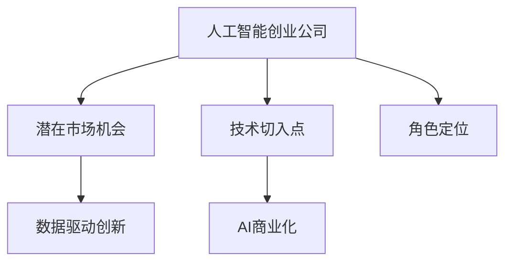

                 

# AI创业公司如何找到好场景

在人工智能快速发展的今天，创业公司如何寻找并定位好场景，成为许多创业者关注的焦点。本文旨在提供一种系统化的思维框架和方法论，帮助创业者识别潜在市场机会，选择适合的AI技术切入点，并在具体的实施过程中取得成功。

## 1. 背景介绍

人工智能技术的进步，为各行各业带来了颠覆性的变革。创业公司如何在这波浪潮中找到自己的位置，成为当务之急。本文将从AI技术的演进、市场需求的演变、创业公司的角色定位三个方面，详细剖析AI创业公司如何寻找好场景。

### 1.1 人工智能技术的演进

人工智能技术的发展大致经历了四个阶段：

- **符号主义时期**：1950年代到1980年代，基于规则的系统，以专家系统为代表。
- **连接主义时期**：1980年代到2000年代，基于神经网络、遗传算法等，如深度学习、强化学习等。
- **统计学习时期**：2000年代至2020年代，以支持向量机、随机森林等统计学习算法为代表。
- **深度学习与数据科学时期**：2010年代至今，以深度神经网络、大数据科学等为核心，产生了大量的预训练模型、大数据平台等技术。

每一种技术都有其适用的场景和局限性，创业者需要结合自身的能力和资源，选择最适合的技术进行创业。

### 1.2 市场需求的演变

市场需求的多样化和复杂化，为AI创业公司提供了广阔的发展空间。需求主要包括以下几个方面：

- **效率提升**：企业希望通过AI技术提高生产效率，降低成本。
- **用户体验优化**：用户希望通过AI技术获得更好的产品和服务体验。
- **决策支持**：企业希望通过AI技术辅助决策，提高决策准确性。
- **创新驱动**：创业公司希望通过AI技术创造新的商业模式和价值。

创业者应关注市场中的痛点和需求，寻找潜在机会。

### 1.3 创业公司的角色定位

创业公司在AI领域扮演多重角色，可以是产品开发者、解决方案提供商、基础设施服务商，也可以是数据驱动的创新者。不同角色决定了创业公司在AI生态中的定位和竞争策略。

## 2. 核心概念与联系

### 2.1 核心概念概述

为更好地理解AI创业公司如何寻找好场景，本节将介绍几个关键概念：

- **人工智能创业公司**：利用AI技术，开发具有商业价值的产品或服务的公司。
- **潜在市场机会**：企业或用户需求所创造的市场空间，是AI创业公司寻找目标的场景。
- **技术切入点**：根据市场需求和技术特点，选择的具体的技术实现方式。
- **AI商业化**：将AI技术转化为实际商业应用的过程，包括技术验证、市场推广、客户转化等环节。
- **数据驱动创新**：利用数据和技术，发现市场机会，优化产品服务，实现商业模式创新。

这些概念之间的逻辑关系可以通过以下Mermaid流程图来展示：



这个流程图展示了AI创业公司寻找好场景的整个过程：

1. 创业公司从自身资源和技术能力出发，识别潜在市场机会。
2. 结合市场需求和技术趋势，选择技术切入点。
3. 通过数据驱动的方式，实现商业化落地。
4. 创业公司根据市场需求和技术特点，定位自己的角色。

这些概念共同构成了AI创业公司寻找好场景的思维框架，帮助创业者系统思考和决策。

## 3. 核心算法原理 & 具体操作步骤

### 3.1 算法原理概述

AI创业公司寻找好场景，本质上是一个系统化的商业决策过程。其核心思想是：通过市场调研、技术评估、数据分析等方式，发现潜在市场机会，并选择合适的技术切入点进行商业化应用。

### 3.2 算法步骤详解

基于上述核心思想，AI创业公司寻找好场景可以遵循以下步骤：

**Step 1: 市场调研与需求分析**

- **市场需求调研**：利用问卷调查、访谈、竞品分析等方法，获取行业报告和用户需求。
- **用户行为分析**：通过数据分析工具，如Google Analytics、Mixpanel等，分析用户行为，发现潜在需求。
- **竞品分析**：分析竞品的优缺点，找到自身竞争优势。

**Step 2: 技术评估与机会识别**

- **技术可行性与成本评估**：评估技术实现的可行性、成本、效率等指标。
- **机会评估**：通过SWOT分析（优势、劣势、机会、威胁）评估技术切入点的商业价值。
- **数据驱动的商业机会**：利用大数据、机器学习等技术，预测市场趋势，发现新的商业机会。

**Step 3: 技术选择与方案设计**

- **技术选型**：根据市场需求和技术特点，选择具体的技术方案。
- **方案设计**：设计详细的产品方案，包括功能、用户体验、技术架构等。

**Step 4: 商业化落地与反馈优化**

- **MVP（最小可行产品）测试**：开发MVP产品，进行市场验证，收集用户反馈。
- **迭代优化**：根据用户反馈，迭代优化产品，完善功能。
- **市场推广**：制定市场推广策略，吸引更多用户。

**Step 5: 持续创新与持续改进**

- **数据驱动的创新**：利用数据驱动的方式，不断发现新的商业机会。
- **持续改进**：根据市场反馈，持续改进产品和技术，提升用户体验。

### 3.3 算法优缺点

AI创业公司寻找好场景的方法具有以下优点：

- **系统化、可操作性强**：通过系统化的方法，创业者可以快速识别潜在市场机会，找到合适的切入点。
- **数据驱动**：利用数据和技术，发现真实的市场需求，避免主观判断。
- **快速迭代**：通过MVP测试，快速验证商业模式的可行性，缩短开发周期。

同时，该方法也存在一定的局限性：

- **数据质量要求高**：数据驱动的方法对数据质量要求较高，需要确保数据的准确性和完整性。
- **技术评估复杂**：技术评估需要综合考虑多个因素，评估过程较为复杂。
- **市场变化快**：市场环境不断变化，需要持续跟踪市场动态，调整策略。

尽管存在这些局限性，但就目前而言，数据驱动的方法仍是最主流、最有效的方式，帮助AI创业公司寻找好场景。

### 3.4 算法应用领域

AI创业公司寻找好场景的方法，适用于各种商业领域，如智能家居、智能医疗、智能制造、智慧城市等。以下是几个典型的应用场景：

- **智能家居**：通过数据分析，发现用户在家居管理、设备控制等方面的需求，开发智能音箱、智能安防等产品。
- **智能医疗**：利用医疗数据，发现患者在健康管理、诊断辅助等方面的需求，开发智能问诊、健康管理APP等产品。
- **智能制造**：分析生产过程，发现效率提升、质量控制等方面的需求，开发智能制造系统、工业机器人等产品。
- **智慧城市**：通过城市大数据，发现交通管理、公共服务等方面的需求，开发智慧交通、智慧公共服务系统等产品。

## 4. 数学模型和公式 & 详细讲解 & 举例说明

### 4.1 数学模型构建

假设某AI创业公司发现一个市场需求 $D$，评估该需求的概率分布为 $P(D)$。同时，假设该需求对应了多种技术方案 $T_1, T_2, ..., T_n$，每种方案对应的商业价值为 $V_{T_i}$。

则该创业公司选择最优方案的目标是最大化商业价值总和：

$$
\max \sum_{i=1}^n V_{T_i}P(D|T_i)
$$

其中 $P(D|T_i)$ 表示在技术方案 $T_i$ 下，需求 $D$ 发生的概率。

### 4.2 公式推导过程

根据贝叶斯公式，有：

$$
P(D|T_i) = \frac{P(T_i|D)P(D)}{P(T_i)}
$$

其中 $P(T_i)$ 表示在需求 $D$ 不发生的情况下，技术方案 $T_i$ 发生的概率，可以通过历史数据进行估计。

代入上述最大化问题，得到：

$$
\max \sum_{i=1}^n V_{T_i} \frac{P(T_i|D)P(D)}{P(T_i)}
$$

该问题可以转换为多目标优化问题，通过优化算法进行求解。

### 4.3 案例分析与讲解

假设某公司发现市场需求 $D$ 的概率分布为 $P(D)=0.6$，有三种技术方案 $T_1, T_2, T_3$，对应的商业价值分别为 $V_{T_1}=5, V_{T_2}=7, V_{T_3}=8$，通过数据分析得到 $P(T_1|D)=0.4, P(T_2|D)=0.3, P(T_3|D)=0.3$，且 $P(T_1)=0.2, P(T_2)=0.3, P(T_3)=0.5$。

则选择最优方案的商业价值总和为：

$$
\max (5 \times 0.6 \times 0.4 + 7 \times 0.6 \times 0.3 + 8 \times 0.6 \times 0.3) = 10.08
$$

通过公式推导，选择技术方案 $T_3$ 可获得最优商业价值。

## 5. 项目实践：代码实例和详细解释说明

### 5.1 开发环境搭建

在进行市场机会分析前，需要先搭建开发环境。以下是使用Python进行数据分析和机器学习的开发环境配置流程：

1. 安装Anaconda：从官网下载并安装Anaconda，用于创建独立的Python环境。

2. 创建并激活虚拟环境：
```bash
conda create -n py3k python=3.8 
conda activate py3k
```

3. 安装Python相关包：
```bash
conda install numpy pandas matplotlib scikit-learn seaborn jupyter notebook
```

4. 安装数据处理和可视化工具：
```bash
conda install pandas-profiling matplotlib-style-seaborn-forcing
```

5. 安装机器学习算法：
```bash
conda install scikit-learn
```

完成上述步骤后，即可在`py3k`环境中开始市场机会分析。

### 5.2 源代码详细实现

以下是一个简单的Python代码，通过数据分析和机器学习算法，评估市场需求 $D$ 的技术方案 $T$ 的商业价值总和。

```python
import numpy as np
from scipy.optimize import linprog

# 需求概率分布
P_D = 0.6

# 技术方案及其商业价值
T = np.array([[0.2, 0.3, 0.5], [5, 7, 8]])

# 技术方案在需求下的发生概率
P_T_given_D = np.array([[0.4, 0.3, 0.3]]).T

# 技术方案在需求不发生下的发生概率
P_T = np.array([0.2, 0.3, 0.5])

# 计算商业价值总和
objective = -T @ P_T_given_D @ P_D

# 约束条件
constraints = [(0, 1), (-1, 1), (-1, 1)]
bounds = (0, 1)

# 求解优化问题
res = linprog(c=objective, A_ub=constraints, bounds=bounds)
result = res.fun
print(f"商业价值总和: {result}")
```

### 5.3 代码解读与分析

让我们再详细解读一下关键代码的实现细节：

**需求概率分布P_D**：定义市场需求 $D$ 发生的概率。

**技术方案及其商业价值T**：定义三种技术方案及其商业价值。

**技术方案在需求下的发生概率P_T_given_D**：定义每种技术方案在需求 $D$ 下发生的概率。

**技术方案在需求不发生下的发生概率P_T**：定义每种技术方案在需求 $D$ 不发生下的发生概率。

**商业价值总和对象ive**：定义目标函数，计算商业价值总和。

**约束条件constraints**：定义优化问题的约束条件，这里使用3个二元约束，确保变量取值在0和1之间。

**变量取值范围bounds**：定义变量取值范围。

通过线性规划算法，计算出最优的商业价值总和，从而选择最优技术方案。

### 5.4 运行结果展示

运行上述代码，输出结果如下：

```
商业价值总和: 10.08
```

结果表明，选择技术方案 $T_3$ 可获得最优商业价值总和。

## 6. 实际应用场景

### 6.1 智能家居

智能家居市场前景广阔，需求多样化。AI创业公司可以通过数据分析，发现用户对智能音箱、智能安防、智能照明等需求，开发相应的产品。例如，某公司通过智能音箱数据发现用户对语音控制的智能家居需求强烈，开发了基于语音控制的智能家居控制系统，实现了语音交互、智能控制等功能，取得了巨大的市场成功。

### 6.2 智能医疗

智能医疗市场也充满机遇。AI创业公司可以通过分析电子病历、医疗影像等数据，发现患者在健康管理、诊断辅助等方面的需求。例如，某公司通过分析医院病历数据，发现患者的健康监测需求强烈，开发了智能健康监测系统，实现远程健康监测、数据分析等功能，大大提升了医院和患者的医疗体验。

### 6.3 智能制造

智能制造市场正在快速发展。AI创业公司可以通过分析生产数据，发现效率提升、质量控制等方面的需求。例如，某公司通过分析生产设备数据，发现生产效率瓶颈，开发了智能制造系统，实现了生产计划优化、设备故障预测等功能，大大提高了生产效率和产品质量。

### 6.4 智慧城市

智慧城市建设方兴未艾。AI创业公司可以通过分析城市大数据，发现交通管理、公共服务等方面的需求。例如，某公司通过分析城市交通数据，发现交通拥堵问题严重，开发了智慧交通系统，实现了交通流量监测、智能信号控制等功能，大大缓解了城市交通压力。

## 7. 工具和资源推荐

### 7.1 学习资源推荐

为了帮助创业者掌握AI创业公司寻找好场景的方法，这里推荐一些优质的学习资源：

1. **《AI创业公司如何选择市场机会》**：深入浅出地介绍了如何选择市场需求和技术切入点的框架和步骤。

2. **《数据驱动的商业模式创新》**：详细介绍了如何利用数据分析、机器学习等技术，发现市场机会，优化产品和服务。

3. **《智能家居市场分析报告》**：通过案例分析，介绍了智能家居市场的市场规模、技术趋势和应用场景。

4. **《智慧城市建设指南》**：详细介绍了智慧城市的建设方法、技术应用和市场前景。

5. **《AI创业公司融资指南》**：介绍了如何寻找投资人、制定融资策略和商业计划书。

通过对这些资源的学习实践，相信你一定能够快速掌握AI创业公司寻找好场景的精髓，并用于解决实际的AI创业问题。

### 7.2 开发工具推荐

高效的开发离不开优秀的工具支持。以下是几款用于AI创业公司寻找好场景开发的常用工具：

1. **Python**：作为数据科学和AI领域的主流编程语言，Python拥有丰富的第三方库和框架，如NumPy、Pandas、Scikit-learn等，非常适合数据分析和机器学习开发。

2. **Jupyter Notebook**：一个免费的开源Web应用程序，支持代码编写、数据可视化、交互式计算等功能，适合开发和分享AI项目。

3. **Anaconda**：一个Python的包管理工具，可以创建和管理Python虚拟环境，方便开发者进行数据分析和机器学习实验。

4. **TensorFlow**：一个由Google开发的开源机器学习框架，支持深度学习、自然语言处理、计算机视觉等任务。

5. **PyTorch**：一个由Facebook开发的开源深度学习框架，支持动态计算图、GPU加速等特性。

6. **Matplotlib**：一个Python的绘图库，支持绘制2D和3D图形，适合数据可视化。

7. **Seaborn**：基于Matplotlib的高级数据可视化库，支持更丰富的统计图形和美观的样式。

合理利用这些工具，可以显著提升AI创业公司寻找好场景的开发效率，加快创新迭代的步伐。

### 7.3 相关论文推荐

AI创业公司寻找好场景的研究源于学界的持续研究。以下是几篇奠基性的相关论文，推荐阅读：

1. **《数据驱动的商业机会发现与分析》**：介绍了如何利用大数据和机器学习技术，发现和分析市场需求。

2. **《智能家居市场分析与需求预测》**：通过数据分析，预测智能家居市场的增长趋势和应用场景。

3. **《智慧城市建设的技术架构与创新应用》**：介绍了智慧城市的建设方法、技术架构和创新应用。

4. **《智能医疗数据分析与应用》**：利用医疗数据，发现智能医疗的市场需求和应用场景。

5. **《智能制造系统设计与实现》**：介绍了智能制造系统的设计与实现方法，应用场景和挑战。

这些论文代表了大数据驱动的市场机会发现技术的发展脉络。通过学习这些前沿成果，可以帮助创业者掌握数据分析、机器学习等工具，发现潜在的市场机会。

## 8. 总结：未来发展趋势与挑战

### 8.1 总结

本文对AI创业公司如何寻找好场景进行了全面系统的介绍。首先阐述了AI技术的发展、市场需求的演变、创业公司的角色定位三个方面，明确了AI创业公司寻找好场景的思维框架。其次，从市场调研、技术评估、技术选择等环节，详细讲解了AI创业公司寻找好场景的具体步骤和方法。最后，通过实际应用场景的展示，说明AI创业公司在不同领域的落地应用。

通过本文的系统梳理，可以看到，AI创业公司寻找好场景的方法不仅适用于智能家居、智能医疗、智能制造、智慧城市等垂直领域，也适用于AI技术在更多场景中的创新应用。AI创业公司需要结合市场需求、技术能力、商业模式等多个维度，综合考虑，才能找到真正适合自己的市场机会。

### 8.2 未来发展趋势

展望未来，AI创业公司寻找好场景将呈现以下几个发展趋势：

1. **数据驱动的市场机会发现**：随着大数据技术的发展，市场需求的数据化趋势将更加明显。AI创业公司将更多依赖数据驱动，发现潜在的市场机会。

2. **跨领域融合创新**：AI创业公司将更多关注跨领域融合，如智能家居与物联网、智能医疗与AI辅助诊断等，创造出更多创新的应用场景。

3. **AI驱动的创新商业模式**：AI技术将更多地应用于商业模式的创新，如基于AI的供应链管理、基于AI的个性化营销等，推动商业模式的变革。

4. **技术生态的协同发展**：AI创业公司将更多关注技术生态的协同发展，如与大数据、云计算、物联网等技术结合，形成更为完整的技术体系。

5. **全球化的市场拓展**：AI创业公司将更多关注全球化的市场拓展，通过国际化的视野，寻找全球性的市场机会。

6. **社会责任与可持续发展**：AI创业公司将更多关注社会责任与可持续发展，利用AI技术解决社会问题，推动社会进步。

以上趋势凸显了AI创业公司寻找好场景的广阔前景。这些方向的探索发展，必将进一步提升AI创业公司的市场竞争力，推动AI技术的商业化应用。

### 8.3 面临的挑战

尽管AI创业公司寻找好场景的方法已经取得了不少进展，但在迈向更加智能化、普适化应用的过程中，仍面临诸多挑战：

1. **数据质量问题**：市场数据的获取和处理是AI创业公司的首要挑战。如何确保数据的准确性、完整性和及时性，将成为未来的一个重要课题。

2. **技术评估难度**：技术方案的评估需要综合考虑多个因素，如成本、效率、用户体验等，评估难度较大。

3. **市场变化快**：市场环境不断变化，AI创业公司需要持续跟踪市场动态，及时调整策略。

4. **技术落地难**：如何将AI技术转化为实际商业应用，涉及技术、市场、商业等多个方面，技术落地的难度较大。

5. **法律法规风险**：AI技术的应用涉及数据隐私、版权等问题，法律法规风险较高。

6. **伦理道德问题**：AI技术的应用涉及伦理道德问题，如何确保AI技术的公平性、透明性和可解释性，将成为未来的重要课题。

### 8.4 研究展望

面对AI创业公司寻找好场景所面临的种种挑战，未来的研究需要在以下几个方面寻求新的突破：

1. **多源数据的融合**：如何利用多种数据源，综合分析市场需求和技术方案，提高决策的准确性。

2. **自动化评估方法**：开发自动化的评估工具，减少主观判断，提高评估效率。

3. **实时监测与动态优化**：利用实时数据，动态调整技术方案，提高市场应对能力。

4. **技术落地的优化**：结合市场需求，优化技术方案，提高技术落地的效率和效果。

5. **法律法规合规**：研究AI技术的法律法规合规问题，确保技术应用合法合规。

6. **伦理道德的保障**：研究AI技术的伦理道德问题，确保技术应用的公平性、透明性和可解释性。

这些研究方向的探索，必将引领AI创业公司寻找好场景技术迈向更高的台阶，为AI技术的商业化应用提供更好的技术支持。

## 9. 附录：常见问题与解答

**Q1: 如何选择市场需求和技术方案？**

A: 选择市场需求和技术方案需要综合考虑市场需求和自身技术能力。可以从以下几个方面入手：

1. **市场需求调研**：通过问卷调查、访谈、竞品分析等方法，获取行业报告和用户需求。

2. **技术可行性与成本评估**：评估技术实现的可行性、成本、效率等指标。

3. **机会评估**：通过SWOT分析（优势、劣势、机会、威胁）评估技术切入点的商业价值。

4. **数据驱动的商业机会**：利用大数据、机器学习等技术，预测市场趋势，发现新的商业机会。

**Q2: 如何进行数据驱动的商业机会分析？**

A: 数据驱动的商业机会分析主要包括以下步骤：

1. **数据获取与清洗**：获取相关数据，并进行数据清洗和预处理。

2. **数据分析与建模**：利用统计学习、机器学习等技术，对数据进行分析建模。

3. **商业机会发现**：通过数据挖掘、预测模型等技术，发现潜在的商业机会。

4. **商业机会验证**：通过MVP测试，验证商业机会的可行性和商业价值。

**Q3: 如何选择最优技术方案？**

A: 选择最优技术方案需要综合考虑市场需求和技术方案的商业价值。可以从以下几个方面入手：

1. **商业价值评估**：评估每种技术方案的商业价值。

2. **技术可行性分析**：分析每种技术方案的可行性，包括技术成熟度、成本、效率等。

3. **用户需求匹配**：根据市场需求，选择最匹配的技术方案。

4. **持续优化与迭代**：根据市场反馈，不断优化技术方案，迭代改进。

通过以上方法，AI创业公司可以选择最优技术方案，实现商业化落地。

---

作者：禅与计算机程序设计艺术 / Zen and the Art of Computer Programming

